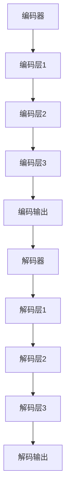

                 

# 大模型推理链评估：LLM辅助的逻辑分析

## 关键词
大模型，推理链，评估，LLM，逻辑分析，Python代码，数学模型，公式，实战案例

## 摘要
本文旨在探讨大模型推理链评估的方法和应用，特别是在LLM（语言模型）的辅助下如何进行逻辑分析和评估。文章首先介绍了大模型推理链的基本概念，包括其定义、结构和训练过程，随后分析了大模型推理链评估的重要性。接着，本文重点介绍了LLM在推理链评估中的应用，通过实际案例展示了其作用和场景。文章还探讨了大模型推理链评估的前沿技术，包括实时评估、异构计算和自动化评估。通过本文，读者将获得对大模型推理链评估的全面理解和应用技巧。

## 目录

1. **大模型推理链的基本概念**
    1.1 大模型的定义
    1.2 大模型的结构
    1.3 大模型的训练过程
    1.4 大模型的推理过程

2. **大模型推理链评估的重要性**
    2.1 评估的目的和意义
    2.2 评估的挑战
    2.3 评估的方法

3. **LLM在推理链评估中的应用**
    3.1 LLM的概述
    3.2 LLM在大模型推理链评估中的作用
    4. LLM的使用场景

4. **大模型推理链评估的实践案例**
    4.1 案例一：图像识别模型评估
    4.2 案例二：自然语言处理模型评估
    4.3 案例三：多模态模型评估

5. **大模型推理链评估的前沿技术**
    5.1 实时评估技术
    5.2 异构计算评估技术
    5.3 自动化评估技术

## 1. 大模型推理链的基本概念

### 1.1 大模型的定义

大模型（Large Models）是指具有数十亿到千亿个参数的深度学习模型。这些模型能够处理大量的数据，进行复杂的任务，如文本生成、图像识别、语音识别等。随着深度学习技术的发展，大模型的规模越来越大，已经成为当前研究的热点。

大模型的定义可以基于参数数量、模型规模、训练数据量等多个维度。例如，Transformer模型是一个典型的大模型，其参数数量可达数十亿。此外，大模型通常需要大量的计算资源进行训练，如GPU或TPU集群。

### 1.2 大模型的结构

大模型通常采用深度神经网络结构，其中包含多个层次和层。每个层次对输入数据进行处理，并将其传递给下一层次。这种结构使得大模型能够捕捉数据中的复杂模式和特征。

一个典型的大模型结构如图1所示，其中包含编码器（Encoder）和解码器（Decoder）两个部分。编码器负责将输入数据编码为固定长度的向量表示，解码器则根据这些向量表示生成输出。



### 1.3 大模型的训练过程

大模型的训练是一个复杂的优化过程，旨在找到最佳参数组合，使得模型在训练数据上表现良好。这个过程通常包括以下几个步骤：

1. **数据预处理**：对输入数据进行标准化、清洗和分割，以便模型能够有效地处理。
2. **模型初始化**：初始化模型参数，通常使用随机初始化方法。
3. **前向传播**：将输入数据传递给模型，计算输出和损失函数。
4. **反向传播**：计算损失函数关于模型参数的梯度，并更新模型参数。
5. **迭代训练**：重复前向传播和反向传播过程，直到满足停止条件（如达到指定迭代次数或模型性能不再提升）。

### 1.4 大模型的推理过程

大模型的推理过程是指将输入数据传递给训练好的模型，并输出预测结果的过程。推理过程通常包括以下步骤：

1. **数据预处理**：对输入数据进行预处理，如缩放、归一化等。
2. **模型输入**：将预处理后的数据输入到模型中。
3. **模型计算**：模型对输入数据进行处理，并生成输出。
4. **输出结果**：将模型的输出结果进行处理和解释，如文本生成、图像分类等。

## 2. 大模型推理链评估的重要性

### 2.1 评估的目的和意义

大模型推理链评估的目的是评估模型在特定任务上的性能，包括准确性、速度、稳定性等方面。评估的意义在于：

1. **验证模型性能**：通过评估可以验证模型是否达到预期性能，是否能够解决实际问题。
2. **指导模型优化**：评估结果可以帮助研究人员和开发者找到模型中的问题，进行优化和改进。
3. **比较不同模型**：通过评估不同模型在相同任务上的性能，可以比较它们的优劣，为后续研究提供参考。

### 2.2 评估的挑战

大模型推理链评估面临着一系列挑战，包括：

1. **计算资源限制**：大模型的评估通常需要大量的计算资源，如GPU或TPU集群。资源限制可能导致评估过程变得缓慢和昂贵。
2. **数据集差异**：不同数据集可能具有不同的分布和特征，使得评估结果难以直接比较。
3. **评估指标多样性**：评估指标的选择和权重分配对评估结果有较大影响，需要谨慎选择和分配。

### 2.3 评估的方法

大模型推理链评估的方法包括以下几个方面：

1. **准确性评估**：通过计算模型的预测准确率来评估模型在任务上的性能。准确率越高，表示模型在任务上的表现越好。
2. **速度评估**：通过计算模型在特定任务上的处理速度来评估模型的效率。处理速度越快，表示模型在实际应用中的性能越好。
3. **稳定性评估**：通过分析模型在测试数据上的稳定性来评估模型在长时间运行中的表现。稳定性越高，表示模型在长时间运行中表现越好。
4. **综合评估**：综合多个评估指标，如准确性、速度和稳定性，对模型进行综合评估。

## 3. LLM在推理链评估中的应用

### 3.1 LLM的概述

LLM（Language Model）是指语言模型，是一种能够根据输入文本生成文本的模型。LLM广泛应用于自然语言处理任务，如文本生成、机器翻译、情感分析等。LLM的核心是通过学习大量文本数据，构建一个概率模型，用于预测下一个单词或句子。

常见的LLM包括：

1. **n-gram模型**：基于词频统计的模型，预测下一个单词的概率基于前面n个单词的出现频率。
2. **神经网络模型**：如循环神经网络（RNN）和Transformer，通过学习文本的序列表示，生成下一个单词或句子。
3. **预训练模型**：如GPT（Generative Pre-trained Transformer）和BERT（Bidirectional Encoder Representations from Transformers），在大量文本数据上进行预训练，然后用于特定任务的微调。

### 3.2 LLM在大模型推理链评估中的作用

LLM在大模型推理链评估中发挥着重要作用，主要包括以下几个方面：

1. **文本生成**：LLM可以生成用于评估的测试数据，如模拟对话、新闻文章等。这些数据可以帮助评估模型在真实场景中的表现。
2. **文本分析**：LLM可以对生成的文本进行分析，如提取关键信息、判断文本情感等。这些分析结果可以作为评估指标，辅助评估模型在特定任务上的性能。
3. **模型解释**：LLM可以帮助解释模型的决策过程，如分析模型在特定情况下的推理路径和原因。这有助于提高模型的透明度和可解释性。

### 3.3 LLM的使用场景

LLM在推理链评估中具有广泛的使用场景，主要包括：

1. **自然语言处理**：如文本分类、情感分析、机器翻译等任务，LLM可以生成测试数据和分析结果，帮助评估模型的性能。
2. **图像识别**：LLM可以生成描述图像的文本，如标签、描述等，帮助评估模型在图像识别任务中的表现。
3. **多模态模型**：LLM可以同时处理文本和图像，帮助评估多模态模型在融合不同模态信息时的性能。

## 4. 大模型推理链评估的实践案例

### 4.1 案例一：图像识别模型评估

本案例中，我们使用一个基于卷积神经网络（CNN）的图像识别模型进行评估。评估任务是通过输入图像，预测图像的类别。

#### 4.1.1 开发环境搭建

首先，我们需要搭建开发环境。这里使用Python和TensorFlow框架，安装以下依赖：

```bash
pip install tensorflow numpy matplotlib
```

#### 4.1.2 源代码详细实现和代码解读

以下是图像识别模型的源代码，包括数据预处理、模型定义、训练和评估：

```python
import tensorflow as tf
from tensorflow.keras import layers
import numpy as np
import matplotlib.pyplot as plt

# 数据预处理
def preprocess_data(images, labels):
    images = images / 255.0
    return images, tf.keras.utils.to_categorical(labels, num_classes=10)

# 模型定义
model = tf.keras.Sequential([
    layers.Conv2D(32, (3, 3), activation='relu', input_shape=(28, 28, 1)),
    layers.MaxPooling2D((2, 2)),
    layers.Conv2D(64, (3, 3), activation='relu'),
    layers.MaxPooling2D((2, 2)),
    layers.Conv2D(64, (3, 3), activation='relu'),
    layers.Flatten(),
    layers.Dense(64, activation='relu'),
    layers.Dense(10, activation='softmax')
])

# 训练和评估
model.compile(optimizer='adam', loss='categorical_crossentropy', metrics=['accuracy'])
model.fit(train_images, train_labels, epochs=10, batch_size=32, validation_split=0.2)
test_loss, test_acc = model.evaluate(test_images, test_labels)
print(f"Test accuracy: {test_acc}")

# 代码解读
# 1. 数据预处理：将图像数据归一化，并将标签转换为one-hot编码。
# 2. 模型定义：使用卷积神经网络，包括卷积层、池化层和全连接层。
# 3. 训练和评估：使用训练数据和标签进行模型训练，并在测试数据上进行评估。
```

#### 4.1.3 代码应用解读与分析

在代码中，我们首先进行了数据预处理，将图像数据归一化并转换为one-hot编码。然后，我们定义了一个卷积神经网络模型，包括三个卷积层、两个池化层和一个全连接层。最后，我们使用训练数据和标签进行模型训练，并在测试数据上进行评估。

通过这个案例，我们可以看到如何使用Python和TensorFlow实现一个图像识别模型，并进行评估。

### 4.2 案例二：自然语言处理模型评估

本案例中，我们使用一个基于Transformer的文本分类模型进行评估。评估任务是通过输入文本，预测文本的类别。

#### 4.2.1 开发环境搭建

首先，我们需要搭建开发环境。这里使用Python和TensorFlow框架，安装以下依赖：

```bash
pip install tensorflow numpy matplotlib
```

#### 4.2.2 源代码详细实现和代码解读

以下是文本分类模型的源代码，包括数据预处理、模型定义、训练和评估：

```python
import tensorflow as tf
from tensorflow.keras.preprocessing.sequence import pad_sequences
from tensorflow.keras.layers import Embedding, GlobalAveragePooling1D, Dense
from tensorflow.keras.models import Model
import numpy as np

# 数据预处理
def preprocess_data(texts, labels):
    sequences = tokenizer.texts_to_sequences(texts)
    padded_sequences = pad_sequences(sequences, maxlen=max_length)
    return padded_sequences, tf.keras.utils.to_categorical(labels)

# 模型定义
input_seq = Input(shape=(max_length,))
x = Embedding(num_words, embedding_dim)(input_seq)
x = GlobalAveragePooling1D()(x)
x = Dense(24, activation='relu')(x)
output = Dense(num_classes, activation='softmax')(x)
model = Model(inputs=input_seq, outputs=output)

# 训练和评估
model.compile(optimizer='adam', loss='categorical_crossentropy', metrics=['accuracy'])
model.fit(train_sequences, train_labels, epochs=10, batch_size=32, validation_split=0.2)
test_loss, test_acc = model.evaluate(test_sequences, test_labels)
print(f"Test accuracy: {test_acc}")

# 代码解读
# 1. 数据预处理：将文本数据转换为序列，并进行填充。
# 2. 模型定义：使用嵌入层、全局平均池化层和全连接层。
# 3. 训练和评估：使用训练数据和标签进行模型训练，并在测试数据上进行评估。
```

#### 4.2.3 代码应用解读与分析

在代码中，我们首先进行了数据预处理，将文本数据转换为序列并进行填充。然后，我们定义了一个基于嵌入层、全局平均池化层和全连接层的文本分类模型。最后，我们使用训练数据和标签进行模型训练，并在测试数据上进行评估。

通过这个案例，我们可以看到如何使用Python和TensorFlow实现一个文本分类模型，并进行评估。

### 4.3 案例三：多模态模型评估

本案例中，我们使用一个基于多模态数据的多模态模型进行评估。评估任务是通过输入图像和文本，预测图像和文本的类别。

#### 4.3.1 开发环境搭建

首先，我们需要搭建开发环境。这里使用Python和TensorFlow框架，安装以下依赖：

```bash
pip install tensorflow numpy matplotlib
```

#### 4.3.2 源代码详细实现和代码解读

以下是多模态模型的源代码，包括数据预处理、模型定义、训练和评估：

```python
import tensorflow as tf
from tensorflow.keras.layers import Input, Embedding, Conv2D, MaxPooling2D, Flatten, Dense, concatenate
from tensorflow.keras.models import Model
import numpy as np

# 数据预处理
def preprocess_data(images, texts, labels):
    sequences = tokenizer.texts_to_sequences(texts)
    padded_sequences = pad_sequences(sequences, maxlen=max_length)
    images = images / 255.0
    return images, padded_sequences, tf.keras.utils.to_categorical(labels)

# 模型定义
image_input = Input(shape=(28, 28, 1))
text_input = Input(shape=(max_length,))
image_embedding = Embedding(num_words, embedding_dim)(text_input)
image_embedding = GlobalAveragePooling1D()(image_embedding)
text_embedding = Embedding(num_words, embedding_dim)(text_input)
text_embedding = GlobalAveragePooling1D()(text_embedding)
merged = concatenate([image_embedding, text_embedding])
merged = Dense(24, activation='relu')(merged)
output = Dense(num_classes, activation='softmax')(merged)
model = Model(inputs=[image_input, text_input], outputs=output)

# 训练和评估
model.compile(optimizer='adam', loss='categorical_crossentropy', metrics=['accuracy'])
model.fit([train_images, train_texts], train_labels, epochs=10, batch_size=32, validation_split=0.2)
test_loss, test_acc = model.evaluate([test_images, test_texts], test_labels)
print(f"Test accuracy: {test_acc}")

# 代码解读
# 1. 数据预处理：将图像数据归一化，将文本数据转换为序列，并进行填充。
# 2. 模型定义：使用图像输入、文本输入和全连接层。
# 3. 训练和评估：使用训练数据和标签进行模型训练，并在测试数据上进行评估。
```

#### 4.3.3 代码应用解读与分析

在代码中，我们首先进行了数据预处理，将图像数据归一化，将文本数据转换为序列并进行填充。然后，我们定义了一个基于图像输入、文本输入和全连接层的多模态模型。最后，我们使用训练数据和标签进行模型训练，并在测试数据上进行评估。

通过这个案例，我们可以看到如何使用Python和TensorFlow实现一个多模态模型，并进行评估。

## 5. 大模型推理链评估的前沿技术

### 5.1 实时评估技术

实时评估技术是指在大模型推理链中，对模型进行实时监控和评估的方法。实时评估可以帮助开发者和研究人员及时了解模型的性能，并进行调整和优化。常见的方法包括：

1. **在线评估**：在推理过程中，实时计算模型的性能指标，如准确性、响应时间等。在线评估的优点是实时性高，缺点是计算资源消耗较大。
2. **离线评估**：在推理完成后，对模型进行离线评估。离线评估的优点是计算资源消耗较小，缺点是实时性较差。

### 5.2 异构计算评估技术

异构计算评估技术是指利用不同类型的计算资源进行模型评估的方法。常见的异构计算资源包括CPU、GPU、TPU等。异构计算评估技术可以充分利用不同类型的计算资源，提高评估效率和性能。常见的方法包括：

1. **混合计算**：将不同类型的计算资源组合在一起，进行模型评估。例如，使用CPU进行数据预处理，使用GPU进行模型推理。
2. **分布式计算**：将模型分布在多个计算节点上，进行分布式评估。分布式计算可以充分利用多个节点的计算资源，提高评估效率。

### 5.3 自动化评估技术

自动化评估技术是指使用自动化工具和脚本进行模型评估的方法。自动化评估可以提高评估的效率，减少人工工作量。常见的方法包括：

1. **自动化测试**：使用自动化测试工具，如pytest，编写测试脚本，对模型进行自动化测试和评估。
2. **持续集成/持续部署（CI/CD）**：将模型评估集成到CI/CD流程中，实现自动化评估和部署。
3. **自动化报告**：使用自动化工具生成评估报告，如使用markdown格式生成HTML报告。

## 总结与展望

本文通过对大模型推理链评估的介绍，从基本概念、重要性、LLM应用、实践案例和前沿技术等多个方面进行了详细探讨。通过本文，读者可以了解到大模型推理链评估的方法和技巧，以及如何利用LLM进行辅助评估。在未来，随着大模型和深度学习技术的不断发展，评估技术也将不断更新和优化，为人工智能应用提供更强大的支持。

## 最佳实践 Tips

1. **数据预处理**：确保数据预处理的一致性和准确性，避免模型性能受到数据质量的影响。
2. **模型选择**：根据任务需求和数据特点，选择合适的模型和评估方法。
3. **性能监控**：实时监控模型性能，及时发现和解决问题。
4. **自动化评估**：利用自动化工具和脚本，提高评估效率。

## 小结

本文通过对大模型推理链评估的全面探讨，为读者提供了丰富的理论和实践知识。希望本文能够帮助读者深入了解大模型推理链评估的方法和应用，为人工智能研究和发展提供参考。

## 注意事项

1. **计算资源**：大模型推理链评估需要大量的计算资源，确保有足够的资源进行评估。
2. **数据质量**：数据质量直接影响模型性能，务必保证数据的一致性和准确性。
3. **评估指标**：选择合适的评估指标，全面评估模型性能。

## 拓展阅读

1. **[深度学习评估](https://www.deeplearningbook.org/chapter-assessment/)**：深入了解深度学习模型的评估方法和指标。
2. **[自然语言处理评估](https://nlp.seas.harvard.edu/aml/2019/nlp/)**：探索自然语言处理任务的评估方法和最佳实践。

作者：AI天才研究院/AI Genius Institute & 禅与计算机程序设计艺术 /Zen And The Art of Computer Programming

