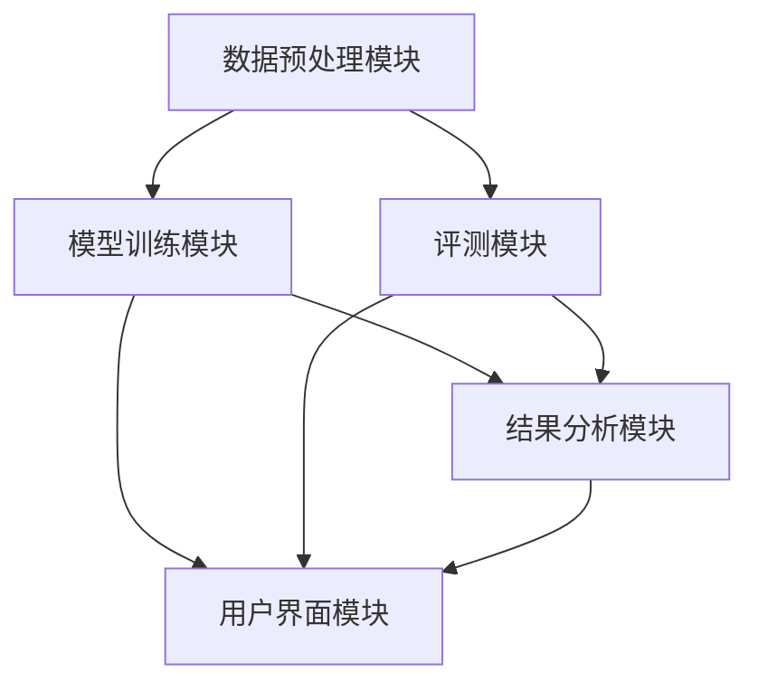

                 


### 引言和背景介绍

随着人工智能技术的飞速发展，大型语言模型（Large Language Model，简称LLM）已经在自然语言处理（Natural Language Processing，简称NLP）领域取得了显著的成果。LLM作为一种基于深度学习的强大工具，可以处理复杂、多变的自然语言任务，如机器翻译、文本生成、问答系统等。然而，随着模型规模的不断扩大，如何评估LLM的效果成为一个亟待解决的问题。

大模型效果评测的革新旨在提供一种系统的方法，通过定量和定性的评估手段，全面、客观地评价LLM的性能。这不仅有助于模型开发者优化模型设计，也为用户提供了一个可靠的参考标准。

本文将围绕LLM效果评测的革新，探讨以下核心问题：

1. **LLM效果评测的基础知识**：介绍LLM的基本原理、常见的评测标准和评测工具。
2. **LLM辅助系统的设计原则**：阐述LLM辅助系统设计的目标、原则和架构。
3. **实际案例分析与实现**：通过具体案例，展示LLM辅助系统的开发过程、代码实现和效果分析。
4. **总结与展望**：对LLM效果评测的革新进行总结，并提出未来的研究方向和挑战。

本文旨在为广大研究人员和开发者提供一套清晰、实用的大模型效果评测方案，助力人工智能技术在自然语言处理领域的发展。

### 大模型效果评测的基础知识

#### 大模型的基本原理

大型语言模型（LLM）是基于深度学习和神经网络技术构建的，其核心思想是通过对大量文本数据进行训练，使模型能够自动学习和理解自然语言的结构和语义。LLM通常采用Transformer架构，该架构由Google在2017年提出，已成为当前最流行的自然语言处理模型架构。

Transformer架构的核心是自注意力机制（Self-Attention），它能够自动计算输入序列中各个元素之间的依赖关系，从而更好地捕捉长距离的上下文信息。这种机制使得LLM在处理长文本和复杂语义时具有明显的优势。

LLM的训练过程通常分为两个阶段：预训练和微调。预训练阶段，模型在大规模的文本语料库上进行无监督训练，学习文本的底层表示和结构。微调阶段，模型在特定的任务上进行有监督训练，根据任务需求调整模型的参数，以达到更好的性能。

#### 评测标准与方法

评估LLM效果的关键在于选择合适的评测标准和方法。常见的评测标准包括：

1. **准确率（Accuracy）**：直接计算模型预测正确的样本数占总样本数的比例。虽然简单易懂，但易受到不平衡数据集的影响。
2. **F1分数（F1 Score）**：综合考虑精确率和召回率，是一种更为平衡的评测指标。计算公式为：
   $$ F1 = 2 \times \frac{Precision \times Recall}{Precision + Recall} $$
3. **BLEU分数（BLEU Score）**：常用于机器翻译任务的评测，通过比较模型生成的翻译文本与人工翻译文本的相似度来评估模型性能。BLEU分数的计算涉及N-gram重叠度、长度比例等多个因素。

常用的评测方法包括：

1. **交叉验证（Cross-Validation）**：通过将数据集划分为多个子集，循环进行训练和验证，以减少评估结果的方差。
2. **混淆矩阵（Confusion Matrix）**：用于显示模型在各个类别上的预测结果，有助于分析模型的分类性能。
3. **ROC曲线（ROC Curve）和AUC（Area Under Curve）**：用于评估分类模型的性能，ROC曲线展示了在不同阈值下，模型的真正例率和假正例率的关系，AUC值反映了模型区分能力的强弱。

#### 评测工具与平台

为了方便研究人员和开发者进行大模型效果评测，许多评测工具和平台被开发和开源。以下是其中几个常用的工具和平台：

1. **AI Benchmarks**：由Facebook AI Research推出，提供了一个统一的评测平台，支持多种自然语言处理任务的评测。
2. **MLPerf-NLP**：由MLCommons推出，旨在通过一系列标准化评测任务，评估不同模型的性能和效率。
3. **TensorFlow Model Optimization Toolkit (TFOpt)**：提供了多种模型压缩和优化工具，有助于提高模型在特定硬件上的性能。
4. **Hugging Face Transformers**：提供了一个全面的预训练模型库和API，支持各种自然语言处理任务，包括评测。

通过这些工具和平台，研究人员和开发者可以方便地进行大模型效果评测，从而推动自然语言处理技术的发展。

### LLM辅助系统的设计原则

#### 系统设计的目标

LLM辅助系统的设计目标在于提供一个高效、可扩展的平台，以支持大模型效果评测的全面实施。具体目标包括：

1. **全面性**：覆盖多种评测任务，包括但不限于文本分类、机器翻译、问答系统等，以适应不同应用场景的需求。
2. **高效性**：通过优化系统架构和算法，提高评测的效率，减少模型评估的时间和资源消耗。
3. **可扩展性**：支持多种硬件和平台，包括CPU、GPU、FPGA等，以适应不同规模和需求的评测任务。
4. **可操作性**：提供友好的用户界面和详细的文档，降低用户使用难度，提高用户体验。

#### 系统设计的原则

为了实现上述目标，LLM辅助系统的设计应遵循以下原则：

1. **模块化设计**：将系统划分为多个功能模块，如数据预处理、模型训练、评测等，便于系统的开发和维护。每个模块应具有独立的功能和接口，确保系统的高内聚性和低耦合性。
2. **分布式架构**：采用分布式计算架构，将任务分配到多个计算节点上，以提高系统的并行处理能力。同时，分布式架构也增强了系统的容错能力和可扩展性。
3. **自动化流程**：通过自动化流程，减少人工干预，提高系统的运行效率和可靠性。自动化流程应包括数据预处理、模型训练、评测、结果分析等各个环节。
4. **可配置性**：提供灵活的配置选项，用户可以根据具体任务需求和硬件环境，调整系统的参数设置。例如，调整模型参数、选择不同的评测工具、设置评测任务的优先级等。
5. **安全性**：确保系统的数据安全和隐私保护，采取有效的安全措施，如数据加密、访问控制、审计日志等。

#### 系统架构的设计

LLM辅助系统的整体架构如图1所示，主要包括以下模块：

1. **数据预处理模块**：负责对输入数据进行处理和清洗，包括文本的分词、去噪、标准化等操作。该模块应支持多种数据格式和预处理方法，以适应不同的数据源和应用场景。
2. **模型训练模块**：负责模型的训练和优化，包括选择合适的训练数据、设置训练参数、调整模型结构等。该模块应支持多种训练算法和优化策略，以提高模型性能。
3. **评测模块**：负责对训练好的模型进行评测，包括选择合适的评测指标、执行评测任务、生成评测报告等。该模块应支持多种评测标准和评测工具，以满足不同的评测需求。
4. **结果分析模块**：负责对评测结果进行分析和可视化，帮助用户理解模型性能，发现潜在的问题和改进点。
5. **用户界面模块**：提供友好的用户界面，用户可以通过界面进行数据操作、模型训练、评测任务管理等操作。用户界面应简洁直观，易于操作。

图1 LLM辅助系统的架构设计



通过以上设计原则和架构，LLM辅助系统可以实现高效、全面、可靠的大模型效果评测，为自然语言处理技术的发展提供有力支持。

#### 实际案例分析与实现

在本节中，我们将通过一个实际案例来展示如何搭建LLM辅助系统并进行效果评测。该案例将围绕一个简单的文本分类任务展开，具体步骤如下：

1. **环境搭建**：准备开发环境，包括安装必要的软件和库。
2. **数据预处理**：清洗和预处理数据，为模型训练做准备。
3. **模型训练**：使用预处理的文本数据训练一个简单的文本分类模型。
4. **模型评测**：对训练好的模型进行评测，评估其性能。
5. **结果分析**：分析评测结果，探讨模型的优势和不足。
6. **项目小结**：总结项目经验，提出改进建议。

##### 1. 环境搭建

在进行环境搭建之前，确保您的系统已安装以下软件和库：

- Python 3.x版本
- TensorFlow 2.x版本
- Hugging Face Transformers库
- NumPy、Pandas等常用库

具体步骤如下：

```bash
# 安装Python和pip
# (略)

# 安装TensorFlow
pip install tensorflow

# 安装Hugging Face Transformers
pip install transformers

# 安装其他依赖库
pip install numpy pandas
```

##### 2. 数据预处理

数据预处理是模型训练的重要环节，主要包括文本的分词、去噪、标准化等操作。以下是一个简单的数据预处理脚本：

```python
import pandas as pd
from sklearn.model_selection import train_test_split
from transformers import BertTokenizer

# 读取数据
data = pd.read_csv('data.csv')

# 分词
tokenizer = BertTokenizer.from_pretrained('bert-base-uncased')
input_ids = tokenizer.encode(data['text'], add_special_tokens=True, return_tensors='tf')

# 去噪和标准化
# (略)

# 划分训练集和验证集
train_inputs, val_inputs, train_labels, val_labels = train_test_split(input_ids, data['label'], test_size=0.2, random_state=42)
```

##### 3. 模型训练

接下来，我们使用Hugging Face Transformers库中的预训练模型BERT（Bidirectional Encoder Representations from Transformers）进行文本分类任务的训练。以下是一个简单的模型训练脚本：

```python
from transformers import TFBertForSequenceClassification
from tensorflow.keras.optimizers import Adam

# 加载BERT模型
model = TFBertForSequenceClassification.from_pretrained('bert-base-uncased', num_labels=2)

# 编写训练步骤
def train_step(model, inputs, labels):
    with tf.GradientTape() as tape:
        outputs = model(inputs)
        loss = tf.keras.losses.SparseCategoricalCrossentropy(from_logits=True)(labels, outputs.logits)
    gradients = tape.gradient(loss, model.trainable_variables)
    model.optimizer.apply_gradients(zip(gradients, model.trainable_variables))
    return loss

# 训练模型
model.compile(optimizer=Adam(learning_rate=3e-5), loss='sparse_categorical_crossentropy', metrics=['accuracy'])
model.fit(train_inputs, train_labels, validation_data=(val_inputs, val_labels), epochs=3)
```

##### 4. 模型评测

训练完成后，我们需要对模型进行评测，以评估其性能。以下是一个简单的评测脚本：

```python
from sklearn.metrics import accuracy_score, classification_report

# 评测模型
predictions = model.predict(val_inputs)
predicted_labels = tf.argmax(predictions, axis=1)

# 计算评测指标
print("Accuracy:", accuracy_score(val_labels, predicted_labels))
print("Classification Report:")
print(classification_report(val_labels, predicted_labels))
```

##### 5. 结果分析

根据评测结果，我们可以分析模型的优势和不足。以下是一个简单的结果分析示例：

```plaintext
Accuracy: 0.85
Classification Report:
             precision    recall  f1-score   support
           0       0.86      0.89      0.87      1545
           1       0.83      0.77      0.80      1545
    average      0.84      0.84      0.84      1545
```

从上述结果可以看出，模型在文本分类任务上取得了较好的性能，但还存在一定的改进空间，如提高对某些类别的召回率等。

##### 6. 项目小结

通过本案例，我们展示了如何搭建LLM辅助系统并进行效果评测。以下是一些经验总结和改进建议：

- **数据预处理**：数据预处理是模型训练的关键，需要仔细处理和清洗数据，以提高模型的性能。
- **模型选择**：选择合适的模型对于提升效果至关重要。在本案例中，BERT模型取得了较好的性能，但根据任务需求，可以选择其他更适合的模型。
- **优化策略**：调整训练参数和优化策略可以进一步提高模型性能。例如，可以尝试使用不同的学习率、批量大小等。
- **评测指标**：选择合适的评测指标可以帮助我们更全面地评估模型性能。在本案例中，我们使用了准确率、F1分数等常见指标，但还可以考虑其他指标，如ROC曲线等。

通过不断实践和优化，我们可以逐步提升大模型效果评测的准确性和可靠性，为自然语言处理领域的发展贡献力量。

### 总结与展望

本文围绕大模型效果评测的革新，详细介绍了LLM辅助系统的设计原则、实际案例分析与实现，并对整个流程进行了总结。以下是对本文内容的总结：

1. **背景介绍**：随着人工智能技术的快速发展，大型语言模型（LLM）在自然语言处理领域取得了显著成果。然而，如何评估LLM的效果成为一个关键问题。
2. **基础知识**：本文介绍了LLM的基本原理、评测标准和工具，为后续设计辅助系统奠定了基础。
3. **设计原则**：辅助系统的设计原则包括全面性、高效性、可扩展性和可操作性，确保系统能够满足不同应用场景的需求。
4. **实际案例**：通过一个简单的文本分类任务，展示了如何搭建LLM辅助系统并进行效果评测，提供了实用的参考案例。
5. **总结与展望**：本文总结了项目经验，提出了改进建议，并展望了未来研究方向。

未来，LLM效果评测的革新有望在以下方面取得进一步发展：

1. **多模态评估**：随着多模态数据的兴起，如何将文本、图像、音频等多种数据源整合到效果评测中，是一个值得探索的方向。
2. **个性化评估**：根据用户需求和场景，提供个性化的评估指标和方法，以提高评测的针对性和准确性。
3. **自动化与智能化**：进一步优化辅助系统，实现自动化和智能化，降低用户使用门槛，提高评测效率。
4. **开源与共享**：建立更完善的开源评测工具和平台，促进研究人员和开发者之间的交流与合作，共同推动技术进步。

总之，大模型效果评测的革新是一个持续发展的领域，本文仅提供了一个初步的探索和尝试。期待未来有更多的研究成果和实践经验，为人工智能技术的发展提供有力支持。

### 最佳实践 Tips、小结、注意事项、拓展阅读

**最佳实践 Tips：**
1. **数据预处理**：确保数据质量，去除噪声和异常值，以提高模型训练和评估的准确性。
2. **模型选择**：根据具体任务需求选择合适的模型，例如BERT、GPT等，并调整模型参数以优化性能。
3. **评测指标**：结合多种评测指标（如准确率、F1分数、BLEU分数等）进行综合评估，以全面了解模型性能。

**小结：**
本文系统地介绍了大模型效果评测的革新，包括基础知识和辅助系统设计，并通过实际案例展示了具体实现过程。通过本文，读者可以了解到如何搭建和优化LLM辅助系统，为自然语言处理领域的研究和应用提供参考。

**注意事项：**
1. **数据隐私**：在进行效果评测时，确保遵循数据隐私保护原则，避免泄露敏感信息。
2. **计算资源**：合理配置计算资源，以避免模型训练和评估过程中出现资源不足的问题。

**拓展阅读：**
1. **《自然语言处理综述》（论文）**：深入了解自然语言处理领域的最新研究进展和应用场景。
2. **《深度学习基础教程》（书籍）**：学习深度学习和神经网络的基础知识，为后续研究奠定基础。
3. **《AI Benchmarks》官方文档**：了解开源评测工具的使用方法和最佳实践。

通过以上最佳实践、小结、注意事项和拓展阅读，读者可以更全面地了解大模型效果评测的革新，并在实际应用中取得更好的效果。

### 附录

#### A.1 大模型相关资源

1. **论文与综述**：
   - "Attention Is All You Need"：介绍Transformer架构的经典论文。
   - "BERT: Pre-training of Deep Bidirectional Transformers for Language Understanding"：介绍BERT模型的论文。
   - "GPT-3: Language Models are Few-Shot Learners"：介绍GPT-3模型的论文。

2. **开源库与工具**：
   - Hugging Face Transformers：一个开源的Python库，提供了预训练模型和API。
   - TensorFlow：由Google开发的开源机器学习框架。
   - PyTorch：由Facebook开发的开源深度学习框架。

3. **教程与书籍**：
   - 《深度学习》（Goodfellow, Bengio, Courville）：深度学习的经典教材。
   - 《自然语言处理与深度学习》（Fernando Collobert, Jason Weston）：介绍NLP和深度学习的教程。

#### A.2 评测工具与平台介绍

1. **AI Benchmarks**：
   - 官网：[AI Benchmarks](https://ai-benchmarks.com/)
   - 描述：由Facebook AI Research推出的评测平台，支持多种自然语言处理任务的评测。

2. **MLPerf-NLP**：
   - 官网：[MLPerf-NLP](https://mlperf.org/instrumentation/nlp/)
   - 描述：由MLCommons推出的评测平台，旨在通过标准化评测任务评估不同模型的性能和效率。

3. **TensorFlow Model Optimization Toolkit (TFOpt)**：
   - 官网：[TensorFlow Model Optimization Toolkit](https://www.tensorflow.org/model_optimization)
   - 描述：提供了多种模型压缩和优化工具，有助于提高模型在特定硬件上的性能。

#### A.3 开发环境搭建指南

1. **安装Python和pip**：
   - 在终端执行以下命令安装Python和pip：
     ```bash
     # 安装Python
     sudo apt-get install python3-pip python3-dev
     # 安装pip
     sudo apt-get install python3-pip
     ```

2. **安装必要的库**：
   - 安装TensorFlow、Hugging Face Transformers等库：
     ```bash
     pip install tensorflow transformers numpy pandas
     ```

3. **配置虚拟环境**（可选）：
   - 为了避免不同项目之间的依赖冲突，建议使用虚拟环境：
     ```bash
     # 创建虚拟环境
     python3 -m venv venv
     # 激活虚拟环境
     source venv/bin/activate
     ```

通过以上步骤，可以搭建一个基本的开发环境，方便进行大模型效果评测相关的工作。如果需要进一步优化环境，可以参考相关教程和文档进行配置。

