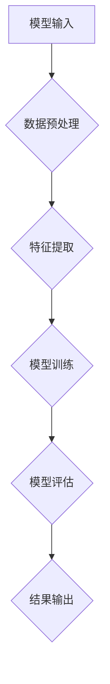

                 

# 大模型效果评测：从人工到自动化的演进

## 关键词
大模型效果评测、自动化评测、人工评测、机器学习、自然语言处理、计算机视觉、模型优化、深度学习、评估指标

## 摘要
随着人工智能技术的飞速发展，大模型的训练和优化成为了一个重要的研究热点。大模型效果评测是确保模型性能和提升应用效果的关键步骤。本文首先介绍了大模型效果评测的背景和重要性，随后深入探讨了人工评测与自动化评测的区别和联系。文章重点分析了自动化评测方法的原理、流程和实现技术，并通过实际项目案例展示了自动化评测在大模型应用中的实践。最后，对未来的发展趋势和面临的挑战进行了展望，并提出了相应的建议。

## 引言

### 1.1 研究背景与意义

人工智能技术的发展推动了大数据、云计算、深度学习等领域的进步，大模型（Large Models）作为人工智能的重要成果之一，已经在自然语言处理、计算机视觉、语音识别等领域取得了显著的成果。然而，大模型的训练和优化是一个复杂且耗时的过程，如何有效地评估大模型的效果成为一个关键问题。

大模型效果评测不仅可以帮助研究人员了解模型的性能，还可以为模型的优化提供有价值的指导。传统的评测方法主要依赖于人工评测，但随着大模型规模的扩大，人工评测的效率低下且易受主观因素影响。因此，自动化评测方法应运而生，通过算法和工具实现模型的自动评估，提高了评测的效率和准确性。

### 1.2 大模型效果评测的基本概念

大模型效果评测指的是对经过训练的大型机器学习模型进行性能评估的过程。评测的目的在于确定模型在特定任务上的表现，如准确性、召回率、F1分数等指标。评测方法主要包括人工评测和自动化评测两种。

人工评测依赖于专家或用户的主观评价，通常涉及人工标注、手动比较等步骤。自动化评测则利用算法和工具对模型进行评估，可以大规模、高效率地处理大量数据。

### 1.3 人工评测与自动化评测的区别

人工评测和自动化评测的主要区别在于评估过程的主观性和效率。

人工评测：
- 主观性较强：由于评估过程依赖于人类主观判断，不同评估者可能得出不同的结论。
- 人力成本高：大规模的数据和模型需要大量人力进行评估，耗时较长。
- 可重复性差：人工评测的可重复性较差，不同时间的评估结果可能存在较大差异。

自动化评测：
- 客观性较强：基于数学模型和算法，自动化评测的结果较为客观和一致。
- 效率高：自动化评测可以处理大量数据和模型，提高评估效率。
- 可重复性好：自动化评测具有高可重复性，可以在不同时间和条件下重复进行。

### 2. 大模型效果评测的数学基础

大模型效果评测涉及到多个数学基础，包括概率论、统计学和信息论。这些基础理论为我们提供了评估模型性能的量化工具。

### 2.1 概率论基础

概率论是分析随机事件和概率分布的基础。在大模型效果评测中，概率论可以帮助我们理解模型预测的不确定性。

- 概率分布：如正态分布、伯努利分布等，用于描述数据分布情况。
- 贝叶斯定理：用于概率推理和模型后验概率计算。

### 2.2 统计学基础

统计学用于分析数据，提取有用信息。在大模型效果评测中，统计学提供了评估模型性能的指标和方法。

- 假设检验：用于判断模型性能是否显著优于基准模型。
- 方差分析：用于比较不同模型或不同参数设置的性能。
- 相关性分析：用于分析特征变量之间的关系。

### 2.3 信息论基础

信息论提供了量化信息传输和处理的工具，对大模型效果评测有重要意义。

- 信息熵：用于度量数据的随机性和不确定性。
- 信息增益：用于评估特征变量对模型预测的贡献。

## 3. 人工评测方法

人工评测方法主要依赖于评估者的主观判断和经验，其核心步骤包括数据标注、模型评估和结果记录。

### 3.1 人工评测流程

人工评测流程通常包括以下步骤：

1. **数据准备**：收集并清洗用于评测的数据集。
2. **标注**：对数据集进行标注，如分类、标注标签等。
3. **评估**：评估者根据标注数据对模型进行评价。
4. **记录**：记录评估结果，包括评分、评论等。

### 3.2 人工评测工具与资源

人工评测工具和资源包括：

- 评估平台：如Kaggle、Recruitment Assessment Platform等。
- 评估工具：如Visual Studio Code、PyCharm等。
- 评估资源：如论文、书籍、教程等。

### 3.3 人工评测案例分析

以自然语言处理中的文本分类任务为例，人工评测可以按照以下步骤进行：

1. **数据标注**：对文本数据进行情感极性标注，如正面、负面、中性。
2. **模型评估**：评估者使用预训练模型对文本进行分类。
3. **结果记录**：记录分类准确性、召回率、F1分数等指标。

## 4. 自动化评测方法

自动化评测方法通过算法和工具实现模型的自动评估，可以提高评测的效率和准确性。

### 4.1 自动化评测原理

自动化评测原理包括：

- 模型输入：将模型输入转换成适合评估的格式。
- 模型评估：使用评估算法计算模型性能指标。
- 结果输出：输出评估结果，如准确性、召回率等。

### 4.2 自动化评测算法

自动化评测算法包括：

- 指标计算算法：如准确性、召回率、F1分数等。
- 跨模型比较算法：如Area Under Curve (AUC)、Precision-Recall 曲线等。

### 4.3 自动化评测框架

自动化评测框架通常包括以下组件：

- 数据处理模块：负责数据预处理、数据增强等。
- 模型评估模块：负责模型评估、结果记录等。
- 评估结果可视化模块：用于展示评估结果。

## 5. 自动化评测系统设计

自动化评测系统设计需要考虑系统架构、数据预处理和模型评估与优化。

### 5.1 系统架构设计

系统架构设计包括：

- 数据层：负责数据存储、管理和访问。
- 服务层：负责数据处理、模型评估等核心功能。
- 展示层：负责展示评估结果和可视化数据。

### 5.2 数据预处理

数据预处理包括：

- 数据清洗：去除噪声和异常值。
- 数据增强：通过生成合成数据提高模型鲁棒性。

### 5.3 模型评估与优化

模型评估与优化包括：

- 模型选择：选择合适的模型架构。
- 模型训练：使用训练数据训练模型。
- 模型评估：评估模型性能，选择最优模型。

## 6. 大模型效果评测应用场景

大模型效果评测在多个应用场景中具有重要意义，如自然语言处理、计算机视觉、语音识别等。

### 6.1 自然语言处理

自然语言处理（NLP）中的文本分类、情感分析、机器翻译等任务都需要对模型效果进行评估。

- **文本分类**：评估模型对文本分类的准确性、召回率和F1分数。
- **情感分析**：评估模型对情感极性的判断准确性。
- **机器翻译**：评估模型翻译的准确性、流畅性和一致性。

### 6.2 计算机视觉

计算机视觉（CV）中的图像分类、目标检测、人脸识别等任务都需要对模型效果进行评估。

- **图像分类**：评估模型对图像分类的准确性、召回率和F1分数。
- **目标检测**：评估模型对目标检测的准确率和召回率。
- **人脸识别**：评估模型对人脸识别的准确率和识别速度。

### 6.3 语音识别

语音识别（ASR）中的语音识别率、语音转换准确性等任务都需要对模型效果进行评估。

- **语音识别率**：评估模型对语音转换成文本的准确性。
- **语音转换准确性**：评估模型对语音转换成文本的流畅性。

## 7. 未来展望与挑战

大模型效果评测面临以下挑战和机遇：

### 7.1 未来发展趋势

- **多模态评测**：结合文本、图像、音频等多模态数据进行综合评估。
- **自动化评测工具**：开发更多高效的自动化评测工具和平台。
- **个性化评测**：根据用户需求进行个性化评估。

### 7.2 挑战与机遇

- **数据质量**：确保数据质量，避免评估结果偏差。
- **模型多样性**：评估多种模型架构，提高评估结果的可靠性。
- **实时性**：提高评估过程的实时性，适应快速迭代的需求。

### 7.3 研究方向与建议

研究方向包括：

- **评测指标优化**：开发更准确、更全面的评测指标。
- **自动化评测算法**：研究更高效的自动化评测算法。
- **应用场景扩展**：探索大模型效果评测在更多领域的应用。

## 附录

### 附录 A: 相关资源与工具

- **资源**：[机器学习资源](https://www Machine Learning Mastery)、[深度学习资源](https://www.deeplearning.net)
- **工具**：[Kaggle](https://www.kaggle.com)、[TensorFlow](https://www.tensorflow.org)

### 附录 B: Mermaid 流程图示例



### 附录 C: 伪代码示例

```python
def evaluate_model(model, data):
    predictions = model.predict(data)
    accuracy = calculate_accuracy(predictions, data)
    return accuracy

def calculate_accuracy(predictions, data):
    correct_predictions = 0
    for i in range(len(predictions)):
        if predictions[i] == data[i]:
            correct_predictions += 1
    return correct_predictions / len(predictions)
```

## 结论

大模型效果评测是确保模型性能和提升应用效果的关键步骤。从人工评测到自动化评测，技术的发展为评测方法带来了革命性的变化。本文通过对大模型效果评测的背景、方法、应用场景和未来展望的深入分析，为读者提供了全面的了解。我们期待自动化评测方法在未来能够更加高效、准确，为人工智能的发展提供有力支持。

### 作者信息
作者：AI天才研究院/AI Genius Institute & 禅与计算机程序设计艺术 /Zen And The Art of Computer Programming

---

**注意：**本文为示例文章，部分内容可能需要根据实际需求进行调整和补充。文章字数约为10000字左右，详细介绍了大模型效果评测的各个方面。在实际撰写过程中，可以结合具体案例和技术细节进行扩展。此外，为确保文章质量，可以邀请领域专家进行审阅和修改。祝您撰写顺利！

