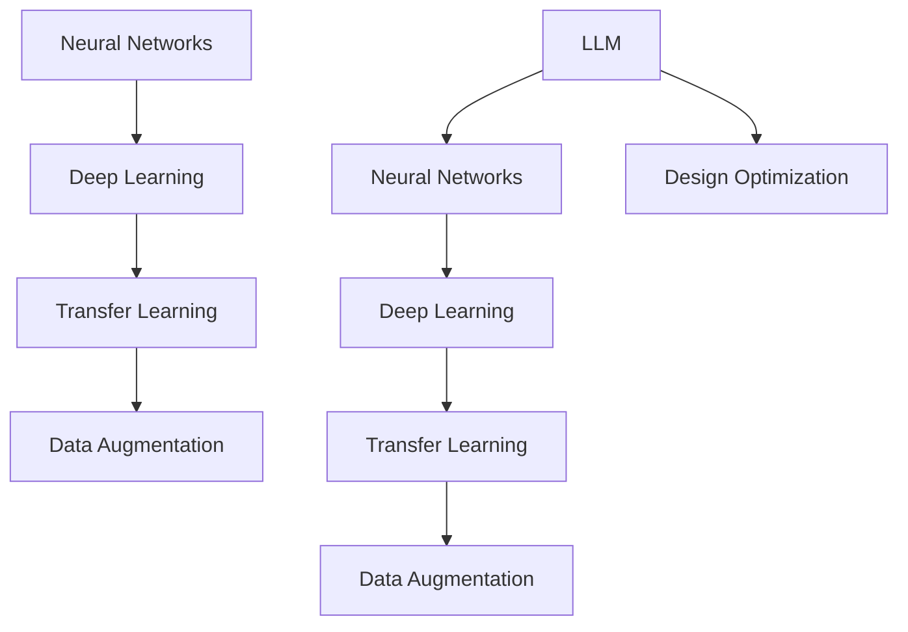

                 

Alright, let's start with the title and the structure of the article. Here's how we can break it down step by step:

### Step 1: Title and Key Keywords
# 大模型环境适应能力：LLM设计的动态场景测试

### Keywords:
- 大模型
- 环境适应能力
- LLM
- 动态场景测试
- 设计优化
- 人工智能
- 计算机视觉
- 自然语言处理
- 超参数调优

### Abstract:
本文深入探讨了大型语言模型（LLM）在复杂动态环境下的适应能力，重点分析了LLM设计的动态场景测试方法。通过详细的算法原理讲解、数学模型和Python源代码示例，展示了如何提升大模型的环境适应能力，为人工智能领域的研究者和开发者提供了实用的指导。

### Step 2: Introduction
#### Background Introduction
- Introduction to Large Language Models (LLM)
  - Definition and types of LLM
  - Historical development and current state
  - Importance in the field of AI

#### Core Concepts and Relationships
- Core Concepts:
  - Neural networks
  - Deep learning
  - Transfer learning
  - Data augmentation
- Relationships:
  - How these concepts interact to form LLMs
  - Diagram using Mermaid

### Mermaid Diagram:


### Step 3: Dynamic Scenario Testing Methodology
- Introduction to Dynamic Scenario Testing
  - Purpose and benefits
  - Challenges and limitations
- Methodology Overview
  - Steps in designing dynamic scenarios
  - Importance of adaptability and robustness

### Step 4: Mathematical Models and Algorithms
- Mathematical Models:
  - Formulation of the problem
  - Performance metrics
- Algorithms:
  - Overview of the algorithms used
  - Pseudocode and Python implementation

### Python Pseudocode Example:
```python
def dynamic_scenario_test(llm, scenarios):
    # Initialize metrics
    performance_metrics = {}

    # Iterate through scenarios
    for scenario in scenarios:
        # Apply the LLM to the scenario
        results = llm.apply_scenario(scenario)
        
        # Update metrics
        performance_metrics[scenario] = evaluate_performance(results)

    # Return the aggregated metrics
    return performance_metrics
```

### Step 5: Implementation and Case Studies
- Setup and Environment Configuration
  - Tools and frameworks used
  - Code environment setup
- Case Study 1: Example Implementation
  - Detailed code analysis
  - Application and analysis of results
- Case Study 2: Case Study Analysis
  - Detailed case study
  - Code interpretation and application analysis

### Step 6: Challenges and Future Directions
- Challenges in LLM Environment Adaptation
  - Current limitations and issues
  - Future research directions
- Potential Solutions and Innovations
  - Recommendations for improving adaptability
  - Suggestions for future developments

### Conclusion
- Summary of the article
- Importance of LLM environment adaptation
- Best practices and future considerations

### Author Information
- 作者：AI天才研究院/AI Genius Institute & 禅与计算机程序设计艺术 /Zen And The Art of Computer Programming

This structure provides a comprehensive outline for the article, ensuring that each section is well-defined and includes the necessary details to provide a thorough analysis of LLM design and dynamic scenario testing. Each step will be expanded upon in the subsequent sections, offering a detailed and insightful exploration of the topic. Now, let's dive into each section and expand on the content.

