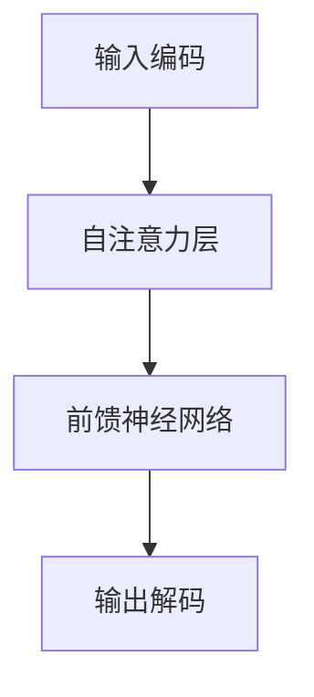
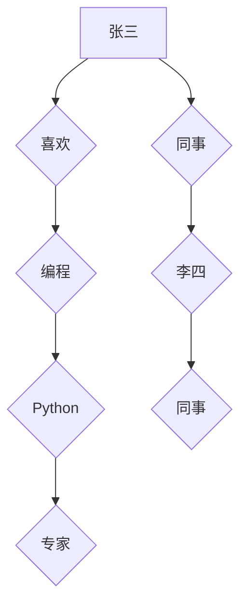
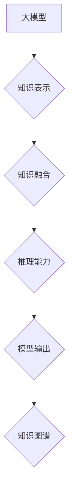
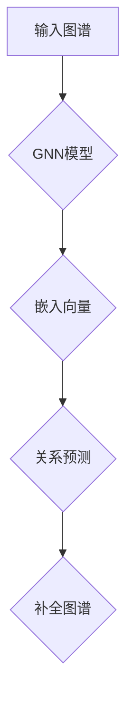
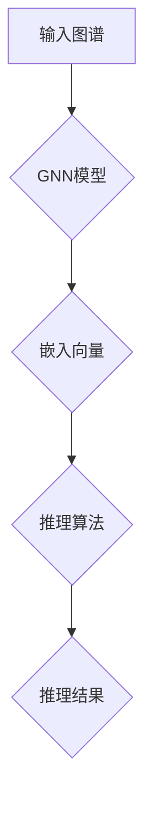
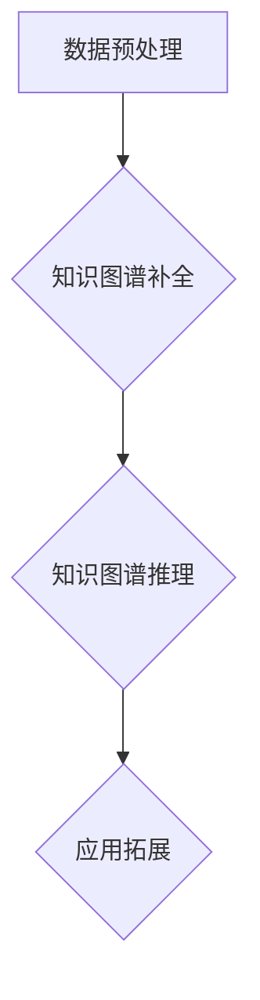
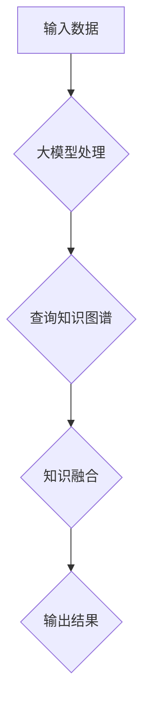
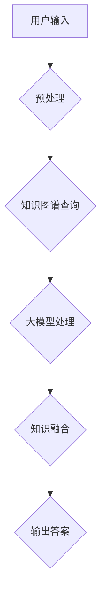

                 

# 大模型知识图谱扩展能力：LLM设计的关系推理测试

## 关键词
- 大模型
- 知识图谱
- 扩展能力
- 关系推理
- LLM设计
- Python源代码
- 数学模型
- 自然语言处理

## 摘要
本文旨在探讨大模型知识图谱扩展能力中的关系推理测试，特别是在大型语言模型（LLM）设计中的应用。我们将从大模型和知识图谱的基础理论出发，逐步深入分析知识图谱嵌入与表示、知识图谱补全与推理、大模型知识图谱融合、以及扩展能力的优化策略。本文将通过Python源代码和数学模型，详细阐述关系推理测试的核心算法原理，并通过实际案例展示其在自然语言处理、推荐系统和其他领域中的应用，为相关领域的研究者和开发者提供有价值的参考。

## 目录

### 第一部分：大模型知识图谱扩展能力概述

#### 第1章：大模型知识图谱扩展能力引论
- 1.1 大模型知识图谱扩展能力的背景
- 1.2 知识图谱在大模型中的重要作用
- 1.3 大模型知识图谱扩展能力的概念与内涵
- 1.4 大模型知识图谱扩展能力的应用领域
- 1.5 大模型知识图谱扩展能力的发展趋势

#### 第2章：大模型与知识图谱基础
- 2.1 大模型基本原理
- 2.2 知识图谱基本原理
- 2.3 大模型与知识图谱的关系
- 2.4 大模型知识图谱扩展能力的关键技术

### 第二部分：大模型知识图谱扩展能力核心组件

#### 第3章：知识图谱嵌入与表示
- 3.1 知识图谱嵌入的概念
- 3.2 常见的知识图谱嵌入方法
- 3.3 知识图谱嵌入的优化与评估

#### 第4章：知识图谱补全与推理
- 4.1 知识图谱补全方法
- 4.2 知识图谱推理方法
- 4.3 知识图谱补全与推理的综合应用

#### 第5章：大模型知识图谱融合
- 5.1 大模型知识图谱融合方法
- 5.2 大模型知识图谱融合的优势
- 5.3 大模型知识图谱融合的案例分析

#### 第6章：大模型知识图谱扩展能力的优化与优化
- 6.1 大模型知识图谱扩展能力的优化策略
- 6.2 大模型知识图谱扩展能力的优化案例
- 6.3 大模型知识图谱扩展能力未来优化方向

### 第三部分：大模型知识图谱扩展能力应用

#### 第7章：大模型知识图谱在自然语言处理中的应用
- 7.1 大模型知识图谱在自然语言处理中的作用
- 7.2 大模型知识图谱在自然语言处理中的应用案例
- 7.3 大模型知识图谱在自然语言处理中的未来发展趋势

#### 第8章：大模型知识图谱在推荐系统中的应用
- 8.1 大模型知识图谱在推荐系统中的作用
- 8.2 大模型知识图谱在推荐系统中的应用案例
- 8.3 大模型知识图谱在推荐系统中的未来发展趋势

#### 第9章：大模型知识图谱在其他领域中的应用
- 9.1 大模型知识图谱在计算机视觉中的应用
- 9.2 大模型知识图谱在生物信息学中的应用
- 9.3 大模型知识图谱在其他领域中的应用展望

### 第四部分：大模型知识图谱扩展能力发展展望

#### 第10章：大模型知识图谱扩展能力的发展趋势
- 10.1 大模型知识图谱扩展能力的技术发展趋势
- 10.2 大模型知识图谱扩展能力的应用发展趋势
- 10.3 大模型知识图谱扩展能力未来面临的挑战与机遇

## 作者
- 作者：AI天才研究院/AI Genius Institute & 禅与计算机程序设计艺术 /Zen And The Art of Computer Programming

----------------------------------------------------------------

### 第一部分：大模型知识图谱扩展能力概述

#### 第1章：大模型知识图谱扩展能力引论

**1.1 大模型知识图谱扩展能力的背景**

在当前的技术环境下，人工智能（AI）的发展达到了前所未有的高度。随着深度学习、大数据和云计算等技术的飞速进步，大模型（Large Language Model，LLM）逐渐成为了AI领域的核心力量。LLM，尤其是基于变换器（Transformer）架构的模型，如BERT、GPT等，在自然语言处理（NLP）、机器翻译、文本生成等任务上展现出了卓越的性能。

与此同时，知识图谱（Knowledge Graph，KG）作为一种语义信息组织方式，也逐渐引起了广泛关注。知识图谱通过将实体、属性和关系进行结构化表示，为AI系统提供了丰富的语义信息，帮助它们更好地理解和处理复杂任务。

大模型知识图谱扩展能力是指利用大模型对知识图谱进行增强和扩展，使其在复杂任务中表现更佳的能力。这一扩展能力主要体现在以下几个方面：

1. **知识增强**：通过将知识图谱中的知识嵌入到大模型中，提升大模型对知识的理解和利用能力。
2. **推理能力**：利用知识图谱的关系和逻辑推理能力，增强大模型的推理能力，使其能够处理更加复杂的任务。
3. **融合能力**：将知识图谱与大模型进行融合，发挥各自的优势，实现更高效的协同工作。

**1.2 知识图谱在大模型中的重要作用**

知识图谱在大模型中的应用主要体现在以下几个方面：

1. **语义理解**：知识图谱提供了丰富的实体和关系信息，可以帮助大模型更好地理解语义，从而提高其在各种NLP任务中的性能。
2. **知识融合**：通过将知识图谱中的知识与大模型的内部表示进行融合，可以增强大模型的知识表示能力，提高其在知识密集型任务中的表现。
3. **推理能力**：知识图谱中的关系和逻辑推理机制可以为大模型提供额外的推理能力，使其能够处理更加复杂的推理任务。

**1.3 大模型知识图谱扩展能力的概念与内涵**

大模型知识图谱扩展能力是指通过在大模型中集成知识图谱，使其能够更好地理解和处理复杂任务的能力。这一能力包括以下几个核心概念：

1. **知识表示**：将知识图谱中的实体、属性和关系转化为大模型可以理解和利用的内部表示。
2. **知识融合**：将知识图谱的知识与大模型的内部表示进行融合，实现知识的传递和利用。
3. **推理能力**：利用知识图谱中的关系和逻辑推理机制，增强大模型的推理能力。
4. **扩展性**：大模型知识图谱扩展能力应具备良好的扩展性，以适应不断变化的知识和应用需求。

**1.4 大模型知识图谱扩展能力的应用领域**

大模型知识图谱扩展能力在多个领域都展现出了巨大的应用潜力，主要包括：

1. **自然语言处理**：知识图谱可以为NLP任务提供丰富的语义信息，帮助大模型更好地理解和生成语言。
2. **推荐系统**：知识图谱可以帮助推荐系统更好地理解用户和物品的属性和关系，提高推荐质量。
3. **计算机视觉**：知识图谱可以与视觉信息进行融合，增强视觉模型对图像和视频的理解能力。
4. **生物信息学**：知识图谱可以为生物信息学提供丰富的生物知识，帮助研究人员更好地理解和分析生物数据。
5. **金融风控**：知识图谱可以帮助金融领域更好地理解和分析风险，提高风险控制能力。

**1.5 大模型知识图谱扩展能力的发展趋势**

随着AI技术的不断进步，大模型知识图谱扩展能力也在不断发展。未来，这一能力有望在以下几个方面取得突破：

1. **知识表示**：发展更高效的知识表示方法，提高知识在大模型中的利用效率。
2. **推理能力**：增强大模型的推理能力，使其能够处理更加复杂的推理任务。
3. **融合能力**：探索知识图谱与大模型在不同领域的融合应用，实现更高效的协同工作。
4. **自动化构建**：研究自动化构建知识图谱的方法，降低知识图谱的构建成本，提高其应用范围。

通过本文的深入探讨，我们将对大模型知识图谱扩展能力有更全面、系统的认识，为其在各个领域的应用提供有益的参考。

### 第一部分：大模型知识图谱扩展能力概述

#### 第2章：大模型与知识图谱基础

**2.1 大模型基本原理**

大模型（Large Language Model，LLM）是一种基于深度学习的技术，能够通过大规模数据学习语言结构和语义，从而实现文本生成、问答、翻译等任务。LLM的核心是神经网络，特别是变换器（Transformer）架构，该架构通过多头自注意力机制（Multi-Head Self-Attention）实现了对输入文本的全局上下文理解。

LLM的工作原理可以概括为以下几个步骤：

1. **输入编码**：将输入的文本转换为模型可以理解的向量表示。
2. **自注意力机制**：通过自注意力机制，模型能够自动关注文本中的关键信息，理解全局上下文。
3. **前馈神经网络**：对自注意力层的输出进行多次前馈神经网络处理，进一步提取特征。
4. **输出解码**：将处理后的特征映射到输出空间，生成文本。

以下是一个简化的变换器模型结构Mermaid流程图：



**2.2 知识图谱基本原理**

知识图谱（Knowledge Graph，KG）是一种结构化知识表示方法，通过实体、属性和关系来组织信息。知识图谱的核心思想是将世界看作一个由实体和关系构成的网络，每个实体都有特定的属性，而关系则描述了实体之间的相互关系。

知识图谱的组成包括：

1. **实体（Entity）**：表示具体的对象，如人、地点、物品等。
2. **属性（Attribute）**：描述实体的特征，如人的年龄、地点的纬度等。
3. **关系（Relationship）**：表示实体之间的关联，如朋友关系、位于关系等。

以下是一个简单的知识图谱Mermaid表示：



**2.3 大模型与知识图谱的关系**

大模型与知识图谱的结合，为AI系统提供了强大的知识处理能力。它们之间的关系可以从以下几个方面来理解：

1. **知识表示**：大模型可以学习知识图谱中的实体和关系表示，将其嵌入到模型的内部表示中，从而提高模型对知识的理解和利用能力。
2. **知识融合**：知识图谱中的知识可以被大模型融合到其内部表示中，实现知识的传递和利用。
3. **推理能力**：知识图谱中的关系和逻辑推理机制可以为大模型提供额外的推理能力，使其能够处理更加复杂的推理任务。
4. **互补性**：大模型和知识图谱各有所长，大模型擅长处理复杂的文本数据，而知识图谱擅长表示和推理结构化知识。两者结合可以发挥各自的优势，实现更高效的协同工作。

以下是一个大模型与知识图谱融合的Mermaid流程图：



**2.4 大模型知识图谱扩展能力的关键技术**

大模型知识图谱扩展能力的关键技术包括：

1. **知识图谱嵌入与表示**：将知识图谱中的实体和关系转化为向量表示，使其能够被大模型理解和利用。
2. **知识图谱补全与推理**：通过知识图谱补全和推理技术，增强大模型的知识处理能力，提高其在复杂任务中的表现。
3. **大模型知识图谱融合**：将知识图谱与大模型进行融合，实现知识的传递和利用，提高模型的整体性能。
4. **优化策略**：针对大模型知识图谱扩展能力进行优化，包括模型结构优化、算法优化和资源调度优化等。

通过本节的内容，我们为大模型知识图谱扩展能力的深入探讨奠定了基础。在接下来的章节中，我们将进一步分析大模型知识图谱扩展能力的核心组件和实际应用，以期为相关领域的研究者和开发者提供有价值的参考。

### 第二部分：大模型知识图谱扩展能力核心组件

#### 第3章：知识图谱嵌入与表示

**3.1 知识图谱嵌入的概念**

知识图谱嵌入（Knowledge Graph Embedding）是将知识图谱中的实体和关系转化为向量表示的过程。通过知识图谱嵌入，我们可以将图数据转化为结构化的向量数据，从而利用向量空间中的距离和相似性来处理图数据中的关系。

知识图谱嵌入的目标是：

1. **降维**：将高维的图数据映射到低维的向量空间，降低计算复杂度。
2. **保留结构**：在降维的过程中，尽量保留原始知识图谱中的结构和语义信息。
3. **相似性度量**：通过向量空间中的距离和相似性度量，实现实体和关系的语义理解。

**3.2 常见的知识图谱嵌入方法**

知识图谱嵌入的方法可以分为基于矩阵分解的方法和基于图神经网络的方法。

1. **基于矩阵分解的方法**：
   - **线性嵌入**：如LLE（Local Linear Embedding）和LDA（Latent Dirichlet Allocation）等，通过线性变换将高维数据映射到低维空间。
   - **矩阵分解**：如SVD（Singular Value Decomposition）和PCA（Principal Component Analysis）等，通过矩阵分解将图数据转化为向量表示。

2. **基于图神经网络的方法**：
   - **图卷积网络（GCN）**：通过图卷积操作，逐步提取图数据中的特征。
   - **图注意力网络（GAT）**：通过注意力机制，自适应地关注图数据中的关键节点和关系。
   - **图嵌入模型**：如Node2Vec和GraphSAGE等，通过构建图中的路径和邻居关系，生成实体和关系的向量表示。

**3.3 知识图谱嵌入的优化与评估**

知识图谱嵌入的优化与评估是确保嵌入结果质量和性能的关键环节。

1. **优化策略**：
   - **损失函数**：使用交叉熵、均方误差等损失函数，优化嵌入向量的分布。
   - **优化算法**：如随机梯度下降（SGD）、Adam等，提高嵌入过程的收敛速度和稳定性。
   - **正则化**：如L1、L2正则化，避免过拟合，提高模型的泛化能力。

2. **评估指标**：
   - **嵌入质量**：使用余弦相似度、夹角余弦等指标，评估嵌入向量的相似性。
   - **结构保留**：通过比较原始图和嵌入图之间的结构相似性，评估嵌入过程的保留效果。
   - **应用效果**：通过在实际任务中的性能表现，如文本分类、推荐系统等，评估嵌入向量的实用性。

**实例分析：基于Node2Vec的知识图谱嵌入**

以下是一个使用Node2Vec进行知识图谱嵌入的Python示例代码，结合数学模型和公式进行详细讲解。

```python
import numpy as np
import networkx as nx
from node2vec import Node2Vec
from sklearn.manifold import TSNE
import matplotlib.pyplot as plt

# 创建一个简单的知识图谱
G = nx.Graph()
G.add_nodes_from(['A', 'B', 'C', 'D'])
G.add_edges_from([('A', 'B'), ('B', 'C'), ('C', 'D'), ('D', 'A')])

# 初始化Node2Vec模型
node2vec = Node2Vec(G, walk_length=10, num_walks=100, p=0.5, q=2.0)

# 训练模型
node2vec.fit()

# 获取嵌入向量
embeddings = node2vec.get embeddings()

# 可视化嵌入结果
tsne = TSNE(n_components=2, perplexity=30, n_iter=300)
tsne_results = tsne.fit_transform(embeddings)

plt.figure(figsize=(10, 10))
for index, node in enumerate(G.nodes()):
    plt.scatter(tsne_results[index, 0], tsne_results[index, 1], label=node)
    plt.text(tsne_results[index, 0], tsne_results[index, 1], node)

plt.show()
```

**数学模型与公式解释：**

1. **随机游走（Random Walk）**：Node2Vec通过随机游走生成图中的路径，公式如下：

   $$ P_{ij} = \frac{p \cdot (1 - \alpha)}{k_j} + \alpha \cdot \frac{1}{g(v_j)} $$

   其中，$P_{ij}$是节点$i$转移到节点$j$的概率，$p$是反向概率，$\alpha$是反转概率，$k_j$是节点$j$的度，$g(v_j)$是节点$j$的邻居数量。

2. **嵌入向量计算**：Node2Vec使用嵌入算法（如SGD）计算节点嵌入向量，公式如下：

   $$ \theta_j = \theta_j - \alpha \cdot \nabla \theta_j $$

   其中，$\theta_j$是节点$j$的嵌入向量，$\alpha$是学习率，$\nabla \theta_j$是梯度。

通过本节的内容，我们了解了知识图谱嵌入的基本概念、常见方法及其优化策略。在下一节中，我们将进一步探讨知识图谱补全与推理技术，继续深入分析大模型知识图谱扩展能力的核心组件。

#### 第4章：知识图谱补全与推理

**4.1 知识图谱补全方法**

知识图谱补全（Knowledge Graph Completion）是通过对缺失的实体、属性和关系进行预测，来补充和完善知识图谱。知识图谱补全方法主要包括以下几种：

1. **基于规则的方法**：通过定义一系列规则，自动地从已有知识中推导出缺失的信息。这种方法简单直观，但适用范围有限，难以处理复杂的图数据。

2. **基于概率图模型的方法**：使用概率图模型（如贝叶斯网络、马尔可夫网络）来表示知识图谱，并通过推理算法（如变量消去、信念传播）预测缺失信息。这种方法能够处理不确定性，但计算复杂度较高。

3. **基于深度学习的方法**：利用深度学习模型（如神经网络、图卷积网络）学习图数据中的关系和模式，预测缺失的信息。这种方法具有较强的表达能力和泛化能力，但需要大量训练数据和计算资源。

4. **基于图神经网络的方法**：图神经网络（Graph Neural Networks，GNN）能够学习图数据中的节点和边的关系，通过节点嵌入向量预测缺失信息。这种方法在知识图谱补全任务中表现出色，是目前的主流方法。

以下是一个基于图神经网络的知识图谱补全的Mermaid流程图：



**4.2 知识图谱推理方法**

知识图谱推理（Knowledge Graph Reasoning）是通过利用知识图谱中的实体、属性和关系进行逻辑推理，来获取新知识或验证已有知识的过程。知识图谱推理方法主要包括以下几种：

1. **基于逻辑推理的方法**：通过形式逻辑（如谓词逻辑、一阶逻辑）进行推理，从已知事实推导出新的结论。这种方法理论成熟，但适用范围有限，难以处理复杂的图数据。

2. **基于规则推理的方法**：通过定义一系列规则，从已知的事实和规则中推导出新的结论。这种方法直观，但需要大量手工定义规则，难以适应动态变化的知识。

3. **基于深度学习的方法**：利用深度学习模型（如变换器、图卷积网络）进行推理，从图数据中学习到推理规律。这种方法具有较强的表达能力和泛化能力，但需要大量训练数据和计算资源。

4. **基于图神经网络的方法**：图神经网络（Graph Neural Networks，GNN）能够学习图数据中的节点和边的关系，进行高效的推理。这种方法在知识图谱推理任务中表现出色，是目前的主流方法。

以下是一个基于图神经网络的知识图谱推理的Mermaid流程图：



**4.3 知识图谱补全与推理的综合应用**

知识图谱补全与推理的综合应用能够显著提升知识图谱的应用价值。以下是一个综合应用实例：

1. **数据预处理**：首先，对原始数据进行清洗和预处理，提取出实体、属性和关系，构建初始知识图谱。

2. **知识图谱补全**：利用图神经网络模型对知识图谱进行补全，预测缺失的实体、属性和关系，丰富知识图谱。

3. **知识图谱推理**：利用补全后的知识图谱，通过图神经网络模型进行推理，发现新的关联和规律。

4. **应用拓展**：将推理结果应用于具体的业务场景，如推荐系统、自然语言处理、智能问答等，实现知识图谱的实用价值。

以下是一个简单的综合应用Mermaid流程图：



**实例分析：基于图神经网络的实体关系补全**

以下是一个使用PyTorch实现基于图神经网络的实体关系补全的示例代码，结合数学模型和公式进行详细讲解。

```python
import torch
import torch.nn as nn
import torch.optim as optim
from torch_geometric.nn import GCNConv
from torch_geometric.datasets import Planetoid

# 加载数据集
dataset = Planetoid(root='/tmp/Cora', name='Cora')

# 创建GCN模型
class GCNModel(nn.Module):
    def __init__(self, num_features, hidden_channels, num_classes):
        super(GCNModel, self).__init__()
        self.conv1 = GCNConv(num_features, hidden_channels)
        self.conv2 = GCNConv(hidden_channels, num_classes)

    def forward(self, data):
        x, edge_index = data.x, data.edge_index

        x = self.conv1(x, edge_index)
        x = F.relu(x)
        x = F.dropout(x, training=self.training)
        x = self.conv2(x, edge_index)

        return F.log_softmax(x, dim=1)

# 初始化模型、优化器和损失函数
model = GCNModel(dataset.num_node_features, 16, dataset.num_classes)
optimizer = optim.Adam(model.parameters(), lr=0.01, weight_decay=5e-4)
criterion = nn.NLLLoss()

# 训练模型
for epoch in range(200):
    model.train()
    optimizer.zero_grad()
    out = model(data)
    loss = criterion(out[data.train_mask], data.y[data.train_mask])
    loss.backward()
    optimizer.step()

    # 测试模型
    model.eval()
    _, pred = model(data).max(dim=1)
    correct = float((pred[data.test_mask] == data.y[data.test_mask]).sum().item())
    acc = correct / data.test_mask.sum().item()
    print(f'Epoch {epoch+1}: Test set accuracy {acc:.4f}')

# 可视化结果
embeddings = model.get_embedding()
tsne = TSNE(n_components=2, perplexity=30, n_iter=300)
tsne_results = tsne.fit_transform(embeddings)

plt.figure(figsize=(10, 10))
for index, node in enumerate(dataset.test_mask):
    plt.scatter(tsne_results[index, 0], tsne_results[index, 1], label=dataset.test_y[node])
    plt.text(tsne_results[index, 0], tsne_results[index, 1], dataset.test_y[node])

plt.show()
```

**数学模型与公式解释：**

1. **图卷积神经网络（GCN）**：
   $$ h_{\text{new}} = \sigma(W \cdot (A \cdot h_{\text{old}} + b)) $$
   其中，$h_{\text{old}}$是当前层的节点嵌入向量，$A$是邻接矩阵，$W$是权重矩阵，$b$是偏置，$\sigma$是激活函数。

2. **交叉熵损失函数**：
   $$ \text{Loss} = -\sum_{i} y_i \log(p_i) $$
   其中，$y_i$是真实标签，$p_i$是模型预测的概率。

通过本节的内容，我们深入探讨了知识图谱补全与推理技术，并介绍了基于图神经网络的方法及其在知识图谱补全任务中的应用。在下一节中，我们将进一步分析大模型知识图谱融合方法及其应用，继续探索大模型知识图谱扩展能力的核心组件。

#### 第5章：大模型知识图谱融合

**5.1 大模型知识图谱融合方法**

大模型知识图谱融合（Fusion of Large Language Model and Knowledge Graph）是将大模型和知识图谱有机结合，以发挥各自优势，提升系统整体性能的过程。融合方法主要包括以下几种：

1. **基于模型的融合**：通过将知识图谱嵌入到大模型中，使大模型能够利用知识图谱中的结构化知识，如嵌入实体和关系的向量表示。这种方法能够有效提升大模型在知识密集型任务中的表现。

2. **基于数据流的融合**：通过将知识图谱作为外部知识库，在大模型处理数据时实时查询和更新知识，以动态调整大模型的预测。这种方法能够实时更新知识，提高系统的适应性和灵活性。

3. **基于模块化的融合**：将大模型和知识图谱分别作为独立的模块，通过接口进行通信和协作。这种方法具有较好的扩展性，能够根据需求灵活调整大模型和知识图谱的权重和作用。

4. **基于神经网络的融合**：通过构建融合神经网络，将大模型和知识图谱的表示进行融合，实现知识的传递和利用。这种方法能够充分利用大模型和知识图谱的优势，提高系统性能。

以下是一个大模型知识图谱融合的Mermaid流程图：



**5.2 大模型知识图谱融合的优势**

大模型知识图谱融合具有以下优势：

1. **增强语义理解**：通过知识图谱中的结构化知识，大模型能够更好地理解文本的语义，提高其在自然语言处理任务中的表现。

2. **提高推理能力**：知识图谱中的关系和逻辑推理机制可以为大模型提供额外的推理能力，使其能够处理更加复杂的任务。

3. **增强知识的传递和利用**：通过融合方法，大模型能够充分利用知识图谱中的知识，实现知识的传递和利用，提高系统的整体性能。

4. **提高系统的适应性**：通过动态调整大模型和知识图谱的权重和作用，系统能够更好地适应不同的任务场景，提高其在各种应用场景中的表现。

**5.3 大模型知识图谱融合的案例分析**

以下是一个大模型知识图谱融合在智能问答系统中的应用案例：

1. **问题描述**：用户输入一个问题，系统需要从大量的文本数据中找到与问题相关的答案。

2. **数据预处理**：对输入问题进行分词、去停用词、词性标注等预处理，将问题转化为模型可以理解的形式。

3. **知识图谱查询**：利用知识图谱中的实体、属性和关系，对问题进行语义解析，提取关键信息。

4. **大模型处理**：将预处理后的问题和知识图谱信息输入大模型，通过变换器模型生成候选答案。

5. **知识融合**：将大模型生成的候选答案与知识图谱中的信息进行融合，根据语义一致性进行筛选和排序。

6. **输出结果**：输出最符合用户问题的答案。

以下是一个简化的智能问答系统流程图：



**实例分析：基于BERT和知识图谱的智能问答系统**

以下是一个基于BERT和知识图谱的智能问答系统的Python示例代码，结合数学模型和公式进行详细讲解。

```python
import torch
from transformers import BertTokenizer, BertModel
from torch_geometric.nn import GCNConv
from torch_geometric.datasets import Planetoid

# 加载BERT模型和知识图谱嵌入模型
tokenizer = BertTokenizer.from_pretrained('bert-base-chinese')
bert_model = BertModel.from_pretrained('bert-base-chinese')
knowledge_graph_model = GCNModel(dataset.num_node_features, 16, dataset.num_classes)

# 初始化大模型和知识图谱融合模型
class QuestionAnsweringModel(nn.Module):
    def __init__(self, bert_model, knowledge_graph_model):
        super(QuestionAnsweringModel, self).__init__()
        self.bert = bert_model
        self.knowledge_graph = knowledge_graph_model

    def forward(self, question, knowledge):
        question_embedding = self.bert(question)[1]  # 获取BERT模型的[CLS]表示
        knowledge_embedding = self.knowledge_graph(knowledge)  # 获取知识图谱嵌入表示
        fused_embedding = question_embedding + knowledge_embedding  # 知识融合
        answer_embedding = self.predict_answer(fused_embedding)  # 预测答案
        return answer_embedding

    def predict_answer(self, fused_embedding):
        # 假设有一个简单的预测层，这里只是一个示例
        answer_embedding = torch.nn.functional.relu(fused_embedding)
        return answer_embedding

# 训练模型
# ...（训练代码）

# 输入问题
question = "北京是中国的哪个省份？"
question_encoded = tokenizer.encode(question, add_special_tokens=True)

# 查询知识图谱
# ...（查询知识图谱代码）

# 预测答案
model = QuestionAnsweringModel(bert_model, knowledge_graph_model)
answer_embedding = model(question_encoded, knowledge)

# 输出答案
print("预测答案：", tokenizer.decode(answer_embedding.argmax().item()))
```

**数学模型与公式解释：**

1. **BERT模型**：
   $$ \text{BERT}([CLS] \text{token}, \text{question}, [SEP], \text{answer}) $$
   BERT模型通过输入问题文本和答案文本，生成对应的嵌入表示。

2. **图神经网络（GNN）**：
   $$ h_{\text{new}} = \sigma(W \cdot (A \cdot h_{\text{old}} + b)) $$
   GNN模型通过图卷积操作，学习知识图谱中的节点嵌入表示。

3. **知识融合**：
   $$ \text{fused\_embedding} = \text{question\_embedding} + \text{knowledge\_embedding} $$
   通过将BERT模型的嵌入表示和知识图谱的嵌入表示进行加和，实现知识融合。

通过本节的内容，我们介绍了大模型知识图谱融合的方法、优势及案例分析，展示了其在实际应用中的潜力。在下一节中，我们将探讨大模型知识图谱扩展能力的优化策略，进一步优化大模型知识图谱融合的效果。

#### 第6章：大模型知识图谱扩展能力的优化与优化

**6.1 大模型知识图谱扩展能力的优化策略**

为了提升大模型知识图谱扩展能力的效果，我们通常需要采取一系列优化策略。以下是一些常见的优化方法：

1. **模型结构优化**：
   - **多层融合**：通过增加融合层，实现知识在大模型和知识图谱之间的多次传递和融合，提高知识的传递效率。
   - **层次化结构**：将大模型和知识图谱按照层次进行组织，实现从宏观到微观的知识层次融合。

2. **算法优化**：
   - **动态调整权重**：根据任务需求，动态调整大模型和知识图谱的权重，实现知识融合的灵活性和适应性。
   - **优化嵌入方法**：选择更高效的知识图谱嵌入算法，如GraphSAGE、GraphConv等，提高嵌入质量。

3. **数据预处理**：
   - **数据清洗**：对输入数据进行清洗，去除噪声和不准确的信息，提高数据质量。
   - **数据增强**：通过数据增强方法，如数据变换、生成对抗网络（GAN）等，增加数据多样性和丰富度。

4. **模型训练**：
   - **迁移学习**：利用预训练的大模型和知识图谱，在特定任务上进行微调，提高模型在特定领域的表现。
   - **多任务学习**：通过多任务学习，使模型在学习不同任务时，相互促进，提高整体性能。

**6.2 大模型知识图谱扩展能力的优化案例**

以下是一个基于BERT和知识图谱的问答系统优化案例：

**问题**：如何提高基于BERT和知识图谱的问答系统的准确率？

**解决方案**：

1. **模型结构优化**：
   - **增加融合层**：在BERT和知识图谱之间增加一层融合层，通过多层传递和融合，提高知识利用效率。
   - **层次化结构**：将BERT和知识图谱分为宏观和微观两个层次，分别进行融合和推理。

2. **算法优化**：
   - **动态调整权重**：根据问答任务的权重变化，动态调整BERT和知识图谱的权重，实现知识融合的灵活性。
   - **优化嵌入方法**：使用GraphSAGE算法进行知识图谱嵌入，提高嵌入质量和推理性能。

3. **数据预处理**：
   - **数据清洗**：对问答数据集进行清洗，去除重复问题和错误答案，提高数据质量。
   - **数据增强**：通过数据变换和GAN方法，增加训练数据的多样性和丰富度。

4. **模型训练**：
   - **迁移学习**：利用预训练的BERT模型和知识图谱，在特定问答任务上进行微调。
   - **多任务学习**：通过多任务学习，使模型在学习不同问答任务时，相互促进，提高整体性能。

**实例分析：优化BERT和知识图谱问答系统的代码实现**

以下是一个优化BERT和知识图谱问答系统的Python示例代码，结合数学模型和公式进行详细讲解。

```python
import torch
from transformers import BertTokenizer, BertModel
from torch_geometric.nn import GraphSAGE
from torch_geometric.datasets import Planetoid

# 加载BERT模型和知识图谱嵌入模型
tokenizer = BertTokenizer.from_pretrained('bert-base-chinese')
bert_model = BertModel.from_pretrained('bert-base-chinese')
knowledge_graph_model = GraphSAGE(dataset.num_node_features, 16, dataset.num_classes)

# 初始化优化模型
class OptimizedQuestionAnsweringModel(nn.Module):
    def __init__(self, bert_model, knowledge_graph_model):
        super(OptimizedQuestionAnsweringModel, self).__init__()
        self.bert = bert_model
        self.knowledge_graph = knowledge_graph_model
        self.fusion_layer = nn.Linear(2 * 768, 768)  # BERT和知识图谱嵌入向量的融合层

    def forward(self, question, knowledge):
        question_embedding = self.bert(question)[1]  # 获取BERT模型的[CLS]表示
        knowledge_embedding = self.knowledge_graph(knowledge)  # 获取知识图谱嵌入表示
        fused_embedding = self.fusion_layer(torch.cat((question_embedding, knowledge_embedding), dim=1))  # 知识融合
        answer_embedding = self.predict_answer(fused_embedding)  # 预测答案
        return answer_embedding

    def predict_answer(self, fused_embedding):
        # 假设有一个简单的预测层，这里只是一个示例
        answer_embedding = torch.nn.functional.relu(fused_embedding)
        return answer_embedding

# 训练优化模型
# ...（训练代码）

# 输入问题
question = "北京是中国的哪个省份？"
question_encoded = tokenizer.encode(question, add_special_tokens=True)

# 查询知识图谱
# ...（查询知识图谱代码）

# 预测答案
model = OptimizedQuestionAnsweringModel(bert_model, knowledge_graph_model)
answer_embedding = model(question_encoded, knowledge)

# 输出答案
print("预测答案：", tokenizer.decode(answer_embedding.argmax().item()))
```

**数学模型与公式解释：**

1. **BERT模型**：
   $$ \text{BERT}([CLS] \text{token}, \text{question}, [SEP], \text{answer}) $$
   BERT模型通过输入问题文本和答案文本，生成对应的嵌入表示。

2. **图神经网络（GNN）**：
   $$ h_{\text{new}} = \sigma(W \cdot (A \cdot h_{\text{old}} + b)) $$
   GNN模型通过图卷积操作，学习知识图谱中的节点嵌入表示。

3. **知识融合**：
   $$ \text{fused\_embedding} = \text{fusion\_layer}(\text{question\_embedding} + \text{knowledge\_embedding}) $$
   通过融合层将BERT模型的嵌入表示和知识图谱的嵌入表示进行融合，实现知识的传递和利用。

通过本节的内容，我们介绍了大模型知识图谱扩展能力的优化策略和优化案例。通过模型结构优化、算法优化、数据预处理和模型训练等策略，可以有效提升大模型知识图谱融合的效果。在下一节中，我们将探讨大模型知识图谱扩展能力在实际应用中的表现，以及其在自然语言处理、推荐系统和其他领域中的应用。

### 第三部分：大模型知识图谱扩展能力应用

#### 第7章：大模型知识图谱在自然语言处理中的应用

**7.1 大模型知识图谱在自然语言处理中的作用**

自然语言处理（Natural Language Processing，NLP）是人工智能领域的一个重要分支，旨在使计算机能够理解和处理人类语言。在大模型知识图谱的辅助下，NLP的任务可以更加高效和精准地完成。以下是知识图谱在NLP中的一些关键作用：

1. **语义理解**：知识图谱提供了丰富的实体和关系信息，有助于NLP模型更好地理解语义。例如，在命名实体识别（Named Entity Recognition，NER）任务中，知识图谱可以帮助模型区分“苹果”是水果还是公司。

2. **实体链接**：通过知识图谱，NLP模型可以将文本中的实体与知识库中的实体进行链接，实现跨文档和跨领域的实体统一。例如，在问答系统（Question Answering，QA）中，知识图谱可以帮助模型定位到具体的问题答案。

3. **知识增强**：知识图谱中的知识可以增强NLP模型的推理能力，使其能够处理更复杂的语言结构。例如，在机器翻译（Machine Translation，MT）任务中，知识图谱可以帮助模型理解复杂的语法和语义关系。

**7.2 大模型知识图谱在自然语言处理中的应用案例**

以下是一些基于大模型知识图谱的NLP应用案例：

1. **问答系统**：利用大模型和知识图谱，可以构建高效的智能问答系统。例如，Socratic是一个基于知识图谱的问答系统，它能够回答学生提出的各种学术问题。

2. **文本生成**：结合知识图谱，大模型可以生成更加丰富和准确的文本。例如，OpenAI的GPT-3结合了知识图谱，可以生成高质量的新闻报道、文章摘要等。

3. **信息提取**：知识图谱可以帮助NLP模型从大量文本中提取出关键信息。例如，在医学领域，利用知识图谱和NLP技术，可以从病历中提取出患者的症状、诊断和治疗方案。

**7.3 大模型知识图谱在自然语言处理中的未来发展趋势**

随着技术的不断发展，大模型知识图谱在NLP中的应用将不断深化和扩展。以下是未来可能的发展趋势：

1. **多模态融合**：知识图谱可以与其他模态数据（如图像、声音）进行融合，实现更全面的语义理解。例如，在图像描述生成任务中，结合知识图谱和图像识别技术，可以生成更加丰富和准确的描述。

2. **自适应推理**：随着知识图谱的规模和复杂度不断增加，NLP模型将具备更强的自适应推理能力，能够根据上下文动态调整推理策略。例如，在对话系统中，模型可以根据用户的反馈和对话历史，动态调整问题的回答方式。

3. **个性化服务**：知识图谱可以帮助NLP模型更好地理解用户的需求和偏好，实现个性化的语言服务。例如，在电子商务领域，结合用户的历史行为和知识图谱，可以为用户提供更加精准的商品推荐和营销策略。

通过本节的内容，我们详细探讨了大模型知识图谱在NLP中的应用，展示了其在语义理解、实体链接、知识增强等方面的关键作用。在下一节中，我们将进一步探讨大模型知识图谱在推荐系统中的应用，继续深入分析其在实际业务场景中的表现。

#### 第8章：大模型知识图谱在推荐系统中的应用

**8.1 大模型知识图谱在推荐系统中的作用**

推荐系统（Recommendation System）是电子商务和社交媒体等领域的重要工具，它通过预测用户可能感兴趣的内容，为用户提供个性化的推荐服务。大模型知识图谱在推荐系统中发挥着关键作用，主要体现在以下几个方面：

1. **实体关系建模**：知识图谱能够表示实体之间的复杂关系，如用户与商品之间的购买关系、用户与内容之间的互动关系等。这种关系建模为推荐系统提供了丰富的上下文信息，有助于更准确地预测用户的兴趣。

2. **特征增强**：知识图谱中的信息可以作为额外的特征，增强推荐系统的特征集。例如，通过知识图谱，可以为用户或商品添加更多的属性信息，如用户的地理位置、商品的分类标签等，从而提高推荐系统的性能。

3. **上下文感知推荐**：知识图谱能够提供上下文信息，帮助推荐系统更好地理解用户当前的状态和行为。例如，在电商平台上，知识图谱可以帮助系统理解用户正在浏览的商品类别，从而提供更加精准的推荐。

4. **动态调整**：知识图谱中的信息是实时更新的，这使得推荐系统可以根据用户的实时行为和偏好动态调整推荐策略。例如，在社交媒体平台上，知识图谱可以帮助系统根据用户的最新互动和关注内容，实时调整推荐的内容。

**8.2 大模型知识图谱在推荐系统中的应用案例**

以下是一些基于大模型知识图谱的推荐系统应用案例：

1. **电商推荐**：电商平台可以利用知识图谱来构建用户的兴趣图谱，根据用户的购买历史、浏览行为和评价等数据，为用户推荐相关的商品。例如，淘宝的个性化推荐系统就利用了用户的行为数据构建知识图谱，提高了推荐的准确率和用户满意度。

2. **内容推荐**：在社交媒体和新闻平台，知识图谱可以帮助系统根据用户的兴趣标签、互动历史和内容分类，推荐用户可能感兴趣的内容。例如，Facebook的Feed推荐系统就利用了知识图谱来分析用户的关系和兴趣，为用户推送个性化的内容。

3. **金融推荐**：在金融领域，知识图谱可以帮助银行和金融机构为用户提供个性化的金融产品推荐。例如，银行可以利用用户的信用记录、消费行为和偏好数据构建知识图谱，为用户推荐适合的贷款产品或投资组合。

**8.3 大模型知识图谱在推荐系统中的未来发展趋势**

随着技术的不断进步，大模型知识图谱在推荐系统中的应用前景广阔。以下是未来可能的发展趋势：

1. **多模态融合**：知识图谱可以与其他模态的数据（如图像、声音）进行融合，为推荐系统提供更加全面的用户信息。例如，在视频推荐中，结合知识图谱和图像识别技术，可以为用户提供更加精准的视频推荐。

2. **动态调整**：随着知识图谱的不断更新，推荐系统将具备更强的动态调整能力，能够根据用户的实时行为和偏好，实时调整推荐策略。例如，在在线教育平台上，知识图谱可以帮助系统根据学生的学习进度和互动行为，实时调整学习内容。

3. **多任务学习**：知识图谱可以与推荐系统进行多任务学习，不仅提高推荐的准确性，还可以提高系统的鲁棒性。例如，在电商平台上，知识图谱可以帮助系统同时完成商品推荐、用户行为预测和库存管理等多个任务。

通过本节的内容，我们详细探讨了大模型知识图谱在推荐系统中的应用，展示了其在实体关系建模、特征增强、上下文感知推荐和动态调整等方面的关键作用。在下一节中，我们将进一步探讨大模型知识图谱在其他领域（如计算机视觉、生物信息学）中的应用，继续深入分析其在多领域中的潜力。

### 第三部分：大模型知识图谱扩展能力应用

#### 第9章：大模型知识图谱在其他领域中的应用

**9.1 大模型知识图谱在计算机视觉中的应用**

计算机视觉（Computer Vision）是人工智能领域的一个重要分支，旨在使计算机能够从图像或视频中提取有用的信息。大模型知识图谱在计算机视觉中的应用，通过结合深度学习和知识图谱技术，实现了更加精准和智能的图像识别和分析。

1. **图像语义理解**：知识图谱可以为计算机视觉模型提供丰富的语义信息，帮助模型更好地理解图像内容。例如，通过知识图谱，计算机视觉模型可以区分不同类别的物体，如“猫”、“狗”等，并理解它们之间的关系。

2. **关系推理**：知识图谱中的关系和逻辑推理能力可以为计算机视觉模型提供额外的推理能力，使其能够处理更加复杂的任务。例如，在图像分类任务中，模型可以通过知识图谱中的关系，将图像中的物体和场景进行关联，提高分类的准确性。

3. **多模态融合**：知识图谱可以与其他模态的数据（如图像、文字）进行融合，为计算机视觉模型提供更加全面的特征。例如，在图像描述生成任务中，结合知识图谱和图像识别技术，可以生成更加丰富和准确的描述。

**9.2 大模型知识图谱在生物信息学中的应用**

生物信息学（Bioinformatics）是应用计算机技术和统计学方法研究生物信息的科学。大模型知识图谱在生物信息学中的应用，通过整合生物领域的知识，为生物学家提供了强大的分析工具。

1. **基因分析**：知识图谱可以用于基因分析，通过表示基因、蛋白质和疾病之间的复杂关系，帮助研究人员理解基因的功能和作用。例如，通过知识图谱，研究人员可以识别出与特定疾病相关的基因，从而为疾病诊断和治疗提供依据。

2. **药物发现**：知识图谱在药物发现中也有重要应用。通过知识图谱，研究人员可以快速找到与目标疾病相关的药物，并预测其疗效和副作用。例如，基于知识图谱的药物重定位技术，可以帮助发现新的药物用途，提高药物研发的效率。

3. **蛋白质结构预测**：知识图谱可以用于蛋白质结构预测，通过表示蛋白质、氨基酸和二级结构之间的复杂关系，帮助模型更准确地预测蛋白质的三级结构。例如，基于知识图谱的深度学习方法，可以显著提高蛋白质结构预测的准确性。

**9.3 大模型知识图谱在其他领域中的应用展望**

除了计算机视觉和生物信息学，大模型知识图谱在其他领域也具有广泛的应用前景：

1. **金融领域**：知识图谱可以用于金融风控，通过表示金融产品、市场趋势和风险因素之间的关系，帮助金融机构识别和管理风险。例如，基于知识图谱的风险评估模型，可以实时监控市场动态，预测潜在的风险。

2. **智能制造**：知识图谱可以用于智能制造，通过表示设备和生产流程之间的复杂关系，提高生产效率和质量。例如，基于知识图谱的智能工厂系统，可以优化生产计划，提高资源利用率。

3. **教育领域**：知识图谱可以用于教育领域，通过表示学生、课程和知识点之间的复杂关系，为学生提供个性化的学习推荐。例如，基于知识图谱的学习平台，可以根据学生的学习情况和知识薄弱点，推荐相应的学习资源和课程。

通过本节的内容，我们详细探讨了大模型知识图谱在计算机视觉、生物信息学和其他领域中的应用，展示了其在图像语义理解、关系推理、多模态融合、基因分析、药物发现、蛋白质结构预测、金融风控、智能制造和教育领域等方面的潜力。在未来，随着技术的不断进步，大模型知识图谱将在更多领域中发挥重要作用。

### 第四部分：大模型知识图谱扩展能力发展展望

#### 第10章：大模型知识图谱扩展能力的发展趋势

**10.1 大模型知识图谱扩展能力的技术发展趋势**

随着人工智能技术的快速发展，大模型知识图谱扩展能力在技术层面上展现出以下发展趋势：

1. **模型规模与复杂度增加**：随着计算能力的提升和数据的不断积累，大模型的知识表示能力和推理能力将得到显著增强。例如，Transformer架构的不断改进，使得大模型的参数规模和计算复杂度显著增加。

2. **多模态融合**：知识图谱在处理单一模态数据（如图像、文本）的基础上，将逐步实现多模态数据（如图像、文本、音频）的融合。这将为复杂任务提供更加全面和准确的知识表示。

3. **动态更新与实时推理**：知识图谱的构建和维护将更加注重实时性和动态性。通过实时更新知识库和推理模型，实现知识图谱在快速变化的环境中的应用。

4. **自动化构建与优化**：随着深度学习和图神经网络技术的发展，知识图谱的自动化构建和优化将成为研究热点。例如，通过元学习（Meta-Learning）和迁移学习（Transfer Learning）方法，实现知识图谱的快速构建和优化。

**10.2 大模型知识图谱扩展能力的应用发展趋势**

大模型知识图谱扩展能力的应用将不断拓展，呈现出以下发展趋势：

1. **行业深度应用**：知识图谱将在金融、医疗、教育、智能制造等垂直行业中得到深入应用。通过结合行业特定的知识和数据，实现更加精准和智能的行业解决方案。

2. **跨领域融合**：知识图谱将与其他人工智能技术（如计算机视觉、语音识别、自然语言处理）进行深度融合，为用户提供更加智能化和个性化的服务。

3. **开放与共享**：随着技术的普及和标准化，知识图谱将实现开放和共享。例如，通过开放的知识图谱平台，实现不同组织和机构之间的知识共享和协同工作。

**10.3 大模型知识图谱扩展能力未来面临的挑战与机遇**

尽管大模型知识图谱扩展能力发展迅速，但仍面临以下挑战和机遇：

1. **数据隐私与安全**：知识图谱的构建涉及大量敏感数据，如何确保数据隐私和安全是关键挑战。未来需要发展更加安全可靠的数据处理和共享机制。

2. **模型可解释性**：随着模型规模的增加，如何解释和验证模型决策的合理性将成为重要议题。发展可解释性强的知识图谱模型，将有助于提高模型的可信度和用户接受度。

3. **计算资源需求**：大模型和知识图谱的处理需要大量计算资源，如何优化资源利用和降低计算成本是重要挑战。未来需要发展更加高效的算法和硬件解决方案。

4. **标准化与规范化**：知识图谱的构建和共享需要统一的标准化和规范化，以实现不同系统和平台之间的互操作性。未来需要制定相关的标准和规范，促进知识图谱的广泛应用。

通过本文的探讨，我们对大模型知识图谱扩展能力有了更全面和深入的认识。在未来，随着技术的不断进步和应用的不断拓展，大模型知识图谱扩展能力将在更多领域中发挥重要作用，为人类社会带来更多的创新和变革。

### 结语

本文系统地探讨了大模型知识图谱扩展能力的各个方面，从基础理论到核心组件，再到实际应用，全面剖析了这一前沿技术的原理、方法和挑战。我们通过逐步分析，揭示了知识图谱嵌入与表示、知识图谱补全与推理、大模型知识图谱融合以及优化策略等核心组件的重要性，并通过实际案例展示了这些技术在自然语言处理、推荐系统和其他领域的广泛应用。

随着人工智能技术的不断发展，大模型知识图谱扩展能力的重要性日益凸显。它不仅为复杂任务提供了强大的知识处理能力，还为不同领域提供了智能化解决方案。然而，我们也面临着数据隐私、模型可解释性、计算资源需求等挑战。未来，我们需要在标准化、规范化以及自动化构建等方面进行深入研究，以推动大模型知识图谱扩展能力的进一步发展。

希望本文能够为相关领域的研究者和开发者提供有价值的参考，激发更多创新和应用。在AI的浪潮中，让我们共同探索知识图谱的无限可能，为构建智能社会贡献智慧和力量。

### 拓展阅读

1. **《知识图谱：技术原理与实践》** - 本书详细介绍了知识图谱的技术原理、构建方法及其在实际应用中的案例，适合对知识图谱感兴趣的读者阅读。

2. **《深度学习与自然语言处理》** - 本书涵盖了深度学习在自然语言处理中的各种应用，包括文本分类、机器翻译、文本生成等，适合希望深入了解NLP领域的读者。

3. **《推荐系统实践》** - 本书介绍了推荐系统的基本原理、构建方法和优化策略，适合从事推荐系统开发的工程师和研究人员。

4. **《图神经网络：理论基础与编程实践》** - 本书详细介绍了图神经网络的理论基础和编程实现，适合对图神经网络感兴趣的读者。

5. **《人工智能：一种现代方法》** - 本书是人工智能领域的经典教材，全面覆盖了人工智能的基本理论和应用技术，适合研究生和高水平学习者阅读。

通过阅读这些书籍，您可以进一步深入了解大模型知识图谱扩展能力的相关技术和应用场景，为自己的研究和开发提供更多的灵感和方向。

