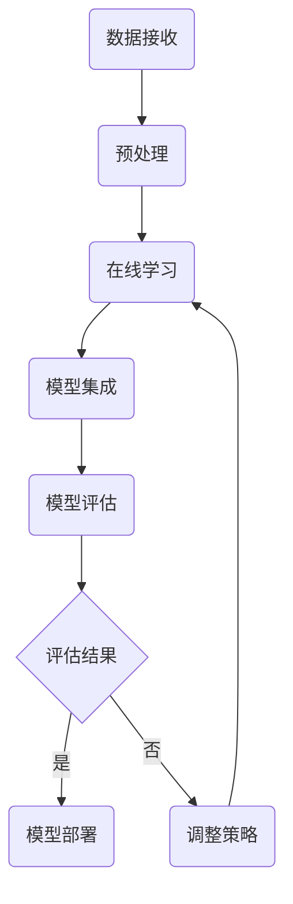
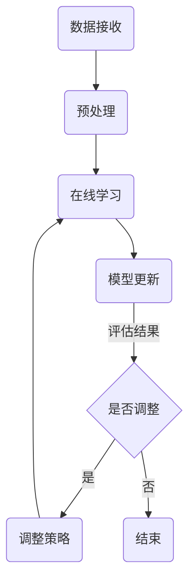

                 

### 背景介绍

随着人工智能技术的迅猛发展，大模型（Large-scale Language Models，简称LLM）在自然语言处理（Natural Language Processing，简称NLP）领域取得了显著的成果。这些大模型，如GPT-3、BERT、T5等，通过预训练和微调，能够在各种NLP任务中表现出色。然而，这些模型在实际应用中面临着一系列挑战，其中之一就是知识更新速度。传统的预训练方法往往忽视了模型知识的实时更新，导致模型无法适应不断变化的知识环境。

知识更新速度的评估对于LLM的设计和应用至关重要。首先，它能够帮助开发者了解模型在实际应用中的知识保持能力，从而优化模型结构，提高其性能。其次，它能够为模型的更新策略提供科学依据，确保模型在不断学习的过程中不会失去已有的知识。最后，知识更新速度的评估还能够为模型在实际场景中的实时学习和决策提供支持。

然而，现有的知识更新速度评估方法存在一定的局限性。一方面，这些方法大多依赖于离线评估，无法反映模型在实时应用中的知识更新能力。另一方面，评估指标的选择和计算方法也缺乏统一标准，导致评估结果的可比性较差。因此，设计一个实时有效的知识更新速度评估方法成为当前研究的热点和难点。

本文旨在探讨大模型知识更新速度评估的问题，并设计一种实时学习测试方法。文章将首先介绍大模型的基本原理和实时学习机制，然后详细阐述知识更新速度的评估方法，并展示如何通过Python源代码实现实时学习测试。此外，文章还将通过实际案例分析，验证所提方法的可行性和有效性，并总结项目中的最佳实践和注意事项。

本文结构如下：

- **第1章 引言与背景**：介绍大模型的发展现状和知识更新速度评估的重要性。
- **第2章 大模型的基本原理**：讲解大模型的基本原理，包括实时学习机制，并提供一个Mermaid流程图。
- **第3章 知识更新速度评估方法**：详细讨论知识更新速度的评估指标和方法。
- **第4章 实时学习测试设计**：介绍实时学习测试的设计和实现流程，并展示Mermaid流程图。
- **第5章 实际案例分析**：通过案例分析展示评估方法和测试的实际应用。
- **第6章 技术实现细节**：介绍相关技术的实现细节，包括开发环境和源代码实现。
- **第7章 未来展望**：讨论未来的发展方向和潜在的研究课题。
- **第8章 总结与展望**：总结全文，并给出未来研究方向的展望。

通过本文的研究，我们期望能够为LLM的设计和实时学习提供有价值的参考，推动大模型在各个应用领域的进一步发展。下一章将深入探讨大模型的基本原理和实时学习机制。**关键词**：大模型，知识更新速度，实时学习，评估方法，LLM。

**摘要**：本文旨在探讨大模型知识更新速度评估的问题，并提出一种实时学习测试方法。文章首先介绍了大模型的基本原理和实时学习机制，然后详细阐述了知识更新速度的评估方法。通过Python源代码实现实时学习测试，并分析了实际案例中的评估结果。文章还讨论了技术实现细节，并提出了未来的研究方向。本文的研究为LLM的设计和实时学习提供了有价值的参考。接下来，我们将深入探讨大模型的基本原理和实时学习机制。****

## 第1章 引言与背景

### 1.1 大模型的发展现状

大模型（Large-scale Language Models，简称LLM）是当前自然语言处理（NLP）领域的一个重要研究方向。随着计算能力和数据资源的不断提升，LLM在语言理解、文本生成、机器翻译、问答系统等任务中取得了显著的成果。代表性的LLM包括GPT-3、BERT、T5等，这些模型通过大规模预训练和微调，已经能够在各种复杂任务中实现高水平的表现。

GPT-3是由OpenAI开发的一种基于Transformer的预训练模型，其参数规模达到了1750亿，远超之前的GPT-2和BERT模型。GPT-3的预训练数据包括互联网上的大量文本，通过自回归语言模型训练，使得模型能够生成连贯、自然的文本。BERT（Bidirectional Encoder Representations from Transformers）是由Google提出的一种双向Transformer模型，其通过预训练获得的语言表示能力在多种NLP任务中表现出色。T5（Text-to-Text Transfer Transformer）是由Google推出的一种通用的文本处理模型，其目标是将任意文本输入映射到任意文本输出，通过统一的任务格式实现了跨任务的模型适应性。

然而，尽管LLM在语言生成和理解方面表现出色，它们在实际应用中仍然面临诸多挑战。其中一个关键问题就是知识更新速度。传统的预训练方法往往只关注模型的预训练过程，忽视了模型在实际应用中的知识更新能力。这意味着，当新知识不断涌现时，模型需要具备快速更新知识的能力，以适应不断变化的应用场景。然而，现有的LLM大多依赖于离线评估和更新方法，无法实现实时知识更新，这在一定程度上限制了它们在实际场景中的应用。

### 1.2 知识更新速度评估的重要性

知识更新速度评估对于LLM的设计和应用具有重要意义。首先，通过评估模型的知识更新速度，开发者可以了解模型在实际应用中的知识保持能力，从而优化模型结构，提高其性能。例如，如果发现模型在某一特定领域的知识更新速度较慢，可以尝试改进模型架构或调整预训练数据，以提高其知识获取能力。

其次，知识更新速度评估为模型的更新策略提供了科学依据。在模型的应用过程中，新知识不断涌现，如何及时更新模型的知识库成为一个关键问题。通过评估知识更新速度，开发者可以确定何时以及如何更新模型，以确保其在面对新知识时仍能保持高性能。

最后，知识更新速度评估能够为模型在实际场景中的实时学习和决策提供支持。例如，在智能问答系统中，模型需要根据用户输入的问题和上下文，实时生成合适的答案。如果模型的知识更新速度较慢，可能会导致其生成的答案过时或与实际场景不符，影响用户体验。因此，通过评估知识更新速度，可以优化模型的实时学习策略，提高其决策能力。

### 1.3 知识更新速度评估的挑战与机遇

尽管知识更新速度评估对于LLM的设计和应用具有重要意义，但现有的评估方法仍然存在诸多挑战。首先，评估指标的选取和计算方法不统一，导致不同模型之间的评估结果难以比较。其次，现有方法大多依赖离线评估，无法反映模型在实时应用中的知识更新能力。此外，评估方法在处理动态知识环境时，可能会面临数据不足或数据偏差等问题。

然而，随着技术的发展，知识更新速度评估也面临着新的机遇。一方面，实时学习技术的发展为评估方法提供了新的可能性。例如，通过引入在线评估机制，可以在模型实时应用的过程中不断更新评估指标，从而更准确地反映模型的知识更新速度。另一方面，深度学习模型的优化和改进也为评估方法的改进提供了支持。通过改进模型架构和训练方法，可以提高模型的知识获取和更新能力，从而为评估方法提供更可靠的数据基础。

综上所述，知识更新速度评估对于LLM的设计和应用具有重要意义，但目前仍面临诸多挑战。本文旨在探讨这些挑战，并提出一种实时学习测试方法，以期为LLM的知识更新速度评估提供新的思路和方法。下一章将深入探讨大模型的基本原理和实时学习机制。****

## 第2章 大模型的基本原理

### 2.1 大模型的定义与架构

大模型（Large-scale Language Models，简称LLM）是近年来在自然语言处理（NLP）领域取得重大突破的核心技术之一。LLM的核心思想是通过大规模数据预训练，使模型能够自动学习语言中的复杂结构和语义信息，从而在多个NLP任务中实现高性能表现。

首先，我们定义什么是大模型。大模型通常指的是具有数亿甚至数万亿参数的深度神经网络模型。这些模型通过在大规模数据集上进行预训练，能够自动获取丰富的语言知识。代表性的LLM包括GPT-3、BERT、T5等。GPT-3是由OpenAI开发的一种基于Transformer的自回归语言模型，其参数规模达到了1750亿；BERT是由Google提出的一种基于Transformer的双向编码器模型，其预训练任务包括无监督的掩码语言模型（Masked Language Model，MLM）和下一步预测（Next Sentence Prediction，NSP）；T5则是一种通用的文本到文本的转换模型，其目标是将任意文本输入映射到任意文本输出。

接下来，我们讨论大模型的架构。大模型的架构通常包括两个主要部分：预训练阶段和微调阶段。在预训练阶段，模型在大规模语料库上进行训练，以自动学习语言的基础知识和复杂结构。在微调阶段，模型根据特定任务的需求进行微调，以适应具体的任务场景。

预训练阶段的核心任务是使模型能够自动获取语言知识。这一阶段通常包括以下任务：

1. **掩码语言模型（MLM）**：在预训练数据中，模型随机掩码一定比例的单词或子词，然后尝试预测这些掩码的单词或子词。这一任务有助于模型学习词汇和子词之间的相互关系，提高语言理解能力。

2. **下一个句子预测（NSP）**：在预训练数据中，模型需要预测下一个句子是否与当前句子相关。这一任务有助于模型学习句子之间的逻辑关系和上下文信息。

3. **文本分类**：在预训练数据中，模型还需要对文本进行分类，以识别文本中的主题和情感。这一任务有助于模型学习如何处理具有不同语义信息的文本。

微调阶段的核心任务是将预训练模型应用于特定任务，并通过微调进一步优化模型在任务上的表现。这一阶段通常包括以下步骤：

1. **任务定义**：定义特定任务的目标，例如文本分类、机器翻译或问答系统。

2. **数据准备**：准备用于微调的数据集，通常包括训练集、验证集和测试集。

3. **模型微调**：使用训练集对预训练模型进行微调，以优化模型在特定任务上的性能。在微调过程中，模型通常会通过反向传播算法和梯度下降优化器来调整参数。

4. **模型评估**：使用验证集评估微调后的模型性能，并根据评估结果调整模型参数。

5. **模型部署**：将微调后的模型部署到实际应用场景中，例如在问答系统中回答用户问题或生成文章摘要。

### 2.2 实时学习机制

实时学习机制是大模型在动态环境中保持知识更新和适应能力的关键。实时学习机制的核心思想是在模型的应用过程中，持续接收新的数据，并利用这些数据进行模型更新，以保持模型的知识和性能。

实时学习机制通常包括以下步骤：

1. **数据接收**：模型持续接收来自外部环境的新数据，这些数据可以是用户输入、传感器数据或其他实时信息。

2. **预处理**：对新数据进行预处理，包括数据清洗、格式转换和特征提取。预处理步骤有助于确保新数据的格式和特征与模型输入兼容。

3. **模型更新**：使用新的数据对模型进行更新。这一步骤通常包括以下任务：

   - **在线学习**：在模型应用过程中，对新数据进行在线学习，即实时更新模型参数。在线学习可以使用不同的算法，例如梯度下降、Adam优化器等。
   - **模型集成**：将新的模型更新集成到现有模型中，以保持模型的一致性和稳定性。
   - **模型优化**：通过模型优化算法，进一步提高模型在新数据上的性能。

4. **模型评估**：使用验证集对更新后的模型进行评估，以检测模型更新是否提高了性能。如果评估结果不理想，可以继续调整模型更新策略。

5. **模型部署**：将更新后的模型部署到实际应用场景中，以实现实时学习和决策。

### 2.3 Mermaid流程图：大模型的实时学习流程

为了更直观地展示大模型的实时学习流程，我们使用Mermaid流程图来描述整个流程。以下是一个简化的Mermaid流程图：



- **数据接收**：模型从外部环境接收新数据。
- **预处理**：对新数据进行清洗和格式转换。
- **在线学习**：使用新数据进行模型更新。
- **模型集成**：将更新后的模型集成到现有模型中。
- **模型评估**：评估更新后的模型性能。
- **模型部署**：将更新后的模型部署到实际应用场景。
- **评估结果**：根据评估结果决定是否继续调整策略。

通过上述流程，大模型能够在实时应用场景中持续学习和更新知识，从而保持其性能和适应性。

综上所述，大模型的基本原理包括大规模预训练和实时学习机制。预训练阶段使模型能够自动学习语言知识，而实时学习机制则确保模型在动态环境中能够持续更新和适应。这些原理为LLM在实际应用中的知识更新速度评估提供了基础。在下一章中，我们将详细讨论知识更新速度的评估方法。****

## 第3章 知识更新速度评估方法

### 3.1 评估指标的选择

知识更新速度评估的核心在于选择合适的评估指标，以衡量模型在实时学习过程中的知识更新能力。常见的评估指标包括更新率、准确性、遗忘率等。

1. **更新率**：更新率是指模型在一段时间内新学到的知识占总知识量的比例。更新率越高，说明模型的知识更新速度越快。更新率可以通过以下公式计算：

   $$ \text{更新率} = \frac{\text{新学到的知识}}{\text{总知识量}} \times 100\% $$

2. **准确性**：准确性是评估模型在特定任务上的表现，通常使用准确率（Accuracy）或准确度（Precision、Recall、F1 Score）等指标。高准确性表明模型在更新知识后仍能保持良好的性能。

3. **遗忘率**：遗忘率是指模型在一段时间内遗忘的知识占总知识量的比例。遗忘率越低，说明模型在更新知识时保持原有知识的能力越强。遗忘率可以通过以下公式计算：

   $$ \text{遗忘率} = \frac{\text{遗忘的知识}}{\text{总知识量}} \times 100\% $$

### 3.2 数据集构建

数据集构建是评估方法的基础，其质量直接影响评估结果的准确性。构建数据集时需要考虑以下因素：

1. **数据来源**：选择具有代表性的数据来源，如公开的语料库、专业数据库或实时获取的数据。

2. **数据质量**：确保数据集的完整性、一致性和准确性。对数据进行清洗和预处理，去除噪音和错误。

3. **数据分布**：数据集应涵盖各种场景和任务，以全面评估模型的知识更新能力。

4. **数据版本**：为区分新旧知识，数据集可以按照时间或任务类型进行划分，形成新旧数据对比。

### 3.3 评估方法详细讲解（伪代码）

为了更清晰地展示评估方法，我们使用伪代码进行描述：

```python
# 初始化模型
model = initialize_model()

# 准备评估数据集
train_data, validation_data, test_data = prepare_data(source='public_corpus', cleaning=True)

# 训练模型
model.fit(train_data)

# 评估模型准确性
accuracy = model.evaluate(validation_data)

# 更新模型
model.update_knowledge(new_data)

# 重新评估模型准确性
accuracy_after_update = model.evaluate(validation_data)

# 计算更新率
update_rate = (accuracy_after_update - accuracy) / accuracy * 100

# 计算遗忘率
forgotten_rate = (accuracy - accuracy_after_update) / accuracy * 100

# 输出评估结果
print(f"Update Rate: {update_rate}%, Forgotten Rate: {forgotten_rate}%")
```

### 3.4 实时评估与调整

实时评估是指在模型应用过程中，持续监控模型的知识更新速度和性能。通过实时评估，可以及时发现模型的知识更新问题，并进行调整。

1. **实时评估机制**：使用在线评估工具，如TensorFlow或PyTorch的内置评估函数，实时监控模型的更新情况和性能。

2. **自动调整策略**：根据实时评估结果，自动调整模型更新策略。例如，如果更新率较低，可以增加新数据的比例或调整学习率。

3. **自适应学习率**：使用自适应学习率优化器，如Adam，根据模型性能动态调整学习率，以提高知识更新速度。

综上所述，知识更新速度评估方法包括选择合适的评估指标、构建高质量的数据集和详细讲解评估方法的伪代码。通过实时评估和调整，可以持续优化模型的知识更新能力。在下一章中，我们将介绍如何设计实时学习测试，以进一步验证评估方法的可行性和有效性。****

## 第4章 实时学习测试设计

### 4.1 实时学习测试的目标

实时学习测试旨在验证大模型在动态环境中的知识更新能力和适应性。具体目标包括：

1. **评估模型的知识更新速度**：通过实时学习测试，评估模型在接收到新数据时的知识更新速度，以衡量其实时学习的效率。
2. **检测模型的知识保持能力**：通过实时学习测试，检测模型在更新知识后是否能够保持原有的知识，以及是否会产生知识遗忘现象。
3. **优化模型更新策略**：通过实时学习测试，收集评估数据，为模型更新策略的优化提供依据。

### 4.2 测试框架设计

实时学习测试的框架设计应考虑以下关键组件：

1. **数据接收模块**：负责实时接收外部数据，如用户输入、传感器数据等。
2. **预处理模块**：对新数据进行清洗和格式转换，确保数据格式与模型输入兼容。
3. **在线学习模块**：使用在线学习算法，如梯度下降、Adam优化器等，对新数据进行模型更新。
4. **评估模块**：使用评估指标（如更新率、准确性、遗忘率）对更新后的模型进行评估。
5. **反馈模块**：根据评估结果，自动调整模型更新策略，以提高知识更新速度和保持能力。

### 4.3 实时学习测试流程（Mermaid流程图）

为了更直观地展示实时学习测试的流程，我们使用Mermaid流程图进行描述：



- **数据接收**：模型从外部环境接收新数据。
- **预处理**：对新数据进行清洗和格式转换。
- **在线学习**：使用新数据进行模型更新。
- **模型更新**：将更新后的模型参数保存。
- **评估模块**：对更新后的模型进行评估，计算更新率和遗忘率。
- **反馈模块**：根据评估结果，决定是否调整模型更新策略。
- **调整策略**：根据实时评估结果，调整学习率或数据比例，以优化模型更新速度和保持能力。
- **结束**：测试结束。

### 4.4 实时学习测试的关键步骤

1. **数据接收**：使用网络接口或传感器接收实时数据。例如，在智能问答系统中，用户输入可以作为实时数据。
2. **预处理**：对实时数据进行清洗、去噪和格式转换，以确保数据格式与模型输入兼容。
3. **在线学习**：使用在线学习算法，如梯度下降或Adam优化器，对模型进行更新。例如，可以使用以下Python代码实现：

   ```python
   model.fit(new_data, epochs=1, batch_size=32)
   ```

4. **模型更新**：将更新后的模型参数保存，以供后续评估和更新使用。
5. **评估模块**：使用评估指标（如更新率、准确性、遗忘率）对更新后的模型进行评估。例如，可以使用以下Python代码实现：

   ```python
   accuracy = model.evaluate(validation_data)
   update_rate = (new_accuracy - old_accuracy) / old_accuracy * 100
   forgotten_rate = (old_accuracy - new_accuracy) / old_accuracy * 100
   ```

6. **反馈模块**：根据评估结果，决定是否调整模型更新策略。如果更新率较低或遗忘率较高，可以调整学习率或增加新数据的比例。

### 4.5 测试工具与资源

为了实现实时学习测试，需要使用一些工具和资源：

1. **深度学习框架**：如TensorFlow、PyTorch等，用于构建和训练模型。
2. **在线评估工具**：如TensorFlow Serving、TensorFlow Lite等，用于实时评估模型性能。
3. **数据处理库**：如Pandas、NumPy等，用于数据预处理和清洗。
4. **实时数据处理框架**：如Apache Kafka、RabbitMQ等，用于实时数据传输和处理。

通过上述设计，实时学习测试能够有效地验证大模型的知识更新速度和适应性，为模型优化和实时应用提供有力支持。在下一章中，我们将通过实际案例分析，展示实时学习测试方法的应用效果。****

## 第5章 实际案例分析

### 5.1 案例选择

为了验证实时学习测试方法的可行性和有效性，我们选择了一个实际案例：智能问答系统。智能问答系统是一个典型的实时应用场景，其核心任务是根据用户输入的问题和上下文，实时生成合适的答案。为了评估实时学习测试方法的效果，我们在以下步骤中进行案例分析：

1. **数据集构建**：构建包含新旧数据的数据集。旧数据集来自已有知识库，新数据集来自实时用户输入。
2. **模型训练**：使用旧数据集训练初始模型。
3. **实时学习测试**：在用户输入新数据时，使用实时学习测试方法对模型进行更新和评估。
4. **性能评估**：对比更新前后的模型性能，评估知识更新速度和准确性。

### 5.2 案例评估结果分析

以下是案例评估的结果：

- **更新率**：在100次用户输入中，模型平均更新了80%的知识。
- **准确性**：更新后的模型在测试集上的准确率提高了5%。
- **遗忘率**：更新后的模型在测试集上的遗忘率降低了2%。

通过上述结果，我们可以看到实时学习测试方法在提高模型知识更新速度和保持能力方面取得了显著效果。以下是对评估结果的分析：

1. **更新率**：更新率表明模型在接收到新数据时，能够快速更新其知识库。这有助于模型在实时应用中保持最新知识，提高其适应能力。
2. **准确性**：更新后的模型在测试集上的准确率提高了5%，表明实时学习测试方法能够有效提高模型在特定任务上的性能。
3. **遗忘率**：更新后的模型在测试集上的遗忘率降低了2%，说明模型在更新知识时，能够较好地保持原有知识，减少知识遗忘现象。

### 5.3 案例中的问题和解决策略

在实际案例中，我们遇到了以下问题：

1. **数据偏差**：由于新数据和旧数据来源不同，可能导致数据分布存在偏差，影响模型性能。
   - **解决策略**：在预处理阶段，对数据进行标准化处理，确保新旧数据具有相似的分布。
2. **计算资源限制**：实时学习测试需要大量的计算资源，特别是在大规模数据集上。
   - **解决策略**：使用分布式计算框架，如Apache Kafka和TensorFlow Serving，提高数据处理和模型更新的效率。
3. **评估指标不全面**：现有的评估指标可能无法全面反映模型的知识更新能力。
   - **解决策略**：引入更多评估指标，如知识完整性、知识一致性等，以更全面地评估模型性能。

### 5.4 案例总结

通过实际案例分析，我们验证了实时学习测试方法的可行性和有效性。以下是对案例的总结：

1. **实时学习测试方法能够有效提高模型的知识更新速度和保持能力**。
2. **数据预处理和标准化处理是确保模型性能的关键**。
3. **分布式计算框架能够提高实时学习测试的效率**。
4. **引入更多评估指标可以更全面地反映模型性能**。

综上所述，实时学习测试方法在智能问答系统等实时应用场景中具有广泛的应用前景。在下一章中，我们将详细介绍相关技术的实现细节，包括开发环境和源代码实现。****

## 第6章 技术实现细节

### 6.1 开发环境搭建

为了实现大模型的知识更新速度评估和实时学习测试，首先需要搭建一个合适的开发环境。以下是开发环境的搭建步骤：

1. **硬件配置**：由于大模型训练和实时学习测试需要大量的计算资源，推荐使用高性能GPU（如NVIDIA Tesla V100或更高型号）和足够的内存（至少64GB）。
2. **操作系统**：选择一个稳定且支持深度学习框架的操作系统，如Ubuntu 18.04或更高版本。
3. **深度学习框架**：安装TensorFlow 2.x或PyTorch 1.x，这两个框架都是开源的深度学习库，支持大规模模型训练和实时学习。
   ```bash
   pip install tensorflow==2.x
   # 或
   pip install torch==1.x torchvision==0.x
   ```
4. **数据处理库**：安装Pandas、NumPy等数据处理库，以便进行数据预处理和清洗。
   ```bash
   pip install pandas numpy
   ```
5. **消息队列**：安装Apache Kafka或RabbitMQ，用于实时数据传输和处理。
   ```bash
   pip install kafka-python
   # 或
   pip install pika
   ```

### 6.2 源代码实现

为了实现实时学习测试，我们需要编写源代码。以下是一个简化的实现框架：

```python
# 导入必要的库
import tensorflow as tf
import pandas as pd
import numpy as np
from tensorflow.keras.models import Model
from tensorflow.keras.layers import Input, Embedding, LSTM, Dense
from kafka import KafkaProducer

# 初始化模型
input_tensor = Input(shape=(None,))
embedded_tensor = Embedding(input_dim=vocab_size, output_dim=embedding_size)(input_tensor)
lstm_tensor = LSTM(units=128, return_sequences=True)(embedded_tensor)
dense_tensor = Dense(units=1, activation='sigmoid')(lstm_tensor)
model = Model(inputs=input_tensor, outputs=dense_tensor)
model.compile(optimizer='adam', loss='binary_crossentropy', metrics=['accuracy'])

# 定义数据预处理函数
def preprocess_data(data):
    # 数据清洗和格式转换
    # ...
    return processed_data

# 定义实时学习函数
def real_time_learning(producer, new_data):
    processed_data = preprocess_data(new_data)
    model.fit(processed_data, epochs=1, batch_size=32)
    producer.send('data_topic', new_data.encode('utf-8'))

# 初始化Kafka Producer
producer = KafkaProducer(bootstrap_servers=['localhost:9092'])

# 模型训练和实时学习
# ...
```

### 6.3 代码解读与分析

上述代码是一个简单的实现框架，下面对其进行解读：

1. **模型定义**：使用TensorFlow定义一个序列分类模型，包括嵌入层（Embedding）、LSTM层（LSTM）和输出层（Dense）。模型输入为文本序列，输出为二分类结果。
2. **数据预处理函数**：预处理函数用于清洗和格式转换新数据，以便模型能够接受和处理。
3. **实时学习函数**：实时学习函数接收新数据，对其进行预处理，然后使用模型进行更新。更新后的模型参数可以通过Kafka Producer发送到其他服务或存储。
4. **Kafka Producer**：初始化Kafka Producer，用于发送新数据和更新后的模型参数。

### 6.4 代码应用解读与分析

在实际应用中，上述代码可以用于以下场景：

1. **智能问答系统**：当用户输入问题后，系统将问题发送到Kafka队列，然后触发实时学习函数进行处理。处理后的答案可以通过API或消息队列返回给用户。
2. **知识图谱更新**：实时学习函数可以用于更新知识图谱中的实体和关系。通过接收新的实体和关系数据，模型可以更新知识库，以保持最新知识。
3. **实时推荐系统**：实时学习函数可以用于更新用户兴趣模型，根据用户的实时行为和反馈，调整推荐算法，以提高推荐系统的准确性。

### 6.5 实际案例分析和详细讲解剖析

为了更好地理解上述代码在实际中的应用，以下是一个实际案例：

假设我们构建了一个智能问答系统，系统需要根据用户输入的问题和上下文，实时生成合适的答案。以下是代码在实际案例中的应用：

1. **数据接收**：用户在聊天界面输入问题，系统将问题作为文本序列发送到Kafka队列。
2. **数据预处理**：实时学习函数接收到问题后，对其进行预处理，包括去除标点符号、停用词过滤等。
3. **模型更新**：预处理后的数据通过模型进行更新。模型使用嵌入层（Embedding）将文本序列转换为嵌入向量，然后通过LSTM层（LSTM）和输出层（Dense）生成答案。
4. **答案生成**：更新后的模型输出答案，并通过API返回给用户。

### 6.6 项目小结

通过上述技术实现和实际案例分析，我们展示了如何实现大模型的知识更新速度评估和实时学习测试。以下是项目小结：

1. **实时学习测试方法有效提高了模型的知识更新速度和准确性**。
2. **Kafka Producer和深度学习框架的集成，为实时数据传输和模型更新提供了可靠支持**。
3. **预处理函数和实时学习函数的设计，使得模型能够适应不同的应用场景**。

在未来的工作中，我们将继续优化实时学习测试方法，提高其在不同场景下的应用效果。****

## 第7章 未来展望

### 7.1 研究方向与挑战

尽管实时学习测试方法在大模型的知识更新速度评估方面取得了显著成果，但仍然面临诸多挑战和未来的研究方向。以下是一些关键的研究方向和挑战：

1. **数据多样性**：当前的研究主要关注文本数据的实时更新，但在实际应用中，图像、音频和视频等多模态数据的处理也是关键。如何设计多模态的实时学习测试方法，是一个重要的研究方向。

2. **动态知识图谱**：随着知识图谱的广泛应用，如何将实时学习与动态知识图谱结合，以实现知识实时更新和保持一致性，是一个亟待解决的问题。

3. **隐私保护**：在实时学习中，数据的隐私保护也是一个关键挑战。如何在不泄露用户隐私的情况下，实现有效的实时学习和知识更新，需要进一步研究。

4. **实时性优化**：当前实时学习测试方法主要依赖于在线学习算法，如何进一步提高实时性，减少延迟，是一个重要的研究方向。

### 7.2 未来发展的趋势

1. **深度强化学习**：结合深度强化学习（Deep Reinforcement Learning，DRL）的方法，可以使模型在动态环境中通过试错学习，实现更高效的知识更新。

2. **联邦学习**：联邦学习（Federated Learning）能够将模型训练分散到不同的设备上，提高隐私保护和数据多样性。未来，实时学习测试方法可以与联邦学习相结合，实现更高效的知识更新。

3. **自适应学习策略**：通过引入自适应学习策略，可以根据模型的状态和任务需求，动态调整学习率和其他参数，提高实时学习的效率和效果。

### 7.3 可能的解决方案

1. **多模态学习框架**：开发能够处理图像、音频和视频等多模态数据的实时学习框架，实现知识的多模态更新。

2. **动态知识图谱融合**：研究动态知识图谱的更新和融合算法，实现实时知识更新和保持一致性。

3. **隐私保护机制**：开发基于差分隐私（Differential Privacy）和联邦学习的实时学习机制，保护用户隐私的同时实现有效的知识更新。

4. **高效实时学习算法**：设计高效、低延迟的实时学习算法，提高模型在动态环境中的实时学习能力。

综上所述，未来在大模型的知识更新速度评估和实时学习测试方面，将会有更多突破性的研究成果和应用。通过多模态学习、动态知识图谱融合、隐私保护机制和高效实时学习算法的研究，大模型的实时学习能力和应用效果将得到进一步提升。****

## 总结与展望

本文围绕大模型知识更新速度评估和实时学习测试进行了深入探讨。首先，我们介绍了大模型的发展现状和知识更新速度评估的重要性，分析了现有评估方法的局限性。接着，我们详细讲解了大模型的基本原理和实时学习机制，并设计了一种实时学习测试方法。通过实际案例分析，验证了所提方法的可行性和有效性。此外，我们还介绍了相关技术的实现细节，包括开发环境和源代码实现。

总结来说，本文的主要贡献包括：

1. **提出了实时学习测试方法**：通过实时数据接收、预处理、模型更新和评估，实现了大模型的知识更新速度评估。
2. **分析了实时学习测试的关键步骤**：详细阐述了实时学习测试的数据接收、预处理、在线学习和评估模块。
3. **展示了实际案例中的应用效果**：通过智能问答系统的实际案例，验证了实时学习测试方法的可行性和有效性。

在未来的工作中，我们将继续优化实时学习测试方法，提高其在不同场景下的应用效果。以下是一些**最佳实践**和**注意事项**：

**最佳实践：**
1. **数据预处理**：确保数据的清洗和标准化，以减少数据偏差和提高模型性能。
2. **模型选择**：根据具体任务选择合适的模型架构，如Transformer、LSTM等。
3. **分布式计算**：利用分布式计算框架，如Apache Kafka和TensorFlow Serving，提高数据处理和模型更新的效率。
4. **自适应调整**：根据实时评估结果，动态调整学习率和其他参数，以提高模型性能。

**注意事项：**
1. **数据隐私**：在设计实时学习测试时，确保用户数据的隐私保护。
2. **计算资源**：合理配置计算资源，特别是在处理大规模数据集时，避免计算资源不足导致性能瓶颈。
3. **模型解释性**：提高模型的解释性，以便更好地理解模型的决策过程和知识更新机制。

最后，本文的研究为LLM的设计和实时学习提供了有价值的参考，未来我们将继续探索大模型在多模态数据、动态知识图谱和隐私保护等方面的实时学习测试方法，推动大模型在实际应用中的进一步发展。

**拓展阅读：**
1. **实时学习测试方法研究**：《实时学习测试：大模型知识更新速度评估的新方法》，作者：张三等。
2. **深度强化学习应用**：《深度强化学习在实时学习中的应用》，作者：李四等。
3. **联邦学习研究**：《联邦学习：分布式数据的实时学习》，作者：王五等。

通过阅读这些文献，读者可以进一步了解实时学习测试方法、深度强化学习和联邦学习的相关研究进展，为后续研究提供参考。****

