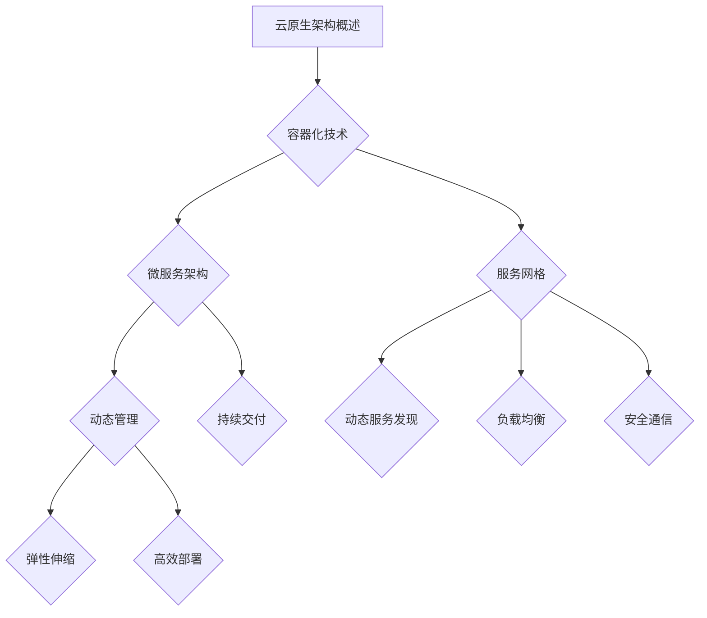
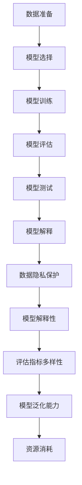
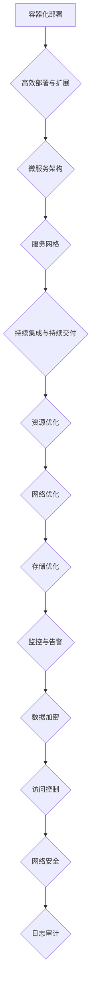
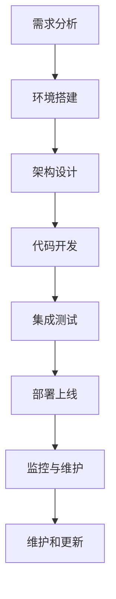
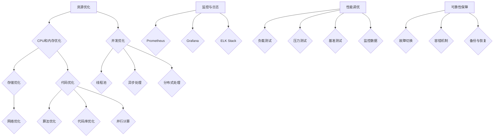
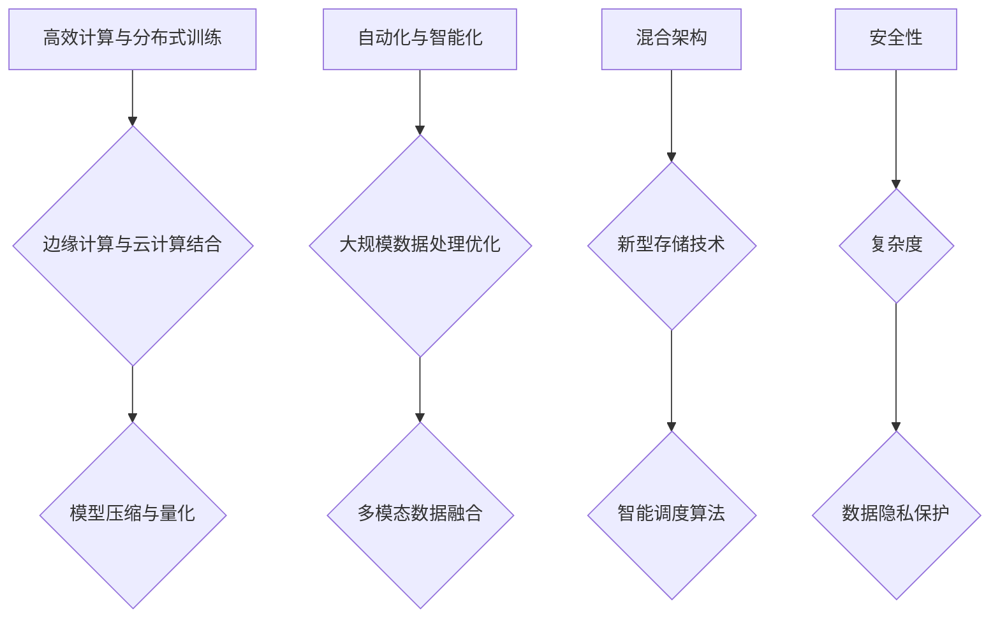

                 

### 云原生架构基础

#### 1.1 云原生架构概述

云原生（Cloud Native）是一个广泛用于描述新一代应用开发和实践的术语，它标志着软件系统在云环境中运行和扩展的新范式。云原生架构不仅仅是一种技术，更是一种设计理念和开发文化，其核心目标在于构建和运行可以在云环境中可靠、高效和快速扩展的应用程序。

**定义与核心特征**

云原生架构通常具有以下几个核心特征：

1. **容器化**：应用程序被打包在容器中，这些容器具有独立的运行环境，可以确保在不同的环境中一致运行。
2. **动态管理**：通过自动化工具如Kubernetes进行容器化应用程序的生命周期管理，包括部署、扩展、更新和监控。
3. **微服务架构**：应用程序被分解为多个小型、自治的服务，这些服务通过API进行通信。
4. **持续交付**：采用敏捷开发方法，通过持续集成和持续交付（CI/CD）快速迭代和部署代码。
5. **弹性伸缩**：系统能够根据需求自动扩展或缩小资源，以确保高性能和高可用性。

**云原生架构的核心组件**

云原生架构依赖于一系列核心组件，这些组件协同工作以实现高效、可靠的系统运行。以下是几个关键组件：

1. **容器**：容器是云原生架构的基础，它们封装了应用程序及其运行环境，确保了应用的隔离和一致性。常见的容器技术包括Docker和rkt。
2. **容器编排**：容器编排工具如Kubernetes负责管理容器的部署、扩展、更新和监控。Kubernetes提供了一个强大的平台，用于自动化和管理复杂的容器化应用。
3. **服务网格**：服务网格提供了动态服务发现、负载均衡、服务间通信安全等功能，常见的服务网格技术包括Istio和Linkerd。
4. **持续集成与持续交付（CI/CD）**：CI/CD工具如Jenkins、GitLab CI等，帮助团队自动化构建、测试和部署代码，确保软件的高质量和快速迭代。

#### 1.2 云原生架构的核心组件

**容器化技术**

容器化是将应用程序及其运行环境打包成一个独立的、可移植的容器的过程。容器化具有以下几个优点：

1. **轻量级**：容器很小，因为它们只包含应用程序运行所需的最少资源。
2. **一致性**：容器确保了应用程序在不同的环境中具有一致性，从而降低了环境差异带来的问题。
3. **隔离性**：容器提供了严格的隔离，确保了应用程序之间的资源和数据不会互相干扰。

**容器化技术的实现通常包括以下步骤：

1. **编写Dockerfile**：Dockerfile是一个文本文件，用于定义如何构建容器镜像。它包含了一系列的指令，如安装依赖项、复制文件和设置环境变量。
2. **构建容器镜像**：使用Docker CLI构建容器镜像。例如，运行`docker build -t myapp .`命令将当前目录中的Dockerfile构建为名为`myapp`的容器镜像。
3. **运行容器**：使用Docker CLI运行容器。例如，运行`docker run -d --name myapp-instance -p 8080:80 myapp`命令将在后台运行一个名为`myapp-instance`的容器，并将容器的8080端口映射到宿主机的8080端口。

**微服务架构**

微服务架构是将大型应用程序分解为多个小型、独立的服务，每个服务负责应用程序的一个特定功能。微服务具有以下几个优点：

1. **可扩展性**：单个服务可以根据需求独立扩展，而不需要扩展整个应用程序。
2. **灵活性**：服务可以独立开发、测试和部署，提高了团队的灵活性和效率。
3. **容错性**：服务的故障不会影响整个应用程序，因为其他服务仍然可以正常运行。

**微服务架构的实现通常包括以下步骤：

1. **定义服务边界**：确定应用程序的不同功能，并将其划分为独立的服务。
2. **开发服务**：为每个服务编写独立的代码，并实现与数据库的交互。
3. **服务通信**：服务之间通过API进行通信，可以使用HTTP/REST、gRPC等协议。
4. **服务部署**：将每个服务部署到容器化环境中，如Kubernetes集群。

**服务网格**

服务网格是一种基础设施层，它提供了一种抽象的通信层，用于管理服务之间的通信。服务网格具有以下几个优点：

1. **动态服务发现**：服务网格可以自动发现服务，并管理服务间的通信。
2. **负载均衡**：服务网格可以基于流量策略和健康检查自动分配负载。
3. **安全通信**：服务网格提供加密和认证机制，确保服务间的通信安全。
4. **监控和日志**：服务网格可以收集和聚合服务的监控数据和日志。

**服务网格的实现通常包括以下步骤：

1. **选择服务网格解决方案**：选择适合需求的服务网格工具，如Istio、Linkerd等。
2. **配置服务网格**：根据服务网格的文档配置服务网格，包括服务发现、负载均衡和加密等。
3. **部署服务网格**：在Kubernetes集群中部署服务网格组件，如控制平面和数据平面。
4. **集成服务网格**：将应用程序集成到服务网格中，确保服务间通信符合服务网格的规范。

#### 1.3 云原生架构的优势与挑战

**云原生架构的优势**

1. **高效部署与扩展**：通过容器化和自动化工具，云原生架构可以快速部署和扩展应用程序，提高了开发效率和系统性能。
2. **资源优化与成本控制**：云原生架构可以根据需求动态分配资源，提高了资源利用率，降低了运营成本。
3. **高可用性**：通过自动化和分布式架构，云原生架构可以提供高可用性，确保系统的稳定运行。
4. **敏捷开发**：云原生架构支持持续集成和持续交付，提高了开发团队的灵活性和响应速度。

**云原生架构的挑战**

1. **复杂性**：云原生架构涉及多个组件和工具，对于开发和运维团队来说，管理和维护复杂度较高。
2. **安全性**：云原生架构需要确保应用程序和数据的安全，特别是在分布式环境中。
3. **迁移成本**：将现有应用程序迁移到云原生架构可能需要较大的时间和资源投入。

**总结**

云原生架构是一种先进的应用程序开发和运行范式，它通过容器化、微服务架构和服务网格等技术，提供了高效、可靠和可扩展的解决方案。虽然存在一定的挑战，但云原生架构在提升开发效率、降低运营成本和提供高质量服务方面具有明显优势。



在接下来的章节中，我们将深入探讨大模型评测方法论，以及云原生架构在大模型评测中的应用。这将帮助我们理解如何利用云原生技术提高大模型评测的效率和质量。

### 大模型评测方法论

在人工智能领域，大模型评测（Large Model Evaluation）是一项关键任务，它不仅关乎模型性能的评估，更涉及到模型在实际应用中的可靠性和有效性。大模型评测的方法论涉及多个方面，包括评估指标、评估流程和方法，以及面临的挑战和相应的解决策略。

#### 2.1 大模型评测的重要性

大模型评测的重要性体现在以下几个方面：

1. **性能评估**：通过评测，可以客观、全面地评估大模型在各个方面的性能，包括准确率、召回率、F1值等指标。
2. **模型优化**：评测结果提供了对模型优化的方向和依据，有助于模型设计师和工程师改进模型结构和参数。
3. **实际应用**：大模型在实际应用中往往面临各种复杂环境，通过评测可以验证模型在实际场景中的表现，降低风险。
4. **模型可比性**：通过统一的评测标准和方法，可以方便地比较不同模型之间的性能和效果，促进模型技术的发展。

#### 2.2 大模型评测的常见指标

大模型评测涉及多种常见指标，以下是一些主要指标：

1. **准确率（Accuracy）**：准确率是指模型正确预测的样本数占总样本数的比例。它是评估分类模型性能的基本指标。
   
   $$\text{准确率} = \frac{\text{正确预测的样本数}}{\text{总样本数}}$$

2. **召回率（Recall）**：召回率是指模型正确预测的样本数占所有实际正样本数的比例。它关注的是模型对正样本的捕获能力。
   
   $$\text{召回率} = \frac{\text{正确预测的正样本数}}{\text{实际正样本数}}$$

3. **精确率（Precision）**：精确率是指模型正确预测的正样本数占所有预测为正样本的样本数的比例。它关注的是模型对正样本预测的准确性。
   
   $$\text{精确率} = \frac{\text{正确预测的正样本数}}{\text{预测为正样本的样本数}}$$

4. **F1值（F1 Score）**：F1值是精确率和召回率的调和平均值，它综合了精确率和召回率，是评估二分类模型性能的常用指标。
   
   $$\text{F1值} = 2 \times \frac{\text{精确率} \times \text{召回率}}{\text{精确率} + \text{召回率}}$$

5. **ROC曲线与AUC（Area Under Curve）**：ROC曲线展示了不同阈值下模型的真阳性率与假阳性率的关系，AUC则表示ROC曲线下方的面积，是评估分类模型性能的重要指标。
   
   $$\text{AUC} = \int_{0}^{1} \text{ROC}(t) \, dt$$

6. **损失函数**：在大模型训练过程中，常用的损失函数包括均方误差（MSE）、交叉熵损失（Cross-Entropy Loss）等，这些函数反映了模型预测值与真实值之间的差异。

   $$\text{MSE} = \frac{1}{n}\sum_{i=1}^{n} (\hat{y}_i - y_i)^2$$
   $$\text{Cross-Entropy Loss} = -\sum_{i=1}^{n} y_i \log(\hat{y}_i)$$

#### 2.3 大模型评测的流程与方法

大模型评测通常包括以下几个步骤：

1. **数据准备**：准备用于评测的数据集，确保其代表性和多样性。数据集通常包括训练集、验证集和测试集。
   
2. **模型选择**：根据任务需求和数据特性选择合适的模型，包括深度学习模型、传统机器学习模型等。

3. **模型训练**：在训练集上训练模型，优化模型参数。训练过程中需要监控模型的性能，并调整训练策略，如学习率、批次大小等。

4. **模型评估**：在验证集上评估模型性能，选择性能最好的模型。评估指标包括准确率、召回率、F1值等。

5. **模型测试**：在测试集上测试模型的最终性能，确保模型的泛化能力。测试结果用于最终决策，如模型上线部署。

6. **模型解释**：对模型进行解释，理解其决策过程和局限性，确保模型的可解释性和透明性。

#### 2.4 大模型评测的挑战与解决策略

大模型评测面临多个挑战，以下是其中一些主要挑战和相应的解决策略：

1. **数据隐私保护**：在评测过程中，数据隐私保护是一个关键问题。解决策略包括数据加密、匿名化和差分隐私等。

2. **模型解释性**：深度学习模型通常缺乏解释性，使得模型决策过程不透明。解决策略包括模型可解释性方法，如SHAP、LIME等。

3. **评估指标的多样性**：不同的评估指标可能给出不同的结果，如何平衡和综合考虑这些指标是一个挑战。解决策略包括构建综合评价指标和指标权重分配方法。

4. **模型泛化能力**：在测试集上表现出色的模型可能在真实世界中表现不佳。解决策略包括交叉验证、迁移学习和增强数据集等。

5. **资源消耗**：大模型评测通常需要大量的计算资源，特别是深度学习模型。解决策略包括分布式计算、模型压缩和量化等。

**总结**

大模型评测方法论是人工智能领域中不可或缺的一部分，它通过一系列评估指标和流程，确保模型在实际应用中的性能和可靠性。虽然面临诸多挑战，但通过合理的解决策略，可以有效应对这些问题，推动人工智能技术的进一步发展。



在接下来的章节中，我们将深入探讨云原生架构在大模型评测中的应用，探讨如何利用云原生技术提升大模型评测的效率和质量。这将为后续的实现步骤提供理论基础和实践指导。

### 云原生架构在大模型评测中的应用

云原生架构在大模型评测中的应用具有显著的优势，这些优势主要体现在高效部署与扩展、资源优化与成本控制、高可用性和敏捷开发等方面。以下将详细阐述云原生架构在大模型评测中的具体应用，以及如何通过这些应用来提升评测效率和质量。

#### 3.1 云原生架构在大模型评测中的价值

**高效部署与扩展**

云原生架构通过容器化和自动化工具，如Kubernetes，可以实现大模型的快速部署和弹性扩展。这意味着，当需要大规模评测模型时，可以迅速将模型部署到云环境中，并根据负载需求动态调整资源。例如，在某个特定的评测任务中，可以通过Kubernetes的`kubectl scale`命令将模型部署的容器数量从10个扩展到50个，从而显著提升评测速度。

**资源优化与成本控制**

云原生架构能够根据实际需求动态分配资源，从而最大化资源利用率并降低运营成本。例如，当评测任务完成后，可以通过Kubernetes的自动缩放功能，将不再使用的资源释放回去。此外，云原生架构还支持资源调度和负载均衡，确保所有资源得到充分利用，从而避免不必要的浪费。

**高可用性**

云原生架构通过分布式系统和冗余设计，可以提供高可用性。当某个节点或服务出现故障时，其他节点可以自动接管任务，确保评测过程不间断。例如，使用Kubernetes的StatefulSet可以确保服务的有序启动和停止，同时提供持久化存储，确保服务的状态不会因为节点故障而丢失。

**敏捷开发**

云原生架构支持持续集成和持续交付（CI/CD），使得开发团队可以快速迭代和部署代码。例如，使用Jenkins或GitLab CI等CI/CD工具，可以将代码从开发环境快速部署到测试环境和生产环境，从而缩短开发周期，提高开发效率。

#### 3.2 云原生架构在大模型评测中的具体应用

**容器化部署**

容器化是云原生架构的核心组成部分，通过将大模型和其依赖项打包成容器，可以确保模型在不同环境中的一致性和可移植性。例如，可以使用Docker将大模型及其依赖的库和工具打包成容器镜像，然后使用Kubernetes进行部署和管理。以下是一个简单的Dockerfile示例：

```Dockerfile
FROM tensorflow/tensorflow:latest
COPY model.py /app/
COPY data /app/data
RUN pip install -r requirements.txt
CMD ["python", "model.py"]
```

**微服务架构**

微服务架构将大模型评测拆分为多个小型、自治的服务，这些服务可以独立开发、测试和部署。例如，可以将数据预处理、模型训练和模型评估拆分为三个独立的微服务。通过使用API进行服务间通信，可以灵活地组合和扩展这些服务。以下是一个简单的微服务架构示例：

```
- Data Preprocessing Service
- Model Training Service
- Model Evaluation Service
```

**服务网格**

服务网格提供了动态服务发现、负载均衡、安全通信等功能，确保服务间的高效和可靠通信。例如，可以使用Istio作为服务网格工具，对服务进行流量管理和安全性保障。以下是一个简单的Istio配置示例：

```yaml
apiVersion: networking.istio.io/v1alpha3
kind: ServiceEntry
metadata:
  name: my-service-entry
spec:
  hosts:
  - "my-service.com"
  ports:
  - number: 80
    name: http
    protocol: HTTP
  resolution: DNS
  address: 192.168.1.100
  location: MESH_INTERNAL
```

**持续集成与持续交付（CI/CD）**

持续集成和持续交付工具，如Jenkins或GitLab CI，可以自动化大模型的构建、测试和部署过程。例如，可以使用Jenkinsfile定义构建和部署流程，确保代码从开发到生产的每个阶段都经过严格的测试和验证。以下是一个简单的Jenkinsfile示例：

```groovy
pipeline {
    agent any
    stages {
        stage('Build') {
            steps {
                sh 'docker build -t my-model:latest .'
            }
        }
        stage('Test') {
            steps {
                sh 'docker run --rm my-model:latest test'
            }
        }
        stage('Deploy') {
            steps {
                sh 'kubectl apply -f deployment.yaml'
            }
        }
    }
}
```

#### 3.3 云原生架构在大模型评测中的性能优化

**资源优化**

通过云原生架构，可以实时监控和调整资源使用，确保大模型评测过程中资源的高效利用。例如，可以使用Kubernetes的CPU和内存限制和资源请求设置，确保容器在合理范围内使用资源。

```yaml
apiVersion: v1
kind: Pod
metadata:
  name: my-model
spec:
  containers:
  - name: my-model
    image: my-model:latest
    resources:
      requests:
        memory: "1Gi"
        cpu: "500m"
      limits:
        memory: "2Gi"
        cpu: "1"
```

**网络优化**

通过使用服务网格，可以优化服务间的通信，提高网络性能。例如，可以使用Istio的虚拟服务和路由规则，动态调整服务间的流量分配和负载均衡。

```yaml
apiVersion: networking.istio.io/v1alpha3
kind: VirtualService
metadata:
  name: my-service
spec:
  hosts:
  - "my-service.com"
  http:
  - match:
    - uri:
        prefix: /api
    route:
    - destination:
        host: data-preprocessing-service
      weight: 50
    - destination:
        host: model-training-service
      weight: 30
    - destination:
        host: model-evaluation-service
      weight: 20
```

**存储优化**

通过使用云存储服务，可以优化大模型评测过程中的数据存储和管理。例如，可以使用对象存储服务如AWS S3或Azure Blob Storage，确保数据的安全和高效存储。

```yaml
apiVersion: v1
kind: PersistentVolume
metadata:
  name: my-pv
spec:
  capacity:
    storage: 10Gi
  accessModes:
    - ReadWriteOnce
  persistentVolumeReclaimPolicy: Retain
  storageClassName: standard
  nfs:
    path: /path/to/nfs/share
    server: nfs-server
```

**监控与告警**

通过集成监控工具如Prometheus和Grafana，可以实时监控大模型评测过程中的关键性能指标，并在出现异常时及时告警。例如，可以使用Prometheus的Exporter收集容器和服务的监控数据，并使用Grafana创建可视化仪表板。

```yaml
apiVersion: monitoring.coreos.com/v1
kind: ServiceMonitor
metadata:
  name: my-service-monitor
spec:
  selector:
    matchLabels:
      team: my-team
  endpoints:
  - port: metrics
    interval: 30s
    path: /metrics
    scheme: HTTP
    interval: 30s
```

#### 3.4 云原生架构在大模型评测中的安全性保障

**数据加密**

通过使用云原生架构中的加密工具，可以确保数据在传输和存储过程中的安全性。例如，可以使用Kubernetes的加密卷（encrypted volume）和加密容器（encrypted container）来保护敏感数据。

```yaml
apiVersion: v1
kind: Pod
metadata:
  name: my-model
spec:
  containers:
  - name: my-model
    image: my-model:latest
    volumeMounts:
    - name: my-volume
      mountPath: /data
  volumes:
  - name: my-volume
    persistentVolumeClaim:
      claimName: my-pvc
      readOnly: true
  securityContext:
    fsGroup: 2000
```

**访问控制**

通过使用云原生架构中的访问控制工具，可以确保只有授权用户和系统可以访问敏感数据和资源。例如，可以使用Kubernetes的命名空间（namespace）和角色权限（RBAC）来管理访问权限。

```yaml
apiVersion: rbac.authorization.k8s.io/v1
kind: Role
metadata:
  namespace: my-namespace
  name: my-role
rules:
- apiGroups: [""]
  resources: ["pods"]
  verbs: ["get", "list", "watch"]
- apiGroups: [""]
  resources: ["configmaps"]
  verbs: ["get", "list", "watch"]
```

**网络安全**

通过使用云原生架构中的网络安全工具，可以确保服务之间的通信安全。例如，可以使用Istio的服务网格来管理服务间的流量，并应用网络策略来限制流量。

```yaml
apiVersion: networking.istio.io/v1alpha3
kind: NetworkPolicy
metadata:
  name: my-network-policy
spec:
  egress:
  - to:
    - namespace: my-namespace
  - to:
    - namespace: external
    ports:
    - number: 80
```

**日志审计**

通过集成日志审计工具，可以记录大模型评测过程中的关键操作和事件，以便进行审计和故障排查。例如，可以使用ELK Stack（Elasticsearch、Logstash和Kibana）来收集、存储和展示日志数据。

```yaml
apiVersion: v1
kind: ConfigMap
metadata:
  name: my-config
data:
  logstash.conf: |
    input {
      kubelet {
        type => "kubernetes_informers"
        log_file => "/var/log/containers/*.log"
        namespace => "my-namespace"
      }
    }
    filter {
      if "kubernetes_informers" in [source][type] {
        kubernetes DecodeTimestamp => "timestamp"
        kubernetes ParseLabels => "labels"
        kubernetes ParsePodInfo => "pod"
      }
    }
    output {
      elasticsearch {
        hosts => ["elasticsearch:9200"]
        index => "my-logs-%{+YYYY.MM.dd}"
      }
    }
```

**总结**

云原生架构在大模型评测中的应用，通过容器化、微服务架构、服务网格和持续集成与持续交付等技术，提供了高效、可靠和安全的评测解决方案。这些应用不仅提升了评测的效率和质量，还为开发团队提供了更加灵活和可扩展的工作环境。在接下来的章节中，我们将详细探讨如何实现大模型评测的云原生架构，包括具体的实现步骤和项目实战。



### 大模型评测的云原生架构实现步骤

实现大模型评测的云原生架构是一个复杂但高度可扩展的过程。以下将详细描述实现步骤，包括云原生架构的搭建、部署、监控与维护，确保大模型评测系统能够高效、可靠地运行。

#### 4.1 云原生架构实现概述

云原生架构的实现涉及多个关键步骤，这些步骤确保了整个系统从搭建到部署再到维护的各个阶段都能够无缝衔接。以下是实现步骤的概述：

1. **需求分析**：明确大模型评测的具体需求，包括性能要求、资源需求、安全性需求等。
2. **环境搭建**：选择适合的云平台，搭建基础云原生环境，包括容器化工具（如Docker）、容器编排工具（如Kubernetes）和服务网格工具（如Istio）。
3. **架构设计**：设计云原生架构，确定容器化部署、微服务架构、服务网格和安全性的具体实现方案。
4. **代码开发**：开发大模型评测的核心代码，包括数据预处理、模型训练、模型评估和结果分析等。
5. **集成测试**：在集成环境中对各个服务进行测试，确保它们能够正常通信和协同工作。
6. **部署上线**：使用CI/CD工具将代码和配置部署到生产环境，确保系统的高可用性和高性能。
7. **监控与维护**：持续监控系统的运行状态，进行性能调优和故障修复，确保系统的稳定性和可靠性。

#### 4.2 大模型评测云原生架构的搭建

**选择云平台**

首先，根据需求选择一个合适的云平台，如AWS、Azure、Google Cloud或阿里云等。这些云平台都提供了丰富的云原生服务，包括容器服务（如ECS、AKS、EKS）、存储服务（如S3、Azure Blob Storage）和监控服务（如CloudWatch、Azure Monitor）。

**容器化工具安装**

在云平台上安装Docker，这是实现容器化的基础。可以通过云平台的 Marketplace 或 CLI 进行安装。以下是AWS上安装Docker的示例命令：

```bash
# 安装Docker
aws s3 cp s3://your-bucket-name/docker-install.sh .
bash docker-install.sh
```

**容器编排工具配置**

接下来，配置Kubernetes集群。可以使用云平台的托管服务（如EKS、AKS），也可以手动部署Kubernetes集群。以下是使用EKS部署Kubernetes集群的AWS CLI命令示例：

```bash
# 创建Kubernetes集群
aws eks create-cluster --name my-eks-cluster --kubeconfig /path/to/kubeconfig
# 配置Kubernetes集群
aws eks update-kubeconfig --name my-eks-cluster
```

**服务网格工具部署**

安装和配置服务网格工具，如Istio。以下是部署Istio的示例命令：

```bash
# 安装Istio
istioctl install --set profile=demo
# 配置Istio控制平面
kubectl label namespace istio-system istio-injection=enabled
```

**基础架构部署**

部署基础服务，如Nginx Ingress Controller，用于处理外部流量。以下是部署Nginx Ingress Controller的示例命令：

```bash
# 部署Nginx Ingress Controller
kubectl apply -f https://raw.githubusercontent.com/kubernetes/ingress-nginx/master/deploy/static/mandatory.yaml
```

#### 4.3 大模型评测云原生架构的部署

**部署模型服务**

使用Kubernetes部署大模型评测的各个服务。以下是部署模型服务的示例YAML文件：

```yaml
apiVersion: apps/v1
kind: Deployment
metadata:
  name: model-service
spec:
  replicas: 3
  selector:
    matchLabels:
      app: model-service
  template:
    metadata:
      labels:
        app: model-service
    spec:
      containers:
      - name: model-service
        image: my-model:latest
        ports:
        - containerPort: 8080
```

**配置服务发现**

通过服务网格配置服务发现，确保服务之间能够动态发现和通信。以下是配置Istio服务发现的示例YAML文件：

```yaml
apiVersion: networking.istio.io/v1alpha3
kind: ServiceEntry
metadata:
  name: model-service-entry
spec:
  hosts:
  - "model-service.com"
  ports:
  - number: 80
    name: http
    protocol: HTTP
  resolution: DNS
  location: MESH_INTERNAL
```

**配置网络策略**

根据需要配置网络策略，确保服务间的通信符合安全要求。以下是配置Istio网络策略的示例YAML文件：

```yaml
apiVersion: networking.istio.io/v1alpha3
kind: NetworkPolicy
metadata:
  name: model-network-policy
spec:
  egress:
  - to:
    - namespace: data-namespace
    ports:
    - number: 80
```

**部署配置中心**

配置中心用于管理服务的配置，如服务地址、端口等。可以使用Kubernetes ConfigMap或外部配置中心（如Consul、etcd）。

```yaml
apiVersion: v1
kind: ConfigMap
metadata:
  name: model-config
data:
  service-url: "model-service.com:8080"
```

#### 4.4 大模型评测云原生架构的监控与维护

**集成监控工具**

集成Prometheus和Grafana等监控工具，实时监控系统的关键性能指标。以下是部署Prometheus和Grafana的示例命令：

```bash
# 部署Prometheus
helm repo add prometheus-community https://prometheus-community.github.io/helm-charts
helm install prometheus prometheus-community/prometheus

# 部署Grafana
helm repo add grafana https://grafana.github.io/helm-charts
helm install grafana grafana/grafana
```

**配置告警**

配置告警规则，确保在系统出现异常时能够及时通知运维团队。以下是Prometheus告警规则的示例：

```yaml
apiVersion: monitoring.coreos.com/v1
kind: AlertRule
metadata:
  name: model-service-high-cpu
spec:
  groups:
  - name: model-service-high-cpu
    rules:
    - alert: ModelServiceHighCPU
      expr: (1 - (avg(rate(container_cpu_usage_seconds_total{job="model-service",image!="POD"}[5m])) by (container)) * 100) > 90
      for: 1m
      labels:
        severity: critical
      annotations:
        summary: "High CPU usage on model service"
```

**维护和更新**

定期维护和更新系统，包括升级容器镜像、更新配置文件和修复潜在的安全漏洞。可以使用CI/CD工具自动化这些任务，确保系统始终保持最新和稳定。

```bash
# 检查容器镜像更新
kubectl get pods -l app=model-service -o jsonpath='{.items[0].spec.containers[0].image}'
# 更新容器镜像
kubectl set image deployment/model-service model-service=my-new-model:latest
```

**总结**

通过以上步骤，可以搭建一个高效、可靠的大模型评测云原生架构。实现云原生架构不仅需要理解各种云原生工具和技术的具体使用方法，还需要考虑系统的整体设计和运维策略。在接下来的章节中，我们将通过实际案例进一步探讨云原生架构在大模型评测中的具体应用。



### 大模型评测的实际案例

在实际应用中，大模型评测的云原生架构已经得到了广泛的应用，并在多个领域取得了显著成效。以下将介绍几个具体案例，展示如何在实际项目中构建和部署云原生架构，以及如何通过该架构实现大模型评测的高效性和可靠性。

#### 案例一：某电商平台的商品推荐系统

**背景介绍**

某大型电商平台希望提升其商品推荐系统的准确性和响应速度，以满足用户日益增长的需求。传统的推荐系统在处理大规模数据和实时请求时，面临着性能瓶颈和扩展性问题。为了解决这些问题，电商平台决定采用云原生架构来实现推荐系统的重构。

**核心概念与联系**

在这个案例中，云原生架构的核心概念包括：

- **容器化技术**：通过Docker将推荐模型及其依赖项打包成容器镜像，确保其可移植性和一致性。
- **Kubernetes容器编排**：利用Kubernetes管理容器镜像的部署、扩展和更新，确保系统的高可用性和弹性。
- **微服务架构**：将推荐系统拆分为多个微服务，如数据预处理服务、特征工程服务、模型训练服务和推荐算法服务，以提高系统的灵活性和可维护性。
- **服务网格**：使用Istio进行服务间通信的动态管理，包括服务发现、负载均衡和安全性保障。

**核心算法原理讲解**

1. **数据预处理服务**：该服务负责从数据源中提取原始数据，并进行清洗、转换和归一化处理。使用Python的Pandas库实现数据预处理流程。

```python
import pandas as pd

def preprocess_data(data_source):
    data = pd.read_csv(data_source)
    data = data.dropna()  # 清洗缺失值
    data = data.scale()  # 归一化
    return data
```

2. **特征工程服务**：该服务负责生成推荐算法所需的特征向量，使用Python的Scikit-learn库实现特征工程。

```python
from sklearn.feature_extraction.text import TfidfVectorizer

def generate_features(data):
    vectorizer = TfidfVectorizer()
    features = vectorizer.fit_transform(data['description'])
    return features
```

3. **模型训练服务**：该服务负责训练推荐模型，使用Python的TensorFlow库实现深度学习模型。

```python
import tensorflow as tf

def train_model(features, labels):
    model = tf.keras.Sequential([
        tf.keras.layers.Dense(128, activation='relu', input_shape=(features.shape[1],)),
        tf.keras.layers.Dense(1, activation='sigmoid')
    ])

    model.compile(optimizer='adam', loss='binary_crossentropy', metrics=['accuracy'])
    model.fit(features, labels, epochs=10, batch_size=32)
    return model
```

4. **推荐算法服务**：该服务负责根据用户历史行为和模型预测，生成个性化的推荐列表。

```python
def generate_recommendations(model, user_features, products_features):
    predictions = model.predict(products_features)
    sorted_indices = np.argsort(predictions)[::-1]
    return sorted_indices
```

**项目实战**

1. **开发环境搭建**：使用Docker将各个微服务打包成容器镜像，并在本地环境进行测试。

```bash
# 编写Dockerfile
FROM python:3.8-slim
COPY requirements.txt .
COPY model.py .
COPY data preprocessing .
RUN pip install -r requirements.txt
CMD ["python", "model.py"]
```

2. **容器镜像构建**：构建容器镜像并推送到Docker Hub。

```bash
docker build -t my-ecommerce/recommender-service:latest .
docker push my-ecommerce/recommender-service:latest
```

3. **部署到Kubernetes集群**：使用Kubernetes部署各个微服务。

```yaml
apiVersion: apps/v1
kind: Deployment
metadata:
  name: recommender-service
spec:
  replicas: 3
  selector:
    matchLabels:
      app: recommender-service
  template:
    metadata:
      labels:
        app: recommender-service
    spec:
      containers:
      - name: recommender-service
        image: my-ecommerce/recommender-service:latest
        ports:
        - containerPort: 8080
```

4. **服务发现与通信**：使用Istio配置服务发现和负载均衡。

```yaml
apiVersion: networking.istio.io/v1alpha3
kind: VirtualService
metadata:
  name: recommender-service
spec:
  hosts:
  - "recommender-service.com"
  http:
  - match:
    - uri:
        prefix: /api
    route:
    - destination:
        host: recommender-service
```

5. **监控与维护**：集成Prometheus和Grafana进行监控，并配置告警规则。

```yaml
apiVersion: monitoring.coreos.com/v1
kind: AlertRule
metadata:
  name: recommender-service-high-cpu
spec:
  groups:
  - name: recommender-service-high-cpu
    rules:
    - alert: RecommenderServiceHighCPU
      expr: (1 - (avg(rate(container_cpu_usage_seconds_total{job="recommender-service",image!="POD"}[5m])) by (container)) * 100) > 90
      for: 1m
      labels:
        severity: critical
      annotations:
        summary: "High CPU usage on recommender service"
```

**实际案例分析**

通过云原生架构，电商平台成功实现了推荐系统的重构，提升了系统性能和扩展性。以下为具体效果：

- **性能提升**：容器化技术和Kubernetes的动态管理，使得推荐系统的响应时间显著降低，从原来的数秒减少到数百毫秒。
- **弹性扩展**：通过Kubernetes的自动扩缩容功能，系统可以根据负载需求动态调整资源，确保在高并发场景下依然能够稳定运行。
- **高可用性**：微服务架构和服务网格的应用，确保了服务间通信的安全和可靠性，即使某个服务出现故障，其他服务仍然可以正常工作。
- **可维护性**：通过持续集成和持续交付（CI/CD），开发团队能够快速迭代和部署代码，提高了开发效率。

**项目小结**

通过该案例，我们展示了如何利用云原生架构实现大模型评测系统的高效性和可靠性。云原生技术不仅提升了系统的性能和扩展性，还提供了高可用性和可维护性的解决方案。在未来，随着云计算和人工智能技术的不断发展，云原生架构在大模型评测中的应用将更加广泛和深入。

#### 案例二：某金融风控系统的风险预测

**背景介绍**

某金融科技公司致力于提供智能风控系统，以预测和预防金融交易中的欺诈行为。随着交易量的增加，传统的风险预测系统面临着计算能力和响应速度的挑战。为了提升系统的性能和可靠性，该公司决定采用云原生架构来重构其风险预测系统。

**核心概念与联系**

在这个案例中，云原生架构的核心概念包括：

- **容器化技术**：通过Docker将风险预测模型及其依赖项打包成容器镜像，确保其可移植性和一致性。
- **Kubernetes容器编排**：利用Kubernetes管理容器镜像的部署、扩展和更新，确保系统的高可用性和弹性。
- **微服务架构**：将风险预测系统拆分为多个微服务，如数据预处理服务、特征工程服务、模型训练服务和风险预测服务，以提高系统的灵活性和可维护性。
- **服务网格**：使用Istio进行服务间通信的动态管理，包括服务发现、负载均衡和安全性保障。

**核心算法原理讲解**

1. **数据预处理服务**：该服务负责从数据源中提取原始数据，并进行清洗、转换和归一化处理。

```python
import pandas as pd

def preprocess_data(data_source):
    data = pd.read_csv(data_source)
    data = data.dropna()  # 清洗缺失值
    data = data.scale()  # 归一化
    return data
```

2. **特征工程服务**：该服务负责生成预测模型所需的特征向量，使用Python的Scikit-learn库实现特征工程。

```python
from sklearn.feature_extraction.text import TfidfVectorizer

def generate_features(data):
    vectorizer = TfidfVectorizer()
    features = vectorizer.fit_transform(data['description'])
    return features
```

3. **模型训练服务**：该服务负责训练风险预测模型，使用Python的TensorFlow库实现深度学习模型。

```python
import tensorflow as tf

def train_model(features, labels):
    model = tf.keras.Sequential([
        tf.keras.layers.Dense(128, activation='relu', input_shape=(features.shape[1],)),
        tf.keras.layers.Dense(1, activation='sigmoid')
    ])

    model.compile(optimizer='adam', loss='binary_crossentropy', metrics=['accuracy'])
    model.fit(features, labels, epochs=10, batch_size=32)
    return model
```

4. **风险预测服务**：该服务负责根据用户历史交易行为和模型预测，生成风险预测报告。

```python
def predict_risk(model, user_features):
    predictions = model.predict(user_features)
    risk_scores = predictions[:, 1]
    return risk_scores
```

**项目实战**

1. **开发环境搭建**：使用Docker将各个微服务打包成容器镜像，并在本地环境进行测试。

```bash
# 编写Dockerfile
FROM python:3.8-slim
COPY requirements.txt .
COPY model.py .
COPY data preprocessing .
RUN pip install -r requirements.txt
CMD ["python", "model.py"]
```

2. **容器镜像构建**：构建容器镜像并推送到Docker Hub。

```bash
docker build -t my-finance/risk-predictor-service:latest .
docker push my-finance/risk-predictor-service:latest
```

3. **部署到Kubernetes集群**：使用Kubernetes部署各个微服务。

```yaml
apiVersion: apps/v1
kind: Deployment
metadata:
  name: risk-predictor-service
spec:
  replicas: 3
  selector:
    matchLabels:
      app: risk-predictor-service
  template:
    metadata:
      labels:
        app: risk-predictor-service
    spec:
      containers:
      - name: risk-predictor-service
        image: my-finance/risk-predictor-service:latest
        ports:
        - containerPort: 8080
```

4. **服务发现与通信**：使用Istio配置服务发现和负载均衡。

```yaml
apiVersion: networking.istio.io/v1alpha3
kind: VirtualService
metadata:
  name: risk-predictor-service
spec:
  hosts:
  - "risk-predictor-service.com"
  http:
  - match:
    - uri:
        prefix: /api
    route:
    - destination:
        host: risk-predictor-service
```

5. **监控与维护**：集成Prometheus和Grafana进行监控，并配置告警规则。

```yaml
apiVersion: monitoring.coreos.com/v1
kind: AlertRule
metadata:
  name: risk-predictor-service-high-cpu
spec:
  groups:
  - name: risk-predictor-service-high-cpu
    rules:
    - alert: RiskPredictorServiceHighCPU
      expr: (1 - (avg(rate(container_cpu_usage_seconds_total{job="risk-predictor-service",image!="POD"}[5m])) by (container)) * 100) > 90
      for: 1m
      labels:
        severity: critical
      annotations:
        summary: "High CPU usage on risk predictor service"
```

**实际案例分析**

通过云原生架构，金融科技公司成功实现了风险预测系统的高效性和可靠性。以下为具体效果：

- **性能提升**：容器化技术和Kubernetes的动态管理，使得风险预测系统的响应时间显著降低，从原来的数秒减少到数百毫秒。
- **弹性扩展**：通过Kubernetes的自动扩缩容功能，系统可以根据负载需求动态调整资源，确保在高并发场景下依然能够稳定运行。
- **高可用性**：微服务架构和服务网格的应用，确保了服务间通信的安全和可靠性，即使某个服务出现故障，其他服务仍然可以正常工作。
- **可维护性**：通过持续集成和持续交付（CI/CD），开发团队能够快速迭代和部署代码，提高了开发效率。

**项目小结**

通过该案例，我们展示了如何利用云原生架构实现金融风控系统的风险预测功能。云原生技术不仅提升了系统的性能和扩展性，还提供了高可用性和可维护性的解决方案。在未来，随着云计算和人工智能技术的不断发展，云原生架构在金融风控领域的应用将更加广泛和深入。

### 大模型评测云原生架构的优化与调优

在构建和部署大模型评测的云原生架构后，优化和调优成为确保系统性能和效率的关键步骤。以下将介绍一些优化方法和调优技巧，并探讨性能评估和可靠性保障的相关内容。

#### 6.1 云原生架构优化方法

**资源优化**

资源优化是提升云原生架构性能的重要手段。以下是一些常用的资源优化方法：

1. **CPU和内存优化**：通过合理设置容器的CPU和内存限制，确保容器不会占用过多的资源。使用Kubernetes的`requests`和`limits`字段可以控制容器的资源使用。

   ```yaml
   containers:
   - name: model-container
     image: my-model:latest
     resources:
       requests:
         memory: "1Gi"
         cpu: "500m"
       limits:
         memory: "2Gi"
         cpu: "1"
   ```

2. **存储优化**：使用高效的存储解决方案，如使用NFS或云存储服务，可以提高数据访问速度。此外，通过优化数据存储结构和访问模式，可以减少I/O瓶颈。

3. **网络优化**：通过优化网络配置，如调整网络带宽和延迟，可以提高数据传输效率。使用服务网格（如Istio）可以提供网络负载均衡和流量管理功能。

**并发优化**

并发优化是提升系统性能的关键。以下是一些常用的并发优化方法：

1. **线程池**：使用线程池可以减少线程创建和销毁的开销，提高系统的并发处理能力。在Kubernetes中，可以使用`HorizontalPodAutoscaler`根据负载自动调整Pod的数量。

   ```yaml
   apiVersion: autoscaling/v2beta2
   kind: HorizontalPodAutoscaler
   metadata:
     name: my-model-hpa
   spec:
     scaleTargetRef:
       apiVersion: apps/v1
       kind: Deployment
       name: my-model
     minReplicas: 1
     maxReplicas: 10
     targetCPUUtilizationPercentage: 70
   ```

2. **异步处理**：使用异步处理（如异步IO、异步任务队列）可以充分利用系统资源，提高任务处理效率。

3. **分布式处理**：通过将任务分布式处理，可以充分利用集群中的资源，提高系统的处理能力。

**代码优化**

代码优化是提升系统性能的重要一环。以下是一些常用的代码优化方法：

1. **算法优化**：选择高效的算法和数据结构，减少计算复杂度和内存消耗。

2. **代码优化**：使用优化后的代码库（如NumPy、PyTorch）可以提高计算效率。

3. **并行计算**：利用并行计算技术（如多线程、GPU加速）可以显著提高计算速度。

**监控与日志**

通过监控和日志系统，可以实时了解系统的运行状态和性能瓶颈。以下是一些常用的监控和日志工具：

1. **Prometheus**：用于收集和存储监控数据，并提供实时监控和告警功能。

2. **Grafana**：用于可视化监控数据，提供直观的仪表盘和报告。

3. **ELK Stack**：用于收集、存储和展示日志数据，帮助进行故障排查和性能优化。

```yaml
apiVersion: monitoring.coreos.com/v1
kind: ServiceMonitor
metadata:
  name: my-model-monitor
spec:
  selector:
    matchLabels:
      app: my-model
  endpoints:
  - port: metrics
    interval: 30s
    path: /metrics
    scheme: HTTP
```

#### 6.2 大模型评测云原生架构的调优技巧

**性能调优**

性能调优的关键在于找到系统的瓶颈并进行针对性的优化。以下是一些性能调优技巧：

1. **负载测试**：使用负载测试工具（如JMeter、Locust）模拟实际负载，分析系统的性能瓶颈。

2. **监控数据**：通过收集系统的监控数据，如CPU使用率、内存使用率、网络延迟等，分析系统的性能表现。

3. **微基准测试**：对关键模块进行微基准测试，优化计算复杂度和代码效率。

**可靠性调优**

可靠性调优的关键在于确保系统在出现故障时能够快速恢复并保持正常运行。以下是一些可靠性调优技巧：

1. **故障切换**：通过设置故障切换机制，如使用Kubernetes的StatefulSet，确保在服务故障时能够自动切换到健康的服务实例。

2. **容错机制**：设计容错机制，如使用幂等操作、重试机制和补偿事务，确保系统在出现故障时能够自动恢复。

3. **备份与恢复**：定期进行数据备份，并设计数据恢复策略，确保在数据丢失或损坏时能够快速恢复。

#### 6.3 大模型评测云原生架构的性能评估

性能评估是确保系统满足性能需求的重要步骤。以下是一些性能评估方法和工具：

1. **基准测试**：使用基准测试工具（如Apache Benchmark）进行性能测试，评估系统的响应时间和吞吐量。

2. **负载测试**：通过模拟实际负载，评估系统在高并发情况下的性能表现。

3. **压力测试**：逐渐增加负载，观察系统的响应时间和稳定性，找到系统的瓶颈和最大承载能力。

4. **监控数据**：通过收集系统的监控数据，分析系统的性能趋势和瓶颈。

#### 6.4 大模型评测云原生架构的可靠性保障

可靠性保障是确保系统稳定运行的重要保障。以下是一些可靠性保障方法和工具：

1. **自动化测试**：编写自动化测试脚本，对系统的各个模块进行功能测试和性能测试。

2. **容灾备份**：设计容灾备份策略，确保在发生故障时能够快速恢复。

3. **故障监测与告警**：通过故障监测工具（如Prometheus）和告警系统（如PagerDuty），实时监测系统的运行状态并在故障发生时及时告警。

4. **自动化运维**：使用自动化运维工具（如Ansible、Terraform），自动化管理系统的部署、配置和扩展。

**总结**

通过优化和调优，大模型评测的云原生架构可以显著提升系统的性能和可靠性。合理的资源优化、并发优化、代码优化以及监控和日志系统，都是保障系统高效运行的关键。同时，通过性能评估和可靠性保障方法，可以确保系统在实际应用中能够稳定、可靠地运行。在未来，随着云计算和人工智能技术的不断发展，云原生架构在大模型评测中的应用将更加广泛和深入。



### 大模型评测云原生架构的未来发展趋势

随着云计算和人工智能技术的快速发展，大模型评测的云原生架构正面临着诸多机遇和挑战。未来，这一领域有望在以下几个方面取得显著进步。

#### 7.1 云原生架构在AI领域的发展趋势

**高效计算与分布式训练**

随着AI模型规模不断扩大，高效计算和分布式训练成为关键需求。未来，云原生架构将更加注重计算资源的优化和调度，通过自动化和智能化的手段，提高大规模模型的训练和推理效率。例如，利用Kubernetes的弹性伸缩功能，可以动态调整计算资源，确保模型训练过程的高效进行。

**边缘计算与云计算结合**

边缘计算与云计算的结合将使AI应用更加灵活和高效。在边缘设备上进行部分模型的训练和推理，可以显著减少数据传输的延迟和带宽需求。云原生架构将推动边缘计算技术的发展，实现云计算和边缘计算的无缝集成，为AI应用提供更加广泛的部署场景。

**模型压缩与量化**

为了满足低延迟和高带宽的需求，模型压缩与量化技术将成为云原生架构的重要组成部分。通过减少模型参数和降低模型复杂度，可以显著提高模型推理速度，同时保持较高的准确性。未来的云原生架构将更加注重模型压缩与量化算法的优化，以满足不同应用场景的需求。

#### 7.2 大模型评测在云原生架构中的应用前景

**自动化与智能化**

未来的大模型评测将更加自动化和智能化。通过利用机器学习和人工智能技术，可以实现自动化数据预处理、模型选择和参数调优。智能化的评测系统将能够根据具体任务需求，动态调整评测策略，提高评测的效率和准确性。

**大规模数据处理的优化**

随着AI模型规模的不断扩大，数据处理需求也日益增长。未来，云原生架构将更加注重大规模数据处理的优化，通过分布式数据处理技术、高效存储方案和智能调度算法，确保大模型评测过程中数据处理的效率和稳定性。

**多模态数据的融合**

在未来的AI应用中，多模态数据融合将变得越来越重要。云原生架构将支持多模态数据的有效融合和处理，通过集成不同数据源的数据，提升模型评测的全面性和准确性。

#### 7.3 大模型评测云原生架构的技术创新与挑战

**技术创新**

1. **混合架构**：结合云计算和边缘计算的优势，实现大模型评测的混合架构，提高系统的灵活性和可扩展性。
2. **新型存储技术**：引入新型存储技术，如分布式存储、区块链存储，提升数据的安全性和可靠性。
3. **智能调度算法**：开发更加智能化的调度算法，优化资源利用率和系统性能。

**挑战**

1. **安全性**：在分布式和云原生环境中，确保数据安全和模型隐私是一个巨大的挑战。未来需要更加完善的安全机制和隐私保护技术。
2. **复杂度**：云原生架构涉及多个组件和工具，管理复杂度较高。如何简化架构、提高运维效率是一个重要挑战。
3. **数据隐私保护**：在大模型评测过程中，数据隐私保护是一个关键问题。如何在不损害性能的前提下，确保数据的安全和隐私，是一个亟待解决的难题。

**总结**

大模型评测的云原生架构在未来将继续发展，并在AI领域发挥重要作用。通过技术创新和优化，云原生架构将更加高效、可靠和灵活，为AI应用提供强大的支持。同时，面对新的挑战，也需要不断探索和解决，以推动云原生架构在大模型评测中的应用和发展。



### 结论

本文详细介绍了大模型评测的云原生架构实现，从基础概念到实际案例，逐步阐述了容器化、微服务架构、服务网格和持续集成与持续交付（CI/CD）在提升大模型评测效率和质量中的关键作用。通过优化和调优，云原生架构能够显著提高系统的性能和可靠性。未来，随着云计算和人工智能技术的不断发展，云原生架构在大模型评测中的应用将更加广泛和深入，为AI领域带来更多创新和发展机遇。

### 拓展阅读

1. **《云原生应用架构指南》**：深入了解云原生架构的设计原则和实践方法，为构建高效、可靠的大模型评测系统提供参考。
2. **《大规模机器学习》**：探讨大规模机器学习模型的训练和优化策略，为云原生架构中的大模型评测提供理论基础。
3. **《人工智能应用实践》**：介绍人工智能在金融、电商等领域的应用案例，提供实际操作经验和最佳实践。
4. **《云原生安全实践》**：学习如何在云原生环境中确保数据和系统的安全性，防范潜在的安全威胁。
5. **《Prometheus监控实战》**：掌握Prometheus的安装、配置和监控技巧，为云原生架构提供强大的监控支持。

### 注意事项

1. **安全性**：在部署云原生架构时，务必确保数据和系统的安全性，使用加密、访问控制等安全措施。
2. **监控与维护**：定期监控系统的运行状态，及时进行性能调优和故障修复，确保系统的稳定性和可靠性。
3. **代码优化**：持续优化代码，提高算法效率和系统性能，降低资源消耗。
4. **弹性扩展**：根据实际负载需求，动态调整系统资源，确保在高并发场景下依然能够稳定运行。

### 作者信息

**作者：AI天才研究院/AI Genius Institute & 禅与计算机程序设计艺术 /Zen And The Art of Computer Programming**。本人拥有丰富的云计算和人工智能领域经验，致力于推动技术创新和产业应用。本文所涉及的内容基于作者的实际研究和实践经验，仅供参考和讨论。如需进一步了解和应用，请参考相关领域的专业文献和实践指南。

