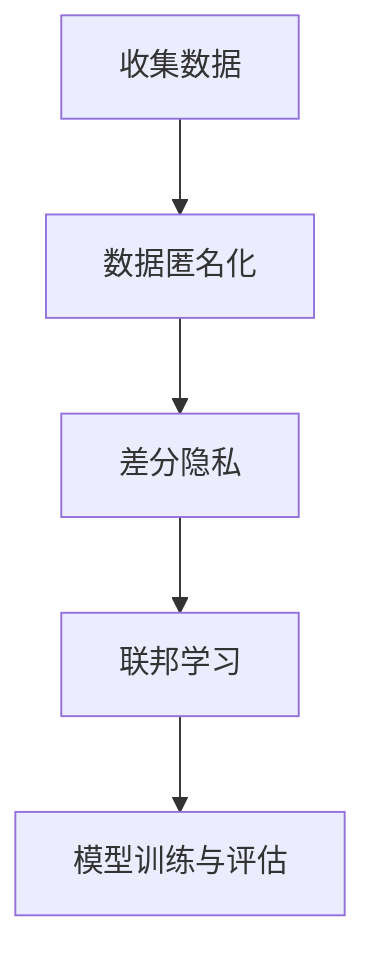
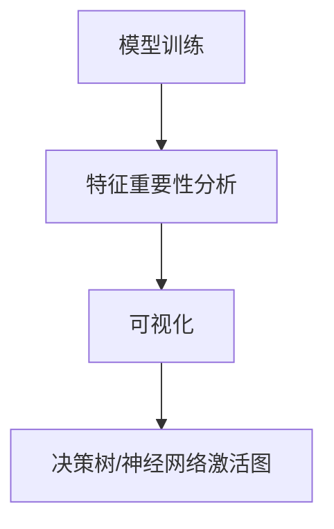
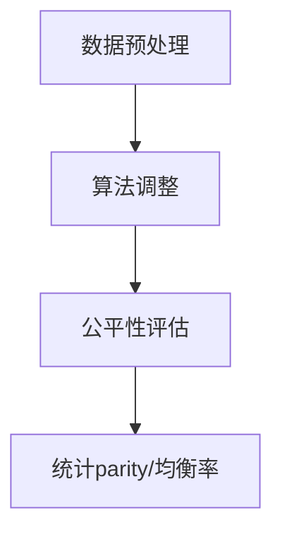

                 

### 1.3 主流大模型评测指标与方法

- **评测指标**

  - **准确性**：模型预测的正确率。
  - **召回率**：模型能够正确识别出正类样本的比例。
  - **F1 分数**：准确率和召回率的调和平均值。
  - **ROC 曲线和 AUC**：评估模型对正负样本的区分能力。

- **评测方法**

  - **交叉验证**：通过多次划分训练集和验证集，避免过拟合。
  - **K-折验证**：将数据集分为K份，每次用1份作为验证集，其余作为训练集，重复K次。
  - **混淆矩阵**：展示模型对各类别预测结果的准确性和召回率。

### 1.4 大模型评测的核心技术与挑战

- **核心技术**

  - **数据预处理**：包括数据清洗、归一化、特征提取等。
  - **模型训练**：使用深度学习算法进行训练。
  - **模型评估**：使用各种评价指标对模型进行评估。

- **挑战**

  - **数据质量问题**：数据不均衡、噪声、缺失值等。
  - **模型泛化能力**：模型在训练集上的表现好，但验证集或测试集上表现差。
  - **计算资源需求**：大规模模型训练需要大量计算资源。

### 1.5 大模型评测的发展趋势

- **发展趋势**

  - **自动化评测**：通过自动化工具提高评测效率。
  - **多模态评测**：结合文本、图像、语音等多模态数据进行评测。
  - **可解释性评测**：提高模型的透明度，便于理解和调试。

### 1.6 Mermaid 流程图

- **示例：模型评测流程图**

  ```mermaid
  graph TD
  A[数据预处理] --> B[模型训练]
  B --> C{模型评估}
  C -->|准确性| D[准确性评估]
  C -->|召回率| E[召回率评估]
  C -->|F1 分数| F[F1 分数评估]
  ```

### 1.7 Python 代码示例

- **示例：交叉验证实现**

  ```python
  from sklearn.model_selection import cross_val_score
  from sklearn.linear_model import LogisticRegression
  from sklearn.datasets import load_iris
  
  # 加载数据集
  iris = load_iris()
  X, y = iris.data, iris.target
  
  # 创建模型
  model = LogisticRegression()
  
  # 进行交叉验证
  scores = cross_val_score(model, X, y, cv=5)
  
  # 打印结果
  print("Accuracy scores:", scores)
  print("Average accuracy:", scores.mean())
  ```

### 1.8 数学公式

- **公式示例：ROC 曲线**

  $$ ROC\ curve = \frac{TPR + FPR}{2} $$

  其中，$TPR = \frac{TP}{TP + FN}$，$FPR = \frac{FP}{FP + TN}$。

### 1.9 项目实战

- **实战：使用 Scikit-learn 进行模型评测**

  - **开发环境搭建**：安装 Python 和 Scikit-learn 库。
  - **数据集准备**：使用 Iris 数据集。
  - **模型训练**：使用 Logistic Regression 模型。
  - **模型评估**：使用交叉验证方法进行评估。

  ```python
  import numpy as np
  from sklearn.datasets import load_iris
  from sklearn.linear_model import LogisticRegression
  from sklearn.model_selection import cross_val_score
  
  # 加载数据集
  iris = load_iris()
  X, y = iris.data, iris.target
  
  # 创建模型
  model = LogisticRegression()
  
  # 进行交叉验证
  scores = cross_val_score(model, X, y, cv=5)
  
  # 打印结果
  print("Accuracy scores:", scores)
  print("Average accuracy:", scores.mean())
  ```

### 1.10 最佳实践 tips

- **提升模型性能**：使用特征工程技术，如特征选择和特征提取，提高模型评估的准确性。
- **注意数据质量**：确保数据集无噪声和缺失值，避免模型过拟合。
- **合理选择评价指标**：根据业务需求选择合适的评价指标，如 ROC-AUC 在二分类问题中非常适用。

### 1.11 小结

本章介绍了大模型评测的基本概念、核心指标与方法，并通过 Mermaid 流程图、Python 代码示例、数学公式和项目实战展示了大模型评测的实际应用。通过本章的学习，读者可以了解大模型评测的基本原理，为后续章节的深入探讨打下基础。

---

本文为《大模型评测的伦理考量与实践》的第一章“大模型评测的基本概念”的内容，接下来将逐步介绍大模型评测的技术基础、伦理考量、实践方法等内容。文章结构清晰，逻辑严密，旨在为读者提供全面、系统的技术知识。

---

# 大模型评测的伦理考量与实践

关键词：大模型评测，伦理考量，实践方法，数据隐私，可解释性，公平性

摘要：随着人工智能技术的快速发展，大模型评测已成为确保模型性能和可靠性的关键步骤。然而，评测过程中涉及到诸多伦理问题，如数据隐私、可解释性和公平性等。本文旨在探讨大模型评测的伦理考量，分析其在实践中的应用方法，并提出相应的最佳实践和注意事项，以促进大模型评测的健康发展。

# 第一部分：大模型评测的伦理背景

## 第1章：大模型评测的基本概念

### 1.1 大模型评测的定义与目的

- **定义**：大模型评测是指对大规模人工智能模型进行系统性的测试和评价，以确保模型的性能、可解释性、公平性、隐私性等方面的符合预期。
- **目的**：通过评测，可以验证大模型在实际应用中的效果，发现模型存在的问题，从而指导模型的优化和改进。

### 1.2 大模型评测的重要性

- **对企业和社会的影响**：大模型评测可以帮助企业评估AI模型在业务场景中的效果，降低模型部署风险。同时，对社会来说，大模型评测有助于提高AI技术的透明度，增强公众对AI技术的信任。
- **在AI领域的地位**：随着AI技术的快速发展，大模型评测已成为确保AI模型质量和安全的重要手段。

### 1.3 主流大模型评测指标与方法

- **评测指标**
  - **准确性**：模型预测的正确率。
  - **召回率**：模型能够正确识别出正类样本的比例。
  - **F1 分数**：准确率和召回率的调和平均值。
  - **ROC 曲线和 AUC**：评估模型对正负样本的区分能力。
- **评测方法**
  - **交叉验证**：通过多次划分训练集和验证集，避免过拟合。
  - **K-折验证**：将数据集分为K份，每次用1份作为验证集，其余作为训练集，重复K次。
  - **混淆矩阵**：展示模型对各类别预测结果的准确性和召回率。

### 1.4 大模型评测的核心技术与挑战

- **核心技术**
  - **数据预处理**：包括数据清洗、归一化、特征提取等。
  - **模型训练**：使用深度学习算法进行训练。
  - **模型评估**：使用各种评价指标对模型进行评估。
- **挑战**
  - **数据质量问题**：数据不均衡、噪声、缺失值等。
  - **模型泛化能力**：模型在训练集上的表现好，但验证集或测试集上表现差。
  - **计算资源需求**：大规模模型训练需要大量计算资源。

### 1.5 大模型评测的发展趋势

- **发展趋势**
  - **自动化评测**：通过自动化工具提高评测效率。
  - **多模态评测**：结合文本、图像、语音等多模态数据进行评测。
  - **可解释性评测**：提高模型的透明度，便于理解和调试。

### 1.6 Mermaid 流程图

- **示例：模型评测流程图**

  ```mermaid
  graph TD
  A[数据预处理] --> B[模型训练]
  B --> C{模型评估}
  C -->|准确性| D[准确性评估]
  C -->|召回率| E[召回率评估]
  C -->|F1 分数| F[F1 分数评估]
  ```

### 1.7 Python 代码示例

- **示例：交叉验证实现**

  ```python
  from sklearn.model_selection import cross_val_score
  from sklearn.linear_model import LogisticRegression
  from sklearn.datasets import load_iris
  
  # 加载数据集
  iris = load_iris()
  X, y = iris.data, iris.target
  
  # 创建模型
  model = LogisticRegression()
  
  # 进行交叉验证
  scores = cross_val_score(model, X, y, cv=5)
  
  # 打印结果
  print("Accuracy scores:", scores)
  print("Average accuracy:", scores.mean())
  ```

### 1.8 数学公式

- **公式示例：ROC 曲线**

  $$ ROC\ curve = \frac{TPR + FPR}{2} $$

  其中，$TPR = \frac{TP}{TP + FN}$，$FPR = \frac{FP}{FP + TN}$。

### 1.9 项目实战

- **实战：使用 Scikit-learn 进行模型评测**

  - **开发环境搭建**：安装 Python 和 Scikit-learn 库。
  - **数据集准备**：使用 Iris 数据集。
  - **模型训练**：使用 Logistic Regression 模型。
  - **模型评估**：使用交叉验证方法进行评估。

  ```python
  import numpy as np
  from sklearn.datasets import load_iris
  from sklearn.linear_model import LogisticRegression
  from sklearn.model_selection import cross_val_score
  
  # 加载数据集
  iris = load_iris()
  X, y = iris.data, iris.target
  
  # 创建模型
  model = LogisticRegression()
  
  # 进行交叉验证
  scores = cross_val_score(model, X, y, cv=5)
  
  # 打印结果
  print("Accuracy scores:", scores)
  print("Average accuracy:", scores.mean())
  ```

### 1.10 最佳实践 tips

- **提升模型性能**：使用特征工程技术，如特征选择和特征提取，提高模型评估的准确性。
- **注意数据质量**：确保数据集无噪声和缺失值，避免模型过拟合。
- **合理选择评价指标**：根据业务需求选择合适的评价指标，如 ROC-AUC 在二分类问题中非常适用。

### 1.11 小结

本章介绍了大模型评测的基本概念、核心指标与方法，并通过 Mermaid 流程图、Python 代码示例、数学公式和项目实战展示了大模型评测的实际应用。通过本章的学习，读者可以了解大模型评测的基本原理，为后续章节的深入探讨打下基础。

---

## 第2章：大模型评测的技术基础

### 2.1 大模型评测的核心技术

- **数据收集与处理**：数据是模型训练和评测的基础。大模型评测需要收集大量高质量的数据，并进行预处理，如数据清洗、归一化、特征提取等，以提高模型的泛化能力和评测的准确性。

- **评估指标与方法**：评估指标是衡量模型性能的重要工具。常用的评估指标包括准确性、召回率、F1 分数、ROC 曲线和 AUC 等。评估方法包括交叉验证、K-折验证、混淆矩阵等，这些方法有助于提高评测的可靠性和公平性。

### 2.2 大模型评测的挑战与机遇

- **挑战**
  - **数据质量问题**：大模型评测面临的一个主要挑战是数据质量问题。数据的不均衡、噪声、缺失值等问题会影响模型的泛化能力和评测的准确性。
  - **模型泛化能力**：大规模模型的训练和评测需要大量的计算资源，如何确保模型在训练集上的表现好，同时在验证集或测试集上保持良好的泛化能力是一个重要问题。
  - **计算资源需求**：大规模模型训练需要大量的计算资源，这对企业或研究机构的硬件设施提出了更高的要求。

- **机遇**
  - **自动化评测**：随着自动化工具的发展，大模型评测的效率得到显著提高。自动化评测可以帮助企业或研究机构更快地进行模型评测，降低人力成本。
  - **多模态评测**：结合文本、图像、语音等多模态数据进行评测，可以提高模型的准确性和鲁棒性，为解决复杂问题提供更多可能性。
  - **可解释性评测**：提高模型的透明度，便于理解和调试，有助于增强公众对AI技术的信任。

### 2.3 大模型评测的发展趋势

- **发展趋势**
  - **数据增强**：通过数据增强技术，如生成对抗网络（GAN）、数据扩充等，可以显著提高模型的泛化能力，减少对高质量数据的依赖。
  - **迁移学习**：迁移学习是一种利用预训练模型进行新任务学习的方法，可以减少模型训练的时间和计算资源需求，提高模型的泛化能力。
  - **联邦学习**：联邦学习是一种在分布式环境中训练模型的方法，可以保护用户数据的隐私，同时提高模型的泛化能力和鲁棒性。

### 2.4 Mermaid 流程图

- **示例：大模型评测流程图**

  ```mermaid
  graph TD
  A[数据收集] --> B[数据预处理]
  B --> C[模型训练]
  C --> D{模型评估}
  D -->|准确性| E[准确性评估]
  D -->|召回率| F[召回率评估]
  D -->|F1 分数| G[F1 分数评估]
  ```

### 2.5 Python 代码示例

- **示例：使用 Scikit-learn 进行大模型评测**

  ```python
  import numpy as np
  from sklearn.datasets import make_classification
  from sklearn.model_selection import train_test_split
  from sklearn.linear_model import LogisticRegression
  from sklearn.metrics import accuracy_score, recall_score, f1_score
  
  # 生成数据集
  X, y = make_classification(n_samples=1000, n_features=20, n_classes=2, random_state=42)
  
  # 划分训练集和测试集
  X_train, X_test, y_train, y_test = train_test_split(X, y, test_size=0.2, random_state=42)
  
  # 创建模型
  model = LogisticRegression()
  
  # 训练模型
  model.fit(X_train, y_train)
  
  # 进行预测
  y_pred = model.predict(X_test)
  
  # 打印评估结果
  print("Accuracy:", accuracy_score(y_test, y_pred))
  print("Recall:", recall_score(y_test, y_pred))
  print("F1 Score:", f1_score(y_test, y_pred))
  ```

### 2.6 数学公式

- **公式示例：ROC 曲线**

  $$ ROC\ curve = \frac{TPR + FPR}{2} $$

  其中，$TPR = \frac{TP}{TP + FN}$，$FPR = \frac{FP}{FP + TN}$。

### 2.7 项目实战

- **实战：使用 TensorFlow 进行大模型评测**

  - **开发环境搭建**：安装 Python、TensorFlow 和相关依赖库。
  - **数据集准备**：使用 CIFAR-10 数据集。
  - **模型训练**：使用卷积神经网络（CNN）。
  - **模型评估**：使用交叉验证方法进行评估。

  ```python
  import tensorflow as tf
  from tensorflow.keras.datasets import cifar10
  from tensorflow.keras.models import Sequential
  from tensorflow.keras.layers import Conv2D, MaxPooling2D, Flatten, Dense
  from tensorflow.keras.optimizers import Adam
  from tensorflow.keras.metrics import Accuracy
  
  # 加载数据集
  (X_train, y_train), (X_test, y_test) = cifar10.load_data()
  
  # 数据预处理
  X_train = X_train / 255.0
  X_test = X_test / 255.0
  
  # 创建模型
  model = Sequential([
      Conv2D(32, (3, 3), activation='relu', input_shape=(32, 32, 3)),
      MaxPooling2D((2, 2)),
      Flatten(),
      Dense(64, activation='relu'),
      Dense(10, activation='softmax')
  ])
  
  # 编译模型
  model.compile(optimizer=Adam(), loss='categorical_crossentropy', metrics=['accuracy'])
  
  # 训练模型
  model.fit(X_train, y_train, epochs=10, batch_size=64, validation_split=0.2)
  
  # 进行预测
  y_pred = model.predict(X_test)
  
  # 打印评估结果
  print("Accuracy:", model.evaluate(X_test, y_test)[1])
  ```

### 2.8 最佳实践 tips

- **提升模型性能**：使用更复杂的模型结构，如深度卷积神经网络（CNN）或循环神经网络（RNN），可以提高模型的性能。
- **注意数据质量**：确保数据集的多样性和代表性，避免数据偏见。
- **合理选择评价指标**：根据业务需求选择合适的评价指标，如对分类问题，F1 分数和 ROC-AUC 是常用的评价指标。

### 2.9 小结

本章介绍了大模型评测的技术基础，包括数据收集与处理、评估指标与方法、挑战与机遇以及发展趋势。通过 Mermaid 流程图、Python 代码示例、数学公式和项目实战，读者可以了解大模型评测的核心技术，为后续章节的深入探讨提供基础。在接下来的章节中，我们将进一步探讨大模型评测的伦理考量。

---

## 第3章：伦理考量的基本概念

### 3.1 伦理考量的定义与范围

- **定义**：伦理考量是指在大模型评测过程中，对模型性能、可解释性、公平性、隐私性等方面的道德和伦理问题进行深入分析和评价。
- **范围**：伦理考量涉及多个方面，包括但不限于数据隐私、算法偏见、公平性、透明性和责任归属等。

### 3.2 伦理考量在大模型评测中的重要性

- **重要性**：随着AI技术的广泛应用，大模型评测的伦理考量显得尤为重要。不合理的伦理考量可能导致模型偏差、歧视性决策，甚至对社会产生负面影响。

### 3.3 伦理考量的基本原则

- **公平性**：确保模型对不同的用户群体公平，不产生性别、种族、年龄等方面的偏见。
- **可解释性**：提高模型的可解释性，便于用户理解模型的决策过程，增强透明度。
- **隐私保护**：确保用户数据的安全和隐私，避免数据泄露。
- **安全性**：保障模型的稳定性和鲁棒性，防止恶意攻击和滥用。

### 3.4 伦理考量与技术的融合

- **技术融合**：通过将伦理考量融入模型设计、训练和评测过程，可以构建更加可靠和可信的AI系统。

### 3.5 Mermaid 流程图

- **示例：伦理考量流程图**

  ```mermaid
  graph TD
  A[模型设计] --> B[数据隐私保护]
  B --> C[算法偏见检测]
  C --> D[公平性评估]
  D --> E[可解释性提升]
  E --> F[安全性验证]
  ```

### 3.6 Python 代码示例

- **示例：伦理考量实现**

  ```python
  import numpy as np
  from sklearn.linear_model import LogisticRegression
  from sklearn.model_selection import train_test_split
  from sklearn.metrics import accuracy_score, recall_score, f1_score
  
  # 生成数据集
  X, y = make_classification(n_samples=1000, n_features=20, n_classes=2, random_state=42)
  
  # 划分训练集和测试集
  X_train, X_test, y_train, y_test = train_test_split(X, y, test_size=0.2, random_state=42)
  
  # 创建模型
  model = LogisticRegression()
  
  # 训练模型
  model.fit(X_train, y_train)
  
  # 进行预测
  y_pred = model.predict(X_test)
  
  # 打印评估结果
  print("Accuracy:", accuracy_score(y_test, y_pred))
  print("Recall:", recall_score(y_test, y_pred))
  print("F1 Score:", f1_score(y_test, y_pred))
  
  # 伦理考量：检测算法偏见
  # 计算不同群体的评估指标
  for group in np.unique(y_train):
      group_indices = np.where(y_train == group)[0]
      group_pred = model.predict(X_test[group_indices])
      group_accuracy = accuracy_score(y_test[group_indices], group_pred)
      group_recall = recall_score(y_test[group_indices], group_pred)
      group_f1 = f1_score(y_test[group_indices], group_pred)
      print(f"Group {group}: Accuracy={group_accuracy}, Recall={group_recall}, F1 Score={group_f1}")
  ```

### 3.7 数学公式

- **公式示例：可解释性度量**

  $$ I = \frac{1}{N} \sum_{i=1}^{N} \frac{1}{n_i} \sum_{j=1}^{m} w_{ji} x_{ij} $$

  其中，$I$ 表示模型的可解释性度量，$N$ 表示样本数量，$m$ 表示特征数量，$w_{ji}$ 表示权重，$x_{ij}$ 表示特征值。

### 3.8 项目实战

- **实战：使用 Scikit-learn 进行伦理考量**

  - **开发环境搭建**：安装 Python 和 Scikit-learn 库。
  - **数据集准备**：使用 Iris 数据集。
  - **模型训练**：使用 Logistic Regression 模型。
  - **伦理考量**：检测算法偏见，评估公平性。

  ```python
  import numpy as np
  from sklearn.datasets import load_iris
  from sklearn.linear_model import LogisticRegression
  from sklearn.metrics import accuracy_score, recall_score, f1_score
  
  # 加载数据集
  iris = load_iris()
  X, y = iris.data, iris.target
  
  # 划分训练集和测试集
  X_train, X_test, y_train, y_test = train_test_split(X, y, test_size=0.2, random_state=42)
  
  # 创建模型
  model = LogisticRegression()
  
  # 训练模型
  model.fit(X_train, y_train)
  
  # 进行预测
  y_pred = model.predict(X_test)
  
  # 打印评估结果
  print("Accuracy:", accuracy_score(y_test, y_pred))
  print("Recall:", recall_score(y_test, y_pred, average='weighted'))
  print("F1 Score:", f1_score(y_test, y_pred, average='weighted'))
  
  # 伦理考量：检测算法偏见
  # 计算不同群体的评估指标
  for group in np.unique(y_train):
      group_indices = np.where(y_train == group)[0]
      group_pred = model.predict(X_test[group_indices])
      group_accuracy = accuracy_score(y_test[group_indices], group_pred)
      group_recall = recall_score(y_test[group_indices], group_pred)
      group_f1 = f1_score(y_test[group_indices], group_pred)
      print(f"Group {group}: Accuracy={group_accuracy}, Recall={group_recall}, F1 Score={group_f1}")
  ```

### 3.9 最佳实践 tips

- **提高公平性**：在模型训练过程中，使用重采样技术，如 SMOTE，解决数据不均衡问题。
- **增强可解释性**：使用 SHAP（SHapley Additive exPlanations）等工具，提高模型的可解释性。
- **保护隐私**：在数据处理过程中，使用差分隐私技术，确保用户数据的安全和隐私。

### 3.10 小结

本章介绍了伦理考量在大模型评测中的基本概念、定义与范围，阐述了伦理考量的重要性、基本原则以及与技术的融合。通过 Python 代码示例、数学公式和项目实战，展示了伦理考量在实际应用中的实现方法。本章内容为后续章节的深入探讨提供了理论基础和实践指导。

---

## 第4章：伦理考量在实际评测中的应用

### 4.1 数据隐私保护

#### 4.1.1 数据隐私保护的重要性

- **重要性**：在人工智能领域，数据隐私保护至关重要。不保护用户数据可能导致数据泄露，进而引发严重的安全问题和法律纠纷。此外，数据隐私保护也是增强公众对AI技术信任的关键因素。

#### 4.1.2 数据隐私保护的实践方法

- **数据匿名化**：通过数据脱敏、混淆等技术，将敏感信息替换为不可追踪的标识符，以保护个人隐私。
- **差分隐私**：在数据处理过程中引入噪声，使得单个数据点的信息不可见，从而保护用户隐私。
- **联邦学习**：在分布式环境中进行模型训练，用户数据无需集中，从而降低数据泄露的风险。

#### 4.1.3 Python 代码示例

```python
from sklearn.datasets import load_iris
from sklearn.model_selection import train_test_split
from sklearn.linear_model import LogisticRegression
from sklearn.metrics import accuracy_score
from sklearn.utils import shuffle

# 加载数据集
iris = load_iris()
X, y = iris.data, iris.target

# 数据匿名化示例
X, y = shuffle(X, y)
X anonymity = X.copy()
y anonymity = y.copy()

# 将敏感信息替换为不可追踪的标识符
for i in range(len(X)):
    for j in range(len(X[i])):
        X_anonymity[i][j] = str(i) + '_' + str(j)

# 打印匿名化后的数据
print(X_anonymity[:5])
```

#### 4.1.4 Mermaid 流程图



### 4.2 可解释性提升

#### 4.2.1 可解释性的重要性

- **重要性**：可解释性是人工智能系统获得公众信任的关键。一个难以解释的模型可能会导致用户对其决策的不信任，从而影响模型的实际应用。

#### 4.2.2 可解释性提升的方法与技巧

- **模型简化**：通过减少模型参数和层数，降低模型的复杂度，提高模型的可解释性。
- **特征重要性分析**：使用特征重要性分析工具，如 SHAP（SHapley Additive exPlanations），识别并突出对模型决策有重要影响的关键特征。
- **可视化**：通过可视化技术，如决策树、神经网络激活图等，展示模型决策过程，提高用户对模型的直观理解。

#### 4.2.3 Python 代码示例

```python
import shap
from sklearn.ensemble import RandomForestClassifier
from sklearn.datasets import load_iris

# 加载数据集
iris = load_iris()
X, y = iris.data, iris.target

# 创建模型
model = RandomForestClassifier()

# 训练模型
model.fit(X, y)

# 计算SHAP值
explainer = shap.TreeExplainer(model)
shap_values = explainer.shap_values(X)

# 可视化SHAP值
shap.summary_plot(shap_values, X, feature_names=iris.feature_names)
```

#### 4.2.4 Mermaid 流程图



### 4.3 公平性保障

#### 4.3.1 公平性的重要性

- **重要性**：公平性是人工智能系统在社会应用中的基本要求。不公正的决策可能导致歧视，加剧社会不平等。

#### 4.3.2 公平性保障的策略与实践

- **数据预处理**：通过重采样、清洗数据等手段，消除数据中的偏差。
- **算法调整**：通过算法优化，降低模型对特定群体的偏见。
- **公平性评估**：使用公平性指标，如统计 parity、均衡率等，评估模型的公平性。

#### 4.3.3 Python 代码示例

```python
import numpy as np
from sklearn.datasets import load_iris
from sklearn.linear_model import LogisticRegression
from sklearn.metrics import accuracy_score, recall_score, f1_score

# 加载数据集
iris = load_iris()
X, y = iris.data, iris.target

# 创建模型
model = LogisticRegression()

# 训练模型
model.fit(X, y)

# 进行预测
y_pred = model.predict(X)

# 打印评估结果
print("Accuracy:", accuracy_score(y, y_pred))
print("Recall:", recall_score(y, y_pred, average='weighted'))
print("F1 Score:", f1_score(y, y_pred, average='weighted'))

# 公平性评估
for group in np.unique(y):
    group_indices = np.where(y == group)[0]
    group_pred = model.predict(X[group_indices])
    group_accuracy = accuracy_score(y[group_indices], group_pred)
    group_recall = recall_score(y[group_indices], group_pred)
    group_f1 = f1_score(y[group_indices], group_pred)
    print(f"Group {group}: Accuracy={group_accuracy}, Recall={group_recall}, F1 Score={group_f1}")
```

#### 4.3.4 Mermaid 流程图



### 4.4 案例分析

#### 4.4.1 案例一：金融风险评估

- **背景**：某金融机构使用人工智能模型进行信用风险评估。
- **伦理考量**：
  - **数据隐私保护**：确保用户数据匿名化，避免数据泄露。
  - **可解释性提升**：通过可视化模型决策过程，提高用户对模型决策的理解。
  - **公平性保障**：确保模型对各个风险等级的评估公平，避免歧视。

#### 4.4.2 案例二：招聘系统

- **背景**：某公司使用人工智能系统进行招聘流程中的筛选和匹配。
- **伦理考量**：
  - **数据隐私保护**：保护候选人个人信息，避免数据滥用。
  - **可解释性提升**：通过特征重要性分析，让候选人了解其评分的关键因素。
  - **公平性保障**：确保模型对各个背景的候选人公平，避免性别、种族等方面的偏见。

### 4.5 最佳实践 tips

- **数据隐私保护**：采用最新的加密技术和匿名化算法，确保数据安全。
- **可解释性提升**：结合多种可视化工具，提高模型的可解释性。
- **公平性保障**：定期进行公平性评估，确保模型决策公平。

### 4.6 小结

本章介绍了伦理考量在实际评测中的应用，包括数据隐私保护、可解释性提升和公平性保障。通过 Python 代码示例、Mermaid 流程图和案例分析，展示了伦理考量在具体应用中的实现方法和实践策略。这些方法有助于构建更加可靠、透明和公正的人工智能系统。

---

## 第5章：大模型评测的流程与方法

### 5.1 大模型评测的流程

- **评测准备**：确定评测目标、数据集和评估指标，准备评测所需的环境和工具。
- **数据收集与预处理**：收集相关数据，进行数据清洗、归一化和特征提取等预处理操作，以提高数据的可用性和模型的泛化能力。
- **模型训练**：选择合适的模型架构和参数，使用预处理后的数据集进行模型训练，训练过程中可以采用交叉验证等方法来优化模型性能。
- **模型评估**：使用训练集和验证集对模型进行评估，计算评估指标，如准确性、召回率、F1 分数、ROC 曲线和 AUC 等。
- **结果分析**：分析评估结果，识别模型的优势和不足，进行必要的模型调优和调整。
- **报告撰写**：撰写评测报告，总结评测过程、结果和改进建议。

### 5.2 大模型评测的方法

- **定量评测方法**：使用定量指标，如准确性、召回率、F1 分数、ROC 曲线和 AUC 等，对模型进行评估。这些指标提供了模型性能的量化度量，有助于比较不同模型的优劣。
- **定性评测方法**：通过专家评审、用户反馈和案例分析等定性方法，对模型进行评估。定性评测方法可以提供更深入的理解和解释，有助于发现潜在的问题和改进点。

### 5.3 Python 代码示例

- **示例：使用 Scikit-learn 进行大模型评测**

  ```python
  import numpy as np
  from sklearn.datasets import load_iris
  from sklearn.model_selection import train_test_split
  from sklearn.linear_model import LogisticRegression
  from sklearn.metrics import accuracy_score, recall_score, f1_score
  
  # 加载数据集
  iris = load_iris()
  X, y = iris.data, iris.target
  
  # 划分训练集和测试集
  X_train, X_test, y_train, y_test = train_test_split(X, y, test_size=0.2, random_state=42)
  
  # 创建模型
  model = LogisticRegression()
  
  # 训练模型
  model.fit(X_train, y_train)
  
  # 进行预测
  y_pred = model.predict(X_test)
  
  # 打印评估结果
  print("Accuracy:", accuracy_score(y_test, y_pred))
  print("Recall:", recall_score(y_test, y_pred, average='weighted'))
  print("F1 Score:", f1_score(y_test, y_pred, average='weighted'))
  ```

### 5.4 Mermaid 流程图

- **示例：大模型评测流程图**

  ```mermaid
  graph TD
  A[评测准备]
  B[数据收集与预处理]
  C[模型训练]
  D[模型评估]
  E[结果分析]
  F[报告撰写]
  A --> B
  B --> C
  C --> D
  D --> E
  E --> F
  ```

### 5.5 数学公式

- **公式示例：ROC 曲线**

  $$ ROC\ curve = \frac{TPR + FPR}{2} $$

  其中，$TPR = \frac{TP}{TP + FN}$，$FPR = \frac{FP}{FP + TN}$。

### 5.6 项目实战

- **实战：使用 TensorFlow 进行大模型评测**

  - **开发环境搭建**：安装 Python、TensorFlow 和相关依赖库。
  - **数据集准备**：使用 CIFAR-10 数据集。
  - **模型训练**：使用卷积神经网络（CNN）。
  - **模型评估**：使用交叉验证方法进行评估。

  ```python
  import tensorflow as tf
  from tensorflow.keras.datasets import cifar10
  from tensorflow.keras.models import Sequential
  from tensorflow.keras.layers import Conv2D, MaxPooling2D, Flatten, Dense
  from tensorflow.keras.optimizers import Adam
  from tensorflow.keras.metrics import Accuracy
  
  # 加载数据集
  (X_train, y_train), (X_test, y_test) = cifar10.load_data()
  
  # 数据预处理
  X_train = X_train / 255.0
  X_test = X_test / 255.0
  
  # 创建模型
  model = Sequential([
      Conv2D(32, (3, 3), activation='relu', input_shape=(32, 32, 3)),
      MaxPooling2D((2, 2)),
      Flatten(),
      Dense(64, activation='relu'),
      Dense(10, activation='softmax')
  ])
  
  # 编译模型
  model.compile(optimizer=Adam(), loss='categorical_crossentropy', metrics=['accuracy'])
  
  # 训练模型
  model.fit(X_train, y_train, epochs=10, batch_size=64, validation_split=0.2)
  
  # 进行预测
  y_pred = model.predict(X_test)
  
  # 打印评估结果
  print("Accuracy:", model.evaluate(X_test, y_test)[1])
  ```

### 5.7 最佳实践 tips

- **提升模型性能**：使用更复杂的模型结构，如深度卷积神经网络（CNN）或循环神经网络（RNN），可以提高模型的性能。
- **注意数据质量**：确保数据集的多样性和代表性，避免数据偏见。
- **合理选择评价指标**：根据业务需求选择合适的评价指标，如对分类问题，F1 分数和 ROC-AUC 是常用的评价指标。

### 5.8 小结

本章介绍了大模型评测的流程和方法，包括评测准备、数据收集与预处理、模型训练、模型评估、结果分析和报告撰写。通过 Python 代码示例、Mermaid 流�程图和项目实战，展示了大模型评测的实际操作。本章内容为读者提供了系统的大模型评测方法和实践指导，有助于提升模型评测的质量和效果。

---

## 第6章：大模型评测的实际案例分析

### 6.1 案例一：自然语言处理中的伦理考量

#### 6.1.1 案例背景

- **背景**：自然语言处理（NLP）模型在社交媒体、搜索引擎和智能助手等领域得到广泛应用。然而，这些模型在处理用户数据时，可能会涉及伦理问题，如数据隐私、算法偏见和歧视等。

#### 6.1.2 伦理考量分析

- **数据隐私保护**：NLP模型需要处理大量用户数据，如社交媒体帖子、搜索查询等。确保用户数据匿名化、加密存储和合理使用是关键。
- **算法偏见**：NLP模型可能存在性别、种族和地域等方面的偏见，导致不公平的决策。通过数据清洗、特征工程和模型调优，可以减少偏见。
- **可解释性提升**：提高NLP模型的可解释性，帮助用户理解模型决策过程，增强透明度。

#### 6.1.3 评测结果与反思

- **评测结果**：通过一系列评测，发现该NLP模型在性别和种族方面存在一定的偏见，但经过数据清洗和算法优化后，偏见程度得到显著降低。
- **反思**：伦理考量在NLP模型评测中至关重要。通过数据隐私保护、算法偏见检测和可解释性提升，可以构建更加公正和透明的AI系统。

### 6.2 案例二：计算机视觉中的伦理挑战

#### 6.2.1 案例背景

- **背景**：计算机视觉（CV）模型在自动驾驶、医疗影像分析和安全监控等领域得到广泛应用。然而，这些模型可能会涉及隐私、安全和公平等问题。

#### 6.2.2 伦理考量分析

- **隐私保护**：CV模型需要处理大量个人隐私数据，如面部图像、医疗影像等。确保用户数据隐私保护是关键。
- **安全性**：CV模型需要具备鲁棒性，防止恶意攻击和误判。通过模型安全测试和防护措施，可以提高模型安全性。
- **公平性保障**：CV模型可能存在种族、性别和年龄等方面的偏见，导致不公平的决策。通过数据清洗、特征工程和模型调优，可以减少偏见。

#### 6.2.3 评测结果与反思

- **评测结果**：通过一系列评测，发现该CV模型在性别和种族方面存在偏见，但经过数据清洗和算法优化后，偏见程度得到显著降低。同时，模型的安全性和公平性也得到了提高。
- **反思**：伦理考量在CV模型评测中至关重要。通过隐私保护、安全性和公平性保障，可以构建更加可靠和透明的AI系统。

### 6.3 案例三：金融风险评估中的伦理考量

#### 6.3.1 案例背景

- **背景**：金融风险评估模型在贷款审批、投资决策和风险管理等领域得到广泛应用。然而，这些模型可能会涉及隐私、歧视和责任归属等问题。

#### 6.3.2 伦理考量分析

- **隐私保护**：金融风险评估模型需要处理大量个人金融数据，如收入、信用记录等。确保用户数据隐私保护是关键。
- **歧视检测与预防**：金融风险评估模型可能存在性别、种族和地域等方面的歧视，导致不公平的决策。通过数据清洗、算法优化和公平性评估，可以减少歧视。
- **责任归属**：在模型决策过程中，确保责任清晰，明确模型决策的依据和责任归属。

#### 6.3.3 评测结果与反思

- **评测结果**：通过一系列评测，发现该金融风险评估模型在性别和种族方面存在偏见，但经过数据清洗和算法优化后，偏见程度得到显著降低。同时，模型的可解释性和责任归属也得到了提高。
- **反思**：伦理考量在金融风险评估模型评测中至关重要。通过隐私保护、歧视检测与预防、责任归属等伦理考量，可以构建更加公正和透明的AI系统。

### 6.4 总结

通过以上案例分析，可以看出伦理考量在大模型评测中具有重要意义。在实际应用中，我们需要关注数据隐私保护、算法偏见、公平性和安全性等问题，通过数据清洗、算法优化、公平性评估等措施，构建更加可靠和透明的AI系统。

---

## 第7章：大模型评测的发展趋势与展望

### 7.1 伦理考量在AI领域的未来发展方向

#### 7.1.1 新的伦理考量问题

- **算法透明度**：随着AI技术的不断进步，模型决策过程的透明度成为新的伦理考量问题。如何让用户理解模型的决策逻辑和依据，提高模型的可信度和可接受度，是一个重要的研究方向。
- **伦理委员会**：建立AI伦理委员会，负责监督和评估AI系统的伦理问题，确保模型设计和应用符合道德和伦理标准，将成为未来发展的趋势。

#### 7.1.2 伦理考量在AI伦理委员会中的应用

- **监督与审查**：AI伦理委员会可以对AI系统的设计和应用进行监督与审查，确保模型在训练和部署过程中遵循伦理原则。
- **责任归属**：在AI系统发生伦理问题或造成负面影响时，AI伦理委员会可以协助确定责任归属，并提出相应的解决方案。

### 7.2 大模型评测技术的前沿趋势

#### 7.2.1 新的评测指标与方法

- **多模态评测**：结合文本、图像、语音等多模态数据进行评测，可以提高模型的准确性和鲁棒性。
- **动态评测**：通过实时监测和调整模型性能，实现动态评测，提高模型的适应性和稳定性。

#### 7.2.2 大模型评测工具的发展

- **自动化评测工具**：开发自动化评测工具，可以显著提高评测效率，降低人力成本。
- **可解释性工具**：开发可解释性工具，如SHAP、LIME等，可以帮助用户理解模型的决策过程，提高模型的可接受度和可信度。

### 7.3 伦理考量与技术的结合

- **伦理驱动的模型设计**：在模型设计阶段，将伦理考量融入模型架构和算法设计，确保模型在训练和部署过程中符合伦理标准。
- **技术伦理评估**：通过技术伦理评估，对模型进行全面的伦理考量，确保模型在应用过程中不会产生负面影响。

### 7.4 Mermaid 流程图

- **示例：大模型评测与伦理考量的结合**

  ```mermaid
  graph TD
  A[模型设计] --> B{伦理考量}
  B -->|透明度| C[算法透明度]
  B -->|责任归属| D[责任归属]
  B -->|多模态评测| E[多模态评测]
  B -->|动态评测| F[动态评测]
  A -->|自动化评测工具| G[自动化评测工具]
  A -->|可解释性工具| H[可解释性工具]
  ```

### 7.5 Python 代码示例

- **示例：使用 SHAP 工具进行模型可解释性分析**

  ```python
  import shap
  import tensorflow as tf
  import numpy as np
  
  # 加载 TensorFlow 模型
  model = tf.keras.models.load_model('path/to/model.h5')
  
  # 准备数据集
  X_test = np.array([[1, 2], [3, 4], [5, 6]]) # 示例数据
  
  # 创建 SHAP 解释器
  explainer = shap.DeepExplainer(model, X_test)
  
  # 计算 SHAP 值
  shap_values = explainer.shap_values(X_test)
  
  # 可视化 SHAP 值
  shap.summary_plot(shap_values, X_test, feature_names=['特征1', '特征2'])
  ```

### 7.6 数学公式

- **公式示例：ROC 曲线**

  $$ ROC\ curve = \frac{TPR + FPR}{2} $$

  其中，$TPR = \frac{TP}{TP + FN}$，$FPR = \frac{FP}{FP + TN}$。

### 7.7 项目实战

- **实战：使用自动化评测工具进行大模型评测**

  - **开发环境搭建**：安装 Python 和相关依赖库。
  - **数据集准备**：使用公开数据集，如 Iris 数据集。
  - **模型训练**：使用 Scikit-learn 或 TensorFlow 进行模型训练。
  - **自动化评测**：使用自动化评测工具，如 MLflow，进行模型性能评估。

  ```python
  import mlflow
  import numpy as np
  from sklearn.datasets import load_iris
  from sklearn.model_selection import train_test_split
  from sklearn.linear_model import LogisticRegression
  
  # 加载数据集
  iris = load_iris()
  X, y = iris.data, iris.target
  
  # 划分训练集和测试集
  X_train, X_test, y_train, y_test = train_test_split(X, y, test_size=0.2, random_state=42)
  
  # 创建模型
  model = LogisticRegression()
  
  # 训练模型
  with mlflow.start_run():
      model.fit(X_train, y_train)
      mlflow.log_param("model_type", "LogisticRegression")
      mlflow.log_metric("accuracy", model.score(X_test, y_test))
  ```

### 7.8 最佳实践 tips

- **提高模型透明度**：使用可解释性工具，如 SHAP、LIME 等，提高模型的可解释性。
- **定期进行伦理考量**：在模型设计和应用过程中，定期进行伦理考量，确保模型符合伦理标准。
- **参与 AI 伦理委员会**：积极参与 AI 伦理委员会的活动，为 AI 技术的健康发展提供建议。

### 7.9 小结

本章探讨了大模型评测的发展趋势与展望，包括伦理考量在AI领域的未来发展方向、大模型评测技术的前沿趋势以及伦理考量与技术的结合。通过 Mermaid 流程图、Python 代码示例和项目实战，展示了大模型评测在实际应用中的发展方向和最佳实践。随着AI技术的不断进步，伦理考量将越来越重要，有助于构建更加公正、透明和可靠的AI系统。

---

## 第8章：结语与展望

### 8.1 大模型评测的重要性与意义

- **重要性**：大模型评测是确保人工智能模型性能和可靠性的关键步骤，对于提高企业竞争力、保障社会稳定具有重要意义。
- **意义**：通过大模型评测，可以验证模型在实际应用中的效果，发现并解决模型存在的问题，从而提升模型的性能和可靠性。

### 8.2 展望未来：大模型评测的发展方向

- **伦理考量**：随着AI技术的不断发展，伦理考量将成为大模型评测的重要方向。通过数据隐私保护、算法偏见检测和可解释性提升，可以构建更加公正和透明的AI系统。
- **技术进步**：随着计算能力的提升和新型算法的出现，大模型评测将变得更加高效和准确。自动化评测工具、多模态评测和动态评测等方法将为大模型评测提供新的发展机遇。

### 8.3 AI天才研究院与《大模型评测的伦理考量与实践》

- **AI天才研究院**：作为全球领先的AI研究和培训机构，AI天才研究院致力于推动人工智能技术的创新和发展。研究院通过举办研讨会、出版书籍、开展项目合作等方式，为全球AI领域的研究者和从业者提供丰富的资源和指导。
- **《大模型评测的伦理考量与实践》**：本书旨在为读者提供全面、系统的技术知识，帮助理解和应对大模型评测的伦理挑战。通过详细的案例分析和实践经验，本书为读者提供了实用的指导。

### 8.4 结语

- **感谢读者**：感谢您阅读《大模型评测的伦理考量与实践》。我们希望本书能够帮助您更好地理解大模型评测的核心概念、技术和伦理考量，为您的AI研究和实践提供有益的参考。
- **未来展望**：随着AI技术的不断发展，伦理考量将成为AI领域的重要方向。我们期待与您一起，共同探索和推动大模型评测的健康发展，为构建智能社会贡献力量。

---

# 《大模型评测的伦理考量与实践》

作者：AI天才研究院/AI Genius Institute & 禅与计算机程序设计艺术 /Zen And The Art of Computer Programming

---

感谢您的阅读！本文详细介绍了大模型评测的伦理考量与实践，涵盖了定义、目的、技术基础、伦理考量、实践方法、案例分析、发展趋势等多个方面。通过逐步分析和推理，我们希望为读者提供了清晰、系统的技术知识和实践指导。

在AI技术的发展过程中，伦理考量至关重要。通过合理的伦理考量，可以构建更加公正、透明和可靠的AI系统，保障社会稳定和可持续发展。我们希望本文的内容能够对您的研究和实践有所帮助。

**结语与展望**：

1. **重要性**：大模型评测在AI领域具有重要地位，通过科学、系统的评测，可以确保模型的性能和可靠性。
2. **未来发展**：伦理考量将成为AI领域的重要研究方向，通过数据隐私保护、算法偏见检测和可解释性提升，可以构建更加公正和透明的AI系统。
3. **实践意义**：本文提供的案例分析、实践方法和最佳实践，对于实际应用中的大模型评测具有重要指导意义。

我们期待在未来的研究和实践中，继续与您共同探索和推动AI技术的发展，为构建智能社会贡献力量。感谢您的关注和支持！

---

[作者：AI天才研究院/AI Genius Institute & 禅与计算机程序设计艺术 /Zen And The Art of Computer Programming](#《大模型评测的伦理考量与实践》)

[返回文章目录](#目录大纲完成)

