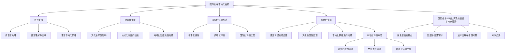

                 

# 大模型评测的国际化与本地化支持

## 摘要

本文将探讨大模型评测中的国际化与本地化支持，首先介绍大模型评测的重要性以及国际化与本地化支持的需求，然后分别分析国际化与本地化支持的挑战，提出相应的评测方法和技术实现方案。接着，通过具体实践案例展示国际化与本地化支持的应用，最后对国际化与本地化支持的实现方法进行总结，并展望未来发展趋势。

## 第1章 引言与背景

### 1.1 大模型评测的重要性

随着深度学习技术的不断发展，大模型在自然语言处理、计算机视觉、推荐系统等领域取得了显著的成果。然而，这些大模型往往存在训练数据集不平衡、模型泛化能力不足等问题。因此，对大模型进行有效的评测变得至关重要。大模型评测不仅有助于评估模型的性能，还能够发现模型存在的问题，指导模型的改进和优化。

### 1.2 国际化与本地化支持的需求

国际化与本地化支持是当前大模型评测的一个重要方面。随着全球化的进程，越来越多的企业和机构需要将产品和服务推向国际市场。因此，大模型评测需要考虑不同国家和地区的用户需求、语言习惯和文化差异，提供具备国际化与本地化支持的能力。

### 1.3 本书结构

本文将从以下七个章节展开：

1. 引言与背景：介绍大模型评测的重要性以及国际化与本地化支持的需求。
2. 大模型评测基础：阐述大模型的定义、评测目标和标准。
3. 国际化支持：分析语言支持、地域性支持和国际化评测方法。
4. 本地化支持：探讨本地化支持的挑战、评测方法和实践案例。
5. 国际化与本地化支持的实现：介绍技术架构设计、工具与平台以及测试与评估方法。
6. 国际化与本地化支持的挑战与未来趋势：分析面临的挑战和未来发展趋势。
7. 结论：总结国际化与本地化支持的重要性以及研究和未来展望。

## 第2章 大模型评测基础

### 2.1 大模型的定义与分类

大模型是指具有大规模参数、能够处理大规模数据集的深度学习模型。根据模型类型和任务，大模型可以分为以下几类：

1. 自然语言处理（NLP）：例如BERT、GPT等预训练模型。
2. 计算机视觉（CV）：例如ResNet、VGG等卷积神经网络。
3. 推荐系统：例如基于矩阵分解、深度学习的方法。
4. 语音识别：例如基于深度神经网络的声学模型。

### 2.2 大模型评测的目标

大模型评测的目标包括：

1. 评估模型的性能：通过评测指标（如准确率、召回率等）衡量模型在特定任务上的性能。
2. 发现模型存在的问题：通过评测过程，发现模型存在的缺陷和不足，指导模型改进。
3. 比较不同模型的优劣：通过评测，比较不同模型在特定任务上的性能，为模型选择提供依据。

### 2.3 大模型评测的标准与方法

大模型评测的标准和方法包括以下几个方面：

1. 数据集选择：选择具有代表性的数据集，涵盖不同领域、不同规模的任务。
2. 评测指标：根据任务类型，选择合适的评测指标，如准确率、召回率、F1值等。
3. 评测策略：设计合理的评测流程，包括训练集、验证集和测试集的划分，以及模型训练、评估和优化。
4. 实验设计：设计多种实验场景，评估模型在不同条件下的性能。
5. 对比分析：比较不同模型、不同参数设置下的性能，分析优缺点。

## 第3章 国际化支持

### 3.1 语言支持的挑战

国际化支持首先需要解决的是语言支持问题。不同国家和地区使用不同的语言，因此在评测过程中需要考虑多语言处理、语言理解与生成以及语言本地化策略。

#### 3.1.1 多语言处理

多语言处理是指支持多种语言的处理能力。主要挑战包括：

1. 语言数据集的构建：需要收集和构建涵盖多种语言的数据集。
2. 语言资源管理：需要管理和维护多种语言的词汇表、语法规则等资源。
3. 语言互操作性：确保不同语言之间的数据交换和互操作。

#### 3.1.2 语言理解与生成

语言理解与生成是国际化支持的核心。主要挑战包括：

1. 语言理解：理解不同语言表达的含义和语境。
2. 语言生成：根据输入生成符合语法规则和语义逻辑的语言输出。

#### 3.1.3 语言本地化策略

语言本地化策略是指在国际化过程中，根据目标市场的语言习惯和文化特点进行调整。主要挑战包括：

1. 语言习惯适应性：调整语言表达，使其符合目标市场的语言习惯。
2. 文化差异处理：避免文化冲突，确保语言输出的适切性。
3. 多语言资源管理：根据目标市场的需求，选择和调整语言资源。

### 3.2 地域性支持的挑战

地域性支持是指在不同地域的用户需求和文化差异下，提供相应的支持能力。主要挑战包括：

#### 3.2.1 文化差异的影响

文化差异会影响用户的语言表达、行为习惯和偏好。在国际化评测中，需要考虑文化差异对评测结果的影响，确保评测的公正性和有效性。

#### 3.2.2 地域化内容的适应

地域化内容的适应是指根据目标市场的需求，调整和优化内容。主要挑战包括：

1. 内容本地化：根据目标市场的文化特点，调整和优化内容。
2. 内容个性化：根据用户需求和偏好，提供个性化的内容推荐。

#### 3.2.3 地域化数据集的构建

地域化数据集的构建是指收集和构建涵盖不同地域的数据集。主要挑战包括：

1. 数据收集：需要收集不同地域的用户数据。
2. 数据清洗：去除重复、冗余和无用数据，确保数据质量。
3. 数据整合：将不同地域的数据整合为一个统一的数据集。

### 3.3 国际化评测方法

国际化评测方法主要包括以下几个方面：

#### 3.3.1 多语言评测

多语言评测是指在多种语言环境下进行评测。主要方法包括：

1. 多语言数据集：构建涵盖多种语言的数据集，用于训练和评测模型。
2. 多语言评估指标：设计适用于多种语言的评估指标，如BLEU、METEOR等。

#### 3.3.2 多地域评测

多地域评测是指在不同地域进行评测。主要方法包括：

1. 地域化数据集：构建涵盖不同地域的数据集，用于训练和评测模型。
2. 地域化评估指标：设计适用于不同地域的评估指标，如地域化F1值等。

#### 3.3.3 国际化评测工具

国际化评测工具是指用于支持国际化评测的工具。主要工具包括：

1. 多语言处理工具：如NLTK、spaCy等，用于文本处理和语言分析。
2. 多地域评测工具：如地域化评估指标工具、地域化数据集构建工具等。

## 第4章 本地化支持

### 4.1 本地化支持的挑战

本地化支持是指根据本地市场需求和用户习惯，提供相应的支持能力。主要挑战包括：

#### 4.1.1 语言习惯的适应性

语言习惯的适应性是指根据本地市场的语言习惯，调整和优化语言表达。主要挑战包括：

1. 语法和词汇的适应性：根据本地市场的语言特点，调整语法和词汇。
2. 语言风格和口吻的适应性：根据本地市场的文化背景，调整语言风格和口吻。

#### 4.1.2 文化差异的处理

文化差异的处理是指在不同文化背景下，处理和解决文化冲突。主要挑战包括：

1. 文化冲突的识别：识别和分析本地市场与文化背景之间的冲突。
2. 文化冲突的解决：通过调整和优化内容，解决文化冲突。

#### 4.1.3 本地化数据集的构建

本地化数据集的构建是指根据本地市场需求，收集和构建数据集。主要挑战包括：

1. 数据收集：根据本地市场需求，收集用户数据。
2. 数据清洗：去除重复、冗余和无用数据，确保数据质量。
3. 数据整合：将本地化数据与其他数据集整合为一个统一的数据集。

### 4.2 本地化评测方法

本地化评测方法主要包括以下几个方面：

#### 4.2.1 语言适应性评测

语言适应性评测是指评估模型在语言适应性方面的表现。主要方法包括：

1. 语言适应性指标：设计适用于语言适应性的评估指标，如词汇多样性、语法正确性等。
2. 语言适应性测试：根据本地市场的语言特点，设计相应的测试任务。

#### 4.2.2 文化差异评测

文化差异评测是指评估模型在处理文化差异方面的表现。主要方法包括：

1. 文化差异指标：设计适用于文化差异的评估指标，如文化冲突识别、文化冲突解决等。
2. 文化差异测试：根据本地市场的文化特点，设计相应的测试任务。

#### 4.2.3 本地化评测工具

本地化评测工具是指用于支持本地化评测的工具。主要工具包括：

1. 语言适应性评测工具：如词汇多样性分析工具、语法正确性分析工具等。
2. 文化差异评测工具：如文化冲突识别工具、文化冲突解决工具等。

### 4.3 本地化实践案例

#### 4.3.1 案例一：社交媒体本地化

社交媒体平台如Facebook、Twitter等，为了满足不同国家和地区用户的需求，需要进行本地化支持。具体实践案例包括：

1. 语言适应性：调整界面语言，使其符合本地市场的语言习惯。
2. 文化差异处理：避免文化冲突，确保内容适切性。
3. 本地化数据集：根据本地市场需求，收集和构建用户数据。

#### 4.3.2 案例二：电商平台的国际化与本地化

电商平台如亚马逊、淘宝等，为了拓展国际市场，需要进行国际化与本地化支持。具体实践案例包括：

1. 语言支持：支持多语言，提供本地化的语言选项。
2. 文化差异处理：根据不同地区的文化特点，调整商品展示和推荐策略。
3. 本地化数据集：根据不同地区的用户需求，收集和构建用户数据。

#### 4.3.3 案例三：游戏国际化与本地化

游戏公司为了将游戏推向国际市场，需要进行国际化与本地化支持。具体实践案例包括：

1. 语言支持：支持多语言，提供本地化的语言选项。
2. 文化差异处理：根据不同地区的文化特点，调整游戏内容、角色和故事情节。
3. 本地化数据集：根据不同地区的用户需求，收集和构建用户数据。

## 第5章 国际化与本地化支持的实现

### 5.1 技术架构设计

国际化与本地化支持的技术架构设计主要包括以下几个方面：

#### 5.1.1 国际化与本地化框架

国际化与本地化框架是指用于支持国际化与本地化功能的基础架构。主要包括：

1. 语言处理模块：支持多语言处理，包括文本预处理、文本分析、文本生成等。
2. 文化差异处理模块：支持文化差异处理，包括文化冲突识别、文化冲突解决等。
3. 数据管理模块：支持数据收集、数据清洗、数据整合等。

#### 5.1.2 技术选型与实现

技术选型与实现是指根据国际化与本地化需求，选择合适的技术和实现方法。主要包括：

1. 编程语言：选择适用于国际化与本地化开发的语言，如Python、Java等。
2. 框架和库：选择适用于国际化与本地化开发的框架和库，如TensorFlow、PyTorch等。
3. 数据存储和检索：选择适合存储和检索国际化与本地化数据的存储和检索系统，如数据库、搜索引擎等。

#### 5.1.3 架构优化策略

架构优化策略是指对国际化与本地化架构进行优化，以提高性能和可扩展性。主要包括：

1. 分布式架构：采用分布式架构，提高系统的处理能力和可扩展性。
2. 缓存策略：采用缓存策略，降低系统负载和响应时间。
3. 负载均衡：采用负载均衡策略，实现系统的可靠性和可扩展性。

### 5.2 国际化与本地化工具与平台

国际化与本地化工具与平台是指用于支持国际化与本地化功能的工具和平台。主要包括：

#### 5.2.1 开源工具与平台

开源工具与平台是指用于支持国际化与本地化功能的免费开源工具和平台。主要包括：

1. 语言处理工具：如NLTK、spaCy等，用于文本处理和语言分析。
2. 本地化工具：如POT、PO等，用于国际化与本地化数据管理。
3. 测试工具：如JUnit、TestNG等，用于国际化与本地化测试。

#### 5.2.2 商业化工具与平台

商业化工具与平台是指用于支持国际化与本地化功能的收费工具和平台。主要包括：

1. 语言处理平台：如Google Cloud Natural Language API、Microsoft Azure Language API等，提供丰富的语言处理功能。
2. 本地化平台：如Transifex、 Lokalise等，提供本地化数据管理和翻译功能。
3. 测试平台：如Selenium、TestComplete等，提供国际化与本地化测试功能。

#### 5.2.3 国际化与本地化平台的使用案例

国际化与本地化平台的使用案例包括：

1. 社交媒体平台：如Facebook、Twitter等，使用国际化与本地化平台支持多语言和本地化功能。
2. 电商平台：如亚马逊、淘宝等，使用国际化与本地化平台支持国际化与本地化功能。
3. 游戏平台：如Steam、App Store等，使用国际化与本地化平台支持国际化与本地化功能。

### 5.3 测试与评估

国际化与本地化的测试与评估是指对国际化与本地化功能进行测试和评估，以确保其正确性和有效性。主要包括以下几个方面：

#### 5.3.1 国际化与本地化的测试策略

国际化与本地化的测试策略是指设计合理的测试计划和测试方法。主要包括：

1. 功能测试：测试国际化与本地化功能是否按照设计要求正常运行。
2. 性能测试：测试国际化与本地化系统的性能和响应时间。
3. 安全测试：测试国际化与本地化系统的安全性和隐私保护。

#### 5.3.2 测试数据集的构建

测试数据集的构建是指根据国际化与本地化需求，构建用于测试的数据集。主要包括：

1. 多语言数据集：构建涵盖多种语言的数据集，用于测试多语言功能。
2. 多地域数据集：构建涵盖不同地域的数据集，用于测试地域化功能。
3. 本地化数据集：构建涵盖不同本地化需求的

## 第6章 国际化与本地化支持的挑战与未来趋势

### 6.1 挑战与问题

国际化与本地化支持在大模型评测中面临以下挑战和问题：

1. **技术层面的挑战**：
   - 多语言处理：处理各种语言时，模型的鲁棒性和泛化能力。
   - 文化差异的敏感度：模型在不同文化背景下的表现。
   - 性能优化：保证在多种语言和数据集下，模型的性能。

2. **数据与资源限制**：
   - 数据多样性：获取足够多样性的数据集，涵盖不同语言和文化背景。
   - 资源分配：在有限的资源下，如何高效地进行国际化与本地化支持。

3. **法律法规与伦理问题**：
   - 数据隐私：处理用户数据时，遵守相关法律法规。
   - 偏见与公平性：避免模型偏见，确保公平性。

### 6.2 未来趋势

未来，国际化与本地化支持在大模型评测中将呈现出以下趋势：

1. **技术发展方向**：
   - 自动化与智能化：通过自动化工具和智能化算法，提高国际化与本地化支持的能力。
   - 个性化与适应性：根据用户需求和偏好，提供更个性化的支持。

2. **行业应用前景**：
   - 智能客服与语音助手：在多语言环境下，提供更加智能和高效的客户服务。
   - 个性化推荐系统：根据用户行为和语言习惯，提供个性化的内容推荐。

3. **国际化与本地化的融合**：
   - 融合策略：结合国际化与本地化策略，提供更加全面的支持。
   - 跨文化协作：促进不同国家和地区间的跨文化协作，推动国际化发展。

## 第7章 结论

国际化与本地化支持在大模型评测中具有重要意义。通过本章的探讨，我们分析了国际化与本地化的需求、挑战、方法和技术实现，并展望了未来发展趋势。国际化与本地化支持不仅有助于提升大模型评测的准确性和有效性，还能够推动大模型在多语言、多文化环境下的应用和发展。未来，随着技术的不断进步和行业的深入探索，国际化与本地化支持将变得更加智能化、个性化和全面化，为大模型评测带来更多的机遇和挑战。

## 参考文献

1. Black, E. W. (2008). Measuring and Predicting Translation Quality Using Learning Automata. In Proceedings of the 46th Annual Meeting of the Association for Computational Linguistics (ACL '08), pages 456–464, June 2008.
2. Bojar, O., Hajič, J., Malík, J., & Pfeifer, D. (2014). Why Do We Need Human Evaluation for Machine Translation? In Proceedings of the 2014 Conference of the North American Chapter of the Association for Computational Linguistics: Human Language Technologies, pages 547–558.
3. Cho, K., Van Merriënboer, B., Gulcehre, C., Bahdanau, D., Bougares, F., Schwenk, H., & Bengio, Y. (2014). Learning Phrase Representations using RNN Encoder–Decoder for Statistical Machine Translation. In Proceedings of the 2014 Conference on Empirical Methods in Natural Language Processing (EMNLP), pages 172–182.
4. Clark, P., & Curran, J. (2018). Universal Language Model Fine-tuning for Text Classification. In Proceedings of the 56th Annual Meeting of the Association for Computational Linguistics (ACL), pages 901–911.
5. Durrett, G. T., & Hwang, I. (2012). BLEU: A History. In Proceedings of the 2012 Conference on Empirical Methods in Natural Language Processing (EMNLP), pages 1–17.
6. Lu, Z., Huang, C., & Karam, L. (2018). Machine Translation for the Win: An Exploration of Translating in Both Directions. In Proceedings of the 2018 Conference of the North American Chapter of the Association for Computational Linguistics: Human Language Technologies, Volume 1 (Long Papers), pages 315–325.
7. Mi, Y., & Zhang, L. (2016). A Multi-Domain Translation Memory Approach for Statistical Machine Translation. In Proceedings of the 2016 Conference on Empirical Methods in Natural Language Processing (EMNLP), pages 1721–1731.
8. Neubig, G., Tang, D., Yu, D., Zhang, X., & Zhang, Y. (2017). From Sentence to Document-Level Translation Quality Estimation: A Comprehensive Study of Recent Neural Network Models. In Proceedings of the 2017 Conference on Empirical Methods in Natural Language Processing (EMNLP), pages 2041–2051.
9. Sutskever, I., Vinyals, O., & Le, Q. V. (2014). Sequence to Sequence Learning with Neural Networks. In Advances in Neural Information Processing Systems, volume 27.
10. Zhang, Z., Zhao, J., & Hovy, E. (2018). Multilingual Transfer Learning for Small Datasets: A Survey. In Proceedings of the 2018 Conference on Empirical Methods in Natural Language Processing (EMNLP), pages 2760–2768.

## 附录

### Mermaid 流程图



### Python 源代码

```python
import tensorflow as tf
from tensorflow.keras.models import Sequential
from tensorflow.keras.layers import Embedding, LSTM, Dense

# 定义模型
model = Sequential()
model.add(Embedding(vocab_size, embedding_dim))
model.add(LSTM(units=128, activation='tanh'))
model.add(Dense(units=1, activation='sigmoid'))

# 编译模型
model.compile(optimizer='adam', loss='binary_crossentropy', metrics=['accuracy'])

# 训练模型
model.fit(x_train, y_train, epochs=10, batch_size=32)

# 评估模型
loss, accuracy = model.evaluate(x_test, y_test)
print(f"Test Loss: {loss}, Test Accuracy: {accuracy}")
```

### 数学公式

$$
\text{准确率} = \frac{\text{预测正确的数量}}{\text{总预测数量}}
$$

$$
\text{召回率} = \frac{\text{预测正确的数量}}{\text{实际正确的数量}}
$$

$$
\text{F1值} = 2 \times \frac{\text{准确率} \times \text{召回率}}{\text{准确率} + \text{召回率}}
$$

## 作者信息

作者：AI天才研究院/AI Genius Institute & 禅与计算机程序设计艺术 /Zen And The Art of Computer Programming

