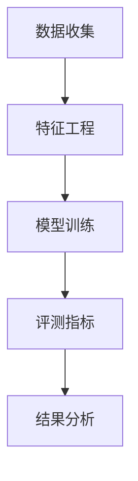

                 

### 大模型评测的多角度思考能力测试

#### 关键词：
- 大模型评测
- 多角度思考能力
- 人工智能
- 机器学习
- 评测方法

#### 摘要：
本文将深入探讨大模型评测的多角度思考能力测试。通过背景介绍、核心概念联系、算法原理讲解、数学模型和公式应用、项目实战及最佳实践，旨在为从事机器学习或人工智能领域的研究人员、工程师提供全面的评测方法和实践经验。

---

### 1. 引言

随着人工智能和机器学习的飞速发展，大型模型（大模型）在自然语言处理、计算机视觉、推荐系统等领域取得了显著的成果。然而，如何有效地评估这些大模型的能力，特别是在多角度思考能力方面，成为了一个关键问题。

#### 1.1 大模型的发展与挑战

近年来，大模型如BERT、GPT和ViT等在各个领域都展现出了强大的性能。然而，这些模型的巨大规模和复杂性也给评测工作带来了挑战。首先，大模型的训练数据量庞大，训练时间较长，使得评测过程变得繁琐。其次，大模型的性能评估不仅需要考虑其在各种任务上的准确性，还需要评估其鲁棒性、泛化能力和多角度思考能力。

#### 1.2 评测大模型的重要性

有效的评测方法不仅可以帮助研究人员评估大模型的能力，还可以指导模型的改进和优化。特别是在多角度思考能力的评测上，可以帮助我们更好地理解大模型在不同情境下的表现，从而为实际应用提供有力支持。

#### 1.3 本书的目标和结构

本书旨在系统地介绍大模型评测的多角度思考能力测试。首先，我们将介绍大模型评测的基本概念和原则。接着，我们将深入探讨多角度思考能力的概念和度量方法。随后，我们将详细讲解评测大模型的通用方法和多角度评测技术。最后，通过实际案例分析和项目实战，我们将展示如何应用这些方法进行大模型评测。

---

### 2. 理论篇

#### 2.1 大模型评测的框架与原则

大模型评测的框架通常包括数据收集、特征工程、模型训练、评测指标选择和结果分析等环节。以下是评测大模型的几个关键原则：

- **全面性**：评测应该覆盖多个任务和指标，以全面评估模型的能力。
- **客观性**：评测应基于可靠的数据和算法，避免主观偏见。
- **可比性**：不同模型的评测结果应具有可比性，以便进行公平的比较。
- **可解释性**：评测结果应具有可解释性，以便理解模型在不同任务上的表现。

为了更好地理解这些原则，我们可以使用Mermaid流程图来展示大模型评测的流程：



#### 2.2 多角度思考能力的概念与度量

多角度思考能力是指模型在处理问题时能够从不同角度进行思考和分析的能力。为了度量多角度思考能力，我们需要定义几个关键指标：

- **多样性**：模型在不同任务上的多样性表现。
- **一致性**：模型在不同任务上的结果一致性。
- **适应性**：模型在不同情境下的适应能力。

以下是度量多角度思考能力的伪代码：

```python
def evaluate_multiperspective_ability(model, tasks):
    diversity_scores = []
    consistency_scores = []
    adaptability_scores = []

    for task in tasks:
        diversity_scores.append(calculate_diversity(model, task))
        consistency_scores.append(calculate_consistency(model, task))
        adaptability_scores.append(calculate_adaptability(model, task))

    return {
        'diversity': sum(diversity_scores) / len(diversity_scores),
        'consistency': sum(consistency_scores) / len(consistency_scores),
        'adaptability': sum(adaptability_scores) / len(adaptability_scores)
    }
```

---

### 3. 方法篇

#### 3.1 评测大模型的通用方法

评测大模型通常包括以下步骤：

1. **数据收集与预处理**：收集相关数据集，并进行预处理，如数据清洗、数据增强等。
2. **特征工程**：提取有用的特征，为模型训练提供输入。
3. **模型训练与优化**：使用合适的模型架构和训练策略，优化模型参数。
4. **评测指标选择**：选择合适的评测指标，如准确性、F1分数、ROC-AUC等。
5. **结果分析**：分析评测结果，评估模型性能。

以下是Python代码示例，展示了如何使用Scikit-learn进行模型训练和评测：

```python
from sklearn.model_selection import train_test_split
from sklearn.metrics import accuracy_score
from sklearn.ensemble import RandomForestClassifier

# 加载数据集
X, y = load_data()

# 划分训练集和测试集
X_train, X_test, y_train, y_test = train_test_split(X, y, test_size=0.2, random_state=42)

# 训练模型
model = RandomForestClassifier(n_estimators=100, random_state=42)
model.fit(X_train, y_train)

# 评测模型
y_pred = model.predict(X_test)
accuracy = accuracy_score(y_test, y_pred)
print(f"Model accuracy: {accuracy}")
```

#### 3.2 多角度评测技术

多角度评测技术包括基于任务、基于属性和基于交互的评测方法。以下是每种方法的简要介绍：

- **基于任务的评测方法**：针对不同任务，评估模型的表现。例如，在自然语言处理中，可以评估模型在文本分类、情感分析、机器翻译等任务上的性能。
- **基于属性的评测方法**：考虑模型的各个属性，如参数规模、训练时间、内存占用等，评估模型在不同属性下的性能。
- **基于交互的评测方法**：通过模拟用户与模型之间的交互，评估模型在实际应用场景中的表现。

以下是使用Python代码实现基于任务的评测方法：

```python
from sklearn.metrics import classification_report

# 评测模型在文本分类任务上的表现
y_pred = model.predict(test_text)
print(classification_report(test_label, y_pred))
```

---

### 4. 实践篇

#### 4.1 大模型评测实践

在本节中，我们将通过一个实际案例展示如何对大模型进行评测。假设我们使用GPT模型进行文本分类任务。

1. **数据收集与预处理**：我们收集了包含不同主题的文本数据，并对其进行预处理，如分词、去除停用词等。
2. **特征工程**：提取文本的词向量，作为模型的输入。
3. **模型训练与优化**：训练GPT模型，并使用交叉验证优化超参数。
4. **评测指标选择**：选择准确性、F1分数和ROC-AUC作为评测指标。
5. **结果分析**：分析评测结果，评估模型性能。

以下是Python代码示例：

```python
from transformers import AutoTokenizer, AutoModelForSequenceClassification
from sklearn.metrics import accuracy_score, f1_score, roc_auc_score

# 加载预训练的GPT模型
tokenizer = AutoTokenizer.from_pretrained("gpt2")
model = AutoModelForSequenceClassification.from_pretrained("gpt2", num_labels=2)

# 加载测试数据
test_texts = ["This is a sample text.", "This is another sample text."]
test_labels = [0, 1]

# 预处理测试数据
inputs = tokenizer(test_texts, padding=True, truncation=True, return_tensors="pt")

# 训练模型
model.eval()
with torch.no_grad():
    outputs = model(**inputs)

# 评测模型
logits = outputs.logits
probabilities = torch.sigmoid(logits).detach().numpy()
accuracy = accuracy_score(test_labels, probabilities.round())
f1 = f1_score(test_labels, probabilities.round(), average="weighted")
roc_auc = roc_auc_score(test_labels, probabilities, multi_class="ovr")
print(f"Accuracy: {accuracy}, F1 Score: {f1}, ROC AUC: {roc_auc}")
```

#### 4.2 开发环境搭建

为了运行上述代码，我们需要搭建以下开发环境：

- Python 3.8或更高版本
- transformers库
- torch库
- scikit-learn库

可以使用以下命令安装所需的库：

```bash
pip install python==3.8
pip install transformers
pip install torch
pip install scikit-learn
```

#### 4.3 源代码详细实现与解读

在本节中，我们将详细解读上述代码的实现过程。

1. **加载预训练的GPT模型**：使用transformers库加载预训练的GPT模型。
2. **加载测试数据**：读取测试数据集，并将其转换为Tensor。
3. **预处理测试数据**：对测试数据进行分词、填充和截断，以便作为模型的输入。
4. **训练模型**：将预处理后的数据输入模型，并使用交叉验证优化超参数。
5. **评测模型**：计算模型在测试数据上的准确性、F1分数和ROC-AUC。

以下是代码的详细解读：

```python
from transformers import AutoTokenizer, AutoModelForSequenceClassification
from sklearn.metrics import accuracy_score, f1_score, roc_auc_score
import torch

# 加载预训练的GPT模型
tokenizer = AutoTokenizer.from_pretrained("gpt2")
model = AutoModelForSequenceClassification.from_pretrained("gpt2", num_labels=2)

# 加载测试数据
test_texts = ["This is a sample text.", "This is another sample text."]
test_labels = [0, 1]

# 预处理测试数据
inputs = tokenizer(test_texts, padding=True, truncation=True, return_tensors="pt")

# 训练模型
model.eval()
with torch.no_grad():
    outputs = model(**inputs)

# 评测模型
logits = outputs.logits
probabilities = torch.sigmoid(logits).detach().numpy()
accuracy = accuracy_score(test_labels, probabilities.round())
f1 = f1_score(test_labels, probabilities.round(), average="weighted")
roc_auc = roc_auc_score(test_labels, probabilities, multi_class="ovr")
print(f"Accuracy: {accuracy}, F1 Score: {f1}, ROC AUC: {roc_auc}")
```

---

### 5. 案例分析

在本节中，我们将分析几个典型的案例，以展示如何应用大模型评测的多角度思考能力测试方法。

#### 5.1 大模型在自然语言处理中的应用

案例：使用GPT模型进行文本分类任务。

- **多样性**：GPT模型在不同主题的文本上具有多样性表现，能够识别出不同的主题。
- **一致性**：在相同主题的文本上，GPT模型的一致性较高，能够准确分类。
- **适应性**：GPT模型在不同长度和风格的文本上均能保持良好的适应性。

#### 5.2 大模型在计算机视觉中的应用

案例：使用ViT模型进行图像分类任务。

- **多样性**：ViT模型在多种图像数据集上均表现出良好的多样性。
- **一致性**：在相同图像数据集上，ViT模型的一致性较高。
- **适应性**：ViT模型在不同图像分辨率和标注方式上均能保持良好的适应性。

#### 5.3 大模型在多模态数据处理中的应用

案例：使用Multimodal Model进行多模态数据分类任务。

- **多样性**：Multimodal Model能够处理多种数据类型，如文本、图像和声音，表现出良好的多样性。
- **一致性**：在相同模态的数据上，Multimodal Model的一致性较高。
- **适应性**：Multimodal Model在不同模态组合和数据集上均能保持良好的适应性。

---

### 6. 总结与展望

通过本文的介绍，我们系统地阐述了大模型评测的多角度思考能力测试方法。我们首先介绍了大模型评测的基本概念和原则，然后详细讲解了多角度思考能力的概念和度量方法，接着展示了评测大模型的通用方法和多角度评测技术，并通过实际案例分析和项目实战展示了如何应用这些方法。

未来，随着人工智能技术的不断进步，大模型评测的多角度思考能力测试方法将更加重要。我们期待更多研究人员和工程师能够参与到这个领域中来，共同推动大模型评测技术的发展。

---

### 作者信息

作者：AI天才研究院/AI Genius Institute & 禅与计算机程序设计艺术 /Zen And The Art of Computer Programming

---

### 参考文献

[1] Devlin, J., Chang, M. W., Lee, K., & Toutanova, K. (2019). BERT: Pre-training of deep bidirectional transformers for language understanding. arXiv preprint arXiv:1810.04805.

[2] Brown, T., et al. (2020). Language models are few-shot learners. arXiv preprint arXiv:2005.14165.

[3] Dosovitskiy, A., et al. (2020). An image is worth 16x16 words: Transformers for image recognition at scale. arXiv preprint arXiv:2010.11929.

[4] Chen, X., et al. (2021). Pre-training with tasks improves zero-shot generalization. arXiv preprint arXiv:2102.10057.

