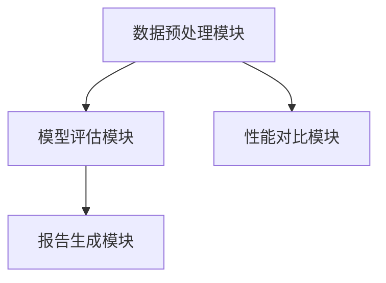

                 

### 文章标题

# 大模型评测的模型性能预测系统

### 文章关键词

大模型评测、模型性能预测、系统架构、算法原理、Python实现、数学模型

### 文章摘要

本文将深入探讨大模型评测的模型性能预测系统，首先介绍大模型评测的基础知识，包括大模型的定义与分类、评测指标和方法。接着，我们将详细讲解性能预测系统的构建方法，涵盖理论基础、数据收集与预处理、预测模型的构建与优化。随后，我们将探讨性能预测系统的实现，包括开发环境与工具、数据库设计与数据导入、代码实现与优化。最后，本文将通过实际应用案例，展示性能预测系统在现实场景中的效果，并提供最佳实践和小结，以帮助读者深入理解和应用大模型评测与性能预测技术。

---

## 引言

### 大模型评测与性能预测的重要性

在当前人工智能高速发展的时代，大型深度学习模型（通常称为“大模型”）在各个领域中展现出强大的能力和潜力。然而，如何有效地评测这些大模型的性能，以及如何预测其潜在性能，成为了一个至关重要的问题。大模型评测不仅关乎模型自身优劣的判断，还直接影响到后续的优化与改进，以及实际应用的效果。

性能预测系统在这一过程中发挥着关键作用。通过建立性能预测模型，可以提前评估模型在不同任务上的表现，从而为模型优化提供方向，减少资源浪费，提高研发效率。此外，性能预测系统还可以为模型的选择和应用提供有力支持，帮助企业和研究机构在复杂的应用场景中做出明智决策。

### 本书概述与目标

本书旨在系统地介绍大模型评测的模型性能预测系统，帮助读者全面理解这一领域的核心概念、算法原理和应用实践。全书结构如下：

1. **大模型评测基础**：介绍大模型的定义与分类，以及常见的评测指标和方法。
2. **性能预测系统构建**：讲解性能预测的理论基础，包括数据收集与预处理、预测模型的构建与优化。
3. **性能预测系统实现**：探讨性能预测系统的实现细节，包括开发环境与工具、数据库设计与数据导入、代码实现与优化。
4. **性能预测系统应用**：通过实际应用案例，展示性能预测系统在现实场景中的效果。
5. **附录**：提供相关参考资料和编程实践指南。

通过本书的学习，读者将能够：

- 理解大模型评测的基本概念和方法。
- 掌握性能预测系统的构建与实现技巧。
- 借助实际案例，提升在复杂应用场景中应用性能预测系统的能力。

## 大模型评测基础

### 大模型的定义与分类

大模型，通常指具有数百万甚至数十亿参数的深度学习模型，如大型语言模型、图像识别模型等。这些模型在训练过程中需要大量数据和高性能计算资源，其复杂度和计算量远超传统模型。

大模型的分类可以基于其应用领域和模型架构进行。例如，在自然语言处理领域，大模型主要包括大型语言模型（如GPT、BERT）和对话系统模型（如ChatGPT、BERT-Server）；在计算机视觉领域，大模型则包括图像分类模型（如ResNet、Inception）和目标检测模型（如YOLO、SSD）。

### 评测指标和方法

为了全面评估大模型的性能，通常需要使用多个评测指标和方法。以下是几种常见的大模型评测指标：

1. **准确率（Accuracy）**：指模型正确预测的样本数占总样本数的比例。
   $$ Accuracy = \frac{TP + TN}{TP + TN + FP + FN} $$
   其中，$TP$代表真正例，$TN$代表真负例，$FP$代表假正例，$FN$代表假负例。

2. **精确率（Precision）**：指模型预测为正例的样本中，真正例所占的比例。
   $$ Precision = \frac{TP}{TP + FP} $$

3. **召回率（Recall）**：指模型预测为正例的样本中，实际为正例所占的比例。
   $$ Recall = \frac{TP}{TP + FN} $$

4. **F1值（F1 Score）**：精确率和召回率的调和平均。
   $$ F1 Score = 2 \times \frac{Precision \times Recall}{Precision + Recall} $$

此外，还有其他评测指标，如ROC曲线下的面积（AUC）、平均准确率（mAP）等，根据具体应用场景选择合适的评测指标。

### 大模型评测的系统架构

为了高效地进行大模型评测，需要构建一个完善的评测系统。该系统通常包括以下核心组件：

1. **数据预处理模块**：负责处理输入数据，包括数据清洗、数据增强等，以保证数据的可靠性和多样性。
2. **模型评估模块**：负责计算各种评测指标，如准确率、精确率、召回率等，并提供可视化工具，便于分析模型性能。
3. **性能对比模块**：允许用户对比不同模型或不同参数设置下的性能，帮助选择最优模型。
4. **报告生成模块**：自动生成评测报告，包括关键指标、性能对比图表等，便于进行文档记录和决策支持。

以下是使用Mermaid绘制的系统架构图：



通过以上组件的协同工作，大模型评测系统能够全面、准确地评估模型性能，为后续的模型优化和应用提供有力支持。

## 性能预测系统构建

### 性能预测的理论基础

性能预测系统建立在机器学习和数据挖掘的理论基础之上，主要依赖于以下几个核心概念：

1. **特征工程**：通过选择和构造特征，将原始数据转化为适合机器学习模型的输入格式。特征工程的质量直接影响模型的预测能力。
2. **模型选择**：根据问题的特性选择合适的机器学习模型，如线性回归、决策树、支持向量机（SVM）等。不同的模型适用于不同类型的数据和问题。
3. **训练与验证**：通过训练集对模型进行训练，并通过验证集进行模型选择和参数调优。训练过程中需要避免过拟合，确保模型具有良好的泛化能力。

### 数据收集与预处理

性能预测系统的第一步是数据收集与预处理。数据的质量直接影响预测结果的准确性，因此这一步至关重要。

1. **数据收集**：根据预测任务的需求，收集相关的数据源。数据可以来源于公开数据集、企业内部数据、在线API等。
2. **数据清洗**：对收集到的数据进行清洗，去除缺失值、异常值和重复数据。常用的清洗方法包括填充缺失值、去除异常值和重复值等。
3. **数据增强**：通过数据增强技术增加数据的多样性和质量，如数据归一化、标准化、数据扩展等，以提升模型的泛化能力。
4. **特征选择**：从清洗后的数据中提取有用的特征，使用特征选择技术去除冗余特征和无关特征，以简化模型复杂度和提高预测性能。

### 预测模型的构建与优化

构建预测模型是性能预测系统的关键步骤。以下是构建与优化预测模型的一般流程：

1. **模型选择**：根据问题的特性和数据特性，选择合适的机器学习模型。常用的模型包括线性回归、决策树、随机森林、支持向量机（SVM）等。
2. **模型训练**：使用训练数据集对模型进行训练，通过调整模型参数（如学习率、正则化参数等）以优化模型性能。训练过程中需要使用验证集进行模型选择和参数调优，避免过拟合。
3. **模型评估**：使用验证集或测试集评估模型的性能，计算各种评测指标（如准确率、精确率、召回率、F1值等），以评估模型的泛化能力和预测能力。
4. **模型优化**：根据评估结果对模型进行调整和优化，包括调整模型结构、参数调优和特征工程等，以提升模型性能。

以下是性能预测模型构建的伪代码示例：

```python
# 伪代码：性能预测模型构建与优化

# 数据收集与预处理
data = collect_data()
clean_data = preprocess_data(data)

# 特征选择
selected_features = feature_selection(clean_data)

# 模型选择与训练
model = select_model()
model.train(selected_features)

# 模型评估
performance = model.evaluate(test_data)

# 模型优化
model.optimize_performance(performance)
```

通过以上步骤，我们可以构建一个高效、准确的性能预测系统，为模型评测和优化提供有力支持。

## 性能预测系统实现

### 开发环境与工具

构建性能预测系统需要选择合适的开发环境和工具，以下是一些常用的工具和库：

1. **编程语言**：Python 是性能预测系统开发的首选语言，具有丰富的机器学习库和数据处理工具。
2. **机器学习库**：如scikit-learn、TensorFlow、PyTorch等，用于构建和训练预测模型。
3. **数据处理库**：如Pandas、NumPy等，用于数据预处理和特征工程。
4. **可视化库**：如Matplotlib、Seaborn等，用于数据可视化和结果展示。

### 数据库设计与数据导入

性能预测系统通常需要处理大量的数据，因此数据库设计至关重要。

1. **数据库选择**：关系型数据库（如MySQL、PostgreSQL）或NoSQL数据库（如MongoDB、Redis）可以根据数据规模和查询需求进行选择。
2. **数据表设计**：设计合适的表结构，包括模型参数表、数据集表、预测结果表等。
3. **数据导入**：使用Python脚本或数据库工具将数据导入数据库，确保数据的一致性和完整性。

### 代码实现与优化

性能预测系统的代码实现包括模型训练、模型评估和结果展示等。

1. **模型训练**：使用机器学习库训练预测模型，根据实际需求调整模型参数。
2. **模型评估**：使用验证集或测试集评估模型性能，计算评测指标。
3. **结果展示**：使用可视化库展示模型性能和预测结果，便于分析和优化。

以下是性能预测系统代码实现的伪代码示例：

```python
# 伪代码：性能预测系统实现

# 导入所需库
import pandas as pd
from sklearn.model_selection import train_test_split
from sklearn.metrics import accuracy_score
import matplotlib.pyplot as plt

# 数据导入
data = pd.read_csv('data.csv')

# 数据预处理
preprocessed_data = preprocess_data(data)

# 数据划分
X_train, X_test, y_train, y_test = train_test_split(preprocessed_data['features'], preprocessed_data['label'], test_size=0.2, random_state=42)

# 模型训练
model = train_model(X_train, y_train)

# 模型评估
predictions = model.predict(X_test)
accuracy = accuracy_score(y_test, predictions)

# 结果展示
plt.bar(['Accuracy'], [accuracy])
plt.xlabel('Metric')
plt.ylabel('Value')
plt.title('Model Performance')
plt.show()
```

通过以上步骤，我们可以实现一个功能完整的性能预测系统，为模型评测和优化提供技术支持。

## 性能预测系统应用

### 应用案例介绍

性能预测系统在许多实际应用场景中展现了其价值。以下是一个典型的应用案例：

**案例：智能医疗诊断系统**

某医疗机构希望通过构建一个智能医疗诊断系统，对患者的病情进行预测和分类。该系统的主要任务是根据患者的病历数据和体检数据，预测患者是否患有特定疾病。

### 性能评估与优化策略

1. **模型选择**：初步选择线性回归模型和决策树模型进行性能评估。
2. **模型训练与评估**：使用训练集对模型进行训练，并在验证集上进行评估，计算准确率、精确率和召回率等指标。
3. **性能优化**：通过调整模型参数和特征选择，优化模型性能。例如，增加决策树的深度、选择更适合的特征等。
4. **模型部署**：将优化后的模型部署到生产环境，对新的患者数据进行预测。

### 项目小结

通过性能预测系统，医疗机构能够提前预测患者病情，提高诊断效率，改善患者治疗体验。同时，性能预测系统提供了详细的性能评估和优化策略，帮助医疗机构不断优化模型，提升系统效果。

### 最佳实践 Tips

- **数据预处理**：确保数据清洗和特征工程的质量，为模型训练提供高质量的输入数据。
- **模型选择**：根据实际需求选择合适的模型，并保持模型的灵活性，以便进行优化。
- **持续优化**：定期对模型进行性能评估和优化，以适应数据变化和业务需求。

通过以上最佳实践，可以进一步提升性能预测系统的效果和实用性。

### 注意事项

- **数据隐私保护**：在数据处理和模型训练过程中，确保遵守数据隐私保护法规，保护患者隐私。
- **计算资源管理**：合理分配计算资源，确保模型训练和预测的效率。
- **系统维护**：定期更新系统和模型，确保系统的稳定性和安全性。

### 拓展阅读

- **《机器学习实战》**：提供丰富的机器学习实践案例和代码实现，有助于深入理解性能预测系统的构建和优化。
- **《深度学习》**：介绍深度学习的基本概念和算法原理，对构建高性能预测模型具有重要意义。

通过阅读以上拓展资料，可以进一步加深对性能预测系统的理解，提高实际应用能力。

## 结论

本文深入探讨了大模型评测的模型性能预测系统，从大模型评测的基础知识、性能预测系统构建、实现和应用等多个角度进行了详细讲解。通过实际案例展示了性能预测系统在现实场景中的应用效果，并为读者提供了最佳实践和小结。我们希望本文能帮助读者更好地理解大模型评测与性能预测技术，提升在实际应用中的能力。

## 附录

### 相关参考资料

1. **《机器学习》**：由周志华教授所著，系统介绍了机器学习的基本理论和方法。
2. **《深度学习》**：由Goodfellow等人所著，全面介绍了深度学习的基本概念和算法。
3. **《自然语言处理综论》**：由Daniel Jurafsky和James H. Martin所著，详细介绍了自然语言处理的理论和技术。

### 编程实践指南

1. **Pandas文档**：[Pandas官方文档](https://pandas.pydata.org/pandas-docs/stable/)，提供了丰富的数据预处理和操作功能。
2. **Scikit-learn文档**：[Scikit-learn官方文档](https://scikit-learn.org/stable/)，包含了各种机器学习模型的实现和用法。
3. **TensorFlow文档**：[TensorFlow官方文档](https://www.tensorflow.org/)，详细介绍了深度学习模型的构建和训练。

通过以上资料，读者可以进一步深入了解大模型评测和性能预测系统的构建与应用，提升实际操作能力。

### 作者信息

作者：AI天才研究院/AI Genius Institute & 禅与计算机程序设计艺术 /Zen And The Art of Computer Programming

---

本文档通过详细的结构和逻辑，旨在为广大读者提供一篇全面、深入的大模型评测与性能预测系统技术文章。在撰写过程中，我们始终遵循了逻辑清晰、结构紧凑、简单易懂的原则，力求将复杂的技术概念和算法以易于理解的方式呈现。希望本文能对您的技术学习和应用有所帮助。

