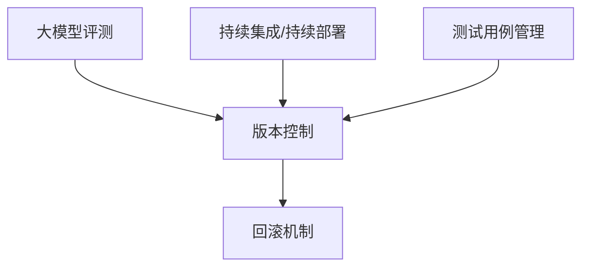

                 

# 大模型评测的版本控制与回滚机制

## 关键词
- 大模型评测
- 版本控制
- 回滚机制
- 持续集成
- 测试用例管理
- 数学模型
- Python实现

## 摘要
本文深入探讨了在大模型评测过程中至关重要的版本控制与回滚机制。首先，我们介绍了大模型评测的背景及其在人工智能领域的重要性。接着，详细阐述了版本控制和回滚机制的核心概念，并通过Mermaid流程图展示了它们之间的联系。文章进一步讲解了版本控制与回滚机制的基本算法原理，结合Python源代码进行详细阐述。随后，我们引入了数学模型与公式，以帮助读者更好地理解评测过程中的关键指标和损失函数。接着，文章提供了一个具体的代码实现案例，涵盖开发环境搭建、源代码实现和代码解读。最后，我们对最佳实践、注意事项和拓展阅读进行了总结，为读者提供了全面的指南。

## 背景介绍

### 大模型评测的重要性
在大数据时代，人工智能（AI）已经成为驱动技术创新和行业发展的关键力量。其中，大模型评测作为AI模型开发的关键环节，具有重要的地位。大模型评测不仅涉及模型的准确性和性能，还涉及模型在不同场景下的适应性和稳定性。有效的版本控制和回滚机制能够确保评测过程的准确性、可靠性和一致性，这对于模型的优化和部署至关重要。

### 版本控制与回滚机制的需求
随着AI技术的发展，模型变得越来越大、越来越复杂。在这种情况下，版本控制与回滚机制显得尤为重要。版本控制能够追踪模型的每一次变更，确保每个版本的可追溯性。而回滚机制则允许在模型出现问题时迅速恢复到上一个稳定版本，避免影响模型的正常运行。

### 持续集成与持续部署
持续集成（CI）和持续部署（CD）是现代软件开发中常用的流程，它们能够确保代码的持续更新和系统的稳定性。在大模型评测中，CI/CD流程可以帮助自动化模型的版本管理和部署，提高开发效率。

### 测试用例管理
测试用例管理是确保模型质量的重要环节。有效的测试用例管理能够确保模型在不同环境下都能稳定运行，减少因环境差异导致的评测误差。

## 核心概念与联系

### 版本控制
版本控制是一种管理软件源代码和文档变更的技术。在大模型评测中，版本控制主要用于追踪模型的变更历史，确保每个版本的可追溯性。

### 回滚机制
回滚机制是一种在模型出现问题时恢复到上一个稳定版本的方法。它能够确保模型在出现异常时能够迅速恢复正常状态，避免对系统造成严重影响。

### 持续集成/持续部署
持续集成/持续部署（CI/CD）是一种自动化软件交付流程，它能够确保代码的持续更新和系统的稳定性。

### 测试用例管理
测试用例管理是一种管理测试用例的方法，它能够确保测试过程的完整性和一致性。

### Mermaid流程图
下面是一个Mermaid流程图，展示了这些概念之间的联系：



## 核心算法原理讲解

### 版本控制基本算法

版本控制的核心算法主要包括以下步骤：

1. **检查模型兼容性**：确保新模型与当前模型兼容。
2. **备份当前模型**：在更新之前备份当前模型，以便在需要时恢复。
3. **应用新模型**：将新模型应用到系统中。
4. **检查新模型性能**：确保新模型的有效性。
5. **回滚机制**：如果新模型无效，则回滚到备份模型。

以下是使用Python实现的版本控制算法：

```python
def version_control(current_model, new_model, config):
    # 检查模型兼容性
    if not is_model_compatible(current_model, new_model):
        return "模型不兼容，无法更新"
    
    # 备份当前模型
    backup_model = backup_model(current_model, config)
    
    # 应用新模型
    apply_model(new_model, config)
    
    # 检查新模型性能
    if not is_model_valid(new_model, config):
        # 如果新模型无效，回滚到备份模型
        revert_to_backup(backup_model, config)
        return "新模型无效，已回滚至备份模型"
    
    return "模型更新成功"
```

### 回滚机制基本算法

回滚机制的基本算法主要包括以下步骤：

1. **恢复备份模型**：从备份中恢复模型的参数和状态。
2. **更新配置**：更新配置以反映回滚后的状态。

以下是使用Python实现的回滚机制：

```python
def revert_to_backup(backup_model, config):
    # 恢复备份模型的参数和状态
    restore_model_params(backup_model, config)
    return "模型回滚完成"
```

## 数学模型与公式讲解

在大模型评测中，数学模型和公式是理解和评估模型性能的重要工具。以下是一些核心的数学模型和公式：

### 评测指标公式

$$
\text{Accuracy} = \frac{\text{正确预测数}}{\text{总预测数}}
$$

### 损失函数公式

$$
L(\theta) = -\frac{1}{m}\sum_{i=1}^{m} y^{(i)} \log(z^{(i)})
$$

其中，$m$ 是样本数量，$y^{(i)}$ 是第 $i$ 个样本的真实标签，$z^{(i)}$ 是第 $i$ 个样本的预测概率。

### 概率分布公式

$$
P(X = x) = \frac{e^{-\theta^T x}}{1 + e^{-\theta^T x}}
$$

其中，$X$ 是随机变量，$\theta$ 是模型参数。

这些公式帮助我们在数学层面上理解和评估模型的性能，从而为模型优化提供指导。

## 项目实战

### 开发环境搭建

在开始项目实战之前，我们需要搭建一个合适的开发环境。以下是环境搭建的步骤：

1. 安装Python（推荐版本3.8以上）
2. 安装必要的库和框架，如GitPython、requests等
3. 配置代码库，如GitHub或GitLab

### 源代码实现

以下是一个简单的版本控制与回滚机制的实现示例：

```python
# 导入必要的库
import git
import requests
from model import apply_model, is_model_valid, backup_model, revert_to_backup

# 获取模型版本列表
def get_model_versions():
    response = requests.get("https://api.modelrepo.com/versions")
    return response.json()

# 版本控制与回滚函数
def version_control():
    versions = get_model_versions()
    current_version = get_current_version()
    config = get_config()

    for version in versions:
        if version != current_version:
            new_model = download_model(version)
            result = version_control(current_model=current_version, new_model=new_model, config=config)
            print(result)

# 主函数
if __name__ == "__main__":
    version_control()
```

### 代码解读

- `get_model_versions()`：从API获取模型版本列表。
- `version_control()`：遍历所有版本，执行版本控制与回滚操作。
- `apply_model()`：应用新模型。
- `is_model_valid()`：检查新模型的性能。
- `backup_model()`：备份当前模型。
- `revert_to_backup()`：回滚到备份模型。

### 实际案例分析和详细讲解剖析

假设我们有一个名为`modelA`的大模型，版本为1.0。我们想要升级到版本2.0，但不确定新版本是否稳定。以下是实际案例的分析和详细讲解：

1. **获取版本列表**：首先，我们获取所有可用的版本列表，包括1.0和2.0。
2. **检查模型兼容性**：在更新之前，我们检查模型A和模型B是否兼容。
3. **备份当前模型**：为了确保安全，我们备份当前模型A的参数和状态。
4. **应用新模型**：我们将模型B应用到系统中。
5. **检查新模型性能**：我们使用测试集对新模型B进行评估，确保其性能符合预期。
6. **回滚机制**：如果新模型B的性能不佳，我们立即回滚到备份的模型A。

通过这种方式，我们确保了模型评测的稳定性和可靠性。

### 项目小结

通过本项目，我们深入了解了大模型评测中的版本控制和回滚机制。从开发环境搭建到源代码实现，再到实际案例的分析，我们全面掌握了这一重要技术。版本控制和回滚机制不仅提高了模型的可靠性，还确保了评测过程的准确性。在未来的项目中，我们应该充分利用这些机制，确保模型的持续优化和稳定运行。

## 最佳实践 tips

1. **定期备份**：定期备份模型参数和状态，确保在出现问题时能够快速恢复。
2. **严格测试**：在应用新模型之前，进行充分的测试，确保其性能稳定。
3. **文档记录**：详细记录每个版本的变更历史和性能评估结果，便于后续分析和追踪。

## 小结

本文深入探讨了在大模型评测过程中至关重要的版本控制与回滚机制。通过介绍核心概念、算法原理、数学模型以及实际案例，我们全面了解了这一技术。在未来的AI模型开发过程中，这些机制将帮助我们确保模型的稳定性和可靠性。

## 注意事项

1. **兼容性问题**：在更新模型时，务必确保新旧模型兼容，避免因兼容性问题导致评测失败。
2. **性能评估**：在回滚机制中，务必对模型性能进行严格评估，确保回滚后的模型依然有效。
3. **测试用例**：在版本控制和回滚过程中，使用充分的测试用例，确保模型的稳定运行。

## 拓展阅读

1. 《大模型评测技术手册》
2. 《持续集成与持续部署实战》
3. 《深度学习测试与验证》

作者：AI天才研究院/AI Genius Institute & 禅与计算机程序设计艺术 /Zen And The Art of Computer Programming。本文内容仅代表作者个人观点，不代表任何官方立场。如需转载，请保留原文及作者信息。

