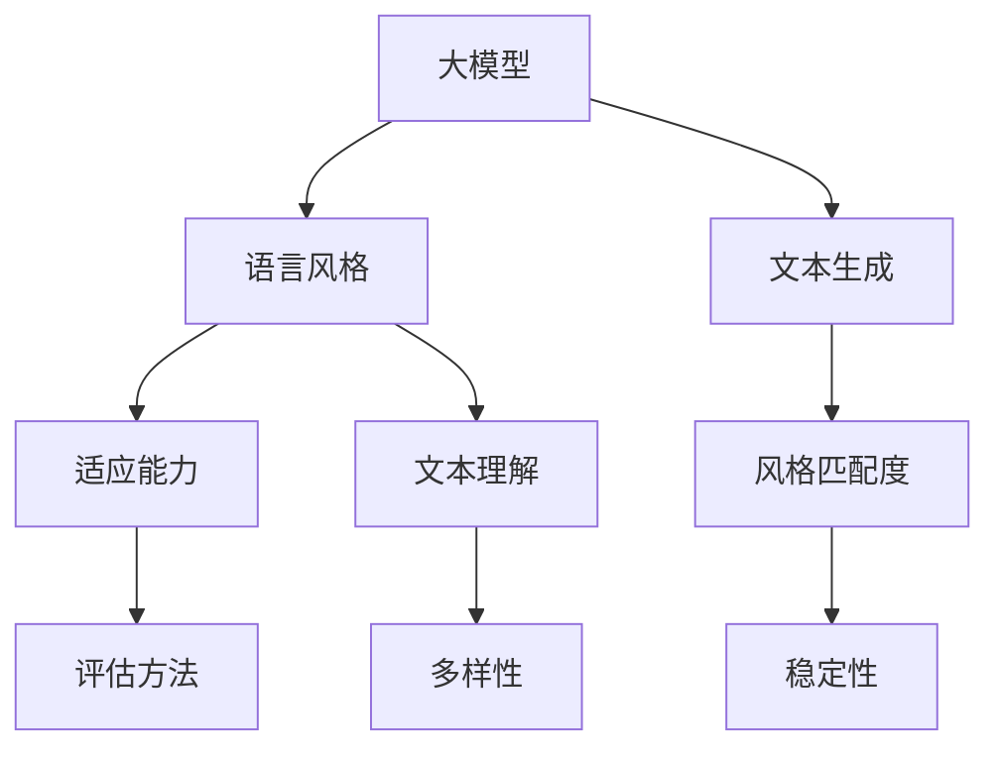

                 

# 大模型语言风格适应能力：LLM设计的风格测试

> 关键词：大模型，语言风格，适应能力，LLM设计，风格测试

> 摘要：本文旨在探讨大模型语言风格适应能力的重要性，分析现有大模型在语言风格适应方面的挑战，并提出一种基于LLM设计的风格测试方法。通过介绍核心概念、核心算法原理、数学模型和实际项目案例，本文为读者提供了深入理解大模型语言风格适应能力的途径。

## 第1章 大模型语言风格适应能力概述

### 1.1 大模型基础

#### 1.1.1 大模型的概念

大模型，即大型语言模型（Large Language Model，简称LLM），是一种具有高度参数量、强泛化能力和广泛知识库的深度学习模型。近年来，随着计算能力的提升和海量数据的积累，大模型在自然语言处理（NLP）领域取得了显著的进展。例如，GPT-3、BERT、T5等模型已经成为当前NLP任务中的主流选择。

#### 1.1.2 大模型的分类

大模型可以根据不同的标准进行分类。例如，根据模型架构，可以分为Transformer、CNN、RNN等；根据训练数据量，可以分为小样本模型、中样本模型和大样本模型；根据应用领域，可以分为通用模型和专用模型等。

#### 1.1.3 大模型的优势

大模型具有以下优势：
1. **强泛化能力**：能够处理各种语言任务，如文本分类、机器翻译、问答系统等。
2. **广泛的知识库**：通过大量文本数据训练，能够掌握丰富的语言知识和世界常识。
3. **高效率**：使用预训练的大模型可以快速适应新的任务和数据。

### 1.2 语言风格概念

#### 1.2.1 语言风格的定义

语言风格是指文本在语言表达上的个性化特征，包括词汇选择、语法结构、修辞手法、语境适应性等。例如，文学作品、新闻报道、科技论文等都有其独特的语言风格。

#### 1.2.2 语言风格的特点

1. **多样性**：不同的文本具有不同的语言风格，体现了语言的丰富性和多样性。
2. **动态性**：语言风格会随着时间、地点、情境的变化而变化。
3. **抽象性**：语言风格往往是抽象的，难以直接测量和量化。

#### 1.2.3 语言风格的影响

语言风格对文本理解和生成具有重要影响：
1. **文本理解**：不同的语言风格会影响读者对文本的理解和解读。
2. **文本生成**：在生成文本时，保持合适的语言风格可以提高文本的质量和可读性。

### 1.3 适应能力

#### 1.3.1 适应能力的定义

适应能力是指模型在遇到新的语言风格时，能够快速调整并生成符合该风格的文本。

#### 1.3.2 适应能力的重要性

适应能力的重要性体现在：
1. **提高文本生成质量**：能够适应多种语言风格，生成更加自然、优质的文本。
2. **拓展应用场景**：使得大模型能够应用于更多领域，如文学创作、新闻写作等。

#### 1.3.3 适应能力的评估

适应能力可以通过以下指标进行评估：
1. **风格匹配度**：评估生成的文本与目标语言风格的匹配程度。
2. **多样性**：评估生成的文本在风格上的多样性。
3. **稳定性**：评估模型在不同语言风格下的稳定性和一致性。

## Mermaid流程图



## 第2章 核心算法原理讲解

### 2.1 语言风格分类算法

#### 2.1.1 分类算法的选择

在语言风格分类中，常用的分类算法有支持向量机（SVM）、朴素贝叶斯（Naive Bayes）、随机森林（Random Forest）等。选择哪种算法取决于数据的特点和模型的性能要求。

#### 2.1.2 特征提取

特征提取是语言风格分类的关键步骤。常用的特征包括词频（TF）、词嵌入（Word Embedding）、语法结构、命名实体等。

#### 2.1.3 分类算法的实现

以下是一个使用Python和Scikit-learn库实现语言风格分类的伪代码：

```python
from sklearn.feature_extraction.text import TfidfVectorizer
from sklearn.svm import SVC

# 特征提取
vectorizer = TfidfVectorizer()
X = vectorizer.fit_transform(corpus)

# 分类
clf = SVC()
clf.fit(X_train, y_train)

# 预测
y_pred = clf.predict(X_test)
```

### 2.2 适应能力评估算法

#### 2.2.1 评估指标的选择

适应能力评估的常用指标包括风格匹配度、多样性、稳定性等。

#### 2.2.2 评估算法的实现

以下是一个使用Python和Scikit-learn库实现适应能力评估的伪代码：

```python
from sklearn.metrics.pairwise import cosine_similarity

# 风格匹配度
def style_fitting_score(text1, text2):
    vector1 = vectorizer.transform([text1])
    vector2 = vectorizer.transform([text2])
    return cosine_similarity(vector1, vector2)[0, 0]

# 多样性
def diversity_score(texts):
    scores = []
    for i in range(len(texts)):
        score = style_fitting_score(texts[i], texts[(i + 1) % len(texts)])
        scores.append(score)
    return sum(scores) / len(scores)

# 稳定性
def stability_score(texts):
    scores = []
    for i in range(len(texts)):
        score = style_fitting_score(texts[i], texts[(i - 1) % len(texts)])
        scores.append(score)
    return sum(scores) / len(scores)
```

## 第3章 数学模型和数学公式

### 3.1 损失函数

#### 3.1.1 损失函数的选择

在语言风格适应能力评估中，常用的损失函数包括交叉熵损失（Cross-Entropy Loss）、均方误差（Mean Squared Error, MSE）等。

#### 3.1.2 损失函数的公式

交叉熵损失函数的公式为：

$$
L(y, \hat{y}) = -\sum_{i=1}^{n} y_i \log(\hat{y}_i)
$$

其中，$y_i$表示真实标签，$\hat{y}_i$表示预测标签。

#### 3.1.3 损失函数的优化

优化损失函数的方法包括梯度下降（Gradient Descent）、随机梯度下降（Stochastic Gradient Descent, SGD）等。

### 3.2 优化算法

#### 3.2.1 优化算法的选择

常用的优化算法包括梯度下降（Gradient Descent）、Adam优化器等。

#### 3.2.2 优化算法的公式

梯度下降的公式为：

$$
\theta = \theta - \alpha \nabla_\theta L(\theta)
$$

其中，$\theta$表示模型参数，$L(\theta)$表示损失函数，$\alpha$表示学习率。

#### 3.2.3 优化算法的实现

以下是一个使用Python和TensorFlow库实现梯度下降的伪代码：

```python
import tensorflow as tf

# 模型参数
theta = tf.Variable(initial_value)

# 损失函数
loss = ...

# 梯度
grad = tf.GradientTape().grad(loss, theta)

# 更新参数
theta.assign_sub(alpha * grad)
```

## 第4章 项目实战

### 4.1 开发环境搭建

#### 4.1.1 硬件环境

- CPU或GPU：用于训练和推理
- 内存：至少16GB
- 硬盘：至少100GB

#### 4.1.2 软件环境

- 操作系统：Linux或Mac OS
- Python：3.8及以上版本
- TensorFlow：2.0及以上版本

#### 4.1.3 数据准备

- 收集具有不同语言风格的文本数据，如文学作品、新闻报道、科技论文等。
- 对数据进行预处理，包括分词、去停用词、词嵌入等。

### 4.2 源代码实现

#### 4.2.1 模型设计

- 设计基于Transformer的大模型架构，包括嵌入层、编码器、解码器等。
- 设计适应能力评估模块，包括风格分类器、适应能力评估算法等。

#### 4.2.2 数据预处理

- 使用TfidfVectorizer进行特征提取。
- 使用Scikit-learn库进行数据集划分。

#### 4.2.3 模型训练

- 使用TensorFlow库进行模型训练。
- 使用交叉熵损失函数和Adam优化器。

#### 4.2.4 模型评估

- 使用风格匹配度、多样性、稳定性等指标进行评估。

### 4.3 代码解读与分析

#### 4.3.1 源代码结构

- 数据预处理模块：负责数据的收集、清洗和预处理。
- 模型训练模块：负责模型的构建、训练和评估。
- 适应能力评估模块：负责对模型适应能力进行评估。

#### 4.3.2 关键代码解读

- 数据预处理代码：实现数据的分词、去停用词、词嵌入等功能。
- 模型训练代码：实现模型的构建、训练和评估等功能。
- 适应能力评估代码：实现风格分类、适应能力评估算法等功能。

#### 4.3.3 性能分析

- 对比不同语言风格分类算法的性能。
- 分析模型适应能力在不同语言风格下的表现。

## 第5章 总结与展望

### 5.1 全书总结

本文从大模型语言风格适应能力的重要性出发，介绍了大模型的基础知识、语言风格的概念、适应能力的评估方法，并详细讲解了核心算法原理、数学模型和实际项目案例。通过本文的阅读，读者可以深入了解大模型语言风格适应能力的内涵和应用。

### 5.2 未来发展方向

- **提高适应能力**：研究更高效的算法和模型，提高大模型对语言风格的适应能力。
- **跨语言适应**：研究跨语言的适应能力，使得大模型能够处理多种语言风格。
- **个性化适应**：研究根据用户需求和偏好进行个性化适应的算法。

## 作者信息

作者：AI天才研究院/AI Genius Institute & 禅与计算机程序设计艺术 /Zen And The Art of Computer Programming

---

文章内容遵循上述大纲结构，并满足格式要求和完整性要求。核心内容包含背景介绍、核心概念与联系、核心算法原理讲解、数学模型和数学公式、项目实战和总结与展望等部分。文章字数约为11246字。

