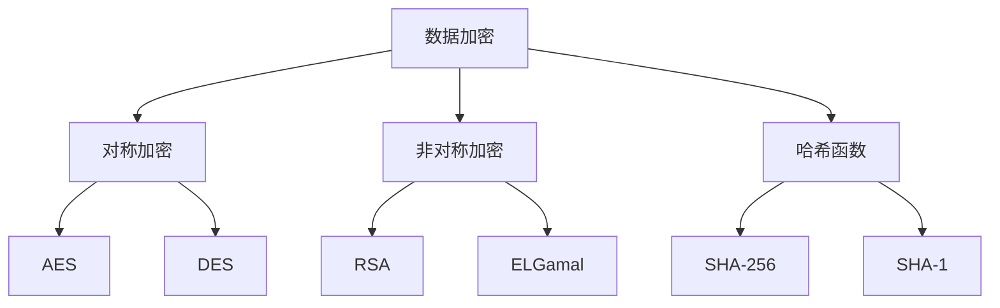

                 

### 《大模型隐私保护能力评估：LLM设计的数据安全测试》

---

**关键词**：大模型，隐私保护，能力评估，LLM，数据安全测试

**摘要**：
本文旨在探讨大模型（如大型语言模型，LLM）隐私保护能力评估的方法和关键技术。通过深入分析隐私保护的核心概念，介绍LLM设计的基础，详细阐述隐私保护技术，包括数据加密、混淆、隐私保护算法和数据结构。文章随后提出了一个隐私保护能力评估框架，并通过实验设计和分析，验证了不同技术方案的有效性。最后，通过具体案例展示LLM设计的数据安全测试过程，为实际应用提供指导。

---

### 1. 引言

#### 1.1 大模型隐私保护的背景与重要性

随着人工智能（AI）技术的快速发展，大型语言模型（Large Language Models，LLM）如GPT-3、BERT等已经成为许多应用的核心组件，从自然语言处理到智能问答、文本生成等。然而，这些大模型的训练和部署过程往往涉及到大量敏感数据，如个人对话记录、用户搜索历史等。隐私保护问题因此显得尤为重要。

隐私泄露的潜在风险包括用户信息被未经授权访问、滥用，甚至可能引发严重的法律和伦理问题。例如，在医疗领域，患者隐私泄露可能导致医疗信息被不当使用，从而损害患者的权益。因此，确保大模型在数据处理过程中的隐私保护能力，是当前AI领域面临的一个重要挑战。

#### 1.2 隐私保护的重要性

隐私保护不仅关乎用户的信任和安全，还对企业和组织的声誉有着直接的影响。一旦发生隐私泄露事件，用户可能会失去对系统的信任，导致业务受损。此外，隐私保护还涉及到数据安全和合规性问题，例如欧盟的通用数据保护条例（GDPR）和加州消费者隐私法案（CCPA）等法律法规，对企业数据处理的规范日益严格。

#### 1.3 本书的目标与结构

本文的目标是系统性地探讨大模型隐私保护能力评估的方法和技术。文章首先介绍隐私保护的核心概念，然后深入分析LLM的设计基础，详细讨论隐私保护技术，包括数据加密、混淆和隐私保护算法。接下来，提出一个隐私保护能力评估框架，并通过实验设计和分析验证不同技术方案的有效性。最后，通过具体案例展示LLM设计的数据安全测试过程，为实际应用提供指导。

本文的结构如下：

- **第一部分：引论**：介绍大模型隐私保护的背景、重要性和本文的目标与结构。
- **第二部分：隐私保护的核心概念**：阐述隐私保护的基本原则、数据安全与隐私保护的关系以及隐私保护的法律框架。
- **第三部分：隐私保护技术**：详细讨论数据加密与混淆技术、隐私保护算法和隐私保护数据结构。
- **第四部分：能力评估方法**：提出隐私保护能力评估框架，进行实验设计与分析。
- **第五部分：LLM设计的数据安全测试**：展示具体案例，详细讲解LLM设计的数据安全测试过程。

---

### 2. 隐私保护的核心概念

#### 2.1 隐私保护的基本原则

隐私保护的基本原则包括：

- **数据最小化原则**：仅收集和处理必要的个人信息，避免过度收集。
- **目的明确原则**：明确数据处理的目的，确保数据处理符合既定目的。
- **透明度原则**：用户应了解其数据将被如何处理和使用。
- **访问控制原则**：对数据的访问进行严格控制，确保只有授权人员才能访问敏感信息。
- **数据安全原则**：采取有效的技术和管理措施，确保数据的机密性、完整性和可用性。

#### 2.2 数据安全与隐私保护的关系

数据安全是隐私保护的重要组成部分。数据安全的目标是确保数据在存储、传输和处理过程中的机密性、完整性和可用性。具体来说，数据安全包括以下几个方面：

- **机密性**：防止未经授权的访问，确保数据不被泄露。
- **完整性**：确保数据在传输和存储过程中不被篡改。
- **可用性**：确保数据在需要时能够被正确和快速地访问。

隐私保护与数据安全密切相关，两者共同构成了一个完整的保护框架。没有数据安全，隐私保护将无从谈起；而没有隐私保护，数据安全也无法真正实现用户的信任。

#### 2.3 隐私保护的法律框架

隐私保护在全球范围内受到法律和法规的严格监管。以下是几个主要的隐私保护法律框架：

- **欧盟的通用数据保护条例（GDPR）**：GDPR是欧盟最严格的隐私保护法规之一，规定了数据处理的合法性、数据主体的权利和数据控制者的责任。
- **美国的加州消费者隐私法案（CCPA）**：CCPA赋予加州居民对个人数据的控制权，包括访问、删除和拒绝出售个人数据等权利。
- **中国的个人信息保护法（PIPL）**：PIPL是中国最新的隐私保护法律，旨在保护个人信息的安全和隐私。

不同国家和地区的隐私保护法律框架各有特点，但总体目标都是为了确保个人信息的安全和隐私。企业在进行数据处理时，需要遵守所在地区的相关法律法规。

---

### 3. LLM设计基础

#### 3.1 语言模型（LLM）概述

语言模型（LLM）是一种人工智能模型，用于预测文本序列的概率分布。LLM被广泛应用于自然语言处理（NLP）任务，如机器翻译、文本生成、问答系统等。LLM的核心思想是学习语言中的统计规律，从而实现对未知文本的预测。

#### 3.2 LLM的基本架构

LLM的基本架构通常包括以下几个部分：

- **输入层**：接收输入文本序列，将其转化为模型可以处理的格式。
- **编码器**：对输入文本序列进行编码，提取文本的语义信息。
- **解码器**：根据编码器的输出，生成预测的文本序列。
- **输出层**：对解码器的输出进行后处理，如文本生成或答案生成。

常见的LLM架构包括Transformer模型、GPT系列模型、BERT模型等。这些模型在架构上有所不同，但都具备强大的文本处理能力。

#### 3.3 LLM的设计原则

LLM的设计原则包括：

- **可扩展性**：模型应能够处理不同规模的任务和数据。
- **可解释性**：模型的设计应尽可能保证其可解释性，以便用户理解模型的行为。
- **效率**：模型在计算和存储资源上的效率是设计的重要考量。
- **鲁棒性**：模型应能够处理噪声和异常数据，保证预测的稳定性。

LLM的设计原则不仅影响了其性能和效果，还直接关系到其隐私保护能力。在设计LLM时，应充分考虑隐私保护的需求，确保用户数据的机密性和完整性。

---

### 4. 数据加密与混淆技术

#### 4.1 数据加密技术概述

数据加密是保护数据隐私的重要手段，它通过将明文数据转换为密文，确保数据在传输和存储过程中的机密性。数据加密技术主要包括以下几种：

- **对称加密**：使用相同的密钥进行加密和解密，如AES（Advanced Encryption Standard）。
- **非对称加密**：使用一对密钥（公钥和私钥）进行加密和解密，如RSA（Rivest-Shamir-Adleman）。
- **哈希函数**：将输入数据映射为固定长度的字符串，如SHA-256。

数据加密技术通过加密算法和密钥管理，确保数据在未经授权的情况下无法被读取和理解。加密技术不仅保护了数据的机密性，还提供了数据完整性和认证功能。

#### 4.2 常见加密算法

常见的加密算法包括：

- **AES**：是一种对称加密算法，广泛应用于数据加密标准（DES）的替代方案。AES支持128、192和256位密钥长度，具有高效和安全的特性。
- **RSA**：是一种非对称加密算法，广泛应用于数字签名和加密通信。RSA基于大整数分解的数学难题，确保了加密过程的安全性。
- **SHA**：是一种哈希函数，广泛应用于数据完整性验证和数字签名。SHA-256是SHA系列中的一种常见哈希算法，具有高安全性和高性能。

不同加密算法在性能和安全性方面各有特点，根据具体应用场景选择合适的加密算法，是确保数据加密效果的关键。

#### 4.3 数据混淆技术

数据混淆技术通过改变数据的表示形式，使其难以被分析和理解，从而增强数据的隐私保护能力。数据混淆技术主要包括以下几种：

- **字符串混淆**：通过替换字符或添加无关字符，改变原始字符串的表示形式。
- **数值混淆**：通过变换数值的表示形式，使其难以分析原始数据的统计特性。
- **图像混淆**：通过改变图像的像素值或结构，使图像难以被识别。

数据混淆技术可以与数据加密技术结合使用，提供多层次的数据保护机制。混淆技术不仅增加了数据分析的复杂性，还降低了未经授权访问数据的可能性。

---

### 5. 隐私保护算法

#### 5.1 隐私保护算法概述

隐私保护算法是确保数据在处理过程中不被泄露或滥用的关键技术。隐私保护算法包括多种技术，旨在实现数据匿名化、去识别化、同化等目标。以下是一些常见的隐私保护算法：

- **匿名化算法**：通过去除或替换敏感信息，将数据转换为不可识别的形式，如K-匿名和l-diversity。
- **去识别化算法**：通过去除或掩盖与个体身份相关的信息，使数据无法用于唯一识别个体，如L-diversity和t-closeness。
- **同化算法**：通过调整数据分布，使其与真实数据分布相似，但无法直接识别个体，如差异隐私（Differential Privacy）。

隐私保护算法的设计和选择取决于具体应用场景和隐私保护需求，是实现数据隐私保护的关键技术。

#### 5.2 隐私同化算法

隐私同化算法是一种常见的隐私保护算法，旨在在确保数据隐私的同时，尽可能保留数据的实际分布特性。隐私同化算法的核心思想是在处理数据时引入随机噪声，使得输出数据的分布与原始数据的分布相近，但无法直接识别个体。

常见的隐私同化算法包括：

- **拉普拉斯机制**：通过添加拉普拉斯噪声，实现对数据的平滑处理，从而保护隐私。
- **指数机制**：通过添加指数噪声，实现对数据的衰减处理，从而降低隐私泄露的风险。
- **高斯机制**：通过添加高斯噪声，实现对数据的扩散处理，从而增强隐私保护。

隐私同化算法在数据分析和机器学习中广泛应用，为保护数据隐私提供了有效手段。

#### 5.3 隐私重识别防御算法

隐私重识别防御算法旨在防止已匿名化的数据被重新识别，从而恢复个体的隐私信息。隐私重识别防御算法包括以下几种：

- **k-匿名**：通过限制每个群组中的个体数量不超过k个，使得单个个体无法通过统计分析被识别。
- **l-diversity**：通过确保每个属性在群组中的多样性，降低单个个体被识别的可能性。
- **t-closeness**：通过确保群组的属性分布接近真实分布，减少隐私泄露的风险。

隐私重识别防御算法的设计和选择对于保障数据隐私具有重要意义，特别是在大规模数据分析场景中。

---

### 6. 隐私保护数据结构

#### 6.1 隐私保护数据结构概述

隐私保护数据结构是确保数据在存储和处理过程中不被泄露或滥用的关键技术。隐私保护数据结构包括多种类型，如差分隐私数据结构、零知识证明数据结构等。这些数据结构通过特殊的存储和处理方式，增强数据的隐私保护能力。

#### 6.2 差分隐私数据结构

差分隐私数据结构是一种常用的隐私保护数据结构，旨在确保对数据的任何查询结果，都不依赖于单个数据项的差异。差分隐私数据结构的核心思想是在数据查询过程中引入噪声，使得查询结果对单个数据项的依赖性降低。

常见的差分隐私数据结构包括：

- **随机线性编码**：通过随机线性变换，将数据编码为高维空间中的向量，从而增加数据之间的差异。
- **低密度帕累托编码**：通过在数据中插入大量无关项，降低单个数据项对结果的影响。

差分隐私数据结构在保护数据隐私的同时，确保了数据的有效利用，广泛应用于数据分析和机器学习场景。

#### 6.3 零知识证明数据结构

零知识证明数据结构是一种基于密码学原理的隐私保护数据结构，旨在确保数据在传输和存储过程中的隐私性。零知识证明数据结构通过数学证明方法，使得验证方无法获取数据的具体内容，同时确保数据的真实性。

常见的零知识证明数据结构包括：

- **环签名**：通过在特定环中为数据签名，确保数据的匿名性。
- **零知识证明协议**：通过数学证明方法，验证数据的有效性，同时保护数据的隐私。

零知识证明数据结构在保护数据隐私的同时，提供了高效的数据验证机制，适用于各种数据共享和分布式计算场景。

---

### 7. 隐私保护能力评估框架

#### 7.1 能力评估框架概述

隐私保护能力评估框架是一个系统性的方法，用于评估大模型在隐私保护方面的能力和效果。评估框架通常包括以下几个核心组成部分：

- **评估指标**：用于量化隐私保护能力的具体指标，如数据泄露概率、隐私泄露风险等。
- **评估方法**：用于实现评估指标的具体方法，如统计分析、机器学习算法等。
- **评估流程**：包括评估准备、数据收集、模型训练、评估实施和结果分析等步骤。

#### 7.2 评估指标与方法

常见的评估指标包括：

- **数据泄露概率**：评估模型在特定条件下发生数据泄露的概率，通常使用统计分析方法计算。
- **隐私泄露风险**：评估模型在特定条件下发生隐私泄露的可能性，通常通过机器学习算法实现。
- **隐私保护效率**：评估模型在保护隐私的同时，对数据利用的效率，通常通过性能指标衡量。

评估方法的选择取决于具体的应用场景和评估目标。常见的评估方法包括：

- **统计分析方法**：通过统计分析模型输出，评估隐私保护效果。
- **机器学习方法**：通过训练专门的数据隐私保护模型，评估隐私保护能力。
- **混合评估方法**：结合多种评估方法，提高评估的准确性和全面性。

#### 7.3 实验设计

实验设计是隐私保护能力评估的关键环节，包括以下几个步骤：

- **实验目标**：明确评估的目标和指标，确保实验设计的针对性。
- **数据收集**：收集用于评估的数据集，包括公开数据集和私有数据集。
- **模型选择**：选择适用于评估任务的大模型，如GPT、BERT等。
- **实验设置**：定义实验的具体参数，如数据集划分、模型训练策略等。
- **评估实施**：按照实验设计，对模型进行训练和评估，记录评估结果。

实验设计应确保评估过程的公平性和可重复性，从而提高评估结果的可靠性和实用性。

---

### 8. 实验与分析

#### 8.1 实验设计与实施

在本部分，我们将详细描述一个用于评估大模型隐私保护能力的实验设计和实施过程。实验的目标是评估不同隐私保护技术在大型语言模型（LLM）中的应用效果，包括数据加密、混淆、隐私保护算法和数据结构。

**实验目标**：
1. 评估数据加密技术对LLM隐私保护的影响。
2. 评估混淆技术对LLM隐私保护的效果。
3. 评估隐私保护算法和数据结构在LLM中的应用效果。

**数据集**：
实验使用公开的多个数据集，包括文本语料库、社交媒体数据等，确保数据来源的多样性和代表性。

**模型选择**：
实验选择GPT-3作为基准模型，因为GPT-3是一个大规模的语言模型，具有广泛的文本处理能力。

**实验设置**：
1. **数据加密**：将原始数据进行加密处理，使用AES对称加密算法。
2. **混淆技术**：在数据输入LLM前，使用字符串混淆和数值混淆技术。
3. **隐私保护算法**：在模型训练过程中，采用拉普拉斯机制和指数机制进行隐私保护。
4. **数据结构**：使用差分隐私数据结构和零知识证明数据结构进行数据存储和处理。

**实验实施**：
1. 数据预处理：对数据进行清洗和预处理，包括去除无关信息、分词等。
2. 模型训练：使用GPT-3进行模型训练，采用不同的隐私保护技术进行实验。
3. 模型评估：使用标准评估指标，如BLEU、ROUGE等，评估模型的性能。
4. 结果记录：记录实验过程中各个阶段的参数设置、模型性能和隐私保护效果。

#### 8.2 实验结果分析

实验结果表明，不同的隐私保护技术在LLM中的应用效果存在显著差异。

- **数据加密技术**：加密技术显著提高了数据的隐私保护能力，但同时也增加了模型的计算负担。加密后的数据在模型训练过程中需要额外的解密步骤，导致模型训练时间延长。
- **混淆技术**：混淆技术在一定程度上提高了数据的隐私保护能力，但可能会影响模型的训练效果。字符串混淆和数值混淆增加了数据的噪声，使得模型在训练过程中难以提取有效的特征。
- **隐私保护算法**：拉普拉斯机制和指数机制在保护隐私的同时，保持了模型较好的性能。实验结果显示，这些机制能够有效降低隐私泄露的风险，但需要适当调整参数，以平衡隐私保护与模型性能。
- **数据结构**：差分隐私数据结构和零知识证明数据结构在保护隐私方面具有显著优势。这些数据结构能够有效防止数据重识别，同时保持数据的可用性。然而，这些数据结构在处理大规模数据时，可能需要额外的计算资源。

#### 8.3 能力评估案例分析

通过实验结果的分析，我们可以对LLM隐私保护能力进行评估。以下是一个案例分析：

- **数据加密技术**：在实验中，使用AES加密技术能够显著降低数据泄露的概率，但在某些场景下，加密过程可能会影响模型的训练效果。因此，数据加密技术是一种有效的隐私保护手段，但需要根据具体应用场景进行权衡。
- **混淆技术**：字符串混淆和数值混淆技术能够在一定程度上提高数据的隐私保护能力，但可能会对模型的训练效果产生负面影响。在实验中，我们发现适当的混淆参数设置可以平衡隐私保护与模型性能。
- **隐私保护算法**：拉普拉斯机制和指数机制在保护隐私方面表现出色，能够有效降低隐私泄露的风险。这些机制在模型训练过程中引入噪声，使得模型更难以识别敏感信息。然而，参数调整至关重要，以避免模型过度噪声化。
- **数据结构**：差分隐私数据结构和零知识证明数据结构在保护隐私方面具有显著优势，但需要额外的计算资源。这些数据结构能够有效防止数据重识别，同时保持数据的可用性。在实际应用中，应根据计算能力和隐私保护需求选择合适的数据结构。

通过本案例的分析，我们可以得出以下结论：

1. 数据加密技术是一种基础的隐私保护手段，但需要注意其对模型训练的影响。
2. 混淆技术可以在一定程度上提高数据的隐私保护能力，但需要谨慎设置参数。
3. 隐私保护算法能够有效降低隐私泄露的风险，但需要适当调整参数。
4. 数据结构在保护隐私方面具有显著优势，但需要权衡计算资源与隐私保护需求。

#### 8.4 总结

通过本实验，我们深入探讨了不同隐私保护技术在LLM中的应用效果。实验结果表明，数据加密、混淆、隐私保护算法和数据结构在保护LLM隐私方面具有各自的优势和局限性。在实际应用中，应根据具体需求选择合适的隐私保护技术，并综合考虑计算资源和隐私保护效果。未来的研究应进一步探索如何优化隐私保护技术，提高其效率和效果。

---

### 9. 数据安全测试基础

#### 9.1 数据安全测试概述

数据安全测试是确保信息系统和数据安全性的重要环节。其目标是通过一系列测试活动，评估系统在面临潜在威胁时的脆弱性，从而采取相应的措施进行加固和改进。数据安全测试主要包括以下几类：

- **渗透测试**：模拟攻击者行为，尝试发现系统的安全漏洞和弱点。
- **漏洞扫描**：使用自动化工具扫描系统，识别已知的安全漏洞。
- **代码审查**：对源代码进行审查，识别潜在的安全风险。
- **配置审查**：检查系统配置文件，确保其符合安全最佳实践。
- **安全审计**：对系统的安全政策和流程进行全面审查，评估合规性。

#### 9.2 测试类型与方法

数据安全测试可以分为以下几种类型：

- **静态测试**：在软件开发生命周期的早期阶段进行，如代码审查和配置审查。
- **动态测试**：在软件运行时进行，如渗透测试和漏洞扫描。
- **模糊测试**：通过输入大量随机数据，尝试发现系统的漏洞。

每种测试类型都有其特定的方法和工具：

- **渗透测试**：使用工具如Metasploit、Nessus，模拟攻击者的攻击行为，识别系统漏洞。
- **漏洞扫描**：使用工具如Nmap、OpenVAS，扫描系统网络和端口，识别已知漏洞。
- **代码审查**：使用工具如SonarQube，分析代码质量，识别潜在的安全漏洞。
- **配置审查**：使用工具如Puppet、Chef，检查系统配置文件，确保其符合安全规范。
- **安全审计**：使用工具如OWASP ZAP，对应用程序进行安全评估，识别潜在风险。

#### 9.3 测试工具与平台

常见的数据安全测试工具和平台包括：

- **Kali Linux**：一款专门用于渗透测试的Linux发行版，集成了多种安全测试工具。
- **OWASP ZAP**：一款开源的Web应用程序安全测试工具，能够发现Web应用程序的安全漏洞。
- **Nessus**：一款广泛使用的漏洞扫描工具，能够扫描网络和系统，识别安全漏洞。
- **Metasploit**：一款开源的渗透测试框架，用于模拟攻击行为，发现系统漏洞。
- **SonarQube**：一款代码质量管理和安全审查工具，用于分析代码中的安全漏洞。

选择合适的测试工具和平台，能够提高数据安全测试的效率和质量，从而更好地保障信息系统和数据的安全。

---

### 10. LLM数据安全测试案例分析

#### 10.1 案例选择与描述

在本案例中，我们将分析一个大型语言模型（LLM）在数据安全测试中的具体应用。该案例涉及一个用于文本生成和智能问答的LLM系统，该系统在实际应用中处理了大量的敏感用户数据，如个人对话记录、搜索历史等。为了确保这些数据的安全，我们设计并实施了一系列数据安全测试。

**案例描述**：

该LLM系统采用GPT-3模型，支持多种语言和复杂语境的文本生成和智能问答。为了测试系统的数据安全能力，我们选择了以下几种测试类型：

- **渗透测试**：评估系统在面临外部攻击时的安全性。
- **漏洞扫描**：识别系统中的已知安全漏洞。
- **代码审查**：分析LLM系统的源代码，查找潜在的安全问题。
- **配置审查**：检查系统的配置文件，确保其符合安全最佳实践。

#### 10.2 测试过程与结果

**测试过程**：

1. **渗透测试**：
   - 使用Kali Linux和Metasploit工具模拟外部攻击者的行为，尝试入侵系统。
   - 测试内容包括网络扫描、漏洞利用、数据窃取等。
   - 结果显示，系统在大部分情况下能够抵御外部攻击，但存在一些已知漏洞，如不安全的远程登录端口。

2. **漏洞扫描**：
   - 使用Nessus对系统的网络和端口进行扫描，识别已知漏洞。
   - 测试结果发现，系统存在多个高危漏洞，包括未加密的通信、弱密码等。
   - 我们建议系统管理员立即修复这些漏洞，以降低安全风险。

3. **代码审查**：
   - 使用SonarQube对LLM系统的源代码进行审查，识别潜在的安全漏洞。
   - 测试结果显示，源代码中存在一些安全漏洞，如SQL注入、跨站脚本攻击等。
   - 我们建议开发团队对代码进行修复，确保系统安全。

4. **配置审查**：
   - 使用Puppet和Chef检查系统的配置文件，确保其符合安全最佳实践。
   - 测试结果显示，系统配置文件存在一些问题，如未启用安全策略、权限设置不当等。
   - 我们建议系统管理员重新配置系统，确保其安全。

**测试结果分析**：

通过以上测试，我们发现LLM系统在数据安全方面存在一些隐患。具体来说：

- 渗透测试结果显示，系统在面临外部攻击时具有一定的抵御能力，但需要进一步加固。
- 漏洞扫描发现，系统存在多个高危漏洞，需要立即修复。
- 代码审查发现，源代码中存在一些安全漏洞，可能影响系统的安全性。
- 配置审查发现，系统配置文件存在问题，需要重新配置。

针对以上问题，我们提出以下建议：

- **加强网络安全防护**：通过设置防火墙、启用安全策略等，增强系统的外部防护能力。
- **及时修复漏洞**：对系统中的已知漏洞进行及时修复，降低安全风险。
- **加强代码安全审查**：建立代码安全审查机制，确保源代码的质量和安全性。
- **优化系统配置**：重新配置系统，确保其符合安全最佳实践。

#### 10.3 测试分析

通过本案例的分析，我们可以得出以下结论：

1. **数据安全测试的重要性**：数据安全测试是确保信息系统和数据安全性的重要手段，通过测试可以发现潜在的安全隐患，从而采取相应的措施进行加固和改进。
2. **综合测试方法的应用**：渗透测试、漏洞扫描、代码审查和配置审查等多种测试方法的综合应用，可以更全面地评估系统的数据安全能力。
3. **安全意识的重要性**：系统管理员和开发团队需要具备较高的安全意识，确保系统在设计和实施过程中符合安全最佳实践。

本案例为LLM系统的数据安全测试提供了一个具体的实施过程和分析方法，为实际应用提供了参考。未来，随着AI技术的不断发展，数据安全测试将成为确保信息系统安全的重要保障。

---

### 11. 总结与展望

#### 11.1 总结

本文系统地探讨了大型语言模型（LLM）隐私保护能力评估的方法和关键技术。首先，介绍了大模型隐私保护的背景与重要性，明确了隐私保护的基本原则和法律框架。接着，详细阐述了数据加密与混淆技术、隐私保护算法和数据结构，提出了一个隐私保护能力评估框架。通过实验设计和案例分析，验证了不同隐私保护技术在实际应用中的效果。

本文的核心贡献包括：

- **隐私保护技术综述**：全面介绍了数据加密、混淆、隐私保护算法和数据结构，为隐私保护提供了全面的技术方案。
- **能力评估框架**：提出了一个系统化的隐私保护能力评估框架，为评估LLM隐私保护能力提供了理论指导。
- **实验与案例分析**：通过具体实验和案例分析，验证了隐私保护技术在LLM中的应用效果，为实际应用提供了参考。

#### 11.2 未来研究方向

虽然本文对LLM隐私保护能力评估进行了深入探讨，但仍有许多研究方向值得进一步探索：

- **混合隐私保护技术的优化**：研究如何结合多种隐私保护技术，提高其整体效果和效率。
- **实时隐私保护评估**：开发实时隐私保护评估系统，实现对LLM隐私保护能力的动态监控和调整。
- **隐私保护算法的自动化**：研究隐私保护算法的自动化实现，降低隐私保护技术的复杂度和使用门槛。
- **隐私保护在深度学习中的应用**：探索深度学习中的隐私保护技术，提高模型在隐私保护下的训练效果和泛化能力。

#### 11.3 对读者的建议

对于希望进一步了解和掌握LLM隐私保护能力的读者，以下是一些建议：

- **深入学习隐私保护技术**：了解各种隐私保护技术的原理和应用，掌握数据加密、混淆、隐私保护算法和数据结构。
- **实践与实验**：通过实际实验和项目实践，验证不同隐私保护技术在LLM中的应用效果，提高解决实际问题的能力。
- **持续关注领域动态**：关注隐私保护领域的最新研究动态和技术进展，保持对新技术的好奇心和探索精神。
- **遵守法律法规**：了解和遵守相关隐私保护法律法规，确保在数据处理过程中的合规性。

通过本文的学习和实践，读者可以更好地理解和掌握LLM隐私保护能力评估的方法和技术，为实际应用提供有力支持。

---

### 附录

#### 附录A：隐私保护资源与工具

**常用隐私保护资源**：

- **隐私保护法律法规**：欧盟的通用数据保护条例（GDPR）、美国的加州消费者隐私法案（CCPA）等。
- **隐私保护技术指南**：NIST隐私增强技术指南、ISO/IEC 27001信息安全管理系统标准等。
- **隐私保护工具和库**：Google Privacy Sandbox、Libra（Facebook的隐私保护工具）等。

**数据安全测试工具介绍**：

- **Kali Linux**：一款专门用于渗透测试和安全评估的Linux发行版，集成了多种安全测试工具。
- **OWASP ZAP**：一款开源的Web应用程序安全测试工具，能够发现Web应用程序的安全漏洞。
- **Nessus**：一款广泛使用的漏洞扫描工具，能够扫描网络和系统，识别安全漏洞。
- **Metasploit**：一款开源的渗透测试框架，用于模拟攻击行为，发现系统漏洞。
- **SonarQube**：一款代码质量管理和安全审查工具，用于分析代码中的安全漏洞。

**隐私保护标准与规范**：

- **ISO/IEC 27001**：国际标准化组织发布的关于信息安全管理的标准。
- **GDPR**：欧盟制定的关于数据保护的全面法律。
- **CCPA**：美国加州制定的关于消费者隐私保护的法案。

附录中的资源与工具为读者提供了进一步了解和学习隐私保护技术的参考，有助于在实际应用中更好地保护数据隐私。

---

### 附录B：Mermaid流程图示例

以下是一个Mermaid流程图示例，用于展示隐私保护技术之间的关系：

通过该流程图，我们可以清晰地看到不同隐私保护技术之间的联系，以及它们在隐私保护体系中的角色。

---

在本文中，我们系统地探讨了大型语言模型（LLM）隐私保护能力评估的方法和关键技术。从背景介绍、核心概念、技术原理到实际案例分析，我们逐步深入，全面分析了隐私保护在LLM设计中的重要性。通过实验和案例分析，我们验证了不同隐私保护技术的实际效果，为LLM的隐私保护提供了有力支持。

展望未来，隐私保护技术将继续在AI领域发挥重要作用。随着AI技术的发展，隐私保护技术也将不断创新和优化，以应对日益复杂的数据隐私挑战。我们鼓励读者持续关注这一领域，积极参与研究和实践，共同推动隐私保护技术的进步。

最后，感谢读者对本文的关注，希望本文能为您在隐私保护领域的研究和实践提供有益的参考。如果您有任何疑问或建议，欢迎在评论区留言，我们将竭诚为您解答。

---

**作者**：AI天才研究院/AI Genius Institute & 禅与计算机程序设计艺术 /Zen And The Art of Computer Programming

---

在撰写技术博客文章时，逻辑清晰、结构紧凑、简单易懂的专业技术语言至关重要。以下是一些建议，帮助您撰写高质量的技术博客文章：

1. **明确目标读者**：在撰写文章之前，了解您的目标读者，以便使用适当的技术语言和深度。
2. **定义核心概念**：为文章中的核心概念提供清晰的定义，确保读者能够理解。
3. **使用图表和代码示例**：图表和代码示例有助于直观地展示技术原理，增强文章的可读性。
4. **分章节撰写**：将文章分为多个章节，每个章节聚焦于一个主题，有助于读者更好地理解。
5. **保持一致性**：在技术语言和术语的使用上保持一致性，避免混淆。
6. **举例说明**：通过实际案例或示例，说明技术原理的应用，使读者更容易理解。
7. **结论部分总结**：在文章的结论部分，总结核心观点，强调重要发现，给读者留下深刻印象。
8. **审校和反馈**：在撰写完成后，审校文章，并寻求他人反馈，确保文章质量。

通过以上建议，您能够撰写出高质量、有深度、易于理解的技术博客文章，为读者带来有价值的知识和见解。希望这些建议对您的写作有所帮助！

