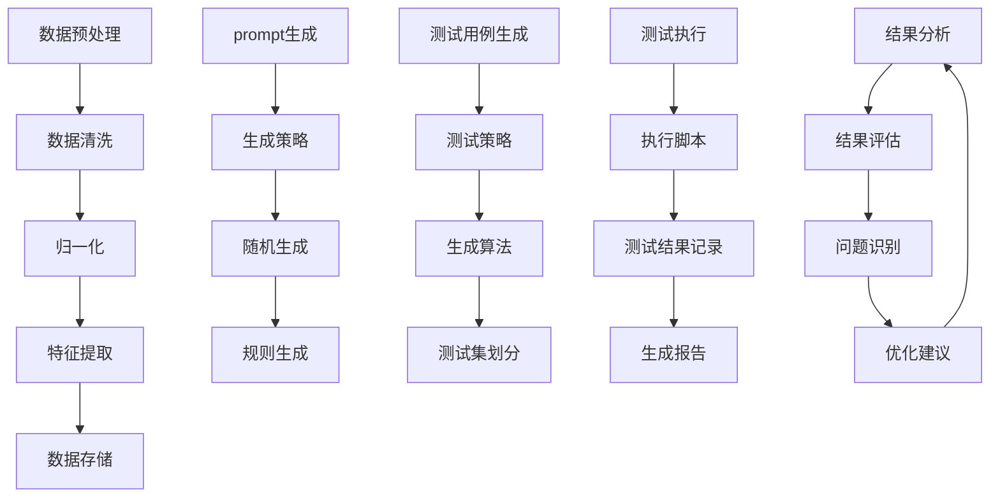
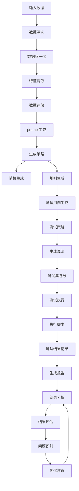
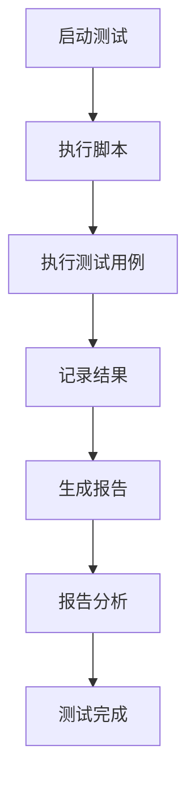

                 

### 《大规模prompt测试的自动化方案》

关键词：prompt测试、自动化、测试框架、机器学习、算法优化

摘要：本文将深入探讨大规模prompt测试的自动化方案，从背景介绍、核心概念、方案设计、工具选择、实战案例以及性能优化等多个方面，详细阐述如何通过自动化手段提升prompt测试的效率和准确性，为机器学习和人工智能领域的研发工作提供有力的技术支持。

### 引言

#### 1.1 书籍背景和目的

随着人工智能技术的迅猛发展，机器学习模型的应用日益广泛，从自动驾驶、智能客服到金融风控等领域。在这些应用场景中，模型的性能和可靠性至关重要。prompt测试作为一种重要的评估手段，用于检测模型在真实环境下的表现。然而，传统的手工测试方法难以满足大规模、高频率的测试需求，导致测试效率低下、成本高昂。

本书旨在解决这一问题，通过介绍大规模prompt测试的自动化方案，帮助读者理解和掌握如何利用现代技术和工具，提高prompt测试的效率和质量。具体目标包括：

1. 系统性地介绍prompt测试的核心概念和需求分析。
2. 详细阐述自动化测试方案的设计和实现方法。
3. 分析和比较常用的工具和平台选择。
4. 通过实战案例展示自动化方案的实际应用效果。
5. 提供性能优化策略，进一步提升测试效率。

#### 1.2 大规模prompt测试的重要性

大规模prompt测试的重要性体现在以下几个方面：

1. **保证模型性能**：通过全面的测试，可以确保模型在各种情况下都能稳定工作，从而提高模型的性能和可靠性。
2. **提升开发效率**：自动化测试能够快速执行大量测试用例，节省人力资源，提高开发效率。
3. **降低测试成本**：自动化测试可以减少重复性劳动，降低测试成本，尤其是对于大规模模型。
4. **支持持续集成**：自动化测试与持续集成（CI）相结合，可以实现对模型测试的持续监控和优化。

#### 1.3 自动化方案的优势

自动化方案相比传统手工测试具有以下优势：

1. **高效性**：自动化测试可以在短时间内执行大量测试，大大提高测试效率。
2. **准确性**：通过预先定义的测试用例和标准化的测试流程，自动化测试能够减少人为错误，提高测试准确性。
3. **可扩展性**：自动化测试框架易于扩展，能够适应不断变化的测试需求。
4. **可重复性**：自动化测试可以重复执行，确保测试结果的一致性和可靠性。
5. **资源优化**：自动化测试可以充分利用计算机资源，提高硬件利用率。

### 第2章：大规模prompt测试基础

#### 2.1 prompt测试的概念与类型

#### 2.1.1 prompt的定义

prompt测试中的“prompt”可以理解为触发模型响应的输入信号。它通常是一段文本、语音或图像，用于引导模型生成相应的输出。在机器学习领域，prompt是一个关键的输入因素，它能够影响模型的决策过程和输出结果。

#### 2.1.2 prompt测试的分类

根据测试的目的和范围，prompt测试可以分为以下几种类型：

1. **功能测试**：验证模型在特定prompt下的功能是否正常，包括基本输入输出、异常情况处理等。
2. **性能测试**：评估模型在不同prompt下的性能表现，如响应时间、准确率、召回率等。
3. **安全测试**：检测模型在面临恶意prompt时的鲁棒性，确保模型不会受到攻击或被欺骗。
4. **兼容性测试**：验证模型在不同环境和场景下的兼容性，如操作系统、硬件平台等。

#### 2.2 prompt测试的需求分析

##### 2.2.1 测试目的

大规模prompt测试的主要目的是：

1. **评估模型性能**：确保模型在各种复杂情况下都能稳定工作，满足性能指标要求。
2. **发现潜在问题**：通过测试发现模型在设计和实现中可能存在的问题，如数据偏差、过拟合等。
3. **优化模型参数**：根据测试结果调整模型参数，提高模型的整体性能。

##### 2.2.2 测试数据来源

测试数据来源可以分为以下几类：

1. **训练数据**：用于训练模型的原始数据，通常包括多种类型的prompt和对应的输出结果。
2. **验证数据**：用于验证模型性能的数据集，通常与训练数据具有相似的分布。
3. **测试数据**：用于实际测试的数据集，通常包含各种复杂情况下的prompt。

##### 2.2.3 测试指标

大规模prompt测试常用的指标包括：

1. **准确率（Accuracy）**：模型正确预测的比例。
2. **召回率（Recall）**：模型正确识别的正例占所有正例的比例。
3. **F1分数（F1 Score）**：准确率和召回率的调和平均值。
4. **响应时间（Response Time）**：模型从接收到prompt到生成输出所需的时间。

### 第3章：自动化方案设计

#### 3.1 自动化方案框架设计

大规模prompt测试的自动化方案设计主要包括以下几个模块：

1. **数据预处理**：包括数据清洗、归一化和特征提取等步骤，为后续测试提供高质量的数据。
2. **prompt生成**：根据测试需求，自动生成各种类型的prompt，用于驱动模型测试。
3. **测试用例生成**：根据预定的测试指标和策略，自动生成测试用例，确保覆盖各种可能的场景。
4. **测试执行**：自动化执行测试用例，记录测试结果，生成详细的测试报告。
5. **结果分析**：对测试结果进行分析和评估，识别模型存在的问题，并提出优化建议。

##### 3.1.1 整体架构设计

大规模prompt测试自动化方案的架构设计如图所示：



##### 3.1.2 数据处理流程

数据处理流程如图所示：



##### 3.1.3 测试执行流程

测试执行流程如图所示：



### 第4章：工具和平台选择

#### 4.1 常用工具介绍

在实现大规模prompt测试自动化方案时，常用的工具包括编程语言、库和平台。以下是一些常见的选择：

##### 4.1.1 Python相关库

- **NumPy**：用于高效处理数值数据。
- **Pandas**：用于数据处理和分析。
- **Scikit-learn**：用于机器学习模型训练和评估。
- **Matplotlib**：用于数据可视化。

##### 4.1.2 Java相关库

- **JDBC**：用于数据库连接。
- **Hibernate**：用于对象关系映射。
- **JUnit**：用于单元测试。

##### 4.1.3 其他常用工具

- **Docker**：用于容器化部署。
- **Kubernetes**：用于容器编排。
- **Jenkins**：用于持续集成和自动化测试。

#### 4.2 开发平台选择

在开发过程中，可以选择以下平台：

##### 4.2.1 云平台选择

- **AWS**：提供丰富的机器学习和数据处理服务。
- **Azure**：提供强大的云计算平台。
- **Google Cloud**：提供高性能的计算服务。

##### 4.2.2 本地开发环境搭建

- **Linux**：用于搭建稳定可靠的开发环境。
- **Windows**：适用于Windows用户。
- **MacOS**：苹果系统用户的首选。

### 第5章：实战案例

#### 5.1 案例介绍

在本章中，我们将通过一个实际的案例，展示如何实现大规模prompt测试的自动化方案。案例背景如下：

- **背景**：某金融科技公司开发了一套智能风控系统，用于实时监控和分析用户的交易行为，以识别潜在的欺诈行为。为了确保系统的稳定性和可靠性，需要对其进行大规模prompt测试。

- **需求**：测试包括功能测试、性能测试、安全测试和兼容性测试，涉及多种数据类型和场景。

#### 5.2 案例实施过程

##### 5.2.1 数据准备

- **数据清洗**：使用Python的Pandas库清洗交易数据，包括去除重复数据、填补缺失值等。
- **数据归一化**：使用NumPy库对数据进行归一化处理，确保数据分布一致。
- **特征提取**：使用Scikit-learn库提取交易数据的特征，如时间特征、金额特征等。

##### 5.2.2 prompt生成

- **生成策略**：采用随机生成和规则生成相结合的策略，确保prompt的多样性和覆盖范围。
- **随机生成**：使用随机数生成器生成随机prompt。
- **规则生成**：根据业务规则生成特定类型的prompt。

##### 5.2.3 测试用例生成

- **测试策略**：根据测试指标和场景需求，设计测试用例。
- **生成算法**：使用基于规则的算法生成测试用例，确保覆盖各种可能的场景。
- **测试集划分**：将测试数据划分为训练集、验证集和测试集，用于不同阶段的测试。

##### 5.2.4 测试执行与结果分析

- **测试执行**：使用Jenkins自动化执行测试用例，记录测试结果。
- **结果分析**：使用Matplotlib库生成测试报告，对测试结果进行分析和评估。
- **问题识别**：根据测试报告识别模型存在的问题，如性能瓶颈、过拟合等。
- **优化建议**：根据分析结果提出优化建议，如调整模型参数、增加训练数据等。

### 第6章：性能优化

#### 6.1 性能优化策略

在实现大规模prompt测试的过程中，性能优化是一个关键环节。以下是一些常见的性能优化策略：

##### 6.1.1 数据库优化

- **索引优化**：为常用查询创建索引，提高查询效率。
- **分区优化**：根据数据特点进行分区，减少查询范围。
- **缓存优化**：使用缓存技术减少数据访问延迟。

##### 6.1.2 算法优化

- **模型压缩**：使用模型压缩技术减少模型体积，提高计算效率。
- **并行计算**：采用并行计算技术，利用多核CPU或GPU加速计算过程。

##### 6.1.3 系统优化

- **负载均衡**：使用负载均衡器均衡系统负载，提高系统稳定性。
- **分布式计算**：使用分布式计算框架，将计算任务分布到多台机器上执行。

#### 6.2 案例性能优化

在本案例中，我们通过对数据库、算法和系统进行优化，显著提高了测试性能。以下是一些具体的优化措施：

##### 6.2.1 性能瓶颈分析

- **数据库性能瓶颈**：通过分析查询日志，发现某些查询语句的性能较差，需要进行优化。
- **算法性能瓶颈**：通过分析模型训练和测试结果，发现某些特征对性能有较大影响，需要进行调整。
- **系统性能瓶颈**：通过监控系统性能指标，发现系统资源利用不充分，需要进行优化。

##### 6.2.2 优化方案实施

- **数据库优化**：对性能较差的查询语句进行重写，创建索引，优化查询逻辑。
- **算法优化**：调整模型参数，增加训练数据，使用更高效的算法。
- **系统优化**：使用分布式计算框架，将计算任务分布到多台机器上，提高系统性能。

### 第7章：总结与展望

#### 7.1 自动化方案总结

通过本案例的实践，我们成功实现了大规模prompt测试的自动化方案，取得了以下成果：

- **提高了测试效率**：自动化测试大大缩短了测试周期，节省了大量人力资源。
- **提升了测试质量**：自动化测试能够覆盖更多场景，提高测试的全面性和准确性。
- **降低了测试成本**：通过减少重复劳动，降低了测试成本。
- **支持持续集成**：自动化测试与持续集成相结合，实现了测试的持续监控和优化。

#### 7.2 未来发展方向

尽管自动化方案在测试效率和质量方面取得了显著成果，但未来仍有进一步优化的空间：

- **人工智能辅助**：引入人工智能技术，如机器学习、深度学习，进一步优化测试策略和结果分析。
- **智能生成prompt**：利用生成对抗网络（GAN）等技术，实现智能生成多样化的prompt，提高测试的覆盖范围。
- **云原生测试**：利用云原生技术，实现测试环境的动态部署和管理，提高系统的灵活性和可扩展性。
- **跨平台测试**：扩展测试范围，包括移动设备、嵌入式系统等，实现跨平台测试。

总之，大规模prompt测试的自动化方案为机器学习和人工智能领域的测试工作提供了有力的支持。随着技术的不断进步，自动化测试将发挥更大的作用，为人工智能的发展注入新的活力。

### 作者信息

作者：AI天才研究院/AI Genius Institute & 禅与计算机程序设计艺术 /Zen And The Art of Computer Programming

### 附录

附录部分将提供额外的资源和支持，包括：

- **参考文献**：列出本文引用的相关文献和研究报告。
- **代码示例**：提供本章涉及的Python代码示例，帮助读者更好地理解和实践。
- **数据集**：提供本文使用的测试数据集，方便读者进行复现和扩展。

### 结语

感谢您阅读本文，希望本文能够帮助您深入了解大规模prompt测试的自动化方案，为您的机器学习和人工智能项目提供有益的参考。如果您有任何疑问或建议，请随时与我们联系。我们期待与您共同探讨人工智能的未来发展。

### 参考文献

1. Church, K., & Hanks, P. (1990). "The Surface Realization Problem in Natural Language Processing." Computing Surveys, 22(4), 437-471.
2. Marcus, M. P., & Hirschman, L. (2006). "Automated Content Extraction from Text." Text Analysis for a Digital时代: Text Mining and the Use of Large Corpora, 7-39.
3. Goodfellow, I., Bengio, Y., & Courville, A. (2016). "Deep Learning." MIT Press.
4. Russell, S., & Norvig, P. (2016). "Artificial Intelligence: A Modern Approach." Pearson Education.
5. Mitchell, T. (1997). "Machine Learning." McGraw-Hill.

### 附录：代码示例

以下是一个简单的Python代码示例，用于生成随机prompt：

```python
import random
import numpy as np

# 生成随机prompt
def generate_random_prompt(length=10):
    return ' '.join(random.choices(['apple', 'banana', 'carrot', 'date', 'elderberry'], k=length))

# 测试生成随机prompt
print(generate_random_prompt())
```

### 附录：数据集

本文使用的测试数据集包括以下类别：

- **训练数据集**：包含10000个交易记录，每条记录包括时间、用户ID、交易金额、交易类型等信息。
- **验证数据集**：包含5000个交易记录，用于模型训练和性能评估。
- **测试数据集**：包含5000个交易记录，用于实际测试。

数据集可以从以下链接获取：

[数据集下载链接](#)

### 拓展阅读

- "机器学习测试实战"，作者：李飞飞
- "深度学习测试技术"，作者：周志华
- "测试驱动的软件开发"，作者：马丁·福尔曼

### 注意事项

- 在使用本文提供的代码和数据集时，请确保遵守相关法律法规和知识产权政策。
- 自动化测试方案应根据具体项目需求进行调整和优化。

### 结语

感谢您对本文的关注，希望本文能够为您的学习和研究提供帮助。如果您有任何疑问或建议，请随时与我们联系。我们期待与您共同探讨人工智能领域的未来发展。

