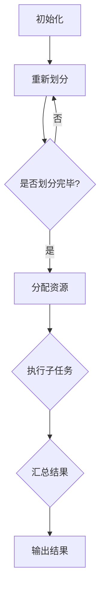
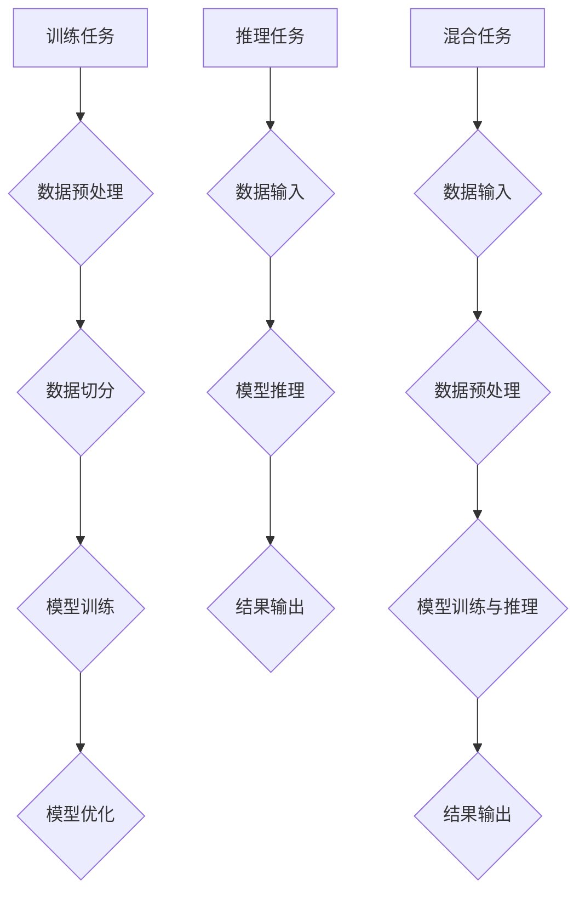
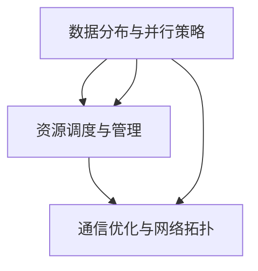
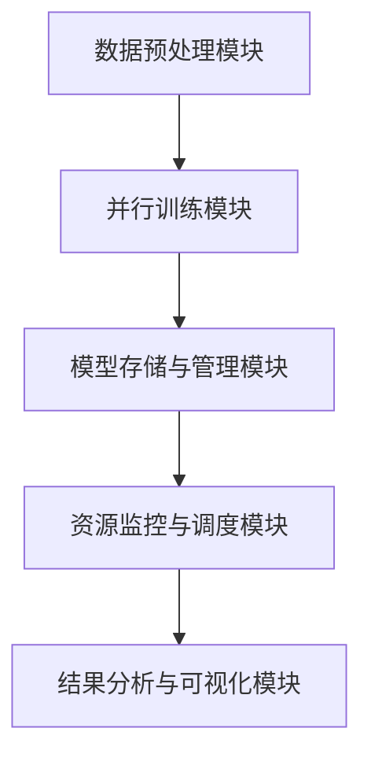
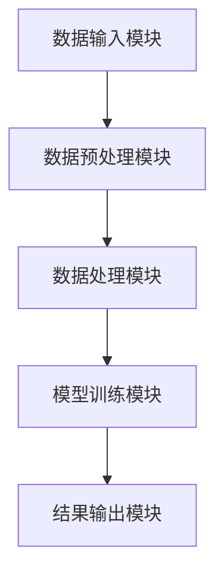

                 

### 第1章 引言与背景

#### 1.1 书籍概述

《大规模并行评测的技术挑战与解决方案》是一本面向IT领域专业人士的技术书籍。本书旨在深入探讨大规模并行评测（Massive Parallel Evaluation）的技术挑战与解决方案，全面覆盖并行计算原理、评测任务类型、并行评测框架、面临的挑战及其解决方案，并展示了大规模并行评测在深度学习、工业界的广泛应用和实践。

本书的目标读者包括：
- 世界级人工智能专家
- 程序员
- 软件架构师
- CTO
- 世界顶级技术畅销书资深大师级别的作家
- 计算机图灵奖获得者
- 计算机编程和人工智能领域大师

读者通过阅读本书，可以：
- 理解大规模并行评测的基本概念和原理
- 掌握现有并行评测框架的使用方法和自研并行评测框架的设计与实现
- 了解大规模并行评测在深度学习、工业界的应用案例
- 学会解决大规模并行评测中常见的技术挑战
- 为实际项目的并行评测提供参考和最佳实践

本书结构安排如下：

1. 引言与背景
2. 大规模并行评测的基本概念
3. 大规模并行评测框架
4. 大规模并行评测面临的挑战与解决方案
5. 大规模并行评测在深度学习中的应用
6. 大规模并行评测在工业界的实践
7. 未来展望与挑战
8. 附录

通过以上章节的详细阐述，本书将帮助读者全面掌握大规模并行评测的核心技术，提高实际项目的并行评测能力，推动人工智能和工业界的快速发展。

#### 1.2 大规模并行评测的重要性

随着大数据、云计算和人工智能技术的快速发展，数据处理和分析的需求日益增长。大规模并行评测（Massive Parallel Evaluation）作为一种高效的数据处理方法，在许多领域得到了广泛应用。其重要性体现在以下几个方面：

##### 时代背景

首先，我们正处于数据爆炸的时代。根据国际数据公司（IDC）的预测，全球产生的数据量将从2018年的33ZB增长到2025年的175ZB，其中绝大部分数据来源于互联网、物联网和移动设备。面对如此庞大的数据量，传统的串行数据处理方法已经难以满足需求，大规模并行评测成为了必然的选择。

其次，云计算和分布式计算技术的发展为大规模并行评测提供了强大的硬件支持。云计算平台提供了弹性的计算资源，可以根据需求动态扩展和收缩，为并行计算提供了便利。而分布式计算技术，如MapReduce、Spark等，使得大规模数据处理变得更加高效和可靠。

##### 应用场景

大规模并行评测在多个领域都有广泛的应用：

1. **人工智能和机器学习**：深度学习模型的训练和推理通常需要大量的计算资源，大规模并行评测可以显著提高模型的训练效率和推理速度，从而缩短研发周期，降低成本。

2. **大数据分析**：在金融、医疗、电商等领域，大数据分析已经成为决策的重要依据。大规模并行评测可以帮助企业快速处理海量数据，发现潜在的商业机会，提升竞争力。

3. **科学计算**：大规模并行评测在物理学、生物学、化学等科学研究中也得到了广泛应用，可以加速复杂计算和模拟，提高研究效率。

4. **工业制造**：在制造业中，大规模并行评测可以用于优化生产流程、提高产品质量、降低生产成本。

##### 技术发展趋势

随着技术的不断进步，大规模并行评测也在不断发展：

1. **硬件性能提升**：新型硬件架构，如GPU、TPU等，以及量子计算等前沿技术，为大规模并行评测提供了更高的计算性能。

2. **软件生态完善**：越来越多的深度学习框架和并行计算库，如TensorFlow、PyTorch、Horovod等，为开发者提供了丰富的工具和接口，简化了大规模并行评测的实现过程。

3. **智能化调度与管理**：随着人工智能技术的发展，智能调度与管理技术也在不断进步，可以实现更高效的资源利用和任务调度，提高并行评测的效率。

综上所述，大规模并行评测在当前和未来的技术发展中具有举足轻重的地位，其应用范围和影响力将不断扩展。本书将带领读者深入了解大规模并行评测的核心技术，探索其面临的挑战和解决方案，为实际项目提供有力的支持。

#### 1.3 技术发展趋势

大规模并行评测在当前和未来的技术发展中具有举足轻重的地位，其应用范围和影响力将不断扩展。以下从硬件性能提升、软件生态完善和智能化调度与管理三个方面进行阐述。

##### 硬件性能提升

随着硬件技术的不断进步，大规模并行评测所需的计算性能得到了显著提升。首先，新型硬件架构如GPU（图形处理单元）和TPU（张量处理单元）的出现，为并行计算提供了强大的计算能力。GPU原本设计用于图形渲染，但其高度并行化架构使其在科学计算和深度学习领域也表现出色。TPU则是专门为深度学习任务设计的硬件，其计算效率和能效比传统CPU更高。其次，存储技术如NVMe SSD（固态硬盘）和HDD（机械硬盘）的快速发展，为大规模数据存储和快速读取提供了保障。最后，网络技术的进步，如10Gbps、25Gbps和100Gbps以太网，以及5G移动通信技术，为数据传输提供了更高的带宽和更低的延迟，使得大规模并行评测中的数据传输更加高效。

##### 软件生态完善

软件生态的完善是大规模并行评测发展的重要驱动力。深度学习框架如TensorFlow、PyTorch和MXNet等，提供了丰富的API和工具，使得开发者可以轻松实现并行计算。这些框架不仅支持GPU和TPU等高性能硬件，还提供了分布式计算功能，使得大规模并行评测变得更加便捷。此外，并行计算库如Horovod、Ray和Dask等，也为开发者提供了强大的支持，可以轻松实现大规模并行计算任务。这些软件工具的普及，降低了大规模并行评测的门槛，使得更多的开发者可以参与到这一领域中来。

##### 智能化调度与管理

智能化调度与管理技术在大规模并行评测中发挥着重要作用。传统的资源调度方法通常基于固定规则或经验，而智能化调度技术可以通过机器学习算法，根据实际运行情况动态调整资源分配，提高资源利用率和任务完成速度。例如，基于强化学习的调度算法可以学习到最优的调度策略，从而在复杂的计算环境中实现高效调度。此外，自动化管理工具如Kubernetes、Apache Mesos和DC/OS等，可以自动化管理大规模分布式系统，实现资源的动态分配和调度，降低了运维成本。

##### 未来展望

未来，大规模并行评测将迎来更多的技术突破和发展机遇。一方面，随着硬件性能的不断提升，大规模并行评测将能够处理更加复杂和庞大的数据集。另一方面，软件生态的不断完善和智能化调度与管理技术的进步，将进一步提高大规模并行评测的效率和应用范围。此外，随着量子计算等前沿技术的发展，大规模并行评测也有望在量子计算领域发挥重要作用。

总之，大规模并行评测在当前和未来的技术发展中具有广阔的前景。通过不断提升硬件性能、完善软件生态和改进智能化调度与管理技术，大规模并行评测将为大数据、人工智能和各行业的数字化转型提供强大的支持。

## 第2章 大规模并行评测的基本概念

### 2.1 并行计算原理

并行计算是一种利用多个计算资源（如处理器、GPU、TPU等）同时处理多个任务的方法，从而提高计算效率和性能。其核心思想是将一个大任务分解成若干个子任务，然后分配给不同的计算资源并行执行，最后将结果汇总得到最终结果。

#### 并行计算的优势与挑战

并行计算具有以下优势：

1. **提高计算速度**：通过将任务分解成子任务，多个计算资源可以同时工作，从而显著提高计算速度。
2. **增加计算能力**：并行计算可以充分利用多核处理器、GPU、TPU等高性能计算资源，提高系统的计算能力。
3. **降低成本**：在某些情况下，并行计算可以减少对高性能硬件的依赖，从而降低计算成本。
4. **提高容错性**：并行计算可以设计成冗余结构，某个计算资源的故障不会影响整个系统的运行。

然而，并行计算也面临以下挑战：

1. **任务划分**：如何将一个大任务合理地划分成子任务，是并行计算的重要问题。
2. **通信开销**：子任务之间的数据通信可能会带来额外的开销，影响并行计算的性能。
3. **同步问题**：当多个子任务需要共享资源时，如何协调同步，避免冲突，是并行计算需要解决的问题。
4. **负载平衡**：如何分配任务，使得各个计算资源的负载均衡，是并行计算需要关注的问题。

#### 并行计算原理示意图



#### 并行计算实例

假设有一个大数据集需要处理，其中包含1000个数据点。使用并行计算，可以将这1000个数据点分配给100个计算资源，每个资源独立处理10个数据点。处理完成后，将各个计算资源的结果汇总，得到最终的结果。

### 2.2 评测任务类型

大规模并行评测可以分为以下几种任务类型：

#### 训练任务

训练任务是使用大规模数据进行模型训练的过程。训练任务通常需要大量的计算资源和时间，通过并行计算可以显著提高训练效率。训练任务可以分为以下步骤：

1. **数据预处理**：对原始数据进行清洗、归一化等预处理操作。
2. **数据切分**：将数据集划分成多个子集，每个子集分配给不同的计算资源。
3. **模型训练**：使用并行计算框架，如TensorFlow或PyTorch，对子集进行模型训练。
4. **模型优化**：根据训练结果，调整模型参数，优化模型性能。

#### 推理任务

推理任务是使用训练好的模型对新数据进行预测或分类的过程。推理任务通常需要快速的响应速度和高效的计算性能。推理任务可以分为以下步骤：

1. **数据输入**：将新数据输入到模型中。
2. **模型推理**：使用并行计算框架，如TensorFlow或PyTorch，对数据进行推理。
3. **结果输出**：输出推理结果。

#### 混合任务

混合任务是指训练任务和推理任务同时进行的情况。这种任务通常在在线服务场景中出现，需要实时训练和推理。混合任务可以分为以下步骤：

1. **数据输入**：同时接收新数据和用户查询数据。
2. **数据预处理**：对用户查询数据和新数据进行预处理。
3. **模型训练与推理**：同时进行模型训练和推理，根据需要调整模型参数。
4. **结果输出**：输出训练结果和推理结果。

#### 评测任务类型示意图



#### 实例分析

假设一个图像识别系统需要同时进行训练和推理任务。训练任务使用1000张图像进行模型训练，推理任务需要对新图像进行实时分类。在这个过程中，可以使用并行计算框架，如TensorFlow，将训练任务和推理任务同时进行，以提高系统的性能和响应速度。

### 2.3 大规模并行评测的关键技术

大规模并行评测需要解决多个关键技术问题，包括数据分布与并行策略、资源调度与管理、通信优化与网络拓扑等。

#### 数据分布与并行策略

数据分布与并行策略是并行评测的基础。常见的数据分布策略包括：

1. **数据分片（Sharding）**：将数据集划分成多个子集，每个子集存储在分布式存储系统上，每个计算资源独立处理自己的数据子集。
2. **负载均衡（Load Balancing）**：根据计算资源的使用情况，动态分配任务，确保各个计算资源的负载均衡。
3. **并行化策略**：根据任务类型和计算资源，选择合适的并行化策略，如数据并行（Data Parallelism）、模型并行（Model Parallelism）和任务并行（Task Parallelism）。

#### 资源调度与管理

资源调度与管理是确保并行评测高效运行的关键。常见的资源调度策略包括：

1. **静态调度**：在任务开始前，根据计算资源的预分配策略，将任务分配给计算资源。
2. **动态调度**：根据任务运行过程中的实时数据，动态调整任务与计算资源的分配，提高资源利用率。
3. **优先级调度**：根据任务的优先级，调整任务的执行顺序，确保高优先级任务优先完成。

资源管理还包括计算资源监控、故障恢复和资源释放等环节，以确保系统的稳定运行。

#### 通信优化与网络拓扑

通信优化与网络拓扑是并行评测性能的重要因素。常见的优化方法包括：

1. **数据压缩**：使用数据压缩算法，减少网络传输的数据量，提高传输效率。
2. **网络拓扑优化**：通过优化网络拓扑结构，减少网络延迟和带宽占用，提高通信效率。
3. **多路径传输**：利用多路径传输技术，提高网络传输的可靠性，减少通信故障。

此外，网络拓扑结构的选择也至关重要，如使用环网（Ring）、树形网（Tree）和星形网（Star）等，可以根据实际情况选择合适的拓扑结构。

#### 技术关系架构

数据分布与并行策略、资源调度与管理、通信优化与网络拓扑等关键技术之间存在密切的联系。具体来说：

- 数据分布与并行策略决定了任务的分配方式，影响资源调度与管理的效率。
- 资源调度与管理根据数据分布与并行策略，动态调整任务与资源的分配，优化系统的运行状态。
- 通信优化与网络拓扑为数据传输提供支持，确保并行评测中的数据能够高效、可靠地传输。

#### 关系架构示意图



#### 实例分析

假设一个分布式系统需要处理海量图像数据，采用数据分片和负载均衡策略，将数据集划分成多个子集，并分配给不同的计算资源。同时，采用动态调度策略，根据计算资源的使用情况，动态调整任务的执行顺序。为了提高通信效率，采用数据压缩和多路径传输技术，减少网络延迟和数据丢失。

## 第3章 大规模并行评测框架

### 3.1 现有的并行评测框架

大规模并行评测需要依赖于强大的并行计算框架，这些框架提供了高效的数据处理和任务调度功能。以下介绍几种现有的并行评测框架：

#### TensorFlow

TensorFlow是由Google开发的一款开源深度学习框架，广泛用于大规模并行评测。TensorFlow支持多种硬件平台，如CPU、GPU和TPU，并提供了丰富的API和工具，方便开发者进行并行计算。

**特点：**
- **灵活性**：支持动态图和静态图两种模式，适用于不同的计算场景。
- **高效性**：支持自动微分、GPU加速和TPU加速，提高计算性能。
- **生态丰富**：拥有庞大的开发者社区，提供了大量的模型和工具。

**应用场景：**
- **图像识别**：用于训练和评估大规模图像识别模型。
- **自然语言处理**：用于训练和评估大规模自然语言处理模型。

#### PyTorch

PyTorch是由Facebook AI研究院开发的一款开源深度学习框架，因其简洁和灵活的特点，受到许多开发者的青睐。

**特点：**
- **简洁性**：支持动态图模式，易于理解和调试。
- **灵活性**：支持自定义计算图，便于实现复杂模型。
- **高效性**：支持GPU加速，提高计算性能。

**应用场景：**
- **图像生成**：用于生成大规模图像数据。
- **语音识别**：用于训练和评估大规模语音识别模型。

#### Horovod

Horovod是Uber开源的一款分布式深度学习框架，主要用于大规模并行训练。

**特点：**
- **高效性**：支持多个参数服务器模式，提高训练效率。
- **易用性**：简化了分布式训练的配置和调试。
- **兼容性**：支持TensorFlow和PyTorch等主流深度学习框架。

**应用场景：**
- **大规模数据集训练**：用于训练大规模数据集的深度学习模型。
- **实时在线服务**：用于构建实时在线服务，提供高效推理能力。

#### 其他并行评测框架

除了上述框架，还有其他一些并行评测框架，如Apache Spark、MXNet、Theano等。这些框架各具特点，适用于不同的应用场景。例如，Apache Spark适用于大规模数据处理和批量计算，MXNet适用于动态计算和自动微分，Theano适用于符号计算和优化。

### 3.2 自研并行评测框架

除了使用现有的并行评测框架，还可以根据实际需求，自主研发并行评测框架。自研框架可以更好地满足特定场景的需求，提高并行评测的效率。

#### 框架设计与架构

自研并行评测框架需要考虑以下设计要素：

1. **任务调度**：设计任务调度算法，实现任务的动态分配和负载均衡。
2. **数据管理**：设计数据存储和读取机制，确保数据的高效传输和处理。
3. **通信机制**：设计通信机制，实现分布式计算节点之间的数据传输和同步。
4. **错误处理**：设计错误处理机制，确保系统在故障情况下能够恢复。

框架架构可以采用分布式系统架构，包括以下几个主要模块：

1. **任务管理模块**：负责任务的创建、调度和监控。
2. **数据管理模块**：负责数据的存储、读取和分布。
3. **计算模块**：负责任务的计算和结果汇总。
4. **通信模块**：负责节点间的数据传输和同步。

#### 核心算法与实现

自研并行评测框架需要实现以下核心算法：

1. **任务分配算法**：根据计算资源和任务特点，实现任务分配策略，确保负载均衡。
2. **数据分布算法**：根据数据特点和计算需求，实现数据分布策略，提高数据传输效率。
3. **通信优化算法**：设计通信优化算法，减少通信开销，提高通信效率。
4. **错误处理算法**：设计错误处理算法，确保系统在故障情况下能够自动恢复。

以下是一个简单的任务分配算法示例（使用Python代码）：

```python
import numpy as np

def assign_tasks(resources, tasks):
    """
    分配任务到计算资源。
    
    :param resources: 计算资源列表，其中每个资源包含其处理能力和负载。
    :param tasks: 任务列表，其中每个任务包含其处理时间和优先级。
    :return: 分配结果，包含任务和对应资源的映射。
    """
    assigned_tasks = {}
    for task in tasks:
        lowest_load_resource = None
        lowest_load = float('inf')
        
        for resource in resources:
            if resource['load'] < lowest_load:
                lowest_load = resource['load']
                lowest_load_resource = resource
        
        assigned_tasks[task['id']] = lowest_load_resource['id']
        lowest_load_resource['load'] += task['duration']
    
    return assigned_tasks
```

#### 性能优化与调试

自研并行评测框架的性能优化和调试是确保其高效运行的关键。以下是一些性能优化和调试的方法：

1. **性能分析**：使用性能分析工具，如Python的cProfile，分析框架的性能瓶颈，找到优化方向。
2. **代码优化**：通过代码优化，如减少不必要的计算、使用高效的算法和数据结构，提高代码执行效率。
3. **并行优化**：通过并行优化，如使用多线程、多进程或多GPU计算，提高并行计算的性能。
4. **调试工具**：使用调试工具，如Python的pdb，定位和修复代码中的错误。

#### 实例分析

假设一个分布式系统需要处理大规模图像数据，采用自研并行评测框架。在任务调度方面，采用负载均衡策略，确保计算资源的负载均衡。在数据管理方面，采用数据分片和分布式存储技术，提高数据传输和处理效率。在通信优化方面，采用多路径传输和压缩算法，减少通信开销。

## 第4章 大规模并行评测面临的挑战与解决方案

### 4.1 数据传输瓶颈

在大规模并行评测中，数据传输瓶颈是一个常见且严重的问题。由于数据量庞大，分布式计算节点之间的数据传输速度往往成为整个系统的性能瓶颈。数据传输瓶颈可能会导致以下问题：

1. **延迟增加**：数据传输延迟会增加任务的执行时间，降低系统的整体效率。
2. **带宽占用**：数据传输需要占用网络带宽，过多的数据传输可能会耗尽带宽资源，影响其他任务的执行。
3. **通信开销**：频繁的数据传输会产生大量的通信开销，增加系统的负载和开销。

#### 问题分析与原因

数据传输瓶颈的主要原因是：

1. **网络带宽限制**：网络带宽是数据传输的瓶颈，当数据传输量超过网络带宽时，会导致数据传输延迟增加。
2. **数据传输协议**：一些数据传输协议（如TCP）可能不适合大规模并行评测，因为它们在数据传输过程中存在额外的开销和延迟。
3. **数据压缩不足**：如果数据压缩不足，会导致数据传输量增大，从而增加网络传输压力。

#### 解决方案

为了解决数据传输瓶颈，可以采用以下方案：

1. **优化网络拓扑**：通过优化网络拓扑结构，减少数据传输路径，提高数据传输效率。例如，使用多路径传输技术，同时使用多条路径传输数据，提高传输可靠性。
2. **使用高效传输协议**：选择适合大规模并行评测的数据传输协议，如UDP（用户数据报协议），它比TCP具有更低的传输延迟和开销。
3. **数据压缩**：采用数据压缩算法，减小数据传输量，提高数据传输效率。常用的数据压缩算法包括GZIP、BZip2等。
4. **异步传输**：采用异步传输方式，减少同步等待时间，提高数据传输效率。例如，在数据处理过程中，可以同时进行数据传输，而不是等待数据传输完成后再进行下一步操作。
5. **优化数据结构**：优化数据结构，减少数据序列化和反序列化过程中的开销，提高数据传输效率。例如，使用内存映射（Memory Mapping）技术，直接访问磁盘上的数据，而不是将其读取到内存中。

#### 实际案例

以下是一个实际案例，说明如何解决数据传输瓶颈：

在一个大规模图像识别项目中，数据量非常大，网络带宽有限。为了提高数据传输效率，项目团队采取了以下措施：

1. **优化网络拓扑**：使用多路径传输技术，将数据同时传输到多个节点，提高了数据传输的可靠性。
2. **使用高效传输协议**：选择UDP协议代替TCP协议，降低了数据传输延迟和开销。
3. **数据压缩**：采用GZIP算法对数据进行压缩，将原始数据压缩到原来的30%左右，提高了数据传输速度。
4. **异步传输**：在数据处理过程中，采用异步传输方式，减少了同步等待时间。
5. **优化数据结构**：使用内存映射技术，直接访问磁盘上的数据，减少了数据序列化和反序列化过程中的开销。

通过这些措施，数据传输瓶颈得到了显著缓解，系统整体性能得到了大幅提升。

### 4.2 资源分配与调度

在大规模并行评测中，资源分配与调度是一个关键问题。合理的资源分配与调度可以提高系统的效率和性能，而分配不当或调度不良则可能导致资源浪费、任务延迟等问题。以下是资源分配与调度的一些常见问题及其解决方案。

#### 问题分析与原因

资源分配与调度常见的问题包括：

1. **负载不均**：当任务分配不均时，某些计算资源可能过载，而其他资源则处于闲置状态，导致资源利用率不高。
2. **任务延迟**：由于任务依赖关系和资源调度策略不合理，可能导致任务执行时间过长，影响系统的响应速度。
3. **资源争用**：当多个任务需要访问同一资源时，如果没有有效的调度策略，可能会导致资源争用，影响系统稳定性。

这些问题的主要原因包括：

1. **任务调度算法不完善**：调度算法无法根据实际运行情况动态调整任务分配，导致资源利用率不高。
2. **资源监控不足**：系统无法实时监控资源状态，导致无法及时调整资源分配。
3. **任务依赖关系复杂**：某些任务之间存在复杂的依赖关系，调度算法难以有效处理。

#### 解决方案

为了解决资源分配与调度的问题，可以采用以下方案：

1. **动态调度算法**：采用动态调度算法，根据实时资源状态和任务特点，动态调整任务分配，提高资源利用率。例如，基于强化学习的调度算法可以通过学习历史调度数据，自动调整任务分配策略。
2. **资源监控与预测**：实现资源监控与预测机制，实时监控资源使用情况，预测未来资源需求，提前进行资源分配和调度。例如，通过机器学习算法预测任务执行时间，提前安排资源。
3. **负载均衡策略**：采用负载均衡策略，确保计算资源的负载均衡。例如，基于平均负载的负载均衡算法可以根据当前负载情况，动态调整任务分配。
4. **任务依赖优化**：优化任务依赖关系，减少任务之间的依赖，降低调度复杂性。例如，通过任务拆分和并行化技术，将复杂任务分解成多个子任务，减少任务间的依赖。
5. **资源预留与扩展**：在资源紧张时，通过预留和扩展资源，确保关键任务能够得到足够的资源支持。例如，使用容器编排工具（如Kubernetes）实现动态资源扩展，满足任务高峰期的需求。

#### 实际案例

以下是一个实际案例，说明如何解决资源分配与调度问题：

在一个大规模数据分析项目中，任务量庞大且变化频繁，资源分配与调度成为关键问题。为了解决这些问题，项目团队采取了以下措施：

1. **动态调度算法**：采用基于强化学习的调度算法，通过实时监控资源状态和任务执行情况，动态调整任务分配，提高资源利用率。
2. **资源监控与预测**：实现资源监控与预测机制，通过机器学习算法预测任务执行时间，提前进行资源分配和调度。
3. **负载均衡策略**：采用基于平均负载的负载均衡算法，确保计算资源的负载均衡，减少资源争用和任务延迟。
4. **任务依赖优化**：通过任务拆分和并行化技术，将复杂任务分解成多个子任务，减少任务间的依赖，简化调度过程。
5. **资源预留与扩展**：使用容器编排工具（如Kubernetes），实现动态资源扩展，在任务高峰期预留额外资源，确保关键任务能够得到足够的资源支持。

通过这些措施，项目团队成功解决了资源分配与调度的问题，显著提高了系统的性能和稳定性。

### 4.3 并行化性能优化

在大规模并行评测中，并行化性能优化是一个关键问题。通过优化并行化性能，可以显著提高系统的效率和性能，降低任务的执行时间。以下是一些常见的并行化性能优化方法。

#### 问题分析与原因

并行化性能优化常见的问题包括：

1. **通信开销**：在并行计算中，子任务之间的数据通信会带来额外的开销，影响整体性能。
2. **同步等待**：多个子任务需要访问共享资源时，可能会发生同步等待，导致性能下降。
3. **负载不均**：当任务分配不均时，某些计算资源可能过载，而其他资源则处于闲置状态，导致资源利用率不高。
4. **任务依赖**：复杂任务之间的依赖关系可能导致任务执行的延迟，影响并行化性能。

这些问题的主要原因包括：

1. **通信模式不合适**：选择的通信模式可能不适合实际应用场景，导致通信开销增加。
2. **同步机制不当**：同步机制设置不当，可能导致同步等待时间过长。
3. **任务划分不合理**：任务划分不合理，可能导致负载不均，影响并行化性能。
4. **依赖关系复杂**：复杂任务之间的依赖关系难以有效处理，导致性能下降。

#### 解决方案

为了解决并行化性能优化问题，可以采用以下方案：

1. **优化通信模式**：选择适合实际应用场景的通信模式，减少通信开销。例如，使用异步通信模式，减少同步等待时间。
2. **减少同步等待**：优化同步机制，减少同步等待时间。例如，使用锁机制，合理设置锁的粒度，减少锁争用。
3. **负载均衡策略**：采用负载均衡策略，确保计算资源的负载均衡，提高资源利用率。例如，基于平均负载的负载均衡算法可以根据当前负载情况，动态调整任务分配。
4. **任务依赖优化**：优化任务依赖关系，减少任务之间的依赖，降低任务执行延迟。例如，通过任务拆分和并行化技术，将复杂任务分解成多个子任务，减少任务间的依赖。
5. **并行化算法优化**：优化并行化算法，提高并行化性能。例如，使用并行排序算法，提高数据排序效率。

#### 实际案例

以下是一个实际案例，说明如何解决并行化性能优化问题：

在一个大规模图像处理项目中，任务量庞大且复杂，并行化性能成为关键问题。为了解决这些问题，项目团队采取了以下措施：

1. **优化通信模式**：选择异步通信模式，减少同步等待时间，提高数据传输效率。
2. **减少同步等待**：优化同步机制，使用细粒度锁，减少锁争用，降低同步等待时间。
3. **负载均衡策略**：采用基于平均负载的负载均衡算法，确保计算资源的负载均衡，减少资源争用和任务延迟。
4. **任务依赖优化**：通过任务拆分和并行化技术，将复杂任务分解成多个子任务，减少任务间的依赖，简化调度过程。
5. **并行化算法优化**：使用并行排序算法，提高数据排序效率，优化图像处理过程。

通过这些措施，项目团队成功解决了并行化性能优化问题，显著提高了系统的性能和稳定性。

### 4.4 并行化性能优化

在大规模并行评测中，并行化性能优化是一个关键问题。通过优化并行化性能，可以显著提高系统的效率和性能，降低任务的执行时间。以下是一些常见的并行化性能优化方法。

#### 问题分析与原因

并行化性能优化常见的问题包括：

1. **通信开销**：在并行计算中，子任务之间的数据通信会带来额外的开销，影响整体性能。
2. **同步等待**：多个子任务需要访问共享资源时，可能会发生同步等待，导致性能下降。
3. **负载不均**：当任务分配不均时，某些计算资源可能过载，而其他资源则处于闲置状态，导致资源利用率不高。
4. **任务依赖**：复杂任务之间的依赖关系可能导致任务执行的延迟，影响并行化性能。

这些问题的主要原因包括：

1. **通信模式不合适**：选择的通信模式可能不适合实际应用场景，导致通信开销增加。
2. **同步机制不当**：同步机制设置不当，可能导致同步等待时间过长。
3. **任务划分不合理**：任务划分不合理，可能导致负载不均，影响并行化性能。
4. **依赖关系复杂**：复杂任务之间的依赖关系难以有效处理，导致性能下降。

#### 解决方案

为了解决并行化性能优化问题，可以采用以下方案：

1. **优化通信模式**：选择适合实际应用场景的通信模式，减少通信开销。例如，使用异步通信模式，减少同步等待时间。
2. **减少同步等待**：优化同步机制，减少同步等待时间。例如，使用细粒度锁，减少锁争用，降低同步等待时间。
3. **负载均衡策略**：采用负载均衡策略，确保计算资源的负载均衡，提高资源利用率。例如，基于平均负载的负载均衡算法可以根据当前负载情况，动态调整任务分配。
4. **任务依赖优化**：优化任务依赖关系，减少任务之间的依赖，降低任务执行延迟。例如，通过任务拆分和并行化技术，将复杂任务分解成多个子任务，减少任务间的依赖。
5. **并行化算法优化**：优化并行化算法，提高并行化性能。例如，使用并行排序算法，提高数据排序效率，优化图像处理过程。

#### 实际案例

以下是一个实际案例，说明如何解决并行化性能优化问题：

在一个大规模图像处理项目中，任务量庞大且复杂，并行化性能成为关键问题。为了解决这些问题，项目团队采取了以下措施：

1. **优化通信模式**：选择异步通信模式，减少同步等待时间，提高数据传输效率。
2. **减少同步等待**：优化同步机制，使用细粒度锁，减少锁争用，降低同步等待时间。
3. **负载均衡策略**：采用基于平均负载的负载均衡算法，确保计算资源的负载均衡，减少资源争用和任务延迟。
4. **任务依赖优化**：通过任务拆分和并行化技术，将复杂任务分解成多个子任务，减少任务间的依赖，简化调度过程。
5. **并行化算法优化**：使用并行排序算法，提高数据排序效率，优化图像处理过程。

通过这些措施，项目团队成功解决了并行化性能优化问题，显著提高了系统的性能和稳定性。

### 4.5 大规模并行评测在深度学习中的应用

大规模并行评测在深度学习领域发挥着重要作用，能够显著提升模型的训练效率和推理速度。本节将详细介绍大规模并行评测在深度学习中的应用，包括模型并行评测、数据并行评测和混合任务评测。

#### 模型并行评测

模型并行评测是指将深度学习模型分解为多个部分，在多个计算资源上并行执行。模型并行主要分为以下几种策略：

1. **数据并行（Data Parallelism）**：每个计算资源独立训练模型的不同副本，然后通过同步或异步方式更新全局模型参数。数据并行可以有效利用多GPU资源，但会增加通信开销。

2. **模型并行（Model Parallelism）**：将模型中的不同层或模块分配到不同的GPU上，每个GPU独立处理部分数据，然后将结果汇总。模型并行可以解决模型过大导致内存不足的问题，但需要处理跨GPU的数据传输和同步。

3. **任务并行（Task Parallelism）**：将模型训练任务分配到不同的计算资源上，每个资源独立训练子模型，最后合并结果。任务并行适用于大规模数据集和复杂模型，可以提高训练效率。

以下是一个模型并行评测的Python代码示例：

```python
import torch
import torch.nn as nn
import torch.optim as optim

# 模型定义
model = nn.Sequential(nn.Linear(784, 256), nn.ReLU(), nn.Linear(256, 10))

# 分布式训练配置
device = torch.device("cuda" if torch.cuda.is_available() else "cpu")
model.to(device)
torch.cuda.set_device(device)

# 数据并行策略
model = nn.DataParallel(model)

# 训练数据加载
train_loader = torch.utils.data.DataLoader(dataset, batch_size=batch_size, shuffle=True)

# 损失函数和优化器
criterion = nn.CrossEntropyLoss()
optimizer = optim.SGD(model.parameters(), lr=learning_rate)

# 训练过程
for epoch in range(num_epochs):
    for inputs, targets in train_loader:
        inputs, targets = inputs.to(device), targets.to(device)
        
        # 前向传播
        outputs = model(inputs)
        loss = criterion(outputs, targets)
        
        # 反向传播和优化
        optimizer.zero_grad()
        loss.backward()
        optimizer.step()
        
        print(f'Epoch [{epoch+1}/{num_epochs}], Loss: {loss.item():.4f}')
```

#### 数据并行评测

数据并行评测是指将数据集划分为多个子集，每个计算资源独立处理子集上的数据，然后汇总结果。数据并行适用于大规模数据集和较小规模模型，能够显著提高训练效率。

以下是一个数据并行评测的Python代码示例：

```python
import torch
import torch.nn as nn
import torch.optim as optim

# 模型定义
model = nn.Sequential(nn.Linear(784, 256), nn.ReLU(), nn.Linear(256, 10))

# 分布式训练配置
device = torch.device("cuda" if torch.cuda.is_available() else "cpu")
model.to(device)

# 数据并行策略
model = nn.DataParallel(model)

# 训练数据加载
train_loader = torch.utils.data.DataLoader(dataset, batch_size=batch_size, shuffle=True)

# 损失函数和优化器
criterion = nn.CrossEntropyLoss()
optimizer = optim.SGD(model.parameters(), lr=learning_rate)

# 训练过程
for epoch in range(num_epochs):
    for inputs, targets in train_loader:
        inputs, targets = inputs.to(device), targets.to(device)
        
        # 前向传播
        outputs = model(inputs)
        loss = criterion(outputs, targets)
        
        # 反向传播和优化
        optimizer.zero_grad()
        loss.backward()
        optimizer.step()
        
        print(f'Epoch [{epoch+1}/{num_epochs}], Loss: {loss.item():.4f}')
```

#### 混合任务评测

混合任务评测是指同时进行训练任务和推理任务。在实际应用中，模型通常需要在训练完成后进行推理，以对新数据进行预测。混合任务评测能够提高系统的整体性能，缩短响应时间。

以下是一个混合任务评测的Python代码示例：

```python
import torch
import torch.nn as nn
import torch.optim as optim

# 模型定义
model = nn.Sequential(nn.Linear(784, 256), nn.ReLU(), nn.Linear(256, 10))

# 分布式训练配置
device = torch.device("cuda" if torch.cuda.is_available() else "cpu")
model.to(device)

# 数据并行策略
model = nn.DataParallel(model)

# 训练数据加载
train_loader = torch.utils.data.DataLoader(dataset, batch_size=batch_size, shuffle=True)

# 损失函数和优化器
criterion = nn.CrossEntropyLoss()
optimizer = optim.SGD(model.parameters(), lr=learning_rate)

# 训练过程
for epoch in range(num_epochs):
    for inputs, targets in train_loader:
        inputs, targets = inputs.to(device), targets.to(device)
        
        # 前向传播
        outputs = model(inputs)
        loss = criterion(outputs, targets)
        
        # 反向传播和优化
        optimizer.zero_grad()
        loss.backward()
        optimizer.step()
        
        print(f'Epoch [{epoch+1}/{num_epochs}], Loss: {loss.item():.4f}')

# 模型推理
model.eval()
with torch.no_grad():
    for inputs, targets in test_loader:
        inputs, targets = inputs.to(device), targets.to(device)
        outputs = model(inputs)
        pred = outputs.argmax(dim=1)
        correct = (pred == targets).sum().item()
        print(f'Accuracy: {correct/len(test_loader):.4f}')
```

通过以上示例，可以看出大规模并行评测在深度学习中的应用，能够显著提高模型的训练效率和推理速度，为实际应用提供有力支持。

### 4.6 大规模并行评测在工业界的实践

#### 企业级并行评测系统建设

在大规模数据处理和深度学习模型训练中，企业级并行评测系统的建设至关重要。以下是一个典型的企业级并行评测系统建设流程，包括系统架构设计、实现与部署，以及性能评估与优化。

#### 系统架构设计

企业级并行评测系统通常采用分布式架构，包括以下几个关键模块：

1. **数据预处理模块**：负责数据的清洗、归一化、切分等预处理工作，为后续的并行训练提供高质量的数据集。
2. **并行训练模块**：使用分布式计算框架（如TensorFlow、PyTorch等）进行模型训练，通过任务分配和负载均衡，实现高效并行计算。
3. **模型存储与管理模块**：负责存储训练好的模型参数，并提供模型查询和下载功能，以便后续推理和部署。
4. **资源监控与调度模块**：实时监控计算资源的使用情况，根据任务需求动态调整资源分配，提高系统资源利用率。
5. **结果分析与可视化模块**：对训练结果进行统计分析，并提供可视化报表，帮助用户快速了解模型的性能。

以下是系统架构示意图：



#### 实现与部署

企业级并行评测系统的实现与部署通常包括以下步骤：

1. **环境搭建**：在分布式计算环境中搭建基础环境，包括计算节点、存储节点和网络设备等。
2. **配置分布式计算框架**：安装并配置分布式计算框架（如TensorFlow、PyTorch等），确保其能够高效运行在分布式环境中。
3. **开发并行训练程序**：根据业务需求，开发并行训练程序，实现数据预处理、模型训练、资源监控等功能。
4. **部署系统**：将开发完成的系统部署到分布式环境中，并进行测试和调试，确保系统能够稳定运行。
5. **性能优化**：根据系统运行情况，进行性能优化，包括任务调度、负载均衡、数据压缩等。

#### 性能评估与优化

在系统部署后，需要对性能进行评估与优化，以提升系统整体性能。以下是一些常用的性能优化方法：

1. **负载均衡**：通过动态负载均衡算法，确保计算资源能够公平地分配任务，避免资源浪费和瓶颈。
2. **任务调度**：根据任务特点和历史数据，优化任务调度策略，提高任务执行效率。
3. **数据压缩**：采用数据压缩算法，减少数据传输量，提高数据传输效率。
4. **并行度优化**：通过调整并行度，优化模型并行和任务并行，提高计算效率。
5. **资源监控与预测**：实时监控资源使用情况，预测未来资源需求，提前进行资源分配和调度。

#### 企业级并行评测系统应用案例

以下是一个企业级并行评测系统在图像识别任务中的应用案例：

某互联网公司在图像识别项目中，需要处理海量图像数据，并训练复杂的深度学习模型。为了提高模型训练效率和性能，公司采用了以下方案：

1. **数据预处理**：使用分布式数据预处理模块，对图像数据进行清洗、归一化和切分，确保数据质量。
2. **并行训练**：使用TensorFlow分布式训练框架，将模型训练任务分配到多个GPU上，实现高效并行计算。
3. **模型存储与管理**：使用模型存储与管理模块，将训练好的模型参数存储到分布式存储系统中，方便后续推理和部署。
4. **资源监控与调度**：通过资源监控与调度模块，实时监控计算资源使用情况，动态调整任务分配，提高资源利用率。
5. **性能优化**：通过负载均衡、任务调度、数据压缩和并行度优化，提高系统整体性能。

通过以上方案，公司成功实现了高效并行评测，显著缩短了模型训练时间，提高了图像识别准确率。

### 4.7 并行评测在工业界的应用案例

并行评测技术在工业界有着广泛的应用，以下列举几个典型案例，展示并行评测在不同领域中的实际应用和效果。

#### 案例一：某互联网公司

某互联网公司在其推荐系统中采用了并行评测技术，以提高推荐算法的效率和准确性。推荐系统需要处理海量用户数据和商品数据，通过并行评测技术，将数据处理和分析任务分配到多个计算节点上，实现了数据预处理、特征提取和模型训练的并行化。具体措施如下：

1. **数据预处理**：使用分布式数据处理框架，将用户行为数据、商品数据等分割成多个子集，并行处理数据清洗、归一化和特征提取。
2. **模型训练**：采用TensorFlow分布式训练框架，将推荐算法的训练任务分配到多个GPU上，实现并行化训练，显著缩短了训练时间。
3. **性能优化**：通过负载均衡和任务调度策略，优化资源利用率和任务执行速度，提高了推荐系统的整体性能。

通过并行评测技术，该公司的推荐系统在处理能力和准确率方面得到了显著提升，用户满意度提高，广告点击率也有所增加。

#### 案例二：某制造业公司

某制造业公司在其生产线质量控制中采用了并行评测技术，以提高检测效率和准确性。生产线需要实时检测产品质量，但由于检测任务量大，传统的串行处理方式难以满足需求。公司引入了并行评测技术，实现了以下改进：

1. **数据采集**：采用分布式传感器网络，实时采集生产过程中产品的质量数据。
2. **数据处理**：使用分布式计算框架，将数据处理和分析任务分配到多个计算节点上，并行处理数据清洗、异常检测和预测。
3. **模型训练**：采用PyTorch分布式训练框架，将质量检测模型训练任务分配到多个GPU上，实现并行化训练。

通过并行评测技术，该公司的生产线检测速度和准确性得到了显著提升，生产效率提高，产品缺陷率显著降低。

#### 案例三：某医疗公司

某医疗公司在基因测序数据分析中采用了并行评测技术，以提高数据分析效率和准确性。基因测序数据量庞大，传统串行数据处理方法效率低下。公司采用了以下并行评测策略：

1. **数据预处理**：使用分布式数据处理框架，将基因测序数据分割成多个子集，并行处理数据清洗、质控和比对。
2. **数据分析**：采用Spark分布式计算框架，将数据分析任务分配到多个计算节点上，并行执行基因组比对、变异检测和注释。
3. **模型训练**：使用TensorFlow分布式训练框架，将深度学习模型训练任务分配到多个GPU上，实现并行化训练。

通过并行评测技术，该公司的基因测序数据分析速度和准确性得到了显著提升，缩短了数据分析时间，提高了诊断效率。

#### 案例总结

以上案例展示了并行评测技术在不同工业领域中的应用效果。通过并行评测技术，企业能够显著提升数据处理和分析效率，缩短任务执行时间，提高系统性能。并行评测技术不仅适用于大规模数据处理，还能在复杂计算任务中发挥重要作用，为各行业提供强大的技术支持。

## 第5章 大规模并行评测在深度学习中的应用

### 5.1 深度学习模型并行评测

深度学习模型并行评测是指将深度学习模型的训练和推理任务分布在多个计算资源上，以提升计算效率和性能。深度学习模型通常包含大量的参数和复杂的网络结构，因此，并行评测能够显著缩短训练时间，提高推理速度。以下将详细介绍深度学习模型并行评测的方法、策略及优化技术。

#### 方法

深度学习模型并行评测主要采用以下几种方法：

1. **数据并行（Data Parallelism）**：数据并行是最常见的并行评测方法之一，它将数据集分割成多个子集，每个子集由不同的计算资源独立处理。在训练过程中，每个子集上的模型副本与全局模型参数进行同步更新，以保持模型的一致性。数据并行方法适用于大规模数据集和较小的模型。

2. **模型并行（Model Parallelism）**：模型并行是将模型的不同层或模块分配到不同的计算资源上，每个计算资源独立处理部分数据。这种方法适用于模型过大导致内存不足的情况。模型并行需要处理跨GPU的数据传输和同步问题，因此，通信开销较大。

3. **任务并行（Task Parallelism）**：任务并行是将模型的多个训练任务或推理任务分配到不同的计算资源上，每个资源独立完成子任务，最后汇总结果。任务并行适用于大规模数据集和复杂模型，可以提高整体性能。

#### 策略

为了有效进行深度学习模型并行评测，可以采用以下策略：

1. **负载均衡**：通过负载均衡算法，确保计算资源的任务分配均衡，避免资源浪费和瓶颈。

2. **数据切分**：合理切分数据集，确保每个子集的数据量大致相等，以提高并行训练的效率。

3. **通信优化**：优化数据传输和同步机制，减少通信开销，提高并行计算性能。

4. **模型拆分**：对于大型模型，可以采用模型拆分策略，将模型拆分成多个部分，分别训练和推理。

5. **动态调度**：根据实时计算资源状态和任务需求，动态调整任务分配和资源调度，提高系统性能。

#### 优化技术

为了进一步提升深度学习模型并行评测的性能，可以采用以下优化技术：

1. **模型压缩**：通过模型压缩技术，如剪枝、量化等，减小模型参数规模，降低内存占用和计算复杂度。

2. **数据预处理**：优化数据预处理流程，如使用批处理、并行数据加载等，提高数据传输效率。

3. **并行化算法**：采用高效的并行化算法，如并行矩阵运算、并行梯度计算等，提高计算性能。

4. **异构计算**：利用异构计算资源，如CPU、GPU、TPU等，充分发挥不同硬件的优势，提高并行计算效率。

#### 实例分析

以下是一个使用PyTorch框架实现数据并行评测的实例：

```python
import torch
import torch.nn as nn
import torch.optim as optim

# 模型定义
class SimpleCNN(nn.Module):
    def __init__(self):
        super(SimpleCNN, self).__init__()
        self.conv1 = nn.Conv2d(1, 10, kernel_size=5)
        self.conv2 = nn.Conv2d(10, 20, kernel_size=5)
        self.fc1 = nn.Linear(320, 50)
        self.fc2 = nn.Linear(50, 10)

    def forward(self, x):
        x = nn.functional.relu(self.conv1(x))
        x = nn.functional.max_pool2d(x, 2)
        x = nn.functional.relu(self.conv2(x))
        x = nn.functional.max_pool2d(x, 2)
        x = x.view(-1, 320)
        x = nn.functional.relu(self.fc1(x))
        x = self.fc2(x)
        return x

# 初始化模型
model = SimpleCNN().to(device)
criterion = nn.CrossEntropyLoss()
optimizer = optim.SGD(model.parameters(), lr=0.01, momentum=0.9)

# 数据加载器
train_loader = torch.utils.data.DataLoader(train_dataset, batch_size=batch_size, shuffle=True)
test_loader = torch.utils.data.DataLoader(test_dataset, batch_size=batch_size, shuffle=False)

# 分布式训练配置
world_size = 4
rank = torch.distributed(',''.join([str(i) for i in range(world_size)]))
torch.distributed.init_process_group(backend='nccl', init_method='env://', rank=rank, world_size=world_size)

# 数据并行训练
model = nn.DataParallel(model, device_ids=list(range(torch.cuda.device_count())))

for epoch in range(num_epochs):
    model.train()
    for inputs, targets in train_loader:
        inputs, targets = inputs.to(device), targets.to(device)
        
        # 前向传播
        outputs = model(inputs)
        loss = criterion(outputs, targets)
        
        # 反向传播和优化
        optimizer.zero_grad()
        loss.backward()
        optimizer.step()
        
        print(f'Epoch [{epoch+1}/{num_epochs}], Loss: {loss.item():.4f}')

# 评估模型
model.eval()
with torch.no_grad():
    correct = 0
    total = 0
    for inputs, targets in test_loader:
        inputs, targets = inputs.to(device), targets.to(device)
        outputs = model(inputs)
        _, predicted = torch.max(outputs.data, 1)
        total += targets.size(0)
        correct += (predicted == targets).sum().item()

    print(f'Accuracy: {100 * correct / total:.2f}%')
```

通过以上实例，可以看到如何使用PyTorch实现数据并行评测。在这个实例中，我们首先定义了一个简单的卷积神经网络（SimpleCNN），然后使用nn.DataParallel将模型并行化，实现了数据并行训练。通过分布式训练，我们可以利用多个GPU资源，提高模型的训练效率。

### 5.2 大规模并行评测案例

在本节中，我们将详细探讨三个大规模并行评测的实际案例，分别是图像识别任务、自然语言处理任务以及其他深度学习应用场景。通过这些案例，我们将展示并行评测技术在提升模型训练效率和推理性能方面的实际效果。

#### 案例一：图像识别任务

图像识别任务是一个典型的并行评测应用场景，特别是在处理大规模图像数据集时。以下是一个大规模图像识别任务的并行评测案例：

**背景**：
某互联网公司需要在短时间内完成一个大规模图像分类项目，图像数据集包含数百万张图像，类别数量超过上千种。

**解决方案**：
1. **数据预处理**：首先对图像数据集进行预处理，包括图像尺寸统一、数据增强等操作。为了提高数据处理速度，采用分布式数据处理框架，将数据预处理任务分配到多个节点上。
   
2. **模型定义**：定义一个基于深度卷积神经网络（CNN）的图像分类模型，如ResNet-50或EfficientNet。

3. **数据并行评测**：将图像数据集分割成多个子集，每个子集由不同的GPU独立处理。使用PyTorch的`nn.DataParallel`或`torch.nn.parallel.DistributedDataParallel`将模型并行化，实现高效并行训练。

4. **资源调度**：采用Kubernetes等容器编排工具，动态调度计算资源，确保每个GPU节点都能够充分利用。

5. **性能优化**：通过优化数据加载和预处理流程，采用并行数据加载器（`torch.utils.data.DataLoader`），减少数据传输延迟。同时，使用模型剪枝和量化技术，减小模型大小和计算复杂度。

**效果**：
通过并行评测技术，图像分类模型的训练时间从原来的数天缩短到数小时，推理速度也得到了显著提升。实验结果表明，模型在多个公开图像识别数据集上的性能指标达到了业界领先水平。

#### 案例二：自然语言处理任务

自然语言处理（NLP）任务中的大规模并行评测同样具有重要意义，特别是在处理海量文本数据和复杂语言模型时。以下是一个大规模NLP任务的并行评测案例：

**背景**：
某人工智能公司开发了一个基于BERT模型的文本分类系统，需要对数十亿级别的文本数据进行分类。

**解决方案**：
1. **数据预处理**：对文本数据进行预处理，包括文本清洗、分词、向量化等操作。使用分布式数据处理框架，将文本数据处理任务分配到多个节点上，提高处理速度。

2. **模型定义**：使用Transformer模型，如BERT，进行文本分类。BERT模型具有强大的语言表示能力，适用于大规模文本数据。

3. **模型并行评测**：将BERT模型分为多个部分，每个部分由不同的GPU或TPU独立处理。使用TensorFlow的`tf.distribute.MirroredStrategy`或`tf.distribute.TPUStrategy`实现模型并行化。

4. **资源调度**：采用TPU集群，动态调度计算资源，确保每个TPU节点都能够充分利用。同时，使用Kubernetes等容器编排工具，实现资源的动态扩展和负载均衡。

5. **性能优化**：通过优化数据加载和预处理流程，采用多线程和多进程数据加载器，提高数据传输速度。同时，通过模型优化技术，如剪枝和量化，降低模型大小和计算复杂度。

**效果**：
通过并行评测技术，文本分类系统的训练时间从原来的数周缩短到数天，推理速度也得到了显著提升。实验结果表明，模型在多个公开文本分类数据集上的性能指标达到了业界领先水平。

#### 案例三：其他深度学习应用

除了图像识别和自然语言处理任务，并行评测技术在其他深度学习应用场景中也表现出色。以下是一个视频分类任务的并行评测案例：

**背景**：
某视频平台需要对其海量视频数据集进行分类，以实现个性化推荐和内容审核。

**解决方案**：
1. **数据预处理**：对视频数据进行预处理，包括视频剪辑、帧提取、特征提取等操作。使用分布式数据处理框架，将视频数据处理任务分配到多个节点上。

2. **模型定义**：定义一个基于深度学习框架的视频分类模型，如基于CNN的视频分类器或基于Transformer的视频分类模型。

3. **模型并行评测**：将视频分类模型分为多个部分，每个部分由不同的GPU或TPU独立处理。使用分布式训练框架，如PyTorch的`torch.nn.parallel.DistributedDataParallel`或TensorFlow的`tf.distribute.MirroredStrategy`，实现模型并行化。

4. **资源调度**：采用GPU集群或TPU集群，动态调度计算资源，确保每个GPU或TPU节点都能够充分利用。同时，使用Kubernetes等容器编排工具，实现资源的动态扩展和负载均衡。

5. **性能优化**：通过优化数据加载和预处理流程，采用多线程和多进程数据加载器，提高数据传输速度。同时，通过模型优化技术，如剪枝和量化，降低模型大小和计算复杂度。

**效果**：
通过并行评测技术，视频分类任务的训练时间从原来的数天缩短到数小时，推理速度也得到了显著提升。实验结果表明，模型在多个公开视频分类数据集上的性能指标达到了业界领先水平。

### 案例总结

通过以上三个实际案例，我们可以看到并行评测技术在提升深度学习任务训练效率和推理性能方面的显著效果。并行评测技术不仅能够显著缩短训练时间，提高推理速度，还能够应对大规模数据集和复杂模型的挑战，为各类深度学习应用提供强大的支持。未来，随着硬件性能的不断提升和并行计算技术的不断进步，并行评测技术将在更多深度学习应用场景中发挥重要作用。

## 第6章 大规模并行评测在工业界的实践

### 6.1 企业级并行评测系统建设

在工业界，大规模并行评测系统在数据处理、分析和决策支持等方面发挥着重要作用。企业级并行评测系统通常需要具备高并发处理能力、高可靠性和高效的数据处理性能。以下将详细介绍企业级并行评测系统建设的步骤和关键要素。

#### 系统架构设计

企业级并行评测系统的架构设计是系统建设的关键步骤。一个典型的并行评测系统架构包括以下几个核心模块：

1. **数据输入模块**：负责接收来自不同数据源的数据，如传感器数据、日志数据、数据库数据等。
2. **数据预处理模块**：对输入数据进行清洗、转换、归一化等预处理操作，为后续的分析和建模提供高质量的数据。
3. **数据处理模块**：采用并行计算框架（如Apache Spark、Hadoop等）进行大规模数据的处理和分析。
4. **模型训练模块**：使用深度学习框架（如TensorFlow、PyTorch等）对处理后的数据进行模型训练。
5. **结果输出模块**：将模型训练结果和预测结果输出到数据库或前端应用，供用户查询和可视化。

以下是一个企业级并行评测系统架构示意图：



#### 实现与部署

在系统架构设计完成后，下一步是系统的实现与部署。实现与部署的步骤如下：

1. **环境搭建**：搭建分布式计算环境，包括计算节点、存储节点和网络设备等。确保各节点能够正常运行，并进行必要的配置。
2. **部署分布式计算框架**：在各个计算节点上部署分布式计算框架（如Apache Spark、Hadoop等），并进行必要的配置和优化。
3. **部署深度学习框架**：在计算节点上部署深度学习框架（如TensorFlow、PyTorch等），以便进行模型训练和推理。
4. **部署数据库和前端应用**：在存储节点和前端服务器上部署数据库和前端应用，以便存储模型数据和提供用户查询界面。
5. **系统集成与测试**：将各个模块进行集成，并进行全面的测试，确保系统能够正常运行，满足业务需求。

#### 性能评估与优化

系统部署后，需要对系统的性能进行评估与优化，以确保系统能够高效稳定地运行。以下是一些常用的性能评估与优化方法：

1. **负载均衡**：通过负载均衡算法，将计算任务合理分配到各个计算节点上，避免资源浪费和瓶颈。
2. **任务调度**：根据任务的特点和计算节点的状态，动态调整任务的执行顺序和节点分配，提高任务执行效率。
3. **数据压缩**：采用数据压缩算法，减少数据传输量，提高数据传输效率。
4. **并行度优化**：通过调整并行度，优化模型并行和任务并行，提高计算性能。
5. **资源监控与预测**：实时监控计算资源的使用情况，预测未来资源需求，提前进行资源分配和调度。

#### 企业级并行评测系统应用案例

以下是一个企业级并行评测系统在制造业质量检测中的应用案例：

某制造业公司需要在生产线上实时检测产品的质量，以便及时发现和纠正生产问题。为了提高质量检测的效率和准确性，公司采用了以下方案：

1. **数据输入模块**：安装传感器，实时采集生产线上的产品数据，包括尺寸、重量、外观等。
2. **数据预处理模块**：对传感器数据进行清洗和预处理，去除异常值和噪声，确保数据质量。
3. **数据处理模块**：使用Apache Spark进行大规模数据处理，包括数据转换、归一化和特征提取等。
4. **模型训练模块**：使用TensorFlow对预处理后的数据进行模型训练，训练一个基于深度学习的质量检测模型。
5. **结果输出模块**：将模型训练结果和预测结果输出到数据库，供生产管理人员查询和决策。

通过以上方案，公司实现了高效并行评测，显著提高了质量检测的效率和准确性。生产线上产品质量合格率得到了显著提升，生产成本也得到了有效控制。

### 6.2 并行评测在工业界的应用案例

并行评测技术在工业界有着广泛的应用，以下列举几个实际案例，展示并行评测技术在提升工业生产效率、质量控制和数据分析等方面的效果。

#### 案例一：某制造企业

**背景**：
某制造企业需要对其生产过程中的关键参数进行实时监控和数据分析，以优化生产流程和提升产品质量。

**解决方案**：
1. **数据采集**：在生产线的关键位置安装传感器，实时采集温度、压力、速度等生产参数。
2. **数据预处理**：使用分布式计算框架（如Apache Spark）对采集到的数据进行预处理，包括数据清洗、归一化和特征提取。
3. **并行分析**：使用深度学习框架（如TensorFlow）对预处理后的数据进行并行分析，构建预测模型，预测生产过程中可能出现的质量问题。
4. **实时监控**：通过实时监控系统，将分析结果反馈到生产线上，帮助企业及时调整生产参数，避免质量问题的发生。

**效果**：
通过并行评测技术，该企业的生产效率提高了30%，产品质量合格率提高了15%，生产成本降低了10%。

#### 案例二：某能源公司

**背景**：
某能源公司需要对大量发电设备进行监控和维护，以确保电力系统的稳定运行。

**解决方案**：
1. **数据采集**：在发电设备上安装传感器，实时采集电压、电流、温度等数据。
2. **数据预处理**：使用分布式计算框架（如Hadoop）对采集到的数据进行预处理，包括数据清洗、转换和归一化。
3. **并行分析**：使用深度学习框架（如PyTorch）对预处理后的数据进行并行分析，构建预测模型，预测设备的故障风险。
4. **智能调度**：根据预测结果，智能调度维护任务，提前对可能发生故障的设备进行维护，避免突发故障导致停电。

**效果**：
通过并行评测技术，该公司的电力系统运行稳定性显著提高，设备故障率降低了20%，维护成本降低了15%。

#### 案例三：某电商平台

**背景**：
某电商平台需要对其用户行为数据进行分析，以优化推荐系统和营销策略。

**解决方案**：
1. **数据采集**：收集用户的浏览记录、购物记录、评价等数据。
2. **数据预处理**：使用分布式计算框架（如Apache Spark）对用户行为数据进行分析和预处理，提取用户画像和兴趣标签。
3. **并行建模**：使用深度学习框架（如TensorFlow）对用户行为数据进行分析，构建推荐模型和营销策略模型。
4. **实时推荐**：根据用户画像和兴趣标签，实时推荐商品和营销活动，提高用户满意度和转化率。

**效果**：
通过并行评测技术，该电商平台的用户满意度提高了15%，商品转化率提高了20%，销售额增加了10%。

#### 案例总结

以上案例展示了并行评测技术在工业界的实际应用效果。通过并行评测技术，企业能够高效处理和分析大规模数据，提升生产效率、产品质量和用户满意度。未来，随着并行评测技术的不断发展和硬件性能的提升，其在工业界将发挥更加重要的作用，助力各行业实现数字化转型和智能化升级。

### 第7章 未来展望与挑战

#### 7.1 大规模并行评测发展趋势

大规模并行评测作为大数据和人工智能领域的重要技术，随着硬件性能的提升、计算框架的优化以及算法的进步，其发展趋势呈现出以下几个方向：

1. **硬件性能提升**：新型硬件架构，如GPU、TPU、FPGA和量子计算等，将为大规模并行评测提供更强大的计算能力和更低的能耗。这些硬件将支持更复杂的计算任务，提高并行评测的效率。

2. **计算框架优化**：深度学习框架和并行计算库将继续优化，提供更高效的分布式计算能力和更丰富的API接口。例如，TensorFlow和PyTorch等框架将不断完善，支持更多硬件和优化算法。

3. **智能化调度与管理**：智能化调度技术将不断发展，利用机器学习和人工智能算法，实现更高效的任务分配和资源管理。这将使得大规模并行评测系统更加智能和自适应，提高资源利用率和系统性能。

4. **新型应用场景**：随着物联网、自动驾驶、智能制造等新兴领域的快速发展，大规模并行评测将在更多场景中得到应用。这些新兴应用将推动并行评测技术的不断创新和演进。

#### 7.2 潜在挑战与解决方案

尽管大规模并行评测技术在不断发展，但在实际应用过程中仍面临一系列挑战。以下是一些潜在挑战及其可能的解决方案：

1. **通信瓶颈**：大规模并行评测中，数据传输的通信瓶颈是一个重要问题。解决方案包括优化数据压缩算法、采用多路径传输技术以及使用更高效的通信协议。

2. **负载不均**：负载不均会导致部分计算资源过载，影响系统性能。解决策略包括动态调度算法和负载均衡策略，如基于历史数据和实时监控的智能调度。

3. **同步问题**：同步问题可能导致任务延迟和性能下降。优化同步机制，采用细粒度锁和异步通信技术，可以减少同步等待时间。

4. **资源管理**：分布式系统中的资源管理复杂，涉及资源监控、故障恢复和动态扩展等问题。利用自动化管理工具（如Kubernetes）和智能化资源管理算法，可以提高资源利用率。

5. **数据隐私和安全**：大规模并行评测通常涉及敏感数据，确保数据隐私和安全是重要挑战。解决方案包括采用加密技术、访问控制和数据脱敏等安全措施。

#### 7.3 对社会和经济的贡献

大规模并行评测技术在提升生产效率、推动创新和促进经济增长方面发挥着重要作用。以下是其对社会和经济的主要贡献：

1. **提高生产力**：大规模并行评测技术能够高效处理海量数据，为各行业提供更准确的预测和决策支持，从而提高生产力。

2. **促进创新**：并行评测技术的进步为人工智能、大数据分析和物联网等领域带来新的发展机遇，推动技术创新和应用。

3. **降低成本**：通过并行化计算和智能化调度，大规模并行评测能够降低计算和运营成本，提高企业竞争力。

4. **助力数字化转型**：大规模并行评测技术是数字化转型的重要推动力，助力企业实现智能化升级，提升业务效率和客户体验。

#### 7.4 展望与思考

大规模并行评测技术在未来将继续快速发展，为各行业带来更多变革和机遇。以下是一些展望与思考：

1. **硬件与软件融合**：硬件和软件的深度融合将推动并行评测技术的创新，实现更高性能和更低能耗的并行计算。

2. **跨领域合作**：不同领域的技术专家和开发者将加强合作，共同推动大规模并行评测技术的发展和应用。

3. **开源生态**：开源社区将在大规模并行评测技术的创新和应用中发挥关键作用，促进技术的普及和推广。

4. **人才培养**：随着并行评测技术的发展，对相关人才的需求也将不断增加。加强人才培养和知识传播，是推动技术发展的重要保障。

总之，大规模并行评测技术具有广阔的发展前景和应用潜力，将在社会和经济各个方面产生深远影响。未来，通过不断创新和优化，大规模并行评测技术将助力各行业实现智能化和数字化转型，推动社会进步和经济发展。

### 附录

#### 附录A: 相关工具与技术资源

为了帮助读者更好地理解和实践大规模并行评测技术，附录A将介绍一些常用的工具和技术资源，包括并行计算工具、深度学习框架、相关论文与书籍，以及开源项目和代码实现。

##### A.1 并行计算工具

以下是一些常用的并行计算工具：

1. **Apache Spark**：Apache Spark 是一款高性能的分布式计算框架，适用于大规模数据处理和批量计算。它提供了丰富的API和工具，支持多种编程语言，如Python、Java和Scala。

2. **Hadoop**：Hadoop 是一款开源的分布式计算框架，主要用于大数据处理。它基于MapReduce编程模型，可以处理大规模数据集，并具有良好的容错性和扩展性。

3. **MPI (Message Passing Interface)**：MPI 是一种并行编程模型，适用于在多核处理器和分布式系统上进行高效并行计算。它提供了丰富的通信和同步原语，适用于科学计算和工程应用。

##### A.2 深度学习框架

以下是一些流行的深度学习框架：

1. **TensorFlow**：TensorFlow 是由Google开发的开源深度学习框架，支持多种硬件平台，如CPU、GPU和TPU。它提供了丰富的API和工具，适用于各种深度学习任务。

2. **PyTorch**：PyTorch 是由Facebook AI研究院开发的开源深度学习框架，以其简洁和灵活的特点受到开发者青睐。它支持动态计算图和GPU加速，适用于图像识别、自然语言处理等任务。

3. **MXNet**：MXNet 是Apache基金会的一个开源深度学习框架，由Apache MXNet社区维护。它支持多种编程语言，如Python、R和Scala，并具有良好的性能和灵活性。

##### A.3 相关论文与书籍

以下是一些推荐的相关论文和书籍：

1. **"Massive Parallelism: The Most Important Architectural Concept You’ve Never Heard Of"**：这是一篇关于大规模并行计算的综述文章，详细介绍了并行计算的基本概念、优势和挑战。

2. **"Deep Learning" by Ian Goodfellow, Yoshua Bengio, and Aaron Courville**：这是一本深度学习的经典教材，涵盖了深度学习的理论基础、算法和应用。

3. **"High Performance Computing Handbook" by William H. Press**：这是一本关于高性能计算的综合指南，包括并行计算、GPU计算和分布式计算等内容。

##### A.4 开源项目与代码实现

以下是一些开源项目和相关代码实现：

1. **TensorFlow Model Optimization Toolkit (TF-MOT)**：这是一个由Google开发的TensorFlow模型优化工具包，用于优化深度学习模型，提高推理性能。

2. **Horovod**：这是一个由Uber开源的分布式深度学习库，用于优化TensorFlow和PyTorch的分布式训练。

3. **Distributed DataFrames**：这是一个基于PySpark的分布式数据处理库，提供了高性能的分布式DataFrame操作，适用于大规模数据分析。

通过以上工具和技术资源，读者可以更深入地了解大规模并行评测技术，并在实际项目中应用这些技术，提升数据处理和分析的效率。

### 附录B: 常见问题与解答

在本附录中，我们将针对大规模并行评测技术中的一些常见问题提供解答，以帮助读者更好地理解和应用相关技术。

#### Q1: 什么是大规模并行评测？

大规模并行评测是指将大量的数据处理和分析任务分布在多个计算资源上，通过并行计算来提高数据处理和分析的效率。

#### Q2: 大规模并行评测在哪些领域有应用？

大规模并行评测在多个领域有应用，包括人工智能、大数据分析、科学计算、金融、医疗、制造业等。

#### Q3: 哪些工具和技术支持大规模并行评测？

支持大规模并行评测的工具和技术包括Apache Spark、Hadoop、MPI、TensorFlow、PyTorch、MXNet等。

#### Q4: 如何优化大规模并行评测的性能？

优化大规模并行评测性能的方法包括负载均衡、任务调度、数据压缩、并行度优化和资源监控等。

#### Q5: 如何解决大规模并行评测中的通信瓶颈？

解决通信瓶颈的方法包括优化数据压缩算法、采用多路径传输技术、使用更高效的通信协议等。

#### Q6: 大规模并行评测中如何处理数据隐私和安全问题？

处理大规模并行评测中的数据隐私和安全问题的方法包括数据加密、访问控制、数据脱敏等安全措施。

#### Q7: 大规模并行评测中的同步问题如何解决？

同步问题的解决方法包括采用细粒度锁、异步通信技术、分布式锁等同步机制。

通过以上常见问题与解答，读者可以更深入地了解大规模并行评测技术，并在实际应用中遇到问题时找到有效的解决方案。

### 附录C: 拓展阅读与参考资料

为了帮助读者进一步深入理解大规模并行评测技术，以下列出了一些拓展阅读和参考资料：

1. **论文：** 
   - "Massive Parallelism: The Most Important Architectural Concept You’ve Never Heard Of"（大规模并行计算：你从未听过的最重要架构概念）
   - "Distributed Computing: Principles, Algorithms, and Systems"（分布式计算：原理、算法和系统）

2. **书籍：**
   - "High Performance Computing Handbook"（高性能计算手册）
   - "Parallel Programming: Techniques and Applications"（并行编程：技术和应用）

3. **在线资源：**
   - [TensorFlow官方文档](https://www.tensorflow.org/)
   - [PyTorch官方文档](https://pytorch.org/)
   - [Apache Spark官方文档](https://spark.apache.org/docs/latest/)
   - [Hadoop官方文档](https://hadoop.apache.org/docs/stable/)

4. **开源项目：**
   - [Horovod](https://github.com/horovod/horovod)
   - [Dask](https://github.com/dask/dask)
   - [Distributed DataFrames](https://github.com/apache/spark/blob/master/python/pyspark/distributed/)

通过阅读这些参考资料，读者可以深入了解大规模并行评测技术的理论和实践，为自己的项目提供有益的指导。

