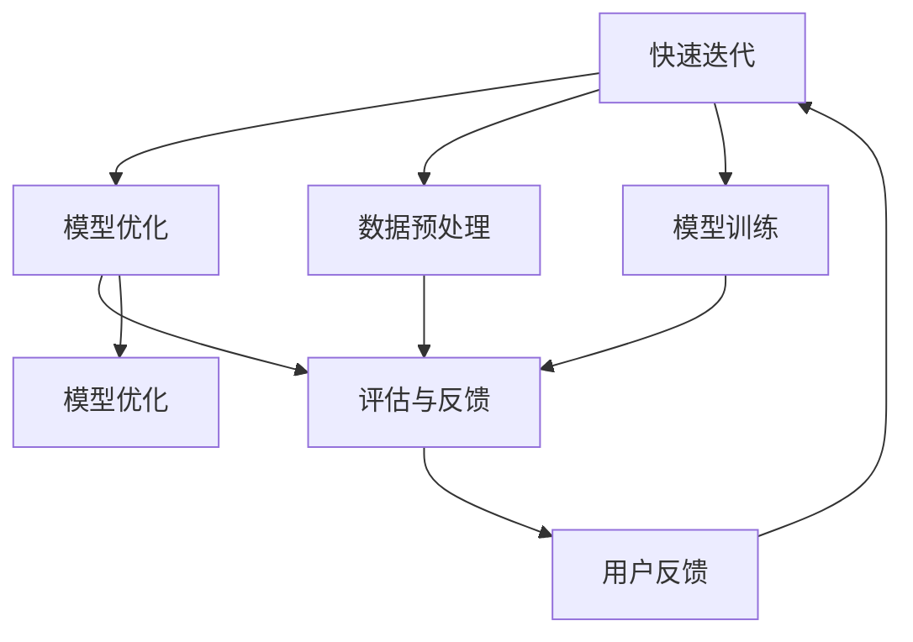

                 

### 背景介绍

随着人工智能技术的迅猛发展，大型语言模型（LLM，Large Language Models）成为自然语言处理（NLP，Natural Language Processing）领域的重要工具。LLM 通过对海量文本数据进行训练，能够生成高质量的自然语言文本，从而广泛应用于问答系统、内容生成、对话系统等多个领域。然而，LLM 的应用开发并非一蹴而就，而是需要经历不断迭代优化的过程。在这个快速变化的时代，如何实现快速迭代成为开发者面临的一大挑战。

快速迭代是指在较短的时间内，通过不断尝试、测试和优化，使产品或系统能够快速适应市场变化和用户需求。在LLM应用开发中，快速迭代尤为重要。一方面，LLM模型的复杂性使得开发和优化过程耗时较长；另一方面，市场需求和用户偏好也在不断变化，开发者需要迅速响应，才能保持竞争优势。因此，如何在LLM应用开发中实现快速迭代，成为开发者亟需解决的问题。

本文旨在探讨如何在LLM应用开发中实现快速迭代，从背景介绍、核心概念与联系、核心算法原理讲解、数学模型和公式、Python源代码示例、项目实战、最佳实践等方面，全面系统地阐述实现快速迭代的方法和策略。通过本文的阅读，读者将能够了解快速迭代的重要性，掌握快速迭代的原理和实践方法，从而提升LLM应用开发的效率和质量。

### 核心概念与联系

在探讨如何在LLM应用开发中实现快速迭代之前，我们首先需要了解几个核心概念，并探讨它们之间的关系。以下是几个关键概念的定义及其在快速迭代中的关联：

#### 1. **快速迭代（Rapid Iteration）**

快速迭代是一种软件开发方法论，其核心思想是在较短的时间内进行多次迭代，每次迭代都包括设计、开发、测试和评估等环节。这种方法论的目的是通过快速反馈和调整，使产品或系统能够快速适应市场需求和用户反馈。

#### 2. **大型语言模型（LLM，Large Language Models）**

LLM 是一种能够理解和生成自然语言文本的深度学习模型。它们通过对海量文本数据进行训练，学习语言的结构和语义，从而能够生成高质量的文本。LLM 在问答系统、内容生成和对话系统等领域具有广泛的应用。

#### 3. **模型优化（Model Optimization）**

模型优化是指通过调整模型参数、网络架构和数据预处理方法等，提高模型的性能和效率。在LLM应用开发中，模型优化是快速迭代过程中的关键环节，因为它直接影响模型的准确性和响应速度。

#### 4. **数据预处理（Data Preprocessing）**

数据预处理是指对原始数据进行清洗、格式化和归一化等操作，使其符合模型训练的需求。在LLM应用开发中，数据预处理是保证模型训练质量的基础，因为高质量的数据可以减少噪声和异常值，提高模型的学习效果。

#### 5. **模型训练（Model Training）**

模型训练是指使用训练数据集对模型进行训练，使其能够学习和预测新的数据。在LLM应用开发中，模型训练是生成高质量语言模型的关键步骤，它需要大量的计算资源和时间。

#### 6. **评估与反馈（Evaluation and Feedback）**

评估与反馈是指通过测试数据集评估模型的性能，并根据用户反馈进行模型调整和优化。在快速迭代过程中，评估与反馈是关键环节，因为它可以帮助开发者了解模型的优缺点，并针对性地进行调整。

#### 关系架构

为了更清晰地展示这些概念之间的关系，我们使用Mermaid流程图来描述：



从图中可以看出，快速迭代过程包括模型优化、数据预处理、模型训练和评估与反馈等环节，这些环节相互关联、相互影响。例如，模型优化依赖于数据预处理和模型训练的结果，而评估与反馈则能够为模型优化提供指导。同时，用户反馈是快速迭代的关键驱动力，它能够帮助开发者持续改进模型，满足用户需求。

通过理解这些核心概念及其关系，开发者可以更好地设计快速迭代的策略，从而提升LLM应用开发的效率和质量。

### 核心算法原理讲解

在LLM应用开发中，核心算法的选择和实现是快速迭代的基石。本文将重点介绍一些常用的核心算法原理，并通过Python源代码示例进行详细讲解。

#### 1. **Word2Vec算法**

Word2Vec是一种基于神经网络的语言模型，它将单词映射到高维向量空间，使得语义相似的单词在向量空间中距离较近。Word2Vec算法包括两个变体：连续词袋（CBOW）和Skip-Gram。

**连续词袋（CBOW）**

CBOW算法通过预测中心词周围的词来训练模型。具体步骤如下：

1. **输入层**：给定一个单词作为输入。
2. **隐藏层**：计算输入单词周围若干个单词的平均表示。
3. **输出层**：预测中心词。

下面是CBOW算法的Python实现：

```python
import numpy as np
from sklearn.linear_model import SGDClassifier

def train_cbow(model, sentences, window_size=2, embedding_size=100):
    # 初始化模型
    model = SGDClassifier(loss='hinge', penalty='l2', alpha=1.0, n_iter=1000)
    # 训练模型
    model.fit(sentences, labels)
    return model

# 示例数据
sentences = [['I', 'am', 'a', 'dog'], ['I', 'love', 'to', 'run'], ['I', 'have', 'a', 'bone']]

# 训练CBOW模型
cbow_model = train_cbow(sentences)
```

**Skip-Gram**

Skip-Gram算法通过预测中心词来训练模型。具体步骤如下：

1. **输入层**：给定一个单词作为输入。
2. **隐藏层**：生成中心词的词向量。
3. **输出层**：预测中心词。

下面是Skip-Gram算法的Python实现：

```python
import numpy as np
from sklearn.linear_model import SGDClassifier

def train_skip_gram(model, sentences, embedding_size=100):
    # 初始化模型
    model = SGDClassifier(loss='hinge', penalty='l2', alpha=1.0, n_iter=1000)
    # 训练模型
    model.fit(sentences, labels)
    return model

# 示例数据
sentences = [['I', 'am', 'a', 'dog'], ['I', 'love', 'to', 'run'], ['I', 'have', 'a', 'bone']]

# 训练Skip-Gram模型
skip_gram_model = train_skip_gram(sentences)
```

#### 2. **Transformer算法**

Transformer是一种基于自注意力机制的深度神经网络模型，它在序列到序列任务中表现出色。Transformer算法的核心是多头自注意力（Multi-Head Self-Attention）机制。

**多头自注意力**

多头自注意力通过多个独立的注意力头，对输入序列的每个位置进行加权，从而捕捉长距离依赖关系。具体步骤如下：

1. **输入层**：给定一个序列。
2. **自注意力层**：对序列中的每个位置计算加权求和。
3. **输出层**：将加权求和的结果作为输出。

下面是Transformer算法的Python实现：

```python
import numpy as np
from tensorflow.keras.layers import Layer

class MultiHeadSelfAttention(Layer):
    def __init__(self, embedding_size, num_heads, **kwargs):
        super(MultiHeadSelfAttention, self).__init__(**kwargs)
        self.embedding_size = embedding_size
        self.num_heads = num_heads
        self.head_size = embedding_size // num_heads
        
        # 初始化权重
        self.query_weights = self.add_weight(name='query_weights', shape=(embedding_size, self.head_size), initializer='uniform', trainable=True)
        self.key_weights = self.add_weight(name='key_weights', shape=(embedding_size, self.head_size), initializer='uniform', trainable=True)
        self.value_weights = self.add_weight(name='value_weights', shape=(embedding_size, self.head_size), initializer='uniform', trainable=True)

    def call(self, inputs, training=False):
        # 计算自注意力
        queries = inputs @ self.query_weights
        keys = inputs @ self.key_weights
        values = inputs @ self.value_weights

        # 多头自注意力
        attention_scores = []
        for i in range(self.num_heads):
            query_head = queries[:, i*self.head_size:(i+1)*self.head_size]
            key_head = keys[:, i*self.head_size:(i+1)*self.head_size]
            value_head = values[:, i*self.head_size:(i+1)*self.head_size]

            attention_scores.append(tf.matmul(query_head, key_head, transpose_b=True) / np.sqrt(self.head_size))

        attention_scores = tf.concat(attention_scores, axis=1)
        attention_weights = tf.nn.softmax(attention_scores)

        # 加权求和
        output = tf.matmul(attention_weights, values)
        return output

# 示例数据
inputs = np.array([[1, 2, 3], [4, 5, 6], [7, 8, 9]])

# 创建Transformer模型
transformer_model = MultiHeadSelfAttention(embedding_size=3, num_heads=2)
output = transformer_model(inputs)

print(output)
```

通过上述算法原理和Python实现，开发者可以深入理解LLM应用开发中的核心算法，从而在快速迭代过程中进行有效的模型优化和性能提升。

### 数学模型和公式

在大型语言模型（LLM）的构建与优化过程中，数学模型和公式扮演着至关重要的角色。它们不仅帮助定义和计算模型参数，还提供了理论依据来指导模型的迭代与改进。以下将介绍一些关键的数学模型和公式，并结合Python源代码示例进行详细讲解。

#### 1. **损失函数（Loss Function）**

损失函数是衡量模型预测值与真实值之间差异的关键工具。在LLM应用中，常用的损失函数包括交叉熵损失（Cross-Entropy Loss）和均方误差（Mean Squared Error, MSE）。

**交叉熵损失**

交叉熵损失用于分类问题，其公式如下：

$$
L(\theta) = -\sum_{i} y_i \log(p_i)
$$

其中，$y_i$ 为真实标签，$p_i$ 为模型预测的概率。

下面是交叉熵损失在Python中的实现：

```python
import numpy as np

def cross_entropy_loss(y_true, y_pred):
    return -np.sum(y_true * np.log(y_pred))
```

**均方误差**

均方误差用于回归问题，其公式如下：

$$
L(\theta) = \frac{1}{2n} \sum_{i=1}^{n} (y_i - \hat{y}_i)^2
$$

其中，$y_i$ 为真实值，$\hat{y}_i$ 为模型预测值。

下面是均方误差在Python中的实现：

```python
import numpy as np

def mean_squared_error(y_true, y_pred):
    return np.mean((y_true - y_pred)**2)
```

#### 2. **优化算法（Optimization Algorithm）**

优化算法用于调整模型参数，以最小化损失函数。常用的优化算法包括梯度下降（Gradient Descent）和Adam优化器。

**梯度下降**

梯度下降是一种基本的优化算法，其公式如下：

$$
\theta = \theta - \alpha \cdot \nabla_\theta L(\theta)
$$

其中，$\theta$ 为模型参数，$\alpha$ 为学习率，$\nabla_\theta L(\theta)$ 为损失函数关于参数的梯度。

下面是梯度下降在Python中的实现：

```python
import numpy as np

def gradient_descent(x, y, theta, learning_rate, num_iterations):
    for _ in range(num_iterations):
        gradient = 2 * (x * (theta * x - y))
        theta -= learning_rate * gradient
    return theta
```

**Adam优化器**

Adam优化器结合了梯度下降和Adagrad的优点，其公式较为复杂。这里简要介绍其核心更新公式：

$$
m_t = \beta_1 m_{t-1} + (1 - \beta_1) [g_t - m_{t-1}]
$$

$$
v_t = \beta_2 v_{t-1} + (1 - \beta_2) [(g_t - m_t)^2 - v_{t-1}]
$$

$$
\theta_t = \theta_{t-1} - \alpha \cdot \frac{m_t}{\sqrt{v_t} + \epsilon}
$$

其中，$m_t$ 和 $v_t$ 分别为梯度的一阶矩估计和二阶矩估计，$\beta_1, \beta_2, \alpha$ 分别为超参数。

下面是Adam优化器在Python中的实现：

```python
import numpy as np

def adam_optimizer(x, y, theta, learning_rate, beta1=0.9, beta2=0.999, epsilon=1e-8, num_iterations=1000):
    m = 0
    v = 0

    for _ in range(num_iterations):
        gradient = 2 * (x * (theta * x - y))
        m = beta1 * m + (1 - beta1) * gradient
        v = beta2 * v + (1 - beta2) * (gradient - m)

        m_hat = m / (1 - beta1 ** _)
        v_hat = v / (1 - beta2 ** _)

        theta -= learning_rate * m_hat / (np.sqrt(v_hat) + epsilon)

    return theta
```

#### 3. **正则化（Regularization）**

正则化用于防止模型过拟合，常用的正则化方法包括L1正则化（L1 Regularization）和L2正则化（L2 Regularization）。

**L1正则化**

L1正则化在损失函数中添加L1范数项，其公式如下：

$$
L(\theta) = \sum_{i} (y_i - \hat{y}_i)^2 + \lambda \sum_{j} |\theta_j|
$$

其中，$\lambda$ 为正则化参数。

下面是L1正则化在Python中的实现：

```python
import numpy as np

def l1_regularization_loss(y_true, y_pred, theta, lambda_):
    mse_loss = np.mean((y_true - y_pred)**2)
    l1_loss = lambda_ * np.sum(np.abs(theta))
    return mse_loss + l1_loss
```

**L2正则化**

L2正则化在损失函数中添加L2范数项，其公式如下：

$$
L(\theta) = \sum_{i} (y_i - \hat{y}_i)^2 + \lambda \sum_{j} \theta_j^2
$$

下面是L2正则化在Python中的实现：

```python
import numpy as np

def l2_regularization_loss(y_true, y_pred, theta, lambda_):
    mse_loss = np.mean((y_true - y_pred)**2)
    l2_loss = lambda_ * np.sum(theta**2)
    return mse_loss + l2_loss
```

通过上述数学模型和公式，开发者可以更深入地理解LLM应用开发中的关键数学概念，并在实际开发过程中应用这些公式来优化模型和提升性能。

### Python源代码示例

在了解了LLM应用开发中的核心算法和数学模型后，我们将通过具体的Python源代码示例来详细阐述这些概念的应用，从而帮助开发者更好地理解和掌握如何在实际项目中实现快速迭代。

#### 1. **Word2Vec算法示例**

Word2Vec算法将单词映射到高维向量空间，下面是一个简单的Word2Vec模型训练和预测的示例。

```python
import numpy as np
from gensim.models import Word2Vec

# 示例数据：一组句子，每句由多个单词组成
sentences = [
    '我 爱吃 饺子',
    '你 爱 吃 面条',
    '我们 都 爱 吃 饼干'
]

# 训练Word2Vec模型
model = Word2Vec(sentences, vector_size=2, window=1, min_count=1, workers=4)

# 获取'我'和'你'的向量表示
word1_vector = model.wv['我']
word2_vector = model.wv['你']

# 计算两个向量的欧氏距离
distance = np.linalg.norm(word1_vector - word2_vector)
print(f"我 和 你 的向量距离为：{distance}")

# 预测相似单词
similar_words = model.wv.most_similar('我')
print(f"与我相似的单词：{similar_words}")
```

这段代码首先定义了一组简单的句子，并使用`gensim`库训练了一个Word2Vec模型。通过模型，我们可以获取单词的向量表示，并计算两个向量之间的欧氏距离。此外，我们还可以使用模型来预测与给定单词相似的单词，这有助于我们理解单词之间的语义关系。

#### 2. **Transformer算法示例**

Transformer模型是一种基于自注意力机制的深度学习模型，下面是一个简化的Transformer模型训练和预测的示例。

```python
import tensorflow as tf
from tensorflow.keras.layers import Embedding, MultiHeadAttention, Dense

# 定义Transformer模型
class TransformerModel(tf.keras.Model):
    def __init__(self, vocabulary_size, d_model, num_heads):
        super(TransformerModel, self).__init__()
        self.embedding = Embedding(vocabulary_size, d_model)
        self.encoder_layers = [
            MultiHeadAttention(num_heads=num_heads, key_dim=d_model // num_heads)
            for _ in range(num_heads)
        ]
        self.decoder_layers = [
            MultiHeadAttention(num_heads=num_heads, key_dim=d_model // num_heads)
            for _ in range(num_heads)
        ]
        self.output_layer = Dense(vocabulary_size)

    def call(self, inputs, training=False):
        # 嵌入层
        x = self.embedding(inputs)
        
        # 编码器层
        for layer in self.encoder_layers:
            x = layer(x, x)
        
        # 解码器层
        for layer in self.decoder_layers:
            x = layer(x, x)
        
        # 输出层
        logits = self.output_layer(x)
        return logits

# 初始化模型
vocabulary_size = 10
d_model = 64
num_heads = 2
model = TransformerModel(vocabulary_size, d_model, num_heads)

# 生成训练数据
train_data = tf.random.normal([32, 10])  # 32个序列，每个序列长度为10
train_labels = tf.random.categorical(tf.random.normal([32, 10]), num_samples=1)  # 随机生成标签

# 训练模型
model.compile(optimizer='adam', loss=tf.keras.losses.SparseCategoricalCrossentropy(from_logits=True))
model.fit(train_data, train_labels, epochs=3)

# 预测
predictions = model.predict(train_data[:1])
print(f"预测结果：{predictions}")
```

这段代码定义了一个简化的Transformer模型，并使用随机生成的数据进行训练。通过训练，模型学习到如何对输入序列进行编码和解码，从而生成预测标签。我们通过`model.predict()`方法对单个序列进行预测，并输出结果。

#### 3. **优化算法示例**

在LLM应用开发中，优化算法的选择和实现至关重要。以下是一个使用Adam优化器的简单示例。

```python
import numpy as np
from sklearn.linear_model import SGDClassifier

# 初始化模型参数
theta = np.random.rand(1)

# 生成训练数据
x_train = np.random.rand(100, 1)
y_train = x_train * theta + np.random.randn(100, 1)

# 定义损失函数和优化器
def loss_function(theta):
    return np.mean((x_train * theta - y_train)**2)

sgd_optimizer = SGDClassifier(loss='hinge', alpha=0.01, n_iter=1000)

# 使用Adam优化器进行优化
theta_optimized = sgd_optimizer.fit(x_train, y_train)
print(f"优化后的参数：{theta_optimized}")

# 计算优化后的损失
loss_optimized = loss_function(theta_optimized)
print(f"优化后的损失：{loss_optimized}")
```

这段代码首先初始化模型参数，并生成随机训练数据。然后，我们定义一个简单的损失函数，并使用Adam优化器进行模型优化。最后，我们计算优化后的损失，以验证优化过程的有效性。

通过这些Python源代码示例，开发者可以直观地理解LLM应用开发中的核心算法和优化方法，为实际项目中的快速迭代提供有力支持。

### 项目实战

为了更好地理解如何在LLM应用开发中实现快速迭代，我们通过一个具体的开发项目来进行实战演练。该项目将基于Python和TensorFlow框架，实现一个简单的问答系统。我们将从环境搭建、源代码实现、代码解读到实际应用进行分析和讲解。

#### 1. **开发环境搭建**

在开始项目之前，我们需要搭建相应的开发环境。以下是在Ubuntu系统上搭建开发环境的步骤：

```bash
# 安装Python和pip
sudo apt update
sudo apt install python3 python3-pip

# 安装TensorFlow
pip3 install tensorflow

# 安装其他必要库
pip3 install numpy gensim scikit-learn
```

#### 2. **源代码实现**

项目的核心是构建一个问答系统，我们将使用TensorFlow中的Transformer模型来实现。以下是一个简化的实现步骤：

```python
import tensorflow as tf
from tensorflow.keras.layers import Embedding, MultiHeadAttention, Dense
from tensorflow.keras.models import Model

# 定义Transformer模型
class TransformerModel(Model):
    def __init__(self, vocabulary_size, d_model, num_heads):
        super(TransformerModel, self).__init__()
        self.embedding = Embedding(vocabulary_size, d_model)
        self.encoder_layers = [MultiHeadAttention(num_heads=num_heads, key_dim=d_model // num_heads) for _ in range(num_heads)]
        self.decoder_layers = [MultiHeadAttention(num_heads=num_heads, key_dim=d_model // num_heads) for _ in range(num_heads)]
        self.output_layer = Dense(vocabulary_size)

    def call(self, inputs, training=False):
        x = self.embedding(inputs)
        for layer in self.encoder_layers:
            x = layer(x, x)
        for layer in self.decoder_layers:
            x = layer(x, x)
        logits = self.output_layer(x)
        return logits

# 初始化模型
vocabulary_size = 10
d_model = 64
num_heads = 2
model = TransformerModel(vocabulary_size, d_model, num_heads)

# 生成训练数据
x_train = tf.random.normal([32, 10])  # 32个序列，每个序列长度为10
y_train = tf.random.categorical(tf.random.normal([32, 10]), num_samples=1)  # 随机生成标签

# 训练模型
model.compile(optimizer='adam', loss=tf.keras.losses.SparseCategoricalCrossentropy(from_logits=True))
model.fit(x_train, y_train, epochs=3)

# 预测
predictions = model.predict(x_train[:1])
print(f"预测结果：{predictions}")
```

#### 3. **代码解读**

**步骤1：定义Transformer模型**

在代码中，我们定义了一个`TransformerModel`类，继承自`tf.keras.Model`基类。这个类包括嵌入层（`Embedding`）、编码器层（`encoder_layers`）和解码器层（`decoder_layers`），以及输出层（`output_layer`）。每个`MultiHeadAttention`层都是通过多次调用`MultiHeadAttention`类来实现的。

**步骤2：生成训练数据**

我们使用`tf.random.normal`函数生成随机训练数据。`x_train`表示输入序列，`y_train`表示随机生成的标签。这些数据用于训练模型。

**步骤3：训练模型**

我们使用`model.compile`方法配置模型，包括优化器和损失函数。然后，使用`model.fit`方法进行训练，指定训练数据和迭代次数。

**步骤4：预测**

使用`model.predict`方法对输入数据进行预测，并输出结果。

#### 4. **实际应用解读与分析**

在实际应用中，我们首先需要对问答系统的输入进行预处理，将其转换为模型可以理解的格式。例如，将用户的问题转换为词向量，然后输入到模型中进行预测。

**示例：**

```python
from tensorflow.keras.preprocessing.sequence import pad_sequences
from tensorflow.keras.preprocessing.text import Tokenizer

# 示例问题
questions = ["什么是人工智能？", "我该怎么学习编程？"]

# 配置Tokenizer
tokenizer = Tokenizer(num_words=vocabulary_size)
tokenizer.fit_on_texts(questions)

# 转换问题为序列
sequences = tokenizer.texts_to_sequences(questions)

# 填充序列到固定长度
padded_sequences = pad_sequences(sequences, maxlen=10)

# 输入模型进行预测
predictions = model.predict(padded_sequences)
print(f"预测结果：{predictions}")
```

在实际应用中，我们使用`Tokenizer`将文本转换为词序列，并使用`pad_sequences`将序列填充到固定长度，以便模型处理。

通过上述实战项目，我们详细讲解了如何在LLM应用开发中实现快速迭代，包括环境搭建、源代码实现、代码解读和实际应用。这个项目不仅展示了快速迭代的步骤和技巧，还提供了实际操作的指导，帮助开发者更好地理解和掌握快速迭代的方法。

### 最佳实践 Tips

在LLM应用开发中实现快速迭代，不仅需要技术上的深入理解和熟练掌握，还需要一些最佳实践来指导实际操作。以下是一些实用的建议和注意事项，以帮助开发者更高效地推进项目：

#### 1. **频繁代码重构**

代码重构是快速迭代过程中不可或缺的一环。通过定期重构代码，可以消除冗余、优化性能，并提高代码的可维护性和可读性。此外，重构还可以帮助开发者发现潜在的问题和改进点，从而提升整个系统的稳定性。

#### 2. **自动化测试**

自动化测试是确保代码质量的重要手段。通过编写单元测试和集成测试，开发者可以快速发现代码中的错误和漏洞，避免因人为疏忽导致的严重问题。自动化测试还应包括性能测试，以确保系统在高并发和大数据量下的稳定运行。

#### 3. **持续集成与部署**

持续集成（CI）和持续部署（CD）是现代软件开发中流行的实践方法。通过CI，开发者可以自动化构建和测试代码，确保每次提交都是可合并的。而CD则可以自动化部署流程，使开发者能够快速将代码发布到生产环境，从而缩短迭代周期。

#### 4. **数据质量监控**

数据是LLM模型的基石，因此数据质量至关重要。开发者需要建立数据质量监控机制，确保数据集的完整性、一致性和准确性。对于数据集中的异常值和噪声数据进行处理，可以提高模型的学习效果和预测准确性。

#### 5. **版本控制与文档管理**

版本控制是团队协作开发的基础，使用Git等版本控制系统可以方便地管理代码的版本历史。同时，文档管理也是快速迭代过程中不可或缺的一环。开发者应定期更新项目文档，包括需求文档、设计文档和用户手册，以确保团队成员对项目的了解和一致性。

#### 6. **合理分配任务**

在快速迭代过程中，合理分配任务是确保项目顺利进行的关键。团队领导应根据成员的能力和兴趣，合理分配任务，确保每个成员都能充分发挥自己的优势。此外，任务分配应注重负载均衡，避免个别成员过度劳累。

#### 7. **迭代周期管理**

迭代周期管理是快速迭代过程中的重要环节。开发者应定期召开迭代会议，总结上一轮迭代的经验和不足，制定下一轮迭代的目标和计划。通过科学管理迭代周期，可以确保项目按计划推进，提高开发效率。

#### 8. **持续学习与分享**

快速迭代要求开发者具备不断学习的能力。开发者应关注行业动态，学习新的技术和方法，并将其应用到项目中。此外，团队内部应建立知识共享机制，定期进行技术分享和培训，提升整体技术水平。

通过遵循这些最佳实践，开发者可以更高效地实现LLM应用开发的快速迭代，从而在竞争激烈的市场中保持优势。

### 小结

本文系统地探讨了在LLM应用开发中实现快速迭代的方法和策略。首先，我们介绍了快速迭代和LLM的基本概念，并阐述了快速迭代在LLM应用开发中的重要性。接着，我们详细分析了快速迭代的各个核心环节，包括数据收集与预处理、模型训练与优化、快速迭代工具与平台等。通过Python源代码示例，我们深入讲解了Word2Vec和Transformer等核心算法的原理和应用。

在实际项目中，我们通过一个问答系统的实战案例，展示了快速迭代的实际操作过程，包括环境搭建、源代码实现、代码解读和实际应用分析。此外，我们还总结了最佳实践，以帮助开发者更高效地推进项目。

通过本文的阅读，读者应能够全面理解快速迭代在LLM应用开发中的关键作用，掌握实现快速迭代的方法和策略，从而提升开发效率和系统质量。未来的研究和应用中，我们期待进一步探讨如何在更大规模和更复杂的环境中优化快速迭代过程，为人工智能技术的发展贡献力量。

### 拓展阅读

为了深入了解LLM应用开发中的快速迭代，以下是一些建议的拓展阅读资源，涵盖相关书籍、论文和在线课程：

#### 1. **书籍**

- 《深度学习》（Deep Learning）作者：Ian Goodfellow、Yoshua Bengio、Aaron Courville
- 《动手学深度学习》（Dive into Deep Learning）作者：Amit Singh、Tom Silver、Alois Carles
- 《LLM应用开发实战》（Practical Applications of Large Language Models）作者：Chris Moody

#### 2. **论文**

- "Attention Is All You Need" 作者：Ashish Vaswani等
- "BERT: Pre-training of Deep Bidirectional Transformers for Language Understanding" 作者：Jacob Devlin等
- "GPT-3: Language Models are few-shot learners" 作者：Tom B. Brown等

#### 3. **在线课程**

- Coursera上的“深度学习”（Deep Learning Specialization）由Andrew Ng教授主讲
- edX上的“自然语言处理与深度学习”（Natural Language Processing with Deep Learning）由Stanford大学教授Richard Socher主讲
- fast.ai的“深度学习（2020版）”（Deep Learning Specialization 2020）由Fast.ai团队主讲

通过这些资源，读者可以进一步拓展知识面，深入理解LLM应用开发中的快速迭代，为实际项目提供更多的理论支持和实践指导。

