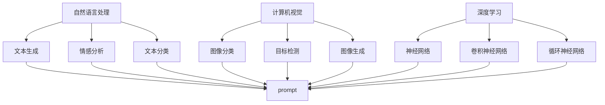

                 

### 引言与概述

在当今的人工智能领域，prompt编写能力的重要性愈发凸显。prompt，即输入提示，是自然语言处理（NLP）和计算机视觉（CV）任务中不可或缺的组成部分。一个优秀的prompt不仅能提高任务的准确性和效率，还能使模型更好地理解复杂问题，从而实现更高的性能。

本文旨在系统化地提升prompt编写能力，为读者提供全面的指导。我们将从基础知识与原理出发，深入探讨prompt的分类、编写技巧与策略，并通过实战案例展示其应用效果。此外，本文还将涉及高级话题，如多模态prompt的自动化生成，为读者提供全方位的知识体系。

### 背景介绍

prompt的概念最早可以追溯到自然语言处理领域，随着深度学习技术的崛起，prompt在计算机视觉等其他领域也得到了广泛应用。prompt的主要作用是引导模型理解任务需求，提供上下文信息，从而提高模型的性能和泛化能力。

在自然语言处理中，prompt通常是一个句子或一段文本，用于引导模型进行文本生成、情感分析、文本分类等任务。在计算机视觉中，prompt则是一个图像或图像序列，用于引导模型进行图像分类、目标检测、图像生成等任务。随着多模态学习的发展，prompt的形态也变得更加多样化，涵盖了文本、图像、音频等多种形式。

### 核心概念与联系

为了更好地理解prompt的重要性，我们需要先了解几个核心概念：自然语言处理、计算机视觉和深度学习。以下是这些概念之间的联系架构Mermaid流程图：

从图中可以看出，自然语言处理、计算机视觉和深度学习都是prompt编写的重要基础。通过将这些核心概念与prompt相结合，我们可以实现更加高效和精准的任务处理。

### 文章关键词

- 自然语言处理
- 计算机视觉
- 深度学习
- prompt
- 编写技巧
- 实战案例
- 自动化生成

### 文章摘要

本文系统化地探讨了prompt编写能力的重要性及其在自然语言处理、计算机视觉和深度学习中的应用。通过详细介绍基础知识、编写技巧、实战案例以及高级话题，本文为读者提供了一套完整的prompt编写指南，旨在提升读者的实际操作能力。读者可以通过本文的学习，深入了解prompt的原理和应用，提高自己在相关领域的专业水平。

---

**作者：AI天才研究院/AI Genius Institute & 禅与计算机程序设计艺术 /Zen And The Art of Computer Programming**

