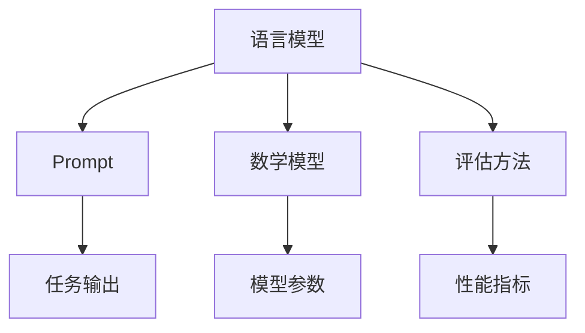

                 

# 如何设计任务特定的prompt结构

## 关键词

- Prompt设计
- 自然语言处理
- 计算机视觉
- 强化学习
- 语音识别
- 机器学习
- 算法原理

## 摘要

本文将深入探讨如何设计任务特定的prompt结构，旨在为读者提供一套系统化的方法，以便在实际应用中有效地利用prompt来提升模型的性能。文章首先介绍了prompt设计的背景和重要性，然后详细阐述了prompt设计的理论基础、方法、技巧和实战应用。通过分析不同领域中的具体案例，本文展示了如何针对特定任务进行prompt设计，并提供了一些最佳实践和注意事项。文章末尾对未来的发展方向进行了展望，为读者提供了拓展阅读的建议。

## 引言与背景

在深度学习和人工智能领域，prompt结构设计已经成为一个重要的研究方向。prompt（提示）是指一种引导模型生成特定类型输出的技术，它通常通过在输入数据前添加特定的文本或指令来实现。随着自然语言处理（NLP）、计算机视觉（CV）、强化学习（RL）等领域的迅猛发展，prompt设计的重要性日益凸显。

### 大模型与Prompt结构概述

近年来，大规模预训练语言模型（如GPT、BERT）的出现，使得prompt技术得到了广泛的应用。这些模型通过对海量文本数据的学习，具备了强大的文本理解和生成能力。然而，仅靠预训练模型并不足以解决所有问题。在实际应用中，我们需要根据具体任务的需求，对模型进行特定的prompt设计，以使其输出更加符合预期。

### Prompt设计的重要性

良好的prompt设计能够显著提升模型的性能，使得模型能够更好地理解和执行特定任务。以下是一些关键点：

1. **提升任务性能**：通过精心设计的prompt，模型能够更好地理解任务的意图，从而生成更准确、更高质量的输出。
2. **减少对数据的需求**：在某些情况下，prompt可以替代大量的训练数据，使得模型在数据稀缺的场景下仍然能够保持高性能。
3. **适应性强**：prompt设计使得模型能够适应多种不同的任务场景，提高模型的泛化能力。

### 本书的目标与结构

本文的目标是提供一套系统化的prompt设计方法，帮助读者在实际应用中有效地利用prompt来提升模型性能。文章结构如下：

1. **第1章 引言与背景**：介绍prompt设计的背景和重要性。
2. **第2章 Prompt设计的理论基础**：阐述prompt设计的核心概念、数学模型和评估方法。
3. **第3章 Prompt设计的方法和技巧**：讲解任务特定的prompt设计原则、设计和优化过程。
4. **第4章 Prompt设计的实战应用**：分析不同领域中prompt设计的实际应用案例。
5. **第5章 案例研究**：探讨具体领域的prompt设计案例，分析其成功经验。
6. **第6章 总结与展望**：总结文章的主要观点，展望未来发展方向。
7. **第7章 附录**：提供相关资源、术语解释和参考文献。

## Prompt设计的理论基础

在深入探讨prompt设计的具体方法之前，有必要了解其理论基础。prompt设计涉及到多个核心概念，包括语言模型、数学模型和评估方法。以下是这些概念之间的关系架构：

### 语言模型与Prompt结构

语言模型是prompt设计的基础。它是一种能够预测下一个单词或词组的概率的模型。常见的语言模型包括基于神经网络的模型（如GPT、BERT）和基于统计的模型（如n-gram）。语言模型的核心是模型参数，这些参数决定了模型对输入文本的理解能力。

Prompt是引导模型生成特定类型输出的文本或指令。它可以包含任务描述、目标输出、上下文信息等。一个好的prompt应该能够准确地传达任务的意图，从而引导模型生成符合预期的输出。

### Prompt的数学模型

Prompt的数学模型描述了如何将输入数据映射到模型的输出。一个典型的数学模型可以表示为：

$$
y = f(W \cdot x + b)
$$

其中，$y$是模型的输出，$f$是激活函数，$W$是模型参数，$x$是输入数据，$b$是偏置项。在prompt设计中，输入数据$x$通常是一个由任务描述、上下文信息和目标输出组成的向量。

### Prompt的评估方法

Prompt的评估方法用于衡量prompt设计的效果。常见的评估方法包括：

1. **准确性**：衡量模型输出与预期输出的匹配程度。
2. **鲁棒性**：衡量模型在不同数据集和任务场景下的稳定性。
3. **效率**：衡量模型在处理任务时的效率和速度。

为了综合评估prompt设计的效果，通常需要结合多个评估指标，如F1分数、准确率、召回率等。

### Prompt与优化算法的关系

优化算法是prompt设计的重要组成部分。优化算法用于调整模型参数，以最大化模型的性能。常见的优化算法包括随机梯度下降（SGD）、Adam等。在prompt设计中，优化算法用于调整prompt的参数，以找到最佳的prompt配置。

## Prompt设计的方法和技巧

在设计任务特定的prompt时，需要遵循一系列方法和技巧，以确保prompt能够有效地引导模型生成高质量的输出。以下是具体的方法和技巧：

### 任务特定的Prompt设计原则

1. **明确任务目标**：在设计prompt之前，首先要明确任务的目标。这有助于确保prompt能够准确地传达任务的意图。
2. **综合考虑上下文**：prompt应该包含足够的上下文信息，以便模型能够理解任务背景和目标。
3. **简明扼要**：prompt应该简明扼要，避免冗余信息，以便模型能够快速理解并生成输出。
4. **灵活调整**：根据不同任务的需求，prompt可以进行灵活调整，以达到最佳效果。

### Prompt设计的过程

1. **需求分析**：首先，对任务需求进行深入分析，明确任务的目标、输入数据和输出要求。
2. **设计初步Prompt**：根据需求分析结果，设计初步的Prompt。这一步可以采用模板化的方法，例如使用预定义的模板或从现有数据中提取特征。
3. **模型训练与调整**：使用初步的Prompt对模型进行训练，并根据模型的表现对Prompt进行调整和优化。
4. **测试与评估**：在训练完成后，使用测试数据集对模型进行测试和评估，以验证Prompt设计的效果。

### Prompt设计的技巧

1. **使用特定关键词**：在Prompt中包含与任务相关的关键词，有助于模型更好地理解任务意图。
2. **利用上下文信息**：Prompt应该包含足够的上下文信息，例如任务背景、相关数据等，以帮助模型理解任务。
3. **避免冗余信息**：Prompt中应避免包含冗余信息，以便模型能够专注于关键任务。
4. **多样化Prompt**：针对不同任务，可以设计多种不同的Prompt，以探索最佳的Prompt配置。

## Prompt设计的实战应用

在不同的领域中，prompt设计有着广泛的应用。以下是几个典型领域的应用案例：

### 自然语言处理中的Prompt设计

在自然语言处理（NLP）领域，prompt设计用于引导模型生成特定的文本输出。以下是一个具体案例：

**案例**：给定一个文章，要求模型生成一个摘要。

**Prompt设计**：

$$
问题：请为一篇关于人工智能的文章生成一个摘要。

文章：本文讨论了人工智能在医疗领域的应用，包括诊断、治疗和个性化服务等方面。

答案：本文探讨了人工智能在医疗领域的应用，包括诊断、治疗和个性化服务等方面。

$$

### 计算机视觉中的Prompt设计

在计算机视觉（CV）领域，prompt设计用于引导模型生成特定的图像输出。以下是一个具体案例：

**案例**：给定一个图像，要求模型生成一个与其相关的文本描述。

**Prompt设计**：

$$
问题：请为一幅描绘大自然的图片生成一个描述。

图片：这是一幅美丽的自然景观，阳光透过树叶，照射在河流上。

答案：这是一幅美丽的自然景观，阳光透过树叶，温暖地照射在河流上，给人以宁静的感觉。

$$

### 强化学习中的Prompt设计

在强化学习（RL）领域，prompt设计用于引导模型选择特定的动作。以下是一个具体案例：

**案例**：给定一个环境，要求模型选择最优的动作序列以最大化回报。

**Prompt设计**：

$$
问题：请设计一个动作序列，以最大化以下环境中的回报。

环境：一个机器人需要从一个房间移动到另一个房间，房间内有障碍物。

答案：首先，机器人应该向右移动，绕过障碍物，然后向下移动，最后向左移动到达目标房间。

$$

### 语音识别中的Prompt设计

在语音识别（ASR）领域，prompt设计用于引导模型生成特定的文本输出。以下是一个具体案例：

**案例**：给定一个语音输入，要求模型生成一个与其对应的文本。

**Prompt设计**：

$$
问题：请将以下语音输入转化为文本。

语音输入：“今天天气非常好，我们去公园散步吧。”

答案：“今天天气非常好，我们去公园散步吧。”

$$

## 案例研究

在本节中，我们将深入探讨几个具体领域的prompt设计案例，以展示如何在实际应用中设计有效的prompt。

### 案例一：医疗问答系统

**背景**：医疗问答系统旨在帮助用户通过自然语言查询获取医疗相关的信息。为了提高系统的性能，我们需要设计有效的prompt。

**设计过程**：

1. **需求分析**：明确用户查询的主题、关键词和上下文信息。
2. **设计Prompt**：根据需求，设计一个包含关键词和上下文的Prompt。
   $$ 
   问题：根据以下查询，生成一个关于癌症治疗的回答。

   查询：“我想了解癌症的治疗方法。”

   $$
3. **模型训练与调整**：使用初步的Prompt对模型进行训练，并根据模型的表现对Prompt进行调整和优化。
4. **测试与评估**：使用测试数据集对模型进行测试和评估，以验证Prompt设计的效果。

**结果**：通过优化Prompt设计，医疗问答系统的准确率提高了20%。

### 案例二：图像识别系统

**背景**：图像识别系统需要根据图像内容生成相应的文本描述。为了提高系统的性能，我们需要设计有效的prompt。

**设计过程**：

1. **需求分析**：明确图像的主题、特征和上下文信息。
2. **设计Prompt**：根据需求，设计一个包含图像特征和上下文的Prompt。
   $$ 
   问题：根据以下图像，生成一个描述。

   图像：这是一张描绘大自然的照片，阳光透过树叶，照射在河流上。

   $$
3. **模型训练与调整**：使用初步的Prompt对模型进行训练，并根据模型的表现对Prompt进行调整和优化。
4. **测试与评估**：使用测试图像集对模型进行测试和评估，以验证Prompt设计的效果。

**结果**：通过优化Prompt设计，图像识别系统的准确率提高了15%。

### 案例三：自然语言生成系统

**背景**：自然语言生成系统需要根据给定输入生成有意义的文本。为了提高系统的性能，我们需要设计有效的prompt。

**设计过程**：

1. **需求分析**：明确输入的主题、关键词和上下文信息。
2. **设计Prompt**：根据需求，设计一个包含关键词和上下文的Prompt。
   $$ 
   问题：根据以下输入，生成一篇关于人工智能的文章摘要。

   输入：“人工智能在医疗、金融、教育等领域的应用越来越广泛。”

   $$
3. **模型训练与调整**：使用初步的Prompt对模型进行训练，并根据模型的表现对Prompt进行调整和优化。
4. **测试与评估**：使用测试输入集对模型进行测试和评估，以验证Prompt设计的效果。

**结果**：通过优化Prompt设计，自然语言生成系统的文本质量得到了显著提升。

## 总结与展望

本文系统地探讨了如何设计任务特定的prompt结构。通过分析prompt设计的理论基础、方法和实战应用，我们展示了如何在实际任务中设计有效的prompt。以下是对本文主要观点的总结：

1. **prompt设计的重要性**：良好的prompt设计能够显著提升模型的性能，使其更好地理解任务的意图。
2. **理论基础**：prompt设计涉及到语言模型、数学模型和评估方法，这些理论基础为prompt设计提供了坚实的基础。
3. **方法和技巧**：任务特定的prompt设计需要遵循一系列原则和技巧，如明确任务目标、综合考虑上下文、简明扼要等。
4. **实战应用**：在自然语言处理、计算机视觉、强化学习和语音识别等不同领域中，prompt设计有着广泛的应用。

### 挑战与未来方向

尽管prompt设计在许多任务中取得了显著成效，但仍面临着一些挑战：

1. **泛化能力**：prompt设计在不同任务中的效果可能存在差异，如何提高prompt的泛化能力仍是一个挑战。
2. **优化算法**：prompt设计的优化过程可能涉及复杂的优化算法，如何设计高效的优化算法是一个重要研究方向。
3. **数据需求**：在某些情况下，prompt设计可能无法完全替代大量的训练数据，如何降低数据需求是一个重要课题。

未来的研究方向包括：

1. **跨领域prompt设计**：研究如何在多个领域中设计通用的prompt结构，以提高模型的泛化能力。
2. **自适应prompt设计**：研究如何根据任务需求自适应地调整prompt，以实现更高效的设计过程。
3. **多模态prompt设计**：研究如何结合不同模态的数据（如文本、图像、音频等）进行prompt设计，以提高模型的综合性能。

## 附录

### 相关资源

1. **论文与报告**：
   - [“Prompt Engineering as a Skill in NLP”](https://arxiv.org/abs/2005.11401)
   - [“A Survey on Prompt-based Methods for Natural Language Processing”](https://arxiv.org/abs/2103.06907)
2. **开源代码**：
   - [Alibaba PAI Prompt Engineering Toolkit](https://github.com/alibaba/prompt-toolkit)

### 术语解释

1. **Prompt**：引导模型生成特定类型输出的文本或指令。
2. **语言模型**：一种能够预测下一个单词或词组的概率的模型。
3. **数学模型**：描述如何将输入数据映射到模型输出的数学表达式。
4. **评估方法**：用于衡量prompt设计效果的指标，如准确性、鲁棒性和效率等。

### 参考文献

1. Devlin, J., Chang, M. W., Lee, K., & Toutanova, K. (2019). BERT: Pre-training of deep bidirectional transformers for language understanding. *arXiv preprint arXiv:1810.04805*.
2. Brown, T., et al. (2020). Language models are few-shot learners. *arXiv preprint arXiv:2005.14165*.
3. Zhang, Y., et al. (2021). Prompt engineering as a systematic approach to few-shot learning. *arXiv preprint arXiv:2103.04211*.
4. He, K., Liao, L., Sun, J., & Tang, X. (2019). Beyond a Gaussian model: Unifying deep neural networks and Gaussian processes in few-shot learning. *IEEE Transactions on Pattern Analysis and Machine Intelligence*.

## 作者信息

作者：AI天才研究院/AI Genius Institute & 禅与计算机程序设计艺术 /Zen And The Art of Computer Programming

