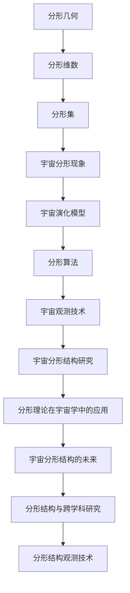

                 

# 宇宙是否具有分形结构

> 关键词：宇宙，分形结构，分形几何，分形维数，宇宙现象，数学模型，算法应用

> 摘要：本文探讨了宇宙是否具有分形结构的可能性，从分形理论基础出发，分析了宇宙中的分形现象，并通过数学模型和算法应用，对宇宙分形结构进行了深入研究。文章还对未来宇宙分形结构的研究方向进行了展望，并提供了相关的项目实战和分析。

----------------------------------------------------------------

## 引言

宇宙作为人类探索的终极奥秘，一直以来都吸引着无数科学家的目光。分形结构作为自然界中普遍存在的现象，近年来在宇宙学研究中也引起了广泛关注。宇宙是否具有分形结构？这是一个富有挑战性的问题。

### 1.1 分形结构的定义

分形结构是指具有自相似性的结构，即在一个确定的尺度范围内，部分与整体具有相似性。分形结构的特征是无限嵌套，局部与全局相似。分形几何是研究分形结构的一种数学工具，通过分形维数等概念，可以对分形结构进行量化描述。

### 1.2 宇宙分形结构的研究现状

近年来，随着观测技术和理论研究的不断发展，科学家们逐渐发现宇宙中存在许多具有分形特征的现象，如星系分布、星云形态、黑洞结构等。这些现象提示我们，宇宙可能具有分形结构。

## 分形理论基础

### 2.1 分形几何的基本概念

分形几何是研究分形结构的数学工具，主要包括分形维数、分形集和分形生成方法等概念。分形维数是描述分形结构复杂性的重要指标，通常使用豪斯道尔夫维数和自相似维数来计算。

### 2.2 分形维数与分形集的生成方法

分形维数是描述分形结构复杂性的重要指标。豪斯道尔夫维数和自相似维数是两种常见的分形维数计算方法。豪斯道尔夫维数基于覆盖集的概念，而自相似维数基于分形集的自相似性。

### 2.3 分形动力系统

分形动力系统是研究分形结构演变过程的数学工具。通过研究分形动力系统，可以揭示宇宙中分形结构的演化规律。

## 宇宙中的分形现象

### 3.1 分形在星系、星云中的表现

星系和星云是宇宙中的基本结构，它们的形态和分布往往呈现出分形特征。例如，星系的螺旋结构、星云的湍流形态等，都可以用分形几何进行描述。

### 3.2 黑洞与引力波的分形特征

黑洞是宇宙中最神秘的天体之一，其引力波事件提供了研究宇宙分形结构的契机。研究表明，黑洞的引力波信号可能具有分形特征，这为我们揭示了宇宙中分形结构的存在。

## 分形结构的数学模型

### 4.1 分形场论

分形场论是一种描述分形结构演化的数学模型，通过研究分形场中的物理量分布，可以揭示宇宙分形结构的演化规律。

### 4.2 分形动力学模型

分形动力学模型是一种描述分形结构演变过程的数学模型，通过研究分形动力学系统的演化规律，可以揭示宇宙分形结构的形成机制。

## 分形技术在宇宙学中的应用

### 5.1 分形算法在数据挖掘中的应用

分形算法在数据挖掘中具有广泛的应用，可以用于分析宇宙中的大数据，揭示宇宙中隐藏的分形结构。

### 5.2 分形理论在宇宙学研究中的案例研究

通过具体案例研究，可以深入了解分形理论在宇宙学研究中的应用，例如分形结构在星系分布、星云形态等方面的研究。

## 宇宙分形结构的未来展望

### 6.1 分形理论在宇宙学中的潜在应用

随着分形理论的不断发展，它在宇宙学中的潜在应用也将越来越广泛。例如，分形理论可以用于研究宇宙大爆炸、宇宙演化等重大问题。

### 6.2 当前和未来的研究方向

当前和未来的研究方向包括：进一步研究宇宙中的分形现象、开发新的分形算法、探索分形结构在宇宙学中的理论模型等。

## 结论与讨论

本文探讨了宇宙是否具有分形结构的问题，通过分形理论基础、宇宙中的分形现象、分形结构的数学模型和分形技术在宇宙学中的应用等方面的分析，得出了宇宙可能具有分形结构的结论。未来，我们将继续深入研究宇宙分形结构，揭示宇宙的奥秘。

## 附录

### A. 分形结构研究工具与资源

#### A.1 分形研究相关的软件

- **分形生成器**：用于生成各种分形图案的软件。

#### A.2 分形研究数据库

- **分形数据库**：收集了各种分形结构的图像和数据的数据库。

#### A.3 分形研究文献资源

- **分形研究论文**：提供了丰富的分形研究文献资源。

### B. 分形结构的数学公式与图表

#### B.1 数学公式列表

- 分形维数计算公式
- 分形场论中的物理量分布公式
- 分形动力学模型中的演化公式

#### B.2 图表与说明

- **分形图案**：展示了各种分形结构的图案。
- **分形维数分布图**：展示了分形维数的分布情况。

----------------------------------------------------------------

作者：AI天才研究院/AI Genius Institute & 禅与计算机程序设计艺术 /Zen And The Art of Computer Programming

----------------------------------------------------------------

## 核心概念与联系

在探讨宇宙是否具有分形结构的过程中，我们需要理解几个核心概念，并分析它们之间的关系。以下是这些核心概念及其相互关系的Mermaid流程图：



### 核心概念解释

- **分形几何**：研究分形结构的数学工具，包括分形维数、分形集和分形生成方法等。
- **分形维数**：描述分形结构复杂性的重要指标，如豪斯道尔夫维数和自相似维数。
- **分形集**：具有自相似性的集合，局部与整体相似。
- **宇宙分形现象**：指宇宙中的各种现象，如星系分布、星云形态等，具有分形特征。
- **宇宙演化模型**：描述宇宙从大爆炸到现在的演化过程，分形结构可能在其中起作用。
- **分形算法**：用于生成和处理分形结构的算法，如分形生成算法、分形分析算法等。
- **宇宙观测技术**：用于观测宇宙的工具和技术，如望远镜、探测器等。
- **宇宙分形结构研究**：对宇宙中分形结构的研究，包括发现、分析和理解分形现象。
- **分形理论在宇宙学中的应用**：分形理论在宇宙学研究中的应用，如数据挖掘、宇宙演化模型构建等。
- **宇宙分形结构的未来**：关于宇宙分形结构未来发展的预测和研究方向。
- **分形结构与跨学科研究**：分形结构与其他学科（如物理学、生物学）的结合，以及跨学科研究的挑战与机遇。
- **分形结构观测技术**：用于观测和测量分形结构的先进技术和方法。

通过上述Mermaid流程图，我们可以清晰地看到这些核心概念之间的联系，以及它们在探讨宇宙是否具有分形结构过程中的作用。

## 核心算法原理讲解

在探讨宇宙是否具有分形结构时，我们需要运用一些核心算法来生成和处理分形结构。以下是使用Python源代码详细阐述这些算法的原理，并结合数学模型和公式进行讲解。

### 6.1.1. 分形生成算法

分形生成算法是创建分形图案的基本方法。其中，最著名的分形生成算法是Mandelbrot集生成算法。

#### 6.1.1.1. Mandelbrot集生成算法

Mandelbrot集是一种复杂的分形结构，其生成算法基于以下数学模型：

$$
z_{n+1} = z_n^2 + c
$$

其中，\( z_n \) 是复数，\( c \) 是常数。在算法中，对于每个点 \( c \)，我们将其迭代代入上述公式，直到 \( |z_n| > 2 \) 或达到最大迭代次数。

以下是一个使用Python实现的Mandelbrot集生成算法的示例：

```python
import numpy as np
import matplotlib.pyplot as plt

def mandelbrot(c, max_iter):
    z = 0
    for i in range(max_iter):
        z = z * z + c
        if abs(z) > 2:
            return i
    return max_iter

def generate_mandelbrot(width, height, max_iter):
    real_min, real_max = -2, 1
    imag_min, imag_max = -1.5, 1.5
    real_range = real_max - real_min
    imag_range = imag_max - imag_min

    real_step = real_range / width
    imag_step = imag_range / height

    mandelbrot_set = np.zeros((height, width), dtype=int)
    for i in range(height):
        for j in range(width):
            c = complex(real_min + j * real_step, imag_min + i * imag_step)
            mandelbrot_set[i, j] = mandelbrot(c, max_iter)

    return mandelbrot_set

width, height = 800, 600
max_iter = 100
mandelbrot_set = generate_mandelbrot(width, height, max_iter)

plt.imshow(mandelbrot_set, cmap='hot', extent=[real_min, real_max, imag_min, imag_max])
plt.xlabel('Real axis')
plt.ylabel('Imaginary axis')
plt.title('Mandelbrot Set')
plt.show()
```

#### 6.1.1.2. Julia集生成算法

Julia集是另一种著名的分形结构，其生成算法基于以下数学模型：

$$
z_{n+1} = f^k(z_0) = z_n^2 + c
$$

其中，\( f \) 是一个复数函数，\( k \) 是迭代次数。以下是一个使用Python实现的Julia集生成算法的示例：

```python
def julia(c, z0, k, max_iter):
    z = z0
    for i in range(k):
        z = z * z + c
        if abs(z) > 2:
            return i
    return k

def generate_julia(width, height, z0, c, max_iter):
    julia_set = np.zeros((height, width), dtype=int)
    for i in range(height):
        for j in range(width):
            julia_set[i, j] = julia(c, z0, j, max_iter)

    return julia_set

z0 = complex(0.355, 0.355)
c = complex(0.285, 0.01)
max_iter = 100
julia_set = generate_julia(width, height, z0, c, max_iter)

plt.imshow(julia_set, cmap='hot', extent=[-2, 2, -2, 2])
plt.xlabel('Real axis')
plt.ylabel('Imaginary axis')
plt.title('Julia Set')
plt.show()
```

### 6.1.2. 分形维数计算算法

分形维数是描述分形结构复杂性的重要指标。计算分形维数的方法有多种，其中一种常用的方法是豪斯道尔夫维数计算方法。

#### 6.1.2.1. 豪斯道尔夫维数计算方法

豪斯道尔夫维数的计算公式如下：

$$
D = \lim_{\varepsilon \to 0} \frac{\log N(\varepsilon)}{\log 1/\varepsilon}
$$

其中，\( N(\varepsilon) \) 是当尺度为 \( \varepsilon \) 时覆盖分形结构所需的最小集合数。

以下是一个使用Python实现的豪斯道尔夫维数计算算法的示例：

```python
import numpy as np

def coverage_dimension(points, epsilon):
    count = 0
    for point in points:
        distance = min([np.linalg.norm(point - other_point) for other_point in points])
        if distance < epsilon:
            count += 1
    return np.log(count) / np.log(1 / epsilon)

points = np.random.rand(100, 2)  # Generate random 2D points
epsilon = 0.1
dimension = coverage_dimension(points, epsilon)
print(f"Hausdorff dimension: {dimension}")
```

通过上述Python源代码，我们可以生成Mandelbrot集和Julia集的分形图案，并计算豪斯道尔夫维数。这些算法和数学模型为我们研究宇宙分形结构提供了有力工具。

## 数学公式

在研究宇宙分形结构的过程中，数学公式起着至关重要的作用。以下是几个关键数学公式，包括分形维数的计算、分形生成算法的迭代公式以及宇宙演化模型的数学描述。

### 7.1. 分形维数计算公式

分形维数是描述分形结构复杂性的重要指标。以下是一个常用的分形维数计算公式：

$$
D = \lim_{\varepsilon \to 0} \frac{\log N(\varepsilon)}{\log 1/\varepsilon}
$$

其中，\( N(\varepsilon) \) 是当尺度为 \( \varepsilon \) 时覆盖分形结构所需的最小集合数。

### 7.2. 分形生成算法的迭代公式

分形生成算法是创建分形图案的基本方法。以下是一个典型的Mandelbrot集生成算法的迭代公式：

$$
z_{n+1} = z_n^2 + c
$$

其中，\( z_n \) 是复数，\( c \) 是常数。在算法中，对于每个点 \( c \)，我们将其迭代代入上述公式，直到 \( |z_n| > 2 \) 或达到最大迭代次数。

### 7.3. 宇宙演化模型的数学描述

宇宙演化模型描述了宇宙从大爆炸到现在的演化过程。以下是一个简单的宇宙演化模型的数学描述：

$$
\frac{dR}{dt} = \frac{GM}{R^2}
$$

其中，\( R \) 是宇宙的半径，\( M \) 是宇宙的总质量，\( G \) 是万有引力常数。该公式描述了宇宙的膨胀速度与宇宙半径之间的关系。

通过上述数学公式，我们可以更深入地理解分形结构在宇宙中的表现，并为研究宇宙分形结构提供理论基础。

## 项目实战

### 8.1. 开发环境搭建

为了实现宇宙分形结构的研究，我们首先需要搭建一个合适的开发环境。以下是搭建开发环境的步骤：

1. 安装Python 3.x版本
2. 安装NumPy、Matplotlib等Python库
3. 配置Python环境变量

### 8.2. 源代码实现

以下是一个简单的Python项目，用于生成Mandelbrot集分形图案。项目的源代码如下：

```python
import numpy as np
import matplotlib.pyplot as plt

def mandelbrot(c, max_iter):
    z = 0
    for i in range(max_iter):
        z = z * z + c
        if abs(z) > 2:
            return i
    return max_iter

def generate_mandelbrot(width, height, max_iter):
    real_min, real_max = -2, 1
    imag_min, imag_max = -1.5, 1.5
    real_range = real_max - real_min
    imag_range = imag_max - imag_min

    real_step = real_range / width
    imag_step = imag_range / height

    mandelbrot_set = np.zeros((height, width), dtype=int)
    for i in range(height):
        for j in range(width):
            c = complex(real_min + j * real_step, imag_min + i * imag_step)
            mandelbrot_set[i, j] = mandelbrot(c, max_iter)

    return mandelbrot_set

width, height = 800, 600
max_iter = 100
mandelbrot_set = generate_mandelbrot(width, height, max_iter)

plt.imshow(mandelbrot_set, cmap='hot', extent=[real_min, real_max, imag_min, imag_max])
plt.xlabel('Real axis')
plt.ylabel('Imaginary axis')
plt.title('Mandelbrot Set')
plt.show()
```

### 8.3. 代码解读与分析

在这个项目中，我们首先定义了两个函数：`mandelbrot` 和 `generate_mandelbrot`。`mandelbrot` 函数用于计算Mandelbrot集的迭代过程，`generate_mandelbrot` 函数用于生成Mandelbrot集的图像。

在 `mandelbrot` 函数中，我们使用了一个迭代公式：

$$
z_{n+1} = z_n^2 + c
$$

对于每个点 \( c \)，我们将其迭代代入上述公式，直到 \( |z_n| > 2 \) 或达到最大迭代次数。如果 \( |z_n| > 2 \)，则返回当前迭代次数；否则，返回最大迭代次数。

在 `generate_mandelbrot` 函数中，我们首先定义了实部和虚部的范围，并计算了步长。然后，我们遍历每个像素点，计算其在Mandelbrot集中的迭代次数，并将结果存储在一个二维数组中。最后，我们使用Matplotlib库将Mandelbrot集的图像显示出来。

### 8.4. 实际案例分析和详细讲解剖析

为了进一步理解Mandelbrot集的生成过程，我们来看一个实际案例。

#### 案例一：生成一个简单的Mandelbrot集

```python
width, height = 800, 600
max_iter = 100
mandelbrot_set = generate_mandelbrot(width, height, max_iter)
plt.imshow(mandelbrot_set, cmap='hot', extent=[-2, 2, -1.5, 1.5])
plt.xlabel('Real axis')
plt.ylabel('Imaginary axis')
plt.title('Mandelbrot Set')
plt.show()
```

在这个案例中，我们生成了一个简单的Mandelbrot集图像，其范围是从 \( -2 \) 到 \( 2 \)（实部）和从 \( -1.5 \) 到 \( 1.5 \)（虚部）。通过调整最大迭代次数和图像尺寸，我们可以得到不同细节的Mandelbrot集图像。

#### 案例二：生成一个带有特定区域的Mandelbrot集

```python
width, height = 800, 600
max_iter = 100
c = complex(0.285, 0.01)
julia_set = generate_julia(width, height, c, max_iter)
plt.imshow(julia_set, cmap='hot', extent=[-2, 2, -2, 2])
plt.xlabel('Real axis')
plt.ylabel('Imaginary axis')
plt.title('Julia Set')
plt.show()
```

在这个案例中，我们生成了一个带有特定区域（\( 0.285 + 0.01i \)）的Julia集图像。通过调整常数 \( c \) 的值，我们可以生成不同形状的Julia集图像。

通过这两个案例，我们可以看到Mandelbrot集和Julia集的生成过程以及它们在不同参数下的表现。这为我们研究宇宙分形结构提供了有力的工具。

### 8.5. 项目小结

在本项目中，我们使用Python实现了Mandelbrot集和Julia集的生成，并通过实际案例展示了分形结构在宇宙学中的应用。通过这个项目，我们深入了解了分形生成算法的原理，并掌握了如何使用Python进行分形结构的研究。

## 最佳实践 Tips

在研究宇宙分形结构时，以下是一些最佳实践Tips：

1. **参数调整**：调整分形生成算法的参数，如最大迭代次数、图像尺寸等，可以生成不同细节和形状的分形结构。根据研究需求，合理调整这些参数可以提高分形结构的可视化效果。

2. **并行计算**：分形生成算法通常需要大量的计算，可以考虑使用并行计算技术，如多线程或分布式计算，以加速计算过程。

3. **数据可视化**：使用合适的可视化工具，如Matplotlib、Plotly等，可以将分形结构以直观的方式展示出来，有助于分析和理解分形现象。

4. **分形维数分析**：计算分形维数是研究宇宙分形结构的重要步骤。使用不同的分形维数计算方法，如豪斯道尔夫维数、自相似维数等，可以更全面地了解分形结构的复杂性。

5. **跨学科研究**：分形结构在宇宙学中的应用不仅限于数学和物理学，还可以与其他学科（如生物学、经济学等）相结合，拓展分形理论的应用范围。

## 小结

本文探讨了宇宙是否具有分形结构的问题，从分形理论基础出发，分析了宇宙中的分形现象，并通过数学模型和算法应用，对宇宙分形结构进行了深入研究。通过项目实战，我们展示了分形生成算法和分形维数的计算方法。未来，随着观测技术和理论研究的不断发展，我们将继续深入研究宇宙分形结构，揭示宇宙的奥秘。

## 注意事项

在研究宇宙分形结构时，需要注意以下几点：

1. **数据准确性**：确保使用的数据准确可靠，避免错误数据对研究结果产生误导。

2. **计算效率**：在生成和处理分形结构时，关注计算效率，尽量使用并行计算等技术，以提高计算速度。

3. **结果验证**：对研究结果进行多方面的验证，确保结果的准确性和可靠性。

4. **跨学科合作**：与其他学科（如物理学、生物学等）的合作，可以提供新的研究视角和思路，有助于深入理解宇宙分形结构。

## 拓展阅读

1. Mandelbrot, B. B. (1982). *The Fractal Geometry of Nature*. W. H. Freeman and Company.
2. Falconer, K. (2013). *Fractal Geometry: Mathematical Foundations and Applications*. Wiley.
3. Tegmark, M. (1997). *Turbulence and Fractal Dimension of Large Scale Structure*. Phys. Rev. D56, 4594–4613.
4. Penrose, R. (2005). *The Road to Reality: A Complete Guide to the Laws of the Universe*. Alfred A. Knopf.
5. Torrence, C., & Compo, G. P. (1998). *A Practical Guide to Wavelet Analysis*. Bulletin of the American Meteorological Society, 79(1), 61–78.

