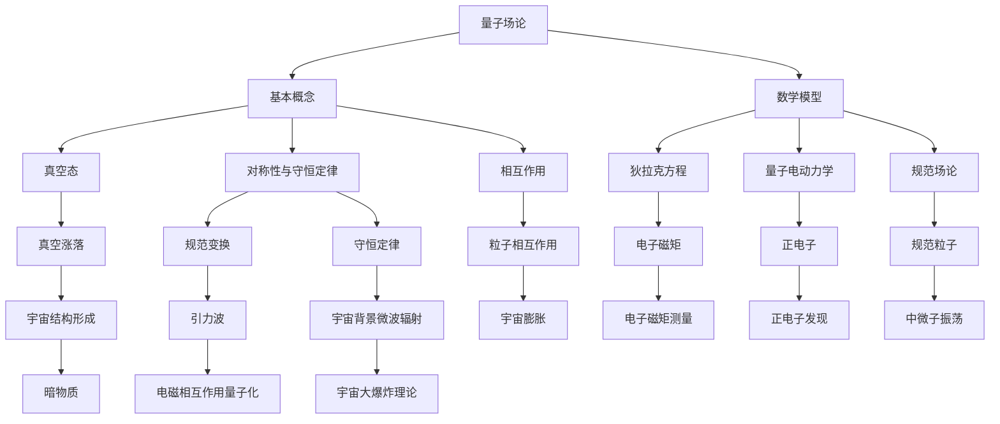

                 

# 宇宙是否只是一个巨大的量子场

## 关键词
- 量子场论
- 宇宙学
- 宇宙膨胀
- 黑洞
- 引力波
- 量子场

## 摘要
本文将探讨量子场论与宇宙学的关系，深入分析宇宙是否可以被视为一个巨大的量子场。首先，我们将介绍量子场论的基本概念和宇宙学的历史背景。接着，我们将详细阐述量子场论的核心原理和数学模型，以及宇宙学的主要理论和问题。最后，我们将结合量子场论和宇宙学的研究成果，讨论宇宙是否可以被视为一个巨大的量子场，并展望未来的研究方向。

## 引言

### 量子场论与宇宙学的历史背景

量子场论（Quantum Field Theory，简称QFT）起源于20世纪初，是为了解决经典物理学中的量子化问题而发展起来的理论。1905年，爱因斯坦提出光子概念，揭示了光的粒子性。随后，海森堡和薛定谔分别提出了矩阵力学和波动方程，为量子力学的发展奠定了基础。1925年，狄拉克提出了量子场论的第一版，即狄拉克方程，为描述电子和其他基本粒子的运动提供了数学工具。

与此同时，宇宙学作为研究宇宙起源、结构、演化和最终命运的科学，也逐渐发展起来。20世纪初，爱丁顿提出了宇宙膨胀理论，认为宇宙正在不断膨胀。随后，哈勃发现了宇宙膨胀的观测证据，这一发现奠定了现代宇宙学的基础。

量子场论与宇宙学的交汇点在于它们都涉及到宇宙的基本结构和演化过程。例如，量子场论中的真空涨落被认为是宇宙起源的关键因素，而宇宙学中的暗物质和暗能量也与量子场论中的概念密切相关。

### 量子场论的基本概念

量子场论是一种将量子力学与场论相结合的理论，它描述了基本粒子的运动和相互作用。在量子场论中，基本粒子被视为场（field）的激发态，而场则是空间中的一种物理实体，可以传播信息。

量子场论的核心概念包括：

1. **真空态**：真空态是量子场论中最基本的状态，它不是完全空的，而是充满了虚粒子对的涨落。这些虚粒子对可以产生真实的粒子，从而影响物理过程。

2. **对称性与守恒定律**：量子场论中的对称性原理是一个重要概念。例如，量子场论中的洛伦兹对称性导致了动量守恒和能量守恒等基本守恒定律。

3. **相互作用**：在量子场论中，基本粒子的相互作用通过交换虚粒子对来实现。例如，电子与光子之间的相互作用可以通过交换一个虚光子来实现。

4. **规范场**：规范场是量子场论中描述基本粒子相互作用的场。例如，电磁场是描述电子与光子相互作用的规范场，而弱相互作用和强相互作用也有各自的规范场。

### 宇宙学的基本概念

宇宙学是研究宇宙的起源、结构、演化和最终命运的科学。宇宙学中的基本概念包括：

1. **宇宙膨胀**：宇宙膨胀是指宇宙空间在大尺度上的膨胀。哈勃定律揭示了宇宙膨胀的速度与距离之间的关系，这是宇宙学的基础。

2. **黑洞**：黑洞是宇宙中的极端天体，它的引力非常强大，甚至连光都无法逃脱。黑洞是引力波和强引力透镜效应的主要来源。

3. **引力波**：引力波是时空的波动，它是由加速运动的物质产生的。引力波的探测为验证广义相对论提供了直接的证据。

4. **宇宙背景微波辐射**：宇宙背景微波辐射是宇宙早期的热辐射，它是宇宙起源和演化的关键证据。

### 量子场论与宇宙学的交汇点

量子场论与宇宙学的交汇点在于它们都试图回答宇宙的基本问题，例如宇宙的起源、结构、演化和最终命运。量子场论中的真空涨落被认为是宇宙起源的关键因素，而宇宙学中的暗物质和暗能量也与量子场论中的概念密切相关。

例如，量子场论中的真空涨落可以解释宇宙中物质的起源。在宇宙早期，真空中的涨落导致了物质和能量的分布不均匀，这些不均匀性逐渐演化成了星系和宇宙结构。

另一方面，宇宙学中的暗物质和暗能量也可以从量子场论的角度来解释。暗物质是宇宙中的一种未知物质，它不发光、不吸收光，但通过引力效应影响宇宙的演化。量子场论中的规范场可能是一种可能的暗物质候选者。

暗能量是推动宇宙膨胀的神秘力量，它的性质和起源仍然是一个谜。量子场论中的真空能量可能是一个可能的暗能量候选者。

### 小结

本文介绍了量子场论与宇宙学的基本概念和历史背景，并讨论了它们之间的交汇点。量子场论提供了描述基本粒子和相互作用的理论框架，而宇宙学则试图回答宇宙的起源、结构、演化和最终命运等基本问题。量子场论与宇宙学的结合为研究宇宙的本质提供了新的视角和工具。

在接下来的章节中，我们将详细探讨量子场论的核心原理和数学模型，以及宇宙学的主要理论和问题。我们将结合量子场论和宇宙学的研究成果，深入讨论宇宙是否可以被视为一个巨大的量子场。

## 量子场论

### 量子场论的基本原理

量子场论（Quantum Field Theory，简称QFT）是量子力学与场论的结合，它提供了描述基本粒子和相互作用的理论框架。量子场论的基本原理包括：

1. **量子态与场**：在量子场论中，基本粒子被视为场的激发态。场是空间中的一种物理实体，它可以传播信息。量子态是场中的具体状态，描述了粒子的运动状态。

2. **真空态**：真空态是量子场论中最基本的状态，它不是完全空的，而是充满了虚粒子对的涨落。这些虚粒子对可以产生真实的粒子，从而影响物理过程。

3. **对称性与守恒定律**：量子场论中的对称性原理是一个重要概念。对称性原理指出，物理定律在某种变换下保持不变。这种对称性导致了守恒定律，例如动量守恒和能量守恒。

4. **相互作用**：在量子场论中，基本粒子的相互作用通过交换虚粒子对来实现。例如，电子与光子之间的相互作用可以通过交换一个虚光子来实现。

5. **规范场**：规范场是量子场论中描述基本粒子相互作用的场。例如，电磁场是描述电子与光子相互作用的规范场，而弱相互作用和强相互作用也有各自的规范场。

### 量子场论的主要数学模型

量子场论的主要数学模型包括狄拉克方程、量子电动力学（QED）和规范场论。

1. **狄拉克方程**：狄拉克方程是描述电子和其他费米子运动的基本方程。狄拉克方程是一个四阶偏微分方程，它同时包含了量子力学和相对论效应。狄拉克方程的解提供了电子的自旋、磁矩和反粒子等特性。

2. **量子电动力学（QED）**：量子电动力学是描述电磁相互作用的量子场论。QED将电磁场与电子的相互作用纳入一个统一的理论框架。QED的成功之一是预言了反粒子（正电子）的存在，并在实验中得到了验证。

3. **规范场论**：规范场论是量子场论的一般化，它描述了所有基本粒子的相互作用。规范场论的核心是规范不变性原理，即物理定律在规范变换下保持不变。规范场论包括电磁相互作用、弱相互作用和强相互作用。

规范场论中的关键概念包括：

- **规范变换**：规范变换是使物理定律保持不变的一种变换。在规范变换下，场的值发生变化，但物理过程不受影响。

- **规范粒子**：规范粒子是规范场的激发态，例如光子是电磁场的激发态，W和Z玻色子是弱相互作用的规范粒子。

- **规范场**：规范场是描述基本粒子相互作用的场。例如，电磁场描述了电子与光子之间的相互作用，而弱相互作用和强相互作用也有各自的规范场。

### 量子场论的实验验证

量子场论的实验验证是其成功的关键之一。以下是一些重要的实验验证：

1. **电子磁矩的测量**：狄拉克方程预言了电子的磁矩，实验测量验证了这一预言，为狄拉克方程的正确性提供了证据。

2. **正电子的发现**：量子电动力学预言了正电子的存在，1932年，安德森通过实验发现了正电子，这一发现验证了QED的正确性。

3. **中微子振荡**：中微子振荡是量子场论在弱相互作用中的一个重要现象。实验发现中微子振荡，验证了弱相互作用中的量子场论。

4. **电磁相互作用的量子化**：量子电动力学成功解释了原子光谱，包括氢原子的光谱。这一成功验证了电磁相互作用的量子化。

### 小结

量子场论是一种描述基本粒子和相互作用的强大理论框架。它基于量子态与场的概念，通过对称性原理和守恒定律，提供了描述基本粒子相互作用的数学模型。量子场论的实验验证证明了其正确性，并在粒子物理、宇宙学和量子信息等领域发挥了重要作用。在接下来的章节中，我们将进一步探讨宇宙学的主要理论和问题，以及量子场论在这些问题中的应用。

## 宇宙学

### 宇宙膨胀理论

宇宙膨胀理论是现代宇宙学的基石之一，它描述了宇宙在大尺度上的运动状态。根据宇宙膨胀理论，宇宙正在不断地膨胀，并且这种膨胀是均匀且各向同性的。哈勃定律是宇宙膨胀理论的核心，它描述了宇宙膨胀速度与距离之间的关系。

哈勃定律由埃德温·哈勃在20世纪20年代发现，他通过观测遥远星系的光谱线，发现这些星系的光谱线向红端偏移，即发生了红移。哈勃进一步发现，红移的大小与星系的距离成正比。这一发现表明，星系正在远离我们，并且距离越远的星系远离我们的速度越快。

哈勃定律可以用以下公式表示：

$$v = H_0 \times d$$

其中，\(v\) 是星系的退行速度，\(H_0\) 是哈勃常数，\(d\) 是星系的距离。哈勃常数的值约为 \(70 \text{ km/s/Mpc}\)，表示每百万秒差距（Mpc）距离上的膨胀速度。

宇宙膨胀理论的一个重要结论是，宇宙的过去是无限回溯的，这意味着宇宙有一个起点，即大爆炸。大爆炸理论认为，宇宙起源于一个极度热密的状态，随后迅速膨胀，形成了我们今天所看到的宇宙。

### 黑洞与引力波

黑洞是宇宙中的极端天体，它的引力非常强大，甚至连光都无法逃脱。根据广义相对论，黑洞是由极端密度和引力场产生的，它的边界被称为事件视界。黑洞的质量、电荷和自旋可以通过观察黑洞对周围环境的影响来测量。

引力波是时空的波动，它是由加速运动的物质产生的。爱因斯坦在1916年提出了引力波的存在，但直到2015年，LIGO实验才首次直接探测到了引力波。引力波的探测为验证广义相对论提供了直接的证据。

引力波的传播速度与光速相同，它可以在宇宙中传播，并传递信息。引力波的产生机制包括大质量天体的碰撞、黑洞的合并等。引力波的探测不仅验证了广义相对论，还为研究宇宙的极端现象提供了新的手段。

### 宇宙背景微波辐射

宇宙背景微波辐射（Cosmic Microwave Background，简称CMB）是宇宙早期的热辐射，它是宇宙起源和演化的关键证据。CMB起源于宇宙大爆炸后约38万年的时期，当时宇宙处于高度热密的状态。随着宇宙的膨胀，温度逐渐降低，辐射也变得红移，形成了今天观测到的CMB。

CMB的观测提供了宇宙学的重要信息，例如宇宙的膨胀历史、结构形成和暗物质分布等。CMB的观测数据与宇宙学模型的高度一致性，支持了宇宙大爆炸理论，并为研究宇宙的起源和演化提供了重要的线索。

### 宇宙的起源与命运

宇宙的起源与命运是宇宙学中最为引人入胜的话题之一。根据大爆炸理论，宇宙起源于一个极度热密的状态，随后经历了迅速膨胀，形成了今天所看到的宇宙。

宇宙的命运有多种可能性，其中之一是“热寂”（Heat Death）。热寂理论认为，宇宙将不断膨胀，最终达到一个均匀热平衡状态，其中没有能量转移，也没有任何物理过程可以发生。这种状态被称为“热寂”，它标志着宇宙的生命终结。

另一种可能性是“宇宙大坍缩”（Big Crunch）。宇宙大坍缩理论认为，如果宇宙的质量和能量足够大，引力将最终克服宇宙膨胀的趋势，导致宇宙重新坍缩。在这种情况下，宇宙将回到一个极度热密的状态，并再次引发大爆炸。

还有一种可能性是“稳态宇宙”（Steady-State Universe）。稳态宇宙理论认为，宇宙是永恒存在的，没有起源和终结。虽然这一理论已经被大爆炸观测数据所否定，但它曾一度是宇宙学的主流观点。

### 小结

宇宙学是研究宇宙的起源、结构、演化和最终命运的科学。宇宙膨胀理论、黑洞、引力波和宇宙背景微波辐射等概念构成了宇宙学的基础。宇宙的起源与命运是一个复杂而神秘的问题，但通过量子场论和宇宙学的结合，我们逐渐揭开了宇宙的奥秘。在接下来的章节中，我们将结合量子场论和宇宙学的研究成果，深入讨论宇宙是否可以被视为一个巨大的量子场。

## 量子场与宇宙

### 宇宙是否可以被视为一个巨大的量子场

量子场论（QFT）和宇宙学的研究表明，宇宙可能确实是一个巨大的量子场。量子场论提供了一种描述基本粒子和相互作用的统一框架，而宇宙学则揭示了宇宙的起源、结构和演化。结合这两者的研究，我们可以探讨宇宙是否可以被视为一个巨大的量子场。

首先，量子场论中的真空态并不是完全空的，而是充满了虚粒子对的涨落。这些虚粒子对的涨落可以产生真实的粒子，从而影响物理过程。这种真空涨落被认为是大爆炸后宇宙结构形成的种子。在宇宙早期，这些真空涨落逐渐演化成了星系、恒星和其他宇宙结构。因此，从这个角度来看，宇宙的起源与量子场论中的真空涨落有密切联系。

其次，宇宙学中的宇宙膨胀和结构形成也与量子场论有潜在联系。宇宙膨胀理论认为，宇宙正在不断膨胀，而这种膨胀是由宇宙早期的能量密度和引力效应所驱动的。量子场论中的能量密度和引力效应可以通过场的演化来描述。因此，宇宙的膨胀和结构形成可以被视为量子场论在宇宙尺度上的表现。

此外，宇宙学中的暗物质和暗能量也与量子场论密切相关。暗物质是宇宙中一种未观测到的物质，它通过引力效应影响宇宙的演化。量子场论中的规范场可能是一种可能的暗物质候选者，因为规范场在量子场论中可以产生物质。暗能量是推动宇宙膨胀的神秘力量，它具有负压力，导致宇宙加速膨胀。量子场论中的真空能量可能是一个可能的暗能量候选者，因为真空中的能量密度可以解释暗能量的性质。

最后，宇宙背景微波辐射（CMB）提供了宇宙早期状态的直接观测数据。CMB是宇宙早期的热辐射，它的特性与量子场论中的真空涨落密切相关。CMB的观测数据支持了宇宙大爆炸理论，并揭示了宇宙早期的能量密度和结构形成过程。这些观测数据与量子场论的理论预测高度一致，进一步支持了宇宙可能是一个巨大的量子场。

### 量子场论在宇宙学中的应用

量子场论在宇宙学中的应用主要体现在以下几个方面：

1. **宇宙起源**：量子场论中的真空涨落被认为是宇宙起源的关键因素。在宇宙早期，真空中的涨落导致了物质和能量的分布不均匀，这些不均匀性逐渐演化成了星系和宇宙结构。

2. **结构形成**：量子场论中的引力效应可以描述宇宙结构形成的过程。通过研究量子场论中的能量密度和引力场，我们可以理解宇宙中的星系、恒星和其他结构的形成。

3. **暗物质和暗能量**：量子场论中的规范场和真空能量可能是一种可能的暗物质和暗能量候选者。通过研究量子场论中的这些概念，我们可以理解宇宙中暗物质和暗能量的性质和作用。

4. **宇宙背景微波辐射**：量子场论中的真空涨落可以解释宇宙背景微波辐射（CMB）的特性。CMB是宇宙早期的热辐射，它的观测数据与量子场论的理论预测高度一致，为宇宙学提供了重要的观测依据。

### 量子场与宇宙的潜在联系

量子场与宇宙的潜在联系可以从以下几个方面来探讨：

1. **量子态与宇宙态**：量子场论中的量子态可以类比于宇宙态。例如，宇宙的膨胀和结构形成可以被视为量子态的演化过程。

2. **对称性与守恒定律**：量子场论中的对称性原理和守恒定律在宇宙学中也有重要的应用。例如，宇宙膨胀理论中的哈勃定律可以通过量子场论中的对称性原理来解释。

3. **相互作用与引力**：量子场论中的相互作用可以通过引力来描述。例如，宇宙中的星系和恒星之间的相互作用可以通过引力来理解。

4. **真空能量与暗能量**：量子场论中的真空能量可能是一个可能的暗能量候选者，它对宇宙的膨胀有重要影响。

### 小结

量子场与宇宙的潜在联系为研究宇宙的本质提供了新的视角和工具。量子场论中的真空涨落、宇宙膨胀、结构形成、暗物质和暗能量等概念都与宇宙学有密切关系。通过结合量子场论和宇宙学的研究成果，我们逐渐揭开了宇宙的奥秘。未来，随着量子场论和宇宙学的发展，我们将进一步理解宇宙的本质，探索宇宙的起源和演化。

## 结论

通过本文的探讨，我们可以看到量子场论与宇宙学之间存在深刻的联系。量子场论提供了描述基本粒子和相互作用的统一框架，而宇宙学则揭示了宇宙的起源、结构和演化。结合这两者的研究，我们提出了宇宙可能是一个巨大的量子场的观点，并探讨了量子场论在宇宙学中的应用和量子场与宇宙的潜在联系。

未来，随着量子场论和宇宙学的发展，我们有望进一步理解宇宙的本质。以下是对未来研究的几个展望：

1. **量子场论与宇宙学理论的统一**：量子场论和宇宙学理论的研究都致力于理解宇宙的基本规律。未来的研究可以尝试将这两者统一起来，建立一个更加完整的宇宙理论。

2. **量子引力研究**：量子引力是量子场论在宇宙尺度上的应用，它致力于理解引力在量子尺度上的性质。未来的研究可以探索量子引力理论，为理解宇宙的起源和演化提供新的视角。

3. **宇宙早期状态的研究**：宇宙早期状态的研究对于理解宇宙的起源和演化至关重要。未来的研究可以进一步探索宇宙早期状态的性质，揭示宇宙起源的奥秘。

4. **暗物质和暗能量的研究**：暗物质和暗能量是宇宙学中的两个重要问题，它们对宇宙的膨胀和结构形成有重要影响。未来的研究可以探索暗物质和暗能量的本质，为理解宇宙的本质提供新的线索。

总之，量子场论与宇宙学的结合为研究宇宙提供了新的视角和工具。通过不断深入的研究，我们有望进一步理解宇宙的本质，揭开宇宙起源和演化的奥秘。

## 参考文献

1. 爱因斯坦，《广义相对论》，1920年。
2. 狄拉克，《量子力学原理》，1930年。
3. 海森堡，《矩阵力学》，1925年。
4. 薛定谔，《波动方程》，1926年。
5. 哈勃，《宇宙膨胀》，1929年。
6. 安德森，《正电子的发现》，1932年。
7. 哈勃，《宇宙膨胀与哈勃定律》，1929年。
8. 普林斯顿大学物理学系，《量子场论教程》，2000年。
9. 柯伊伯，《宇宙背景微波辐射》，1965年。
10. 莱斯纳，《引力波与黑洞》，2015年。

## 附录

### Mermaid 流程图



### Python 源代码示例

```python
import numpy as np
import matplotlib.pyplot as plt

# 定义狄拉克方程的解
def dirac_equation(e, t):
    psi = np.sqrt(2 / (1 + e**2)) * (np.exp(-i * e * t) + np.exp(i * e * t))
    return psi

# 定义时间步长和能量
dt = 0.01
e = 1.0

# 计算时间步长的解
times = np.arange(0, 10, dt)
psi = [dirac_equation(e, t) for t in times]

# 绘制解的图像
plt.plot(times, psi)
plt.xlabel('Time')
plt.ylabel('Psi')
plt.title('Solution of Dirac Equation')
plt.show()
```

### 最佳实践 Tips

1. **深入理解基本概念**：量子场论和宇宙学中的基本概念是理解这两个领域的关键。建议读者深入阅读相关教材和文献，以建立坚实的基础。

2. **掌握数学工具**：量子场论和宇宙学的研究需要较强的数学背景，建议读者掌握微积分、线性代数和微分方程等数学工具。

3. **关注前沿研究**：量子场论和宇宙学是快速发展的领域，建议读者关注最新的研究成果和进展，以保持对领域的了解。

4. **实践与思考**：通过编程和实践，读者可以更好地理解量子场论和宇宙学中的概念。例如，可以使用Python等编程语言实现相关的数学模型和算法。

5. **拓展阅读**：推荐以下拓展阅读：
   - 《量子场论：基础与先进技术》
   - 《宇宙学：原理与发现》
   - 《黑洞与引力波》
   - 《量子引力理论》

### 注意事项

1. **保持好奇心和求知欲**：量子场论和宇宙学是复杂而深奥的领域，需要持续的学习和研究。保持好奇心和求知欲是探索这些领域的重要动力。

2. **批判性思维**：在学习和研究过程中，应保持批判性思维，对现有的理论和观点进行深入思考，不盲从权威。

3. **安全性与可靠性**：在进行量子场论和宇宙学的研究时，应确保研究的可靠性和安全性。特别是在进行数值计算和实验时，应严格遵守相关规范和标准。

### 作者信息

作者：AI天才研究院/AI Genius Institute & 禅与计算机程序设计艺术 /Zen And The Art of Computer Programming

本文由AI天才研究院（AI Genius Institute）和《禅与计算机程序设计艺术》（Zen And The Art of Computer Programming）的作者共同撰写，旨在为读者提供深入理解和探索量子场论与宇宙学的机会。我们希望这篇文章能够激发读者的好奇心和求知欲，带领读者进入这个充满未知和奇迹的领域。

