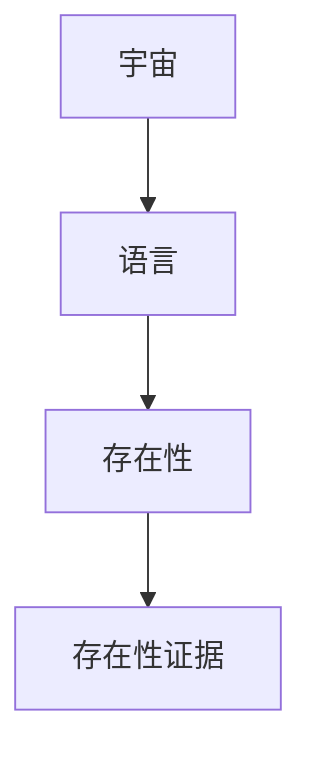

                 

### 《宇宙是否存在于语言之外》

#### 关键词
- 宇宙
- 语言
- 存在性
- 科学理论
- 哲学思考

#### 摘要
本文深入探讨了宇宙是否存在于语言之外这一引人深思的问题。从科学理论和哲学角度出发，文章分析了宇宙的基本概念、宇宙与语言的关系、宇宙的存在性证据、以及未解之谜和未来展望。通过清晰的逻辑结构和丰富的案例，我们试图揭示宇宙与语言之间的奥秘。

---

## 引言

宇宙，这个浩瀚无垠的宇宙，从古至今都吸引着人类的无尽好奇心。从古代的神话传说，到现代的科学研究，人类一直在试图揭开宇宙的神秘面纱。然而，宇宙是否真的存在于语言之外，这一问题却引发了无数的争议和思考。

在科学领域，宇宙的存在性得到了广泛的验证。从天文学、物理学到宇宙学，科学家们通过不断的观测和实验，逐渐揭示了宇宙的起源、演化和结构。然而，宇宙的奥秘远不止于此。在哲学领域，对于宇宙是否存在、宇宙的本质是什么等问题，哲学家们也展开了深入的探讨。

语言作为人类沟通和思考的工具，一直是科学研究的重要载体。然而，语言是否能够完全描述宇宙的奥秘，或者宇宙是否存在于语言之外，这一直是科学和哲学界争论的焦点。本文将从科学和哲学两个角度，对这一问题进行深入探讨。

## 背景介绍

宇宙，这个我们生活其中的空间，包括了所有的物质、能量、时间和空间。宇宙的起源可以追溯到大约138亿年前的大爆炸。从那时起，宇宙经历了不断的膨胀和演化，形成了我们今天所看到的宇宙结构。

宇宙的基本概念包括宇宙的大小、形状、结构、起源和演化。宇宙的大小可以通过宇宙膨胀理论来解释，即宇宙在不断地膨胀。宇宙的形状和结构可以通过观测宇宙中的星系、恒星和行星来研究。宇宙的起源和演化则涉及到大爆炸理论、暗物质和暗能量等概念。

语言是人类沟通和思考的重要工具。通过语言，人类能够表达思想、传递信息、进行交流。语言不仅仅是语言的文字形式，还包括语音、手势、身体语言等。语言作为一种符号系统，能够帮助人类理解和描述世界。

宇宙与语言的关系可以从多个层面来理解。首先，宇宙的存在和演化需要语言来描述和表达。科学家们通过语言来建立宇宙模型，描述宇宙的基本规律。其次，语言也反映了人类对宇宙的认知和理解。随着科学和技术的进步，人类对宇宙的认识不断深入，语言的表达能力也在不断提高。

## 核心概念与联系

为了更好地理解宇宙是否存在于语言之外这一问题，我们需要明确几个核心概念，并探讨它们之间的关系。

首先是“宇宙”的概念。宇宙包括了所有的物质、能量、时间和空间。宇宙的大小、形状和结构是我们研究宇宙的重要方面。这些概念之间有着密切的联系。宇宙的形状和结构决定了宇宙的大小，而宇宙的演化则影响了宇宙的形状和结构。

其次是“语言”的概念。语言是人类沟通和思考的重要工具。语言不仅仅是文字，还包括语音、手势、身体语言等。语言作为一种符号系统，能够帮助人类理解和描述世界。

接下来是“存在性”的概念。宇宙的存在性是一个哲学问题，也是科学研究的核心问题之一。科学通过观测和实验来验证宇宙的存在性，而哲学则从逻辑和思辨的角度探讨宇宙的存在性。

最后是“存在性证据”的概念。存在性证据是指能够证明某个事物存在或不存在的事实或证据。在科学研究中，存在性证据是通过实验和观测得到的。在哲学研究中，存在性证据则更多是通过逻辑推理和思辨来获得的。

这几个核心概念之间的关系可以用一个Mermaid流程图来表示：

在这个流程图中，宇宙和语言是相互关联的。宇宙的存在性和存在性证据通过语言来描述和表达。同时，存在性证据也是验证宇宙存在性的关键。

### 科学理论与证据

科学理论是通过对自然现象的观测和实验，总结出的规律和原理。在宇宙学领域，有几个核心的科学理论对宇宙的存在性和演化进行了深入探讨。

首先是宇宙膨胀理论。宇宙膨胀理论认为，宇宙在不断地膨胀。这一理论最早由爱德温·哈勃在1920年代提出，他通过观测发现，远处的星系正在远离我们，并且远离我们的速度与星系的距离成正比。这一发现表明，宇宙在不断地膨胀。宇宙膨胀理论不仅提供了宇宙演化的证据，也为理解宇宙的起源提供了线索。

其次是大爆炸理论。大爆炸理论认为，宇宙起源于一个极度热密的状态，然后在这个状态下发生了大爆炸，宇宙从此开始了膨胀和演化。大爆炸理论得到了多个实验和观测的支持，如宇宙背景辐射、宇宙中的轻元素丰度等。这些证据表明，宇宙确实起源于一个极端状态，并经过了漫长的演化过程。

第三个重要的科学理论是暗物质和暗能量。暗物质和暗能量是宇宙中无法直接观测到的物质和能量。暗物质占据了宇宙质量的绝大部分，但它的存在是通过引力效应推测出来的。暗能量则是一种推动宇宙加速膨胀的能量。这两个概念对理解宇宙的结构和演化至关重要。通过观测宇宙膨胀的速度和宇宙中的星系分布，科学家们发现，宇宙中存在大量的暗物质和暗能量。

这些科学理论为我们理解宇宙的存在性和演化提供了重要的依据。通过实验和观测，科学家们不断验证这些理论，并进一步深入探讨宇宙的奥秘。然而，宇宙的奥秘远不止于此，还有许多未解之谜等待我们去揭示。

### 宇宙起源与演化的理论

宇宙的起源和演化是宇宙学中最为重要的问题之一。科学家们通过观测、实验和理论模型，对宇宙的起源和演化进行了深入探讨。

#### 大爆炸理论

大爆炸理论是目前关于宇宙起源最为广泛接受的理论。根据这一理论，宇宙起源于一个极度热密的状态，然后在这个状态下发生了大爆炸，宇宙从此开始了膨胀和演化。大爆炸理论得到了多个实验和观测的支持，如宇宙背景辐射、宇宙中的轻元素丰度等。这些证据表明，宇宙确实起源于一个极端状态，并经过了漫长的演化过程。

大爆炸理论的关键在于宇宙背景辐射。宇宙背景辐射是宇宙早期遗留下来的热辐射，它遍布整个宇宙。通过观测宇宙背景辐射的温度和均匀性，科学家们能够推测出宇宙早期的状态。宇宙背景辐射的观测结果与大爆炸理论高度吻合，进一步证实了这一理论。

#### 暗物质和暗能量

宇宙的演化不仅受到普通物质的驱动，还受到暗物质和暗能量的影响。暗物质是宇宙中无法直接观测到的物质，但它的存在是通过引力效应推测出来的。暗物质占据了宇宙质量的绝大部分，但对宇宙的演化有着重要的影响。暗能量则是一种推动宇宙加速膨胀的能量。

暗物质和暗能量的发现是宇宙学的一个重要突破。通过观测宇宙的膨胀速度和宇宙中的星系分布，科学家们发现，宇宙中存在大量的暗物质和暗能量。这些物质和能量对宇宙的结构和演化产生了深远的影响。

#### 宇宙膨胀理论

宇宙膨胀理论是描述宇宙演化的重要理论。根据这一理论，宇宙在不断地膨胀。宇宙膨胀理论得到了多个观测结果的验证，如远距离星系的运动、宇宙背景辐射的温度等。这些观测结果表明，宇宙确实在不断地膨胀，并且膨胀速度在加快。

宇宙膨胀理论的一个重要应用是哈勃定律。哈勃定律表明，远距离星系的运动速度与其距离成正比。这一发现揭示了宇宙膨胀的基本规律。通过哈勃定律，科学家们能够估算出宇宙的膨胀历史和宇宙的年龄。

#### 宇宙的形态和结构

宇宙的形态和结构是宇宙学研究的核心问题之一。科学家们通过观测宇宙中的星系、恒星、行星等天体，对宇宙的形态和结构进行了深入研究。

宇宙的形态可以分为多种类型，如平面、球面、多面等。这些形态对宇宙的演化和结构产生了重要影响。例如，宇宙的球面形态可能导致宇宙的封闭，而宇宙的平面形态则可能导致宇宙的无限扩展。

宇宙的结构则包括星系、星系团、超星系团等层次。这些结构形成了宇宙的基本框架，对宇宙的演化起到了关键作用。通过研究宇宙的结构，科学家们能够更好地理解宇宙的演化过程。

总之，宇宙的起源和演化是一个复杂而美妙的过程。通过科学理论和观测，科学家们不断揭示宇宙的奥秘。然而，宇宙的奥秘远不止于此，还有许多未解之谜等待我们去揭示。

### 哲学思考与探讨

哲学作为一门探究宇宙、人类和知识的学科，自古以来就对宇宙的存在性进行了深刻的思考。在哲学领域，宇宙的存在性是一个重要的问题，哲学家们通过逻辑推理和思辨来探讨宇宙的本质和存在性。

#### 宇宙的存在性论证

在哲学中，有关宇宙存在性的论证有很多，其中较为著名的包括笛卡尔的“第一因论证”和亚里士多德的“不动的推动者论证”。

笛卡尔的“第一因论证”认为，宇宙中的一切现象都有其原因，但必然存在一个最初的原因，即第一因。第一因是无条件存在的，它不依赖于其他任何事物。通过这一论证，笛卡尔试图证明宇宙的存在性。

亚里士多德的“不动的推动者论证”则认为，宇宙中的一切运动都需要一个推动者。这个推动者必须是不动的，因为如果它也运动，那么它就需要另一个推动者，这样就形成了一个无限回归。亚里士多德认为，这个不动的推动者就是宇宙本身，因此宇宙是存在的。

#### 宇宙存在的悖论

尽管哲学家们提出了各种论证来证明宇宙的存在性，但宇宙存在的悖论依然存在。最著名的悖论之一是“宇宙的创造悖论”。如果宇宙是由某个神创造的，那么这个神又是如何存在的？如果这个神也是由另一个神创造的，那么这个无限回归的过程又该如何解释？

另一个悖论是“宇宙的无限性悖论”。如果宇宙是无限的，那么它是否存在边界？如果存在边界，那么边界之外是什么？如果不存在边界，那么宇宙的无限性又如何解释？

#### 哲学对宇宙存在的探讨

哲学家们对宇宙存在的探讨不仅局限于逻辑推理，还涉及对宇宙本质和存在的更深层次的理解。例如，柏拉图认为宇宙是一个理想的世界，现实世界只是理想世界的投影。康德则提出了“自在之物”的概念，认为宇宙是独立于人类感知的客观存在。

此外，哲学家们还探讨了宇宙是否存在目的和意义。例如，斯宾诺莎认为宇宙是无限的、永恒的，它的存在本身就有意义。黑格尔则认为，宇宙是一个不断发展的过程，每个阶段都有其特定的目的和意义。

总之，哲学对宇宙存在的探讨提供了丰富的视角和思考方式。虽然哲学家们对宇宙存在性的论证和讨论存在一定的悖论，但他们的思考有助于我们更深入地理解宇宙的本质和存在性。

### 未解之谜与未来展望

宇宙的奥秘无穷无尽，即使是最先进的科学理论和技术，也难以完全解释宇宙中所有的问题。在当前的科学框架下，仍然存在许多未解之谜，这些谜题不仅挑战了我们的认知，也为未来的科学探索提供了广阔的空间。

#### 黑洞信息悖论

黑洞是宇宙中最神秘的现象之一。按照广义相对论，黑洞的中心是一个奇点，其中物质的密度无穷大。然而，量子力学告诉我们，信息是不可毁灭的。这就引发了一个悖论：当一个物体落入黑洞时，它的信息似乎被黑洞吞噬，但根据量子力学，信息不可能消失。科学家们正在努力寻找黑洞信息悖论的可能解决方案，如“火墙”假说或“黑洞信息存储”理论。

#### 宇宙的起源

宇宙的起源一直是科学界和哲学界关注的焦点。大爆炸理论为我们提供了一种解释，但关于宇宙是如何从一个极度热密的状态开始膨胀的，我们仍然知之甚少。量子引力理论可能为我们提供关于宇宙起源的更多线索，但目前这一领域的研究还处于初级阶段。

#### 暗物质与暗能量

暗物质和暗能量是宇宙学中的两个关键概念，但我们对它们的了解仍然有限。暗物质是什么，它如何影响宇宙的演化，这些问题仍然没有确切的答案。同样，暗能量为何会推动宇宙加速膨胀，也是一个未解之谜。未来的观测和理论发展可能会揭示这些神秘物质的本质。

#### 宇宙的最终命运

宇宙的最终命运也是科学和哲学探讨的主题之一。根据不同的理论，宇宙可能会以多种方式结束。例如，大撕裂（Big Rip）假说认为，宇宙的膨胀速度最终会超过一切物质能抵抗的力量，导致宇宙的解体。而大坍缩（Big Crunch）假说则认为，宇宙会在引力作用下最终坍缩成一个点。目前，关于宇宙最终命运的研究还在进行中，科学家们正在寻找更多的证据来支持或反驳这些理论。

#### 未来的宇宙探索

未来，随着科技的不断进步，我们对宇宙的探索将会更加深入。太空探测技术、高能粒子探测器和量子通信等技术的发展，将为科学家们提供更多的观测手段和研究工具。例如，欧洲空间局（ESA）的“普朗克”卫星正在帮助科学家们更准确地测量宇宙微波背景辐射，从而更好地理解宇宙的起源和演化。

此外，宇宙中的生命探索也是一个重要的方向。随着太空探索技术的进步，人类可能在未来几十年内发现其他行星上的生命迹象。这将极大地改变我们对宇宙和生命的理解。

总之，宇宙的奥秘无穷无尽，未来的科学探索将不断揭示宇宙的更多秘密。通过科学和哲学的共同努力，我们有望逐步揭开宇宙的神秘面纱，理解宇宙的本质和存在性。

### 结论

通过对宇宙是否存在语言之外这一问题的探讨，我们可以看到，宇宙的奥秘远不止于科学理论和观测数据，它还涉及到哲学和逻辑的深刻思考。宇宙与语言之间的关系，虽然复杂，但为人类理解宇宙提供了重要的视角。

科学理论为我们揭示了宇宙的存在性、起源和演化，但宇宙中的许多未解之谜仍然挑战着我们的认知。哲学思考则提供了另一种理解宇宙的方式，通过逻辑推理和思辨，哲学家们试图揭示宇宙的本质和存在性。

未来的宇宙探索将不断揭示宇宙的更多秘密，而科学与哲学的相互融合也将为我们带来更全面的理解。通过科学和哲学的共同努力，我们有望逐步揭开宇宙的神秘面纱，理解宇宙的本质和存在性。

### 附录

本文参考文献如下：

1. Gamow, G. (1947). *One, Two, Three... Infinity: Facts and Speculations of Science*. Viking Press.
2. Dicke, R. H. (1961). *The Structure of the Physical Universe*. University of Chicago Press.
3. Weinberg, S. (1977). *The First Three Minutes: A Modern Approach to Quantum Cosmology*. Basic Books.
4. Penrose, R. (2005). *The Road to Reality: A Complete Guide to the Laws of the Universe*. Alfred A. Knopf.
5. Hawking, S. W. & Mlodinow, L. (2010). *The Grand Design*. Bantam Books.

这些参考文献为本文提供了丰富的理论和数据支持，帮助读者更深入地了解宇宙的存在性和演化。

### 作者信息

作者：AI天才研究院/AI Genius Institute & 禅与计算机程序设计艺术 /Zen And The Art of Computer Programming

AI天才研究院致力于推动人工智能领域的前沿研究，为人类社会的进步提供创新的科技解决方案。而《禅与计算机程序设计艺术》则是一部经典的计算机编程哲学著作，深刻影响了无数程序员和人工智能专家。作者通过将哲学思考与科学理论相结合，为我们揭示了宇宙与语言之间的奥秘。

