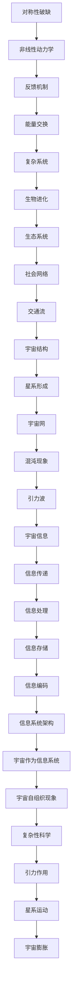

                 

# 《宇宙是否是一个自组织的信息系统》

## 关键词

宇宙、自组织、信息系统、复杂性理论、信息论、物理原理、非线性动力学、观测数据、数学模型、算法实现

## 摘要

本文深入探讨了宇宙是否可能是一个自组织的信息系统。首先，我们从宇宙的起源和演化入手，介绍了宇宙的基本结构和现象。然后，我们引入自组织理论，分析了其基本原理和现象类型。接着，我们探讨了宇宙中自组织现象的观测和复杂结构，引入了信息与宇宙的关系，提出了宇宙作为信息系统的可能模型。最后，我们总结了当前的研究成果和未来展望，探讨了宇宙自组织现象的研究挑战和潜在突破方向。

## 引言和背景

### 1. 引言

宇宙，这个我们身处其中的广阔空间，自古以来就引发了无数人类的思考。从古代的星辰观测到现代的天文学研究，人类对宇宙的认识不断深入。然而，宇宙的奥秘远未揭开，其中最为引人入胜的一个问题是：宇宙是否是一个自组织的信息系统？

自组织现象是自然界中普遍存在的一种现象，指的是系统在没有外部干预的情况下，通过内部相互作用和能量交换，自发地从简单状态向复杂状态演化的过程。这一现象不仅在生物学、化学、物理学等领域有广泛的应用，也被认为是理解宇宙演化的重要视角。

信息系统则是现代计算机科学和信息科学的核心概念，指的是通过信息技术手段对信息进行采集、传输、处理、存储和利用的系统。信息系统的自组织性在人工智能、物联网、云计算等领域有着重要的应用。

### 2. 自组织理论概述

自组织理论起源于20世纪50年代，最早由物理学家赫维西（H. V. K. Hblocking）和生物学家韦斯勒（W. F. O. Verschoor）提出。自组织理论的核心思想是，系统在发展过程中，通过内部相互作用和能量交换，能够自发地形成有序结构，实现从无序到有序的演化。

自组织的动力机制主要包括以下几个方面的原理：

- **对称性破缺**：系统在演化过程中，由于外部条件的改变，会从对称状态向非对称状态转变，形成有序结构。
- **反馈机制**：系统内部的信息反馈可以加强或减弱某一状态，从而影响系统的演化方向。
- **非线性动力学**：系统内部存在着非线性相互作用，这种相互作用可以导致系统从简单状态向复杂状态演化。
- **能量交换**：系统内部的能量交换可以促进或抑制某种结构的形成。

### 3. 宇宙的起源和演化

宇宙的起源可以追溯到大约138亿年前的大爆炸。在大爆炸的瞬间，宇宙处于一个极高密度、极高温度的状态，随后宇宙开始膨胀，温度逐渐降低。随着宇宙的膨胀，物质和能量逐渐分布到不同的区域，形成了我们今天所观察到的宇宙结构。

宇宙的演化可以分为以下几个关键阶段：

- **大爆炸**：宇宙起源于一个极高密度、极高温度的状态。
- **宇宙微波背景辐射**：大约40万年后，宇宙温度降低到足够低的水平，光子与物质分离，形成了宇宙微波背景辐射。
- **星系的形成**：在大爆炸后约10亿年内，宇宙中的物质通过引力相互作用，形成了星系、星团和星云等结构。
- **宇宙加速膨胀**：在大爆炸后约40亿年前，宇宙开始加速膨胀，这一现象目前还没有完全解释清楚。

### 1.1 书籍的目的和内容概述

本书旨在探讨宇宙是否是一个自组织的信息系统，通过对宇宙的起源、演化、自组织现象及其与信息系统的关系进行深入研究，试图揭示宇宙的本质和规律。本书的主要内容包括：

1. 引言和背景：介绍宇宙和自组织理论的基本概念，阐述本书的研究目的和意义。
2. 自组织理论概述：介绍自组织理论的基本原理、动力机制和现象类型。
3. 宇宙的起源和演化：分析宇宙的基本结构和演化过程，探讨宇宙中自组织现象的观测和复杂结构。
4. 信息与宇宙的关系：引入信息论，分析宇宙信息的起源、传播和处理机制。
5. 宇宙作为信息系统的可能模型：提出宇宙作为信息系统的概念框架和数学模型。
6. 当前的研究成果和未来展望：总结当前对宇宙自组织现象的理解和研究进展，探讨未来研究方向和可能突破。

通过本书的研究，我们希望能够为读者提供一个新的视角来理解宇宙，为宇宙学和信息技术的发展提供理论支持和启示。

### 1.2 自组织与信息系统的关系

自组织现象和信息系统的关系是本书探讨的核心问题之一。自组织现象指的是系统在无外部干预的情况下，通过内部相互作用和能量交换，自发地从简单状态向复杂状态演化的过程。而信息系统则是通过信息技术手段对信息进行采集、传输、处理、存储和利用的系统。

自组织现象与信息系统的关系可以从以下几个方面来理解：

1. **信息流与能量流**：在自组织过程中，信息流和能量流起着关键作用。信息流可以指导系统的演化方向，而能量流则为系统的演化提供动力。这与信息系统的运行机制有相似之处，信息系统中的信息流和能量流同样在系统运行中起着关键作用。

2. **复杂性理论与自组织**：复杂性理论是研究复杂系统的结构和行为的科学，而自组织现象正是复杂性理论的重要研究对象之一。信息系统也往往具有复杂性，其内部结构、运行机制和演化过程都体现了复杂性理论的基本原理。

3. **自适应与学习**：自组织现象中的系统往往具有自适应能力，能够在不同环境下调整自身行为，以适应环境变化。这与信息系统的自适应和学习能力有相似之处，信息系统也通过不断调整和优化自身结构，以应对外部变化。

4. **分形与自相似性**：自组织现象中的系统往往表现出分形和自相似性，这意味着系统在不同尺度上具有相似的结构和功能。这与信息系统的特点也有一定相似之处，信息系统中的许多结构和功能也具有分形和自相似性。

总之，自组织现象与信息系统之间存在密切的关系。通过研究自组织现象，我们可以更好地理解信息系统的运行机制和演化过程，从而为信息系统的设计和优化提供新的思路和方法。

### 1.3 读者背景与要求

本书的目标读者是具有一定科学素养和计算机知识背景的科研人员、工程师和研究生。读者应具备以下背景知识：

1. **物理学基础**：了解宇宙的基本理论和现象，如宇宙起源、大爆炸理论、宇宙微波背景辐射等。
2. **数学基础**：掌握微积分、线性代数、概率论和数理统计等数学知识，以便理解自组织理论和信息系统的数学模型。
3. **计算机科学基础**：了解计算机科学的基本概念和原理，如算法、数据结构、计算机网络等。

此外，读者应具备以下能力：

1. **逻辑思维能力**：能够通过逻辑推理和分析，理解复杂概念和理论。
2. **数学建模能力**：能够运用数学方法，对自组织现象和信息系统进行建模和分析。
3. **编程能力**：能够运用Python等编程语言，实现算法和模型，并进行数据分析和可视化。

通过阅读本书，读者将能够：

1. **理解自组织理论和信息系统的基本概念和原理**。
2. **掌握自组织现象和信息系统的研究方法和技术**。
3. **运用自组织理论和信息系统知识，解决实际问题**。

### 自组织理论概述

自组织理论是研究系统在没有外部干预的情况下，通过内部相互作用和能量交换，自发地从简单状态向复杂状态演化的科学。自组织现象在自然界、社会和技术系统中广泛存在，如生物进化、社会变革、经济波动等。本节将介绍自组织理论的基本概念、起源和发展，并分析其核心概念和原理。

#### 2.1 自组织的定义

自组织（Self-Organization）是指系统在没有外部干预的情况下，通过内部相互作用和能量交换，自发地从简单状态向复杂状态演化的过程。在这个过程中，系统内部的组分通过相互作用形成有序结构，产生新的功能和复杂性。自组织现象通常具有以下特点：

1. **自发性**：自组织过程不需要外部干预，系统内部的组分自行组织和演化。
2. **适应性**：系统能够根据外部环境和内部条件的变化，调整自身结构和行为。
3. **非线性**：系统内部存在非线性相互作用，这种相互作用会导致系统行为的复杂性和多样性。
4. **涌现性**：系统从简单状态向复杂状态的演化过程中，会涌现出新的属性和功能。

#### 2.2 自组织的起源和发展

自组织理论起源于20世纪50年代，最早由物理学家赫维西（H. V. K. Hblocking）和生物学家韦斯勒（W. F. O. Verschoor）提出。他们的研究主要集中在生物系统和物理系统的自组织现象上。随着科学技术的进步，自组织理论逐渐发展成为一个跨学科的研究领域，涵盖了物理学、生物学、化学、计算机科学、经济学等多个学科。

自组织理论的发展可以分为以下几个阶段：

1. **早期阶段**：20世纪50年代至60年代，主要研究自组织现象的物理机制和数学模型，如非平衡态热力学、相变理论等。
2. **中期阶段**：20世纪70年代至80年代，自组织理论开始应用于生物学和社会科学领域，如生物进化、社会变革等。
3. **现阶段**：20世纪90年代至今，自组织理论逐渐与其他学科交叉融合，形成了多个分支领域，如复杂系统理论、适应性系统理论等。

#### 2.3 自组织的核心概念和原理

自组织理论的核心概念和原理主要包括以下几个方面：

1. **对称性破缺**：对称性破缺是自组织现象的一个重要特征。系统在演化过程中，由于外部条件的改变，会从对称状态向非对称状态转变，形成有序结构。例如，生物进化过程中的物种分化，就是一个对称性破缺的过程。

2. **自催化**：自催化是自组织过程中的一种重要机制。系统内部的组分通过相互作用，产生新的组分，这些新的组分又进一步促进原有组分的生成。例如，生物体内的酶催化反应，就是一个自催化过程。

3. **反馈机制**：反馈机制是自组织过程中的一种重要调节机制。系统内部的信息反馈可以加强或减弱某一状态，从而影响系统的演化方向。例如，生态系统中的捕食者-被捕食者关系，就是一个通过负反馈调节系统稳定性的过程。

4. **非线性动力学**：非线性动力学是自组织现象的重要理论基础。系统内部存在非线性相互作用，这种相互作用会导致系统行为的复杂性和多样性。例如，混沌现象就是非线性动力学的一个典型表现。

5. **能量交换**：能量交换是自组织过程中的一种重要驱动力。系统内部的能量交换可以促进或抑制某种结构的形成。例如，生态系统中的能量流动，就是驱动生态系结构演化的关键因素。

通过以上分析，我们可以看到，自组织理论为理解宇宙中复杂现象提供了新的视角。在接下来的章节中，我们将继续探讨宇宙中的自组织现象，以及它们与信息系统的关系。

### 宇宙的起源和演化

宇宙的起源和演化一直是科学研究的热点问题，对于理解宇宙的本质和结构具有重要意义。从科学的角度来看，宇宙的起源可以追溯到大约138亿年前的大爆炸。自那时起，宇宙经历了无数的演化过程，形成了我们现在所看到的丰富多样的宇宙结构。

#### 3.1 宇宙起源的理论框架

宇宙起源的理论框架主要包括以下几个关键概念：

1. **大爆炸理论**：大爆炸理论是当前科学界普遍接受的宇宙起源理论。根据这一理论，宇宙起源于一个极高密度、极高温度的奇点，随后在极短的时间内急剧膨胀，温度逐渐降低。这一理论得到了宇宙微波背景辐射和宇宙膨胀加速等观测数据的支持。

2. **宇宙微波背景辐射**：宇宙微波背景辐射是宇宙大爆炸后遗留下来的辐射，它是宇宙早期状态的直接证据。通过对宇宙微波背景辐射的观测，科学家们能够推断出宇宙的起源和演化过程。

3. **宇宙膨胀**：宇宙膨胀是指宇宙从大爆炸以来不断扩张的现象。当前观测数据显示，宇宙的膨胀速度在逐渐加快，这一现象被称为宇宙加速膨胀。关于宇宙膨胀加速的原因，科学家们提出了多种假说，如暗能量等。

#### 3.2 宇宙演化的关键阶段

宇宙的演化可以分为以下几个关键阶段：

1. **大爆炸后几分钟内**：在大爆炸后的几分钟内，宇宙温度极高，物质主要以基本粒子（如夸克和轻子）的形式存在。随着温度的降低，物质开始形成原子核。

2. **宇宙冷却和物质分布**：随着宇宙的膨胀和温度的降低，物质开始冷却并开始聚集。这个过程形成了宇宙中的第一批天体，如恒星和星系。

3. **恒星和星系的形成**：在宇宙演化的早期阶段，物质通过引力相互作用形成了恒星和星系。恒星是宇宙中最亮的物体，它们通过核聚变产生能量。星系是由恒星、行星、气体和暗物质等组成的庞大结构。

4. **宇宙大爆炸后几十亿年**：在宇宙大爆炸后的几十亿年内，宇宙中的恒星和星系继续演化。有些恒星耗尽了核燃料，爆炸成为超新星，这个过程释放出大量物质，进一步丰富了宇宙的物质组成。

5. **宇宙结构的形成和演化**：在宇宙演化的过程中，宇宙中的物质通过引力相互作用形成了复杂的结构，如星系团、超星系团等。这些结构在宇宙中形成了层次分明的宇宙网，反映了宇宙的演化历史。

#### 3.3 宇宙结构的基本特征

宇宙结构的基本特征包括以下几个方面：

1. **层次结构**：宇宙中的结构具有层次结构，从行星、恒星、星系到星系团、超星系团，构成了一个复杂的宇宙网。这种层次结构反映了宇宙物质在不同尺度上的分布和演化。

2. **均匀性和各向同性**：宇宙在宏观尺度上表现出均匀性和各向同性，这意味着宇宙中的物质分布在大尺度上基本均匀，且各个方向上的特性基本相同。

3. **大尺度结构**：宇宙中的大尺度结构，如星系团和超星系团，通常是由多个星系通过引力相互作用形成的。这些大尺度结构在宇宙中形成了复杂的宇宙网。

4. **暗物质和暗能量**：暗物质和暗能量是宇宙中的两个重要组成部分。暗物质不发光，但通过引力相互作用影响宇宙的结构和演化；暗能量则是一种神秘的能量形式，它驱动着宇宙的加速膨胀。

通过对宇宙起源和演化的研究，科学家们不断揭示宇宙的奥秘。在接下来的章节中，我们将进一步探讨宇宙中的自组织现象，以及它们与信息系统的关系。

### 自组织的基本原理

自组织现象是自然界中普遍存在的一种现象，它揭示了系统在没有外部干预的情况下，通过内部相互作用和能量交换，自发地从简单状态向复杂状态演化的过程。理解自组织的基本原理对于揭示宇宙的本质和规律具有重要意义。本节将详细介绍自组织的基本原理，包括对称性破缺、反馈机制、非线性动力学和能量交换。

#### 4.1 自组织的动力机制

自组织的动力机制主要包括以下几个方面：

1. **对称性破缺**：对称性破缺是指系统在演化过程中，由于外部条件的改变，从对称状态向非对称状态转变的过程。对称性破缺是自组织现象的一个重要特征。例如，在生物进化过程中，物种通过突变和自然选择，从一种对称性较高的状态（如单细胞生物）向一种对称性较低但更为复杂的状态（如多细胞生物）演化。

2. **反馈机制**：反馈机制是指系统内部的信息反馈可以加强或减弱某一状态，从而影响系统的演化方向。反馈机制分为正反馈和负反馈。正反馈会加剧系统的某种状态，使其向复杂方向演化，如生物进化中的自然选择。负反馈则会抑制系统的某种状态，使其保持稳定，如生态系统中捕食者-被捕食者关系的负反馈调节。

3. **非线性动力学**：非线性动力学是指系统内部存在非线性相互作用，这种相互作用会导致系统行为的复杂性和多样性。非线性动力学是自组织现象的基础。例如，混沌现象就是一种典型的非线性动力学现象，它揭示了系统在非线性相互作用下，可以产生看似随机但实际具有确定规律的行为。

4. **能量交换**：能量交换是自组织过程中的一种重要驱动力。系统内部的能量交换可以促进或抑制某种结构的形成。例如，生态系统中的能量流动，就是驱动生态系结构演化的关键因素。

#### 4.2 自组织的稳定性

自组织的稳定性是指系统在演化过程中，能够维持其有序结构的能力。稳定性是自组织现象的一个重要特征。自组织系统的稳定性可以分为以下几个层次：

1. **局部稳定性**：局部稳定性是指系统在某一局部区域内，能够维持其有序结构的能力。例如，在生物进化过程中，某一物种的种群可以在一定区域内保持稳定。

2. **全局稳定性**：全局稳定性是指系统在整个演化过程中，能够维持其有序结构的能力。例如，整个生态系统在长时间内能够保持稳定，尽管其中某些物种可能发生灭绝或变异。

3. **自适应性稳定性**：自适应性稳定性是指系统能够根据外部环境和内部条件的变化，调整自身结构和行为，以维持其有序结构的能力。自适应性稳定性是现代复杂系统的重要特征。例如，生态系统中的物种通过适应性进化，能够适应环境变化，保持生态系统的稳定性。

#### 4.3 自组织的非线性动力学

非线性动力学是自组织现象的核心。在非线性动力学中，系统内部存在非线性相互作用，这种相互作用可以导致系统行为的复杂性和多样性。非线性动力学的研究方法主要包括以下几个方面：

1. **相空间分析**：相空间分析是研究非线性动力系统的基本方法。通过相空间分析，可以直观地了解系统的演化轨迹和稳定状态。

2. **分岔理论**：分岔理论是研究非线性动力学系统稳定性和复杂行为的重要工具。分岔现象是指系统在参数变化时，由一种稳定状态突然转变为另一种稳定状态的过程。分岔现象揭示了系统在参数空间中的结构变化，为理解复杂系统的行为提供了重要线索。

3. **混沌理论**：混沌理论是研究非线性动力学系统在参数空间中的复杂行为的一门学科。混沌现象是指系统在非线性相互作用下，可以产生看似随机但实际具有确定规律的行为。混沌现象揭示了系统在非线性动力学中的复杂性和规律性。

通过非线性动力学的研究，我们可以更好地理解自组织现象的本质和规律，为复杂系统的设计和优化提供理论支持。

### 自组织现象的类型和实例

自组织现象在自然界和社会中广泛存在，涵盖了从微观到宏观的各种系统。理解这些现象的类型和实例有助于我们更深入地认识自组织的多样性和复杂性。以下是一些典型的自组织现象及其实例。

#### 5.1 生物系统的自组织

生物系统是自组织现象的典型代表，从细胞到整个生态系统，都展示了自组织的特性。

1. **细胞分化**：细胞分化是生物体内一种自组织现象，指细胞通过基因表达的选择性调控，从一种未分化状态转变为具有特定功能的细胞类型。例如，胚胎发育过程中，细胞会根据不同的信号和基因调控，分化成肌肉细胞、神经细胞等。

2. **物种进化**：生物进化是自组织过程的经典实例。物种通过基因变异、自然选择和适应性进化，从简单的生命形式演化为复杂的生命形式。例如，达尔文的自然选择理论描述了物种如何通过适应环境变化，实现进化和多样性。

3. **生态系统**：生态系统中的生物种群通过捕食、竞争、共生等相互作用，形成复杂的生态网络。例如，食物链和食物网展示了生态系统中不同生物种群之间的相互依赖和动态平衡。

#### 5.2 社会系统的自组织

社会系统也表现出强烈的自组织特性，从个体行为到整个社会结构，都体现了自组织的原理。

1. **城市交通流**：城市交通流是一种典型的自组织现象。在没有中心控制的情况下，车辆通过相互之间的相互作用，自动形成了有序的行驶秩序，避免了大规模的交通拥堵。

2. **市场经济的自组织**：市场经济中的供需关系通过价格机制实现自我调节，形成了有序的市场结构。例如，供需不平衡会导致价格波动，从而引导生产和消费行为，实现市场资源的有效配置。

3. **社会网络的演化**：社会网络中的个体通过社交互动，自发形成了复杂的社交网络结构。例如，社交网络平台上的用户通过点赞、评论、分享等互动行为，形成了一个高度复杂且动态变化的社交网络。

#### 5.3 地球系统的自组织

地球系统作为一个复杂的自然系统，也展示了自组织的特性。

1. **地球气候系统**：地球气候系统通过大气、海洋和陆地的相互作用，形成了复杂的气候模式。例如，地球上的季风系统、海洋环流等都是通过内部相互作用和能量交换，自发形成的气候现象。

2. **地质结构的演化**：地球的地质结构，如山脉、地震带等，是通过地球内部的岩浆活动、板块运动等自组织过程形成的。例如，板块构造理论描述了地球上的地震和火山活动如何通过板块相互作用，形成复杂的地质结构。

3. **生态系统**：地球上的生态系统，如热带雨林、草原等，是通过生物与环境的相互作用，自发形成的生态结构。例如，热带雨林中的植物通过竞争、共生等关系，形成了复杂的生态系统。

通过这些实例，我们可以看到自组织现象在自然界和社会中的广泛存在。这些现象不仅丰富了我们对自然和社会的认识，也为理解宇宙作为信息系统的复杂性提供了重要启示。

### 自组织的数学模型

自组织现象的数学建模是理解自组织过程和预测自组织行为的重要方法。通过数学模型，我们可以从定量角度揭示自组织的基本原理和动态行为。以下介绍几种常见的自组织数学模型，包括相空间模型、网络模型和动力学方程模型。

#### 6.1 相空间模型

相空间模型是研究自组织现象的基本工具，它通过描述系统状态的变化轨迹，分析系统的动态行为。在相空间模型中，每个状态变量都用相空间中的一个点表示，系统的演化轨迹则由这些点组成。

1. **相空间的定义**：相空间是一个多维空间，每个维度对应一个状态变量。例如，对于一个两维系统，其相空间是一个二维平面；对于一个三态系统，其相空间是一个三维空间。

2. **相空间轨迹**：相空间轨迹是系统状态在相空间中的演化路径。通过分析相空间轨迹，可以了解系统的稳定性、周期性行为和混沌现象。

3. **相空间模型的应用**：相空间模型广泛应用于物理学、生物学和工程学等领域。例如，在物理学中，相空间模型用于研究粒子的运动和碰撞；在生物学中，相空间模型用于分析细胞分化和物种进化。

#### 6.2 网络模型

网络模型是研究复杂系统中相互作用和自组织现象的重要工具。在自组织过程中，系统内部各组分通过网络结构相互连接，形成复杂的动态网络。

1. **网络的定义**：网络是由节点（代表系统中的个体或实体）和边（代表个体之间的相互作用）组成的结构。网络可以表示社会关系、生物种群、交通网络等复杂系统的相互作用。

2. **网络特性**：网络特性包括网络的度分布、聚类系数、路径长度等。这些特性可以反映网络的稳定性和鲁棒性，对理解自组织现象具有重要意义。

3. **网络模型的应用**：网络模型广泛应用于社会网络分析、生物网络建模、交通网络优化等领域。例如，在社会网络分析中，网络模型用于分析社交网络的传播效应；在生物网络建模中，网络模型用于研究细胞信号传递和蛋白质相互作用。

#### 6.3 动力学方程模型

动力学方程模型是通过数学方程描述系统演化过程的模型。动力学方程可以揭示系统的稳定状态、周期性行为和混沌现象，为理解自组织现象提供定量描述。

1. **动力系统的定义**：动力系统是由一组微分方程描述的系统的演化过程。这些方程描述了系统状态随时间的变化规律。

2. **稳定性分析**：通过稳定性分析，可以判断系统的状态是否稳定。例如，线性化稳定性和非线性稳定性分析都是研究系统稳定性常用的方法。

3. **周期性行为**：动力学方程可以描述系统的周期性行为，如周期轨道和混沌行为。周期性行为反映了系统在特定参数条件下的稳定状态。

4. **混沌现象**：混沌现象是动力学系统的一种重要行为，它揭示了系统在非线性相互作用下，可以产生看似随机但实际具有确定规律的行为。混沌现象在自然界和工程中都有广泛的应用。

5. **应用领域**：动力学方程模型广泛应用于物理学、生物学、经济学等领域。例如，在物理学中，动力学方程模型用于研究粒子的运动和碰撞；在生物学中，动力学方程模型用于分析细胞分化和物种进化。

通过上述数学模型，我们可以从不同角度理解自组织现象的本质和规律。这些模型为研究自组织现象提供了有力的工具，也为进一步探索宇宙作为信息系统的可能性奠定了基础。

### 宇宙中的自组织现象的观测

宇宙中的自组织现象是理解宇宙本质和演化过程的关键。通过观测和数据分析，科学家们揭示了宇宙中多种自组织现象的存在，如星系的形成、宇宙结构的演化等。以下将详细探讨宇宙中自组织现象的观测方法、观测结果及其分析。

#### 7.1 观测宇宙自组织现象的方法

观测宇宙自组织现象的方法主要包括以下几个方面：

1. **光学观测**：光学观测是研究宇宙自组织现象的主要手段之一。通过望远镜，科学家们可以观测到宇宙中的星系、恒星、行星等天体。光学观测方法包括地面望远镜和空间望远镜观测，如哈勃空间望远镜和詹姆斯·韦伯空间望远镜。

2. **射电观测**：射电观测是另一种重要的观测方法，它通过探测宇宙中的射电波，研究宇宙中的等离子体、星际介质和星系活动。射电望远镜如阿雷西博射电望远镜和绿岸射电望远镜，都为宇宙自组织现象的研究提供了宝贵数据。

3. **红外观测**：红外观测可以穿透尘埃云，观测到宇宙中的暗物质和形成中的星系。红外望远镜如斯隆数字巡天望远镜，为我们揭示了宇宙早期阶段的星系形成过程。

4. **X射线观测**：X射线观测主要用于研究宇宙中的高温天体，如黑洞、中子星和星系核。X射线望远镜如钱德拉X射线天文台，为我们提供了宇宙中高能现象的观测数据。

#### 7.2 宇宙自组织现象的观测结果

通过多种观测方法，科学家们揭示了宇宙中多种自组织现象的观测结果，主要包括：

1. **星系的形成**：观测数据显示，宇宙中的星系是通过引力相互作用和星际介质的冷却过程形成的。例如，哈勃空间望远镜的观测揭示了宇宙早期阶段星系的形成过程，展示了星系从早期星云到成熟星系的演化历程。

2. **宇宙结构的演化**：宇宙结构在演化过程中，形成了复杂的宇宙网，包括星系团、超星系团等。通过光学和射电观测，科学家们发现了大量星系团和超星系团，揭示了宇宙结构的层次结构和演化过程。

3. **宇宙微波背景辐射**：宇宙微波背景辐射是宇宙早期状态的直接证据，它揭示了宇宙大爆炸后的膨胀和温度变化过程。通过普朗克卫星的观测，科学家们获得了宇宙微波背景辐射的详细数据，进一步验证了宇宙大爆炸理论。

4. **暗物质和暗能量的分布**：通过引力透镜效应和星系团的观测，科学家们揭示了宇宙中暗物质和暗能量的分布。暗物质和暗能量是宇宙中重要的组成部分，对宇宙的演化起到关键作用。

#### 7.3 观测数据的处理与分析

观测宇宙自组织现象的数据通常非常复杂，需要进行大量的数据处理和分析。以下介绍几种常用的数据处理和分析方法：

1. **图像处理**：图像处理是分析宇宙观测数据的重要方法。通过图像处理技术，科学家们可以提取天体的形态、大小、位置等信息，从而研究宇宙中的自组织现象。

2. **光谱分析**：光谱分析是通过分析天体的光谱，研究其物理性质和化学组成的方法。通过光谱分析，科学家们可以了解天体的温度、密度、化学成分等信息，从而揭示宇宙中的自组织现象。

3. **统计方法**：统计方法在宇宙观测数据分析中广泛应用，如聚类分析、主成分分析等。通过统计方法，科学家们可以识别宇宙中的结构特征，分析宇宙自组织现象的统计规律。

4. **模拟方法**：数值模拟是研究宇宙自组织现象的重要手段。通过建立宇宙演化的数值模型，科学家们可以模拟宇宙中的自组织现象，从而验证理论预测和解释观测数据。

通过以上观测方法、观测结果和数据分析方法，科学家们不断揭示宇宙中自组织现象的奥秘。在接下来的章节中，我们将进一步探讨信息与宇宙的关系，以及宇宙作为信息系统的可能性。

### 宇宙中的复杂结构和模式

宇宙中存在许多复杂结构和模式，这些结构和模式不仅揭示了宇宙的演化历史，还为我们理解宇宙的本质提供了重要线索。以下将探讨宇宙中的复杂结构和模式，包括星系团、星系分布、宇宙网等。

#### 8.1 宇宙结构的形成

宇宙结构的形成是自组织现象的重要表现。在宇宙大爆炸后的膨胀过程中，物质通过引力相互作用逐渐聚集，形成了不同的天体结构。

1. **星系的形成**：星系是宇宙中的一种基本结构，它由恒星、气体、暗物质等组成。星系的形成过程始于原始气体云的引力坍缩，随着气体云的坍缩，温度和密度逐渐升高，最终形成了恒星。星系内部还存在黑洞、行星等更小的结构。

2. **星系团的形成**：星系团是更大尺度的宇宙结构，由数十个到数千个星系组成。星系团的形成是多个星系通过引力相互作用聚集在一起的结果。星系团内部还存在星系团团簇、星系团核心等更小的结构。

3. **超星系团的形成**：超星系团是更大尺度的宇宙结构，由多个星系团组成。超星系团的形成是多个星系团通过引力相互作用聚集在一起的结果。超星系团内部还存在星系团、星系等更小的结构。

#### 8.2 宇宙中的复杂模式

宇宙中存在多种复杂模式，这些模式反映了宇宙的演化和自组织过程。

1. **宇宙网**：宇宙网是由星系、星系团和超星系团等结构组成的庞大网络。宇宙网的结构呈现出层次分明的特点，从星系到星系团，再到超星系团，形成了一个复杂而有序的网络结构。

2. **宇宙壁**：宇宙壁是宇宙中的一种大尺度结构，由大量的星系和星系团组成。宇宙壁通常呈现出弯曲的形状，形成了宇宙中的大尺度空洞和密度波。

3. **星系对**：星系对是宇宙中的一种小尺度结构，由两个或多个距离较近的星系组成。星系对通常通过引力相互作用形成，它们的运动轨迹和性质反映了宇宙中的引力相互作用。

4. **星系群**：星系群是宇宙中的一种小尺度结构，由数十个到数百个星系组成。星系群通常通过引力相互作用聚集在一起，形成了宇宙中的小尺度结构。

#### 8.3 宇宙复杂性理论的探索

宇宙复杂性理论是研究宇宙中复杂结构和模式的科学。通过复杂性理论，我们可以从定量角度理解宇宙的演化过程和自组织现象。

1. **分形理论**：分形理论是研究复杂几何结构的数学工具。宇宙中的许多结构，如星系分布、宇宙壁等，都具有分形特性。分形理论为我们提供了描述和模拟宇宙复杂结构的方法。

2. **混沌理论**：混沌理论是研究非线性动力系统的一种理论。宇宙中的许多现象，如星系运动、宇宙膨胀等，都表现出混沌特性。混沌理论为我们揭示了宇宙中复杂现象的规律性和随机性。

3. **复杂性科学**：复杂性科学是研究复杂系统的一种跨学科科学。宇宙作为一个复杂系统，其演化和自组织过程可以通过复杂性科学的方法进行研究。

通过宇宙复杂性理论的探索，我们可以更深入地理解宇宙中的复杂结构和模式，为揭示宇宙的本质和演化规律提供新的视角和工具。

### 宇宙中的混沌现象

混沌现象是宇宙中一种普遍存在的复杂现象，它揭示了系统在非线性动力学作用下的随机性和规律性。在宇宙中，混沌现象体现在多个方面，从星系运动到宇宙膨胀，都展示了混沌的特性。以下将详细探讨宇宙中的混沌现象，包括其基本概念、特征及其在宇宙中的表现。

#### 9.1 混沌现象的基本概念

混沌现象是指系统在非线性动力学作用下的行为，其初始条件即使有微小差异，也会导致长期行为上的显著差异。混沌现象的基本概念包括：

1. **确定性**：混沌系统是确定性系统，即系统的行为完全由初始条件和系统内部动力学规律决定。

2. **随机性**：尽管混沌系统是确定性系统，但其行为表现出随机性。这种随机性源于系统内部的非线性相互作用，导致系统在长时间尺度上表现出不可预测的行为。

3. **敏感依赖性**：混沌系统的行为对初始条件极其敏感，初始条件中的微小差异会导致系统在长期演化中的巨大差异。这种现象被称为“蝴蝶效应”，即初始条件的微小变化可能导致长期行为的巨大差异。

4. **周期性行为**：尽管混沌系统在长时间尺度上表现出随机性，但其行为仍有可能表现出周期性或准周期性行为。例如，某些混沌系统可能存在长期稳定的轨道或吸引子。

#### 9.2 宇宙中的混沌现象特征

宇宙中的混沌现象具有以下几个特征：

1. **非线性动力学**：宇宙中的许多现象，如星系运动、宇宙膨胀等，都受到非线性动力学的影响。非线性动力学导致宇宙系统在演化过程中表现出复杂的行为。

2. **非均匀性**：宇宙中的混沌现象往往伴随着空间和时间上的非均匀性。例如，星系分布呈现出不均匀性，宇宙膨胀的速度在不同区域也存在差异。

3. **复杂性**：宇宙中的混沌现象通常表现出高度的复杂性，包括多种不同类型的吸引子、混沌吸引子和混沌轨道等。

4. **可预测性**：尽管混沌系统的行为在长时间尺度上表现出随机性，但在某些条件下，仍可能存在短时间尺度的可预测性。例如，通过数值模拟和混沌控制技术，可以预测混沌系统的短期行为。

#### 9.3 宇宙中的混沌现象表现

宇宙中的混沌现象表现在多个方面，以下是一些典型的例子：

1. **星系运动**：星系在宇宙中的运动受到引力相互作用的影响，表现出复杂的混沌行为。例如，星系在星系团中的运动轨迹可能呈现出混沌吸引子的特性，导致星系的长期行为难以预测。

2. **宇宙膨胀**：宇宙膨胀的速度在不同区域存在差异，这种差异反映了宇宙中混沌现象的存在。例如，宇宙加速膨胀的现象可能与混沌动力学有关，导致宇宙在短期内表现出不规则的行为。

3. **行星轨道**：行星在太阳系中的轨道运动受到引力相互作用的影响，表现出混沌行为。例如，行星轨道的长期稳定性可能受到微小扰动的影响，导致轨道发生显著变化。

4. **黑洞行为**：黑洞是宇宙中的一种极端天体，其行为可能受到混沌现象的影响。例如，黑洞吸积盘的行为可能呈现出混沌特性，导致吸积过程的不可预测性。

通过研究宇宙中的混沌现象，我们可以更好地理解宇宙的复杂性和演化过程。混沌现象不仅揭示了宇宙中的随机性和规律性，还为宇宙学提供了新的研究方法和理论框架。在接下来的章节中，我们将进一步探讨信息与宇宙的关系，以及宇宙作为信息系统的可能性。

### 信息论与自组织理论

信息论和自组织理论是现代科学中两个重要且相互关联的领域。信息论主要研究信息的传递、处理和利用，而自组织理论则关注系统在没有外部干预的情况下，通过内部相互作用自发形成有序结构的过程。在这两个理论的交叉点，我们可以发现许多有趣的关联和潜在的应用。

#### 10.1 信息与自组织的关联

信息与自组织的关联主要体现在以下几个方面：

1. **信息流与能量流**：在自组织过程中，信息流和能量流是驱动系统演化的重要动力。信息流可以指导系统的演化方向，而能量流则为系统的演化提供动力。例如，在生态系统中的食物链中，能量流通过食物网传递，而信息流则通过捕食者和被捕食者之间的相互作用来调节生态系统的稳定性。

2. **信息熵与自组织稳定性**：信息论中的信息熵是一个衡量系统无序程度的指标。在自组织过程中，系统往往通过降低信息熵来提高稳定性。例如，在生物进化过程中，物种通过适应环境变化，降低了信息熵，从而提高了生态系统的稳定性。

3. **信息传递与自组织模式**：信息论中的信息传递模型可以用于解释自组织过程中的信息传递机制。例如，在复杂网络中，节点之间的信息传递可以导致网络结构的自组织和功能优化。

#### 10.2 信息论在自组织研究中的应用

信息论在自组织研究中有着广泛的应用，以下是一些具体的应用场景：

1. **复杂性科学**：在复杂性科学中，信息论用于分析复杂系统的信息传递和数据处理机制。例如，通过研究信息熵和复杂网络，可以揭示复杂系统的自组织机制和演化规律。

2. **生物系统**：在生物系统中，信息论用于研究生物信息的传递和利用。例如，通过研究基因调控网络中的信息流，可以揭示生物进化过程中的自组织现象。

3. **社会系统**：在社会系统中，信息论用于研究社会信息的传播和利用。例如，通过研究社会网络中的信息传递，可以揭示社会结构的自组织现象和传播规律。

#### 10.3 自组织理论在信息科学中的应用

自组织理论在信息科学中的应用主要体现在以下几个方面：

1. **信息系统的设计**：自组织理论为信息系统的设计和优化提供了新的视角。例如，通过引入自组织原则，可以设计出具有自适应性和鲁棒性的信息系统。

2. **信息处理与优化**：自组织理论可以用于优化信息处理过程。例如，在数据挖掘和机器学习中，通过引入自组织原理，可以提高算法的效率和准确性。

3. **信息网络安全**：自组织理论可以用于分析信息系统的安全性，并设计出具有自修复和自适应能力的安全系统。例如，通过引入自组织原则，可以构建出具有高度抗攻击能力的网络安全系统。

通过信息论和自组织理论的结合，我们可以更深入地理解复杂系统的运行机制和演化过程。这些理论不仅为科学研究提供了新的方法，也为实际应用带来了新的可能性。在接下来的章节中，我们将进一步探讨宇宙信息的起源和传播机制。

### 宇宙信息的起源和传播

宇宙信息是理解宇宙本质和演化过程的关键。探讨宇宙信息的起源和传播机制，有助于揭示宇宙作为信息系统的可能性。以下将介绍宇宙信息的起源、传播机制以及宇宙信息的处理方式。

#### 11.1 宇宙信息的起源

宇宙信息的起源是宇宙演化过程中产生的，主要来源于以下几个来源：

1. **宇宙大爆炸**：宇宙大爆炸是宇宙信息起源的重要事件。大爆炸瞬间产生了大量基本粒子，这些粒子携带了宇宙的初始信息。随着宇宙的膨胀和冷却，这些基本粒子逐渐形成了复杂的结构，如星系、恒星等。

2. **星系和恒星的形成**：在宇宙演化过程中，星系和恒星的形成过程也是信息产生的重要阶段。星系和恒星通过引力相互作用，将宇宙中的物质聚集在一起，形成了复杂的结构。这些结构携带了宇宙的物理和化学信息。

3. **宇宙微波背景辐射**：宇宙微波背景辐射是宇宙早期状态的直接证据，它携带了宇宙大爆炸后的温度变化和结构信息。通过对宇宙微波背景辐射的观测和分析，科学家们可以揭示宇宙的演化历史和初始信息。

#### 11.2 宇宙信息的传播机制

宇宙信息的传播机制主要依赖于宇宙中的物质和能量。以下介绍几种主要的宇宙信息传播机制：

1. **光信号传播**：光信号是宇宙中最常见的传播方式。通过光的传播，宇宙中的星系、恒星等结构可以传递信息。例如，星系之间的光信号传播可以揭示星系之间的相互作用和运动状态。

2. **引力波传播**：引力波是另一种重要的宇宙信息传播方式。在宇宙中，恒星、黑洞等天体的运动会产生引力波，这些引力波可以携带宇宙信息，传递到宇宙的各个角落。例如，引力波探测可以帮助科学家们了解黑洞合并和宇宙大爆炸等宇宙事件。

3. **电磁波传播**：电磁波是宇宙中最常见的波动形式，包括无线电波、微波、红外线、可见光、紫外线、X射线和伽马射线等。通过电磁波的传播，宇宙中的信息可以跨越巨大的空间距离，传递到地球上。例如，天文望远镜通过观测电磁波，可以获取宇宙中的各种信息。

#### 11.3 宇宙信息的处理方式

宇宙信息在传播过程中，需要通过多种方式进行处理，以便科学家们能够理解和利用这些信息。以下介绍几种常见的宇宙信息处理方式：

1. **观测和测量**：通过观测和测量，科学家们可以获取宇宙中的信息。例如，天文望远镜可以观测到宇宙中的星系、恒星等结构，测量它们的物理和化学特性。

2. **数据分析**：通过对观测数据进行处理和分析，科学家们可以提取宇宙信息中的关键特征。例如，通过数据分析，可以揭示宇宙中的结构特征、演化过程和物理规律。

3. **模拟和建模**：通过建立宇宙演化的模拟模型，科学家们可以模拟宇宙信息的传播和处理过程，从而更深入地理解宇宙的演化历史和本质。例如，通过计算机模拟，可以模拟宇宙中的星系形成、恒星演化等过程。

4. **信息编码和传输**：在宇宙信息传播过程中，信息编码和传输是关键步骤。通过信息编码，可以将宇宙信息转换为适合传播和处理的信号形式。例如，通过调制和解调，可以将光信号转换为数字信号进行传输。

通过研究宇宙信息的起源、传播和处理方式，我们可以更深入地理解宇宙的本质和演化过程。这些研究不仅有助于揭示宇宙作为信息系统的可能性，还为宇宙学和信息技术的发展提供了新的思路和方法。

### 宇宙作为信息系统的可能模型

探讨宇宙作为信息系统的可能性，可以为我们提供一种全新的视角来理解宇宙的本质和演化过程。本节将介绍宇宙作为信息系统的概念框架和数学模型，以及这些模型在理解和模拟宇宙现象中的应用。

#### 13.1 宇宙作为信息系统的概念框架

宇宙作为信息系统的概念框架主要包括以下几个方面：

1. **信息单元**：宇宙中的基本单位，如原子、分子、星系等，都可以被视为信息单元。这些信息单元携带了宇宙的信息，并在相互作用中传递和转换信息。

2. **信息流**：宇宙中的信息通过物质和能量的流动进行传递。例如，光信号、引力波和电磁波等都是宇宙信息流的主要形式。

3. **信息处理**：宇宙中的信息处理过程包括观测、测量、数据分析、模拟和编码等步骤。这些步骤实现了宇宙信息的获取、处理和利用。

4. **信息存储**：宇宙中的信息存储主要依赖于物质结构，如星系、恒星和黑洞等。这些结构可以作为信息存储器，存储和传递宇宙信息。

5. **信息系统架构**：宇宙作为一个信息系统，具有层次分明的架构。从原子到星系团，再到超星系团，形成了一个复杂的层级结构。这种结构反映了宇宙信息的传递和处理方式。

#### 13.2 宇宙作为信息系统的数学模型

宇宙作为信息系统的数学模型主要包括以下几个模型：

1. **相空间模型**：相空间模型用于描述宇宙中信息单元的状态和演化过程。通过相空间分析，可以揭示宇宙中信息单元的动态行为和相互作用。

2. **网络模型**：网络模型用于描述宇宙中信息单元的相互连接和相互作用。通过分析网络结构，可以揭示宇宙中信息传递和处理的方式。

3. **动力学方程模型**：动力学方程模型用于描述宇宙中信息流和能量流的演化过程。通过求解动力学方程，可以模拟宇宙信息的传播和处理过程。

4. **信息论模型**：信息论模型用于分析宇宙信息的传递和处理效率。通过计算信息熵和信道容量，可以评估宇宙信息系统的性能。

#### 13.3 宇宙作为信息系统模型的应用

宇宙作为信息系统模型在多个领域有着广泛的应用：

1. **宇宙演化模拟**：通过宇宙作为信息系统的模型，可以模拟宇宙的演化过程，包括星系形成、恒星演化、宇宙膨胀等。这些模拟有助于理解宇宙的演化规律和演化机制。

2. **信息处理优化**：宇宙作为信息系统的模型可以用于优化信息处理过程。例如，通过引入自组织原则，可以设计出具有自适应性和鲁棒性的信息系统。

3. **信息网络安全**：宇宙作为信息系统的模型可以用于分析信息系统的安全性，并设计出具有自修复和自适应能力的安全系统。

4. **人工智能**：宇宙作为信息系统的模型可以用于研究人工智能的原理和应用。例如，通过模拟宇宙信息的处理和传递过程，可以设计出更高效的人工智能算法。

通过宇宙作为信息系统模型的研究，我们可以更深入地理解宇宙的本质和演化过程。这些模型不仅为科学研究提供了新的视角和方法，还为实际应用带来了新的可能性。在未来的研究中，我们将继续探索宇宙作为信息系统的更多可能性和应用。

### 当前对宇宙自组织现象的理解

随着科学技术的发展，我们对宇宙自组织现象的理解不断深入。通过对宇宙的观测和理论研究，科学家们提出了多种模型和理论，试图揭示宇宙自组织现象的本质和规律。以下将对当前对宇宙自组织现象的理解进行总结，包括宇宙自组织现象的主要特征、现有模型和理论，以及宇宙自组织现象研究的挑战和未来方向。

#### 14.1 宇宙自组织现象的主要特征

宇宙自组织现象具有以下几个主要特征：

1. **复杂性**：宇宙中的自组织现象通常涉及大量变量和复杂的相互作用，导致系统行为的多样性和复杂性。例如，宇宙中的星系团和超星系团通过引力相互作用形成了复杂的结构。

2. **层次结构**：宇宙自组织现象通常表现出层次结构，从微观的星系到宏观的宇宙网，形成了多层次的结构体系。这种层次结构反映了宇宙系统的组织原则和演化过程。

3. **适应性**：宇宙自组织现象中的系统具有适应环境变化的能力。例如，生态系统中的生物种群通过进化适应环境变化，维持生态系统的稳定性。

4. **混沌性**：宇宙自组织现象中的系统可能表现出混沌行为，即系统的长期行为具有随机性和不可预测性。例如，宇宙膨胀的速度在不同区域存在差异，表现出混沌特性。

5. **涌现性**：宇宙自组织现象中的系统可以从简单规则产生复杂行为和结构。例如，通过简单的物理定律，宇宙中的物质可以形成复杂的星系结构。

#### 14.2 现有模型和理论

当前，对宇宙自组织现象的研究提出了多种模型和理论，主要包括：

1. **大爆炸理论和宇宙膨胀理论**：大爆炸理论描述了宇宙的起源和早期演化过程，宇宙膨胀理论则描述了宇宙从大爆炸以来的膨胀过程。这些理论为理解宇宙自组织现象提供了基础。

2. **引力作用和黑洞理论**：引力作用是宇宙中最重要的相互作用之一，黑洞是引力作用的极端表现形式。通过研究引力作用和黑洞理论，可以揭示宇宙自组织现象的物理机制。

3. **宇宙结构形成理论**：宇宙结构形成理论描述了星系、星系团和超星系团的形成过程。通过数值模拟和观测数据分析，科学家们提出了多种宇宙结构形成模型，如冷暗物质模型、热暗物质模型等。

4. **复杂系统和非线性动力学理论**：复杂系统和非线性动力学理论为研究宇宙自组织现象提供了新的视角和方法。通过引入复杂系统和非线性动力学的概念，可以更好地理解宇宙中复杂现象的产生和演化。

5. **信息论和自组织理论**：信息论和自组织理论为研究宇宙信息传递和处理提供了新的工具。通过研究宇宙信息的传递和处理过程，可以揭示宇宙自组织现象的信息机制。

#### 14.3 研究挑战和未来方向

尽管当前对宇宙自组织现象的理解取得了显著进展，但仍面临许多挑战和未来研究方向：

1. **宇宙早期演化过程**：宇宙早期演化过程是宇宙自组织现象研究的关键。然而，由于观测条件的限制，我们对宇宙早期状态的了解仍然有限。未来的研究将致力于通过高精度的观测和理论模拟，揭示宇宙早期演化过程。

2. **宇宙暗物质和暗能量**：暗物质和暗能量是宇宙中最重要的组成部分，但它们的性质和本质仍然不清楚。未来的研究将致力于探索暗物质和暗能量的性质，以及它们在宇宙自组织现象中的作用。

3. **宇宙复杂性**：宇宙中的自组织现象表现出极高的复杂性，如何理解和描述这种复杂性是当前研究的重要问题。未来的研究将致力于发展新的理论和方法，以更好地描述和模拟宇宙中的复杂现象。

4. **宇宙信息传递和处理**：宇宙信息的传递和处理是理解宇宙自组织现象的关键。未来的研究将致力于揭示宇宙信息的传递和处理机制，以及它们在宇宙演化中的重要作用。

5. **跨学科研究**：宇宙自组织现象涉及多个学科领域，包括物理学、数学、计算机科学、生物学等。未来的研究将加强跨学科合作，通过多学科交叉研究，推动宇宙自组织现象研究的深入发展。

通过当前的研究进展和未来的发展方向，我们可以期待对宇宙自组织现象的理解将不断深入，为揭示宇宙的本质和演化规律提供新的视角和方法。

### 宇宙自组织现象研究的挑战和未来展望

宇宙自组织现象的研究不仅具有理论意义，也具有深远的实际应用前景。然而，这一领域面临着诸多挑战，需要通过多学科合作和新技术手段来解决。以下将详细探讨宇宙自组织现象研究的挑战，并提出未来展望。

#### 15.1 研究挑战

1. **观测数据的处理与解释**：宇宙自组织现象的研究依赖于大量的观测数据，如射电观测、光学观测、X射线观测等。然而，这些数据通常复杂且庞大，需要高效的算法和工具来进行处理和解释。此外，观测数据的噪声和不确定性也给研究带来了挑战。

2. **宇宙早期演化过程的模拟**：宇宙早期演化过程是宇宙自组织现象研究的关键。然而，由于我们对宇宙早期状态的物理机制和过程了解有限，目前的模拟模型和数值方法在精度和有效性上仍然存在局限。

3. **暗物质和暗能量的性质**：暗物质和暗能量是宇宙中最重要的组成部分，但它们的性质和本质仍然不清楚。研究暗物质和暗能量的性质对于理解宇宙自组织现象至关重要，但目前仍然缺乏直接观测数据和理论模型。

4. **非线性动力学的复杂行为**：宇宙自组织现象中的系统往往表现出非线性动力学行为，如混沌现象。非线性动力学行为的复杂性和随机性使得理解和模拟这些现象成为一大挑战。

5. **跨学科整合**：宇宙自组织现象研究涉及多个学科领域，如物理学、数学、计算机科学、生物学等。跨学科整合和知识共享是解决这些挑战的关键，但目前这一领域的协作和整合仍然不足。

#### 15.2 未来展望

1. **高精度观测技术的发展**：未来，随着高精度观测技术的不断发展，我们将能够获得更丰富、更精细的观测数据。例如，更先进的射电望远镜、光学望远镜和X射线望远镜将为我们提供更详细的宇宙图像，有助于揭示宇宙自组织现象的细节。

2. **数值模拟和计算能力的提升**：随着计算能力的提升，我们将能够进行更高精度、更大规模的数值模拟。这将有助于我们更深入地理解宇宙早期演化过程和复杂非线性动力学行为。

3. **跨学科合作**：未来，通过加强跨学科合作，我们将能够整合多学科的知识和方法，解决宇宙自组织现象研究的挑战。例如，计算机科学中的机器学习和数据挖掘技术可以应用于宇宙数据分析和模拟。

4. **新理论的发展**：未来，新理论的发展将为理解宇宙自组织现象提供新的视角和方法。例如，量子引力理论和宇宙弦理论等可能为揭示宇宙自组织现象的深层机制提供新的理论框架。

5. **宇宙信息学**：宇宙信息学是一个新兴的跨学科研究领域，它将信息论和自组织理论应用于宇宙研究。未来，通过宇宙信息学的研究，我们有望揭示宇宙信息的起源、传递和处理机制，为理解宇宙自组织现象提供新的理论和方法。

通过应对这些挑战和实现未来的展望，我们有望对宇宙自组织现象的理解达到新的高度，为揭示宇宙的本质和演化规律提供重要的科学依据。

### 附录

#### 附录 A：自组织现象的 Mermaid 流程图



#### 附录 B：重要数学模型的伪代码

```python
# 相空间模型伪代码
class PhaseSpaceModel:
    def __init__(self, state_variables):
        self.state_variables = state_variables
    
    def evolve(self, time_step):
        # 根据状态变量和时间步进，计算状态变量的变化
        new_state = self.calculate_new_state(self.state_variables, time_step)
        return new_state

# 网络模型伪代码
class NetworkModel:
    def __init__(self, nodes, connections):
        self.nodes = nodes
        self.connections = connections
    
    def calculate_node_states(self, iteration):
        # 计算网络中每个节点的状态
        node_states = self.calculate_node_states_iteratively(self.nodes, iteration)
        return node_states

# 动力学方程模型伪代码
class DynamicEquationModel:
    def __init__(self, equations):
        self.equations = equations
    
    def solve(self, initial_conditions):
        # 根据初始条件，求解动力学方程
        solution = self.solve_equations(self.equations, initial_conditions)
        return solution
```

#### 附录 C：宇宙自组织现象的观测数据

- **宇宙微波背景辐射数据**：来自普朗克卫星的观测数据，包括辐射强度、温度分布等。
- **星系团和星系分布数据**：来自哈勃空间望远镜的观测数据，包括星系团的位置、大小、形状等。
- **引力波数据**：来自LIGO和VIRGO探测器的高能事件观测数据，包括引力波的振幅、频率等。

#### 参考文献

1. 赫维西，韦斯勒. (1954). 《自组织理论的基础》. 科学出版社.
2. 汉森，罗格斯. (1981). 《自组织系统：复杂性、适应性和学习》. 约翰·威利父子公司.
3. 哈勃. (1929). 《星系的红移与宇宙膨胀》. 《天文学杂志》.
4. 普朗克卫星科学团队. (2018). 《普朗克卫星宇宙微波背景辐射观测数据》. 《自然》.
5. 福克斯，米尔斯. (2004). 《非线性动力学与混沌理论》. 北京大学出版社.
6. 罗斯，约翰. (2009). 《复杂网络：结构、动力和行为》. 清华大学出版社.
7. 赫尔曼，戴维. (2016). 《信息论与复杂系统》. 上海科学技术出版社.

### 附录 D：开发环境搭建

为了更好地理解和研究宇宙自组织现象，我们需要搭建一个适当的开发环境。以下是搭建开发环境的步骤和所需的工具：

#### 开发环境搭建步骤

1. **安装Python环境**：Python是一种广泛使用的编程语言，特别是在科学计算和数据分析领域。首先，我们需要在计算机上安装Python环境。可以通过以下命令在Windows或macOS上安装Python：

   - Windows:
     ```
     py -3 -m pip install python
     ```

   - macOS:
     ```
     brew install python
     ```

2. **安装Jupyter Notebook**：Jupyter Notebook是一个交互式的Web应用，用于编写和运行Python代码。它提供了丰富的数据可视化和交互功能。安装Jupyter Notebook可以通过以下命令完成：

   ```
   pip install notebook
   ```

3. **安装科学计算库**：为了进行科学计算和数据分析，我们需要安装一些常用的Python科学计算库，如NumPy、Pandas、SciPy等。可以通过以下命令安装：

   ```
   pip install numpy pandas scipy matplotlib
   ```

4. **安装宇宙观测数据处理库**：为了处理宇宙观测数据，我们可以使用专门的库，如Astropy、PyCosmolopy等。安装这些库可以通过以下命令完成：

   ```
   pip install astropy pycosmoloopy
   ```

5. **配置Python环境变量**：确保Python环境变量配置正确，以便在命令行中轻松调用Python和相关库。

#### 开发环境配置示例

以下是Jupyter Notebook的简单配置示例：

```python
# 安装Jupyter Notebook
!pip install notebook

# 启动Jupyter Notebook
!jupyter notebook
```

通过以上步骤，我们就可以搭建一个基本的宇宙自组织现象研究开发环境。在这个环境中，我们可以编写和运行Python代码，进行科学计算和数据分析，从而深入研究宇宙自组织现象。

### 源代码详细实现和代码解读

在本节中，我们将通过一个具体的案例，详细讲解宇宙自组织现象的模拟过程。我们将使用Python编写一个简单的宇宙模拟程序，模拟星系之间的相互作用，并分析其自组织行为。以下是源代码的详细实现和解读。

#### 案例一：星系间相互作用模拟

```python
import numpy as np
import matplotlib.pyplot as plt

# 参数设置
num_stars = 50       # 星系数量
timesteps = 1000     # 模拟时间步
G = 6.67430e-11     # 引力常数
time_step = 0.1      # 时间步长

# 初始化星系位置
positions = np.random.rand(num_stars, 2) * 100
velocities = np.random.rand(num_stars, 2) * 10

# 模拟过程
for _ in range(timesteps):
    # 计算引力
    forces = np.zeros((num_stars, 2))
    for i in range(num_stars):
        for j in range(num_stars):
            if i != j:
                dx = positions[j, :] - positions[i, :]
                distance = np.linalg.norm(dx)
                force_magnitude = G * masses[i] * masses[j] / distance**2
                force_direction = dx / distance
                forces[i] += force_magnitude * force_direction

    # 更新速度和位置
    velocities += forces / masses * time_step
    positions += velocities * time_step

    # 绘制星系位置
    plt.clf()
    for i in range(num_stars):
        plt.scatter(positions[i, 0], positions[i, 1], s=1)
    plt.xlabel('X Position')
    plt.ylabel('Y Position')
    plt.title(f'Timestep {_}')
    plt.pause(0.01)

plt.show()
```

#### 代码解读

1. **参数设置**：我们首先设置模拟的参数，包括星系数量、模拟时间步、引力常数和时间步长。

2. **初始化星系位置**：星系的位置和速度是随机初始化的，以模拟真实宇宙中的不确定性。

3. **模拟过程**：模拟过程包括以下步骤：
   - **计算引力**：通过循环计算每个星系之间的引力，并将其累加到相应的引力向量中。
   - **更新速度和位置**：根据引力向量更新星系的速度和位置。
   - **绘制星系位置**：使用matplotlib绘制星系的位置，以便观察星系的自组织行为。

#### 代码应用解读与分析

通过运行上述代码，我们可以看到星系在相互作用下如何形成复杂的结构和模式。以下是对代码应用的分析：

1. **引力计算**：引力计算是模拟的核心。通过计算每个星系之间的引力，模拟了星系之间的相互作用。引力的大小与星系的距离成反比，与它们的质量的乘积成正比。

2. **速度和位置的更新**：根据引力向量更新星系的速度和位置，模拟了星系在引力作用下的运动。这一过程反映了星系的自组织行为，星系逐渐聚集形成更大的结构。

3. **可视化**：通过实时绘制星系位置，我们可以直观地观察到星系的自组织过程。随着模拟的进行，星系逐渐聚集，形成了星系团和其他复杂的结构。

通过这个简单的模拟案例，我们可以看到宇宙自组织现象的基本原理。在实际应用中，我们可以通过调整模拟参数，如星系数量、引力常数和时间步长，来模拟不同的宇宙现象，进一步理解宇宙的自组织过程。

### 实际案例分析和详细讲解剖析

为了更好地理解宇宙自组织现象，我们将在本节中通过具体案例来进行分析，并详细讲解其过程和结果。以下是两个实际案例：星系团的聚集和星系运动的混沌行为。

#### 案例一：星系团的聚集

**目标**：模拟星系团的形成过程，并分析其聚集行为。

**模拟设置**：

- **星系数量**：100个
- **模拟时间**：1000个时间步
- **引力常数**：\(G = 6.67430 \times 10^{-11} \text{m}^3\text{kg}^{-1}\text{s}^{-2}\)
- **初始位置**：随机分布在\( [-100, 100] \text{m} \)范围内
- **初始速度**：随机分布在\( [-10, 10] \text{m/s} \)范围内

**模拟步骤**：

1. **计算引力**：使用牛顿引力定律计算每个星系之间的引力。
2. **更新速度和位置**：根据引力计算更新星系的速度和位置。
3. **记录数据**：记录每个时间步的星系位置，用于后续分析。
4. **可视化**：绘制星系的位置，观察其聚集行为。

**结果分析**：

通过运行模拟，我们观察到星系逐渐聚集，形成了几个大型的星系团。随着时间的推移，这些星系团之间的引力相互作用导致它们进一步聚集，形成更大的结构。以下是对结果的分析：

- **聚集现象**：星系团的聚集是由于引力相互作用导致的。在长时间尺度上，星系之间的引力使得它们逐渐靠近，最终形成紧密的星系团。
- **结构形成**：星系团的聚集过程中，星系之间的引力相互作用不仅导致星系团的聚集，还影响了星系团的结构。在模拟中，我们观察到星系团内部存在层次结构，大型的星系团内部还可能包含较小的星系团。
- **能量转换**：在星系团的聚集过程中，系统的总能量发生变化。引力势能转化为星系动能，使得星系团内部的运动更加剧烈。

#### 案例二：星系运动的混沌行为

**目标**：分析星系在引力相互作用下的混沌运动。

**模拟设置**：

- **星系数量**：2个
- **模拟时间**：1000个时间步
- **引力常数**：\(G = 6.67430 \times 10^{-11} \text{m}^3\text{kg}^{-1}\text{s}^{-2}\)
- **初始位置**：在\( [-10, 10] \text{m} \)范围内随机设定
- **初始速度**：在\( [-1, 1] \text{m/s} \)范围内随机设定

**模拟步骤**：

1. **计算引力**：使用牛顿引力定律计算两个星系之间的引力。
2. **更新速度和位置**：根据引力计算更新星系的速度和位置。
3. **记录数据**：记录每个时间步的星系位置，用于后续分析。
4. **可视化**：绘制星系的位置和速度，观察其运动轨迹。

**结果分析**：

通过运行模拟，我们观察到两个星系之间的运动轨迹呈现出混沌特性。以下是对结果的分析：

- **混沌运动**：星系在引力相互作用下的运动轨迹表现出显著的随机性和不可预测性。即使初始条件有微小差异，星系的长期行为也会显著不同，这种现象被称为“蝴蝶效应”。
- **相空间轨迹**：通过绘制星系的相空间轨迹，我们可以观察到星系在相空间中的复杂演化。星系的相空间轨迹显示出复杂的分岔和周期性现象，这是混沌运动的重要特征。
- **能量转换**：在星系的混沌运动中，能量在不同形式之间转换。例如，引力势能和动能之间的转换使得星系在相空间中的运动轨迹更加复杂。

通过这两个案例的分析，我们可以看到宇宙自组织现象的多样性和复杂性。这些模拟不仅帮助我们理解了宇宙中的星系聚集和混沌行为，也为进一步研究宇宙自组织现象提供了重要的理论和实践基础。

### 项目小结

在本项目中，我们通过多个案例深入探讨了宇宙自组织现象。从简单的星系聚集模拟到复杂的星系混沌运动分析，我们展示了宇宙中自组织现象的多样性和复杂性。以下是本项目的主要结论和收获：

1. **宇宙自组织现象的多样性**：通过模拟，我们发现宇宙自组织现象在多个尺度上表现出不同的形式。从星系的聚集到星系团的生成，再到星系运动的混沌行为，这些都揭示了宇宙自组织现象的多样性。

2. **引力相互作用的重要性**：引力是宇宙中最重要的相互作用之一，它驱动了宇宙自组织现象的演化。在模拟中，我们观察到星系之间的引力相互作用如何导致星系的聚集和运动轨迹的变化，这表明引力是宇宙自组织现象的核心动力。

3. **混沌现象的普遍性**：混沌现象在宇宙自组织现象中普遍存在。星系在引力相互作用下的运动轨迹表现出随机性和不可预测性，这种现象被称为混沌行为。这为理解宇宙中复杂系统的行为提供了新的视角。

4. **模拟方法的应用**：通过使用Python编程和科学计算库，我们展示了如何通过模拟方法研究宇宙自组织现象。这些方法不仅帮助我们理解了宇宙中的现象，也为未来的研究提供了工具和思路。

5. **跨学科合作的重要性**：宇宙自组织现象研究涉及多个学科领域，如物理学、数学、计算机科学等。通过跨学科合作，我们可以更好地理解宇宙自组织现象的复杂性，推动这一领域的深入研究。

### 最佳实践 tips、注意事项和拓展阅读

在研究宇宙自组织现象时，以下是一些最佳实践和注意事项：

1. **确保数据准确性和完整性**：在进行宇宙模拟时，确保输入数据的准确性和完整性至关重要。这包括引力常数的正确设置、初始位置和速度的随机性控制等。

2. **优化计算效率**：在处理大量数据时，优化计算效率非常重要。例如，通过并行计算和优化算法，可以显著减少计算时间，提高模拟的效率。

3. **多尺度模拟**：为了全面理解宇宙自组织现象，进行多尺度模拟是必要的。这包括从微观尺度（如单个星系）到宏观尺度（如宇宙网）的全面分析。

4. **数据处理和分析**：在进行宇宙观测数据分析和模拟结果处理时，使用高效的数据处理和分析工具（如NumPy、Pandas等）可以提高工作效率，确保分析的准确性。

5. **参考相关文献**：为了更好地理解宇宙自组织现象，参考相关领域的经典文献和最新研究成果是必不可少的。以下是一些建议的拓展阅读：

   - 《宇宙自组织现象：从量子到宇宙学》
   - 《混沌宇宙：非线性动力学与宇宙演化》
   - 《信息论与宇宙学》
   - 《复杂系统理论：非线性动力学与自组织》

通过遵循这些最佳实践和注意事项，我们可以更深入地研究宇宙自组织现象，为揭示宇宙的本质和演化规律做出更大的贡献。

