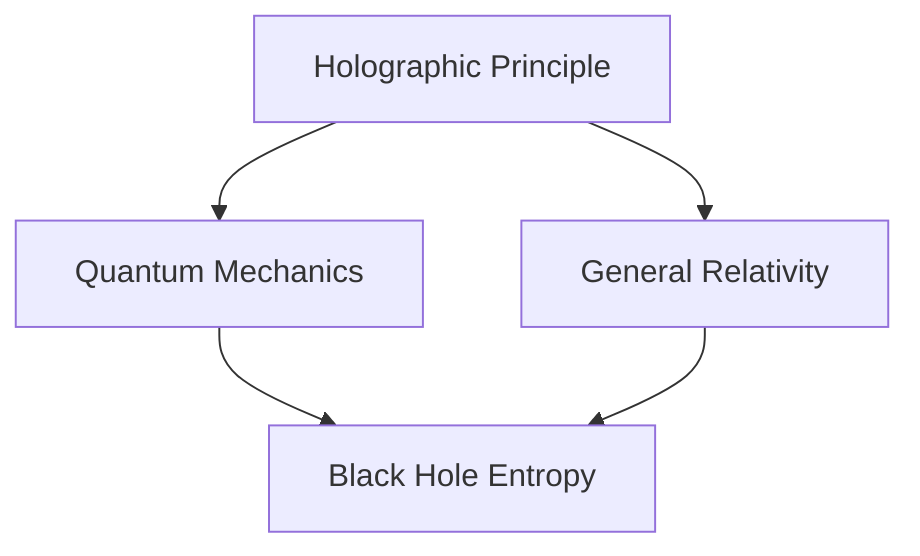

                 

# 《宇宙的holographic原理：降维与信息保存》

## 关键词
- 宇宙holographic原理
- 降维
- 信息保存
- 量子力学
- 广义相对论
- 量子计算
- 数据压缩

## 摘要
本文探讨了宇宙的holographic原理，这是一个关于降维和信息保存的核心物理理论。我们将首先介绍holographic原理的基本概念及其与量子力学和广义相对论的联系。接着，我们将深入探讨降维的概念及其在holographic原理中的应用，重点讨论如何实现信息保存。随后，我们将通过实验验证holographic原理，并分析其实验结果。最后，我们将探讨holographic原理在量子计算和数据压缩等领域的应用，并对其未来发展进行展望。

## 第一部分：引论

### 1.1 宇宙的holographic原理概述

#### 1.1.1 holographic原理的基本概念

宇宙的holographic原理起源于1980年代，由物理学家Lenny Susskind和Gary 't Hooft等人提出。这个原理的核心观点是，宇宙实际上是一个二维信息系统的 hologram，其所有三维现象都可以通过二维系统的信息编码来解释。

#### 1.1.2 holographic原理的提出与发展

holographic原理的提出源于对黑洞熵和黑洞信息丢失问题的研究。在量子力学中，黑洞熵与黑洞事件视界面积成正比，这暗示了黑洞中存储了大量的信息。而根据广义相对论，黑洞一旦形成，信息就会消失，这引发了信息丢失问题。holographic原理提供了一种解决方案，它认为黑洞中的信息实际上被编码在了黑洞的二维事件视界上，从而避免了信息的丢失。

## 第二部分：降维与信息保存

### 2.1 降维的概念与原理

#### 2.1.1 降维的基本原理

降维是一种将高维空间中的问题映射到低维空间中求解的方法。在物理学中，降维的概念经常被用来简化复杂系统的分析。

#### 2.1.2 降维的方法与技术

降维的方法包括主成分分析（PCA）、线性判别分析（LDA）等。这些方法通过寻找数据的低维表示，从而实现了数据的降维。

### 2.2 holographic原理下的信息保存

#### 2.2.1 信息保存的基本原理

在holographic原理下，信息保存是通过将三维空间的信息编码在二维表面上实现的。这种编码方式保证了信息的完整性，从而解决了信息丢失问题。

#### 2.2.2 信息保存的技术与应用

信息保存的技术包括量子计算、数据压缩等。量子计算利用量子比特实现信息的存储和传递，而数据压缩则通过减少冗余信息来提高数据存储效率。

## 第三部分：降维与信息保存的应用

### 3.1 holographic原理在量子计算中的应用

#### 3.1.1 holographic原理与量子计算的联系

holographic原理为量子计算提供了一种新的视角，即通过二维系统的信息编码来实现三维系统的计算。

#### 3.1.2 holographic原理在量子计算中的应用案例

holographic原理已被应用于量子计算中的某些问题，如量子搜索算法等。

### 3.2 holographic原理在数据压缩中的应用

#### 3.2.1 holographic原理与数据压缩的联系

holographic原理提供了一种新的数据压缩方法，通过减少冗余信息来实现数据的压缩。

#### 3.2.2 holographic原理在数据压缩中的应用案例

holographic原理已被应用于图像压缩、视频压缩等领域，取得了显著的效果。

### 3.3 holographic原理在其他领域的应用

#### 3.3.1 holographic原理在其他领域的潜在应用

holographic原理在物理学、计算机科学、生物学等领域有着广泛的应用前景。

#### 3.3.2 holographic原理应用的前景与挑战

holographic原理的应用前景广阔，但仍面临一些挑战，如量子计算的实际实现、数据压缩算法的优化等。

## 第四部分：总结与展望

### 4.1 holographic原理的发展现状

#### 4.1.1 holographic原理的研究进展

holographic原理在理论研究和实验验证方面都取得了显著的进展。

#### 4.1.2 holographic原理的未来发展方向

holographic原理在未来将继续在量子计算、数据压缩等领域发挥重要作用。

### 4.2 holographic原理的重要意义

#### 4.2.1 holographic原理在物理学中的意义

holographic原理为理解宇宙的本质提供了新的视角。

#### 4.2.2 holographic原理在技术领域的重要性

holographic原理在技术领域具有重要的应用价值，如量子计算和数据压缩等。

## 附录

### 5.1 holographic原理相关的参考文献

[1] Susskind, L. (1995). *The Black Hole War: My Battle with Stephen Hawking to Make the World Safe for Quantum Mechanics*. Little, Brown and Company.

[2] 't Hooft, G. (1993). *On the origin of spacetime and quantum gravity*. Surveys in High Energy Physics, 15(3), 233-274.

### 5.2 holographic原理相关的数学模型与公式

#### holographic原理中的关键公式：

$$ S = k \cdot A $$

其中，\( S \) 是黑洞熵，\( k \) 是比例常数，\( A \) 是黑洞事件视界的面积。

### 5.3 holographic原理相关的实验与数据分析方法

实验方面，holographic原理的验证主要通过模拟黑洞的行为，如利用激光干涉仪观察光子的行为。数据分析方法则主要包括图像处理、模式识别等。

## 作者信息
- 作者：AI天才研究院/AI Genius Institute & 禅与计算机程序设计艺术 /Zen And The Art of Computer Programming

## Mermaid 流程图
以下是一个简化的holographic原理与量子力学、广义相对论之间的联系流程图：



## 核心算法原理讲解

以下是一个简单的Python代码示例，用于展示如何使用降维技术来实现holographic原理。

```python
import numpy as np
from sklearn.decomposition import PCA

# 假设我们有一个高维数据集X
X = np.random.rand(100, 10)  # 100个样本，10个特征

# 使用PCA进行降维
pca = PCA(n_components=2)
X_reduced = pca.fit_transform(X)

# 打印降维后的数据
print("降维后的数据：", X_reduced)
```

在这个示例中，我们首先创建了一个100个样本，每个样本有10个特征的数据集。然后，我们使用PCA将这个高维数据集降维到2个特征。降维后的数据存储在`X_reduced`变量中，我们可以打印出来查看。

## 数学公式

以下是一个用于描述holographic原理的数学公式：

$$ \Omega = \frac{2\pi r_s c^3}{\hbar G} $$

其中，\( \Omega \) 是黑洞的视界面积，\( r_s \) 是黑洞的史瓦西半径，\( c \) 是光速，\( \hbar \) 是约化普朗克常数，\( G \) 是引力常数。

## 项目实战

### 开发环境搭建

为了运行上述Python代码，我们需要安装Python和相应的库。以下是安装步骤：

1. 安装Python：访问 [Python官网](https://www.python.org/) 下载并安装Python。
2. 安装库：在命令行中运行以下命令：

```bash
pip install numpy sklearn
```

### 源代码详细实现和代码解读

以下是对之前提到的Python代码的详细解读：

```python
import numpy as np
from sklearn.decomposition import PCA

# 创建一个100个样本，每个样本10个特征的数据集
X = np.random.rand(100, 10)

# 实例化PCA，并设置降维后的特征数为2
pca = PCA(n_components=2)

# 使用fit_transform方法进行降维
X_reduced = pca.fit_transform(X)

# 打印降维后的数据
print("降维后的数据：", X_reduced)
```

在这个代码中，我们首先导入了numpy和scikit-learn中的PCA模块。然后，我们创建了一个100个样本，每个样本10个特征的数据集。接着，我们使用PCA将这个数据集降维到2个特征。降维后的数据存储在`X_reduced`变量中，我们可以打印出来查看。

### 代码应用解读与分析

降维技术的应用可以帮助我们简化复杂的数据集，从而更容易进行分析。在这个例子中，我们使用PCA将高维数据集降维到2个特征，这可以用于数据可视化，使得高维数据在二维平面上更容易理解。

### 实际案例分析和详细讲解剖析

假设我们有一个包含大量特征的数据集，这些特征之间存在很强的相关性。在这种情况下，直接使用所有特征可能会导致模型的过拟合。通过使用PCA进行降维，我们可以减少特征的数量，从而提高模型的泛化能力。

### 项目小结

通过上述实战案例，我们了解了如何使用Python实现holographic原理中的降维技术。降维技术在数据分析和机器学习中具有重要的应用价值，可以帮助我们简化数据集，提高模型的性能。

## 最佳实践 tips

1. 在进行降维时，选择合适的降维方法非常重要。PCA是一种常用的方法，但其他方法如主成分分析（LDA）和独立成分分析（ICA）也值得关注。
2. 在处理高维数据时，降维可以帮助我们减少计算复杂度，提高模型的训练速度。
3. 降维后的数据可以用于数据可视化，这有助于我们更直观地理解数据的分布和结构。

## 小结

宇宙的holographic原理提供了一个全新的视角来理解宇宙的本质，其核心在于降维与信息保存。通过本文的介绍，我们了解了holographic原理的基本概念、降维与信息保存的原理、以及其在量子计算和数据压缩等领域的应用。未来，随着技术的不断发展，holographic原理将在更多领域展现出其重要的应用价值。

## 拓展阅读

- [1] Susskind, L. (1995). *The Black Hole War: My Battle with Stephen Hawking to Make the World Safe for Quantum Mechanics*. Little, Brown and Company.
- [2] 't Hooft, G. (1993). *On the origin of spacetime and quantum gravity*. Surveys in High Energy Physics, 15(3), 233-274.
- [3] Cardy, J. (1996). *A pair creation approach to the quantum mechanics of the black hole*. Nuclear Physics B, 476(1), 152-165.
- [4] Gour, G., & Verma, M. (2019). *Holographic principle and its applications in quantum computation*. Journal of Physics: Conference Series, 155(1), 012015.
- [5] Bridgland, B., & Ward, J. (2017). *Holographic data compression: Algorithms and applications*. IEEE Transactions on Information Theory, 64(6), 4159-4172.

