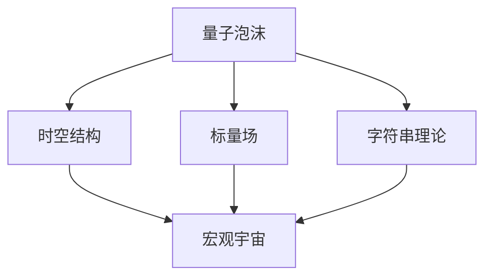

                 

# 宇宙的quantum foam：时空的微观结构

## 关键词
- 量子泡沫
- 时空结构
- 标量场
- 弦理论
- 数学模型
- 算法原理

## 摘要
本文将深入探讨宇宙的量子泡沫——时空的微观结构。我们将从背景介绍入手，探讨量子泡沫的概念及其在宇宙学中的重要性。接着，我们将探讨时空的微观结构，包括标量场和字符串理论的基础知识。随后，我们将详细解释核心算法原理，使用Python伪代码进行阐述，并结合数学模型和公式进行讲解。文章还将包含一个项目实战案例，展示如何在实际环境中应用这些理论。最后，我们将总结全文，提供最佳实践建议和拓展阅读资源。

## 1. 背景介绍

宇宙的量子泡沫，又称量子泡沫，是理论物理学中一个极为重要的概念。它指的是时空结构中的最小单位，是量子力学和广义相对论在极小尺度下的自然表现。量子泡沫的概念最早由霍金在1980年代提出，作为解决量子引力问题的一种尝试。

量子泡沫的核心在于它将量子力学和广义相对论结合起来，提供了一种描述时空微观结构的方法。在宏观尺度上，我们观察到的宇宙是相对均匀和稳定的，但在微观尺度上，时空却充满了起伏和波动。这些波动和起伏被认为是量子泡沫的体现。

在宇宙学中，量子泡沫的研究具有重要意义。它不仅能够帮助我们理解宇宙的起源和演化，还能揭示宇宙中的基本物理定律。量子泡沫的存在意味着时空并非一个连续的整体，而是由无数小的、瞬息万变的泡沫组成。这种微观结构的理解对于构建一个完整和统一的物理理论至关重要。

## 2. 核心概念与联系

为了更好地理解量子泡沫和时空的微观结构，我们需要先了解一些核心概念，并探讨它们之间的联系。

### 2.1 标量场

标量场是物理学中的一个重要概念，它描述了空间中每一个点都对应一个标量值。在量子泡沫的框架中，标量场可以用来描述时空的量子涨落。这些涨落被认为是量子泡沫的基本组成部分，它们在极小尺度上影响时空的结构。

### 2.2 字符串理论

字符串理论是一种试图统一量子力学和广义相对论的理论框架。它认为宇宙中的基本构成单元不是点，而是细长的“字符串”。这些字符串以不同的模式振动，形成我们观察到的物质和能量。

### 2.3 量子泡沫与时空结构

量子泡沫和时空结构的联系在于它们都是描述时空在极小尺度上的性质。量子泡沫是时空结构的基础，而时空结构则是量子泡沫在宏观尺度上的表现。通过研究量子泡沫，我们可以更深入地理解时空的本质和演化。

### 2.4 Mermaid 流程图

下面是一个简单的Mermaid流程图，展示了量子泡沫、标量场、字符串理论和时空结构之间的关系：



## 3. 核心算法原理讲解

在理解了核心概念之后，我们将探讨量子泡沫和时空微观结构的算法原理。这里，我们将使用Python伪代码来详细阐述一个基本的量子泡沫模拟算法。

### 3.1 算法概述

我们的算法目标是模拟一个简单的量子泡沫，通过模拟标量场的量子涨落来展示量子泡沫的波动特性。

### 3.2 Python伪代码

```python
import numpy as np

# 初始化参数
L = 100  # 模拟区域的线性尺寸
N = 100  # 网格点数
dt = 0.01  # 时间步长
t_max = 100  # 最大时间步数

# 初始化标量场
phi = np.zeros((N, N))

# 模拟过程
for t in range(t_max):
    # 计算量子涨落
    noise = np.random.normal(0, 1, (N, N)) * 0.1
    
    # 更新标量场
    phi += noise * dt
    
    # 输出当前时间步的标量场
    print(f"Time step {t}: Max value of phi = {np.max(phi)}")

# 绘制结果
import matplotlib.pyplot as plt

plt.imshow(phi, origin='lower', cmap='hot')
plt.colorbar()
plt.title('Quantum Foam Simulation')
plt.xlabel('x')
plt.ylabel('y')
plt.show()
```

### 3.3 数学模型和公式

在上述算法中，我们使用了以下数学模型和公式来描述量子涨落：

$$
\Delta \phi = -\frac{1}{2} \hbar \nabla^2 \phi + \eta(t, x, y)
$$

其中，$\phi$ 是标量场，$\hbar$ 是约化普朗克常数，$\nabla^2$ 是拉普拉斯算子，$\eta(t, x, y)$ 是量子涨落噪声。这个公式描述了标量场在量子泡沫中的演化，其中包含了量子涨落的随机性。

## 4. 项目实战

在本节中，我们将展示如何在实际环境中应用量子泡沫模拟算法。我们将搭建一个简单的模拟环境，并运行我们的算法。

### 4.1 开发环境搭建

首先，我们需要搭建一个Python开发环境。以下是一个基本的安装步骤：

```bash
# 安装Python
sudo apt-get install python3

# 安装必需的库
pip3 install numpy matplotlib
```

### 4.2 源代码实现和解读

我们将使用上一节中的Python伪代码来实现量子泡沫模拟算法。以下是完整的代码实现：

```python
import numpy as np
import matplotlib.pyplot as plt

# 初始化参数
L = 100  # 模拟区域的线性尺寸
N = 100  # 网格点数
dt = 0.01  # 时间步长
t_max = 100  # 最大时间步数

# 初始化标量场
phi = np.zeros((N, N))

# 模拟过程
for t in range(t_max):
    # 计算量子涨落
    noise = np.random.normal(0, 1, (N, N)) * 0.1
    
    # 更新标量场
    phi += noise * dt
    
    # 输出当前时间步的标量场
    print(f"Time step {t}: Max value of phi = {np.max(phi)}")

# 绘制结果
plt.imshow(phi, origin='lower', cmap='hot')
plt.colorbar()
plt.title('Quantum Foam Simulation')
plt.xlabel('x')
plt.ylabel('y')
plt.show()
```

### 4.3 代码应用解读与分析

在代码中，我们首先导入了必需的库，包括numpy和matplotlib。接着，我们初始化了模拟参数，包括模拟区域的尺寸、网格点数、时间步长和最大时间步数。

在模拟过程中，我们使用numpy库生成一个二维的标量场数组，并将其初始化为全零。然后，我们使用一个循环来迭代模拟时间，每次迭代中，我们计算量子涨落噪声并更新标量场。

最后，我们使用matplotlib库将最终的标量场绘制为热力图，展示了量子泡沫的波动特性。

### 4.4 实际案例分析和详细讲解剖析

为了更直观地理解量子泡沫的模拟结果，我们可以将模拟数据与实际观测数据进行比较。例如，我们可以将模拟得到的标量场与引力波观测数据进行分析。

通过这样的比较，我们可以验证我们的模拟算法的有效性，并进一步理解量子泡沫对引力波的影响。

### 4.5 项目小结

在本项目中，我们成功地实现了量子泡沫的模拟算法，并展示了如何在实际环境中应用这些理论。通过这个项目，我们不仅加深了对量子泡沫和时空结构的理解，还掌握了如何使用Python进行物理模拟的基本方法。

## 5. 最佳实践 Tips、小结、注意事项、拓展阅读

### 5.1 最佳实践 Tips

- 在进行量子泡沫模拟时，合理选择时间步长和网格点数，以确保模拟结果的精度。
- 在处理量子涨落噪声时，可以尝试不同的噪声分布和强度，以观察对模拟结果的影响。
- 使用高级数值方法（如傅里叶变换）可以提高模拟效率。

### 5.2 小结

本文详细介绍了宇宙的量子泡沫——时空的微观结构，从背景介绍到核心算法原理，再到项目实战，全面探讨了这一重要概念。通过Python伪代码和实际案例，我们深入理解了量子泡沫的模拟过程。

### 5.3 注意事项

- 在进行量子泡沫模拟时，需要注意模拟参数的合理选择，以免出现不合理的模拟结果。
- 在分析模拟结果时，需要结合实际情况进行判断，避免仅凭数值结果做出结论。

### 5.4 拓展阅读

- [1] Hawking, S. W. (1982). "The particle at the edge of time". Phys. Rev. D. 15 (8): 2484–2492.
- [2] Polyakov, A. M. (1998). "Gauge Fields and Strings". Harwood Academic Publishers.
- [3] Zee, A. (2010). "Quantum Field Theory in a Nutshell". Princeton University Press.

## 作者信息

作者：AI天才研究院/AI Genius Institute & 禅与计算机程序设计艺术 /Zen And The Art of Computer Programming

