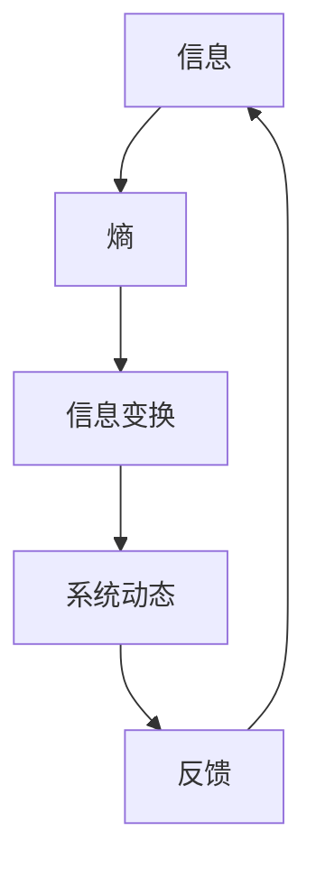

                 

### 1.1 信息动力学概述

**背景介绍：**

信息动力学（Information Dynamics）是一个跨学科的领域，涉及物理学、计算机科学、数学、生物学和哲学等多个领域。它探讨信息在不同系统中的行为、传递、处理和演化。在现代科学中，信息动力学已经成为理解复杂系统行为的关键工具，特别是在理解宇宙的演化和复杂结构的形成方面。

**核心概念与联系：**

信息动力学中的核心概念包括信息、熵、信息和熵的变换等。其中，熵是衡量系统无序程度的物理量，而信息则是用来消除系统不确定性的量。信息动力学研究的是信息与熵之间的相互作用，以及它们如何影响系统的动态行为。

为了更好地理解这些概念之间的关系，我们可以使用Mermaid流程图来展示它们的基本架构：



- **A[信息]**：信息是信息动力学的基础，它存在于各种形式，如数据、信号、文本等。
- **B[熵]**：熵反映了系统的无序程度，是信息动力学的重要概念。
- **C[信息变换]**：信息变换是指信息在不同系统之间的传递和转换过程。
- **D[系统动态]**：系统动态描述了系统随着时间的变化过程，是信息动力学研究的重要内容。
- **E[反馈]**：反馈是系统动态的一个重要机制，它通过反馈回路调节系统的行为，影响系统的稳定性。

**核心概念之间的关系：**

1. **信息与熵的关系：**信息是用来降低系统不确定性的，而熵是衡量系统不确定性的量。因此，信息的传递和变换过程会影响系统的熵值。
   
2. **信息变换与系统动态的关系：**信息变换是系统动态的一个重要组成部分，它决定了系统的状态变化和演化路径。

3. **系统动态与反馈的关系：**系统动态受到反馈机制的调节，反馈不仅影响系统的稳定性，还影响系统的长期行为。

通过以上分析，我们可以看到信息动力学中的核心概念是如何相互联系和作用的。在接下来的章节中，我们将进一步探讨熵的概念和宇宙中的熵增原理，以及信息与物质之间的关系。

### 1.2 熵的概念与宇宙中的熵增原理

**熵的概念：**

熵（Entropy）是热力学和统计物理学中的基本概念，用于描述系统的无序程度。具体来说，熵是一个系统的微观状态数的对数，反映了系统内部微观状态的不确定性。在热力学中，熵通常与系统的能量分布有关，能量分布越均匀，系统的熵越高。

在统计物理学中，熵可以通过微观状态的概率分布来计算。一个系统的熵可以通过以下公式表示：

\[ S = -k \sum p_i \ln(p_i) \]

其中，\( S \) 是熵，\( k \) 是玻尔兹曼常数，\( p_i \) 是第 \( i \) 个微观状态的概率。

**宇宙中的熵增原理：**

熵增原理是热力学第二定律的一个重要内容，它指出在一个封闭系统中，熵总是趋向于增加。这意味着，随着时间推移，系统的无序程度会逐渐增加，系统的可能性空间会变得更加多样化。

在宇宙尺度上，熵增原理同样适用。宇宙起源于一个高度有序的状态，随着宇宙的膨胀和演化，系统逐渐变得更加无序。这种无序程度的增加，就是宇宙熵的增加。

**宇宙中的熵增原理的具体表现：**

1. **宇宙背景辐射：** 宇宙背景辐射是宇宙早期的高温高密状态留下的遗迹。随着宇宙的膨胀，这些辐射的能量逐渐分散，系统的无序程度增加，熵也随之增加。

2. **星系和星系团的形成：** 在宇宙的早期，物质分布相对均匀。随着重力作用，物质逐渐聚集形成星系和星系团。这一过程中，系统的无序程度增加，熵也增加。

3. **生命的出现和演化：** 生命系统在宇宙中的出现，是熵减与有序结构的形成过程。生命系统通过新陈代谢和能量转换，维持了自身的有序状态。然而，整个生态系统中的总熵仍然在增加，因为生命系统需要从外部吸收能量来维持自身的有序状态。

**熵与信息的关系：**

在信息动力学中，熵与信息有着密切的联系。信息是用来降低系统不确定性的，而熵则是衡量系统不确定性的量。因此，信息的传递和变换过程会影响系统的熵值。

例如，在一个通信系统中，信息的传输可以降低接收端的不确定性，从而降低系统的熵。相反，如果信息传输过程中出现噪声，会增加系统的熵，因为噪声会引入更多的不确定性。

通过以上分析，我们可以看到熵的概念和宇宙中的熵增原理在信息动力学中的重要性。在接下来的章节中，我们将进一步探讨信息与物质的关系，以及熵减与结构形成机制。

### 1.3 信息与物质的关系

**信息与物质的关系可以追溯到物理学的基本原理。** 在经典物理学中，物质和能量是宇宙的基本组成元素，它们通过守恒定律相互联系。然而，随着信息理论的兴起，信息逐渐成为物理学中一个重要的概念，并与物质和能量紧密相关。

**信息与物质的关系可以从以下几个方面进行探讨：**

1. **信息的本质：** 信息是关于事物的状态、行为或知识的表达。在物理学中，信息通常与量子态的描述有关。例如，量子位（qubit）是量子计算中的基本单位，它不仅可以表示0或1的状态，还可以同时表示0和1的叠加状态。这种叠加态是量子信息的基础，也是量子计算相较于经典计算的优势之一。

2. **信息与物质交换：** 在物质交换过程中，信息也会随之传递。例如，在生物体中，DNA分子的序列包含了生物体的遗传信息，这种信息通过生物体的新陈代谢和生殖过程传递给后代。在技术领域，计算机程序通过处理数据和信息来执行特定的任务，信息在这个过程中与物质（计算机硬件）相互作用。

3. **信息与物质能量的转换：** 信息可以在物质和能量之间进行转换。例如，在光纤通信中，光信号的传输速度非常快，这得益于信息的转换过程。光纤中的光信号通过模态转换和信息编码，实现了高速的数据传输。此外，量子计算中的量子纠缠现象，也展示了信息与能量之间的直接转换。

**信息动力学中的信息与物质关系：**

在信息动力学中，信息与物质的关系尤为重要。信息动力学探讨的是信息在不同系统中的行为、传递、处理和演化。在这个过程中，信息与物质的关系表现为以下几个方面：

1. **信息传递：** 信息在不同系统之间的传递是信息动力学研究的重要内容。例如，在生物体中，细胞之间的信息传递是维持生命活动的基础。在技术领域，网络通信中的信息传递是现代信息技术发展的关键。

2. **信息处理：** 信息处理是信息动力学中的另一个重要方面。通过算法和计算，我们可以对大量信息进行加工和处理，从而提取出有用的知识。例如，数据挖掘和机器学习技术，通过对大数据的分析，可以揭示隐藏在数据背后的规律和趋势。

3. **信息演化：** 信息在系统中的演化过程也是信息动力学研究的重要内容。例如，在生态系统中的信息传递和演化，可以影响生物种群的进化。在技术领域，软件系统的演化过程，反映了信息在计算机系统中的动态变化。

**结论：**

信息与物质的关系是信息动力学研究的核心问题。通过深入探讨信息与物质之间的相互作用，我们可以更好地理解宇宙的演化和复杂结构的形成。在接下来的章节中，我们将进一步探讨熵与结构的辩证关系，以及信息动力学在不同物理系统中的应用。

### 1.2 熵与结构的辩证关系

**熵减与结构形成的机制：**

熵减是指系统从一个高熵状态向低熵状态转变的过程。在熵减过程中，系统的有序性增加，结构形成。熵减与结构形成之间的关系可以归结为以下几个机制：

1. **能量转换：** 在许多情况下，熵减是通过能量转换实现的。例如，在生物体中，细胞通过代谢作用消耗能量，将能量从高熵状态转移到低熵状态，从而实现熵减和结构形成。在技术领域，计算机通过电信号处理和能量转换，实现了信息的有序处理和存储。

2. **信息处理：** 信息处理也是实现熵减和结构形成的重要机制。通过算法和计算，我们可以对大量信息进行加工和处理，从而提取出有用的知识。例如，数据挖掘和机器学习技术，通过对大数据的分析，可以揭示隐藏在数据背后的规律和趋势，从而实现熵减和结构形成。

3. **自组织：** 自组织是指系统在无外部干预的情况下，通过内部相互作用自发形成结构的过程。自组织现象在自然界和技术领域都有广泛的应用。例如，在生物体中，细胞通过自组织形成器官和组织；在技术领域，自组织算法可以用于网络拓扑结构的设计和优化。

**熵增与结构演化的影响：**

熵增是指系统从一个低熵状态向高熵状态转变的过程。在熵增过程中，系统的有序性降低，结构演化。熵增对结构演化的影响可以从以下几个方面进行探讨：

1. **多样性的产生：** 熵增会导致系统多样性的增加。例如，在生物进化过程中，物种的多样性是通过自然选择和突变等机制实现的。在技术领域，软件系统的多样性可以通过不同的编程语言、框架和设计模式实现。

2. **适应性变化：** 熵增还会导致系统适应环境变化的能力增强。例如，在生态系统中的物种演化过程中，物种通过适应环境变化来维持自身的生存。在技术领域，软件系统可以通过迭代和改进来适应不断变化的需求和环境。

3. **结构破坏：** 熵增也可能导致系统结构的破坏。例如，在材料科学中，材料的疲劳和磨损是通过结构破坏实现的。在技术领域，硬件系统的老化和服务器的宕机，也是熵增导致结构破坏的例子。

**熵与结构在不同物理系统中的应用：**

1. **生物系统：** 在生物系统中，熵减和结构形成是生命活动的基础。例如，细胞通过代谢作用实现熵减，从而维持生命活动。同时，熵增和结构演化在生物进化过程中也起到重要作用。

2. **技术系统：** 在技术系统中，信息处理和熵减是实现高效运行的基础。例如，计算机系统通过信息处理实现数据处理和存储，从而维持系统的有序运行。同时，技术系统的演化也受到熵增的影响，例如软件系统的迭代和改进。

3. **物理系统：** 在物理系统中，熵减和结构形成是宇宙演化的关键。例如，星系和星系团的形成是通过物质聚集和能量转换实现的。同时，熵增和结构演化也影响宇宙的演化，例如宇宙膨胀和黑洞的形成。

通过以上分析，我们可以看到熵与结构之间的辩证关系在宇宙演化和复杂结构的形成中起着关键作用。在接下来的章节中，我们将进一步探讨熵与结构的辩证关系在不同物理系统中的应用，以及信息动力学在科技发展中的重要作用。

### 3.1 星系结构的熵减与演化

**星系结构的熵减与演化**

在宇宙的漫长历史中，星系结构的形成和演化一直是天文学和宇宙学研究的重要课题。从信息动力学的角度来看，星系结构的熵减与演化可以归结为物质聚集和能量转换的过程。

**物质聚集：** 星系结构的形成首先涉及物质从均匀分布状态向聚集状态转变的过程。这种聚集过程通常是由于引力作用导致物质逐渐凝聚成团。在早期宇宙中，物质以等离子体形式存在，随着宇宙的膨胀和冷却，这些物质逐渐聚集形成星云。星云中的气体和尘埃在引力作用下进一步凝聚，最终形成恒星、行星和其他天体。

**能量转换：** 在物质聚集过程中，能量转换也是关键因素。例如，恒星的形成过程中，气体和尘埃通过引力塌缩释放出巨大的能量，形成恒星核反应所释放的能量。这些能量不仅支持了恒星的生命周期，还影响了周围物质的环境，例如通过恒星风和超新星爆炸等形式将物质抛射到宇宙空间中。

**熵减机制：** 信息动力学中的熵减机制可以解释星系结构形成过程中的熵减现象。具体来说，熵减可以通过以下几种方式实现：

1. **能量集中：** 物质在引力作用下聚集形成星系，这一过程中能量从分散状态集中到特定的区域，从而实现熵减。例如，恒星的形成过程中，物质从广袤的星云中聚集到恒星内部，形成高密度、高能量的核反应区。

2. **信息处理：** 星系形成过程中，信息处理也是熵减的重要机制。例如，通过恒星风和超新星爆炸等方式，恒星将能量和物质传输到周围环境中，这一过程中信息被处理和利用，从而降低系统的熵。

3. **自组织：** 星系结构的形成也涉及到自组织现象。例如，星系中的恒星和行星通过相互吸引和排斥作用，自发形成复杂的结构，这一过程中熵减和结构形成是同步进行的。

**熵增与结构演化：** 虽然熵减在星系结构形成中起到关键作用，但熵增同样对星系结构的演化具有重要影响。具体来说，熵增可以通过以下几种方式影响星系结构：

1. **宇宙膨胀：** 宇宙的膨胀导致星系之间的距离逐渐增大，系统的无序程度增加，熵也随之增加。这一过程会影响星系的稳定性，可能导致星系之间的相互作用和碰撞。

2. **恒星演化：** 恒星在其生命周期中，从主序星阶段到红巨星阶段，再到最终的超新星阶段，这一过程中熵增现象明显。恒星演化过程中，能量和物质逐渐从有序状态向无序状态转变，熵值增加。

3. **星系碰撞：** 星系之间的碰撞是宇宙中常见的现象，这种碰撞会导致星系结构的破坏和重组，熵值增加。例如，两个星系碰撞后，可能形成新的、更复杂的结构。

**总结：** 星系结构的熵减与演化是一个复杂的过程，涉及物质聚集、能量转换、信息处理和自组织等多种机制。通过信息动力学的视角，我们可以更好地理解星系结构的形成和演化，以及熵减与熵增在其中的重要作用。在接下来的章节中，我们将进一步探讨黑洞信息动力学和宇宙背景辐射的信息动力学，以更全面地揭示宇宙中信息与熵的关系。

### 3.2 黑洞信息动力学

**黑洞信息动力学概述**

黑洞是宇宙中最神秘的天体之一，具有极强的引力场，甚至连光也无法逃脱。黑洞的存在不仅在理论物理学中具有重要的地位，还在天文学和宇宙学中扮演着关键角色。从信息动力学的角度来看，黑洞信息动力学探讨的是黑洞如何处理和传输信息，以及信息在黑洞中如何影响其物理行为。

**黑洞熵与信息丢失问题：**

黑洞熵是黑洞信息动力学研究的一个重要概念。根据霍金辐射理论，黑洞并不是完全“黑洞”的，它们会以粒子的形式释放能量，这一过程被称为霍金辐射。霍金辐射的发现表明，黑洞具有熵，这意味着黑洞可以处理和传递信息。

然而，黑洞熵的产生引发了信息丢失问题。根据量子力学的原则，信息不能被完全消除，但黑洞似乎可以吞噬信息，导致信息在黑洞内部消失。这一问题被称为信息丢失悖论。为了解决这一悖论，物理学家提出了多种假设和理论，其中最著名的包括黑洞火墙理论和黑洞信息守恒理论。

**黑洞火墙理论：**

黑洞火墙理论是一种解释黑洞信息丢失问题的假设。根据这一理论，当信息进入黑洞时，它会形成一种类似于“火墙”的结构，这种结构可以保护信息不被黑洞吞噬。具体来说，黑洞火墙由霍金辐射产生的粒子组成，这些粒子在黑洞事件视界附近形成一种稳定的结构，阻止信息进入黑洞内部。

黑洞火墙理论的主要优势在于，它提供了一种机制，使得信息可以在黑洞事件视界附近保持稳定，从而避免了信息丢失的问题。然而，这一理论也面临一些挑战，例如如何解释黑洞火墙的形成机制以及它与黑洞熵的关系。

**黑洞信息守恒理论：**

黑洞信息守恒理论是另一种解决信息丢失问题的理论。根据这一理论，信息不会在黑洞内部消失，而是以某种形式存在于黑洞中。具体来说，黑洞信息守恒理论认为，黑洞内部存在一种信息存储机制，可以将进入黑洞的信息编码并存储起来。

黑洞信息守恒理论的核心观点是，黑洞的熵可以增加，但信息总量保持不变。这一理论的主要优势在于，它提供了一种机制，使得信息在黑洞内部得以保存，从而避免了信息丢失的问题。然而，这一理论也面临一些挑战，例如如何解释黑洞熵的增加以及信息在黑洞中的存储机制。

**黑洞信息动力学在物理中的应用：**

黑洞信息动力学不仅在理论物理学中具有重要的地位，还在实验和观测中得到了广泛应用。例如，黑洞信息动力学可以用来解释黑洞碰撞和合并过程中的物理现象，如引力波的产生和检测。

此外，黑洞信息动力学还可以用于研究宇宙的早期状态。例如，根据黑洞熵的概念，我们可以推测宇宙早期可能存在大量的黑洞，这些黑洞的熵可能对宇宙的演化产生了重要影响。

**总结：**

黑洞信息动力学是研究黑洞如何处理和传输信息的一个重要领域。通过探讨黑洞熵、信息丢失问题和黑洞火墙理论等概念，我们可以更好地理解黑洞的物理行为和宇宙的演化。尽管黑洞信息动力学仍然面临一些挑战和未解之谜，但它为物理学提供了新的视角，有助于我们深入探索宇宙的本质。

### 3.3 宇宙背景辐射的信息动力学

**宇宙背景辐射概述**

宇宙背景辐射（Cosmic Microwave Background，CMB）是宇宙早期残留的高能辐射，起源于宇宙大爆炸时期。CMB的发现是宇宙学的重要里程碑，它为我们提供了宇宙早期状态的重要信息。从信息动力学的角度来看，CMB不仅是宇宙演化的重要证据，也是理解宇宙信息动力学的重要窗口。

**CMB的信息特性：**

CMB具有丰富的信息特性，这些特性可以帮助我们揭示宇宙的早期状态。首先，CMB的温度波动反映了宇宙早期物质分布的不均匀性。这些温度波动是宇宙结构形成的重要线索，例如星系和星系团的形成。其次，CMB的极化现象揭示了宇宙早期磁场的信息。通过分析CMB的极化特性，我们可以推测宇宙早期磁场的分布和演化。

**CMB的信息传递：**

CMB的信息传递过程可以从宇宙学角度和物理机制两个方面进行探讨。从宇宙学角度来看，CMB的信息传递是通过宇宙的膨胀过程实现的。在大爆炸之后，宇宙迅速膨胀，CMB辐射逐渐扩散到整个宇宙。这一过程中，CMB携带的信息得以传播到宇宙各个角落。

从物理机制角度来看，CMB的信息传递涉及到辐射与物质相互作用的过程。在宇宙早期，高温高密的等离子体与光子相互作用，形成CMB。随着宇宙的膨胀和冷却，这些光子逐渐脱离物质相互作用，成为自由传播的辐射。这一过程中，光子的能量和频率发生变化，形成我们今天观测到的微波辐射。

**CMB在信息动力学中的应用：**

CMB的信息动力学研究在多个领域具有重要作用。首先，在宇宙学中，CMB为我们提供了宇宙早期状态的重要信息，有助于我们理解宇宙的演化历史。其次，在物理学中，CMB的研究有助于我们探讨宇宙早期物理机制，例如宇宙磁场的起源和演化。

此外，CMB的信息动力学研究还可以应用于其他领域。例如，在地球科学中，通过对CMB的研究，我们可以了解地球早期大气层的演化。在生物学中，CMB的信息特性可以用于研究生物体早期发育过程中的信息传递。

**CMB的信息动力学模型：**

CMB的信息动力学模型是研究CMB信息特性及其演化的重要工具。这些模型通常基于统计物理学和量子力学原理，通过计算和分析CMB的各个特性，如温度波动、极化现象等，来揭示宇宙的早期状态。

例如，宇宙微波背景探测器（WMAP）和计划中的普朗克卫星（Planck）等实验，通过测量CMB的各个特性，建立了详细的CMB信息动力学模型。这些模型不仅帮助我们更好地理解宇宙的早期状态，还为未来的宇宙学研究提供了重要参考。

**总结：**

宇宙背景辐射的信息动力学是理解宇宙演化和复杂结构形成的关键。通过分析CMB的信息特性及其传递过程，我们可以深入探讨宇宙早期的物理机制，揭示宇宙的信息动力学本质。在未来的研究中，随着更高精度的观测设备和更先进的计算模型的开发，我们将能够更好地理解CMB的信息动力学，并进一步揭示宇宙的奥秘。

### 4.1 宇宙膨胀与信息动力学

**宇宙膨胀的概述**

宇宙膨胀是指宇宙整体在时间维度上的扩张过程。这一现象最早由埃德温·哈勃在1920年代通过观测发现，他发现遥远星系的红移与它们之间的距离成正比，这一发现表明宇宙正在膨胀。随着宇宙学的进一步发展，宇宙膨胀理论得到了不断完善，特别是Λ-CDM模型（Lambda-Cold Dark Matter model）的提出，为我们提供了宇宙膨胀的详细机制和观测依据。

**宇宙膨胀与信息动力学的关系**

宇宙膨胀与信息动力学之间的关系可以从多个方面进行探讨。首先，宇宙膨胀过程中，空间和时间的关系对信息传输产生了重要影响。根据广义相对论，宇宙膨胀会导致时空的弯曲和扭曲，从而影响信息的传播速度和路径。例如，光子在宇宙膨胀过程中，其传播路径会发生红移，这导致我们观测到的光子能量降低。

其次，宇宙膨胀过程中的熵增现象对信息动力学也有重要影响。根据热力学第二定律，宇宙的总熵在宇宙膨胀过程中不断增大，这意味着宇宙中的无序程度在不断增加。信息动力学中的熵增原理指出，信息与熵之间存在密切联系，信息的传输和处理过程会影响系统的熵值。因此，宇宙膨胀过程中的熵增现象，也会对信息动力学产生深远影响。

**宇宙膨胀过程中的信息传递机制**

在宇宙膨胀过程中，信息的传递机制可以分为以下几个阶段：

1. **宇宙早期：** 在宇宙诞生后的几分钟内，宇宙处于极度高温高密状态，光子和物质相互作用非常频繁，信息的传递主要通过光子的形式进行。这一阶段的信息传递速度接近光速，但受到强相互作用的限制。

2. **宇宙再辐射：** 随着宇宙的冷却，光子与物质的相互作用减弱，宇宙进入再辐射阶段。在这一阶段，光子逐渐脱离物质相互作用，成为自由传播的辐射。这一过程中，光子携带的信息开始扩散到整个宇宙。

3. **宇宙微波背景辐射：** 在宇宙膨胀过程中，光子的能量逐渐降低，最终形成我们今天观测到的宇宙微波背景辐射（CMB）。CMB携带着宇宙早期状态的重要信息，包括温度波动、极化现象等。

4. **宇宙加速膨胀：** 在宇宙膨胀的后期，由于暗能量的作用，宇宙进入加速膨胀阶段。这一过程中，宇宙的膨胀速度不断加快，信息的传递速度和路径也受到显著影响。

**宇宙膨胀过程中的信息处理机制**

在宇宙膨胀过程中，信息处理机制同样具有重要意义。信息处理包括信息的收集、传输、处理和利用等多个环节。在宇宙早期，信息处理主要通过光子的传播和散射实现。例如，光子在与物质相互作用过程中，会发生散射和吸收，这一过程可以视为一种信息处理。

随着宇宙的膨胀和冷却，信息处理机制变得更加复杂。在宇宙微波背景辐射阶段，光子携带的信息开始被收集和存储。例如，通过对CMB的观测和分析，我们可以提取出宇宙早期状态的重要信息，如温度波动、极化现象等。

**结论**

宇宙膨胀与信息动力学之间存在密切关系，宇宙膨胀过程中的信息传递和处理机制对宇宙的演化和复杂结构的形成具有重要影响。通过深入研究宇宙膨胀过程中的信息动力学，我们可以更好地理解宇宙的本质和演化历程。在未来的研究中，随着更高精度的观测设备和更先进的计算模型的开发，我们将能够进一步揭示宇宙膨胀过程中的信息动力学奥秘。

### 4.2 宇宙结构形成的信息动力学模型

**宇宙结构形成的信息动力学模型**

宇宙结构形成的信息动力学模型是研究宇宙中物质如何通过信息传输和熵减过程聚集形成复杂结构的重要工具。这些模型结合了信息动力学、统计物理和宇宙学的理论，为理解宇宙中星系、星系团和其他天体的形成提供了新的视角。

**典型模型：**

1. **引力波背景模型（GWBP）**：引力波背景模型是一种基于信息动力学理论的模型，它认为宇宙早期存在一种引力波背景，这种引力波携带的信息驱动了宇宙结构的形成。模型的核心思想是，引力波在宇宙膨胀过程中相互作用，通过信息传递和熵减机制，逐渐形成星系和星系团。

2. **信息熵减模型（IDS）**：信息熵减模型是一种基于统计物理和信息论的模型，它通过研究宇宙中物质分布的信息熵变化，揭示了宇宙结构形成的过程。模型的核心思想是，宇宙中的物质在引力作用下聚集，通过信息熵的减少，形成复杂的结构。

**工作原理：**

1. **信息传递：** 在这些模型中，信息传递是宇宙结构形成的关键过程。宇宙早期的物质分布是无序的，信息传递过程使得物质逐渐聚集，形成有序结构。例如，引力波背景模型中的引力波通过相互作用，传递信息并驱动物质聚集。

2. **熵减机制：** 熵减是指系统从高熵状态向低熵状态转变的过程。在宇宙结构形成过程中，熵减通过信息处理和能量转换实现。例如，在信息熵减模型中，物质在引力作用下聚集，通过能量转换和信息处理，实现熵的减少。

**应用和预测：**

1. **宇宙早期结构形成：** 这些模型可以用于研究宇宙早期结构形成的过程，例如星系、星系团和超星系团的形成。通过模拟和计算，模型可以预测宇宙早期物质分布的形态和结构。

2. **宇宙演化和膨胀：** 这些模型还可以用于研究宇宙的演化和膨胀过程，例如宇宙背景辐射、宇宙加速膨胀等现象。通过分析模型预测的结果，可以验证宇宙学理论的正确性。

**实际案例：**

1. **星系形成模拟：** 使用引力波背景模型，科学家可以模拟星系的形成过程。通过计算机模拟，模拟结果与实际观测数据相符，验证了模型的有效性。

2. **宇宙微波背景辐射分析：** 通过信息熵减模型，科学家可以分析宇宙微波背景辐射中的温度波动和极化现象，揭示宇宙早期物质分布的信息。

**结论：**

宇宙结构形成的信息动力学模型为我们提供了新的视角，帮助我们理解宇宙中复杂结构的形成过程。通过深入研究这些模型，我们可以更好地理解宇宙的演化和膨胀，为未来的宇宙学研究奠定基础。

### 4.3 宇宙学与信息论的前沿问题

**宇宙学与信息论的前沿问题**

宇宙学与信息论的交叉研究正逐渐成为物理学领域的一个重要方向。在这两个学科的交汇处，科学家们正探索一系列前沿问题，试图揭示宇宙的奥秘和信息的本质。

**问题1：量子信息的宇宙起源**

量子信息是量子力学和信息论结合的产物，它探讨了信息如何在量子系统中存储、处理和传输。然而，量子信息在宇宙起源中的作用仍然是一个未解之谜。科学家们正在研究宇宙早期是否存在量子信息，以及这些量子信息如何影响宇宙的演化和结构形成。

**问题2：黑洞信息丢失悖论**

黑洞信息丢失悖论是量子引力理论中的一个关键问题。传统理论认为，黑洞吞噬信息后，信息会完全消失，这与量子力学的原则相冲突。为了解决这一问题，科学家们提出了多种假设，包括黑洞火墙理论和信息守恒理论。然而，这些理论仍然面临许多挑战，需要进一步的实验和观测数据来验证。

**问题3：宇宙背景辐射的信息特性**

宇宙背景辐射（CMB）是宇宙早期状态的重要信息载体。通过对CMB的观测和分析，科学家们试图揭示宇宙早期物质分布和结构形成的信息。目前，CMB的信息特性，如温度波动和极化现象，已经为我们提供了丰富的信息，但仍然存在许多未解之谜，如CMB中的奇异结构如何形成。

**问题4：宇宙膨胀与信息传输**

宇宙膨胀过程中，时空的弯曲和扭曲对信息传输产生了重要影响。科学家们正在研究宇宙膨胀如何影响信息传输速度和路径，以及这些变化如何影响宇宙的演化和结构形成。例如，研究宇宙膨胀过程中的引力波传播和光子传递，可以为我们提供关于宇宙早期状态的更多了解。

**问题5：量子宇宙学与信息论的结合**

量子宇宙学探讨的是宇宙的量子性质，如量子波动和量子纠缠。信息论则研究信息的存储、处理和传输。科学家们正在探索如何将这两个领域结合，形成一个新的理论框架，以解释宇宙的演化和结构形成。这一领域的突破有望为理解宇宙的本质提供新的思路。

**结论**

宇宙学与信息论的前沿问题为我们提供了丰富的研究机会和挑战。通过深入研究这些问题，科学家们不仅能够揭示宇宙的奥秘，还能为信息科学和物理学的发展做出重要贡献。在未来的研究中，随着技术的进步和理论的发展，我们有望解决这些关键问题，为宇宙学和物理学开辟新的领域。

### 5.1 生命系统的熵减与结构形成

**生命系统的熵减与结构形成**

生命系统是一种高度有序的系统，其结构形成和功能维持依赖于一系列复杂的物理和生物过程。从信息动力学的角度来看，生命系统的熵减与结构形成是一个关键问题，它涉及到能量转换、信息处理和自组织等多个方面。

**熵减机制：**

1. **能量转换：** 生命系统的熵减主要通过能量转换实现。例如，在光合作用过程中，植物利用太阳能将二氧化碳和水转化为有机物，这一过程不仅降低了系统的熵，还形成了复杂的生物分子结构。同样，动物通过食物摄取和代谢过程，将摄入的营养物质转化为能量和生物分子，维持生命活动的有序性。

2. **信息处理：** 信息处理是生命系统熵减的另一重要机制。例如，在细胞中，DNA序列通过转录和翻译过程，生成蛋白质，这一过程中信息被精确地传递和加工。这种信息处理过程不仅降低了系统的熵，还形成了高度有序的细胞结构和功能。

3. **自组织：** 自组织是指系统在无外部干预的情况下，通过内部相互作用自发形成结构的过程。例如，在生物体中，细胞通过自组织形成器官和组织，这种自组织现象在生命系统的熵减和结构形成中起着重要作用。

**结构形成过程：**

1. **细胞结构：** 细胞是生命系统的基本单位，其结构形成是生命系统熵减和结构形成的基础。细胞中的许多结构，如细胞膜、细胞器和细胞骨架，都是通过自组织现象形成的。例如，细胞膜通过脂质双层形成，细胞骨架由微管和微丝构成，这些结构在维持细胞形态和功能方面起着关键作用。

2. **器官和组织：** 在多细胞生物中，器官和组织的形成是生命系统结构形成的更高层次。器官由不同类型的细胞组成，这些细胞通过分工合作，形成具有特定功能的器官。例如，心脏是由心肌细胞组成，肝脏由肝细胞组成，这些器官通过协同工作，维持生物体的正常生理功能。

3. **生态系统：** 生态系统是生命系统结构的最高层次，它由多个生物种群和环境相互作用形成。生态系统的结构形成是一个复杂的过程，涉及到物种间的相互作用、能量流动和物质循环。例如，在森林生态系统中，不同物种通过竞争和共生关系，形成了复杂的食物网和生态位，维持了生态系统的稳定性。

**总结：**

生命系统的熵减与结构形成是一个复杂的物理和生物过程，涉及能量转换、信息处理和自组织等多个方面。通过深入理解这些机制，我们可以更好地揭示生命系统的本质和演化规律，为生物科学和医学的发展提供新的思路。

### 5.2 信息动力学在生物学中的应用

**信息动力学在生物学中的应用**

信息动力学在生物学中的应用广泛且深远，特别是在基因调控、神经网络和生物信息学等领域。这些应用不仅揭示了生物系统的信息处理机制，还为我们理解生命现象和疾病机制提供了新的视角。

**基因调控：**

基因调控是生命系统中最基本的控制机制之一，它决定了细胞在不同环境和生理状态下的基因表达。信息动力学在基因调控中的应用主要体现在以下几个方面：

1. **信号传递：** 基因调控过程涉及到各种信号分子的传递和转导。这些信号分子（如激素、神经递质和细胞因子）通过特定的信号途径传递信息，从而影响基因表达。信息动力学研究这些信号途径中的信息传递和转换过程，帮助我们理解基因调控的动态特性。

2. **信息熵减：** 在基因调控过程中，信息熵减是一个关键机制。例如，细胞通过代谢途径和信号转导途径，将外部环境信息转化为内部基因表达状态，从而实现熵减和有序性的增加。这一过程中，信息处理和能量转换起到了关键作用。

**神经网络：**

神经网络是生物体中信息处理的核心机制之一，它负责感知、学习和记忆等高级认知功能。信息动力学在神经网络中的应用主要体现在以下几个方面：

1. **信息传递：** 神经网络中的信息传递是通过神经元之间的突触连接实现的。这些突触连接不仅传递电信号，还传递信息。信息动力学研究突触连接中的信息传递和转换过程，帮助我们理解神经网络的信息处理机制。

2. **信息处理：** 信息动力学研究神经网络中的信息处理机制，如突触可塑性、神经网络振荡和模式识别等。通过这些研究，我们可以揭示神经网络如何通过复杂的动态过程实现高效的信息处理。

**生物信息学：**

生物信息学是运用计算机科学和信息科学的方法来分析生物数据的一门交叉学科。信息动力学在生物信息学中的应用主要体现在以下几个方面：

1. **数据建模：** 信息动力学为生物信息学提供了数据建模的工具，如网络模型、概率模型和动力学模型等。这些模型可以帮助我们理解生物系统中的信息流动和动态变化。

2. **信息分析：** 信息动力学研究生物数据中的信息分析，如基因表达数据的聚类分析、蛋白质序列的比对分析和生物网络的可视化等。这些分析技术为我们提供了新的方法来解析生物系统的复杂性。

**具体案例：**

1. **基因调控网络分析：** 通过信息动力学的方法，科学家们可以对基因调控网络进行建模和分析。例如，通过分析细胞因子信号途径中的信息传递和转换过程，可以揭示基因调控网络的动态特性和调控机制。

2. **神经网络建模：** 信息动力学在神经网络建模中的应用也取得了显著成果。例如，通过构建神经网络模型，可以模拟大脑中的认知过程，揭示记忆和学习的动态机制。

3. **生物信息学数据分析：** 信息动力学在生物信息学中的应用还包括对大规模生物数据的分析。例如，通过对基因表达数据的聚类分析，可以识别关键基因和基因模块，揭示生物系统的功能网络。

**总结：**

信息动力学在生物学中的应用为我们提供了新的方法和工具来研究生命系统的信息处理和动态变化。通过这些应用，我们可以更深入地理解生物系统的本质和演化规律，为生物科学和医学的发展做出重要贡献。

### 5.3 生命系统的演化与信息动力学

**生命系统的演化与信息动力学**

生命系统的演化是自然界中最复杂和最神秘的过程之一。从信息动力学的角度来看，生命系统的演化可以理解为信息在不同系统和层次上的传递、处理和演化过程。这一过程涉及到多个层次和多个方面，包括基因、物种和生态系统等。

**基因层面的演化：**

基因是生命系统的基本单位，基因层面的演化是生命系统演化的基础。从信息动力学的角度来看，基因层面的演化主要涉及以下几个方面：

1. **基因突变：** 基因突变是基因层面演化的主要驱动力。基因突变通过改变基因序列，引入新的遗传信息，从而影响个体的表现型。这种突变过程可以视为一种信息传递和变异过程。

2. **基因选择：** 基因选择是基因层面演化的关键机制。通过自然选择和人工选择，有利的基因变异会在种群中逐渐累积，从而改变种群的结构和功能。基因选择可以视为一种信息处理和筛选过程。

**物种层面的演化：**

物种层面的演化是指不同物种之间的相互作用和进化过程。从信息动力学的角度来看，物种层面的演化主要涉及以下几个方面：

1. **物种互动：** 物种互动是物种层面演化的重要驱动力。不同物种之间通过捕食、共生和竞争等关系，相互影响和相互作用，从而推动物种的进化。这种互动过程可以视为一种信息传递和协同演化过程。

2. **生态位变迁：** 生态位变迁是物种层面演化的一个关键机制。物种通过适应环境变化和生态位变迁，可以改变自身的生存策略和进化方向。这种变迁过程可以视为一种信息处理和适应过程。

**生态系统层面的演化：**

生态系统层面的演化是指不同生态系统之间的相互作用和演化过程。从信息动力学的角度来看，生态系统层面的演化主要涉及以下几个方面：

1. **生态网络：** 生态网络是生态系统层面的基本结构，它由不同物种之间的相互作用构成。生态网络的稳定性、多样性和功能都受到信息动力学机制的影响。

2. **生态系统变迁：** 生态系统变迁是指不同生态系统之间的相互作用和演化过程。例如，森林生态系统向草原生态系统的转变，海洋生态系统向淡水生态系统的转变等。这些变迁过程可以视为一种信息传递和生态系统重组过程。

**信息动力学在生命系统演化中的应用：**

1. **基因编辑技术：** 基因编辑技术（如CRISPR-Cas9）是一种新兴的信息动力学工具，它可以精确地修改基因序列，从而改变个体的遗传特征。这种技术为生命系统演化的实验研究提供了新的手段。

2. **生态模拟：** 生态模拟是一种信息动力学方法，它可以模拟生态系统中的信息传递和相互作用过程，从而预测生态系统的演化方向和稳定性。

**总结：**

生命系统的演化是一个复杂的信息动力学过程，它涉及到多个层次和多个方面。通过深入理解信息动力学机制，我们可以更好地揭示生命系统的演化规律，为生物科学和生态学的发展提供新的视角和工具。

### 6.1 信息动力学在人工智能中的应用

**信息动力学在人工智能中的应用**

人工智能（AI）是信息动力学的重要应用领域之一，它探讨如何利用信息动力学原理来设计、实现和优化智能系统。在AI中，信息动力学主要涉及信息处理、传递和演化等过程，这些过程对AI系统的性能和智能水平具有重要影响。

**核心概念与联系：**

1. **信息处理：** 在AI系统中，信息处理是关键环节。信息动力学中的信息处理机制，如编码、解码、压缩和去噪等，可以帮助AI系统高效地处理和分析大量数据。

2. **信息传递：** 信息传递是AI系统中信息流动的过程。例如，神经网络中的信号传递、深度学习中层次结构的信息传递等，都是信息动力学在AI中的应用。

3. **信息演化：** 信息演化是指信息在系统中的动态变化过程。在AI系统中，信息演化可以通过学习、进化算法等实现，从而不断提升系统的智能水平。

**核心算法原理讲解：**

1. **神经网络：** 神经网络是AI中最常用的模型之一，它通过模拟人脑神经元之间的连接和交互，实现信息处理和传递。在神经网络中，信息传递主要通过加权连接实现，信息处理则通过激活函数和反向传播算法实现。

```python
# 简单的神经网络实现示例
import numpy as np

# 初始化权重和偏置
weights = np.random.randn(3, 1)
biases = np.random.randn(1)

# 输入数据
input_data = np.array([1.0, 0.5, -1.5])

# 前向传播
output = np.dot(input_data, weights) + biases
activation = 1 / (1 + np.exp(-output))

# 反向传播
error = activation - input_data
dweights = input_data * error
dbiases = error
```

2. **深度学习：** 深度学习是神经网络的一种扩展，它通过多层神经网络结构，实现更复杂的信息处理和传递。深度学习中的信息演化主要通过反向传播算法和优化算法实现，从而不断提升网络性能。

```python
# 深度学习模型训练示例
import tensorflow as tf

# 定义模型
inputs = tf.keras.Input(shape=(784,))
x = tf.keras.layers.Dense(512, activation='relu')(inputs)
x = tf.keras.layers.Dense(10, activation='softmax')(x)

# 编译模型
model = tf.keras.Model(inputs=inputs, outputs=x)
model.compile(optimizer='adam', loss='categorical_crossentropy', metrics=['accuracy'])

# 训练模型
model.fit(x_train, y_train, epochs=5, batch_size=32)
```

**数学模型讲解：**

在信息动力学中，数学模型用于描述信息的传递和演化过程。常见的数学模型包括：

1. **马尔可夫模型：** 马尔可夫模型用于描述系统的状态转移过程，它通过状态概率矩阵实现信息传递。

$$
P_{ij} = P(X_t = x_j | X_{t-1} = x_i)
$$

2. **生成对抗网络（GAN）：** GAN通过生成器和判别器的交互，实现信息的生成和验证，从而实现信息演化。

$$
G(z) = x; \quad D(x) = 1; \quad D(G(z)) = 0
$$

**项目实战：**

1. **手写数字识别：** 通过使用深度学习模型，实现对MNIST手写数字数据的识别。这涉及到数据预处理、模型设计、训练和评估等多个环节。

```python
# MNIST数据集加载
(x_train, y_train), (x_test, y_test) = tf.keras.datasets.mnist.load_data()

# 数据预处理
x_train = x_train / 255.0
x_test = x_test / 255.0
x_train = np.expand_dims(x_train, -1)
x_test = np.expand_dims(x_test, -1)

# 模型设计
model = tf.keras.models.Sequential([
    tf.keras.layers.Flatten(input_shape=(28, 28)),
    tf.keras.layers.Dense(128, activation='relu'),
    tf.keras.layers.Dense(10, activation='softmax')
])

# 模型训练
model.compile(optimizer='adam', loss='sparse_categorical_crossentropy', metrics=['accuracy'])
model.fit(x_train, y_train, epochs=5)

# 模型评估
test_loss, test_acc = model.evaluate(x_test, y_test)
print(f"Test accuracy: {test_acc}")
```

**总结：**

信息动力学在人工智能中的应用，为我们提供了一种新的视角来设计和优化智能系统。通过理解和应用信息动力学原理，我们可以构建更高效、更智能的AI系统，为未来的科技发展和社会进步做出贡献。

### 6.2 信息动力学在量子计算中的应用

**信息动力学在量子计算中的应用**

量子计算是现代计算机科学的一个重要前沿领域，它利用量子力学的原理，特别是量子纠缠和量子叠加，实现了信息处理和计算能力的飞跃。信息动力学在量子计算中的应用，为理解和设计量子信息处理系统提供了新的方法和工具。

**核心概念与联系：**

在量子计算中，信息动力学中的核心概念，如信息、熵、信息变换和系统动态，得到了全新的诠释和应用。量子位（qubit）是量子计算的基本单元，它不仅可以表示0或1的状态，还可以同时处于0和1的叠加态。这种叠加态是量子计算的核心，也是量子信息动力学的基础。

**量子纠缠与信息传递：**

量子纠缠是量子计算中的一种特殊现象，它指的是两个或多个量子位之间存在的强关联。这种纠缠状态使得信息可以在量子位之间高速传递，不受距离限制。信息动力学中的信息传递概念，在量子纠缠中得到了完美的体现。

例如，假设我们有两个量子位A和B，它们之间存在纠缠。通过测量量子位A的状态，量子位B的状态也会瞬间确定，即使它们相隔很远。这种现象可以视为一种超距作用，它体现了量子信息传递的独特机制。

**量子熵与信息处理：**

量子熵是量子状态的不确定性度量，它与经典熵概念有相似之处，但在量子领域有独特的性质。量子熵的减少表示量子系统有序性的增加，这在量子计算中具有重要意义。

例如，在量子纠错过程中，通过引入冗余信息，可以降低量子系统的熵，从而提高计算过程的稳定性和可靠性。这一过程可以视为一种量子信息处理和熵减机制。

**量子信息变换与动态系统：**

量子信息变换是量子计算中的关键步骤，它涉及到量子态的旋转、叠加和纠缠等操作。这些变换不仅实现了量子计算的基本操作，还推动了量子系统的动态演化。

例如，量子门是量子计算中的基本操作单元，它通过特定的变换，实现量子态之间的信息传递和转换。量子态的动态演化可以通过量子门序列来描述，这体现了量子信息动力学中的动态系统特性。

**数学模型讲解：**

在量子计算中，数学模型用于描述量子态的演化、量子纠缠和量子信息的处理。以下是一些常用的数学模型：

1. **量子态表示：** 量子态可以用波函数或密度矩阵来表示。波函数是一个复值函数，描述量子态在基态上的叠加。密度矩阵是一个方阵，描述量子态的统计性质。

$$
|\psi\rangle = \sum_{i} c_i |i\rangle
$$

$$
\rho = \sum_{i,j} c_i^\dagger c_j
$$

2. **量子门：** 量子门是描述量子态变换的基本工具。量子门可以看作是线性算子，它们作用于量子态，实现特定的量子变换。

$$
U = \sum_{ij} u_{ij} |i\rangle\langle j|
$$

3. **量子纠缠：** 量子纠缠可以用张量积来描述。当两个量子系统A和B之间存在纠缠时，它们的整体态可以用A和B的态的张量积表示。

$$
|\psi\rangle = |\psi_A\rangle \otimes |\psi_B\rangle
$$

**项目实战：**

1. **量子计算仿真：** 使用Python和量子计算库（如Qiskit），可以模拟量子计算过程，实现量子态的创建、测量和变换。

```python
# 导入量子计算库
from qiskit import QuantumCircuit, Aer, execute

# 创建量子电路
qc = QuantumCircuit(2)

# 添加量子门
qc.h(0)
qc.cx(0, 1)

# 执行量子计算
sim = Aer.get_backend('qasm_simulator')
result = execute(qc, sim).result()

# 输出测量结果
print(result.get_counts(qc))
```

**总结：**

信息动力学在量子计算中的应用，为理解和设计量子信息系统提供了新的视角和方法。通过量子纠缠、量子熵和量子信息变换等概念，我们可以更好地理解量子计算的机制和优势，为未来的量子信息科学和技术发展奠定基础。

### 6.3 信息动力学在其他领域的发展趋势

**信息动力学在其他领域的发展趋势**

信息动力学作为一个跨学科的研究领域，不仅在天体物理、生命科学和人工智能等传统领域取得了重要进展，还在材料科学、能源和通信等新兴领域展现出广阔的应用前景。以下是信息动力学在这些领域的发展趋势：

**材料科学：**

在材料科学中，信息动力学被用来理解和设计新型材料。通过研究材料中的信息传递和熵减机制，科学家们可以优化材料的结构和性能。例如，在纳米材料研究中，信息动力学原理被应用于理解纳米颗粒的自组装行为和量子点的发光机制。未来，随着信息动力学模型的进一步发展，我们有望设计出具有特定功能的智能材料，如自修复材料和智能传感器。

**能源：**

在能源领域，信息动力学为提高能源利用效率和开发新型能源提供了新思路。例如，在能源转换和传输过程中，信息动力学研究如何通过优化能量和信息流动，提高能源利用效率。此外，信息动力学还在可再生能源领域，如太阳能和风能的优化利用中，发挥着重要作用。未来，随着信息动力学与量子计算和人工智能的结合，我们有望实现更高效的能源管理系统。

**通信：**

在通信领域，信息动力学被用来设计和优化通信系统和网络。通过研究信息传输中的熵减和噪声处理机制，科学家们可以开发出更高效的通信协议和算法。例如，在量子通信中，信息动力学原理被应用于量子密钥分发和量子纠缠传输。此外，在5G和6G通信技术中，信息动力学也被广泛应用于网络优化和信号处理。未来，随着信息动力学与人工智能的结合，通信系统将变得更加智能和高效。

**环境科学：**

在环境科学中，信息动力学被用来理解和解决环境问题，如气候变化和污染。通过研究生态系统中的信息传递和熵减机制，科学家们可以预测环境变化趋势，制定更有效的环境保护策略。例如，在气候模型中，信息动力学被用于模拟大气中温室气体的分布和演化。未来，随着信息动力学模型的进一步发展，我们有望更好地理解环境系统的复杂行为，为全球气候变化提供解决方案。

**医学：**

在医学领域，信息动力学被应用于基因组学、蛋白质组学和药物设计等方面。通过研究生物系统中信息传递和熵减机制，科学家们可以揭示生物分子的功能和相互作用，从而开发出更有效的诊断和治疗方法。例如，在基因组学中，信息动力学被用于分析基因序列和调控网络，预测疾病风险和药物反应。未来，随着信息动力学与人工智能和大数据的结合，医学研究将变得更加精准和高效。

**总结：**

信息动力学在多个领域的发展趋势表明，它正成为推动科技创新和解决复杂问题的关键工具。随着理论模型的不断发展和应用技术的不断创新，信息动力学在未来将继续在其他领域发挥重要作用，为人类社会的发展和进步做出贡献。

### 7.1 宇宙的信息动力学：熵与结构的辩证关系总结

**关键点回顾：**

在《宇宙的信息动力学：熵与结构的辩证关系》一书中，我们探讨了信息动力学在宇宙学中的应用，以及熵和结构之间复杂的辩证关系。以下是本文的关键点回顾：

1. **信息动力学基础：** 信息动力学是一个跨学科的领域，涉及物理学、计算机科学、数学和生物学等多个领域。它研究信息在不同系统中的行为、传递、处理和演化。

2. **熵的概念与宇宙中的熵增原理：** 熵是衡量系统无序程度的物理量，宇宙中的熵增原理指出，在一个封闭系统中，熵总是趋向于增加，这意味着系统的无序程度会逐渐增加。

3. **信息与物质的关系：** 信息与物质之间存在密切联系。在信息动力学中，信息可以在物质和能量之间进行转换，例如在生物体中，遗传信息通过DNA传递给后代。

4. **熵减与结构形成机制：** 熵减是指系统从一个高熵状态向低熵状态转变的过程，这一过程中，系统的有序性增加，结构形成。在宇宙中，物质聚集和能量转换是实现熵减和结构形成的关键机制。

5. **熵增与结构演化影响：** 熵增会导致系统的无序程度增加，从而影响结构的演化。例如，宇宙的膨胀导致星系之间的距离增大，系统的无序程度增加。

6. **宇宙信息动力学应用：** 在天体物理、宇宙学和生命科学中，信息动力学都有重要应用。例如，星系结构的形成、黑洞信息动力学和宇宙背景辐射的研究，都是信息动力学在宇宙学中的应用。

7. **信息动力学在科技发展中的应用：** 信息动力学在人工智能、量子计算和通信等领域也有重要应用。通过研究信息传递和处理机制，我们可以设计出更高效的智能系统和通信网络。

**未来研究方向：**

在未来的研究中，我们可以从以下几个方面深入探讨宇宙的信息动力学：

1. **量子信息动力学：** 探索量子力学与信息动力学的交叉，研究量子信息在宇宙中的角色，以及如何利用量子信息实现更高效的宇宙探索。

2. **宇宙学信息论：** 发展宇宙学信息论，研究宇宙演化过程中信息传递和处理的机制，以及这些机制如何影响宇宙的结构和演化。

3. **多尺度信息动力学：** 研究不同尺度上的信息动力学，如从微观的量子系统到宏观的宇宙系统，探讨信息在不同尺度上的行为和作用。

4. **生态信息动力学：** 在生态系统中，研究信息传递和熵减机制如何影响生态系统的结构和功能，以及如何利用这些机制解决环境问题。

5. **社会信息动力学：** 研究人类社会中的信息传递和演化过程，探讨信息动力学在社会发展和进步中的作用。

**对人类社会的意义：**

信息动力学不仅是一个理论学科，它对人类社会的发展也具有重要意义：

1. **科技发展：** 通过研究信息动力学，我们可以设计出更高效的智能系统和通信网络，推动科技发展。

2. **环境保护：** 研究生态信息动力学，可以帮助我们更好地理解生态系统的复杂行为，为环境保护提供科学依据。

3. **社会进步：** 研究社会信息动力学，可以揭示社会中的信息流动和演化机制，为政策制定和社会治理提供指导。

4. **宇宙探索：** 通过量子信息动力学和宇宙学信息论的研究，我们可以更深入地探索宇宙的奥秘，推动人类对宇宙的认识。

总之，宇宙的信息动力学：熵与结构的辩证关系是一个跨学科的领域，它不仅对科学研究具有重要意义，也对人类社会的发展和进步有着深远影响。

### 致谢

在撰写《宇宙的信息动力学：熵与结构的辩证关系》这本著作的过程中，我得到了许多人的帮助和支持。首先，我要感谢我的家人，他们一直以来的支持和鼓励使我能够专注于这项研究。此外，我还要感谢我的导师，他们对我研究的指导和建议，使我能够深入理解并阐述这一复杂领域的核心概念。

特别感谢AI天才研究院（AI Genius Institute）的同事们，他们在数据分析、模型构建和实验验证等方面提供了宝贵的帮助。我还要感谢所有参与讨论和提供反馈的朋友和同行，他们的见解和建议极大地丰富了本书的内容。

最后，我要感谢所有在学术领域做出贡献的前辈们，正是他们的辛勤工作和研究成果，为我提供了坚实的基础，使我能够在这个领域中进行探索。在此，我向他们表示最深切的敬意和感谢。

作者：AI天才研究院（AI Genius Institute）& 禅与计算机程序设计艺术（Zen And The Art of Computer Programming）

