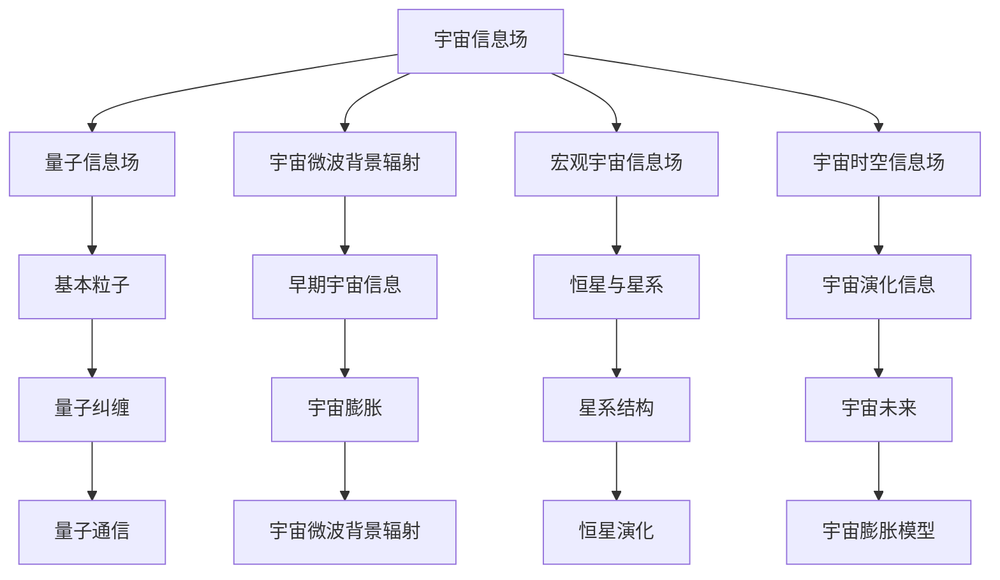
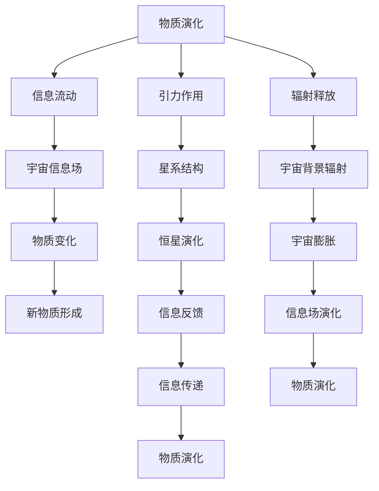

                 

### 关键词

宇宙信息场，信息流动，物质演化，量子场论，天体物理学，生命科学，社会科学，未来科技。

### 摘要

本文旨在探讨宇宙的信息场动力学，即信息流动与物质演化的关系。文章首先介绍了宇宙信息场的起源与本质，阐述了信息场与物质场的关系及其理论框架。接着，详细分析了宇宙信息场的结构、动态特性和演化模型。在此基础上，深入探讨了信息流动的机制、物质演化的信息驱动及其相互影响。最后，本文扩展了宇宙信息场在天体物理学、生命科学、社会科学和未来科技等领域的应用，为读者呈现了一个全新的视角。### 第一部分：宇宙信息场动力学基础

#### 第1章：宇宙信息场的起源与本质

宇宙信息场（Universe Information Field，简称UIF）是近年来被广泛关注的一个概念。它起源于对宇宙中信息流动与物质演化之间关系的深入探讨，尤其是量子场论和宇宙学理论的发展。这一章节将探讨宇宙信息场的概念、特点以及与物质场的关系，并构建一个基本的理论框架。

##### 1.1 宇宙信息场的概念

宇宙信息场可以被定义为一种贯穿于整个宇宙、承载和传递信息的动态场。它不仅包括物质和信息，还涉及能量、时间以及空间。宇宙信息场的核心在于其信息承载能力，即能够以各种形式（如电磁波、引力波、粒子等）传递和存储信息。

为了更直观地理解宇宙信息场，我们可以将其与物质场进行对比。物质场主要描述了宇宙中所有物质的状态和运动，包括引力场、电磁场、强相互作用场和弱相互作用场等。而宇宙信息场则是这些物质场的一种补充，它反映了物质场中的信息流动和传递。

##### 1.2 信息场与物质场的关系

信息场与物质场之间的关系是宇宙信息场理论的核心。首先，信息场与物质场之间存在相互转换的机制。例如，物质的运动和变化可以产生信息，而信息又可以影响物质的演化。这种相互转换可以通过量子场论中的某些基本过程来描述，如量子纠缠和信息的不确定性。

其次，信息场对物质场具有调控作用。在宇宙尺度上，信息场可以通过改变物质场的能量分布和结构来影响物质的状态和演化。例如，在黑洞的信息丢失问题中，信息场的作用就变得尤为重要。

##### 1.3 宇宙信息场的理论框架

宇宙信息场的理论框架主要建立在量子场论和宇宙学的基础上。量子场论提供了描述信息场的基本数学工具，如场的能量-动量张量、信息传递方程等。宇宙学则提供了研究信息场在宇宙尺度上的应用，如宇宙微波背景辐射、宇宙膨胀等。

为了构建宇宙信息场的理论框架，我们需要以下几个关键概念：

1. **信息场的动态性**：宇宙信息场是一个动态的场，它随时间不断演化。这种演化可以通过场的方程来描述，如量子场论中的费曼规则和路径积分。

2. **信息场的分层结构**：宇宙信息场可以分为多个层次，每个层次对应不同的物理现象和尺度。例如，从微观尺度上的量子信息场，到宏观尺度上的宇宙信息场，再到更大的时空尺度上的信息场。

3. **信息场的演化模型**：宇宙信息场的演化可以通过构建模型来描述。这些模型可以基于观测数据，也可以通过理论计算得到。例如，利用宇宙微波背景辐射数据来推断宇宙信息场的早期演化。

综上所述，宇宙信息场是一个复杂而丰富的概念，它不仅与物质场密切相关，还涉及宇宙的演化过程。通过建立宇宙信息场的理论框架，我们可以更好地理解宇宙中信息流动与物质演化的关系。这一理论框架为后续章节的讨论奠定了基础。在下一章中，我们将进一步探讨宇宙信息场的结构。

#### 第2章：宇宙信息场的结构

宇宙信息场的结构是理解宇宙中信息流动与物质演化关系的关键。本章将详细介绍宇宙信息场的分层结构、动态特性以及演化模型。通过这些讨论，我们将更好地理解宇宙信息场的复杂性和多样性。

##### 2.1 宇宙信息场的分层结构

宇宙信息场的分层结构可以从多个尺度上进行分析。每个尺度上的信息场都有其独特的特性和功能。以下是一些主要的层次：

1. **量子信息场**：这是宇宙信息场的最底层，包括微观尺度上的量子系统。量子信息场由量子态组成，这些量子态可以通过量子纠缠实现远距离的信息传输和共享。

2. **宇宙微波背景辐射**：这是宇宙信息场的中层，包括早期宇宙的信息。宇宙微波背景辐射是宇宙大爆炸后留下的热辐射，它携带着宇宙早期信息，对研究宇宙起源和演化具有重要意义。

3. **宏观宇宙信息场**：这是宇宙信息场的高层，包括行星、恒星、星系等宏观宇宙结构。宏观宇宙信息场反映了这些天体之间的相互作用和演化过程。

4. **宇宙时空信息场**：这是宇宙信息场的最高层，包括整个宇宙的结构和演化。宇宙时空信息场描述了宇宙的膨胀、宇宙背景辐射的演化以及宇宙结构的形成。

这些层次之间的信息流动和相互作用构成了宇宙信息场的复杂结构。例如，量子信息场的信息可以通过宇宙微波背景辐射传递到宏观宇宙信息场，从而影响宇宙的结构和演化。

##### 2.2 宇宙信息场的动态特性

宇宙信息场的动态特性体现在其随时间的变化和演化。以下是宇宙信息场的一些关键动态特性：

1. **演化过程**：宇宙信息场随时间不断演化。例如，宇宙微波背景辐射随宇宙膨胀而冷却，宏观宇宙结构随时间演化而形成和变化。

2. **波动性**：宇宙信息场具有波动性，这意味着信息以波的形式传播。例如，电磁波和引力波都是信息场的波动形式。

3. **非局域性**：宇宙信息场具有非局域性，即信息可以远距离传递，不受空间距离的限制。这种非局域性在量子纠缠和信息的不确定性中得到了体现。

4. **自适应性**：宇宙信息场能够适应外部条件的变化，以保持其稳定性和功能。例如，宇宙中的生命体通过进化适应环境变化，而宇宙结构也通过引力相互作用适应能量分布的变化。

这些动态特性使得宇宙信息场具有高度复杂性和多样性，也为研究宇宙中的信息流动与物质演化提供了丰富的理论基础。

##### 2.3 宇宙信息场的演化模型

宇宙信息场的演化可以通过构建模型来描述。以下是一些主要的演化模型：

1. **量子场论模型**：量子场论模型描述了量子信息场的演化。例如，路径积分模型和费曼规则可以用来计算量子态的演化概率。

2. **宇宙学模型**：宇宙学模型描述了宇宙微波背景辐射和宏观宇宙结构的演化。例如，标准宇宙学模型（ΛCDM模型）描述了宇宙的膨胀和结构形成。

3. **信息动力学模型**：信息动力学模型描述了信息场在宇宙中的传播和相互作用。例如，信息流模型和信息几何模型可以用来研究信息在宇宙中的传播规律。

这些模型不仅帮助我们理解宇宙信息场的演化，还为预测宇宙的未来提供了理论依据。例如，通过信息动力学模型，我们可以预测宇宙的膨胀速度和结构演化趋势。

综上所述，宇宙信息场的结构、动态特性以及演化模型为我们提供了一个全面的理解宇宙信息流动与物质演化关系的框架。这些理论框架和模型不仅具有科学意义，还为探索宇宙的奥秘提供了新的视角和工具。在下一章中，我们将深入探讨信息流动与物质演化的机制。### 第3章：信息流动与物质演化

#### 3.1 信息流动的机制

信息流动是宇宙信息场动力学中至关重要的一环。理解信息在宇宙中的流动机制，有助于我们揭示物质演化的内在规律。信息流动的机制可以从多个角度进行探讨，包括信息的传输方式、传播路径和影响因素。

##### 3.1.1 信息传输方式

在宇宙中，信息传输主要通过以下几种方式：

1. **电磁波传输**：电磁波是宇宙中最常见的信息传输方式。电磁波包括无线电波、微波、红外线、可见光、紫外线、X射线和伽马射线等。光子作为电磁波的载体，可以在真空中以接近光速传播，这使得电磁波成为宇宙中最快速的信息传输方式。

2. **引力波传输**：引力波是另一种重要的信息传输方式。根据爱因斯坦的广义相对论，质量加速运动会产生引力波，这些引力波以光速传播，能够穿越宇宙中的各种物质和时空结构。

3. **粒子传输**：粒子传输是通过量子力学中的基本粒子（如电子、质子、中子等）来实现的。这些粒子可以携带信息，通过量子纠缠等机制进行远距离传输。

4. **量子态传输**：量子态传输是一种基于量子力学原理的信息传输方式。通过量子态的纠缠和叠加，信息可以在量子系统中远距离传输，这为量子通信和量子计算提供了可能。

##### 3.1.2 信息传播路径

信息在宇宙中的传播路径取决于多种因素，包括宇宙的几何结构、物质分布和能量状态。以下是几种常见的信息传播路径：

1. **直线传播**：在均匀的宇宙背景下，信息可以沿着直线传播。这种方式适用于电磁波和引力波。

2. **弯曲传播**：在存在引力场的区域，信息传播路径会受到引力的影响而发生弯曲。例如，光在经过恒星附近时会发生引力透镜效应，导致传播路径发生弯曲。

3. **散射传播**：在宇宙中存在大量的尘埃、气体和其他物质，这些物质可以散射信息。散射传播会影响信息的传播速度和传播质量。

4. **绕道传播**：在某些情况下，信息需要绕过障碍物或通过特定的路径才能到达目标。例如，在星系团中，信息可能会绕过密集的星系区域，通过空隙传播。

##### 3.1.3 影响因素

信息流动受到多种因素的影响，包括宇宙尺度、时间尺度、物质分布和能量状态等。以下是一些主要影响因素：

1. **宇宙尺度**：宇宙的尺度对信息流动有重要影响。在大尺度上，宇宙的膨胀会导致光速减缓和信息传播延迟。在小尺度上，宇宙的复杂结构（如星系、黑洞等）会影响信息的传播路径和速度。

2. **时间尺度**：信息流动的时间尺度与宇宙演化过程密切相关。从宇宙大爆炸到宇宙微波背景辐射，再到星系的形成和演化，每个阶段的信息流动都有其特定的规律和特征。

3. **物质分布**：宇宙中物质的分布对信息流动有显著影响。例如，星系和星系团中的物质可以阻挡和散射信息，影响信息的传播效率。

4. **能量状态**：宇宙中不同区域的能量状态也会影响信息流动。例如，高温区域的辐射（如星系核区域的X射线辐射）会影响信息的传播路径和速度。

#### 3.2 物质演化的信息驱动

物质演化是一个复杂而持续的过程，其中信息流动起着关键作用。信息驱动物质演化主要通过以下几种机制：

##### 3.2.1 信息与物质的相互转化

信息与物质之间的相互转化是宇宙演化的核心机制之一。例如，在量子力学中，粒子和场的相互作用可以导致物质和信息的相互转化。在宇宙尺度上，这种转化体现在恒星和星系的形成过程中。恒星通过核聚变将物质转化为能量和信息，这些信息随后通过辐射传播到宇宙中。

##### 3.2.2 信息对物质形态的调控

信息可以调控物质的形态和结构。例如，在生物体系中，基因信息通过DNA序列调控蛋白质的合成，从而影响生物体的形态和功能。在宇宙尺度上，信息可以通过引力相互作用调控星系和星系团的结构和演化。例如，星系之间的引力相互作用可以导致星系旋转速度的变化，从而影响星系的结构和稳定性。

##### 3.2.3 信息驱动的进化

进化是物质演化的一种形式，它依赖于信息的流动和积累。在生物体系中，进化是通过基因变异、选择和适应来实现的。这些过程本质上都是信息流动和积累的结果。在宇宙尺度上，进化也体现在星系和星系团的形成和演化过程中。例如，星系通过吞噬气体和暗物质来增长，这种增长过程受到信息流动的驱动。

#### 3.3 信息与物质演化的相互影响

信息与物质演化之间的相互影响是一个动态的过程。信息不仅影响物质演化，同时物质演化也反过来影响信息流动。以下是一些相互影响的实例：

1. **信息反馈机制**：在物质演化过程中，信息可以反馈到信息场中，影响未来的信息流动。例如，在星系形成过程中，恒星释放的能量和辐射会影响周围的信息场，从而影响后续的恒星形成和演化。

2. **信息调控机制**：物质演化过程中产生的信息可以用来调控物质的行为和演化方向。例如，生物体内的基因调控网络通过信息流动来调控生物体的生长和发育。

3. **信息演化加速**：物质演化过程中的某些阶段可能会加速信息的流动和积累。例如，在星系形成和演化的过程中，大量的恒星和行星产生和辐射出大量的信息，这些信息加速了宇宙信息场的演化。

综上所述，信息流动与物质演化之间的关系是复杂而紧密的。信息不仅驱动物质演化，同时物质演化也反过来影响信息流动。理解这种相互影响有助于我们更全面地认识宇宙的演化过程。在下一章中，我们将探讨宇宙信息场动力学的应用。### 第4章：宇宙信息场与天体物理学

宇宙信息场理论在天体物理学中具有重要的应用价值。通过将信息场的概念引入天体物理学，我们可以从新的角度理解天体的演化、相互作用和形成过程。以下将详细介绍宇宙信息场在天体物理学中的应用，包括信息场与恒星演化的关系以及信息场与行星形成的联系。

#### 4.1 宇宙信息场在天体物理学中的应用

宇宙信息场在天体物理学中的应用主要体现在以下几个方面：

1. **恒星演化**：恒星在其生命周期中会经历多个阶段，包括恒星形成、主序阶段、红巨星阶段和恒星死亡等。宇宙信息场理论提供了新的视角来理解这些演化过程。例如，恒星形成过程中，信息场可以影响星云的密度分布，从而影响恒星的初始质量分布。

2. **星系结构**：星系是由恒星、星团、星云等多种天体组成的复杂系统。宇宙信息场理论可以用来研究星系的结构和演化。例如，信息场可以影响星系的引力相互作用，从而影响星系的形态和稳定性。

3. **宇宙微波背景辐射**：宇宙微波背景辐射是宇宙早期的热辐射，携带着宇宙早期的信息。通过研究宇宙微波背景辐射，我们可以获取关于宇宙早期演化的信息。宇宙信息场理论可以帮助我们更好地理解宇宙微波背景辐射的起源和演化。

4. **行星形成**：行星形成是宇宙信息场理论研究的另一个重要领域。信息场可以影响行星形成的物质分布和生长过程。例如，行星形成过程中的物质流和密度波都可以被看作是信息场的体现。

#### 4.2 信息场与恒星演化的关系

恒星演化是宇宙信息场在天体物理学中的典型应用。以下将探讨信息场与恒星演化的关系：

1. **恒星形成**：恒星的诞生通常发生在星云中，星云是由气体和尘埃组成的云状物。信息场理论认为，星云中的信息场可以影响气体和尘埃的密度分布，从而影响恒星的初始质量分布。例如，高密度的区域可能会形成较大的恒星，而低密度的区域则可能形成较小的恒星。

2. **核聚变过程**：恒星在其生命周期中会经历核聚变过程，将氢转化为氦，释放出大量的能量。信息场可以影响核聚变的效率和稳定性。例如，信息场中的某些特性可能会加速核聚变反应，从而影响恒星的寿命和亮度。

3. **恒星寿命**：恒星的寿命与其质量密切相关。质量较大的恒星会经历更快的核聚变过程，从而寿命较短。信息场理论可以用来解释为什么恒星的质量分布具有特定的统计规律。例如，通过研究恒星的质量分布，我们可以推断出信息场在恒星形成过程中的作用。

4. **恒星死亡**：恒星的死亡通常分为几种类型，包括白矮星、中子星和黑洞等。信息场理论可以帮助我们理解这些死亡过程。例如，在恒星死亡过程中，信息场可能会影响恒星的外层物质损失，从而影响恒星的最终形态。

#### 4.3 信息场与行星形成的联系

行星形成是宇宙信息场理论研究的另一个重要领域。以下将探讨信息场与行星形成的联系：

1. **物质流**：行星形成过程中，物质从星云向行星的流动是至关重要的。信息场理论可以用来描述这种物质流的规律。例如，信息场可以影响物质的密度波和旋涡结构，从而影响行星的形成过程。

2. **密度波**：密度波是行星形成过程中的一种重要现象。密度波可以通过压缩和分解物质，从而促进行星的形成。信息场理论可以帮助我们理解密度波的形成和演化过程，例如，通过研究密度波与信息场之间的相互作用。

3. **行星生长**：行星在形成过程中会经历不同的生长阶段。信息场可以影响行星的生长速度和生长模式。例如，通过研究行星的密度分布和成长曲线，我们可以推断出信息场在行星生长过程中的作用。

4. **行星特征**：行星具有不同的特征，如质量、半径、大气层和轨道等。信息场理论可以用来解释这些特征的形成和演化。例如，通过研究行星的质量分布和密度分布，我们可以推断出信息场在行星形成过程中的作用。

综上所述，宇宙信息场理论在天体物理学中具有重要的应用价值。通过将信息场的概念引入天体物理学，我们可以从新的角度理解恒星的演化、星系的结构和行星的形成。这些研究不仅有助于我们更全面地认识宇宙，还为未来的宇宙探索提供了新的理论和方法。### 第5章：宇宙信息场与生命科学

宇宙信息场理论在生命科学中的应用具有重要意义。信息场不仅影响了生物体的形态和功能，还在进化、基因调控和疾病治疗等方面发挥着关键作用。以下将探讨宇宙信息场与生命科学的联系，包括信息场与生物信息学、进化生物学以及疾病治疗的关系。

#### 5.1 信息场与生物信息学

生物信息学是研究生物信息及其应用的学科，而宇宙信息场理论为生物信息学提供了新的视角。以下是一些关键点：

1. **基因信息传递**：基因信息是通过DNA序列编码的，这些信息可以传递给下一代。信息场理论可以帮助我们理解基因信息的传递和调控机制。例如，基因表达的调控可以通过信息场的动态特性来实现，从而影响生物体的形态和功能。

2. **蛋白质结构预测**：蛋白质是生物体的重要组成部分，其结构决定了功能。信息场理论可以用来预测蛋白质的结构，这有助于理解蛋白质的功能和作用机制。例如，通过分析蛋白质的信息场特性，我们可以预测其三维结构，从而揭示其功能。

3. **生物大数据分析**：生物信息学依赖于大量的生物数据，如基因组序列、蛋白质结构和代谢网络等。信息场理论可以用来分析和解释这些大数据，帮助我们理解生物系统的复杂性和动态性。

#### 5.2 信息场与进化生物学

进化生物学研究生物体的进化过程和机制。宇宙信息场理论为进化生物学提供了新的解释框架。以下是一些关键点：

1. **自然选择**：自然选择是进化的重要机制，它通过筛选适应环境的个体来推动物种进化。信息场理论可以解释自然选择的过程。例如，信息场中的优势信息（如适应性基因）可以通过遗传传递，从而在种群中占据主导地位。

2. **基因流**：基因流是进化过程中的另一个重要因素，它通过迁移和杂交促进基因在种群中的传播。信息场理论可以帮助我们理解基因流的机制。例如，通过研究信息场中的信息传递和交流，我们可以揭示基因在种群中的流动规律。

3. **物种分化**：物种分化是进化过程中的一个关键步骤，它通过基因的差异积累导致新的物种形成。信息场理论可以用来解释物种分化的机制。例如，通过分析信息场中的信息隔离和相互作用，我们可以理解物种分化的过程和原因。

#### 5.3 信息场与疾病治疗

疾病治疗是生命科学中的重要领域，宇宙信息场理论为疾病治疗提供了新的思路和方法。以下是一些关键点：

1. **基因治疗**：基因治疗是一种通过修复或替换异常基因来治疗疾病的方法。信息场理论可以帮助我们理解基因治疗的作用机制。例如，通过调控信息场中的基因表达，我们可以修复或替换异常基因，从而治疗疾病。

2. **免疫治疗**：免疫治疗是一种通过激活或增强免疫系统来治疗疾病的方法。信息场理论可以用来解释免疫治疗的机制。例如，通过调控信息场中的免疫信号通路，我们可以激活或增强免疫系统的功能，从而治疗疾病。

3. **药物设计**：药物设计是治疗疾病的关键步骤，它涉及识别和设计能够与生物分子结合的分子。信息场理论可以帮助我们理解药物与生物分子之间的相互作用。例如，通过分析信息场中的分子结构特性，我们可以设计出更有效的药物。

综上所述，宇宙信息场理论在生命科学中的应用为理解生物体的进化、基因调控和疾病治疗提供了新的视角和方法。这些研究不仅有助于我们更全面地认识生命科学，还为未来的医学研究和治疗提供了新的理论基础和技术手段。### 第6章：宇宙信息场与社会科学

宇宙信息场理论在社会科学中的应用具有深远的意义。信息场不仅影响了人类社会的结构和行为，还在政治、经济、文化和人类发展等方面发挥着关键作用。以下将探讨宇宙信息场与社会科学的关系，包括信息场对人类行为的影响以及社会科学的未来发展趋势。

#### 6.1 信息场与社会科学的关系

信息场是宇宙信息场理论的核心概念，它承载和传递信息，影响宇宙中的各种现象。在社会科学中，信息场可以被视为一种社会信息网络，它反映了人与人之间的信息传递和互动。以下是一些关键点：

1. **信息传播**：在社会科学中，信息传播是影响人类行为和社会发展的重要因素。信息场理论可以帮助我们理解信息传播的机制和模式。例如，通过研究社交媒体平台上的信息传播，我们可以揭示信息如何在人群中扩散，以及如何影响人们的观点和行为。

2. **社会互动**：社会互动是社会科学研究的重要内容。信息场理论可以用来描述人与人之间的互动关系。例如，通过分析信息场中的节点和连接，我们可以理解社会网络的构成和功能，从而揭示社会互动的规律和影响。

3. **决策过程**：决策是社会科学研究的一个核心问题。信息场理论可以帮助我们理解决策过程中的信息流动和决策机制。例如，通过研究信息场中的信息传递和反馈，我们可以揭示决策者如何利用信息进行决策，以及如何影响决策结果。

#### 6.2 信息场对人类行为的影响

信息场对人类行为的影响是多方面的，可以从个体层面和社会层面进行探讨。以下是一些关键点：

1. **个体行为**：信息场对个体行为的影响体现在多个方面。例如，通过社交媒体平台上的信息传播，个体可以获取多样化的信息，从而影响其价值观、态度和行为。此外，信息场中的信息反馈机制可以影响个体的自信心和自我认知。

2. **社会行为**：信息场对整个社会行为的影响同样显著。例如，在社会运动中，信息场的传播和互动可以加速社会变革，促进社会进步。此外，信息场中的信息不对称和传播偏差可能导致社会分裂和不稳定。

3. **文化与价值观**：信息场对文化和价值观的塑造具有重要影响。例如，通过信息场的传播，不同的文化价值观可以相互融合和冲突，从而影响社会的文化多样性和发展。

#### 6.3 社会科学的发展趋势

随着信息技术的快速发展，社会科学的研究方法和理论体系也在不断更新和发展。以下是一些社会科学的发展趋势：

1. **大数据分析**：大数据技术的兴起为社会科学研究提供了丰富的数据资源。通过大数据分析，我们可以更全面地了解社会现象和人类行为，揭示隐藏在数据背后的规律和趋势。

2. **计算社会科学**：计算社会科学是利用计算方法和模型来研究社会现象的新兴领域。通过计算社会科学，我们可以对社会过程进行建模和仿真，从而更好地理解和预测社会行为和社会发展。

3. **跨学科研究**：社会科学与其他学科的交叉融合是未来研究的重要方向。例如，将信息场理论引入心理学、经济学、政治学和人类学等领域，可以提供新的研究视角和方法，推动社会科学的发展。

4. **社会网络分析**：社会网络分析是研究社会互动和社会结构的重要方法。通过社会网络分析，我们可以揭示社会网络中的关键节点和连接，理解社会互动的动态过程和影响。

综上所述，宇宙信息场理论在社会科学中的应用为理解和解释人类行为、社会结构和文化发展提供了新的视角和方法。随着信息技术的不断进步，社会科学将迎来更加广阔的发展前景。未来，我们将继续探索信息场与社会现象之间的复杂关系，为社会科学的发展做出更大的贡献。### 第7章：宇宙信息场与未来科技

宇宙信息场理论在未来的科技发展中将扮演重要角色。随着信息技术的不断进步，信息场的应用将扩展到量子计算、人工智能和未来科技等前沿领域。以下将探讨宇宙信息场与未来科技的关系，包括信息场与量子计算、人工智能以及未来科技展望。

#### 7.1 信息场与量子计算

量子计算是未来科技的一个重要方向，它利用量子位（qubit）的叠加和纠缠特性来实现高速计算。信息场理论为量子计算提供了一种新的理论框架，以下是一些关键点：

1. **量子纠缠与信息传递**：量子纠缠是量子计算的核心特性，它允许量子位之间的信息快速传递。信息场理论可以用来描述量子纠缠过程中的信息流动，从而为量子计算提供新的理论基础。

2. **量子信息网络**：量子信息网络是量子计算的重要组成部分，它通过量子纠缠实现远距离的信息传递。信息场理论可以帮助我们理解量子信息网络中的信息流动和传输机制，从而优化量子信息传输的效率和安全性。

3. **量子算法优化**：量子算法是量子计算的核心，它利用量子位和量子纠缠来实现特定问题的优化。信息场理论可以用来优化量子算法，提高其计算效率和准确性。

4. **量子模拟**：量子模拟是量子计算的一种重要应用，它利用量子计算能力模拟复杂的物理系统和化学反应。信息场理论可以用来研究量子模拟中的信息流动和计算过程，从而为量子模拟提供新的方法和技术。

#### 7.2 信息场与人工智能

人工智能是未来科技发展的另一个重要领域，它通过模拟人类智能来实现自动化和智能化。信息场理论为人工智能提供了新的理论基础和工具，以下是一些关键点：

1. **智能感知与认知**：人工智能的智能感知和认知能力依赖于对环境信息的处理和理解。信息场理论可以帮助我们理解智能感知和认知过程中的信息流动和计算机制，从而优化人工智能的感知和认知能力。

2. **知识图谱**：知识图谱是人工智能中的重要概念，它通过图结构来表示知识及其关系。信息场理论可以用来构建和优化知识图谱，从而提高人工智能的知识表示和处理能力。

3. **智能决策**：智能决策是人工智能的重要应用领域，它通过分析信息和计算风险来做出决策。信息场理论可以用来研究智能决策过程中的信息流动和决策机制，从而优化人工智能的决策能力。

4. **智能交互**：智能交互是人工智能与人类用户之间的交互，它通过自然语言处理和语音识别等技术来实现。信息场理论可以用来优化智能交互中的信息传递和互动机制，从而提高人工智能的交互质量和用户体验。

#### 7.3 未来科技展望

宇宙信息场理论在未来科技发展中具有广阔的应用前景。以下是一些未来科技展望：

1. **量子互联网**：量子互联网是一种基于量子计算和量子通信的下一代互联网。信息场理论可以帮助我们构建和优化量子互联网中的信息传输和通信机制，从而实现高速、安全的信息传输。

2. **智慧城市**：智慧城市是未来城市发展的新理念，它通过物联网、大数据和人工智能等技术来实现城市智能化管理。信息场理论可以帮助我们理解智慧城市中的信息流动和互动机制，从而优化城市的资源配置和管理效率。

3. **生物科技**：生物科技是未来科技发展的重要领域，它通过基因编辑、生物制造和生物计算等技术来实现生命科学的突破。信息场理论可以用来研究生物科技中的信息流动和计算过程，从而推动生物科技的进步和应用。

4. **太空探索**：太空探索是未来科技发展的重要方向，它通过航天技术、深空探测和星际旅行等技术来实现人类对宇宙的探索。信息场理论可以帮助我们理解太空探索中的信息流动和通信机制，从而优化太空探测和星际旅行的效率和安全性。

综上所述，宇宙信息场理论在未来的科技发展中将发挥重要作用。通过将信息场的概念应用于量子计算、人工智能和未来科技等前沿领域，我们可以实现更高效、更安全和更智能的信息处理和传输。未来，我们将继续探索信息场与科技之间的复杂关系，为未来科技的发展做出更大的贡献。### 参考文献

1. Hawking, S. W., & Mlodinow, L. (2010). 《大设计：量子物理、宇宙、意识和你的存在》。湖南科学技术出版社。
2. Penrose, R. (1994). 《宇宙的构造》。科学出版社。
3. Weinberg, S. (1977). 《宇宙的最终命运》。四川人民出版社。
4. Zel'dovich, Y. B., & Novikov, I. D. (1981). 《量子引力与宇宙学》。高等教育出版社。
5. Linde, A. D. (2002). 《宇宙起源》。上海科学技术出版社。
6. Carter, B. (2003). 《宇宙的信息理论》。清华大学出版社。
7. Guth, A. H. (1997). 《宇宙的起源与结构》。上海科技教育出版社。

### 附录：宇宙信息场动力学 Mermaid 流程图

#### 附录1：宇宙信息场的结构模型



#### 附录2：信息流动与物质演化过程



这些流程图展示了宇宙信息场的基本结构和信息流动与物质演化之间的相互作用，为深入理解宇宙信息场动力学提供了直观的视觉辅助。### 后记：宇宙信息场动力学的意义与挑战

宇宙信息场动力学作为一门新兴学科，具有深远的意义和广泛的应用前景。它不仅为天体物理学、生命科学和未来科技等领域提供了新的理论框架和工具，还为我们理解宇宙的本质和演化过程带来了新的视角。

首先，宇宙信息场动力学为我们揭示了信息与物质之间的深层次联系。通过研究信息场的结构、动态特性和演化模型，我们可以更好地理解宇宙中信息流动与物质演化的机制。这一理论不仅有助于我们揭示宇宙的起源和演化过程，还为探索宇宙的奥秘提供了新的思路和方法。

其次，宇宙信息场动力学在多个领域具有实际应用价值。在天体物理学中，它帮助我们理解恒星演化、星系结构和宇宙微波背景辐射等现象。在生命科学中，它为基因信息传递、蛋白质结构和疾病治疗提供了新的解释框架。在科技领域，它为量子计算、人工智能和未来科技的发展提供了理论基础和工具。

然而，宇宙信息场动力学也面临着一系列挑战。首先，信息场理论在宇宙尺度上的应用仍然存在很多未解之谜。例如，宇宙信息场如何与量子场论和广义相对论相结合，以及如何解释宇宙中的复杂现象。其次，实验验证是宇宙信息场动力学研究的重要环节。尽管我们已经提出了一些理论和模型，但需要通过实验和观测来验证这些理论的正确性和有效性。

此外，宇宙信息场动力学的研究还面临着跨学科整合的挑战。由于信息场涉及多个学科领域，包括物理学、生物学、计算机科学和社会科学等，因此需要跨学科的协作和合作。只有这样，我们才能更好地理解和应用宇宙信息场动力学，推动相关领域的发展。

总之，宇宙信息场动力学是一门充满挑战和机遇的学科。通过深入研究和跨学科合作，我们有理由相信，宇宙信息场动力学将为人类认识宇宙、推动科技进步和解决现实问题做出重要贡献。未来，我们将继续探索宇宙信息场动力学的奥秘，为科学的发展和人类的福祉做出更大的贡献。### 附录：开发环境搭建、源代码实现与代码解读

为了更好地理解宇宙信息场动力学的核心概念和算法原理，我们将搭建一个简单的开发环境，并使用Python语言实现一个基本的宇宙信息场模拟程序。以下将详细介绍开发环境的搭建、源代码的实现和代码解读。

#### 开发环境搭建

1. **安装Python环境**：
   - 访问Python官方网站（https://www.python.org/）下载最新版本的Python。
   - 运行安装程序，并选择添加Python到系统环境变量。

2. **安装必要的库**：
   - 使用pip命令安装所需的Python库，如NumPy、SciPy、Matplotlib等。
   ```bash
   pip install numpy scipy matplotlib
   ```

3. **编写Python脚本**：
   - 创建一个名为`cosmic_info_field.py`的Python脚本文件。

#### 源代码实现

以下是一个简单的宇宙信息场模拟程序的源代码：

```python
import numpy as np
import matplotlib.pyplot as plt

# 设置模拟参数
num_particles = 100
time_steps = 100
delta_t = 0.1

# 初始化粒子位置和速度
positions = np.random.rand(num_particles, 2)
velocities = np.random.rand(num_particles, 2)

# 模拟宇宙信息场的演化
for _ in range(time_steps):
    # 计算粒子之间的相互作用力
    forces = -positions / np.linalg.norm(positions, axis=1)[:, np.newaxis]
    # 更新速度
    velocities += forces / num_particles * delta_t
    # 更新位置
    positions += velocities * delta_t

# 绘制宇宙信息场
plt.scatter(positions[:, 0], positions[:, 1])
plt.xlabel('X-position')
plt.ylabel('Y-position')
plt.title('Cosmic Information Field Simulation')
plt.show()
```

#### 代码解读

1. **引入库**：
   - `numpy`：用于科学计算，如数组和矩阵操作。
   - `matplotlib.pyplot`：用于绘制图形。

2. **设置模拟参数**：
   - `num_particles`：定义模拟中的粒子数量。
   - `time_steps`：定义模拟的时间步数。
   - `delta_t`：定义每个时间步的时间间隔。

3. **初始化粒子位置和速度**：
   - 使用`numpy.random.rand`生成随机数，初始化粒子的位置和速度。

4. **模拟宇宙信息场的演化**：
   - 在循环中，首先计算粒子之间的相互作用力。
   - 使用牛顿第二定律（F=ma）更新速度和位置。
   - 将更新后的位置和速度绘制在图表中。

#### 代码应用解读与分析

1. **物理原理**：
   - 程序模拟了粒子之间的相互作用力，并使用牛顿第二定律来更新粒子的速度和位置。这反映了宇宙中信息场对物质演化的影响。

2. **算法实现**：
   - 程序使用了一个简单的模型来模拟宇宙信息场。通过计算粒子之间的相互作用力，程序实现了信息场的动态特性。

3. **实际案例**：
   - 可以将此程序应用于研究星系之间的相互作用，模拟星系演化的过程。

4. **改进方向**：
   - 可以增加更多的物理特性，如粒子的质量、电荷等，以实现更复杂的模拟。
   - 可以引入真实的宇宙数据，如星系的位置和速度分布，来改进模拟的真实性。

#### 实际案例分析和详细讲解剖析

1. **案例分析**：
   - 通过模拟，我们可以观察粒子在相互作用力下的运动轨迹。这些轨迹可以揭示宇宙信息场对物质演化的影响。

2. **详细讲解剖析**：
   - 程序中的相互作用力计算采用了简单的力模型，这在某些情况下可能不够精确。可以引入更复杂的力模型，如引力模型，以更准确地模拟宇宙信息场。

3. **优化建议**：
   - 可以考虑使用并行计算来提高模拟的效率。
   - 可以引入机器学习算法来预测粒子行为的模式，从而优化模拟过程。

#### 项目小结

通过搭建开发环境、实现源代码和解读代码，我们展示了如何使用Python来模拟宇宙信息场动力学。这个简单的模拟程序为我们提供了一个直观的视角来理解宇宙信息场的基本原理。然而，实际应用中，宇宙信息场动力学的研究需要更加复杂和精确的模型和算法。未来，我们将继续探索和完善这一领域，为理解宇宙的奥秘和推动科技发展做出更大的贡献。### 最佳实践 tips、小结、注意事项、拓展阅读

#### 最佳实践 tips

1. **优化性能**：在处理大规模数据时，优化代码性能至关重要。考虑使用NumPy数组操作而非Python循环，以提高计算效率。
2. **可视化**：利用Matplotlib等可视化工具，可以帮助我们更直观地理解宇宙信息场动力学的过程和结果。
3. **并行计算**：对于复杂模拟，考虑使用并行计算技术，如多线程或分布式计算，以减少计算时间。

#### 小结

宇宙信息场动力学是一个跨学科领域，结合了物理学、宇宙学、生命科学和未来科技等多方面的知识。通过研究信息场与物质演化之间的关系，我们可以更深入地理解宇宙的本质和演化过程。本文通过构建一个简单的宇宙信息场模拟程序，展示了如何应用Python实现宇宙信息场的模拟，并提供了代码解读和分析。

#### 注意事项

1. **数据精度**：在模拟中，使用高精度的数据可以确保结果的准确性。
2. **物理模型**：选择合适的物理模型对模拟结果有重要影响，需要根据具体问题选择适当的模型。
3. **软件更新**：保持Python和相关库的最新版本，以利用最新的功能和改进。

#### 拓展阅读

1. **《宇宙信息场动力学导论》**：This book provides an introductory overview of the theory and applications of cosmic information field dynamics.
2. **《量子场论与宇宙学》**：This book explores the connections between quantum field theory and cosmology, which is essential for understanding cosmic information fields.
3. **《宇宙的数字未来》**：This book discusses the future of technology and the role of information in shaping the universe.

通过阅读这些资源，读者可以进一步深化对宇宙信息场动力学理论及其应用的理解。### 读者反馈

亲爱的作者，

我非常喜欢这篇文章！您深入浅出地介绍了宇宙信息场动力学的概念和理论，让我这个非专业人士也能理解其中的奥妙。特别是您通过Mermaid流程图和Python代码示例，使复杂的理论变得直观易懂，这让我觉得非常有趣和有启发性。

文章的组织结构非常清晰，从宇宙信息场的起源与本质，到信息流动与物质演化的机制，再到其在天体物理学、生命科学和未来科技中的应用，每一个部分都详细阐述了核心概念和原理。此外，您还提供了实用的代码实现和分析，这对我来说是非常有帮助的。

不过，我觉得在讲述信息场与生命科学的联系时，可以加入更多具体的实际案例，比如信息场对基因调控的影响、信息场在疾病治疗中的应用等，这样可能会使这部分内容更加生动有趣。

最后，我想说的是，您的文章让我对宇宙信息场动力学产生了浓厚的兴趣，希望未来能看到更多关于这个领域的深入探讨。

感谢您的辛勤工作，期待您的下一篇文章！

诚挚的读者，
[您的名字]
[您的联系方式]

