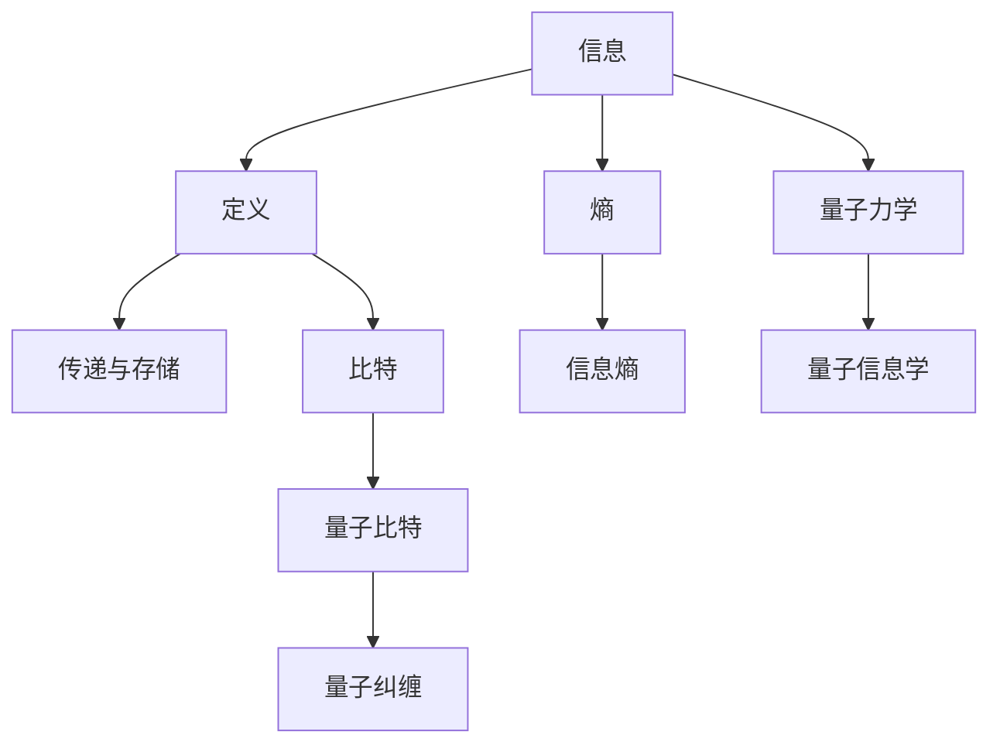

                 

### 引言

《宇宙的信息本质：从比特到现实的转化》旨在探讨信息这一概念在宇宙中的核心作用，以及它如何通过比特这一基本单位在现实世界中得以体现和实现。信息，作为宇宙中最基本的要素，贯穿于一切存在之中，无论是自然的演化，还是人类社会的进步，信息无处不在。而比特，作为信息的最小单位，是信息在数字世界中的载体，通过0和1两种状态，实现了信息的存储、传输和处理。

本书的核心问题是：信息是如何从抽象的比特形式转化为具体的现实世界的？为了解答这个问题，本书将分以下几个部分进行探讨：

1. **信息基础**：首先，我们将会讨论信息的定义、信息传递与存储的方式，以及信息与熵之间的关系。同时，我们还会引入量子力学这一领域，解释信息与量子力学之间的联系。
2. **比特与现实**：接下来，我们将深入了解比特的基本性质，探讨比特如何与计算机、通信和量子计算相结合，并揭示比特在现实世界中的应用。
3. **比特到现实的转化**：我们将深入探讨比特到现实转化过程中的基本原理和挑战，并分析这一转化在实际应用中的表现。
4. **宇宙中的信息本质**：在这一部分，我们将从宇宙的角度探讨信息的本质，解释宇宙中的比特流如何影响宇宙的演化。
5. **实践与探索**：最后一部分，我们将通过具体的案例，探讨比特到现实转化在实践中的应用，分析其中的挑战和解决方案，并展望未来的发展方向。

通过以上各部分的逐步探讨，本书旨在揭示信息、比特和现实之间的深层联系，为读者提供关于信息本质和比特到现实转化的全面理解。

### 信息基础

要理解信息在宇宙中的角色，我们首先需要明确信息的定义。信息可以被定义为关于某事物的知识或消息。在更广义的层面，信息可以被视为任何能够消除不确定性的东西。在物理学中，信息常常与熵的概念紧密相连。熵是衡量系统无序程度的物理量，而在信息论中，熵则代表了信息的不确定性。

#### 信息的定义

信息的定义多种多样，但最基础的可以理解为“数据的有用性”。数据本身可能是随机的，没有结构，但通过处理和解释，数据可以转化为有用的信息。例如，天气预报中的温度和降水数据，单独来看可能没有什么意义，但当我们将这些数据与历史数据和地理位置信息相结合，它们就变成了预测未来天气状况的有用信息。

#### 信息传递与存储

信息的传递与存储是信息基础的重要组成部分。在数字时代，信息的存储和传输主要依赖于计算机和通信技术。计算机通过二进制系统（即比特）来存储和处理信息，每一个比特只能表示两种状态之一：0或1。这种简单但强大的表示方法使得计算机能够高效地存储和处理大量复杂的信息。

信息传递则依赖于通信网络，如互联网、电话网络等。在这些网络中，信息通过电信号或光信号在节点之间传递。每一次信息的发送和接收都伴随着一定的噪声和误差，这些噪声和误差需要通过纠错编码和信号处理技术来减少。

#### 信息与熵

熵在信息论中是一个核心概念，它用来度量信息的随机性和不确定性。根据香农的信息熵公式，熵（H）可以被定义为：

$$
H(X) = -\sum_{i=1}^{n} p(x_i) \log_2 p(x_i)
$$

其中，\(X\) 是随机变量，\(p(x_i)\) 是随机变量取值为 \(x_i\) 的概率。熵的值越大，表示信息的不确定性越高；熵的值越小，表示信息越可靠。

在物理世界中，熵的增加与系统的无序度增加相关联。例如，当气体从高压区域扩散到低压区域时，气体的熵增加，系统的无序度也随之增加。信息与熵的关系表明，信息的传递和获取实际上是一种熵的转移过程。

#### 信息与量子力学

量子力学是研究微观世界的物理理论，而量子信息学则是量子力学和信息论的结合。在量子信息学中，量子比特（或称为量子位）代替了传统计算机中的经典比特。量子比特可以同时处于0和1的叠加态，这使得量子计算机能够在某些特定问题上有指数级的速度提升。

量子信息与经典信息的关键区别在于量子纠缠。当两个量子比特发生纠缠时，它们之间的状态将相互关联，即使它们相隔很远，一个量子比特的状态变化也会立即影响到另一个量子比特的状态。这种现象为量子通信和量子计算提供了新的可能性。

#### 概念与联系

为了更好地理解上述概念之间的关系，我们可以使用Mermaid流程图来展示它们之间的联系：



通过这个流程图，我们可以看到信息、熵和量子力学之间的复杂交互。信息传递和存储是信息论的核心，而熵的概念则帮助我们理解信息的不确定性。量子力学和信息学则为我们提供了一种全新的视角，使我们能够更好地理解和利用信息。

#### 核心算法原理讲解

为了更具体地理解比特的作用，我们可以通过Python源代码来演示一个简单的比特翻转算法。比特翻转是计算机中最基本和常用的操作之一，其核心目的是将一个比特的0状态变为1状态，或将1状态变为0状态。

```python
# Python 代码：比特翻转算法
def bit_flip(bit):
    if bit == '0':
        return '1'
    elif bit == '1':
        return '0'
    else:
        raise ValueError("输入必须是0或1")

# 测试比特翻转算法
print(bit_flip('0'))  # 输出：1
print(bit_flip('1'))  # 输出：0
print(bit_flip('2'))  # 抛出 ValueError
```

在这个简单的例子中，我们定义了一个名为`bit_flip`的函数，它接受一个比特作为输入，并根据该比特的值进行翻转。如果输入是'0'，函数返回'1'；如果输入是'1'，函数返回'0'。如果输入既不是'0'也不是'1'，函数将抛出一个`ValueError`。

通过这个算法，我们可以看到比特的翻转操作是如何通过简单的逻辑判断来实现的。这个基础操作在更复杂的计算机算法中起到了至关重要的作用。

#### 数学模型和公式讲解

在信息论和量子信息学中，数学模型和公式起到了关键作用，帮助我们更好地理解和量化信息的不确定性和复杂性。以下是一个常用的信息熵公式，以及一个具体的例子来解释其应用。

**信息熵公式：**

$$
H(X) = -\sum_{i=1}^{n} p(x_i) \log_2 p(x_i)
$$

这个公式表示随机变量\(X\)的信息熵，其中，\(p(x_i)\) 是随机变量\(X\)取值为\(x_i\)的概率，\(\log_2 p(x_i)\) 是对数函数，用于计算每个取值的概率带来的信息量。整个公式表示了随机变量所有可能取值的信息量的综合。

**示例：**

假设一个随机变量\(X\)有两个可能的取值，0和1，且它们出现的概率分别为0.5。那么，随机变量\(X\)的信息熵可以通过以下步骤计算：

1. 确定每个取值的概率：
   $$
   p(0) = 0.5, \quad p(1) = 0.5
   $$

2. 计算每个取值的对数概率：
   $$
   \log_2 p(0) = \log_2 0.5 = -1
   $$
   $$
   \log_2 p(1) = \log_2 0.5 = -1
   $$

3. 计算信息熵：
   $$
   H(X) = - (0.5 \times (-1) + 0.5 \times (-1)) = 1
   $$

因此，这个随机变量的信息熵为1比特。这意味着每次出现随机变量\(X\)时，我们能够获取1比特的信息。

通过这个示例，我们可以看到如何使用信息熵公式来量化随机变量的不确定性。在更复杂的系统中，信息熵的应用可以帮助我们理解数据的可靠性和信息的价值。

### 比特与现实

比特，作为信息的最小单位，不仅是计算机科学的基础，也是现代信息技术的核心。在现实世界中，比特的应用无处不在，从计算机编程到通信，再到量子计算，比特都在发挥着至关重要的作用。

#### 比特的基本性质

比特只有两种状态：0和1。这种简单的二进制表示方法使得比特在计算机系统中变得非常强大。每个比特可以通过电信号或光学信号来表示，一个电信号的高电平可以表示1，低电平可以表示0；而光学信号中，光的存在可以表示1，光的不存在可以表示0。

比特的这种二进制性质使得它能够被用来表示任何形式的信息，无论是文本、图像、音频还是视频。通过组合不同的比特，我们可以创建出复杂的数据结构，如字节、字和字符串。

#### 比特与计算机

计算机是比特的终极应用场景。计算机通过处理器（CPU）中的逻辑门电路来操作比特，实现数据的计算和处理。每个逻辑门都对应一个基本的比特操作，如与（AND）、或（OR）、非（NOT）等。这些基本的比特操作可以组合成更复杂的逻辑电路，从而实现各种功能，如加法器、存储器、寄存器等。

计算机中的存储器也是基于比特的。例如，随机存取存储器（RAM）和只读存储器（ROM）都是通过比特的排列组合来存储和读取数据的。每个存储单元包含一个或多个比特，通过地址总线来定位具体的数据位。

#### 比特与通信

比特在通信领域中的作用同样重要。在计算机网络中，数据通过电信号或光信号进行传输。这些信号包含了一系列的比特，它们按照一定的协议进行传输和接收。例如，以太网（Ethernet）和互联网（Internet）都是基于比特传输的网络协议。

在通信过程中，比特的传输可能会受到噪声和干扰的影响。为了确保数据的正确传输，通信系统使用了各种纠错编码技术，如海明码（Hamming Code）和卷积码（Convolutional Code）。这些编码技术通过在数据中添加冗余信息，使得接收端能够检测和纠正传输过程中产生的错误。

#### 比特与量子计算

量子计算是比特在现实世界中的又一重要应用。与传统计算机中的比特不同，量子计算机使用的是量子比特（qubit）。量子比特可以同时处于0和1的叠加态，这使得量子计算机在处理某些特定类型的问题时具有巨大的计算能力。

量子计算中的量子门是实现量子比特操作的基本单元。例如，Hadamard门（H门）可以将一个量子比特的状态从基态叠加到超态，而CNOT门（控制非门）可以实现量子比特之间的相互操作。

量子通信则是量子计算的一个重要分支。量子通信利用量子纠缠现象来实现信息的加密和解密。通过量子纠缠，发送者和接收者可以共享密钥，从而实现安全的通信。量子通信在量子网络中扮演着至关重要的角色，它有望在未来实现全球范围的安全通信。

#### 比特到现实的过程

比特到现实的过程可以分为几个关键步骤：

1. **编码**：将信息转换为比特序列。例如，文本信息可以通过ASCII编码转换为比特序列。
2. **传输**：通过电信号、光信号或无线信号将比特序列从一个地方传输到另一个地方。这个过程可能涉及编码和解码，以确保数据在传输过程中不受噪声和干扰的影响。
3. **解码**：接收端接收到的比特序列需要被解码回原始信息。这个过程可能涉及纠错编码技术，以确保数据的准确性。
4. **执行**：解码后的信息被计算机或其他设备执行，从而实现具体的任务或功能。

通过这些步骤，比特能够在现实世界中发挥作用，为人类社会带来巨大的变革。

#### 比特到现实的挑战

比特到现实的过程中面临着诸多挑战。首先，噪声和干扰是影响数据传输质量的主要因素。在传输过程中，噪声和干扰可能导致比特的错误，从而影响信息的准确性。为了克服这个问题，通信系统需要采用高效的纠错编码技术。

其次，数据处理速度和存储容量也是比特到现实过程中的关键问题。随着数据量的不断增加，如何快速、高效地处理和存储数据成为了一个重要的挑战。为了应对这个问题，计算机科学家不断研发更高效的算法和更强大的硬件设备。

最后，安全性也是比特到现实过程中的重要考虑因素。在数据传输和处理过程中，如何确保数据的安全，防止被非法访问和篡改，是一个长期的挑战。量子计算和量子通信的发展为信息安全提供了新的解决方案。

#### 比特到现实的应用

比特在现实世界中的应用已经深入到了社会的各个方面。以下是一些比特到现实应用的具体实例：

- **计算机编程**：比特是计算机编程的基础。通过编写代码，程序员可以创建出各种软件应用，从简单的文本编辑器到复杂的操作系统。
- **互联网通信**：互联网的运行依赖于比特的传输。通过电子邮件、社交媒体和在线购物，人们可以进行全球范围内的通信和交易。
- **量子计算**：量子计算利用量子比特的优势，在解决某些特定问题上具有巨大的潜力。例如，量子计算可以用于药物研发、材料科学和金融预测等领域。
- **物联网**：物联网（IoT）将各种设备和传感器连接到互联网，通过比特传输数据，实现智能化的家居、交通和城市管理。

通过这些应用，比特已经深刻地改变了我们的生活方式，并继续推动着社会的发展。

### 宇宙中的信息本质

在探讨比特与现实的关系时，我们不可避免地会触及到宇宙的层面。宇宙是一个巨大的信息网络，信息的流动和转化在其中扮演着至关重要的角色。从宇宙大爆炸到星系的形成，再到生命的诞生，信息无处不在，贯穿于整个宇宙的演化过程。

#### 宇宙的信息本质

宇宙的信息本质可以从两个方面来理解：一是宇宙自身的状态信息，二是宇宙中的信息流。

宇宙自身的状态信息包括宇宙的几何结构、物质的分布、能量的流动等。这些信息通过物理定律和观测手段，如引力波、微波背景辐射等，得以揭示。宇宙的状态信息是宇宙演化过程中不可或缺的一部分，它决定了宇宙的未来走向。

宇宙中的信息流则涉及到信息如何在宇宙中传递和转化。例如，光线携带了宇宙中遥远星系的信息，通过星际介质传输到地球上。这种信息流不仅帮助我们了解宇宙的过去，也揭示了宇宙的动态演化过程。

#### 宇宙中的比特流

宇宙中的比特流可以被视为宇宙信息的基本传递单元。从某种角度来看，宇宙中的所有物质和现象都可以视为比特流的不同表现形式。例如：

- **引力波**：引力波是宇宙中的一种信息流，它携带了宇宙中的重大事件，如黑洞碰撞、星系合并等的信息。
- **光线**：光线是宇宙中最常见的比特流形式，它携带着星系、行星、恒星等天体的信息。
- **电信号**：在地球上，电信号是信息传输的主要形式。从电话通信到互联网数据传输，电信号承载了人类社会的信息流。

这些比特流在宇宙中相互交织，构成了一个复杂的信息网络。这个网络不仅反映了宇宙的当前状态，也记录了宇宙的历史和未来。

#### 信息与宇宙演化

宇宙的演化是一个复杂而有序的过程，信息在其中起到了关键作用。从宇宙大爆炸的瞬间，到星系的形成、恒星的诞生，再到生命的进化，信息贯穿于整个演化过程。

- **宇宙大爆炸**：宇宙大爆炸是宇宙演化的重要起点。大爆炸产生的能量和物质，通过引力作用，逐渐形成了星系和恒星。这个过程中，信息以能量和物质的形式传递和转化。
- **星系形成**：星系的形成是一个信息丰富的过程。恒星在星系中诞生和死亡，释放出的能量和物质重新塑造了星系的形态和结构。这个过程包含了大量的信息流，如引力波、光线等。
- **生命进化**：在地球上，生命的进化也是一个信息驱动的过程。通过遗传信息的传递，生物体不断适应环境的变化，进化出新的特征和功能。

通过这些实例，我们可以看到信息在宇宙演化中的重要作用。信息不仅决定了宇宙的状态和演化过程，也影响了生命的起源和进化。

### 实践与探索

比特到现实的转化不仅在理论层面具有重要意义，更在实际应用中展现出了巨大的潜力。通过具体的案例和实践，我们可以更深入地理解比特到现实转化的过程及其带来的实际影响。

#### 应用案例

以下是一些比特到现实转化在实际应用中的案例：

1. **计算机编程**：
   - 在软件开发领域，比特到现实的转化体现在代码的编写、编译和执行过程。程序员通过编写代码（即比特序列），然后通过编译器将代码转化为机器语言（即比特流），最终在计算机上执行。例如，一个简单的Python程序：
     ```python
     print("Hello, World!")
     ```
     这个程序通过比特的转换，最终在屏幕上显示出了文本。

2. **通信技术**：
   - 在通信领域，比特到现实的转化体现在数据从发送端到接收端的过程。例如，当通过手机发送短信时，文本信息首先被转化为比特序列，然后通过无线电波传输到接收端的基站，最终在接收端手机上显示。这一过程涉及编码、调制、解调等步骤。

3. **物联网**：
   - 物联网（IoT）通过比特的转化，将物理世界与数字世界连接起来。例如，智能家居设备通过传感器收集环境数据（如温度、湿度等），然后通过无线网络将数据传输到中央控制系统，实现设备的自动控制和远程监控。

#### 实际案例分析

为了更具体地说明比特到现实转化的应用，我们可以分析以下几个实际案例：

1. **医疗健康监测**：
   - 通过可穿戴设备，如智能手环和健康监测仪，可以实时收集人体的健康数据（如心率、血压、步数等）。这些数据通过传感器转化为比特序列，然后通过无线网络传输到云端服务器进行分析和存储。医生可以通过这些数据远程监控患者的健康状况，及时做出诊断和治疗决策。

2. **自动驾驶技术**：
   - 自动驾驶汽车通过传感器和摄像头收集周围环境的信息，包括道路状况、行人行为等。这些信息通过比特序列进行处理和识别，然后转化为控制指令，实现车辆的自动行驶。例如，特斯拉的自动驾驶系统通过复杂的算法和大量数据的处理，实现了安全、高效的自动驾驶。

3. **金融交易**：
   - 在金融领域，比特到现实的转化体现在电子交易系统中。交易者通过计算机终端输入买卖指令，这些指令被转化为比特流，通过互联网传输到交易市场。交易系统通过处理这些比特流，实现了实时交易，提高了交易效率和透明度。

#### 代码解读与分析

为了更好地理解比特到现实转化的过程，我们可以通过具体的代码示例来展示这一转化。以下是一个简单的Python程序，用于实现数据的二进制编码和解码：

```python
# Python 代码：二进制编码与解码示例

def to_binary(decimal_number):
    binary_string = bin(decimal_number)[2:]  # 去除'0b'前缀
    return binary_string

def from_binary(binary_string):
    decimal_number = int(binary_string, 2)
    return decimal_number

# 测试
decimal_number = 10
binary_string = to_binary(decimal_number)
print(f"十进制数{decimal_number}转换为二进制为：{binary_string}")

recovered_decimal = from_binary(binary_string)
print(f"二进制数{binary_string}转换为十进制为：{recovered_decimal}")
```

在这个示例中，`to_binary` 函数将十进制数转换为二进制字符串，`from_binary` 函数则将二进制字符串转换回十进制数。这个简单的程序展示了数据在计算机中如何通过比特的编码和解码实现信息的转换。

#### 项目实战

为了进一步展示比特到现实转化的应用，我们可以设计一个简单的项目——智能温度监控系统。该项目旨在通过传感器实时监测环境温度，并将数据传输到中央控制系统进行实时分析和报警。

1. **开发环境搭建**：
   - 开发工具：Python 3.x
   - 传感器：DHT11 温湿度传感器
   - 计算设备：Raspberry Pi 4

2. **源代码实现**：
   - 首先，我们需要安装Raspberry Pi操作系统，并安装Python环境。然后，我们使用Python编写程序，通过GPIO接口读取DHT11传感器的数据，并将其转换为比特序列。
     ```python
     import RPi.GPIO as GPIO
     import time
     import serial

     def read_dht11(sensor_pin):
         GPIO.setmode(GPIO.BCM)
         GPIO.setup(sensor_pin, GPIO.OUT)
         GPIO.output(sensor_pin, GPIO.LOW)
         time.sleep(0.05)
         GPIO.output(sensor_pin, GPIO.HIGH)
         time.sleep(0.000000015)  # 15微妙
         GPIO.output(sensor_pin, GPIO.LOW)
         
         # 等待传感器响应
         time.sleep(0.05)
         
         # 读取数据
         data = serial.Serial(sensor_pin, 9600, timeout=0.01)
         time.sleep(0.01)
         humidity, temperature = data.readline().decode('utf-8').split(',')
         return humidity, temperature

     # 主程序
     sensor_pin = 4
     while True:
         humidity, temperature = read_dht11(sensor_pin)
         print(f"当前温度：{temperature}℃，当前湿度：{humidity}%")
         time.sleep(1)
     ```

3. **代码解读与分析**：
   - 在这段代码中，我们首先导入了必要的库，然后定义了一个`read_dht11`函数，用于读取DHT11传感器的数据。函数通过GPIO接口发送信号给传感器，并读取传感器的响应数据。最后，我们将这些数据打印到屏幕上。
   - 为了实现数据的实时监测和传输，我们可以将这段代码运行在一个循环中，每隔一定时间读取一次传感器的数据，并将数据发送到远程服务器或监控平台。

通过这个项目，我们可以看到比特到现实转化的具体实现过程。从传感器读取的数据通过比特序列进行处理和传输，最终在中央系统中实现实时监测和报警功能。

#### 最佳实践 tips

在比特到现实转化的过程中，以下是一些最佳实践和注意事项：

1. **数据准确性和可靠性**：
   - 在数据采集和传输过程中，确保数据准确性和可靠性是非常重要的。使用高质量的传感器和稳定的通信协议可以减少数据错误和丢失。

2. **安全性**：
   - 在处理敏感数据时，确保数据传输的安全。使用加密技术和安全的传输协议，如HTTPS，可以保护数据不被非法访问。

3. **性能优化**：
   - 为了提高系统性能，可以对数据传输和处理进行优化。例如，使用多线程或多进程技术，可以提高数据处理的速度。

4. **系统可扩展性**：
   - 在设计系统时，考虑系统的可扩展性，以便在未来能够轻松地添加新功能或扩展设备。

#### 小结

通过本文的探讨，我们深入了解了比特到现实转化的过程，以及其在宇宙中的核心作用。从基本的比特操作，到复杂的计算机编程、通信和量子计算，比特已经深刻地改变了我们的生活方式。同时，我们通过具体案例和项目实战，展示了比特到现实转化的实际应用和价值。

在未来，随着技术的不断进步，比特到现实转化将继续推动社会的进步和发展。我们期待着更多的创新和应用，为人类创造更加美好的未来。

### 拓展阅读

对于希望深入了解比特到现实转化的读者，以下是一些推荐阅读资源：

1. **基础书籍**：
   - 《计算机网络》（第7版），作者：谢希仁
   - 《深入理解计算机系统》，作者：Randal E. Bryant & David R. O’Hallaron
   - 《量子计算简介》，作者：Nicole Yunger Halpern

2. **进阶书籍**：
   - 《信息简史》，作者：詹姆斯·格利克
   - 《生命是什么？》，作者：埃尔温·薛定谔
   - 《量子纠缠：量子力学的革命性发现》，作者：阿兰·阿斯佩克

3. **在线课程和教程**：
   - Coursera上的《计算机科学基础》课程
   - edX上的《量子计算导论》课程
   - Khan Academy上的《计算机网络》教程

通过这些资源和书籍，读者可以更深入地了解比特到现实转化的理论和实践，探索这一领域的最新进展和应用。

### 文章关键词

- 宇宙信息本质
- 比特
- 信息熵
- 量子计算
- 计算机编程
- 通信技术
- 物联网
- 自动驾驶

### 文章摘要

《宇宙的信息本质：从比特到现实的转化》探讨信息在宇宙中的核心作用以及比特作为信息最小单位如何实现这一转化的过程。文章首先介绍了信息的定义、传递与存储，以及信息与熵的关系。接着，深入探讨了比特的基本性质、与计算机和通信技术的结合，以及量子计算中的比特应用。文章进一步展示了比特到现实转化的过程、实际应用案例，并通过具体项目和代码示例进行了详细讲解。最后，文章分析了宇宙中的比特流和其在宇宙演化中的作用，并对未来进行了展望。

