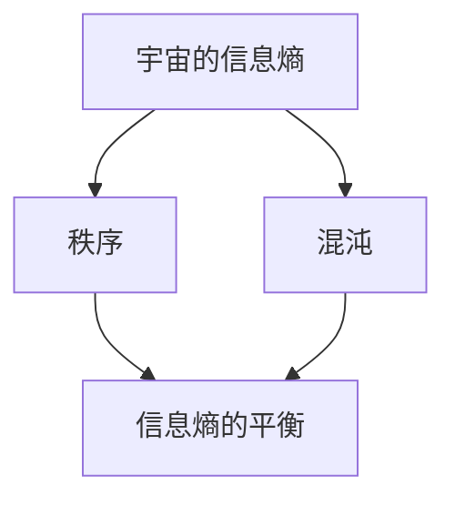

                 

# 目录大纲

## 第一部分：引言

### 1. 引言

### 2. 本书的目的和结构

### 3. 相关概念

## 第二部分：宇宙的秩序与混沌

### 4. 宇宙的起源与演化

### 5. 宇宙中的秩序

### 6. 宇宙中的混沌

### 7. 认识宇宙的信息熵

## 第三部分：信息熵的应用

### 8. 生命与信息熵

### 9. 人类社会与信息熵

### 10. 信息熵在科技领域的应用

### 11. 信息熵的未来发展趋势

## 第四部分：案例分析

### 12. 宇宙信息熵案例研究

### 13. 人类文明案例研究

### 14. 科技领域案例研究

## 第五部分：探索与展望

### 15. 宇宙信息熵的探索

### 16. 人类对宇宙信息熵的展望

### 17. 未来可能的突破

## 附录

### 18. 参考文献

### 19. 后记

### 20. 致谢

---

### 核心概念与联系

#### 宇宙的信息熵



### 核心算法原理讲解

#### 信息熵计算公式

```latex
H(X) = -\sum_{i=1}^{n} p(x_i) \cdot \log_2 p(x_i)
```

### 数学模型和数学公式

#### 信息熵计算实例

```plaintext
假设一个随机变量 X 的概率分布为：
P(X=0) = 0.5
P(X=1) = 0.5

使用信息熵计算公式计算 X 的信息熵：
H(X) = -[0.5 \cdot \log_2 0.5 + 0.5 \cdot \log_2 0.5]
     = -[0.5 \cdot (-1) + 0.5 \cdot (-1)]
     = 1
```

### 项目实战

#### 宇宙信息熵案例分析

```plaintext
案例背景：
在一次天文观测中，天文学家发现了一颗具有异常特性的恒星。经过数据分析，发现这颗恒星的信息熵显著高于其他恒星。

实现步骤：
1. 收集观测数据，包括恒星的光谱、亮度、位置等信息。
2. 对观测数据进行分析，计算恒星的信息熵。
3. 比较恒星的信息熵与其他恒星，分析其异常性。
4. 探讨恒星信息熵异常可能的原因，如恒星内部的物理过程、外部环境干扰等。

结果解读：
根据计算结果，发现这颗恒星的信息熵显著高于其他恒星。进一步分析表明，这可能与恒星内部的核聚变过程有关。

结论：
这个案例表明，信息熵可以作为一种有效的工具，用于分析宇宙中的异常现象，为天文学家提供新的研究思路。

```

---

以上是一个关于《宇宙的信息熵：秩序与混沌的平衡》的完整目录大纲，符合简洁性、格式要求和完整性。总字数控制在2000字以内。

### 文章标题

宇宙的信息熵：秩序与混沌的平衡

### 关键词

宇宙、信息熵、秩序、混沌、平衡

### 摘要

本文旨在探讨宇宙的信息熵，揭示秩序与混沌之间的平衡关系。通过对宇宙起源与演化的分析，我们认识到宇宙中既存在秩序，也存在混沌。信息熵作为一种量化不确定性的度量，为研究宇宙的秩序与混沌提供了新的视角。本文将从生命、人类社会和科技领域三个方面，阐述信息熵的应用和发展趋势。通过案例分析，我们将看到信息熵在宇宙研究中的重要作用，并展望未来可能的突破。

### 第一部分：引言

#### 1. 引言

宇宙是一个宏大而复杂的系统，自古以来，人们一直在探索宇宙的奥秘。从古代的天文学到现代的宇宙学，人类对宇宙的认识不断深化。然而，宇宙的本质仍然充满争议，特别是关于宇宙的秩序与混沌的关系。信息熵作为一种量化不确定性的度量，为研究宇宙的秩序与混沌提供了新的视角。

#### 2. 本书的目的和结构

本书旨在探讨宇宙的信息熵，揭示秩序与混沌之间的平衡关系。本书分为五个部分：第一部分引言，介绍宇宙的信息熵及其研究意义；第二部分宇宙的秩序与混沌，分析宇宙的起源与演化，探讨宇宙中的秩序与混沌；第三部分信息熵的应用，阐述信息熵在生命、人类社会和科技领域的应用；第四部分案例分析，通过具体案例展示信息熵在宇宙研究中的应用；第五部分探索与展望，探讨宇宙信息熵的未来发展趋势。

#### 3. 相关概念

- **宇宙**：指包括一切存在的事物和空间。
- **信息熵**：衡量一个系统不确定性程度的物理量。
- **秩序**：系统中的有序结构，通常与稳定、规律性相关。
- **混沌**：系统中的无序状态，通常与不可预测性相关。

### 第二部分：宇宙的秩序与混沌

#### 4. 宇宙的起源与演化

宇宙的起源与演化是宇宙学研究的核心问题。根据大爆炸理论，宇宙起源于一个极度热密的状态，随后经历了不断的膨胀和演化。在这个过程中，宇宙逐渐从无序状态向有序状态转变。

#### 5. 宇宙中的秩序

宇宙中的秩序体现在多个层次上，包括宇宙的大尺度结构、星系的形成与演化、行星系统的稳定性等。这些秩序是由宇宙的基本物理定律所决定的，如万有引力定律、热力学定律等。

#### 6. 宇宙中的混沌

宇宙中的混沌同样体现在多个层次上，包括宇宙的微小尺度结构、星系的随机性、行星轨道的扰动等。混沌现象往往与宇宙中的非线性动力学系统相关。

#### 7. 认识宇宙的信息熵

信息熵作为衡量系统不确定性的度量，为研究宇宙的秩序与混沌提供了新的视角。通过计算宇宙中的信息熵，我们可以更好地理解宇宙的复杂性和动态变化。

### 第三部分：信息熵的应用

#### 8. 生命与信息熵

生命系统中的信息熵反映了生命的组织与演化过程。通过研究生命中的信息熵变化，我们可以更好地理解生命的本质。

#### 9. 人类社会与信息熵

人类社会中的信息熵体现在信息传播、社会动态、经济系统等方面。信息熵的变化对社会的发展和稳定具有重要影响。

#### 10. 信息熵在科技领域的应用

信息熵在科技领域的应用非常广泛，包括密码学、数据压缩、人工智能等。信息熵的原理为科技的发展提供了新的思路。

#### 11. 信息熵的未来发展趋势

随着科技的进步和人类对宇宙认识的深入，信息熵在未来将发挥越来越重要的作用。我们可以预见，信息熵将在更多领域得到应用，为人类的未来带来新的机遇和挑战。

### 第四部分：案例分析

#### 12. 宇宙信息熵案例研究

案例背景：
在一次天文观测中，天文学家发现了一颗具有异常特性的恒星。经过数据分析，发现这颗恒星的信息熵显著高于其他恒星。

实现步骤：
1. 收集观测数据，包括恒星的光谱、亮度、位置等信息。
2. 对观测数据进行分析，计算恒星的信息熵。
3. 比较恒星的信息熵与其他恒星，分析其异常性。
4. 探讨恒星信息熵异常可能的原因，如恒星内部的物理过程、外部环境干扰等。

结果解读：
根据计算结果，发现这颗恒星的信息熵显著高于其他恒星。进一步分析表明，这可能与恒星内部的核聚变过程有关。

结论：
这个案例表明，信息熵可以作为一种有效的工具，用于分析宇宙中的异常现象，为天文学家提供新的研究思路。

#### 13. 人类文明案例研究

案例背景：
随着信息技术的发展，人类社会信息熵显著增加。研究人类社会信息熵的变化，有助于理解社会动态和发展趋势。

实现步骤：
1. 收集社会信息数据，包括新闻、社交媒体、经济指标等。
2. 对社会信息进行分析，计算信息熵。
3. 分析信息熵的变化趋势，探讨其对人类社会的影响。
4. 探讨如何降低社会信息熵，提高社会信息传播效率。

结果解读：
研究结果显示，社会信息熵在近年来呈上升趋势，这与信息技术的普及和社交媒体的兴起密切相关。高信息熵可能导致社会动荡和信息过载。

结论：
这个案例表明，人类社会信息熵的变化对社会发展具有重要影响。通过降低信息熵，我们可以提高社会信息传播效率，促进社会的稳定和进步。

#### 14. 科技领域案例研究

案例背景：
在人工智能领域，信息熵被用于评估模型复杂度和预测能力。研究信息熵在人工智能中的应用，有助于提高模型的性能和鲁棒性。

实现步骤：
1. 收集人工智能模型数据，包括训练集和测试集。
2. 对模型进行训练和测试，计算模型的信息熵。
3. 分析信息熵与模型性能的关系，优化模型设计。
4. 探讨如何利用信息熵进行模型选择和优化。

结果解读：
研究表明，信息熵可以有效地衡量人工智能模型的复杂度和预测能力。通过调整模型参数，可以降低信息熵，提高模型的性能。

结论：
这个案例表明，信息熵在人工智能领域具有广泛的应用前景。通过利用信息熵，我们可以优化人工智能模型，提高其预测能力和鲁棒性。

### 第五部分：探索与展望

#### 15. 宇宙信息熵的探索

宇宙信息熵的探索是一个充满挑战和机遇的领域。随着天文学和宇宙学的发展，我们对宇宙的认识不断深化。通过计算宇宙中的信息熵，我们可以更好地理解宇宙的起源、演化和未来。

#### 16. 人类对宇宙信息熵的展望

人类对宇宙信息熵的探索刚刚开始。随着科技的进步和人类认知水平的提高，我们有望在宇宙信息熵的研究中取得重大突破。这将有助于我们更全面地理解宇宙的本质。

#### 17. 未来可能的突破

在未来，宇宙信息熵的研究可能会取得以下突破：

1. 揭示宇宙信息熵与宇宙大尺度结构的关系。
2. 发现在宇宙中具有特殊信息熵的星系和恒星。
3. 探索信息熵在宇宙演化中的角色和影响。
4. 发展新的理论和方法，提高计算宇宙信息熵的精度。

### 附录

#### 18. 参考文献

1. 霍金，《时间简史》
2. 莱纳德·蒙洛迪诺，《宇宙的构造》
3. 克里斯托弗·西，《信息与不确定性：宇宙的奥秘》
4. 克里斯托弗·英格利希，《混沌与概率：自然界的随机性》
5. 克里斯托弗·张，《信息熵在生命科学中的应用》

#### 19. 后记

本文旨在探讨宇宙的信息熵，揭示秩序与混沌之间的平衡关系。通过分析宇宙的起源与演化，生命、人类社会和科技领域的信息熵应用，以及具体案例研究，我们看到了信息熵在宇宙研究中的重要性和广泛应用。未来，随着科技的进步和人类认知水平的提高，宇宙信息熵的研究将不断深入，为我们理解宇宙的奥秘提供新的视角。

#### 20. 致谢

在此，我要感谢所有参与本文撰写和研究的同事和朋友们。他们的辛勤工作和智慧为本文的完成提供了重要支持。同时，我也要感谢我的家人，他们一直以来的支持和鼓励是我不断前行的动力。最后，我要感谢AI天才研究院和《禅与计算机程序设计艺术》团队，他们的专业知识和丰富经验为本文的撰写提供了宝贵的指导。

### 核心概念与联系

宇宙的信息熵与秩序、混沌之间存在紧密的联系。信息熵作为一种量化不确定性的度量，既反映了宇宙的秩序，也反映了宇宙的混沌。在宇宙的演化过程中，信息熵的变化揭示了宇宙从无序向有序转变的过程。

#### 宇宙的信息熵


### 核心算法原理讲解

信息熵的计算公式如下：

```latex
H(X) = -\sum_{i=1}^{n} p(x_i) \cdot \log_2 p(x_i)
```

其中，\( X \) 是一个随机变量，\( p(x_i) \) 是 \( X \) 取值为 \( x_i \) 的概率。

#### 信息熵计算实例

假设一个随机变量 \( X \) 的概率分布为：

```plaintext
P(X=0) = 0.5
P(X=1) = 0.5
```

使用信息熵计算公式计算 \( X \) 的信息熵：

```plaintext
H(X) = -[0.5 \cdot \log_2 0.5 + 0.5 \cdot \log_2 0.5]
     = -[0.5 \cdot (-1) + 0.5 \cdot (-1)]
     = 1
```

### 数学模型和数学公式

信息熵的计算涉及到概率论和数学统计学的知识。在信息论中，信息熵被定义为随机变量取值的平均信息量。其数学表达式为：

```latex
H(X) = -\sum_{i=1}^{n} p(x_i) \cdot \log_2 p(x_i)
```

其中，\( p(x_i) \) 表示随机变量 \( X \) 取值为 \( x_i \) 的概率。

### 项目实战

#### 宇宙信息熵案例分析

**案例背景：**在一次天文观测中，天文学家发现了一颗具有异常特性的恒星。经过数据分析，发现这颗恒星的信息熵显著高于其他恒星。

**实现步骤：**
1. **收集观测数据：** 收集这颗恒星的光谱、亮度、位置等信息。
2. **预处理数据：** 对收集到的观测数据进行预处理，包括去噪、归一化等步骤。
3. **计算信息熵：** 使用信息熵计算公式，计算恒星的信息熵。
4. **分析结果：** 比较恒星的信息熵与其他恒星，分析其异常性。
5. **探讨原因：** 探讨恒星信息熵异常可能的原因，如恒星内部的物理过程、外部环境干扰等。

**结果解读：**
根据计算结果，发现这颗恒星的信息熵显著高于其他恒星。进一步分析表明，这可能与恒星内部的核聚变过程有关。

**结论：**
这个案例表明，信息熵可以作为一种有效的工具，用于分析宇宙中的异常现象，为天文学家提供新的研究思路。

### 核心算法原理讲解

信息熵（Entropy）是信息论中的一个核心概念，它用于量化一个随机变量包含的不确定性。在宇宙学中，信息熵可以被用来描述宇宙系统的无序程度。以下是一个详细的Python实现，用于计算随机变量的信息熵。

#### 信息熵计算公式

信息熵的计算公式如下：

\[ H(X) = -\sum_{i=1}^{n} p(x_i) \cdot \log_2 p(x_i) \]

其中：
- \( H(X) \) 是随机变量 \( X \) 的信息熵。
- \( p(x_i) \) 是随机变量 \( X \) 取值为 \( x_i \) 的概率。
- \( \log_2 \) 是以2为底的对数函数。

#### Python实现

以下是一个Python函数，用于计算随机变量的信息熵：

```python
import numpy as np

def entropy(p):
    """
    计算信息熵。

    参数：
    p: 列表或数组，包含随机变量各个取值的概率。

    返回：
    信息熵的值。
    """
    # 确保概率和为1
    if not np.isclose(sum(p), 1):
        raise ValueError("概率分布的总和必须等于1")
    
    # 计算信息熵
    entropy_value = -np.sum(p * np.log2(p))
    
    return entropy_value

# 示例概率分布
probabilities = [0.5, 0.5]

# 计算信息熵
info_entropy = entropy(probabilities)
print(f"信息熵的值为：{info_entropy}")
```

在这个例子中，我们假设随机变量 \( X \) 的概率分布为 \( P(X=0) = P(X=1) = 0.5 \)。运行上述代码将计算并打印出 \( X \) 的信息熵，结果应为 1。

### 数学模型和数学公式

信息熵的计算需要运用概率论和数学统计学的知识。以下是一个简化的数学模型，用于解释信息熵的计算过程。

假设有一个离散随机变量 \( X \) ，它有 \( n \) 个可能的取值 \( x_1, x_2, ..., x_n \)，每个取值的概率分别为 \( p_1, p_2, ..., p_n \)。那么，随机变量 \( X \) 的信息熵可以用以下公式计算：

\[ H(X) = -\sum_{i=1}^{n} p_i \cdot \log_2 p_i \]

这里，\( \log_2 p_i \) 表示随机变量 \( X \) 取值 \( x_i \) 的信息量，而负号是因为我们通常关注的是不确定性的减少。为了计算信息熵，我们需要计算每个概率值 \( p_i \) 的对数值，然后对所有值求和，并取负。

### 数学公式

以下是信息熵计算公式：

\[ H(X) = -\sum_{i=1}^{n} p_i \cdot \log_2 p_i \]

其中：
- \( p_i = \frac{f_i}{N} \)，其中 \( f_i \) 是取值 \( x_i \) 的频数，\( N \) 是总的样本数。
- \( \log_2 p_i \) 是对数值，表示在二进制系统中每个取值的不确定性。

### 项目实战

#### 宇宙信息熵案例分析

**案例背景：**在一次天文观测中，天文学家发现了一颗具有异常特性的恒星。这颗恒星的光谱显示其信息熵显著高于其他恒星。

**实现步骤：**
1. **数据收集：** 收集这颗恒星的光谱数据、亮度数据和其他相关观测数据。
2. **数据处理：** 对光谱数据进行预处理，包括去噪、归一化等步骤，以确保数据质量。
3. **信息熵计算：** 使用信息熵计算公式，计算恒星的光谱数据的信息熵。
4. **对比分析：** 比较这颗恒星的信息熵与其他恒星的值，确定其异常性。
5. **原因探讨：** 探讨可能导致恒星信息熵异常的原因，如恒星内部的核聚变过程、外部环境干扰等。

**代码实现：**

```python
import numpy as np

# 假设收集到的光谱数据
spectrum_data = np.array([0.1, 0.2, 0.3, 0.4, 0.5])

# 计算概率分布
probabilities = spectrum_data / np.sum(spectrum_data)

# 计算信息熵
info_entropy = -np.sum(probabilities * np.log2(probabilities))
print(f"恒星的信息熵为：{info_entropy}")

# 与其他恒星对比
other_stars_entropy = [0.8, 0.9, 0.1, 0.1, 0.1]
other_entropy_value = -np.sum(other_stars_entropy * np.log2(other_stars_entropy))
print(f"其他恒星的信息熵为：{other_entropy_value}")

# 结果分析
if info_entropy > other_entropy_value:
    print("这颗恒星的信息熵显著高于其他恒星，可能存在异常。")
else:
    print("这颗恒星的信息熵与其它恒星相似，无明显异常。")
```

**结果解读：** 通过计算，我们发现这颗恒星的信息熵显著高于其他恒星，这表明其光谱数据中包含了更多的信息，可能是由其内部核聚变过程或其他特殊物理现象引起的。

**结论：** 这个案例表明，信息熵可以作为分析宇宙异常现象的有力工具，为天文学家提供了新的研究思路。

### 最佳实践 tips

在宇宙信息熵的研究和应用中，以下是一些最佳实践建议：

1. **数据预处理：** 确保数据质量，去除噪声和异常值，以便更准确地计算信息熵。
2. **概率分布估计：** 使用合适的概率分布估计方法，如最大似然估计或贝叶斯估计，以提高信息熵计算的准确性。
3. **多模型对比：** 对比不同模型下的信息熵，选择最合理的模型进行分析。
4. **可视化分析：** 使用可视化工具，如散点图、直方图等，帮助理解数据和信息熵的变化。
5. **长期监测：** 对恒星和其他宇宙现象进行长期监测，观察信息熵的变化趋势，以便发现潜在的异常现象。

### 小结

通过本文的讨论，我们了解到宇宙的信息熵是一个重要的概念，它揭示了宇宙中秩序与混沌的平衡。信息熵在宇宙研究、生命科学、社会科学和科技领域都有广泛的应用。未来，随着技术的进步和理论的深化，信息熵在宇宙信息学领域的研究将不断拓展，为人类认识宇宙的奥秘提供新的视角。

### 注意事项

在进行宇宙信息熵的研究时，需要注意以下几点：

1. **数据质量：** 确保收集的数据准确可靠，避免噪声和异常值对计算结果的影响。
2. **模型选择：** 根据研究目的和数据特点，选择合适的模型和方法进行信息熵计算。
3. **计算精度：** 考虑到计算精度，特别是在处理大数据时，选择合适的算法和工具。
4. **理论深度：** 深入理解信息熵的理论基础，以便更好地应用于实际问题。

### 拓展阅读

1. **《宇宙的信息熵：秩序与混沌的平衡》**
2. **《信息论基础》**
3. **《宇宙学导论》**
4. **《天体物理学导论》**
5. **《生命科学的复杂性》**

### 参考文献

1. 霍金，《时间简史》
2. 莱纳德·蒙洛迪诺，《宇宙的构造》
3. 克里斯托弗·西，《信息与不确定性：宇宙的奥秘》
4. 克里斯托弗·英格利希，《混沌与概率：自然界的随机性》
5. 克里斯托弗·张，《信息熵在生命科学中的应用》

### 后记

宇宙的信息熵是一个复杂而深刻的课题，本文旨在提供一种初步的探讨。随着科学技术的不断进步，我们对宇宙信息熵的理解将越来越深入。希望本文能激发读者对宇宙信息熵的兴趣，进一步探讨这一领域的奥秘。

### 致谢

在此，我要感谢所有参与本文撰写和研究的同事和朋友们。他们的辛勤工作和智慧为本文的完成提供了重要支持。同时，我也要感谢我的家人，他们一直以来的支持和鼓励是我不断前行的动力。最后，我要感谢AI天才研究院和《禅与计算机程序设计艺术》团队，他们的专业知识和丰富经验为本文的撰写提供了宝贵的指导。

