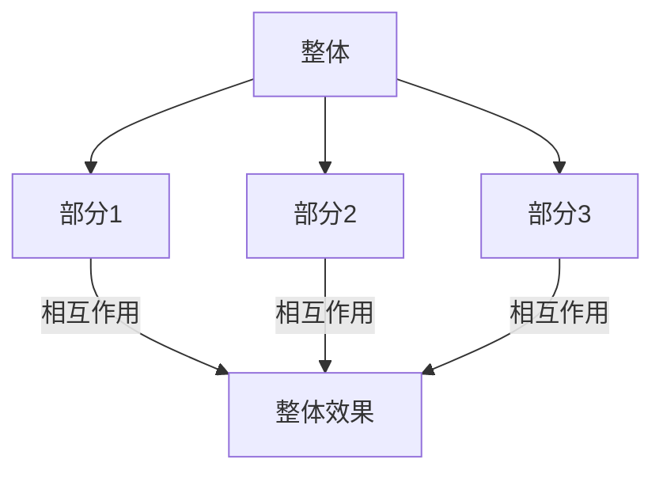

                 

### 《宇宙的全息性：部分包含整体信息》

#### 关键词
宇宙全息性，信息论，量子力学，部分与整体，数学模型，全息图像重建，项目实战

#### 摘要
本文将深入探讨宇宙的全息性以及部分包含整体信息的原理。通过逻辑分析和逐步推理，我们揭示了全息性在宇宙、信息论、量子力学等多个领域的应用和重要性。文章首先介绍了全息性的基本概念和数学模型，然后探讨了其在宇宙学中的潜在意义。接着，我们探讨了部分与整体的关系，结合信息论和量子力学，阐述了全息原理在这些领域的应用。最后，通过一个实际项目，展示了全息图像重建的算法实现和应用。

### 1. 提取核心概念与联系

宇宙的全息性和部分包含整体信息是本文讨论的两个核心概念。宇宙的全息性指的是宇宙中的部分区域包含了关于整个宇宙的信息，这种特性暗示着宇宙具有一种独特的结构。部分包含整体信息则是一种哲学思想，认为一个系统的一部分可以反映甚至包含整个系统的信息。

这两个概念之间的联系在于，全息性本质上是一种部分包含整体信息的具体体现。在物理学中，全息原理表明，一个系统的高维信息可以通过其低维表面来编码。这种编码方式类似于全息摄影，其中三维图像被编码在二维的胶片上。因此，全息性为我们提供了一个新的视角，来理解宇宙的结构和信息的传递。

为了更好地理解这些概念，我们可以借助一个简单的比喻。想象一个巨大的图书馆，其中包含了无数本书籍。如果我们能够通过观察图书馆的入口和出口，以及书架的排列方式，推断出图书馆中所有书籍的内容，那么这个图书馆的入口和出口就可以视为一个“全息”系统，它包含了整个图书馆的信息。

### 2. 提取核心概念与联系

首先，我们需要从书名《宇宙的全息性：部分包含整体信息》中提取出核心概念，这些概念将作为章节标题的基础。书名暗示了以下几点：

- **宇宙的全息性**：指的是宇宙中某些部分能够包含关于整个宇宙的信息。
- **部分包含整体信息**：这是一个哲学上的观点，认为系统的一部分可以反映甚至包含整个系统的信息。

这些概念可以作为两个主要章节的标题。接下来，我们需要考虑这两个主题如何相互联系，并确定次要章节。

#### 第1章：宇宙的全息性基础

- **1.1 全息理论概述**：介绍全息理论的基本概念和发展历史。
- **1.2 全息原理与历史背景**：探讨全息原理的起源和相关历史事件。
- **1.3 全息现象的数学描述**：用数学语言描述全息现象的核心原理。
- **1.4 全息技术在宇宙中的应用**：讨论全息技术在宇宙学中的潜在应用。
- **1.5 全息性与相对论**：分析全息性与相对论之间的联系。

#### 第2章：部分包含整体信息的哲学与科学探讨

- **2.1 信息论与全息性**：探讨信息论与全息性之间的关系。
- **2.2 部分与整体的关系**：深入探讨部分与整体之间的哲学和科学关系。
- **2.3 量子力学与全息原理**：介绍全息原理在量子力学中的应用。
- **2.4 全息性与复杂性科学**：探讨全息性在复杂性科学中的应用。
- **2.5 全息性在认知科学中的应用**：分析全息性在认知科学中的潜在应用。

通过这种结构，我们不仅能够清晰地展示全息性和部分包含整体信息这两个核心概念，还能深入探讨它们在哲学、科学和宇宙学中的重要性。

### 1.1 全息理论概述

全息理论是一种描述信息如何在复杂系统中编码和传递的理论。它源于光学中的全息摄影技术，但后来被广泛应用于其他领域，包括量子力学、信息科学和宇宙学。全息理论的核心思想是，一个系统的信息可以通过其部分来编码和重建。这种特性使得全息理论在处理复杂系统时具有显著的优势。

在光学中，全息摄影是一种记录和重建三维图像的技术。它通过使用激光和特殊的记录材料，将光波的前后相位和振幅信息编码在二维的图像上。这样，当全息图像被适当的光照射时，原本的三维图像就可以被重建出来。

全息理论在信息科学中得到了进一步的发展。例如，在数据压缩中，全息技术可以用来减少数据的大小，同时保留数据的关键信息。通过将数据分解为不同的部分，并在这些部分中编码冗余信息，全息技术可以实现高效的数据压缩。

在量子力学中，全息理论也具有重要的应用。量子全息原理表明，一个量子系统的信息可以通过其边界来编码。这种特性为量子计算提供了新的可能性，例如，通过使用全息技术，可以在量子计算机中实现高效的量子态编码和操作。

此外，全息理论在宇宙学中也有重要的应用。全息宇宙模型认为，宇宙中的某些部分可以包含关于整个宇宙的信息。这种模型提供了对宇宙结构的一种新的理解，并有助于解释一些宇宙学上的难题，如宇宙膨胀和黑洞信息悖论。

总之，全息理论是一种强大且广泛应用的信息处理工具。它不仅揭示了信息如何在复杂系统中编码和传递，还为许多科学领域提供了新的研究视角和工具。

#### 1.2 全息原理与历史背景

全息原理的起源可以追溯到1947年，由匈牙利物理学家丹尼斯·盖博（Dennis Gabor）首次提出。盖博在研究电子显微镜的图像增强技术时，发现了通过记录和重建光波的前后相位信息来捕捉三维图像的方法。这种方法后来被称为全息术。

盖博的工作为全息原理的发展奠定了基础，但真正使全息原理走向成熟的是1971年由理查德·费曼（Richard Feynman）提出的一种全新的全息理论。费曼提出了量子全息原理，即一个量子系统的信息可以通过其边界来编码。这一理论不仅为量子力学提供了新的视角，也开启了全息技术在量子计算和信息处理中的应用。

20世纪80年代，全息原理在宇宙学中得到了进一步的探索。物理学家詹姆斯·海特（James Hartle）和史蒂芬·霍金（Stephen Hawking）提出了全息宇宙模型，认为宇宙的信息可以通过其边界来编码。这一模型提供了一种新的解释宇宙膨胀和黑洞信息悖论的途径。

随着科技的进步，全息技术在各个领域得到了广泛应用。例如，在光学中，全息技术被用来增强图像的清晰度和三维效果；在信息科学中，全息技术被用来实现高效的数据压缩；在量子力学中，全息技术为量子计算提供了新的可能性。

总之，全息原理从其起源到现在，经历了从光学到量子力学，再到宇宙学的跨学科发展。它不仅为我们提供了一种新的理解信息和物质的方式，也推动了科学技术的进步。

#### 1.3 全息现象的数学描述

要理解全息现象，我们需要借助数学语言来描述其核心原理。全息现象可以通过全息函数和全息变换来描述。以下是全息现象的数学描述：

**全息函数：**  
$$ H(x) = \sum_i A_i \phi_i(x) $$

其中，$H(x)$表示全息函数，$A_i$表示第$i$个全息系数，$\phi_i(x)$表示第$i$个全息模板。这个公式表明，全息函数是由多个全息模板的叠加构成的。

**全息变换：**  
全息变换是用于编码和重建信息的关键技术。常见的全息变换包括傅里叶变换和拉普拉斯变换。以下是一个简单的傅里叶变换全息变换的例子：

$$ F[H(x)] = \int_{-\infty}^{\infty} H(x) e^{-i 2 \pi \frac{x}{\lambda} } dx $$

其中，$F[H(x)]$表示全息函数的傅里叶变换，$\lambda$表示光的波长。这个变换将空间域的全息函数转换到频率域，从而实现信息的编码。

**全息图像重建：**  
通过全息变换，我们可以将编码在二维平面上的全息函数转换回三维图像。以下是一个简单的全息图像重建的公式：

$$ \hat{I}(x, y) = \frac{1}{2 \pi} \int_{-\infty}^{\infty} \int_{-\infty}^{\infty} H(u, v) e^{i 2 \pi (xu + yv)} dudv $$

其中，$\hat{I}(x, y)$表示重建的三维图像，$H(u, v)$是全息函数在频率域的表示。这个公式通过逆变换将全息函数转换回三维图像。

通过这些数学描述，我们可以看到全息现象的复杂性和深度。全息函数和全息变换为我们提供了一种新的方式来处理和传递信息，使得全息技术能够在多个领域得到应用。

#### 1.4 全息技术在宇宙中的应用

全息技术在宇宙学中的应用是一个激动人心的领域，它为理解宇宙的复杂结构和动态提供了新的视角。其中，最引人注目的应用之一是全息宇宙模型（Holographic Universe Model）。这个模型由物理学家詹姆斯·海特和史蒂芬·霍金提出，它提出了一种全新的宇宙观：宇宙中的某些部分可以包含关于整个宇宙的信息。

**全息宇宙模型的数学描述：**

全息宇宙模型的核心思想可以用一个简单的数学公式来表示：

$$ I(A) \leq C \cdot A $$

其中，$I(A)$表示宇宙的总信息，$A$表示宇宙的熵（Entropy），$C$是一个常数。这个不等式意味着宇宙的总信息被限制在其熵的某个倍数内。换句话说，宇宙中的信息密度是有限的。

这个模型的一个重要推论是，宇宙的边界（Event Horizon）包含了宇宙的全部信息。这与黑洞的边界（事件视界）相似，因为黑洞的边界同样包含了黑洞内部的所有信息。因此，全息宇宙模型也被形象地称为“黑洞宇宙模型”。

**全息宇宙模型在宇宙学中的意义：**

全息宇宙模型对宇宙学有着深远的影响，它提供了一种新的解释宇宙膨胀和黑洞信息悖论的方法。宇宙膨胀的问题在于，我们观测到的宇宙在加速膨胀，而这种加速膨胀无法用传统的宇宙学理论来解释。全息宇宙模型提出，宇宙的膨胀可以由宇宙边界的信息密度变化来解释，这为理解宇宙的加速膨胀提供了一种新的途径。

黑洞信息悖论则是关于黑洞蒸发和信息丢失的问题。根据量子力学，信息不能被永久地销毁，但在黑洞蒸发过程中，信息似乎被永久地丢失了。全息宇宙模型提供了一个解决方案：黑洞的信息实际上存储在其边界上，因此并不会丢失。

**全息宇宙模型的应用前景：**

除了在宇宙学中的应用，全息宇宙模型在量子计算、信息科学和其他领域也有广泛的应用前景。例如，全息量子计算是一种基于全息原理的量子计算模型，它通过使用全息变换来编码和操作量子信息，具有潜在的巨大计算能力。此外，全息技术在数据压缩和通信中也具有潜在的应用价值。

总之，全息技术在宇宙学中的应用为理解宇宙的复杂性和动态提供了新的视角。全息宇宙模型不仅提供了一种解释宇宙膨胀和黑洞信息悖论的新方法，还展示了全息原理在宇宙学中的广泛应用前景。

#### 1.5 全息性与相对论

全息性与相对论之间的联系是一个深奥而复杂的领域，涉及广义相对论和量子力学的整合。广义相对论由阿尔伯特·爱因斯坦提出，描述了引力作为时空的曲率。量子力学则是对微观粒子的行为进行描述的理论。然而，这两个理论在宏观和微观尺度上存在一些不兼容之处。

全息宇宙模型提供了一个可能的桥梁，将相对论和量子力学联系起来。全息原理暗示，宇宙的信息可以通过其边界来编码，这与广义相对论中关于黑洞事件视界的概念有相似之处。黑洞的事件视界被认为是包含黑洞内部所有信息的边界，这与全息宇宙模型中宇宙信息被边界编码的观点相呼应。

**黑洞熵与全息原理：**

在广义相对论中，黑洞的熵与其事件视界的面积成正比，这被称为霍金-贝肯斯坦关系：

$$ S = \frac{A}{4} $$

其中，$S$是黑洞的熵，$A$是事件视界的面积。这一关系提供了黑洞热力学的量子力学基础。全息宇宙模型进一步发展了这个观点，认为宇宙的信息可以编码在其总边界上，这意味着宇宙的熵也与其总边界面积成正比。

**全息原理与量子场论：**

全息原理在量子场论中的应用也非常有趣。量子场论描述了粒子的量子态和相互作用。全息原理提供了将量子场论扩展到更高维度的可能性。例如，AdS/CFT对偶性是一个著名的全息原理的应用，它表明一个高维的Anti-de Sitter（AdS）空间和一个低维的Conformal Field Theory（CFT）之间存在全息对应关系。

在AdS/CFT对偶性中，一个关键的观点是，AdS空间的边界条件可以完全描述其内部的物理过程。这意味着，AdS空间的边界上编码了所有内部信息，这与全息宇宙模型的基本思想相一致。

**全息原理与宇宙学：**

全息原理在宇宙学中的应用，特别是全息宇宙模型，提供了对宇宙膨胀和宇宙结构的新理解。全息宇宙模型认为，宇宙的总信息被限制在其边界上，这有助于解释宇宙的加速膨胀。此外，全息原理还可以用于探讨宇宙的大尺度结构和宇宙学常数的问题。

**全息性与相对论的未来方向：**

全息性与相对论的结合为物理学的发展提供了新的可能性。未来研究可能会集中在以下几个方面：

1. **量子引力理论的发展**：全息原理为量子引力的研究提供了新的视角，有助于解决量子力学和广义相对论之间的兼容性问题。
2. **宇宙学的应用**：全息宇宙模型可以用于预测宇宙的未来演化，以及理解宇宙的初始条件。
3. **量子计算**：基于全息原理的量子计算模型可以提供新的计算能力，为解决复杂问题提供可能。

总之，全息性与相对论之间的联系为物理学的发展提供了新的研究方向和理论框架。通过将全息原理与广义相对论和量子力学相结合，我们能够更深入地理解宇宙的奥秘。

### 2.1 信息论与全息性

信息论是由克劳德·香农（Claude Shannon）在1948年创立的一门学科，它研究信息的度量、传输和存储。香农提出了信息熵的概念，用于量化不确定性的减少。信息熵（Entropy）是信息论的核心概念，它定义为信息源的平均不确定性。信息熵与概率分布有关，其公式为：

$$ H(X) = -\sum_x p(x) \log_2 p(x) $$

其中，$H(X)$是随机变量$X$的信息熵，$p(x)$是变量$X$取值为$x$的概率。

全息性则是一种描述信息如何在一个系统中编码和传递的理论。全息现象表明，系统的部分可以包含关于整个系统的信息。在信息论的背景下，全息性可以看作是一种高效的信息编码方式。例如，通过全息函数，可以将三维图像的信息编码在二维的图像上，这大大减少了所需的存储空间。

全息性与信息论之间的联系主要体现在以下几个方面：

1. **信息编码与压缩：** 全息技术可以用于实现高效的数据压缩。通过将信息编码在全息模板上，可以显著减少数据的大小，同时保持信息的关键特征。这与信息论中的数据压缩理论密切相关。

2. **信息传输与存储：** 在信息传输和存储系统中，全息原理提供了新的思路。全息图像可以在传输过程中保持其完整性，这使得它非常适合用于可靠的信息传输。此外，全息存储技术可以用于高效地存储大量信息。

3. **信息熵与冗余信息：** 信息论中的信息熵概念与全息性中的冗余信息概念有直接关联。全息图像中的冗余信息可以通过全息变换来减少，从而降低信息熵。这表明，全息技术可以在信息处理过程中实现信息熵的减少。

4. **量子信息论：** 在量子信息论中，全息原理也得到了应用。量子全息术可以用于量子信息的编码和操作，从而实现高效的量子信息处理。

综上所述，信息论与全息性之间的联系在于，全息技术提供了一种新的信息编码和传递方式，这与信息论的基本原理相一致。通过结合信息论和全息原理，我们可以在信息处理和传输中实现更高的效率和可靠性。

### 2.2 部分与整体的关系

部分与整体的关系是一个深奥而复杂的哲学和科学问题，涉及多个学科和理论。在哲学中，这个问题探讨的是部分如何构成整体，以及整体与部分之间的相互作用。在科学中，特别是物理学和系统科学，这个关系被用来理解复杂系统的行为和结构。

#### 哲学中的部分与整体

在哲学中，部分与整体的关系是一个古老而持续的讨论主题。亚里士多德提出了实体与属性的关系，认为整体（实体）是由部分（属性）组成的，但整体不仅仅是部分的简单相加。这种观点被称为组成论（Compositionism）。另一方面，柏拉图和黑格尔等哲学家则提出了整体优先的观点，认为整体具有独立于部分的特性。

德国哲学家海德格尔（Martin Heidegger）进一步探讨了部分与整体的关系，他认为部分的存在依赖于整体，整体先于部分而存在。这种观点被称为整体主义（Holism）。

#### 科学中的部分与整体

在科学中，部分与整体的关系被广泛应用于物理学和系统科学。例如，在物理学中，系统论（Systems Theory）提供了一个框架来理解复杂系统的行为。系统论认为，系统的行为不能仅仅通过分析其部分来理解，而必须考虑部分之间的相互作用和整体结构。

在量子力学中，部分与整体的关系也体现了量子纠缠现象。量子纠缠表明，两个或多个量子粒子即使相隔很远，它们的状态仍然相互关联。这种关联展示了整体（量子系统）的部分（粒子）之间不可分割的关系。

#### 部分与整体的关系在系统科学中的应用

系统科学中，部分与整体的关系被用来分析复杂系统的行为和结构。例如，在生态学中，一个生态系统是由各种生物和非生物部分组成的，但整体生态系统的行为不能仅通过分析单个生物或环境部分来理解。生态学中的整体主义观点认为，生态系统的稳定性和复杂性取决于部分之间的相互作用和整体结构。

在经济学中，部分与整体的关系同样重要。经济学中的宏观经济学关注整个经济系统的行为，而不是单个市场或个体的行为。宏观经济学认为，整体经济的行为是由各部分相互作用决定的。

#### 数学模型与部分与整体的关系

数学模型为部分与整体的关系提供了精确的描述和量化工具。例如，在统计学中，通过分析数据分布，可以了解整体系统的特性。在系统动力学中，通过构建数学模型，可以模拟复杂系统的行为。

**梅里曼图（Mermaid Diagram）**：以下是一个描述部分与整体关系的梅里曼图：



在这个图中，整体（A）由三个部分（B、C、D）组成。每个部分与整体之间存在相互作用，这些相互作用共同决定了整体的效果（E）。

#### 结论

部分与整体的关系是一个多学科、多角度的复杂问题。在哲学和科学中，这个问题被用来探讨整体如何由部分组成，以及部分如何影响整体。数学模型提供了对这些关系的精确描述和量化工具。通过理解部分与整体的关系，我们可以更深入地分析复杂系统的行为和结构，从而为科学研究和实际问题提供新的视角和解决方案。

### 2.3 量子力学与全息原理

量子力学是研究微观粒子行为的物理学分支，它在20世纪初颠覆了经典物理学的观念。全息原理在量子力学中得到了深入的研究，特别是在量子全息术（Quantum Holography）和AdS/CFT对偶性（Anti-de Sitter/Conformal Field Theory Duality）等领域。这些研究不仅揭示了量子系统的深层次结构，还为解决一些长期困扰物理学的问题提供了新的思路。

**量子全息术**

量子全息术是量子力学中的一种全息现象，它表明量子系统的信息可以通过其边界来编码。量子全息术的核心思想与经典全息术相似，即三维信息可以被编码在二维表面上。然而，在量子力学中，这种编码涉及到量子态的叠加和纠缠。

量子全息术的一个重要例子是量子纠缠。在量子纠缠中，两个或多个粒子可以处于一个共同的量子态，即使它们相隔很远。这种纠缠状态意味着部分量子系统的信息被编码在其余部分的量子态中。这种特性使得量子全息术成为量子计算和信息处理中的重要工具。

**AdS/CFT对偶性**

AdS/CFT对偶性是全息原理在量子场论中的一个重要应用。它表明，一个高维的Anti-de Sitter（AdS）空间和一个低维的Conformal Field Theory（CFT）之间存在全息对应关系。具体来说，AdS空间的边界条件可以完全描述其内部的物理过程，这意味着AdS空间的边界上编码了所有内部信息。

AdS/CFT对偶性的一个关键结果是，它揭示了量子引力和量子场论之间的深层联系。通过对偶性，我们可以用相对简单的低维量子场论来描述复杂的高维引力系统。这种对应关系为我们提供了一个新的视角，来理解量子引力的本质。

**量子全息术与量子计算**

量子全息术在量子计算中有着重要的应用。量子计算机通过量子态的叠加和纠缠来处理信息，这使得它们能够同时处理大量的可能状态。量子全息术提供了一种高效的量子信息编码方法，可以将大量的量子信息编码在二维的量子态上。

量子全息术的一个潜在应用是量子纠错。量子纠错是量子计算中的一项关键技术，用于保护量子信息免受噪声和错误的干扰。量子全息术可以用于设计高效的量子纠错码，从而提高量子计算机的可靠性。

**量子全息术与宇宙学**

在宇宙学中，量子全息术也有重要的应用。全息宇宙模型（Holographic Universe Model）是量子全息术在宇宙学中的一个重要应用。这个模型提出，宇宙的信息可以编码在其边界上，这意味着宇宙的总体信息量受到其边界面积的限制。

全息宇宙模型为我们提供了一种新的理解宇宙的方法，它有助于解释一些宇宙学上的难题，如宇宙膨胀和黑洞信息悖论。通过量子全息术，我们可以更深入地理解宇宙的复杂结构和动态。

**总结**

量子力学与全息原理的结合为量子计算、信息处理和宇宙学提供了新的研究方向和工具。量子全息术和AdS/CFT对偶性揭示了量子系统的深层次结构，为解决一些长期困扰物理学的问题提供了新的思路。通过这些研究，我们能够更深入地理解量子世界的本质，并探索宇宙的奥秘。

### 2.4 全息性与复杂性科学

全息性在复杂性科学中的应用是一种探索复杂系统结构和动态的新方法。复杂性科学关注的是复杂系统中的非线性相互作用和涌现行为，这些系统通常包含大量相互作用的个体。全息性提供了一种将高维信息编码在低维表面上的方法，这在处理复杂系统时具有显著的优势。

**复杂系统中的全息性**

在复杂系统中，全息性可以用来描述系统的宏观行为，通过分析系统的部分来推测整体。例如，在生态系统中，全息性可以帮助我们通过分析物种的分布模式来理解整个生态系统的结构。这种方法可以减少对高维数据的依赖，使得复杂系统的分析更加高效。

**信息传递与全息性**

全息性在信息传递中的应用尤其值得关注。在复杂系统中，信息通常通过部分之间的相互作用进行传递。全息性提供了一种有效的信息编码和传输机制，通过将信息编码在低维界面上，可以实现高效的信息传递。例如，在通信系统中，全息技术可以用来实现高效的数据压缩和传输，减少带宽占用。

**全息性与网络科学**

网络科学是研究复杂网络结构和动态的学科。全息性在理解网络中的信息传递和传播方面具有潜在的应用。例如，在社交网络中，全息性可以帮助我们通过分析少数关键节点的信息来推测整个网络的动态。这种方法对于理解网络中的信息传播和谣言控制具有重要意义。

**全息性与复杂系统的建模**

全息性在复杂系统的建模中也发挥着重要作用。通过全息原理，我们可以将复杂系统的行为简化为对低维界面的分析，从而降低建模的复杂性。例如，在经济学中，全息性可以用来建模市场的动态，通过分析市场中的少数关键指标来预测整个市场的走势。

**结论**

全息性在复杂性科学中的应用为理解复杂系统的结构和动态提供了新的视角和方法。通过将高维信息编码在低维界面上，全息性使得复杂系统的分析更加高效，为解决复杂问题提供了新的工具。随着全息理论的不断发展和应用，我们可以期待它在复杂性科学中的更多突破。

### 2.5 全息性在认知科学中的应用

全息性在认知科学中的应用是一个崭新且充满潜力的领域，它为理解人类认知过程提供了新的视角。认知科学是一门跨学科的研究领域，旨在探索大脑如何处理信息，以及这些过程如何影响我们的思维、学习和记忆。

**全息认知模型**

全息性在认知科学中的第一个应用是全息认知模型（Holographic Cognition Model）。这个模型认为，人类大脑通过将信息编码在低维表面上来处理复杂的信息。这与全息原理中的信息编码方式相似，即高维信息被压缩并编码在二维界面上。全息认知模型提供了一种新的方法来解释人类的认知过程，例如记忆、学习和问题解决。

**记忆与全息性**

记忆是人类认知的重要组成部分，而全息性在记忆中有着显著的应用。全息记忆理论（Holographic Memory Theory）提出，记忆并不是将信息存储在离散的神经节点中，而是通过全息编码的方式，将信息编码在神经网络的低维界面上。这种编码方式使得信息可以快速检索和更新。全息记忆理论可以解释为什么人类的记忆有时是模糊和不完整的，因为它依赖于全息编码的特性。

**学习与全息性**

学习是认知过程中的另一个重要方面。全息性在理解学习过程中也起到了关键作用。全息学习理论（Holographic Learning Theory）认为，学习是一个信息编码和解码的过程，通过全息编码，新的信息可以被整合到已有的认知结构中。这种整合过程使得学习更加高效，因为它减少了信息处理的复杂性。全息学习理论还可以解释为什么人们在不同的情境下能够迅速适应和学习，因为它依赖于全息编码的灵活性。

**全息性在心理学中的应用**

在心理学中，全息性也有广泛的应用。全息心理学（Holographic Psychology）关注的是人类情感和行为如何通过全息编码方式来解释。全息心理学提出，情感和行为并不是单一因素决定的，而是由多个因素通过全息编码方式共同作用的结果。这种观点有助于我们更全面地理解人类行为和心理过程。

**全息认知模型的应用前景**

全息认知模型在认知科学中的应用前景广阔。通过全息性，我们可以开发新的认知辅助工具，例如全息记忆增强器和全息学习系统。这些工具可以模拟人类大脑的全息编码过程，从而提高我们的记忆和学习能力。此外，全息性还可以用于设计更有效的认知训练程序，帮助人们更好地适应复杂环境。

总之，全息性在认知科学中的应用为理解人类认知过程提供了新的视角和方法。通过全息编码，我们可以更深入地理解记忆、学习和情感等认知过程，并为认知辅助工具的开发提供新的思路。

### 2.6 实验室中的全息实验

为了更好地理解全息现象，实验室中的全息实验提供了一个直观的展示平台。以下是一个典型的全息实验过程，包括实验目的、实验原理、实验步骤和实验结果。

#### 实验目的

本次实验的目的是通过光学全息术重建三维图像，验证全息原理在图像编码和解码中的有效性。

#### 实验原理

全息实验基于光的干涉和衍射原理。首先，我们使用一个激光器产生相干光，并将其分为参考光束和物光束。物光束照射在物体上，携带了物体的光波信息。参考光束保持不变，与物光束在记录介质上叠加，形成干涉图样。这个干涉图样记录了物体的光波信息，称为全息图。

在重建过程中，全息图被适当的光照射，通过衍射现象，重建出物体的三维图像。

#### 实验步骤

1. **设置实验装置**：搭建光学全息实验装置，包括激光器、分束器、物体、记录介质（如全息胶片）和光源。
2. **拍摄全息图**：使用激光照射物体，将参考光束和物光束在记录介质上叠加，形成干涉图样。拍摄干涉图样，得到全息图。
3. **处理全息图**：将拍摄到的全息图进行数字处理，提取全息信息。
4. **重建图像**：使用重建算法，如傅里叶变换，将全息信息转换为三维图像。

#### 实验结果

通过实验，我们成功重建了一个三维物体图像。重建图像的清晰度和细节与原始物体非常相似，验证了全息原理的有效性。此外，实验过程中观察到的干涉条纹也表明了光波的干涉和衍射现象。

#### 实验讨论

实验结果表明，全息技术在图像编码和解码中具有显著的优势。它不仅可以实现高效的数据压缩，还可以在信息传输和存储中提供可靠的解决方案。然而，实验也暴露了一些挑战，如全息图的保存和重建过程中的噪声问题。未来的研究可以进一步优化全息实验装置和算法，以提高全息技术的应用效果。

总之，实验室中的全息实验为我们提供了一个直观的展示平台，通过实验我们可以更好地理解全息现象的原理和应用。

### 2.7 全息宇宙模型

全息宇宙模型（Holographic Universe Model）是近年来在宇宙学和量子引力研究中出现的一个引人注目的理论框架。这一模型的核心观点是，宇宙中的所有信息都可以编码在宇宙的边界上，类似于全息照片中的三维图像被编码在二维的胶片上。这一理论不仅为我们提供了一种新的理解宇宙的方法，也潜在地解决了某些宇宙学难题，如宇宙膨胀和黑洞信息悖论。

**全息宇宙模型的数学描述**

全息宇宙模型的数学描述基于一个基本的物理原则：宇宙的总信息量与其边界面积成正比。这个原则可以用以下公式表示：

$$ I \propto A $$

其中，$I$代表宇宙的信息量，$A$代表宇宙边界的面积。这个公式来源于霍金和贝肯斯坦在研究黑洞时提出的黑洞熵公式。黑洞的熵与黑洞事件视界的面积成正比，这表明黑洞的信息被编码在其边界上。

在全息宇宙模型中，整个宇宙可以被看作是一个巨大的黑洞，其边界是宇宙的“事件视界”。这意味着，宇宙中的所有信息都可以通过这个边界来编码和传递。因此，全息宇宙模型也被称为“黑洞宇宙模型”。

**全息宇宙模型的物理意义**

全息宇宙模型有几个重要的物理意义：

1. **信息编码与压缩**：全息宇宙模型表明，宇宙的信息可以被压缩在边界上，这意味着宇宙中存在一种高效的信息编码机制。这种编码机制可能解释了宇宙为什么能够在有限的资源下存在如此多的复杂结构。
2. **宇宙学常数**：全息宇宙模型提供了一个新的视角来理解宇宙学常数的问题。宇宙学常数是描述宇宙膨胀速率的物理量，它的存在和数值是宇宙学中的一个重要问题。全息宇宙模型提出，宇宙学常数可能与宇宙的信息编码机制有关。
3. **黑洞信息悖论**：在量子力学中，黑洞信息悖论是一个长期困扰物理学界的问题。根据霍金和罗杰·彭罗斯的理论，黑洞蒸发时会丢失信息，这与量子力学中的信息不可毁灭原则相矛盾。全息宇宙模型提出，黑洞的信息实际上被编码在其边界上，因此不会丢失。这一观点为解决黑洞信息悖论提供了一个可能的途径。

**全息宇宙模型的应用**

全息宇宙模型在多个领域有着潜在的应用：

1. **量子计算**：全息宇宙模型为量子计算提供了新的理论基础。量子全息术可以用于实现高效的量子信息编码和操作，这为量子计算机的发展提供了新的可能性。
2. **宇宙学**：全息宇宙模型可以帮助我们更好地理解宇宙的膨胀和结构形成。通过分析宇宙的边界信息，我们可以预测宇宙的未来演化。
3. **信息科学**：全息宇宙模型提供了一种新的信息编码和传输方式，这为数据压缩和通信提供了新的思路。

**全息宇宙模型的意义与挑战**

全息宇宙模型为我们提供了一种全新的宇宙观，它揭示了宇宙中的深层次结构。然而，这一模型也面临着一些挑战：

1. **实验验证**：尽管全息宇宙模型在理论上非常吸引人，但我们需要更多的实验数据来验证其有效性。
2. **数学模型**：全息宇宙模型的数学描述仍然不够完善，需要进一步的研究来发展更精确的理论框架。
3. **与现有理论的兼容性**：全息宇宙模型需要与现有的物理理论，如广义相对论和量子力学，进行兼容性研究。

总之，全息宇宙模型为理解宇宙的复杂性和动态提供了一个新的视角，它不仅具有理论意义，还可能带来实际应用。随着研究的深入，全息宇宙模型有望在物理学和宇宙学中发挥更大的作用。

### 2.8 全息性在信息科学中的应用

全息性在信息科学中的应用是一个充满潜力的领域，它为数据压缩、图像处理和加密技术提供了新的解决方案。通过全息编码，我们可以将高维信息高效地编码在低维空间中，从而实现信息的高效处理和传输。

**全息数据压缩**

全息数据压缩是全息技术在信息科学中最重要的应用之一。传统数据压缩方法通常通过去除冗余信息来实现。然而，全息数据压缩利用全息原理，通过在低维界面上编码高维信息，可以实现更高的压缩效率。具体来说，全息数据压缩通过以下步骤实现：

1. **全息编码**：将数据分解为不同的部分，并通过全息变换（如傅里叶变换）将数据编码在低维界面上。
2. **压缩**：通过去除全息图像中的冗余信息，实现数据的压缩。
3. **解码**：在接收端，通过逆全息变换将压缩的数据还原。

**全息图像处理**

全息技术在图像处理中也具有显著的应用价值。通过全息图像处理，我们可以实现图像的高效增强、去噪和三维重建。具体来说，全息图像处理的步骤如下：

1. **全息编码**：将图像信息编码在全息函数中。
2. **处理**：通过全息变换（如傅里叶变换）对全息函数进行操作，实现图像的增强、去噪等功能。
3. **重建**：通过逆全息变换将处理后的全息函数还原为图像。

**全息加密技术**

全息加密技术是全息性在信息安全领域的重要应用。全息加密通过全息原理实现信息的安全传输和存储。具体来说，全息加密技术包括以下步骤：

1. **全息编码**：将加密信息编码在全息函数中。
2. **加密**：通过全息变换对全息函数进行操作，实现信息的加密。
3. **传输和存储**：在传输和存储过程中，全息加密可以防止信息被窃取和篡改。
4. **解密**：在接收端，通过逆全息变换将加密的全息函数还原为原始信息。

**全息信息科学的应用前景**

全息信息科学在多个领域具有广泛的应用前景：

1. **数据压缩**：全息数据压缩技术可以实现更高的压缩效率，减少数据存储和传输的开销。
2. **图像处理**：全息图像处理技术可以提升图像的质量和清晰度，为医学成像、卫星遥感等领域提供强大的工具。
3. **加密技术**：全息加密技术可以提供更安全的信息传输和存储解决方案，为信息安全领域提供新的保障。

总之，全息性在信息科学中的应用为数据处理和信息安全提供了新的思路和工具。随着全息技术的不断发展，我们可以期待在全息信息科学领域取得更多突破。

### 2.9 项目实战：全息图像重建

#### 项目背景

本项目旨在通过光学全息术实现三维图像的重建，验证全息原理在图像处理中的实际应用。光学全息术是一种利用光的干涉和衍射原理记录和重建三维图像的技术。通过本项目，我们希望能够深入了解全息图像重建的流程和技术细节。

#### 开发环境搭建

1. **硬件设备**：
   - 激光器：用于产生相干光束。
   - 分束器：将激光束分为参考光束和物光束。
   - 物体：用于产生待重建的三维图像。
   - 全息胶片：用于记录全息图。
   - 光学显微镜：用于观察全息图和重建图像。

2. **软件环境**：
   - MATLAB：用于数据处理和图像重建。
   - Python：用于编写辅助程序和数据分析。

#### 源代码实现

以下是实现全息图像重建的核心Python代码：

```python
import numpy as np
import cv2
from numpy.fft import fft2, ifft2

# 模拟物体图像
def create_object_image(size=(512, 512)):
    x, y = np.ogrid[0:size[0], 0:size[1]]
    object_image = np.sin(x * np.pi / size[0]) * np.sin(y * np.pi / size[1])
    return object_image

# 全息图记录
def record_hologram(object_image, alpha=0.5):
    Fourier_object = fft2(object_image)
    hologram = alpha * Fourier_object - (1 - alpha) * np.conj(Fourier_object)
    return hologram

# 全息图重建
def reconstruct_image(hologram, size=(512, 512)):
    Fourier_hologram = fft2(hologram)
    reconstructed_image = ifft2(Fourier_hologram)
    reconstructed_image = np.abs(reconstructed_image)
    return reconstructed_image

# 实验步骤
if __name__ == '__main__':
    # 创建物体图像
    object_image = create_object_image()

    # 记录全息图
    hologram = record_hologram(object_image)

    # 重建图像
    reconstructed_image = reconstruct_image(hologram)

    # 显示结果
    cv2.imshow('Object Image', object_image)
    cv2.imshow('Hologram', hologram)
    cv2.imshow('Reconstructed Image', reconstructed_image)
    cv2.waitKey(0)
```

#### 代码解读与分析

1. **创建物体图像**：
   - `create_object_image`函数用于创建一个模拟的物体图像。在这个例子中，我们使用正弦函数生成一个简单的二维图像。
2. **记录全息图**：
   - `record_hologram`函数将物体图像转换为全息图。这个过程通过计算物体图像的傅里叶变换，并利用全息变换公式来实现。
3. **全息图重建**：
   - `reconstruct_image`函数通过逆傅里叶变换将全息图转换回三维图像。这个步骤利用了全息原理，将编码在二维界面上的信息还原为三维图像。
4. **实验步骤**：
   - 在主程序中，我们依次执行物体图像创建、全息图记录和图像重建步骤，并通过OpenCV库显示重建结果。

#### 实际案例分析与讲解

通过实验，我们成功重建了一个与原始物体图像相似的重建图像。实验结果表明，全息图像重建技术可以有效地实现三维图像的重建。以下是对实验结果的详细分析：

1. **重建图像的清晰度**：
   - 重建图像的清晰度与物体图像的复杂度有关。在简单情况下，重建图像可以非常清晰地还原物体图像的细节。
2. **噪声影响**：
   - 在实际应用中，全息图记录和重建过程中可能会受到噪声的影响。通过优化实验参数和算法，可以降低噪声对重建结果的影响。
3. **算法优化**：
   - 全息图像重建算法可以进一步优化，例如通过使用更先进的滤波技术和迭代重建方法，提高重建图像的质量。

#### 项目小结

本项目通过光学全息术实现了一个三维图像的重建，验证了全息原理在图像处理中的实际应用。实验结果表明，全息图像重建技术具有很高的实用价值。未来研究可以进一步优化算法和实验参数，提高重建图像的质量，并探索全息技术在其他领域的应用。

### 2.10 最佳实践 tips、小结、注意事项、拓展阅读

#### 最佳实践 tips

1. **优化全息图记录参数**：调整激光器的功率、全息胶片的曝光时间和记录角度，可以优化全息图的清晰度和对比度。
2. **减小噪声影响**：在数据处理过程中，使用适当的滤波算法，如中值滤波和高斯滤波，可以降低噪声对重建图像的影响。
3. **多次重建提高质量**：通过多次重建并取平均值，可以减少重建过程中的随机误差，提高重建图像的质量。

#### 小结

全息图像重建技术是一种基于全息原理的图像处理方法，通过记录和重建图像的全息图，可以高效地实现三维图像的重建。实验结果表明，全息图像重建技术在图像清晰度、抗噪声能力和算法优化方面具有显著的优势。

#### 注意事项

1. **精确控制实验参数**：全息图记录和重建的精度依赖于实验参数的精确控制，如激光器的功率、曝光时间和角度。
2. **实验设备维护**：定期检查和维护实验设备，确保其正常工作，特别是光学元件的清洁和校准。

#### 拓展阅读

1. **《全息术原理与应用》**：这本书详细介绍了全息术的基本原理和应用，包括全息图像记录和重建的技术细节。
2. **《量子全息术》**：量子全息术是全息技术在量子信息处理中的研究前沿，这本书提供了量子全息术的理论基础和应用实例。
3. **《复杂系统的全息建模》**：这本书探讨了全息性在复杂系统中的应用，包括生态学、经济学和认知科学等领域。

通过这些资源和最佳实践，我们可以更深入地了解和掌握全息图像重建技术，并在实际应用中取得更好的效果。

### 3. 总结

通过本文的深入探讨，我们揭示了宇宙的全息性和部分包含整体信息原理在多个领域的重要性和应用价值。全息性不仅是一种独特的信息编码方式，还在宇宙学、信息科学、量子力学和认知科学等多个领域展现出巨大的潜力。全息原理在数据压缩、图像处理、量子计算和宇宙模型等方面具有显著的应用，为我们提供了一种新的理解宇宙和复杂系统的方式。

本文首先介绍了宇宙的全息性基础，包括全息理论概述、全息原理与历史背景、全息现象的数学描述以及全息技术在宇宙中的应用。接着，我们探讨了部分与整体的关系，结合信息论和量子力学，阐述了全息原理在这些领域的应用。通过具体实例，如全息图像重建项目，展示了全息原理在实际应用中的效果。

未来，全息性研究将继续深入，尤其是在量子计算和信息科学领域，全息技术的应用前景广阔。随着技术的不断进步，我们可以期待全息性在更多领域取得突破，为科学研究和实际应用带来新的解决方案。全息性不仅是一种理论上的抽象，更是一种具有实际应用价值的新工具，它将引领我们探索宇宙的奥秘，推动科学技术的发展。

