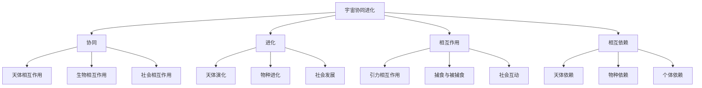

                 

### 引言

宇宙的协同进化，这一概念承载着对宇宙本质的深刻理解和探索。从古老的天体物理学到现代的复杂系统理论，科学家们一直在试图揭示宇宙中各个部分如何相互作用和共同发展。本文旨在通过逻辑清晰、结构紧凑、简单易懂的专业技术语言，探讨宇宙的协同进化现象，以及部分与整体之间的共同发展关系。

宇宙是一个宏大而复杂的系统，其中包含无数天体、星系、星云，以及各种微观和宏观的物质和能量形式。每一个组成部分都不仅仅是独立存在的，而是与其他部分紧密相连，共同组成一个动态的宇宙网络。这种网络中，部分与整体之间的相互作用，正是宇宙协同进化的核心所在。

宇宙协同进化不仅体现在物理世界中，也在生物学、社会学、经济学等各个领域有着广泛的应用。例如，在生物学中，物种的进化是一个协同进化的过程，不同物种之间以及物种内部的不同部分相互作用，推动整个生物圈的进化。在社会学中，人类社会也是一个复杂的协同系统，个体与群体之间的互动推动了社会的发展和进步。经济学中的市场机制，也是一种协同进化的表现，供求关系的变化不断调整市场结构。

本文将首先介绍宇宙的基本结构和演化历史，为后续讨论打下基础。接着，我们将深入探讨协同进化的核心概念，以及部分与整体的关系。随后，文章将介绍几种用于研究宇宙协同进化的核心算法原理，并结合Python代码进行详细阐述。在此基础上，我们将运用数学模型来描述协同进化的过程，并通过LaTeX公式进行表达。文章的最后，将通过实际项目案例展示如何将协同进化理论应用于实际问题，并提供最佳实践和注意事项。

通过这一系列步骤，我们希望能够系统地探讨宇宙的协同进化，揭示部分与整体之间深刻的相互作用关系，为读者提供一个新的视角来理解和研究宇宙。

### 背景介绍

要理解宇宙的协同进化，我们首先需要回顾宇宙的演化历史和基本结构。宇宙的起源可以追溯到大约138亿年前的一次大爆炸，这一事件标志着宇宙的诞生。从那时起，宇宙经历了不断的膨胀和演化，形成了我们现在所看到的丰富多样的天体和结构。

宇宙的基本结构包括宇宙背景辐射、星系、星系团、超星系团等多个层次。宇宙背景辐射是宇宙早期遗留下来的温度极低的电磁波，它为我们提供了关于宇宙早期状态的宝贵信息。星系是宇宙中的基本单位，由数十亿颗恒星、行星、星云和其他天体组成。星系之间通过引力相互作用，形成了更大的结构，如星系团和超星系团。

宇宙的演化过程可以分为几个主要阶段。首先是宇宙早期的高温高密度阶段，这一阶段宇宙充满了基本粒子，如夸克和轻子。随着宇宙的膨胀和冷却，这些基本粒子逐渐聚变形成了原子。在大爆炸后的几分钟内，宇宙中的物质几乎均匀分布，但随着时间的推移，由于密度的微小不均匀性，物质开始聚集，形成了星系和其他天体结构。

接下来是宇宙的稳定期，这一阶段宇宙中的恒星开始形成和燃烧氢核聚变。恒星的诞生和死亡为宇宙提供了丰富的元素，这些元素通过超新星爆炸和星系碰撞等过程扩散到宇宙中，为后续的星系和行星的形成提供了必要的物质基础。

在过去的数十亿年里，宇宙继续演化，星系和星系团通过引力的相互作用不断形成和合并。这种过程不仅改变了宇宙的结构，也影响了宇宙的动力学性质。例如，星系中的恒星和行星系统在相互引力作用下形成复杂的轨道，而星系团之间的碰撞和合并则导致宇宙结构的大规模重塑。

除了天体物理学，宇宙协同进化的概念在生物学、社会学和经济学等领域也有着广泛的应用。在生物学中，物种的协同进化是生物多样性的关键因素。不同物种之间以及物种内部的不同种群通过相互选择和适应，推动整个生态系统的进化。例如，捕食者与猎物之间的相互作用，植物与传粉者之间的协同关系，都是协同进化的典型案例。

在社会学中，人类社会可以被看作是一个复杂的协同系统。个体与群体之间的互动，以及群体与群体之间的互动，推动了社会的发展和变革。例如，人类社会的技术进步、文化变迁和制度创新，都是个体和群体协同进化的结果。

在经济学中，市场机制也是一种协同进化的表现。市场中的供求关系、价格波动和竞争合作，都是市场参与者通过相互作用形成的动态过程。市场中的每一个个体，都通过自己的决策和行为，影响着整体市场的结构和运行。例如，消费者的需求变化可以影响企业的生产策略，而企业的竞争行为又反过来影响市场的供需关系。

通过回顾宇宙的演化历史和探讨协同进化的多领域应用，我们可以看到，宇宙的协同进化是一个跨越多个学科的概念，它揭示了部分与整体之间的深刻相互作用。这种相互作用不仅存在于物理宇宙中，也存在于生物、社会和经济系统中。理解这些相互作用，有助于我们更深入地认识宇宙的本质和规律。

### 协同进化的核心概念

协同进化是一个跨越多个学科领域的概念，它描述了不同部分之间通过相互作用和相互依赖，共同推动系统进化的过程。在生物学、生态学、社会学和经济学等领域，协同进化都有重要的应用。理解这一概念的核心，需要从协同、进化、相互作用和相互依赖这四个方面入手。

#### 协同

协同指的是不同部分之间通过相互作用，共同实现一个共同目标或功能。在宇宙中，协同进化体现在天体之间的引力相互作用、星系之间的碰撞与合并、生物种群之间的捕食与被捕食关系等。在生物学中，一个典型的协同进化例子是植物与传粉者的关系。植物通过产生花蜜吸引传粉者，而传粉者在获取花蜜的同时，也帮助植物传播花粉，从而实现双方共同繁殖后代。

在社会学中，人类社会的协同进化体现在个体与群体之间的互动。个体通过参与社会活动、遵守社会规范，推动社会的稳定和发展。同时，社会环境也通过反馈机制，影响个体的行为和观念，促进个体与群体的共同进化。

#### 进化

进化是指系统在长时间内通过自然选择、遗传变异等机制，不断改变和适应环境的过程。协同进化强调的是部分与整体之间的相互作用，这种相互作用推动系统整体进化的同时，也促进了各部分的进化。

在宇宙中，天体的协同进化体现在星系的形成和演化过程中。星系通过引力相互作用，形成复杂的天体结构，如星系团和超星系团。在这个过程中，每个星系都通过引力和能量交换，与其他星系相互影响，共同进化。

在生物学中，物种的协同进化体现在物种间的相互作用和适应性变化中。捕食者与猎物的协同进化是一个经典案例。捕食者通过进化出更高效的捕猎策略，推动猎物的进化，使其更适应环境。而猎物通过进化出更有效的防御机制，反过来影响捕食者的进化。

#### 相互作用

相互作用是指不同部分之间通过物理、化学或信息交流等方式，产生相互影响的过程。在宇宙中，天体之间的相互作用主要通过引力实现。星系、星系团和超星系团的形成，都是通过天体之间的引力相互作用，推动宇宙结构的演化。

在生物学中，物种之间的相互作用体现在捕食与被捕食、共生和竞争关系中。这些相互作用通过自然选择和遗传变异，推动物种的进化。例如，捕食者通过进化出更高效的捕猎策略，影响猎物的进化方向；而猎物通过进化出更有效的防御机制，反过来影响捕食者的进化。

在社会学中，个体与群体之间的相互作用体现在社会互动和反馈机制中。个体的行为和观念通过社会规范和社会制度，影响群体的发展。同时，群体通过反馈机制，对个体的行为和观念进行调节和塑造，推动个体与群体的共同进化。

#### 相互依赖

相互依赖指的是不同部分之间的相互依赖和相互支持，共同维持系统稳定和发展的过程。在宇宙中，天体之间的相互依赖体现在星系、星系团和超星系团的稳定性和演化过程中。每个天体都通过引力相互作用，与其他天体共同维持宇宙结构的稳定性。

在生物学中，物种之间的相互依赖体现在生态系统中。不同物种通过相互依赖，形成复杂的食物网和生态平衡。例如，植物通过光合作用产生氧气，维持大气中的氧气含量，为动物提供生存条件；而动物通过呼吸作用消耗氧气，释放二氧化碳，为植物提供光合作用所需的碳源。

在社会学中，个体与群体之间的相互依赖体现在社会合作和社会支持中。个体通过参与社会活动，获取社会资源和地位；而社会通过提供资源和制度支持，推动个体的发展。例如，个体通过教育和社会参与，提升自身能力和素质，为社会的发展贡献力量；而社会通过提供教育和就业机会，帮助个体实现自身价值。

### 核心概念关系架构

为了更好地理解协同进化的核心概念，我们可以使用Mermaid流程图来描述它们之间的关系。



通过这个流程图，我们可以清晰地看到协同、进化、相互作用和相互依赖这四个核心概念之间的关系，以及它们在不同领域中的具体应用。

### 协同进化的核心算法原理讲解

在探讨宇宙的协同进化时，算法原理的应用至关重要。协同进化算法是一种模拟自然界中协同进化过程的计算模型，它通过模拟多个相互作用的个体（称为“种群”）的进化，来探索复杂系统的协同进化机制。以下我们将详细讲解协同进化算法的基本框架、原理以及应用。

#### 算法的基本框架

协同进化算法（Coevolutionary Algorithm，CEA）的基本框架通常包括以下几个主要步骤：

1. **初始化种群**：首先，初始化两个或多个种群，这些种群可以表示不同的部分或子系统。
2. **个体评价**：对每个种群中的个体进行评价，评价标准可以是适应度函数，它衡量个体对环境的适应程度。
3. **种群交互**：不同种群之间通过某种交互机制进行相互作用，如共享资源、竞争、协作等。
4. **个体进化**：基于评价结果，对每个种群中的个体进行遗传操作，如选择、交叉、变异等，以生成新的个体。
5. **迭代更新**：重复步骤2到步骤4，直到满足终止条件（如达到最大迭代次数、适应度达到预设阈值等）。

以下是一个简化的Python代码示例，用于初始化种群和个体评价：

```python
import numpy as np

# 定义适应度函数
def fitness_function(individual):
    # 这里用一个简单的函数作为适应度函数，例如：线性函数
    return sum(individual)

# 初始化种群
def initialize_population(pop_size, individual_size):
    population = np.random.rand(pop_size, individual_size)
    return population

# 评价种群
def evaluate_population(population):
    fitness_scores = np.apply_along_axis(fitness_function, 1, population)
    return fitness_scores

# 主程序
def coevolutionary_algorithm():
    pop_size = 100
    individual_size = 10
    
    # 初始化种群
    population = initialize_population(pop_size, individual_size)
    fitness_scores = evaluate_population(population)
    
    # 迭代过程
    for iteration in range(100):
        # 基于适应度进行选择
        selected_indices = np.argsort(fitness_scores)[:10]
        selected_individuals = population[selected_indices]
        
        # 进行交叉和变异操作（略）
        
        # 更新种群
        population = selected_individuals
        fitness_scores = evaluate_population(population)
        
        # 打印当前最优个体适应度
        print(f"Iteration {iteration}: Best Fitness = {np.max(fitness_scores)}")

# 运行算法
coevo

