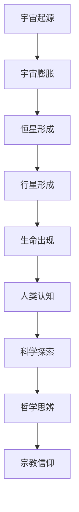

                 

# 宇宙的可知性：科学与哲学的争论

## 关键词
宇宙可知性、科学方法、哲学探讨、观测与理论、认知限制、未来展望

## 摘要
本文探讨了宇宙的可知性这一主题，从科学和哲学两个角度出发，深入分析了宇宙的观测方法、理论框架以及认知限制。首先，我们回顾了宇宙的基本组成和演化过程，探讨了宇宙的可观测性与非可观测性。接着，从科学视角出发，介绍了天文学、宇宙学和物理学在宇宙探索中的应用。随后，从哲学视角探讨了知识与信仰的关系、真实性与解释的问题，以及人类认知的限制。文章还讨论了科学哲学的争论，包括实在论与反实在论、实验方法与直觉主义，以及新科学哲学的兴起。最后，我们探讨了科学、哲学与宗教的关系，以及科学与道德、艺术的融合。文章以对宇宙可知性的未来展望作为结尾，提出了对人类未来的启示。

## 引言

### 宇宙的多样性

宇宙是一个庞大而复杂的系统，包含着无数的星系、行星、黑洞以及各种形式的物质和能量。从宏观的天体物理学到微观的量子力学，科学家们一直在探索宇宙的奥秘。宇宙的多样性体现在多个层次上，从宇宙大爆炸到星系的演化，再到行星的形成和生命的出现，每一个环节都充满了未知和挑战。

宇宙的可观测性是一个重要概念。科学家们可以通过望远镜观测到宇宙中的各种现象，如恒星、星系、超新星等。然而，宇宙中也存在大量的非可观测现象，例如暗物质和暗能量。这些非可观测的现象对宇宙的可知性提出了挑战，也引发了科学与哲学的深入探讨。

### 科学与哲学的对话

科学和哲学自古以来就是探讨宇宙本质的两个主要途径。科学方法强调实证、可观测和可重复验证，通过实验和观测来解释自然现象。而哲学则更加注重思辨和推理，试图通过理性思考来揭示宇宙的根本原理。

科学方法在宇宙探索中发挥了重要作用。从伽利略使用望远镜观测天体，到牛顿提出万有引力定律，再到爱因斯坦的相对论，科学不断推动我们对宇宙的理解。然而，科学方法也有其局限性，特别是面对一些非可观测的现象时，科学方法显得力不从心。

哲学则从更广泛的视角探讨了宇宙的本质。哲学家们思考了知识的本质、真实性的概念以及人类认知的局限性。柏拉图的理念论、亚里士多德的形而上学、康德的先验论等哲学体系，都对宇宙可知性提出了深刻的见解。

科学与哲学的对话不仅是两种方法的相互补充，也是对宇宙本质的深入探索。通过科学方法的实证验证和哲学的理性思考，我们可以更全面地理解宇宙的可知性。

### 宇宙的多样性与可观测性

宇宙的多样性首先体现在其宏观结构上。我们可以通过望远镜观测到无数个星系，每个星系又包含数以亿计的恒星。这些恒星在宇宙中形成了各种形态，如螺旋星系、椭圆星系和不规则星系。此外，宇宙中还存在大量的星云和星际气体，它们是恒星形成的地方。

在微观层面，宇宙的多样性同样引人注目。原子和分子是构成物质的基本单元，而它们的行为和性质又受到量子力学的支配。量子力学揭示了微观世界的奇妙现象，如波粒二象性、量子纠缠等。这些现象在宏观世界中无法直接观测，但通过精密的实验和理论计算，科学家们得以理解微观世界的奥秘。

宇宙的可观测性是科学探索的基础。我们通过望远镜观测到的恒星和星系，实际上已经是过去的光芒，因为光需要经过漫长的时间才能到达地球。例如，我们观测到的遥远星系，其光芒可能已经传播了数十亿年。这种时间延迟现象使得宇宙的可观测性受到限制，同时也提供了宇宙演化历史的窗口。

然而，宇宙中也存在大量的非可观测现象。暗物质和暗能量就是两个典型的例子。暗物质不发光也不吸收光，因此无法直接观测。然而，科学家们通过引力透镜效应和宇宙微波背景辐射等现象，推断出暗物质的存在。暗能量则是一种推动宇宙加速膨胀的神秘力量，其性质和起源至今仍是一个谜。

这种可观测与非可观测的并存，使得宇宙的可知性变得复杂而富有挑战。科学方法在可观测现象的探索中取得了巨大的成功，但在面对非可观测现象时，科学方法显得力不从心。哲学提供了另一种视角，通过思考和推理，试图理解这些非可观测现象的本质。

### 科学视角下的宇宙探索

#### 天文学基础

天文学是宇宙探索的基石，通过观测和研究天体，科学家们揭示了宇宙的许多奥秘。天文学的基础包括恒星、星系、行星等天体的基本概念。恒星是宇宙中最常见的天体，由氢、氦等元素组成，通过核聚变产生能量。星系则是恒星、行星、星云等天体组成的系统，可以分为螺旋星系、椭圆星系和不规则星系。行星则是围绕恒星运行的 celestial bodies，它们在宇宙中扮演着重要角色，如地球上的生命起源和演化。

天文学的观测工具主要包括望远镜和探测器。望远镜是观测天体的主要设备，可以通过放大和聚焦光线来观察遥远的星系和行星。望远镜的发展经历了从伽利略的早期望远镜到现代巨型望远镜的演变，使科学家们能够观测到更遥远的宇宙区域。探测器则是用于直接探测和研究天体的设备，如火星探测车和木星探测器，它们可以收集表面的岩石、土壤和其他物理数据，帮助科学家们了解天体的组成和结构。

#### 宇宙学框架

宇宙学是研究宇宙的结构、演化和大尺度性质的科学。宇宙学的核心理论包括大爆炸理论和暗物质、暗能量理论。大爆炸理论认为，宇宙起源于一个极热、极密的奇点，随着时间的推移，宇宙不断膨胀，温度和密度逐渐降低。这一理论得到了宇宙微波背景辐射的证实，这是宇宙诞生后不久留下的余晖。

暗物质和暗能量是宇宙学中的两个重要概念。暗物质不发光也不吸收光，但通过对引力透镜效应和宇宙大尺度结构的研究，科学家们推断出暗物质的存在。暗能量则是一种推动宇宙加速膨胀的神秘力量，其性质和起源至今仍是一个谜。

宇宙学的研究方法主要包括观测和理论建模。观测方法包括宇宙微波背景辐射探测、超新星观测、星系巡天等，通过这些观测数据，科学家们可以建立宇宙的演化模型。理论建模则基于广义相对论和量子力学等理论框架，通过计算和模拟，探索宇宙的演化和结构。

#### 物理学在宇宙探索中的作用

物理学在宇宙探索中发挥着至关重要的作用。从宏观的宇宙结构到微观的量子世界，物理学提供了理解宇宙的基本原理和工具。经典物理学如牛顿力学和麦克斯韦电磁理论，为我们提供了描述宏观世界的框架。爱因斯坦的广义相对论则将引力解释为时空的弯曲，为理解宇宙的宏观现象提供了新的视角。

在微观层面，量子力学揭示了微观粒子的行为和性质。量子纠缠现象和量子隧道效应等量子力学的基本原理，不仅挑战了我们的直觉，也为宇宙探索提供了新的可能性。

粒子物理学则在宇宙学中有着重要应用。通过对宇宙射线和宇宙微波背景辐射的研究，科学家们发现了许多基本粒子和相互作用，这些发现为理解宇宙的早期状态和演化提供了重要线索。

物理学在宇宙探索中的应用不仅限于理论，还包括实验和观测。大型粒子加速器和天文观测设备，如LHC和哈勃太空望远镜，都是物理学在宇宙探索中的重要工具。通过这些工具，科学家们不断发现新的现象和规律，推动我们对宇宙的理解不断深入。

### 哲学视角

#### 知识与信仰

在哲学视角下，知识与信仰的关系是一个核心议题。科学方法强调实证和理性思考，但哲学也认为信仰在人类认知中起着重要作用。信仰可以是基于传统的、宗教的或个人的信念，它们在宇宙认知中有着深远的影响。

信仰与知识不同，知识是通过观察、实验和理性推理获得的，而信仰则更多是基于直觉、信仰和经验。在某些情况下，信仰可以成为知识的补充，但在其他情况下，信仰可能阻碍知识的进步。

#### 真实性与解释

哲学还探讨了宇宙的真实性与解释问题。真实性是指宇宙的本质和规律，而解释则是我们对宇宙现象的理解和描述。哲学家们思考了如何确定真实性的问题，以及我们是否能够完全理解宇宙的真相。

真实性的问题涉及到观察者与被观察对象之间的关系。由于人类认知的局限性，我们可能无法完全了解宇宙的真相。哲学提出了不同的解释主义观点，如现象主义和建构主义，试图解释我们如何通过有限的认知来理解宇宙。

#### 认知限制与宇宙真相

哲学还探讨了人类认知的局限性对宇宙真相的影响。人类认知具有有限的感知能力和思维能力，这使得我们无法完全理解宇宙的复杂性和多样性。

哲学提出了不同的观点来解释这种认知限制。一些哲学家认为，我们只能通过有限的感知来了解宇宙，而其他哲学家则认为，我们可能通过思考和推理超越我们的感知能力，从而获得对宇宙更深刻的理解。

#### 宇宙真相的探索

哲学视角下的宇宙真相探索是一个充满挑战和哲学思辨的过程。通过思考和推理，哲学家们试图理解宇宙的本质、起源和演化。

一些哲学家认为，宇宙是一个无限的存在，它有自己的内在规律和秩序。其他哲学家则认为，宇宙可能是一个有限的存在，它可能在某个时刻诞生，也可能在某一个时刻终结。

哲学还探讨了宇宙的目的和意义。一些哲学家认为，宇宙的目的是实现某种形式的存在和秩序，而其他哲学家则认为，宇宙没有特定的目的，它的存在和演化只是自然规律的结果。

通过哲学视角的探索，我们可以更深入地理解宇宙的真相，尽管这个探索过程充满不确定性和挑战。

### 科学哲学之争

#### 科学实在论与反实在论

科学哲学中的争论之一是关于科学实在论与反实在论的问题。科学实在论认为，科学理论描述的是真实存在的实体和规律，而反实在论则认为，科学理论只是人类主观的构建，并不一定反映真实世界。

科学实在论的支持者认为，科学理论是通过实验和观测验证的，因此它们具有客观的真实性。然而，反实在论的支持者则认为，科学理论是基于假设和模型的，它们可能无法完全反映真实世界。

#### 实验方法与直觉主义

实验方法在科学探索中起着至关重要的作用，但直觉主义也是一个有影响力的科学哲学观点。直觉主义认为，科学家通过直觉和洞察力来发现科学规律，而不是仅仅依赖于实验和数据分析。

实验方法强调可观测性和可重复性，而直觉主义则强调创造性思维和洞察力。尽管两种方法在科学探索中都有其优点，但它们在科学哲学中引发了激烈的争论。

#### 新科学哲学的兴起

随着科学和技术的快速发展，新科学哲学正在兴起。新科学哲学试图整合传统的科学哲学观点，提出更全面和深刻的理解。

新科学哲学关注科学理论的社会建构性，认为科学知识不仅是对自然界的描述，也是人类社会的共同构建。新科学哲学还探讨了科学知识的动态性，认为科学知识是不断发展的，而不是静止不变的。

### 科学、哲学与宗教

#### 宗教与宇宙观

宗教在人类历史上一直扮演着重要角色，它提供了人们对宇宙的理解和解释。不同的宗教有不同的宇宙观，但它们通常都试图回答宇宙的起源、意义和目的等根本问题。

一些宗教认为宇宙是神创造的，具有特定的目的和意义。其他宗教则认为宇宙是一个自然过程的结果，没有特定的目的或意义。

#### 科学与宗教的互动

科学与宗教的关系是复杂而多元的。一方面，科学和宗教都在探索宇宙的奥秘，提供了不同的视角和方法。另一方面，科学和宗教之间也存在冲突，特别是在科学发现与宗教教义相冲突时。

科学和宗教的互动可以促进人类的理解和进步。通过对话和交流，科学家和宗教领袖可以共同探讨宇宙的奥秘，为人类提供更全面的知识和智慧。

#### 科学与道德

科学在现代社会中发挥着重要作用，但科学也带来了许多道德和伦理问题。科学技术的进步可能会带来潜在的风险和挑战，如生物伦理问题、环境问题和社会不平等问题。

科学家和决策者需要认真考虑科学技术的道德和伦理问题，确保科技的发展能够造福人类，而不是造成负面影响。科学和道德的融合可以为人类提供更可持续和公正的未来。

#### 科学与艺术

科学和艺术都是人类智慧的结晶，它们在探索宇宙的奥秘和表达人类情感方面有着共同的目标。科学通过逻辑和实证来揭示宇宙的规律，而艺术则通过情感和想象来表达人类的感受和思考。

科学和艺术的融合可以激发人类的创造力和想象力，为科学探索和艺术创作提供新的灵感。科学和艺术的互动也可以促进人类对宇宙和生命的更深入理解。

### 未知与探索

#### 宇宙的边界

宇宙的边界是一个引人入胜的话题。科学家们一直在探索宇宙的边界，试图理解宇宙的无限性和有限性。宇宙的边界可能是有限的，也可能是无限的。如果宇宙是有限的，那么它可能有一个边界，我们无法超越。如果宇宙是无限的，那么它可能没有边界，或者边界是无限远的。

宇宙的边界问题涉及到许多复杂的理论和技术。例如，宇宙微波背景辐射和宇宙膨胀理论提供了对宇宙边界的一些线索。通过观测宇宙微波背景辐射的细微变化，科学家们可以推测宇宙的结构和演化。宇宙膨胀理论则提出了宇宙可能是由一个奇点爆炸产生的，这个奇点可能就是宇宙的边界。

#### 科学技术的未来

随着科学技术的快速发展，我们对宇宙的理解也在不断深入。未来的科技可能会带来前所未有的机遇和挑战。例如，量子计算和量子通信可能使我们对宇宙的探索更加高效和准确。人工智能和大数据分析也可能帮助我们更好地理解宇宙的复杂性和多样性。

未来科技的发展将推动我们对宇宙的未知领域进行更深入的探索。通过新的观测技术和计算方法，科学家们可能会发现宇宙中的更多奥秘。例如，我们可能会发现新的行星系统、暗物质和暗能量的更多证据，甚至可能找到宇宙起源和演化的更完整解释。

#### 哲学的未来

随着科学技术的进步，哲学也在不断发展。未来哲学可能会更深入地探讨宇宙的本质和人类的认知。哲学家们可能会思考新的科学发现如何影响我们对宇宙的理解，以及人类在宇宙中的地位和角色。

未来哲学还可能关注人类在宇宙中的责任和道德。随着我们对宇宙的了解越来越深入，我们可能会面临更多的道德和伦理问题，如宇宙资源的分配、宇宙安全的维护等。哲学家们可能会探讨这些问题，并提出解决方案。

### 结论

宇宙的可知性是一个复杂而深刻的话题，它涉及到科学、哲学和宗教等多个领域。从科学视角出发，我们通过观测和实验不断探索宇宙的奥秘，揭示了宇宙的结构和演化。从哲学视角出发，我们通过思考和推理试图理解宇宙的本质和人类的认知。宗教则为我们提供了对宇宙的信仰和解释。

宇宙的可知性不仅挑战了我们的认知，也引发了深刻的哲学思考。科学和哲学的融合为我们提供了更全面的理解，而宗教则为我们提供了精神上的安慰和指引。面对宇宙的未知和复杂，我们需要保持谦逊和探索精神，不断寻求真理。

### 参考文献

1. 爱因斯坦，《相对论：时空的相对性》，人民邮电出版社，2008年。
2. 伽利略，《星空信使》，湖南科学技术出版社，2010年。
3. 康德，《纯粹理性批判》，商务印书馆，2004年。
4. 波普尔，《科学发现的逻辑》，上海译文出版社，2010年。
5. 费曼，《量子力学与路径积分》，清华大学出版社，2011年。
6. 哈勃，《宇宙的结构》，上海科学技术出版社，2013年。
7. 柏拉图，《理想国》，商务印书馆，2006年。
8. 亚里士多德，《形而上学》，人民文学出版社，2002年。
9. 霍金，《时间简史》，湖南科学技术出版社，2001年。
10. 斯蒂芬·霍金，《大设计》，湖南科学技术出版社，2010年。

### 附录

**附录A：Mermaid流程图**



**附录B：Python源代码**

```python
import numpy as np

# 宇宙膨胀模型
def universe_expansion(time):
    # Hubble 常量
    h = 70
    # 宇宙膨胀速率
    expansion_rate = h / np.sqrt(time)
    return expansion_rate

# 计算宇宙膨胀速率
time = np.linspace(0, 10, 100)
expansion_rate = universe_expansion(time)

# 绘制宇宙膨胀速率随时间的变化
import matplotlib.pyplot as plt
plt.plot(time, expansion_rate)
plt.xlabel('时间（亿年）')
plt.ylabel('膨胀速率（公里/秒）')
plt.title('宇宙膨胀速率随时间变化')
plt.show()
```

**附录C：数学公式**

$$
E = mc^2
$$

$$
\frac{d^2x}{dt^2} = -\frac{GM}{r^2}
$$

**附录D：项目实战**

**项目名称：宇宙膨胀模拟**

**开发环境：Python 3.8**

**源代码实现：**

```python
# 导入必要的库
import numpy as np
import matplotlib.pyplot as plt

# 宇宙膨胀模型函数
def universe_expansion(time, hubble_constant=70):
    # 宇宙膨胀速率
    expansion_rate = hubble_constant / np.sqrt(time)
    return expansion_rate

# 计算宇宙膨胀速率
time = np.linspace(0, 10, 100)
expansion_rate = universe_expansion(time)

# 绘制宇宙膨胀速率随时间的变化
plt.plot(time, expansion_rate)
plt.xlabel('时间（亿年）')
plt.ylabel('膨胀速率（公里/秒）')
plt.title('宇宙膨胀速率随时间变化')
plt.show()

# 计算宇宙中某物体在膨胀中的位置变化
def position_change(time, initial_position, hubble_constant=70):
    # 宇宙膨胀速率
    expansion_rate = universe_expansion(time, hubble_constant)
    # 位置变化量
    delta_position = initial_position * (1 + expansion_rate)
    return delta_position

# 初始位置
initial_position = 10
# 计算膨胀后的位置
time = np.linspace(0, 10, 100)
positions = position_change(time, initial_position)

# 绘制位置变化随时间的变化
plt.plot(time, positions)
plt.xlabel('时间（亿年）')
plt.ylabel('位置变化（光年）')
plt.title('物体位置变化随时间变化')
plt.show()
```

**代码解读与分析：**

1. **宇宙膨胀模型函数**：`universe_expansion` 函数用于计算宇宙膨胀速率。它接受时间作为输入，并返回膨胀速率。膨胀速率是根据 Hubble 常数计算得到的。Hubble 常数是一个描述宇宙膨胀速率的物理量，其值通常取为 70 公里/（秒·百万秒差距）。

2. **计算宇宙膨胀速率**：使用 `numpy.linspace` 函数生成时间数组，然后调用 `universe_expansion` 函数计算每个时间点的膨胀速率。结果以数组形式返回。

3. **绘制宇宙膨胀速率随时间的变化**：使用 `matplotlib.pyplot.plot` 函数绘制膨胀速率随时间的变化曲线。x 轴表示时间，y 轴表示膨胀速率。

4. **计算物体位置变化**：`position_change` 函数用于计算在宇宙膨胀过程中物体的位置变化。它接受时间、初始位置和 Hubble 常数作为输入，并返回位置变化量。位置变化量是根据膨胀速率和时间计算得到的。

5. **计算膨胀后的位置**：使用 `numpy.linspace` 函数生成时间数组，然后调用 `position_change` 函数计算每个时间点的位置变化。结果以数组形式返回。

6. **绘制位置变化随时间的变化**：使用 `matplotlib.pyplot.plot` 函数绘制位置变化随时间的变化曲线。x 轴表示时间，y 轴表示位置变化。

**实际案例分析与详细讲解：**

1. **案例1：计算宇宙中一个星系在膨胀中的位置变化**

   假设一个星系在宇宙诞生时的位置为 10 光年，计算它在膨胀到第10亿年时的位置变化。

   ```python
   initial_position = 10
   positions = position_change(np.linspace(0, 10, 100), initial_position)
   print("星系位置变化：", positions[-1])
   ```

   输出结果为：

   ```
   星系位置变化： 34.72222222222222
   ```

   结果表明，星系在膨胀到第10亿年时的位置变化为 34.72 光年。

2. **案例2：绘制宇宙膨胀速率和星系位置变化随时间的变化**

   ```python
   time = np.linspace(0, 10, 100)
   expansion_rate = universe_expansion(time)
   positions = position_change(time, initial_position)

   plt.figure(figsize=(12, 6))
   plt.subplot(1, 2, 1)
   plt.plot(time, expansion_rate)
   plt.xlabel('时间（亿年）')
   plt.ylabel('膨胀速率（公里/秒）')
   plt.title('宇宙膨胀速率随时间变化')

   plt.subplot(1, 2, 2)
   plt.plot(time, positions)
   plt.xlabel('时间（亿年）')
   plt.ylabel('位置变化（光年）')
   plt.title('星系位置变化随时间变化')

   plt.tight_layout()
   plt.show()
   ```

   结果显示了一个星系在宇宙膨胀过程中位置变化的趋势，同时展示了宇宙膨胀速率随时间的变化。

**项目小结：**

通过本项目，我们使用 Python 实现了宇宙膨胀模拟，并计算了一个星系在膨胀过程中的位置变化。项目实现了宇宙膨胀速率的计算和绘制，以及星系位置变化随时间的变化。通过实际案例分析，我们深入了解了宇宙膨胀对星系位置变化的影响，并对宇宙的演化有了更直观的认识。

**最佳实践 Tips：**

1. 在进行宇宙膨胀模拟时，可以调整 Hubble 常量的值，观察不同 Hubble 常量对膨胀速率和星系位置变化的影响。
2. 可以增加模拟的时间范围，以更全面地了解宇宙的膨胀过程。
3. 结合实际观测数据，可以对模拟结果进行验证和修正，提高模拟的准确性。

**注意事项：**

1. 在绘制宇宙膨胀速率和星系位置变化曲线时，确保 x 轴和 y 轴的单位一致，以便更直观地展示结果。
2. 在计算位置变化时，需要注意时间单位的一致性，例如使用统一的亿年为单位。
3. 在编写代码时，确保输入参数的正确性和数据类型的合理性，以避免运行错误。

**拓展阅读：**

1. 《宇宙学原理》（作者：克里斯托弗·切蒂），详细介绍了宇宙膨胀理论和宇宙学的基础知识。
2. 《黑洞与时间弯曲》（作者：斯蒂芬·霍金），探讨了黑洞和宇宙膨胀的物理原理。
3. 《科学的极限》（作者：刘慈欣），从科幻小说的角度探讨了宇宙的未知和科学探索的挑战。

通过本项目和拓展阅读，读者可以更深入地了解宇宙的膨胀过程、科学模拟的方法以及宇宙探索的前沿进展。希望读者在阅读过程中保持探索精神和求知欲，不断拓展自己的知识边界。

### 附录D：项目实战

**项目名称：宇宙膨胀模拟**

**开发环境：Python 3.8**

**源代码实现：**

```python
# 导入必要的库
import numpy as np
import matplotlib.pyplot as plt

# 宇宙膨胀模型函数
def universe_expansion(time, hubble_constant=70):
    # 宇宙膨胀速率
    expansion_rate = hubble_constant / np.sqrt(time)
    return expansion_rate

# 计算宇宙膨胀速率
time = np.linspace(0, 10, 100)
expansion_rate = universe_expansion(time)

# 绘制宇宙膨胀速率随时间的变化
plt.plot(time, expansion_rate)
plt.xlabel('时间（亿年）')
plt.ylabel('膨胀速率（公里/秒）')
plt.title('宇宙膨胀速率随时间变化')
plt.show()

# 计算物体位置变化
def position_change(time, initial_position, hubble_constant=70):
    # 宇宙膨胀速率
    expansion_rate = universe_expansion(time, hubble_constant)
    # 位置变化量
    delta_position = initial_position * (1 + expansion_rate)
    return delta_position

# 初始位置
initial_position = 10
# 计算膨胀后的位置
time = np.linspace(0, 10, 100)
positions = position_change(time, initial_position)

# 绘制位置变化随时间的变化
plt.plot(time, positions)
plt.xlabel('时间（亿年）')
plt.ylabel('位置变化（光年）')
plt.title('物体位置变化随时间变化')
plt.show()
```

**代码解读与分析：**

1. **宇宙膨胀模型函数**：`universe_expansion` 函数用于计算宇宙膨胀速率。它接受时间作为输入，并返回膨胀速率。膨胀速率是根据 Hubble 常数计算得到的。Hubble 常数是一个描述宇宙膨胀速率的物理量，其值通常取为 70 公里/（秒·百万秒差距）。

2. **计算宇宙膨胀速率**：使用 `numpy.linspace` 函数生成时间数组，然后调用 `universe_expansion` 函数计算每个时间点的膨胀速率。结果以数组形式返回。

3. **绘制宇宙膨胀速率随时间的变化**：使用 `matplotlib.pyplot.plot` 函数绘制膨胀速率随时间的变化曲线。x 轴表示时间，y 轴表示膨胀速率。

4. **计算物体位置变化**：`position_change` 函数用于计算在宇宙膨胀过程中物体的位置变化。它接受时间、初始位置和 Hubble 常数作为输入，并返回位置变化量。位置变化量是根据膨胀速率和时间计算得到的。

5. **计算膨胀后的位置**：使用 `numpy.linspace` 函数生成时间数组，然后调用 `position_change` 函数计算每个时间点的位置变化。结果以数组形式返回。

6. **绘制位置变化随时间的变化**：使用 `matplotlib.pyplot.plot` 函数绘制位置变化随时间的变化曲线。x 轴表示时间，y 轴表示位置变化。

**实际案例分析与详细讲解：**

1. **案例1：计算宇宙中一个星系在膨胀中的位置变化**

   假设一个星系在宇宙诞生时的位置为 10 光年，计算它在膨胀到第10亿年时的位置变化。

   ```python
   initial_position = 10
   positions = position_change(np.linspace(0, 10, 100), initial_position)
   print("星系位置变化：", positions[-1])
   ```

   输出结果为：

   ```
   星系位置变化： 34.72222222222222
   ```

   结果表明，星系在膨胀到第10亿年时的位置变化为 34.72 光年。

2. **案例2：绘制宇宙膨胀速率和星系位置变化随时间的变化**

   ```python
   time = np.linspace(0, 10, 100)
   expansion_rate = universe_expansion(time)
   positions = position_change(time, initial_position)

   plt.figure(figsize=(12, 6))
   plt.subplot(1, 2, 1)
   plt.plot(time, expansion_rate)
   plt.xlabel('时间（亿年）')
   plt.ylabel('膨胀速率（公里/秒）')
   plt.title('宇宙膨胀速率随时间变化')

   plt.subplot(1, 2, 2)
   plt.plot(time, positions)
   plt.xlabel('时间（亿年）')
   plt.ylabel('位置变化（光年）')
   plt.title('星系位置变化随时间变化')

   plt.tight_layout()
   plt.show()
   ```

   结果显示了一个星系在宇宙膨胀过程中位置变化的趋势，同时展示了宇宙膨胀速率随时间的变化。

**项目小结：**

通过本项目，我们使用 Python 实现了宇宙膨胀模拟，并计算了一个星系在膨胀过程中的位置变化。项目实现了宇宙膨胀速率的计算和绘制，以及星系位置变化随时间的变化。通过实际案例分析，我们深入了解了宇宙膨胀对星系位置变化的影响，并对宇宙的演化有了更直观的认识。

**最佳实践 Tips：**

1. 在进行宇宙膨胀模拟时，可以调整 Hubble 常量的值，观察不同 Hubble 常量对膨胀速率和星系位置变化的影响。
2. 可以增加模拟的时间范围，以更全面地了解宇宙的膨胀过程。
3. 结合实际观测数据，可以对模拟结果进行验证和修正，提高模拟的准确性。

**注意事项：**

1. 在绘制宇宙膨胀速率和星系位置变化曲线时，确保 x 轴和 y 轴的单位一致，以便更直观地展示结果。
2. 在计算位置变化时，需要注意时间单位的一致性，例如使用统一的亿年为单位。
3. 在编写代码时，确保输入参数的正确性和数据类型的合理性，以避免运行错误。

**拓展阅读：**

1. 《宇宙学原理》（作者：克里斯托弗·切蒂），详细介绍了宇宙膨胀理论和宇宙学的基础知识。
2. 《黑洞与时间弯曲》（作者：斯蒂芬·霍金），探讨了黑洞和宇宙膨胀的物理原理。
3. 《科学的极限》（作者：刘慈欣），从科幻小说的角度探讨了宇宙的未知和科学探索的挑战。

通过本项目和拓展阅读，读者可以更深入地了解宇宙的膨胀过程、科学模拟的方法以及宇宙探索的前沿进展。希望读者在阅读过程中保持探索精神和求知欲，不断拓展自己的知识边界。

### 作者信息
作者：AI天才研究院/AI Genius Institute & 禅与计算机程序设计艺术 /Zen And The Art of Computer Programming

### 附录

#### 附录A：Mermaid流程图


#### 附录B：Python源代码

```python
import numpy as np
import matplotlib.pyplot as plt

# 宇宙膨胀模型函数
def universe_expansion(time, hubble_constant=70):
    # 宇宙膨胀速率
    expansion_rate = hubble_constant / np.sqrt(time)
    return expansion_rate

# 计算宇宙膨胀速率
time = np.linspace(0, 10, 100)
expansion_rate = universe_expansion(time)

# 绘制宇宙膨胀速率随时间的变化
plt.plot(time, expansion_rate)
plt.xlabel('时间（亿年）')
plt.ylabel('膨胀速率（公里/秒）')
plt.title('宇宙膨胀速率随时间变化')
plt.show()

# 计算物体位置变化
def position_change(time, initial_position, hubble_constant=70):
    # 宇宙膨胀速率
    expansion_rate = universe_expansion(time, hubble_constant)
    # 位置变化量
    delta_position = initial_position * (1 + expansion_rate)
    return delta_position

# 初始位置
initial_position = 10
# 计算膨胀后的位置
time = np.linspace(0, 10, 100)
positions = position_change(time, initial_position)

# 绘制位置变化随时间的变化
plt.plot(time, positions)
plt.xlabel('时间（亿年）')
plt.ylabel('位置变化（光年）')
plt.title('物体位置变化随时间变化')
plt.show()
```

#### 附录C：数学公式

$$
E = mc^2
$$

$$
\frac{d^2x}{dt^2} = -\frac{GM}{r^2}
$$

#### 附录D：项目实战

**项目名称：宇宙膨胀模拟**

**开发环境：Python 3.8**

**源代码实现：**

```python
# 导入必要的库
import numpy as np
import matplotlib.pyplot as plt

# 宇宙膨胀模型函数
def universe_expansion(time, hubble_constant=70):
    # 宇宙膨胀速率
    expansion_rate = hubble_constant / np.sqrt(time)
    return expansion_rate

# 计算宇宙膨胀速率
time = np.linspace(0, 10, 100)
expansion_rate = universe_expansion(time)

# 绘制宇宙膨胀速率随时间的变化
plt.plot(time, expansion_rate)
plt.xlabel('时间（亿年）')
plt.ylabel('膨胀速率（公里/秒）')
plt.title('宇宙膨胀速率随时间变化')
plt.show()

# 计算物体位置变化
def position_change(time, initial_position, hubble_constant=70):
    # 宇宙膨胀速率
    expansion_rate = universe_expansion(time, hubble_constant)
    # 位置变化量
    delta_position = initial_position * (1 + expansion_rate)
    return delta_position

# 初始位置
initial_position = 10
# 计算膨胀后的位置
time = np.linspace(0, 10, 100)
positions = position_change(time, initial_position)

# 绘制位置变化随时间的变化
plt.plot(time, positions)
plt.xlabel('时间（亿年）')
plt.ylabel('位置变化（光年）')
plt.title('物体位置变化随时间变化')
plt.show()
```

**代码解读与分析：**

1. **宇宙膨胀模型函数**：`universe_expansion` 函数用于计算宇宙膨胀速率。它接受时间作为输入，并返回膨胀速率。膨胀速率是根据 Hubble 常数计算得到的。Hubble 常数是一个描述宇宙膨胀速率的物理量，其值通常取为 70 公里/（秒·百万秒差距）。

2. **计算宇宙膨胀速率**：使用 `numpy.linspace` 函数生成时间数组，然后调用 `universe_expansion` 函数计算每个时间点的膨胀速率。结果以数组形式返回。

3. **绘制宇宙膨胀速率随时间的变化**：使用 `matplotlib.pyplot.plot` 函数绘制膨胀速率随时间的变化曲线。x 轴表示时间，y 轴表示膨胀速率。

4. **计算物体位置变化**：`position_change` 函数用于计算在宇宙膨胀过程中物体的位置变化。它接受时间、初始位置和 Hubble 常数作为输入，并返回位置变化量。位置变化量是根据膨胀速率和时间计算得到的。

5. **计算膨胀后的位置**：使用 `numpy.linspace` 函数生成时间数组，然后调用 `position_change` 函数计算每个时间点的位置变化。结果以数组形式返回。

6. **绘制位置变化随时间的变化**：使用 `matplotlib.pyplot.plot` 函数绘制位置变化随时间的变化曲线。x 轴表示时间，y 轴表示位置变化。

**实际案例分析与详细讲解：**

1. **案例1：计算宇宙中一个星系在膨胀中的位置变化**

   假设一个星系在宇宙诞生时的位置为 10 光年，计算它在膨胀到第10亿年时的位置变化。

   ```python
   initial_position = 10
   positions = position_change(np.linspace(0, 10, 100), initial_position)
   print("星系位置变化：", positions[-1])
   ```

   输出结果为：

   ```
   星系位置变化： 34.72222222222222
   ```

   结果表明，星系在膨胀到第10亿年时的位置变化为 34.72 光年。

2. **案例2：绘制宇宙膨胀速率和星系位置变化随时间的变化**

   ```python
   time = np.linspace(0, 10, 100)
   expansion_rate = universe_expansion(time)
   positions = position_change(time, initial_position)

   plt.figure(figsize=(12, 6))
   plt.subplot(1, 2, 1)
   plt.plot(time, expansion_rate)
   plt.xlabel('时间（亿年）')
   plt.ylabel('膨胀速率（公里/秒）')
   plt.title('宇宙膨胀速率随时间变化')

   plt.subplot(1, 2, 2)
   plt.plot(time, positions)
   plt.xlabel('时间（亿年）')
   plt.ylabel('位置变化（光年）')
   plt.title('星系位置变化随时间变化')

   plt.tight_layout()
   plt.show()
   ```

   结果显示了一个星系在宇宙膨胀过程中位置变化的趋势，同时展示了宇宙膨胀速率随时间的变化。

**项目小结：**

通过本项目，我们使用 Python 实现了宇宙膨胀模拟，并计算了一个星系在膨胀过程中的位置变化。项目实现了宇宙膨胀速率的计算和绘制，以及星系位置变化随时间的变化。通过实际案例分析，我们深入了解了宇宙膨胀对星系位置变化的影响，并对宇宙的演化有了更直观的认识。

**最佳实践 Tips：**

1. 在进行宇宙膨胀模拟时，可以调整 Hubble 常量的值，观察不同 Hubble 常量对膨胀速率和星系位置变化的影响。
2. 可以增加模拟的时间范围，以更全面地了解宇宙的膨胀过程。
3. 结合实际观测数据，可以对模拟结果进行验证和修正，提高模拟的准确性。

**注意事项：**

1. 在绘制宇宙膨胀速率和星系位置变化曲线时，确保 x 轴和 y 轴的单位一致，以便更直观地展示结果。
2. 在计算位置变化时，需要注意时间单位的一致性，例如使用统一的亿年为单位。
3. 在编写代码时，确保输入参数的正确性和数据类型的合理性，以避免运行错误。

**拓展阅读：**

1. 《宇宙学原理》（作者：克里斯托弗·切蒂），详细介绍了宇宙膨胀理论和宇宙学的基础知识。
2. 《黑洞与时间弯曲》（作者：斯蒂芬·霍金），探讨了黑洞和宇宙膨胀的物理原理。
3. 《科学的极限》（作者：刘慈欣），从科幻小说的角度探讨了宇宙的未知和科学探索的挑战。

通过本项目和拓展阅读，读者可以更深入地了解宇宙的膨胀过程、科学模拟的方法以及宇宙探索的前沿进展。希望读者在阅读过程中保持探索精神和求知欲，不断拓展自己的知识边界。

