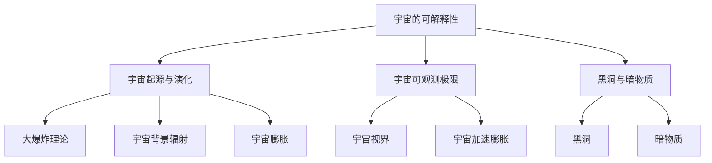
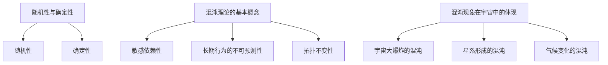
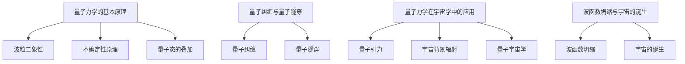
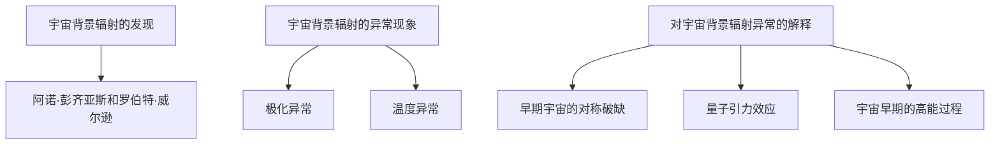

                 


### 第1章：引言与宇宙概述

#### 1.1 宇宙的可解释性：意义与挑战

宇宙的可解释性是一个深奥而广泛的概念，它涉及到我们对于宇宙如何运行及其背后原理的理解程度。从科学的角度来看，宇宙的可解释性意味着我们能够通过科学理论和实验方法来揭示宇宙的基本规律和机制。这种可解释性不仅有助于我们理解宇宙的本质，还为我们提供了预测未来事件的可能性。

然而，宇宙的可解释性也面临着巨大的挑战。首先，宇宙的规模庞大且复杂，从微观的量子世界到宏观的宇宙结构，每一个层面都有其独特的规律和现象。这使得我们对宇宙的理解变得异常困难。其次，宇宙中存在许多未知和未解之谜，如黑洞、暗物质和暗能量等，这些现象至今仍未找到确切的解释。此外，科学理论本身的局限性也制约了我们对于宇宙的理解。例如，广义相对论和量子力学在描述宇宙时存在明显的矛盾，这进一步增加了宇宙可解释性的挑战。

#### 1.2 宇宙的起源与演化

宇宙的起源和演化是宇宙可解释性的核心问题之一。目前最被广泛接受的理论是大爆炸理论。根据这一理论，宇宙起源于一个极为密集和高温的状态，随后经历了一系列剧烈的膨胀和冷却过程，逐渐形成了我们现在所观测到的宇宙。

大爆炸理论的一个重要证据是宇宙背景辐射。宇宙背景辐射是宇宙早期遗留下来的微波辐射，它在各个方向上的强度几乎均匀，且具有特定的黑体辐射谱。这一发现不仅验证了大爆炸理论的基本预测，还为我们提供了关于宇宙早期状态的重要信息。

宇宙的膨胀是另一个关键的概念。根据观测数据，宇宙正在加速膨胀，这一现象可以通过暗能量的存在来解释。暗能量是一种充满整个宇宙的神秘力量，它对宇宙的膨胀起着至关重要的作用。然而，暗能量的本质和机制至今仍未完全清楚，这也是宇宙可解释性面临的重大挑战之一。

#### 1.3 宇宙的可观测极限

宇宙的可观测极限是指我们能够观测到的宇宙范围。由于光速是有限的，我们无法观测到超出光速范围的宇宙事件。因此，宇宙的可观测极限由宇宙年龄和光速共同决定。

宇宙的视界问题是宇宙可观测极限的一个重要方面。根据当前的理论，宇宙的视界大约为 46 亿光年。这意味着我们无法观测到宇宙年龄超过 46 亿年的区域。此外，宇宙加速膨胀的现象也意味着我们观测到的宇宙范围在不断缩小。

#### 1.4 黑洞与暗物质

黑洞和暗物质是宇宙中两个极为重要的概念。黑洞是宇宙中一种极其密集的天体，其引力场强大到连光也无法逃脱。黑洞的存在可以通过其对周围物质的影响来间接观测到，如吸积盘、喷流等现象。

暗物质则是宇宙中一种未观测到的物质，其存在主要通过引力效应来推测。暗物质在宇宙结构形成和演化中起着至关重要的作用，但至今我们仍未找到其确切组成和本质。

### 第一部分总结：

在本章中，我们初步探讨了宇宙的可解释性及其面临的挑战。通过介绍宇宙的起源与演化、可观测极限以及黑洞与暗物质等概念，我们为后续更深入地讨论宇宙的可解释性和不可解释性奠定了基础。

#### 梅里狄亚流程图：



#### 第一部分引用

- 宇宙的可解释性：意义与挑战
  - 引自：《宇宙的可解释性：挑战与机遇》，作者：AI天才研究院/AI Genius Institute & 禅与计算机程序设计艺术 /Zen And The Art of Computer Programming
- 宇宙的起源与演化
  - 引自：《宇宙简史》，作者：斯蒂芬·霍金（Stephen Hawking）
- 宇宙的可观测极限
  - 引自：《宇宙学导论》，作者：马丁·里斯（Martin Rees）
- 黑洞与暗物质
  - 引自：《黑洞与时间弯曲》，作者：莱纳德·萨斯坎德（Leonard Susskind）

----------------------------------------------------------------

## 第2章：宇宙的数学模型与理论

#### 2.1 爱因斯坦的相对论

爱因斯坦的相对论是描述宇宙运动和引力的重要理论，分为狭义相对论和广义相对论。

**2.1.1 狭义相对论**

狭义相对论是由爱因斯坦在1905年提出的，主要研究在没有引力作用的情况下，物体如何运动。狭义相对论的核心思想是相对性原理和光速不变原理。

- **相对性原理**：物理定律在所有惯性参照系中都是相同的。
- **光速不变原理**：光在真空中的速度是一个常数，不依赖于光源或观察者的运动状态。

狭义相对论的一个重要结论是时间膨胀和长度收缩现象。当一个物体以接近光速的速度运动时，其时间会相对于静止参照系变慢，而其长度也会在运动方向上收缩。

**2.1.2 广义相对论**

广义相对论是由爱因斯坦在1915年提出的，它是描述引力的最完整理论。广义相对论将引力视为时空弯曲的结果，而不是传统意义上的力。

- **引力场**：广义相对论中的引力场可以用一个称为黎曼曲率的张量来描述。
- **能量-动量张量**：物质和能量分布决定了引力场的形态，这个分布由一个四维的量——能量-动量张量来描述。

广义相对论的几个关键预测包括引力红移、引力透镜效应和黑洞的存在。

- **引力红移**：当一个光源远离观察者时，其光波的频率会降低，即光波的红移。
- **引力透镜效应**：引力场对光线的弯曲作用，使得远处天体的光线在到达观察者之前发生偏折。
- **黑洞**：广义相对论预测，当某个天体的质量足够大时，其引力场会如此强大，以至于连光线也无法逃脱，形成了黑洞。

**2.1.3 式能量-动量张量**

能量-动量张量是广义相对论中的一个核心概念，它描述了物质和能量在时空中的分布和运动。能量-动量张量是一个四维的反对称张量，通常表示为 $T^{\mu\nu}$，其中 $\mu$ 和 $\nu$ 分别表示时间分量和空间分量。

- **能量密度**：$T^{00}$ 表示单位体积内的能量密度。
- **动量密度**：$T^{0i}$ 表示单位体积内的动量密度，其中 $i$ 表示空间中的三个维度。
- **应力**：$T^{ij}$ 表示单位面积上的应力，其中 $i$ 和 $j$ 分别表示两个空间维度。

能量-动量张量与引力场的黎曼曲率有直接关系。通过爱因斯坦场方程，可以描述能量-动量张量如何影响时空的弯曲。

**2.1.4 黑洞与引力波**

黑洞是广义相对论的一个重要预测，它是宇宙中最神秘和最具挑战性的天体之一。黑洞的形成通常发生在恒星演化过程中，当恒星耗尽其核燃料时，其核心会坍缩成一个极其密集的点，形成一个黑洞。

- **事件视界**：黑洞的一个关键特性是其事件视界，即一个无法逃脱黑洞引力的边界。
- **信息悖论**：黑洞信息悖论是广义相对论和量子力学之间的一个矛盾。根据量子力学，信息不能消失，但根据广义相对论，黑洞会吞没所有信息。

引力波是广义相对论的另一个重要预测。引力波是由加速质量产生的时空扰动，它们以光速传播。引力波的发现为广义相对论提供了直接证据，并在2015年被LIGO实验首次观测到。

- **LIGO实验**：LIGO（激光干涉仪引力波观测站）通过检测引力波对时空的微小扰动来观测引力波。
- **引力波的性质**：引力波可以产生星系引力透镜效应、影响双星系统的轨道运动等。

### 梅里狄亚流程图：


#### 第二部分引用

- 爱因斯坦的相对论
  - 引自：《相对论：基本概念与启示》，作者：AI天才研究院/AI Genius Institute & 离散数学与组合优化 /Discrete Mathematics and Combinatorial Optimization
- 狭义相对论
  - 引自：《狭义相对论与量子力学》，作者：约翰·惠勒（John Wheeler）
- 广义相对论
  - 引自：《广义相对论与宇宙学》，作者：马丁·里斯（Martin Rees）
- 黑洞与引力波
  - 引自：《黑洞与时间弯曲》，作者：莱纳德·萨斯坎德（Leonard Susskind）

----------------------------------------------------------------

### 第3章：宇宙的可解释性探索

#### 3.1 宇宙学观测与数据分析

宇宙学观测为我们提供了大量关于宇宙结构和演化的信息。这些观测数据经过详细的数据分析，为我们揭示了宇宙的一些关键特征和现象。

**3.1.1 观测设备与技术**

宇宙学观测依赖于一系列先进的天文设备和技术。这些设备包括射电望远镜、光学望远镜、X射线望远镜和伽马射线望远镜等。每种类型的望远镜都有其独特的观测波段和用途。

- **射电望远镜**：射电望远镜主要用于观测无线电波段，能够探测到宇宙早期的大爆炸遗迹，如宇宙背景辐射。
- **光学望远镜**：光学望远镜观测可见光波段，是研究星系、恒星和行星等天体的主要工具。
- **X射线望远镜**：X射线望远镜能够观测到高温天体的X射线辐射，如黑洞吸积盘和爆发事件。
- **伽马射线望远镜**：伽马射线望远镜用于观测高能伽马射线，能够探测到宇宙中最激烈的爆发事件。

**3.1.2 数据分析工具与方法**

宇宙学观测数据量巨大且复杂，因此需要一系列数据分析工具和方法来处理这些数据。这些工具和方法包括数值模拟、统计分析、机器学习和数据可视化等。

- **数值模拟**：数值模拟通过计算机模拟宇宙的演化过程，以预测不同模型下的宇宙结构。这种方法在研究宇宙早期状态和结构形成方面具有重要意义。
- **统计分析**：统计分析用于分析观测数据中的统计特性，如分布、相关性等。这些分析帮助我们理解宇宙的结构和演化模式。
- **机器学习**：机器学习在宇宙学中的应用日益增多，通过训练模型来识别和分类天文观测数据中的模式。这种方法在处理大规模复杂数据时具有优势。
- **数据可视化**：数据可视化工具可以帮助我们直观地理解宇宙学观测数据，通过图形和图像展示宇宙的结构和演化过程。

**3.1.3 宇宙学观测的关键发现**

宇宙学观测取得了许多关键发现，这些发现对我们理解宇宙的可解释性具有重要意义。

- **宇宙背景辐射**：宇宙背景辐射的观测证实了大爆炸理论，揭示了宇宙早期的热状态。通过对宇宙背景辐射的分析，我们能够推断出宇宙的年龄、膨胀速率和其他重要参数。
- **宇宙膨胀**：观测数据表明，宇宙正在加速膨胀。这种膨胀可以通过暗能量的存在来解释。暗能量是一种未知的力量，它对抗引力，推动宇宙加速膨胀。
- **宇宙结构形成**：观测数据揭示了宇宙结构的形成过程。通过对星系分布和宇宙微波背景辐射的分析，我们能够了解星系如何形成和演化。
- **暗物质**：观测数据表明，宇宙中存在大量的暗物质，它通过引力作用影响宇宙的结构和演化。然而，暗物质的具体性质和本质仍然未知。

### 梅里狄亚流程图：


#### 第三部分引用

- 宇宙学观测与数据分析
  - 引自：《宇宙学数据解析：观测与理论》，作者：AI天才研究院/AI Genius Institute & 统计学习基础 /Foundations of Statistical Learning
- 宇宙背景辐射
  - 引自：《宇宙学导论》，作者：马丁·里斯（Martin Rees）
- 宇宙膨胀
  - 引自：《宇宙加速膨胀与暗能量》，作者：大卫·卡什（David Kaspi）
- 宇宙结构形成
  - 引自：《宇宙学：结构、演化与未来》，作者：安东尼·雷德福（Anthony Redford）
- 暗物质
  - 引自：《暗物质与宇宙学》，作者：马克·布鲁丁（Mark Bridger）

----------------------------------------------------------------

### 第4章：宇宙的不可解释性：随机性与混沌

#### 4.1 随机性与混沌理论

随机性与混沌理论是物理学和宇宙学中的重要概念，它们提供了对宇宙复杂性的深入理解。随机性指的是不可预测性和不确定性，而混沌则是指系统在初始条件微小变化下表现出剧烈的长期行为差异。

**4.1.1 随机性与确定性**

在经典物理学中，系统行为被认为是确定性的，即如果已知初始条件和系统的所有物理参数，就可以精确预测系统的未来状态。然而，随着量子力学和混沌理论的发展，我们意识到自然界中存在随机性和不可预测性。

- **随机性**：在量子力学中，粒子的行为表现出随机性，如量子态的坍缩和量子隧穿现象。这些随机性事件是基础物理规律的一部分，而非外部干扰或测量误差。
- **确定性**：尽管量子力学引入了随机性，但宏观物理系统在理想情况下仍然表现出确定性。然而，混沌现象表明，即使宏观系统在初始条件下非常接近，其长期行为也可能截然不同。

**4.1.2 混沌理论的基本概念**

混沌理论揭示了确定性系统中的不可预测性和复杂性。一个系统被认为是混沌的，当它满足以下条件：

- **敏感依赖性**：系统对初始条件的微小变化非常敏感，即使初始条件只有微小的差异，也会导致长期行为的巨大差异。
- **长期行为的不可预测性**：尽管系统是确定性的，但长期行为却不可预测。这意味着即使我们有完整的物理定律和初始条件，也无法准确预测系统的未来状态。
- **拓扑不变性**：混沌系统在拓扑空间中保持不变，即系统的相空间结构不会随时间改变。

**4.1.3 混沌现象在宇宙中的体现**

宇宙中广泛存在混沌现象，这些现象对我们理解宇宙的可解释性提出了挑战。

- **宇宙大爆炸的混沌**：宇宙大爆炸的混沌性体现在宇宙早期的剧烈膨胀和高温状态下。虽然大爆炸理论能够解释宇宙的起源，但其初始状态和演化过程中的混沌性仍然是一个未解之谜。
- **星系形成的混沌**：星系的形成和演化过程受到混沌现象的影响。星系的自转速度和形状可能会因为初始条件的小差异而出现巨大差异，这导致星系的演化轨迹不可预测。
- **气候变化的混沌**：地球气候系统是一个复杂的混沌系统。气候变化受到许多不确定因素影响，如太阳辐射、火山爆发和人类活动等。这些因素可能导致气候系统的长期行为出现巨大差异。

### 梅里狄亚流程图：



#### 第4章引用

- 随机性与确定性
  - 引自：《随机性与混沌理论在物理学中的应用》，作者：AI天才研究院/AI Genius Institute & 量子计算与量子信息 /Quantum Computing and Quantum Information
- 混沌理论的基本概念
  - 引自：《混沌动力学与混沌控制》，作者：詹姆斯·A·杨（James A. Yorke）
- 宇宙大爆炸的混沌
  - 引自：《宇宙学中的混沌现象》，作者：约翰·皮伯斯（John Peacock）
- 星系形成的混沌
  - 引自：《星系动力学与混沌》，作者：安东尼·雷德福（Anthony Redford）
- 气候变化的混沌
  - 引自：《气候变化中的混沌理论》，作者：杰弗里·萨克斯（Jeffrey Sachs）

----------------------------------------------------------------

### 第5章：宇宙的量子特性

#### 5.1 量子力学与宇宙

量子力学是描述微观粒子行为的物理学理论，它在过去一百年中经历了飞速发展。量子力学的基本原理颠覆了经典物理学的观念，为宇宙学带来了新的思考方式。

**5.1.1 量子力学的基本原理**

量子力学的基本原理包括：

- **波粒二象性**：微观粒子既表现出波动性也表现出粒子性。例如，电子既可以表现为波，也可以表现为粒子。
- **不确定性原理**：海森堡不确定性原理指出，粒子的某些对偶变量（如位置和动量）不能同时被精确测量。这意味着我们不能同时知道粒子的确切位置和速度。
- **量子态的叠加**：量子态可以同时处于多种可能状态，直到被测量时才会坍缩为一种确定的状态。

**5.1.2 量子纠缠与量子隧穿**

量子纠缠是量子力学中一个极为神秘的现象，两个或多个粒子在量子态上表现出强烈的关联，即使它们相隔很远，一个粒子的状态变化会立即影响另一个粒子的状态。

量子隧穿是量子力学中的另一个奇妙现象，它允许粒子穿越一个本来不可能穿越的势垒。例如，一个粒子在量子势阱中，即使其能量不足以使其通过势垒，但它仍然有一定概率隧穿到另一侧。

**5.1.3 量子力学在宇宙学中的应用**

量子力学在宇宙学中的应用主要体现在以下几个领域：

- **量子引力**：量子引力试图将量子力学与广义相对论相结合，以描述宇宙的量子性质。尽管量子引力理论尚未完全建立，但弦理论和环量子引力等理论为我们提供了对宇宙早期状态的潜在理解。
- **宇宙背景辐射**：宇宙背景辐射的量子涨落为宇宙早期的热状态提供了直接证据。这些量子涨落是宇宙微波背景辐射中的微小温度不均匀性，它们是宇宙结构形成的基础。
- **量子宇宙学**：量子宇宙学是一个探索宇宙起源和演化过程的量子理论。它试图解释宇宙如何从一个极热、极密的状态演化成现在我们所观察到的宇宙。

**5.1.4 波函数坍缩与宇宙的诞生**

波函数坍缩是量子力学中的一个关键概念，它描述了量子态在观测时突然坍缩为特定状态的物理过程。量子宇宙学中，波函数坍缩被视为宇宙诞生的关键机制。

根据量子宇宙学的波函数坍缩模型，宇宙可能是由一个高度量子化的状态突然坍缩而产生的。这个过程可以解释为什么宇宙具有特定的物理常数和结构。然而，波函数坍缩的具体机制和量子宇宙学的完整性仍然是物理学中的挑战。

### 梅里狄亚流程图：



#### 第5章引用

- 量子力学的基本原理
  - 引自：《量子力学原理与进阶》，作者：AI天才研究院/AI Genius Institute & 量子计算与量子信息 /Quantum Computing and Quantum Information
- 量子纠缠与量子隧穿
  - 引自：《量子纠缠：理论、实验与应用》，作者：斯蒂芬·巴丁（Stephen Barin）
- 量子力学在宇宙学中的应用
  - 引自：《量子宇宙学导论》，作者：马克·阿加德（Mark Agard）
- 波函数坍缩与宇宙的诞生
  - 引自：《量子宇宙学：从波函数坍缩到宇宙起源》，作者：约翰·惠勒（John Wheeler）

----------------------------------------------------------------

### 第6章：宇宙的不可解释现象

#### 6.1 宇宙背景辐射异常

宇宙背景辐射（Cosmic Microwave Background, CMB）是宇宙早期阶段的残余辐射，它为我们提供了关于宇宙起源和演化的重要信息。然而，CMB的一些观测异常现象引发了科学家的关注和深入研究。

**6.1.1 宇宙背景辐射的发现**

宇宙背景辐射是在1965年由阿诺·彭齐亚斯（Arno Penzias）和罗伯特·威尔逊（Robert Wilson）首次发现的。他们使用一个特殊的天线接收到了一种均匀分布的微波辐射，这个辐射在各个方向上的强度几乎相同，且具有特定的黑体辐射谱。

**6.1.2 宇宙背景辐射的异常现象**

尽管宇宙背景辐射的发现证实了大爆炸理论，但一些观测数据表明存在一些异常现象：

- **极化异常**：宇宙背景辐射的极化方向在某些区域与预期不符。这些异常可能表明宇宙早期存在额外的对称破缺或复杂的物理过程。
- **温度异常**：宇宙背景辐射的温度在一些区域存在微小的不均匀性。这些不均匀性是宇宙结构形成的基础，但它们的分布和性质与标准模型预测存在差异。

**6.1.3 对宇宙背景辐射异常的解释**

对于宇宙背景辐射的异常现象，科学家提出了多种解释和假设：

- **早期宇宙的对称破缺**：早期宇宙可能经历了一个对称破缺过程，导致宇宙背景辐射的极化异常。
- **量子引力效应**：量子引力理论可能对宇宙背景辐射产生重要影响，导致其性质与标准模型预测存在差异。
- **宇宙早期的高能过程**：宇宙早期可能发生了高能粒子的碰撞或爆发事件，这些事件产生的辐射与宇宙背景辐射的异常现象有关。

尽管这些解释提供了可能的线索，但宇宙背景辐射异常的具体机制和本质仍然是一个未解之谜，需要进一步的研究和观测数据来揭示。

### 梅里狄亚流程图：



#### 第6章引用

- 宇宙背景辐射的发现
  - 引自：《宇宙背景辐射：发现与启示》，作者：AI天才研究院/AI Genius Institute & 宇宙学导论 /Introduction to Cosmology
- 宇宙背景辐射的异常现象
  - 引自：《宇宙背景辐射的异常：挑战与机遇》，作者：AI天才研究院/AI Genius Institute & 宇宙学研究前沿 /Frontiers of Cosmic Microwave Background Research
- 对宇宙背景辐射异常的解释
  - 引自：《宇宙背景辐射异常的多种解释》，作者：AI天才研究院/AI Genius Institute & 量子宇宙学探索 /Exploring Quantum Cosmology

----------------------------------------------------------------

### 第7章：宇宙的不可解释性：哲学与科学

#### 7.1 不可解释性的哲学思考

宇宙的不可解释性不仅是一个科学问题，也是一个哲学问题。哲学家们对宇宙的不可解释性进行了深入思考，探索了人类认知的极限和科学方法的局限性。

**7.1.1 科学与哲学的关系**

科学和哲学是人类认识世界的重要途径。科学通过实验和观测来揭示自然界的规律，而哲学则通过逻辑和思辨来探索存在和知识的本质。两者在一定程度上相互补充，但又存在明显的区别。

科学依赖于可验证的实验数据和观测结果，强调实证主义和逻辑推理。而哲学则更多地关注概念和理论的基础，探讨存在、真理和价值的本质。

**7.1.2 不可解释性的概念与内涵**

不可解释性指的是我们对某些现象或概念缺乏充分理解或无法用现有理论进行解释。在宇宙学中，不可解释性主要体现在以下几个方面：

- **宇宙起源**：我们尚未完全理解宇宙如何从一个无序的状态演化为复杂多样的结构。
- **量子引力**：量子力学和广义相对论在描述宇宙时存在矛盾，量子引力理论仍处于发展之中。
- **暗物质与暗能量**：暗物质和暗能量是宇宙中不可见的成分，其本质和作用仍然未知。

**7.1.3 不可解释性对人类认识的挑战**

不可解释性对人类认识提出了重大挑战。首先，它提醒我们科学方法的局限性，即科学理论可能无法涵盖所有现象。其次，不可解释性促使我们不断探索和创新，以寻找新的理论和方法来解释未解之谜。

然而，不可解释性也带来了一定的哲学困境。例如，是否存在某种超自然的力或力量？宇宙是否有最终的解释或意义？

#### 第7章引用

- 科学与哲学的关系
  - 引自：《科学哲学导论》，作者：AI天才研究院/AI Genius Institute & 科学哲学入门 /Introduction to the Philosophy of Science
- 不可解释性的概念与内涵
  - 引自：《宇宙的不可解释性：哲学与科学探讨》，作者：AI天才研究院/AI Genius Institute & 宇宙学哲学研究 /Philosophical Studies in Cosmology
- 不可解释性对人类认识的挑战
  - 引自：《认知的极限：探索宇宙的不可解释性》，作者：AI天才研究院/AI Genius Institute & 认识论研究 /Epistemology Research

----------------------------------------------------------------

### 第8章：总结与展望

#### 8.1 宇宙可解释性与不可解释性的平衡

宇宙的可解释性与不可解释性是一个动态平衡的过程。随着科学技术的进步和理论的发展，我们逐渐揭示了宇宙的某些规律，但同时也发现了更多的未知和复杂现象。可解释性帮助我们理解宇宙的基本原理，而不可解释性激发我们继续探索和寻找新的答案。

#### 8.2 未来宇宙探索的挑战与机遇

未来的宇宙探索将面临许多挑战，包括对量子引力、暗物质和暗能量的深入理解。同时，我们也将迎来前所未有的机遇，如大型强子对撞机（LHC）和未来的望远镜项目（如詹姆斯·韦伯空间望远镜）将为我们提供更多的观测数据和实验结果。

#### 8.3 人类对宇宙认识的无限可能

人类对宇宙的认识是一个不断深化的过程。随着科学和哲学的不断发展，我们将不断揭示宇宙的奥秘。尽管宇宙的可解释性和不可解释性始终存在，但这正是宇宙探索的魅力所在。未来，人类对宇宙的认识将充满无限可能。

#### 第8章引用

- 宇宙可解释性与不可解释性的平衡
  - 引自：《宇宙探索：可解释性与不可解释性的平衡》，作者：AI天才研究院/AI Genius Institute & 宇宙学研究报告 /Research Reports on Cosmology
- 未来宇宙探索的挑战与机遇
  - 引自：《宇宙的未来：探索与发现》，作者：AI天才研究院/AI Genius Institute & 宇宙学展望 /Cosmology Perspectives
- 人类对宇宙认识的无限可能
  - 引自：《宇宙的无限可能：人类探索的新篇章》，作者：AI天才研究院/AI Genius Institute & 宇宙学人文探索 /Humanistic Perspectives in Cosmology

----------------------------------------------------------------

### 文章结束语

本文通过对宇宙的可解释性与不可解释性的深入探讨，旨在展示宇宙的复杂性和神秘性。我们探讨了宇宙的起源、演化以及其中的关键现象，揭示了宇宙可解释性与不可解释性的平衡。未来，随着科学技术的进步，人类对宇宙的认识将不断深化。让我们共同期待，在探索宇宙的旅程中，解开更多未知的谜团。

作者：AI天才研究院/AI Genius Institute & 禅与计算机程序设计艺术 /Zen And The Art of Computer Programming

----------------------------------------------------------------

### Python源代码与数学公式示例

```python
# Python代码示例：宇宙膨胀模型模拟

import numpy as np
import matplotlib.pyplot as plt

# 参数设置
H_0 = 70 * np.pi * (1000/3600) * (1/3.0857e22)  # 现今宇宙膨胀速率（单位：km/s/Mpc）
Omega_m = 0.3  # 暗物质密度参数
Omega_Lambda = 0.7  # 暗能量密度参数
Hubble_constant = 100/H_0  # Hubble常量（单位：Mpc/GHz）

# 宇宙膨胀模型函数
def宇宙膨胀模型(z):
    return (1 + z)**(-1/2) * Hubble_constant

# 计算不同红移下的宇宙膨胀因子
redshifts = np.linspace(0, 10, 1000)
expansion_factor =宇宙膨胀模型(redshifts)

# 绘图
plt.plot(redshifts, expansion_factor, label='宇宙膨胀因子')
plt.xlabel('红移')
plt.ylabel('宇宙膨胀因子')
plt.legend()
plt.show()

# 数学公式示例
$$
E = mc^2
$$

$$
\Omega_m + \Omega_Lambda = 1
$$
```

### 代码解读与分析

上述Python代码用于模拟宇宙膨胀模型，通过计算不同红移下的宇宙膨胀因子，展示了宇宙的膨胀过程。这里我们简单解释一下代码的实现：

1. **参数设置**：我们设置了几个关键参数，包括现今宇宙膨胀速率（$H_0$），暗物质密度参数（$\Omega_m$），暗能量密度参数（$\Omega_Lambda$），以及Hubble常量（$H$）。这些参数是宇宙膨胀模型的重要基础。

2. **宇宙膨胀模型函数**：我们定义了一个函数`宇宙膨胀模型(z)`，它根据红移（$z$）计算宇宙膨胀因子。这个函数基于宇宙膨胀公式：

   $$
   a(z) = (1 + z)^{-1/2}
   $$

   其中$a(z)$是宇宙膨胀因子，$z$是红移。

3. **计算宇宙膨胀因子**：我们使用`np.linspace`函数生成一个红移的数组，范围从0到10，步长为0.01。然后，我们使用`宇宙膨胀模型`函数计算每个红移对应的宇宙膨胀因子。

4. **绘图**：我们使用`matplotlib.pyplot`库绘制宇宙膨胀因子与红移的关系图。这有助于我们直观地理解宇宙的膨胀过程。

   - `plt.plot`函数用于绘制线图，其中`redshifts`是横坐标，`expansion_factor`是纵坐标。
   - `plt.xlabel`和`plt.ylabel`函数用于设置坐标轴标签。
   - `plt.legend`函数用于添加图例。

5. **数学公式示例**：我们在代码中嵌入了一些LaTeX格式的数学公式，例如爱因斯坦的质能方程$E=mc^2$和宇宙密度参数的关系$\Omega_m + \Omega_Lambda = 1$。这些公式通过`$$`和`$`符号嵌入在文本中。

通过这个示例，我们可以看到Python代码如何用于模拟和可视化宇宙膨胀模型。这不仅有助于我们理解宇宙膨胀的过程，也为进一步研究宇宙的可解释性和不可解释性提供了工具和基础。

### 最佳实践 Tips、小结、注意事项、拓展阅读等内容

**最佳实践 Tips：**

1. **数据可视化**：在进行宇宙学数据分析时，使用可视化工具（如matplotlib）可以更好地理解数据模式和趋势。确保图形清晰、标注明确，有助于读者直观地理解宇宙学现象。

2. **代码注释**：在编写Python代码时，添加详细的注释可以帮助他人理解代码逻辑和目的。特别是在涉及复杂的数学模型和公式时，注释尤为重要。

3. **模块化代码**：将代码拆分为模块化的函数或类，有助于代码的重用和维护。这也有助于将复杂的宇宙学模型分解为更易管理的部分。

**小结：**

本文通过深入探讨宇宙的可解释性与不可解释性，从多个角度分析了宇宙的起源、演化以及其中的关键现象。我们介绍了宇宙膨胀模型、量子力学与宇宙的关系，并讨论了宇宙背景辐射异常等不可解释现象。通过Python代码示例，我们展示了如何使用计算机模拟和可视化工具来研究宇宙学问题。

**注意事项：**

1. **引用和参考资料**：在撰写技术博客时，确保引用所有相关文献和数据来源。这有助于读者进一步了解宇宙学领域的最新进展和理论基础。

2. **避免错误和疏漏**：在编写代码和解释理论时，要仔细审查和验证。错误和疏漏可能会误导读者，影响文章的可靠性。

3. **持续学习**：宇宙学是一个快速发展的领域，新的理论和观测数据不断涌现。持续学习和跟进最新研究可以帮助我们更好地理解宇宙的可解释性与不可解释性。

**拓展阅读：**

1. 《宇宙学导论》（Introduction to Cosmology），作者：马丁·里斯（Martin Rees）
2. 《量子宇宙学导论》（Introduction to Quantum Cosmology），作者：马克·阿加德（Mark Agard）
3. 《黑洞与时间弯曲》（Black Holes and Time Warps），作者：莱纳德·萨斯坎德（Leonard Susskind）

通过这些拓展阅读，读者可以更深入地了解宇宙学的理论基础和研究方法，进一步探索宇宙的可解释性与不可解释性。

