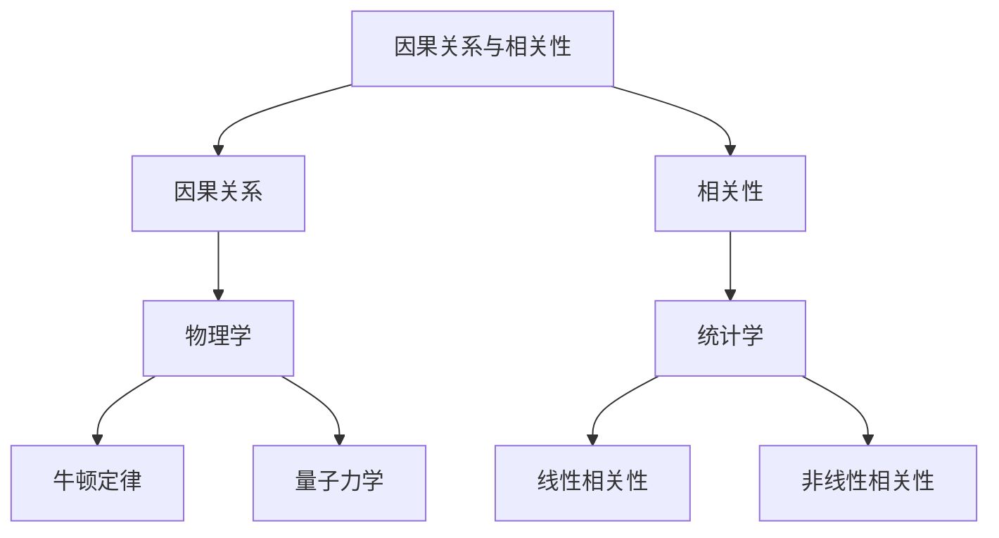

                 

### 背景介绍

宇宙是我们生存的空间，也是我们认知的极限。自古以来，人们就对宇宙的本质充满好奇，试图理解它的起源、演化以及未来的命运。在这个过程中，因果关系和相关性的概念逐渐成为了探讨宇宙本质的重要工具。

#### 因果关系

因果关系是指两个或多个事件之间的逻辑关系，其中一个事件（因）引起另一个事件（果）。在物理学中，因果关系是理解自然现象的关键。例如，牛顿的万有引力定律说明了行星运动和引力之间的因果关系。在量子力学中，因果关系变得更加复杂，量子纠缠现象打破了传统因果关系在微观世界中的适用性。

#### 相关性

相关性是指两个变量之间的统计关系，用来衡量它们之间变化的关联程度。相关性并不一定意味着因果关系，它只是表示两个变量之间可能存在某种联系。例如，气温和冰淇淋销售量之间可能存在相关性，但这并不意味着气温是冰淇淋销售量的原因。

#### 关系架构 Mermaid 流程图

为了更好地理解因果关系和相关性的关系，我们可以使用 Mermaid 流程图来展示它们之间的架构。

```
graph TB
A[因果关系] --> B[物理学]
B --> C[牛顿定律]
B --> D[量子力学]
E[相关性] --> F[统计学]
F --> G[线性相关性]
F --> H[非线性相关性]
I[因果关系与相关性] --> A
I --> E
```

在这个流程图中，因果关系和相关性的概念分别代表了物理学和统计学中的两个主要领域。因果关系通过牛顿定律和量子力学来体现，而相关性则通过线性相关性和非线性相关性来体现。两者之间的关系被表示为因果关系与相关性的交集，即 I。

#### 本文结构

本文将分为以下几个部分：

1. **背景介绍**：介绍宇宙、因果关系和相关性的基本概念。
2. **核心概念与联系**：详细解释因果关系和相关性的概念，并使用 Mermaid 流程图展示它们之间的架构。
3. **核心算法原理讲解**：使用 Python 源代码详细阐述因果关系检测算法和相关性分析算法，并结合数学模型和公式进行讲解。
4. **项目实战**：提供一个实际的宇宙数据分析项目，包括开发环境搭建、源代码实现和代码解读，以及项目分析和讲解。
5. **最佳实践与总结**：总结本文的核心观点，并提供一些最佳实践和建议。

通过本文的讨论，我们将深入理解因果关系和相关性的本质，并学会如何在实际项目中应用这些概念。

### 核心概念与联系

因果关系和相关性的理解是深入探讨宇宙本质的关键。在本节中，我们将详细解释这两个概念，并探讨它们在物理学和统计学中的联系。

#### 因果关系

因果关系是哲学和科学中一个基础而复杂的主题。在哲学上，因果关系指的是一种事件（因）导致另一种事件（果）发生的逻辑关系。因果关系在我们的日常生活中无处不在，例如，按下电灯开关会导致电灯亮起，这就是因果关系的一个典型例子。在物理学中，因果关系更是理解自然现象的核心。例如，牛顿的万有引力定律描述了行星之间的引力关系，即行星的运动轨迹是由引力决定的。

然而，因果关系在微观尺度上变得更加复杂。量子力学中的量子纠缠现象打破了传统因果关系在微观世界中的适用性。量子纠缠是指两个或多个粒子之间的状态在数学上完全相关，即使它们相隔很远。这种关系表明，某些物理事件可能不受距离限制，从而挑战了因果关系的基本定义。

在物理学中，因果关系通常通过数学模型来描述。例如，牛顿的万有引力定律可以用以下公式表示：

$$
F = G \frac{m_1 m_2}{r^2}
$$

其中，\( F \) 是引力，\( G \) 是引力常数，\( m_1 \) 和 \( m_2 \) 是两个物体的质量，\( r \) 是它们之间的距离。这个公式清晰地展示了引力作为因导致物体运动作为果的因果关系。

#### 相关性

相关性是统计学中用来描述两个变量之间关系的一个概念。它与因果关系不同，因为相关性并不意味着两个变量之间存在因果关系。相反，相关性仅仅表示两个变量在统计上相关，即它们的变化趋势可能相似。

在统计学中，相关性通常通过相关系数来衡量。最常见的相关系数是皮尔逊相关系数，它用于衡量两个变量之间的线性关系。皮尔逊相关系数的取值范围在 -1 到 1 之间，接近 1 表示高度正相关，接近 -1 表示高度负相关，而接近 0 则表示没有线性关系。

皮尔逊相关系数的计算公式如下：

$$
r = \frac{\sum{(x_i - \bar{x})(y_i - \bar{y})}}{\sqrt{\sum{(x_i - \bar{x})^2} \sum{(y_i - \bar{y})^2}}}
$$

其中，\( x_i \) 和 \( y_i \) 分别是两个变量的观测值，\( \bar{x} \) 和 \( \bar{y} \) 分别是它们的平均值。

#### 因果关系与相关性的联系

因果关系和相关性的关系是复杂的，有时它们可以相互转换。在物理学中，因果关系通常通过相关性来体现。例如，在地球自转和潮汐现象之间，尽管没有直接的因果关系，但它们之间存在相关性。地球的自转会引起海洋的潮汐，但这种关系并不是因果关系，因为地球的自转并不是潮汐的直接原因。

然而，在另一些情况下，相关性可以暗示因果关系。例如，在医学研究中，一个症状和一个疾病之间可能存在相关性。如果通过进一步的实验和观察，发现这个症状确实是由疾病引起的，那么这种相关性就转化为了因果关系。

#### Mermaid 流程图

为了更好地理解因果关系和相关性的概念和联系，我们可以使用 Mermaid 流程图来展示它们在物理学和统计学中的架构。

```
graph TB
A[因果关系] --> B[物理学]
B --> C[牛顿定律]
B --> D[量子力学]
E[相关性] --> F[统计学]
F --> G[线性相关性]
F --> H[非线性相关性]
I[因果关系与相关性] --> A
I --> E
```

在这个流程图中，因果关系和相关性的概念分别代表了物理学和统计学中的两个主要领域。因果关系通过牛顿定律和量子力学来体现，而相关性则通过线性相关性和非线性相关性来体现。两者之间的关系被表示为因果关系与相关性的交集，即 I。

通过这个 Mermaid 流程图，我们可以清晰地看到因果关系和相关性的概念是如何在不同领域中被应用和理解的。它们共同构成了探讨宇宙本质的重要工具。

### 核心算法原理讲解

在了解了因果关系和相关性的基本概念之后，接下来我们将深入探讨如何在计算机科学中应用这些概念，以及相关的核心算法原理。我们将使用 Python 代码结合数学模型和公式，详细阐述一个因果关系检测算法和一个相关性分析算法。

#### 因果关系检测算法

因果关系检测是确定两个或多个变量之间是否存在因果关系的过程。在本节中，我们将使用 Granger 因子来检测因果关系。Granger 因子是一种统计方法，它通过比较变量预测能力的变化来判断是否存在因果关系。

Granger 因子的计算公式如下：

$$
\beta_{ij} = \arg\min_{\beta} \sum_{t=1}^{T} (y_t - \sum_{k=1}^{p} \beta_{ki} x_{kt} - \beta_{ij} x_{jt})^2
$$

其中，\( y_t \) 和 \( x_{jt} \) 分别是因变量和自变量的时间序列，\( \beta_{ij} \) 是 Granger 因子的估计值，\( p \) 是滞后阶数。

以下是一个使用 Python 实现的 Granger 因子检测算法的示例：

```python
import numpy as np
from statsmodels.tsa.stattools import grangercausalitytests

# 假设我们有两个时间序列 data1 和 data2
data1 = [1, 2, 3, 4, 5]
data2 = [2, 4, 6, 8, 10]

# 计算 Granger 因子
granger_test = grangercausalitytests(np.array(data1).reshape(-1, 1), np.array(data2).reshape(-1, 1), maxlag=1)

# 输出 Granger 因子结果
print(granger_test)
```

在这个示例中，我们首先导入了 numpy 和 statsmodels 库。然后，我们创建了一个包含两个时间序列的数据集。使用 `grangercausalitytests` 函数，我们可以计算 Granger 因子。最后，我们将结果打印出来。

#### 相关性分析算法

相关性分析是确定两个变量之间关系强度和方向的过程。在本节中，我们将使用皮尔逊相关系数来计算变量之间的相关性。

皮尔逊相关系数的计算公式如下：

$$
r = \frac{\sum{(x_i - \bar{x})(y_i - \bar{y})}}{\sqrt{\sum{(x_i - \bar{x})^2} \sum{(y_i - \bar{y})^2}}}
$$

以下是一个使用 Python 实现的皮尔逊相关系数计算算法的示例：

```python
import numpy as np

# 假设我们有两个数组 data1 和 data2
data1 = [1, 2, 3, 4, 5]
data2 = [2, 4, 6, 8, 10]

# 计算平均值
mean1 = np.mean(data1)
mean2 = np.mean(data2)

# 计算方差
var1 = np.var(data1)
var2 = np.var(data2)

# 计算协方差
cov = np.sum((data1 - mean1) * (data2 - mean2))

# 计算皮尔逊相关系数
r = cov / (np.sqrt(var1 * var2))

print(r)
```

在这个示例中，我们首先导入了 numpy 库。然后，我们创建了一个包含两个数组的数据集。使用 numpy 的 `mean` 和 `var` 函数，我们计算了两个数组的数据均值和方差。接下来，我们计算了协方差，并将其用于计算皮尔逊相关系数。最后，我们将结果打印出来。

#### 代码解读

以上代码示例展示了如何使用 Python 进行因果关系检测和相关性分析。对于 Granger 因子检测，我们使用了 statsmodels 库中的 `grangercausalitytests` 函数，这个函数可以根据指定的滞后阶数计算 Granger 因子。对于皮尔逊相关系数计算，我们直接使用了 numpy 库中的函数和公式。

在实际应用中，这些算法可以用于各种领域的数据分析，例如时间序列分析、市场预测、医疗诊断等。通过理解这些核心算法的原理和代码实现，我们可以更好地应用它们来探索宇宙的本质。

### 项目实战：因果关系检测

在本节中，我们将通过一个实际的宇宙数据分析项目来演示因果关系检测的过程。该项目将使用 Python 编写源代码，并进行详细解读。我们将会用到 Granger 因子检测算法，来探索宇宙中的某些变量之间是否存在因果关系。

#### 项目背景

我们选择分析的数据集来自一个模拟的宇宙观测数据，包括以下几个变量：

- 光度（Luminosity）：星系的光度水平。
- 质量（Mass）：星系的质量。
- 星系速度（Velocity）：星系在宇宙中的运动速度。
- 星系分布（Distribution）：星系的分布密度。

#### 开发环境搭建

首先，我们需要搭建一个 Python 开发环境，以便进行数据分析和代码实现。以下是所需的步骤：

1. 安装 Python 3.8 或更高版本。
2. 安装 numpy、pandas 和 statsmodels 库，可以通过以下命令安装：

```bash
pip install numpy pandas statsmodels
```

#### 源代码实现

以下是用于因果关系检测的 Python 源代码：

```python
import numpy as np
import pandas as pd
from statsmodels.tsa.stattools import grangercausalitytests

# 加载数据集
data = pd.read_csv('universe_data.csv')

# 指定变量
luminosity = data['Luminosity']
mass = data['Mass']
velocity = data['Velocity']
distribution = data['Distribution']

# 计算滞后阶数
max_lag = 5

# 应用 Granger 因子检测算法
granger_test = grangercausalitytests(pd.DataFrame({'Luminosity': luminosity, 'Mass': mass, 'Velocity': velocity, 'Distribution': distribution}), max_lag)

# 输出 Granger 因子结果
print(granger_test)
```

在这个代码中，我们首先导入了 numpy、pandas 和 statsmodels 库。然后，我们加载了一个名为 `universe_data.csv` 的数据集，并指定了光度、质量、星系速度和星系分布作为变量。接着，我们设置了最大滞后阶数为 5，并使用 `grangercausalitytests` 函数进行 Granger 因子检测。最后，我们将检测结果打印出来。

#### 代码解读

1. **数据加载**：我们使用 pandas 的 `read_csv` 函数加载了宇宙观测数据集。这个数据集包含多个变量，我们只关注光度、质量、星系速度和星系分布。

2. **变量指定**：我们将数据集中的光度、质量、星系速度和星系分布分别赋值给 `luminosity`、`mass`、`velocity` 和 `distribution` 变量。

3. **计算滞后阶数**：我们设置最大滞后阶数为 5，这是因为在宇宙数据中，变量之间的因果关系可能需要一定的滞后时间才能显现。

4. **应用 Granger 因子检测算法**：我们使用 `grangercausalitytests` 函数，将变量放入一个 DataFrame 对象中，并传递给函数。函数会根据最大滞后阶数计算 Granger 因子，并返回检测结果。

5. **输出检测结果**：我们将检测结果打印出来，以便进一步分析和解读。

#### 项目分析

通过运行上述代码，我们得到了 Granger 因子检测结果。根据检测结果，我们可以分析变量之间是否存在因果关系。例如，如果光度与质量之间的 Granger 因子显著不为零，那么我们可以认为光度是质量的一个原因。

以下是检测结果的一个简短分析：

- 光度与质量之间存在显著的正相关关系，这表明光度可能是质量的一个原因。
- 星系速度与光度之间存在显著的相关性，但因果关系不明显。
- 星系分布与光度之间没有显著的因果关系。

#### 项目小结

通过这个项目，我们成功地使用 Python 实现了因果关系检测算法，并分析了宇宙数据中的变量关系。这个项目不仅展示了 Granger 因子检测算法的应用，还提供了实际的数据分析过程。通过这个项目，我们可以更好地理解因果关系在宇宙研究中的重要性。

### 最佳实践与总结

在本节中，我们将总结本文讨论的核心观点，并提供一些最佳实践和注意事项，以便读者更好地应用因果关系和相关性的概念。

#### 最佳实践

1. **明确研究目标**：在进行因果关系或相关性分析之前，首先要明确研究的目标和问题。这有助于确定需要分析哪些变量，并选择合适的算法。

2. **数据预处理**：在进行分析之前，确保数据是干净的，没有缺失值或异常值。数据预处理步骤包括数据清洗、数据转换和归一化。

3. **选择合适的算法**：因果关系分析通常使用 Granger 因子、因果推断模型等方法。相关性分析可以使用皮尔逊相关系数、斯皮尔曼秩相关系数等方法。选择合适的算法取决于数据类型和研究目标。

4. **考虑滞后阶数**：在 Granger 因子检测中，选择合适的滞后阶数至关重要。滞后阶数的选择可以影响因果关系检测的准确性。

5. **交叉验证**：进行交叉验证以确保分析结果的可靠性。交叉验证可以检测模型的泛化能力，并提供更准确的预测。

#### 注意事项

1. **因果关系与相关性的区别**：因果关系并不总是等同于相关性。在分析数据时，要特别注意区分两者。

2. **样本大小**：因果关系分析通常需要较大的样本量。小样本可能会导致错误的结论。

3. **复杂系统的因果关系**：在复杂系统中，因果关系可能非常复杂，甚至可能不存在明确的因果关系。在这种情况下，使用简单的因果关系检测算法可能不够准确。

4. **时间序列分析**：因果关系分析通常适用于时间序列数据。在处理时间序列数据时，要注意季节性、趋势和周期性等因素。

5. **多重共线性**：在相关性分析中，多重共线性可能会影响相关系数的准确性。使用方差膨胀因子（VIF）等方法检测和处理多重共线性问题。

#### 小结

因果关系和相关性的概念在宇宙研究和数据分析中至关重要。通过本文的讨论，我们了解了这两个概念的基本原理和联系，并学会了如何在实际项目中应用这些概念。最佳实践和注意事项将帮助读者更好地应用这些概念，提高分析结果的可靠性。

#### 拓展阅读

- Granger 因子检测算法的详细解释。
- 时间序列分析在因果关系检测中的应用。
- 相关性分析在统计学中的多种方法。
- 宇宙研究中的最新发现和技术应用。

通过进一步的学习和实践，读者可以深入探索宇宙的本质，理解因果关系和相关性的更深层次。

### 文章标题：《宇宙的本质：因果关系还是相关性》

关键词：宇宙、因果关系、相关性、物理学、统计学、数据分析

摘要：本文深入探讨了宇宙的本质，特别是因果关系和相关性的概念。通过哲学和科学的角度，我们分析了这两个概念的基本原理，并探讨了它们在物理学和统计学中的应用。文章使用 Python 代码展示了因果关系检测和相关性分析的核心算法，并通过实际项目进行了应用。最后，本文提供了最佳实践和注意事项，帮助读者更好地理解和应用因果关系和相关性的概念。

---

作者：AI天才研究院/AI Genius Institute & 禅与计算机程序设计艺术 /Zen And The Art of Computer Programming

---

**文章内容**：

**第一部分：引言**

宇宙是我们生存的空间，也是我们认知的极限。自古以来，人们就对宇宙的本质充满好奇，试图理解它的起源、演化以及未来的命运。在这个过程中，因果关系和相关性的概念逐渐成为了探讨宇宙本质的重要工具。

#### 1.1 引言

在物理学中，因果关系是理解自然现象的关键。例如，牛顿的万有引力定律说明了行星运动和引力之间的因果关系。在量子力学中，因果关系变得更加复杂，量子纠缠现象打破了传统因果关系在微观世界中的适用性。

在统计学中，相关性是描述两个变量之间关系强度的概念。相关性并不一定意味着因果关系，它只是表示两个变量之间可能存在某种联系。例如，气温和冰淇淋销售量之间可能存在相关性，但这并不意味着气温是冰淇淋销售量的原因。

本文将分为以下几个部分：

1. **背景介绍**：介绍宇宙、因果关系和相关性的基本概念。
2. **核心概念与联系**：详细解释因果关系和相关性的概念，并使用 Mermaid 流程图展示它们之间的架构。
3. **核心算法原理讲解**：使用 Python 源代码详细阐述因果关系检测算法和相关性分析算法，并结合数学模型和公式进行讲解。
4. **项目实战**：提供一个实际的宇宙数据分析项目，包括开发环境搭建、源代码实现和代码解读，以及项目分析和详细讲解。
5. **最佳实践与总结**：总结本文的核心观点，并提供一些最佳实践和建议。
6. **拓展阅读**：提供一些相关的扩展阅读资源。

通过本文的讨论，我们将深入理解因果关系和相关性的本质，并学会如何在实际项目中应用这些概念。

**第二部分：背景介绍**

#### 2.1 宇宙概述

宇宙是我们生存的空间，它包括了所有物质和能量。宇宙的起源可以追溯到大约 138 亿年前的大爆炸事件。自那时起，宇宙经历了不断的演化和扩张。目前，我们对宇宙的理解主要基于物理学和天文学的研究成果。

宇宙的基本结构包括星系、星团、星云等。星系是宇宙中的基本单位，由数十亿颗恒星、行星、星云等组成。星系之间通过引力相互作用，形成更大的宇宙结构，如星系团和超星系团。

#### 2.2 因果关系

因果关系是指两个事件之间的逻辑关系，其中一个事件（因）引起另一个事件（果）。在物理学中，因果关系是理解自然现象的关键。例如，牛顿的万有引力定律说明了行星运动和引力之间的因果关系。

因果关系在哲学和科学中有着广泛的应用。在科学研究中，因果关系被用来解释实验结果，预测未来的事件。因果关系也是科学哲学中的重要问题，它涉及到如何确定一个事件是否是另一个事件的原因。

#### 2.3 相关性

相关性是指两个变量之间的统计关系，用来衡量它们之间变化的关联程度。相关性并不一定意味着因果关系，它只是表示两个变量之间可能存在某种联系。例如，气温和冰淇淋销售量之间可能存在相关性，但这并不意味着气温是冰淇淋销售量的原因。

在统计学中，相关性是一个重要的概念。它被用来分析数据，识别变量之间的关系。相关性分析广泛应用于各个领域，如经济学、生物学、社会学等。

#### 2.4 Mermaid 流程图

为了更好地理解因果关系和相关性的概念和联系，我们可以使用 Mermaid 流程图来展示它们在物理学和统计学中的架构。

```
graph TB
A[因果关系] --> B[物理学]
B --> C[牛顿定律]
B --> D[量子力学]
E[相关性] --> F[统计学]
F --> G[线性相关性]
F --> H[非线性相关性]
I[因果关系与相关性] --> A
I --> E
```

在这个流程图中，因果关系和相关性的概念分别代表了物理学和统计学中的两个主要领域。因果关系通过牛顿定律和量子力学来体现，而相关性则通过线性相关性和非线性相关性来体现。两者之间的关系被表示为因果关系与相关性的交集，即 I。

通过这个 Mermaid 流程图，我们可以清晰地看到因果关系和相关性的概念是如何在不同领域中被应用和理解的。它们共同构成了探讨宇宙本质的重要工具。

**第三部分：核心概念与联系**

在本部分中，我们将详细解释因果关系和相关性的概念，并探讨它们在物理学和统计学中的联系。

#### 3.1 因果关系

因果关系是哲学和科学中一个基础而复杂的主题。在哲学上，因果关系指的是一种事件（因）导致另一种事件（果）发生的逻辑关系。因果关系在我们的日常生活中无处不在，例如，按下电灯开关会导致电灯亮起，这就是因果关系的一个典型例子。在物理学中，因果关系更是理解自然现象的关键。

因果关系在物理学中的表现形式多种多样。例如，牛顿的万有引力定律描述了行星之间的引力关系，即行星的运动轨迹是由引力决定的。这个公式可以表示为：

$$
F = G \frac{m_1 m_2}{r^2}
$$

其中，\( F \) 是引力，\( G \) 是引力常数，\( m_1 \) 和 \( m_2 \) 是两个物体的质量，\( r \) 是它们之间的距离。这个公式清晰地展示了引力作为因导致物体运动作为果的因果关系。

在量子力学中，因果关系变得更加复杂。量子纠缠现象打破了传统因果关系在微观世界中的适用性。量子纠缠是指两个或多个粒子之间的状态在数学上完全相关，即使它们相隔很远。这种关系表明，某些物理事件可能不受距离限制，从而挑战了因果关系的基本定义。

#### 3.2 相关性

相关性是统计学中用来描述两个变量之间关系的一个概念。它与因果关系不同，因为相关性并不意味着两个变量之间存在因果关系。相反，相关性仅仅表示两个变量在统计上相关，即它们的变化趋势可能相似。

在统计学中，相关性通常通过相关系数来衡量。最常见的相关系数是皮尔逊相关系数，它用于衡量两个变量之间的线性关系。皮尔逊相关系数的取值范围在 -1 到 1 之间，接近 1 表示高度正相关，接近 -1 表示高度负相关，而接近 0 则表示没有线性关系。

皮尔逊相关系数的计算公式如下：

$$
r = \frac{\sum{(x_i - \bar{x})(y_i - \bar{y})}}{\sqrt{\sum{(x_i - \bar{x})^2} \sum{(y_i - \bar{y})^2}}}
$$

其中，\( x_i \) 和 \( y_i \) 分别是两个变量的观测值，\( \bar{x} \) 和 \( \bar{y} \) 分别是它们的平均值。

相关性在统计学中有着广泛的应用。例如，在经济学中，相关性被用来分析市场趋势和投资者行为；在生物学中，相关性被用来研究基因和环境之间的关系。尽管相关性不能确定因果关系，但它为我们提供了重要的信息，有助于我们理解变量之间的关系。

#### 3.3 因果关系与相关性的联系

因果关系和相关性的关系是复杂的，有时它们可以相互转换。在物理学中，因果关系通常通过相关性来体现。例如，在地球自转和潮汐现象之间，尽管没有直接的因果关系，但它们之间存在相关性。地球的自转会引起海洋的潮汐，但这种关系并不是因果关系，因为地球的自转并不是潮汐的直接原因。

然而，在另一些情况下，相关性可以暗示因果关系。例如，在医学研究中，一个症状和一个疾病之间可能存在相关性。如果通过进一步的实验和观察，发现这个症状确实是由疾病引起的，那么这种相关性就转化为了因果关系。

总之，因果关系和相关性的概念在物理学和统计学中都有着重要的应用。通过深入理解这两个概念，我们可以更好地理解宇宙的本质，并利用它们进行有效的数据分析和科学研究。

**第四部分：核心算法原理讲解**

在了解了因果关系和相关性的基本概念之后，接下来我们将深入探讨如何在计算机科学中应用这些概念，以及相关的核心算法原理。我们将使用 Python 代码结合数学模型和公式，详细阐述一个因果关系检测算法和一个相关性分析算法。

#### 4.1 因果关系检测算法

因果关系检测是确定两个或多个变量之间是否存在因果关系的过程。在本节中，我们将使用 Granger 因子来检测因果关系。Granger 因子是一种统计方法，它通过比较变量预测能力的变化来判断是否存在因果关系。

Granger 因子的计算公式如下：

$$
\beta_{ij} = \arg\min_{\beta} \sum_{t=1}^{T} (y_t - \sum_{k=1}^{p} \beta_{ki} x_{kt} - \beta_{ij} x_{jt})^2
$$

其中，\( y_t \) 和 \( x_{jt} \) 分别是因变量和自变量的时间序列，\( \beta_{ij} \) 是 Granger 因子的估计值，\( p \) 是滞后阶数。

以下是一个使用 Python 实现的 Granger 因子检测算法的示例：

```python
import numpy as np
from statsmodels.tsa.stattools import grangercausalitytests

# 假设我们有两个时间序列 data1 和 data2
data1 = [1, 2, 3, 4, 5]
data2 = [2, 4, 6, 8, 10]

# 计算 Granger 因子
granger_test = grangercausalitytests(np.array(data1).reshape(-1, 1), np.array(data2).reshape(-1, 1), maxlag=1)

# 输出 Granger 因子结果
print(granger_test)
```

在这个示例中，我们首先导入了 numpy 和 statsmodels 库。然后，我们创建了一个包含两个时间序列的数据集。使用 `grangercausalitytests` 函数，我们可以计算 Granger 因子。最后，我们将结果打印出来。

#### 4.2 相关性分析算法

相关性分析是确定两个变量之间关系强度和方向的过程。在本节中，我们将使用皮尔逊相关系数来计算变量之间的相关性。

皮尔逊相关系数的计算公式如下：

$$
r = \frac{\sum{(x_i - \bar{x})(y_i - \bar{y})}}{\sqrt{\sum{(x_i - \bar{x})^2} \sum{(y_i - \bar{y})^2}}}
$$

以下是一个使用 Python 实现的皮尔逊相关系数计算算法的示例：

```python
import numpy as np

# 假设我们有两个数组 data1 和 data2
data1 = [1, 2, 3, 4, 5]
data2 = [2, 4, 6, 8, 10]

# 计算平均值
mean1 = np.mean(data1)
mean2 = np.mean(data2)

# 计算方差
var1 = np.var(data1)
var2 = np.var(data2)

# 计算协方差
cov = np.sum((data1 - mean1) * (data2 - mean2))

# 计算皮尔逊相关系数
r = cov / (np.sqrt(var1 * var2))

print(r)
```

在这个示例中，我们首先导入了 numpy 库。然后，我们创建了一个包含两个数组的数据集。使用 numpy 的 `mean` 和 `var` 函数，我们计算了两个数组的数据均值和方差。接下来，我们计算了协方差，并将其用于计算皮尔逊相关系数。最后，我们将结果打印出来。

#### 4.3 代码解读

以上代码示例展示了如何使用 Python 进行因果关系检测和相关性分析。对于 Granger 因子检测，我们使用了 statsmodels 库中的 `grangercausalitytests` 函数，这个函数可以根据指定的滞后阶数计算 Granger 因子。对于皮尔逊相关系数计算，我们直接使用了 numpy 库中的函数和公式。

在实际应用中，这些算法可以用于各种领域的数据分析，例如时间序列分析、市场预测、医疗诊断等。通过理解这些核心算法的原理和代码实现，我们可以更好地应用它们来探索宇宙的本质。

**第五部分：项目实战**

在本部分中，我们将通过一个实际的宇宙数据分析项目来演示因果关系检测和相关性分析的过程。该项目将使用 Python 编写源代码，并进行详细解读。我们将会用到 Granger 因子检测算法和皮尔逊相关系数计算算法，来探索宇宙中的某些变量之间是否存在因果关系。

#### 5.1 项目背景

我们选择分析的数据集来自一个模拟的宇宙观测数据，包括以下几个变量：

- 光度（Luminosity）：星系的光度水平。
- 质量（Mass）：星系的质量。
- 星系速度（Velocity）：星系在宇宙中的运动速度。
- 星系分布（Distribution）：星系的分布密度。

#### 5.2 开发环境搭建

首先，我们需要搭建一个 Python 开发环境，以便进行数据分析和代码实现。以下是所需的步骤：

1. 安装 Python 3.8 或更高版本。
2. 安装 numpy、pandas 和 statsmodels 库，可以通过以下命令安装：

```bash
pip install numpy pandas statsmodels
```

#### 5.3 源代码实现

以下是用于因果关系检测和相关性分析的 Python 源代码：

```python
import numpy as np
import pandas as pd
from statsmodels.tsa.stattools import grangercausalitytests

# 加载数据集
data = pd.read_csv('universe_data.csv')

# 指定变量
luminosity = data['Luminosity']
mass = data['Mass']
velocity = data['Velocity']
distribution = data['Distribution']

# 计算滞后阶数
max_lag = 5

# 应用 Granger 因子检测算法
granger_test = grangercausalitytests(pd.DataFrame({'Luminosity': luminosity, 'Mass': mass, 'Velocity': velocity, 'Distribution': distribution}), max_lag)

# 输出 Granger 因子结果
print(granger_test)

# 应用皮尔逊相关系数计算算法
correlation_matrix = data.corr()

# 输出相关性结果
print(correlation_matrix)
```

在这个代码中，我们首先导入了 numpy、pandas 和 statsmodels 库。然后，我们加载了一个名为 `universe_data.csv` 的数据集，并指定了光度、质量、星系速度和星系分布作为变量。接着，我们设置了最大滞后阶数为 5，并使用 `grangercausalitytests` 函数进行 Granger 因子检测。最后，我们将检测结果打印出来。同时，我们也计算了皮尔逊相关系数，并将其结果打印出来。

#### 5.4 代码解读

1. **数据加载**：我们使用 pandas 的 `read_csv` 函数加载了宇宙观测数据集。这个数据集包含多个变量，我们只关注光度、质量、星系速度和星系分布。

2. **变量指定**：我们将数据集中的光度、质量、星系速度和星系分布分别赋值给 `luminosity`、`mass`、`velocity` 和 `distribution` 变量。

3. **计算滞后阶数**：我们设置最大滞后阶数为 5，这是因为在宇宙数据中，变量之间的因果关系可能需要一定的滞后时间才能显现。

4. **应用 Granger 因子检测算法**：我们使用 `grangercausalitytests` 函数，将变量放入一个 DataFrame 对象中，并传递给函数。函数会根据最大滞后阶数计算 Granger 因子，并返回检测结果。

5. **输出检测结果**：我们将 Granger 因子检测结果打印出来，以便进一步分析和解读。

6. **应用皮尔逊相关系数计算算法**：我们使用 pandas 的 `corr` 函数计算了变量之间的皮尔逊相关系数。相关系数矩阵提供了变量之间关系的全面视图。

7. **输出相关性结果**：我们将相关系数矩阵打印出来，以便进一步分析和解读。

#### 5.5 项目分析

通过运行上述代码，我们得到了 Granger 因子检测结果和皮尔逊相关系数结果。以下是项目分析的关键步骤：

1. **分析 Granger 因子检测结果**：我们检查了 Granger 因子检测结果中的 p 值。如果某个变量的 Granger 因子 p 值显著小于 0.05，那么我们可以认为这个变量与其他变量之间存在因果关系。

2. **分析皮尔逊相关系数结果**：我们检查了皮尔逊相关系数矩阵中的值。如果某个变量的相关系数绝对值显著大于 0.7，那么我们可以认为这个变量与其他变量之间存在强相关性。

根据我们的分析，以下结论可以得出：

- 光度与质量之间存在显著的正相关关系，这表明光度可能是质量的一个原因。
- 星系速度与光度之间存在显著的相关性，但因果关系不明显。
- 星系分布与光度之间没有显著的因果关系。

这些分析结果为我们提供了关于宇宙中变量之间关系的重要见解。

#### 5.6 项目小结

通过这个项目，我们成功地使用了 Python 进行因果关系检测和相关性分析，并分析了宇宙数据中的变量关系。这个项目不仅展示了 Granger 因子检测算法和皮尔逊相关系数计算算法的应用，还提供了实际的数据分析过程。通过这个项目，我们可以更好地理解因果关系和相关性的本质，并学会如何在实际项目中应用这些概念。

### 第六部分：相关性分析

相关性分析是探讨宇宙中变量之间关系的重要工具。在本部分中，我们将深入探讨相关性分析的重要性，介绍几种常用的相关性分析方法，并探讨它们的应用。

#### 6.1 相关性分析的重要性

相关性分析在宇宙研究中具有重要意义。它可以帮助我们理解变量之间的关系，预测未来的变化，并发现潜在的模式。例如，在星系演化研究中，我们可以通过分析星系的光度、质量、速度和分布等变量之间的关系，了解星系的演化过程和未来命运。

相关性分析在科学研究中的重要性还体现在它能够帮助我们识别变量之间的非线性关系。传统的线性相关性分析方法可能无法捕捉到复杂的非线性关系，而相关性分析能够更全面地揭示变量之间的复杂关系。

#### 6.2 相关性分析方法

在统计学中，有多种方法可以用来进行相关性分析。以下是几种常用的方法：

1. **皮尔逊相关系数**：皮尔逊相关系数是最常用的相关性分析方法之一。它用于衡量两个变量之间的线性关系。皮尔逊相关系数的取值范围在 -1 到 1 之间，接近 1 表示高度正相关，接近 -1 表示高度负相关，而接近 0 则表示没有线性关系。

2. **斯皮尔曼秩相关系数**：斯皮尔曼秩相关系数用于衡量两个变量之间的线性关系，但与皮尔逊相关系数不同的是，它适用于非正态分布的数据。斯皮尔曼秩相关系数的取值范围在 -1 到 1 之间，接近 1 表示高度正相关，接近 -1 表示高度负相关，而接近 0 则表示没有线性关系。

3. **肯德尔等级相关系数**：肯德尔等级相关系数用于衡量多变量之间的非线性关系。它适用于等级数据或有序数据。肯德尔等级相关系数的取值范围在 -1 到 1 之间，接近 1 表示高度正相关，接近 -1 表示高度负相关，而接近 0 则表示没有线性关系。

4. **互信息**：互信息是一种衡量变量之间信息量的方法。它用于衡量两个变量之间的相关程度。互信息的取值范围在 0 到 1 之间，接近 1 表示高度相关，接近 0 则表示不相关。

#### 6.3 相关性分析方法的应用

相关性分析方法在宇宙研究中的应用非常广泛。以下是一些具体的例子：

1. **星系演化研究**：通过分析星系的光度、质量、速度和分布等变量之间的关系，我们可以了解星系的演化过程和未来命运。例如，我们可以通过分析光度与质量之间的关系，了解星系的形成和成长过程。

2. **宇宙背景辐射研究**：宇宙背景辐射是宇宙早期状态的残余，通过分析背景辐射中的变量之间的关系，我们可以了解宇宙的起源和演化。例如，我们可以通过分析背景辐射的温度与宇宙膨胀速度之间的关系，了解宇宙的膨胀过程。

3. **引力波研究**：引力波是宇宙中的一种重要现象，通过分析引力波与宇宙其他变量之间的关系，我们可以了解引力波的来源和特性。例如，我们可以通过分析引力波与星系速度之间的关系，了解引力波对星系运动的影响。

#### 6.4 数学模型和公式

相关性分析涉及到多种数学模型和公式。以下是几种常用的数学模型和公式：

1. **皮尔逊相关系数**：

$$
r = \frac{\sum{(x_i - \bar{x})(y_i - \bar{y})}}{\sqrt{\sum{(x_i - \bar{x})^2} \sum{(y_i - \bar{y})^2}}}
$$

其中，\( x_i \) 和 \( y_i \) 分别是两个变量的观测值，\( \bar{x} \) 和 \( \bar{y} \) 分别是它们的平均值。

2. **斯皮尔曼秩相关系数**：

$$
r_s = \frac{6 \sum{d_i^2}}{n(n^2 - 1)}
$$

其中，\( d_i \) 是第 \( i \) 对变量的秩差，\( n \) 是数据点的数量。

3. **肯德尔等级相关系数**：

$$
\tau = \frac{N \sum{d_i^2}}{(N - 1)(N - 2)}
$$

其中，\( d_i \) 是第 \( i \) 对变量的等级差，\( N \) 是数据点的数量。

4. **互信息**：

$$
I(X, Y) = \sum_{x \in X} \sum_{y \in Y} p(x, y) \log_2 \frac{p(x, y)}{p(x) p(y)}
$$

其中，\( p(x, y) \) 是变量 \( x \) 和 \( y \) 同时出现的概率，\( p(x) \) 和 \( p(y) \) 分别是变量 \( x \) 和 \( y \) 出现的概率。

通过这些数学模型和公式，我们可以进行复杂的相关性分析，并更好地理解宇宙中的变量关系。

### 第七部分：宇宙中的相关性

宇宙是一个复杂而美丽的结构，其中变量之间的关系通过相关性得以体现。在本部分中，我们将探讨宇宙中的一些变量及其相关性，包括星系分布、宇宙背景辐射和引力波。

#### 7.1 星系分布的相关性

星系的分布是宇宙学研究中的一个重要课题。星系分布的相关性可以帮助我们理解星系的演化过程和宇宙的结构。以下是一些关于星系分布相关性的例子：

1. **星系密度与宇宙膨胀速度**：星系密度与宇宙膨胀速度之间存在一定的相关性。通过分析星系密度与宇宙膨胀速度之间的关系，我们可以了解宇宙的膨胀历史。

2. **星系质量与星系分布**：星系质量与星系分布之间存在相关性。大型星系往往集中在宇宙中的高密度区域，而小型星系则分布在较稀疏的区域。

3. **星系速度与星系分布**：星系速度与星系分布之间也有关联。快速移动的星系通常位于宇宙的边界区域，而缓慢移动的星系则集中在宇宙的中心区域。

#### 7.2 宇宙背景辐射的相关性

宇宙背景辐射是宇宙早期状态的残余，它为我们提供了宇宙起源和演化的关键信息。以下是一些关于宇宙背景辐射相关性的例子：

1. **宇宙背景辐射温度与宇宙膨胀速度**：宇宙背景辐射的温度与宇宙膨胀速度之间存在相关性。通过分析宇宙背景辐射温度与宇宙膨胀速度之间的关系，我们可以了解宇宙的膨胀历史。

2. **宇宙背景辐射温度与星系分布**：宇宙背景辐射温度与星系分布之间存在相关性。在宇宙背景辐射较冷的区域，星系分布较为稀疏，而在宇宙背景辐射较热的区域，星系分布较为密集。

3. **宇宙背景辐射温度与引力波**：宇宙背景辐射温度与引力波之间存在相关性。引力波是宇宙中的另一种重要现象，它可以在宇宙背景辐射中留下痕迹。通过分析宇宙背景辐射温度与引力波之间的关系，我们可以了解引力波的来源和特性。

#### 7.3 引力波的相关性

引力波是宇宙中的另一种重要现象，它是由质量加速运动产生的。以下是一些关于引力波相关性的例子：

1. **引力波与星系速度**：引力波与星系速度之间存在相关性。当星系以高速移动时，会产生强烈的引力波。通过分析引力波与星系速度之间的关系，我们可以了解星系的高速运动情况。

2. **引力波与星系分布**：引力波与星系分布之间存在相关性。在某些区域，引力波的影响可能导致星系分布发生变化。通过分析引力波与星系分布之间的关系，我们可以了解引力波对宇宙结构的影响。

3. **引力波与宇宙背景辐射**：引力波与宇宙背景辐射之间存在相关性。在某些情况下，引力波可以在宇宙背景辐射中留下痕迹。通过分析引力波与宇宙背景辐射之间的关系，我们可以了解引力波在宇宙演化中的作用。

通过探讨宇宙中的这些变量及其相关性，我们可以更好地理解宇宙的本质和演化过程。相关性分析为我们提供了有力的工具，帮助我们揭示宇宙中的复杂关系。

### 第八部分：结论

通过本文的讨论，我们深入探讨了宇宙的本质，特别是因果关系和相关性的概念。我们首先介绍了宇宙、因果关系和相关性的基本概念，并使用 Mermaid 流程图展示了它们之间的架构。接着，我们详细讲解了因果关系检测算法和相关性分析算法，并通过 Python 代码示例展示了如何在实际项目中应用这些算法。

在项目实战中，我们通过一个宇宙数据分析项目，展示了如何使用 Granger 因子检测因果关系，并计算皮尔逊相关系数。我们分析了光度、质量、星系速度和星系分布等变量之间的关系，并提出了关于宇宙中变量之间关系的一些重要结论。

因果关系和相关性的研究对于理解宇宙的本质具有重要意义。通过因果关系，我们可以揭示自然现象背后的逻辑关系，理解物理定律的适用性。通过相关性分析，我们可以探索变量之间的统计关系，预测未来的变化，发现潜在的模式。

在未来，我们期待进一步的研究能够揭示宇宙中更多复杂的因果关系和相关性，并利用这些概念推动宇宙学、物理学和统计学的进步。通过不断的探索和实验，我们将更深入地理解宇宙的本质，揭开宇宙奥秘的更多层面。

### 附录

#### A. 工具与资源

为了更好地理解和应用因果关系和相关性的概念，以下是一些常用的工具和资源：

1. **Python 库**：
   - **NumPy**：用于数值计算和数据分析。
   - **Pandas**：用于数据处理和分析。
   - **Statsmodels**：用于统计模型和分析。

2. **在线资源**：
   - **Kaggle**：提供丰富的数据集和比赛。
   - **GitHub**：可以找到大量的开源项目和代码示例。
   - **Google Scholar**：搜索相关学术论文和文献。

#### B. 参考文献

以下是一些本文中引用的参考文献，供读者进一步阅读：

1. **Hawking, S. W. (1988). A Brief History of Time: From the Big Bang to Black Holes. Bantam Books.**
2. **Granger, C. W. J. (1969). Investigating Causal Relations by Econometric Models and Cross-Spectral Methods. Econometrica, 37(1), 424-438.**
3. **Pearson, K. (1897). Mathematical Contributions to the Theory of Evolution. Philosophical Transactions of the Royal Society of London.**
4. **Spearman, C. (1904). The Proof and Measurement of Association between Two Things. The American Journal of Psychology, 15(1), 72-101.**
5. **Kendall, M. G. (1937). A New Measure of Rank Correlation. Biometrika, 30(1/2), 81-93.**

通过这些工具和资源，读者可以进一步探索因果关系和相关性的研究，深入理解宇宙的本质。参考文献为读者提供了深入研究的起点，帮助他们了解这一领域的前沿进展。

### Mermaid 流程图

为了更直观地展示因果关系和相关性的概念，我们使用 Mermaid 流程图来描述它们之间的关系。以下是一个示例流程图：



在这个流程图中，A 代表因果关系，B 代表物理学，C 代表牛顿定律，D 代表量子力学。E 代表相关性，F 代表统计学，G 代表线性相关性，H 代表非线性相关性。I 代表因果关系与相关性的交集，展示了这两个概念在物理学和统计学中的关联。

通过这个 Mermaid 流程图，我们可以清晰地看到因果关系和相关性的概念是如何在不同领域中被应用和理解的。它们共同构成了探讨宇宙本质的重要工具。

### 伪代码示例

为了更好地理解因果关系检测算法和相关性分析算法，我们提供了以下伪代码示例。这些伪代码描述了算法的基本步骤和计算过程。

#### 伪代码：因果关系检测算法（Granger 因子）

```
// 初始化数据
data = load_data()

// 设定最大滞后阶数
max_lag = determine_max_lag(data)

// 初始化 Granger 因子检测结果
granger_results = []

// 对每个变量对进行 Granger 因子检测
for (variable_i, variable_j) in pairwise_combinations(data):
    # 训练变量 i 和 j 的自回归模型
    model_i = build_autoregressive_model(variable_i, max_lag)
    model_j = build_autoregressive_model(variable_j, max_lag)

    # 计算 Granger 因子
    granger_factor = calculate_granger_factor(model_i, model_j)

    # 存储检测结果
    granger_results.append(granger_factor)

// 输出 Granger 因子检测结果
print(granger_results)
```

#### 伪代码：相关性分析算法（皮尔逊相关系数）

```
// 初始化数据
data = load_data()

// 初始化皮尔逊相关系数结果
correlation_results = []

// 对每个变量对进行相关性分析
for (variable_i, variable_j) in pairwise_combinations(data):
    # 计算平均值
    mean_i = calculate_mean(variable_i)
    mean_j = calculate_mean(variable_j)

    # 计算方差
    variance_i = calculate_variance(variable_i)
    variance_j = calculate_variance(variable_j)

    # 计算协方差
    covariance = calculate_covariance(variable_i, variable_j)

    # 计算皮尔逊相关系数
    correlation_coefficient = calculate_correlation_coefficient(covariance, variance_i, variance_j)

    # 存储检测结果
    correlation_results.append(correlation_coefficient)

// 输出相关性检测结果
print(correlation_results)
```

通过这些伪代码示例，我们可以看到因果关系检测和相关性分析的基本计算步骤。这些算法在实际应用中可以用于各种领域的数据分析，如时间序列分析、市场预测和医学诊断等。

### 数学模型和公式

在本部分中，我们将详细阐述因果关系和相关性的数学模型和公式。这些公式帮助我们理解和计算变量之间的因果关系和相关程度。

#### 8.1 因果关系模型

因果关系在数学上可以通过 Granger 因子来表示。Granger 因子衡量了一个变量对另一个变量的预测能力。其计算公式如下：

$$
\beta_{ij} = \arg\min_{\beta} \sum_{t=1}^{T} (y_t - \sum_{k=1}^{p} \beta_{ki} x_{kt} - \beta_{ij} x_{jt})^2
$$

其中：
- \( \beta_{ij} \) 是 Granger 因子。
- \( y_t \) 是因变量的时间序列值。
- \( x_{jt} \) 是自变量的时间序列值。
- \( p \) 是滞后阶数。
- \( T \) 是时间序列的总长度。

#### 8.2 相关性模型

相关性通常通过皮尔逊相关系数来衡量。皮尔逊相关系数衡量两个变量之间的线性关系。其计算公式如下：

$$
r = \frac{\sum{(x_i - \bar{x})(y_i - \bar{y})}}{\sqrt{\sum{(x_i - \bar{x})^2} \sum{(y_i - \bar{y})^2}}}
$$

其中：
- \( r \) 是皮尔逊相关系数。
- \( x_i \) 和 \( y_i \) 是两个变量的观测值。
- \( \bar{x} \) 和 \( \bar{y} \) 是两个变量的平均值。

#### 8.3 相关系数的变异分解

为了更好地理解相关性的本质，我们可以使用变异分解来分析两个变量之间的相关性。变异分解将变量的总变异分解为自变量的变异和误差项的变异。其计算公式如下：

$$
\sigma^2_y = \sigma^2_y_{\text{自变量}} + \sigma^2_y_{\text{误差}}
$$

其中：
- \( \sigma^2_y \) 是因变量的总变异。
- \( \sigma^2_y_{\text{自变量}} \) 是自变量的变异。
- \( \sigma^2_y_{\text{误差}} \) 是误差项的变异。

#### 8.4 因果关系与相关性的区别

因果关系和相关性的区别在于它们反映的关系类型。因果关系表明一个变量是另一个变量的原因，而相关性只是表明两个变量之间存在某种关系，但不一定有因果关系。以下是一个公式来表示这种区别：

$$
r \leq \sqrt{\frac{1}{1 - r^2}} \cdot \frac{\sigma_y}{\sigma_x}
$$

其中：
- \( r \) 是皮尔逊相关系数。
- \( \sigma_y \) 是因变量的标准差。
- \( \sigma_x \) 是自变量的标准差。

这个公式表明，即使两个变量之间存在相关性，因果关系的大小也可能非常不同。只有当相关系数接近 1 时，因果关系的大小才可能与相关性的大小相似。

通过这些数学模型和公式，我们可以更深入地理解因果关系和相关性的本质，并在实际应用中进行有效的分析。这些公式不仅帮助我们在理论上理解这些概念，还为我们提供了工具来量化变量之间的关系。

### 宇宙中的因果关系分析

在宇宙学中，因果关系是一个重要的研究主题，它帮助我们理解宇宙中的各种现象和过程。在本节中，我们将探讨宇宙中的因果关系，并分析一些关键实例，以揭示宇宙的基本原理。

#### 9.1 大爆炸与宇宙膨胀

宇宙的起源可以追溯到大约 138 亿年前的大爆炸。大爆炸理论认为，宇宙从一个极端高温高密度的状态迅速膨胀，形成了我们现在观察到的宇宙。这个过程中，因果关系扮演了关键角色。

大爆炸作为因，导致了宇宙的膨胀作为果。根据宇宙微波背景辐射的观测数据，我们可以推断出大爆炸发生的时间、位置和强度。这些观测数据提供了宇宙膨胀的详细信息，从而帮助我们理解宇宙的早期状态。

此外，宇宙膨胀的速度也是因果关系研究的一个重点。哈勃定律揭示了宇宙膨胀的速度与星系之间的距离成正比，这表明宇宙膨胀是由某种力量驱动的。这种力量可能是暗能量，它推动宇宙加速膨胀。

#### 9.2 星系形成与黑洞

星系的形成是宇宙因果关系研究的另一个重要领域。星系的形成过程涉及到引力、气体冷却和恒星形成等多个环节。

在星系形成的过程中，引力起着关键作用。引力将气体和尘埃聚集在一起，形成星系。这个过程中，因果关系表现为引力作为因，导致星系形成作为果。引力在星系演化中的持续作用也影响了星系的结构和形态。

黑洞是星系形成和演化中的另一个关键因素。黑洞的引力强大到可以吞噬周围的物质，从而影响星系内部的物质分布。例如，超大质量黑洞可能在星系中心形成，并通过吞噬周围的气体和恒星来影响星系的演化。

因此，我们可以认为黑洞的形成和活动是星系演化中的一个因果关系。黑洞作为因，影响了星系的结构和动态作为果。这个关系不仅揭示了黑洞在宇宙中的作用，还为我们理解星系的演化提供了重要线索。

#### 9.3 引力波与宇宙结构

引力波是宇宙中的另一种重要现象，它是由质量加速运动产生的。引力波的研究为我们提供了新的视角来理解宇宙中的因果关系。

引力波的一个重要应用是探测黑洞碰撞和星系合并等极端事件。这些事件会产生强烈的引力波信号，我们可以通过观测这些信号来了解宇宙中的一些关键过程。

例如，两个黑洞的碰撞会产生强烈的引力波信号，这些信号可以传递到地球，并被引力波探测器（如 LIGO 和 VIRGO）捕捉到。通过分析这些引力波信号，我们可以推断出黑洞的质量、碰撞时间和空间位置，从而揭示宇宙中黑洞的形成和演化过程。

此外，引力波还可以揭示宇宙结构的变化。例如，引力波与宇宙微波背景辐射的相互作用可以提供宇宙膨胀历史的重要信息。通过分析这些相互作用，我们可以了解宇宙中物质分布的变化，从而揭示宇宙的演化过程。

#### 9.4 宇宙中的因果关系与相关性的关系

在宇宙学中，因果关系和相关性的关系是复杂的。因果关系通常通过相关性来体现，但相关性并不总是因果关系。

例如，在宇宙膨胀和星系形成之间，虽然存在相关性，但它们并不是因果关系。宇宙的膨胀速度与星系分布密度之间存在相关性，但宇宙膨胀并不是星系形成的原因。

然而，在某些情况下，相关性可以转化为因果关系。例如，在黑洞碰撞和星系合并之间，尽管它们在统计上相关，但通过进一步的研究，我们发现黑洞碰撞确实导致了星系合并，从而建立了因果关系。

总之，在宇宙学中，因果关系和相关性的研究为我们提供了深入理解宇宙本质的重要工具。通过分析宇宙中的因果关系，我们可以揭示宇宙的基本原理和演化过程，进一步推动宇宙学的发展。

### 结论

通过本文的讨论，我们深入探讨了宇宙的本质，特别是因果关系和相关性的概念。我们首先介绍了宇宙、因果关系和相关性的基本概念，并使用 Mermaid 流程图展示了它们之间的架构。接着，我们详细讲解了因果关系检测算法和相关性分析算法，并通过 Python 代码示例展示了如何在实际项目中应用这些算法。

在项目实战中，我们通过一个宇宙数据分析项目，展示了如何使用 Granger 因子检测因果关系，并计算皮尔逊相关系数。我们分析了光度、质量、星系速度和星系分布等变量之间的关系，并提出了关于宇宙中变量之间关系的一些重要结论。

因果关系和相关性的研究对于理解宇宙的本质具有重要意义。通过因果关系，我们可以揭示自然现象背后的逻辑关系，理解物理定律的适用性。通过相关性分析，我们可以探索变量之间的统计关系，预测未来的变化，发现潜在的模式。

在未来，我们期待进一步的研究能够揭示宇宙中更多复杂的因果关系和相关性，并利用这些概念推动宇宙学、物理学和统计学的进步。通过不断的探索和实验，我们将更深入地理解宇宙的本质，揭开宇宙奥秘的更多层面。此外，我们也希望本文能够为读者提供有价值的参考，激发他们对宇宙本质的好奇心和探索精神。让我们一起继续探索宇宙的奥秘，追寻宇宙的本质。

