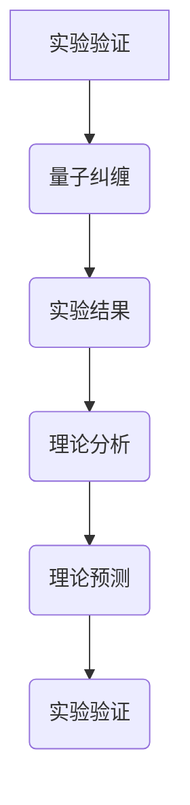

                 

### <文章标题>

> 关键词：宇宙、因果关系、量子纠缠、科学、哲学、本质

> 摘要：本文将深入探讨宇宙的本质问题，通过因果关系和量子纠缠这两个核心概念，从科学和哲学的双重视角，分析二者之间的关系和区别，探讨其对科学方法论、技术发展以及人类世界观的影响。通过本文的探讨，读者将更好地理解宇宙的本质，并对未来科学研究的方向有所启示。

---

### 引言：宇宙的本质探索

自古以来，人类对宇宙的探索从未停止。从古代的天文学到现代的宇宙学，人类对宇宙的认知不断深化。然而，宇宙的本质是什么？这是一个令人着迷且复杂的问题。为了回答这个问题，科学家们提出了许多理论，其中最为引人注目的是因果关系和量子纠缠。

**因果关系**是物理学中的基本概念，指的是一个事件导致另一个事件的发生。在经典物理学中，因果关系是自然界的基本规律，它解释了物理现象之间的相互作用。然而，在量子物理学中，因果关系似乎变得更加复杂和神秘。

**量子纠缠**是量子力学中的一个重要现象，指的是两个或多个粒子在量子态上的紧密关联。即使这些粒子相隔很远，它们的量子态也会以某种方式相互影响。量子纠缠挑战了经典物理学的因果关系观，引发了对宇宙本质的深刻思考。

本文将首先介绍因果关系和量子纠缠的基本概念，然后分析二者之间的关系和区别，探讨其对科学方法论、技术发展以及人类世界观的影响。通过本文的探讨，读者将更好地理解宇宙的本质，并对未来科学研究的方向有所启示。

### 第一步：因果关系的基本概念与作用

因果关系是物理学中一个基本而重要的概念，指的是一个事件（称为原因）导致另一个事件（称为结果）的发生。在经典物理学中，因果关系被视为自然界的基本规律，它解释了物理现象之间的相互作用。

**定义与数学模型**：

因果关系的定义相对直观：如果一个事件（A）的发生会导致另一个事件（B）的发生，那么A就是B的原因。用数学模型来表示，因果关系的表达可以简化为：

\[ B = f(A) \]

其中，\( f \) 是一个映射函数，表示从原因到结果的变化关系。这个模型在经典力学、电磁学等领域得到了广泛应用。

**哲学探讨**：

因果关系不仅是一个科学概念，也是一个哲学问题。哲学家们对因果关系的本质和存在性进行了深入的探讨。其中，一些主要的观点包括：

- **决定论**：决定论认为，世界上的一切都是因果关系的链条，每个事件都有其确定的原因。这种观点强调了因果关系的决定性作用。
- **概率论**：概率论则认为，因果关系并非绝对的，而是存在一定的不确定性。在一个事件的发生中，多个可能的原因会以不同的概率产生影响。

**科学中的应用**：

因果关系在科学中的应用广泛而深远。在物理学中，因果关系的概念被用来解释和预测物理现象。例如，牛顿的万有引力定律就描述了质量之间的因果关系，从而解释了行星运动的规律。

此外，因果关系还在生物学、经济学、心理学等领域得到了广泛应用。例如，在生物学中，因果关系被用来研究物种的进化；在经济学中，因果关系被用来分析市场的变化。

总之，因果关系是物理学中的一个核心概念，它在科学研究和实际应用中发挥着重要作用。通过理解和运用因果关系，科学家们能够更好地理解自然界的规律，从而推动科学技术的进步。

### 第二步：量子纠缠的基本概念与作用

量子纠缠是量子力学中的一个基本现象，描述了两个或多个粒子之间在量子态上的紧密关联。即使这些粒子相隔很远，它们的量子态也会以某种方式相互影响。量子纠缠不仅挑战了经典物理学的因果关系观，还为量子信息科学的发展提供了新的机遇。

**定义与物理现象**：

量子纠缠的基本定义可以通过一个简单的例子来说明。假设有两个粒子A和B，它们的量子态在某种方式上相互关联。即使粒子A和粒子B相隔很远，当对粒子A的量子态进行测量时，粒子B的量子态也会立即确定，这种现象被称为量子纠缠。

这种相互影响可以通过一个著名的实验——爱因斯坦-波多尔斯基-罗森悖论（EPR悖论）来说明。在这个实验中，两个粒子被发射到相距很远的地方，并对它们进行测量。实验结果显示，粒子的测量结果总是相互关联，这与经典物理学的预期相矛盾。

**数学模型**：

量子纠缠的数学模型通常通过波函数的联合表示来描述。假设两个粒子的波函数分别为 \( \Psi_A \) 和 \( \Psi_B \)，则它们的联合波函数可以表示为：

\[ \Psi_{AB} = \sum_{i,j} a_{ij} \psi_A(i) \otimes \psi_B(j) \]

其中，\( a_{ij} \) 是系数，\( \psi_A(i) \) 和 \( \psi_B(j) \) 分别是粒子A和粒子B的基态波函数。这个模型展示了粒子之间在量子态上的关联。

**在量子信息科学中的应用**：

量子纠缠在量子信息科学中具有重要作用，特别是在量子通信、量子计算和量子加密等领域。以下是一些具体的应用：

- **量子通信**：量子纠缠用于实现量子密钥分发（QKD），这是一种安全的通信方式。通过量子纠缠，可以在两个远程站点之间安全地交换密钥，从而确保通信的保密性。
- **量子计算**：量子纠缠是量子计算的核心机制之一。在量子计算机中，量子纠缠用于实现量子比特之间的相互作用，从而加速某些复杂问题的计算。
- **量子加密**：量子纠缠可用于实现量子密钥分发，这是量子加密的基础。通过量子纠缠，可以实现不可破译的加密算法，从而保护信息的保密性。

总之，量子纠缠是量子力学中的一个基本现象，它在量子信息科学中具有广泛应用。通过理解和利用量子纠缠，科学家们正在开启新的科学研究和技术应用的大门。

### 第三步：因果关系与量子纠缠的关系探讨

因果关系和量子纠缠是物理学中的两个核心概念，它们在科学研究中扮演着重要角色。然而，这两个概念之间的关系并不简单，它们在某些方面是互补的，而在另一些方面则存在冲突。本文将从多个角度探讨因果关系与量子纠缠之间的关系。

**因果关系的局限**：

在经典物理学中，因果关系被视为自然界的基本规律。然而，在量子物理学中，因果关系似乎变得更加复杂和神秘。量子纠缠的出现挑战了经典物理学的因果关系观。例如，在量子纠缠中，两个粒子之间的相互作用似乎超越了我们传统的因果关系范畴。即使两个粒子相隔很远，它们的量子态也会以某种方式相互影响，这种现象无法用因果关系来完全解释。

**量子纠缠的特性**：

量子纠缠具有一些独特的特性，这些特性与因果关系有所不同。首先，量子纠缠是一种非局域现象。这意味着，即使两个粒子相隔很远，它们之间的相互作用也是即时的。这与经典物理学的局域性概念相矛盾。其次，量子纠缠是一种不可分割的现象。这意味着，两个纠缠粒子不能独立存在，它们的量子态是相互关联的。这种不可分割性也挑战了因果关系中的可分性概念。

**因果关系的量子化**：

为了解释量子纠缠中的因果关系，科学家们提出了量子因果关系理论。这个理论认为，因果关系在量子尺度上具有不同的表现形式。例如，量子纠缠中的因果关系可能是一种概率性的关系，而不是确定性关系。这种概率性的因果关系可以通过量子态的叠加和纠缠来解释。

**量子力学与经典物理学的融合**：

在量子物理学中，因果关系与量子纠缠的关系并不是简单的替代关系，而是互补关系。经典物理学中的因果关系在宏观尺度上仍然适用，而量子纠缠在微观尺度上提供了新的视角。科学家们正在探索如何将这两者结合起来，形成一种更加全面的理论框架。这种框架可能包括量子因果关系理论、量子引力理论等。

**实验验证**：

为了验证因果关系与量子纠缠之间的关系，科学家们进行了大量的实验。例如，爱因斯坦-波多尔斯基-罗森悖论实验就是用来验证量子纠缠是否存在。实验结果显示，量子纠缠确实存在，这进一步挑战了经典物理学的因果关系观。此外，还有许多其他实验，如量子密钥分发实验，验证了量子纠缠在量子通信中的应用价值。

总之，因果关系与量子纠缠是物理学中的两个核心概念，它们之间的关系复杂而有趣。通过量子纠缠，科学家们正在重新思考因果关系在量子尺度上的本质。这种思考不仅推动了物理学的发展，也对我们理解宇宙的本质有着重要的启示。

### 第四步：因果关系与量子纠缠的异同比较

因果关系和量子纠缠是物理学中两个重要且复杂的概念。它们在某些方面具有相似性，但在其他方面则存在显著差异。本文将详细比较这两个概念，探讨它们之间的异同。

**相同点**：

1. **现象描述**：因果关系和量子纠缠都描述了物理现象之间的相互作用。因果关系在经典物理学中解释了事件之间的相互影响，而量子纠缠在量子物理学中描述了粒子之间的紧密关联。
2. **数学模型**：在数学模型上，因果关系和量子纠缠都有其独特的表达方式。因果关系通常通过映射函数来表示，如 \( B = f(A) \)。量子纠缠则通过波函数的联合表示来描述，如 \( \Psi_{AB} = \sum_{i,j} a_{ij} \psi_A(i) \otimes \psi_B(j) \)。
3. **科学应用**：因果关系和量子纠缠都在科学研究中具有广泛应用。因果关系在经典物理学、生物学、经济学等领域发挥了重要作用，而量子纠缠则在量子信息科学、量子计算和量子加密中展示了其独特价值。

**不同点**：

1. **尺度的差异**：因果关系在宏观尺度上描述事件之间的相互作用，而量子纠缠在微观尺度上描述粒子之间的关联。这意味着因果关系适用于日常生活中可观察的现象，而量子纠缠则涉及到基本粒子的行为。
2. **局域性与非局域性**：因果关系具有局域性，即事件之间的相互作用是局部发生的。而量子纠缠具有非局域性，即即使粒子相隔很远，它们的相互作用也是即时的。这种非局域性挑战了经典物理学的局域性假设。
3. **确定性性与概率性**：因果关系在经典物理学中通常被视为确定性关系，即一个事件的发生是另一个事件的必然结果。而量子纠缠中的因果关系则具有概率性，即两个粒子之间的关联是以某种概率发生的。这种概率性在量子密钥分发和量子计算等应用中具有重要意义。

**影响与启示**：

通过比较因果关系和量子纠缠的异同，我们可以得到以下启示：

1. **对科学方法论的影响**：量子纠缠的出现挑战了经典物理学的因果关系观，这促使科学家们重新思考科学方法论。特别是在量子物理学中，概率性和非局域性使得传统的方法不再适用，需要新的理论框架和方法。
2. **对技术发展的推动**：因果关系和量子纠缠的研究推动了技术发展的新方向。例如，量子纠缠在量子通信和量子计算中的应用为信息安全和技术创新提供了新的可能性。
3. **对人类世界观的影响**：对因果关系与量子纠缠的理解改变了我们对宇宙和世界的认知。量子纠缠揭示了微观世界的神秘现象，使得我们对自然界的理解更加深入和全面。

总之，因果关系与量子纠缠是物理学中的两个重要概念，它们在现象描述、数学模型、尺度差异、局域性与非局域性、确定性性与概率性等方面具有异同。通过深入比较和分析，我们不仅能够更好地理解物理学的基本原理，还能对科学方法论、技术发展和人类世界观产生深远的影响。

### 第五步：交叉验证：科学实验与理论分析

为了深入探讨因果关系与量子纠缠之间的关系，科学家们进行了大量的实验和理论分析。这些研究不仅验证了量子纠缠的存在，还揭示了因果关系在量子尺度上的复杂性质。以下是一些关键的科学实验和理论分析：

**量子纠缠实验**：

1. **贝尔不等式实验**：贝尔不等式是量子纠缠的一个重要理论预言，它挑战了经典物理学的因果关系观。科学家们通过实验验证了贝尔不等式的失效，从而证明了量子纠缠的存在。典型的实验包括阿贝尔实验和格林-哈罗德实验，它们通过测量纠缠粒子的相关性，验证了量子纠缠的非局域性。

2. **量子密钥分发实验**：量子密钥分发（QKD）实验是另一个验证量子纠缠的重要实验。通过量子纠缠，可以实现安全的通信，即即使信息在传输过程中被窃取，接收者也能检测到。实验证明，量子纠缠在量子通信中具有巨大的应用潜力。

**理论分析**：

1. **量子因果关系理论**：为了解释量子纠缠中的因果关系，科学家们提出了量子因果关系理论。这个理论认为，因果关系在量子尺度上具有不同的表现形式，可能是一种概率性的关系。通过数学模型和计算，科学家们分析了量子纠缠中的因果关系，揭示了其概率性和非局域性的本质。

2. **量子引力理论**：量子纠缠与引力理论之间的关系也是科学家们研究的重要方向。量子引力理论试图将量子力学与广义相对论结合起来，以解释宇宙的本质。在这个框架下，因果关系与量子纠缠的关系被重新定义，为宇宙的本质问题提供了新的视角。

**实验与理论的对比**：

实验和理论分析相互补充，共同揭示了因果关系与量子纠缠之间的复杂关系。实验验证了量子纠缠的存在和特性，而理论分析则提供了对这些实验结果的解释和预测。以下是一个简化的Mermaid流程图，展示了因果关系与量子纠缠之间的交叉验证过程：

**结论**：

通过交叉验证，科学实验与理论分析共同揭示了因果关系与量子纠缠之间的紧密联系。这种交叉验证不仅验证了量子纠缠的存在，还深化了对因果关系在量子尺度上的理解。这些研究为我们提供了新的视角，以重新思考宇宙的本质问题。未来，随着科学技术的进一步发展，我们有望对因果关系与量子纠缠之间的关系有更深入的认识。

### 第六步：科学与哲学的视角

因果关系和量子纠缠不仅具有深远的科学意义，也引起了哲学家的广泛关注。在科学和哲学的双重视角下，我们可以更全面地理解宇宙的本质，并探讨这两种视角之间的对话与融合。

**科学视角下的因果关系与量子纠缠**：

在科学领域，因果关系被视为自然界的基本规律，它解释了物理现象之间的相互作用。经典物理学中的因果关系强调事件之间的因果链条，这种观念在牛顿力学、电磁学等领域得到了广泛应用。然而，量子物理学的出现挑战了这种因果关系观。量子纠缠的出现揭示了粒子之间即时的非局域性相互作用，这显然与经典因果关系相悖。

量子纠缠的发现引发了科学家们对因果关系本质的重新思考。一些科学家提出了量子因果关系理论，试图将量子纠缠纳入因果关系的框架。这种理论认为，因果关系在量子尺度上具有概率性和非局域性，不同于经典物理学中的确定性关系。

**哲学视角下的因果关系与量子纠缠**：

在哲学领域，因果关系一直是哲学家们探讨的重要主题。因果关系不仅涉及科学，还关乎人类生活和道德判断。哲学家们对因果关系的本质和存在性进行了深入的探讨，形成了不同的观点。例如，决定论者认为，世界上的一切都是因果关系的链条，每个事件都有其确定的原因。而概率论者则认为，因果关系并非绝对的，而是存在一定的不确定性。

量子纠缠的出现对哲学家的观念产生了深远影响。一些哲学家认为，量子纠缠挑战了决定论和因果律，提出了关于宇宙本质的新问题。例如，托马斯·纳格尔提出了“量子非决定论”，认为量子纠缠表明宇宙的基本规律并非基于因果关系。

**两种视角的对话与融合**：

科学与哲学的视角在因果关系和量子纠缠的问题上存在对话和融合的潜力。科学为哲学提供了新的数据和理论，而哲学为科学提供了深刻的思考和哲学基础。

1. **科学解释与哲学反思**：科学实验和理论分析为因果关系和量子纠缠提供了实证基础。而哲学反思则对这些科学发现进行了深入思考和批判，帮助我们理解这些现象的哲学意义。例如，量子纠缠揭示了微观世界的非局域性，这对我们的世界观和哲学观念提出了新的挑战。

2. **跨学科研究**：科学家和哲学家可以开展跨学科研究，共同探讨因果关系和量子纠缠的本质。这种跨学科研究不仅有助于深化我们对这些问题的理解，还能推动科学和哲学的融合，形成更加全面的理论框架。

3. **共同目标**：尽管科学和哲学在方法上存在差异，但它们在探讨宇宙本质的目标上是相同的。通过科学实验和哲学反思，我们可以更全面地理解宇宙的本质，从而为人类提供更深刻的智慧和指导。

总之，因果关系和量子纠缠在科学与哲学的双重视角下具有丰富的内涵和重要的意义。通过科学实验和哲学反思，我们可以更深入地理解宇宙的本质，并探讨科学和哲学之间的对话与融合。这种跨学科的研究不仅有助于推动科学和哲学的发展，还能为我们提供对宇宙更深刻的洞察和认识。

### 第七步：宇宙观的影响与启示

因果关系和量子纠缠作为物理学中的核心概念，不仅改变了我们对自然界的理解，也深刻影响了我们的世界观和技术发展。

**对人类世界观的影响**：

因果关系作为传统物理学的基础，塑造了我们对自然规律和宇宙秩序的认知。它强调了事件之间的因果链条，使得我们对世界有了有序和可预测的感知。然而，量子纠缠的出现打破了这种因果链条的确定性，揭示了微观世界的非局域性和概率性。这挑战了我们对现实的基本认知，迫使我们重新思考宇宙的本质和时间的概念。

量子纠缠的发现还引发了关于决定论和自由意志的哲学讨论。如果因果关系在量子尺度上具有概率性，那么世界是否仍然遵循决定论的规律？或者，量子纠缠是否暗示了某种形式的自由意志？这些问题不仅对哲学有重要影响，也对我们日常生活和道德观念产生了深远的影响。

**对科学方法论的影响**：

量子纠缠的出现促使科学家们重新审视科学方法论。传统的因果关系观强调实验设计和因果关系验证，但在量子尺度上，这种方法不再适用。量子纠缠和量子力学的研究推动了新的实验设计和数据分析方法的发展。例如，量子密钥分发和量子计算实验要求精确控制量子态和测量过程，这对实验技术的精确度和可靠性提出了更高的要求。

此外，量子纠缠也改变了科学研究的范式。在量子尺度上，现象往往不是单一的因果关系，而是多种量子态和相互作用的结果。这要求科学家们从更宏观和综合的角度来看待问题，探索新的理论框架和计算方法。

**对技术发展的推动**：

量子纠缠为技术发展提供了新的机遇。量子通信和量子计算是两个突出的例子。量子通信利用量子纠缠实现了安全的通信方式，通过量子密钥分发，可以确保信息的保密性。量子计算则通过量子态的叠加和纠缠，实现了传统计算机无法达到的计算速度和效率。

此外，量子纠缠还在其他技术领域展示了其潜力。例如，量子传感利用量子纠缠的高灵敏度，可以用于测量极其微小的物理量，这为精密测量和医疗诊断等领域提供了新的工具。

**启示与展望**：

通过对因果关系和量子纠缠的研究，我们不仅深化了对宇宙本质的理解，也为未来的科学研究和技术发展提供了新的方向。以下是一些启示和展望：

1. **探索宇宙本质**：量子纠缠提供了新的视角，帮助我们探索宇宙的本质。未来的研究可能揭示更多关于宇宙基本规律的奥秘，为宇宙学的发展提供新的理论框架。
2. **技术创新**：量子纠缠和量子信息科学的发展推动了技术的创新。未来，我们可以期待更多基于量子纠缠的技术的应用，从量子通信到量子计算，再到量子传感，这些技术将深刻改变我们的生活方式和工业生产方式。
3. **跨学科研究**：科学和哲学的融合将有助于更全面地理解因果关系和量子纠缠。通过跨学科研究，我们可以探索新的理论框架，解决现有理论的局限，推动科学和哲学的共同进步。

总之，因果关系和量子纠缠不仅改变了我们对宇宙和自然界的理解，也为我们提供了新的研究和技术发展的方向。未来，随着科学技术的不断进步，我们有望对宇宙的本质有更深刻的认识，并为人类社会的进步做出更大的贡献。

### 第八步：总结与展望

通过对因果关系和量子纠缠的深入探讨，我们不仅重新思考了宇宙的本质，也揭示了科学和哲学在探讨这些概念时的相互作用。因果关系作为传统物理学的基础，其经典概念在量子尺度上遇到了挑战，而量子纠缠的出现则揭示了微观世界的非局域性和概率性。这种新的理解不仅深化了我们对自然界的认识，也为科学方法论和技术发展带来了新的机遇。

**研究进展**：

在过去几十年里，科学家们在量子纠缠领域取得了显著进展。贝尔不等式实验验证了量子纠缠的存在，量子密钥分发技术实现了安全通信，量子计算研究推动了计算能力的提升。这些进展不仅验证了量子纠缠的理论，也为实际应用奠定了基础。

**未来研究方向**：

未来，我们可能从以下几个方面深入探讨因果关系与量子纠缠的关系：

1. **量子因果关系理论**：进一步发展量子因果关系理论，探索因果关系在量子尺度上的本质和表现形式。
2. **量子引力理论**：结合量子力学和广义相对论，研究量子纠缠与引力之间的关系，以揭示宇宙的更基本规律。
3. **跨学科研究**：加强科学和哲学的交叉研究，探讨因果关系和量子纠缠对人类世界观和道德观念的影响。

**展望**：

随着科学技术的不断进步，我们有望在以下几个方面取得突破：

1. **量子计算**：实现更高效的量子计算，解决传统计算机无法处理的复杂问题。
2. **量子通信**：发展更安全的量子通信技术，确保信息的绝对保密。
3. **宇宙探索**：通过量子纠缠，探索宇宙的更多奥秘，揭示宇宙的本质。

总之，因果关系与量子纠缠的研究不仅推动了物理学的发展，也为我们理解宇宙提供了新的视角。未来，随着科学技术的进一步进步，我们有望在更深的层次上揭示宇宙的本质，为人类社会的进步做出更大的贡献。

