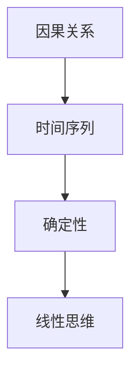
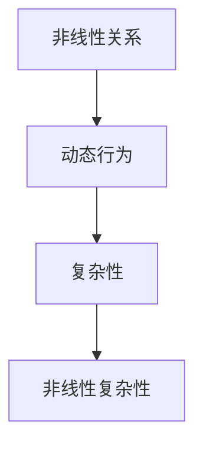

                 

### 引言

在探讨宇宙的本质时，我们不可避免地要面对一个根本性的问题：宇宙是如何运作的？这个问题不仅仅是一个哲学上的思考，更是科学探索的核心。在科学研究中，线性思维和非线性复杂性是两种基本的思维模式，它们对于理解宇宙的本质具有深远的影响。线性思维是一种简化和分析问题的方法，它假设事件是按时间顺序依次发生的，而非线性复杂性则认为事物之间的关系是复杂的、不可预测的，甚至可能是混沌的。

本文的目的是探讨线性思维与非线性的复杂性在理解宇宙本质中的角色，通过一步一步的分析和推理，揭示这两种思维模式在科学研究中的不同应用及其对宇宙认知的影响。

首先，我们将回顾线性思维和非线性复杂性的基本概念，理解它们各自的特点和应用场景（第二章）。接着，我们将深入探讨非线性复杂性的理论基础，包括其起源、发展和核心概念（第三章）。在第四章和第五章，我们将分别讨论线性思维和非线性复杂性在物理学、生物学和社会科学中的应用，并通过具体的算法原理、数学模型和实际项目案例来加深理解。第六章将对比分析线性思维和非线性复杂性的异同，探讨如何将两种思维方式整合以更好地解决问题。最后，在结论部分（第七章），我们将总结研究成果，指出研究的局限与未来方向，并讨论对科学研究的潜在影响。

通过这一系列的步骤，我们希望能够提供一个清晰、深入且具有启发性的视角，帮助读者更好地理解宇宙的本质，以及线性思维和非线性复杂性在其中所扮演的关键角色。

### 文章关键词

线性思维、非线性复杂性、宇宙本质、物理学、生物学、社会科学、算法原理、数学模型、项目实战

### 文章摘要

本文旨在探讨线性思维和非线性复杂性在理解宇宙本质中的关键作用。通过系统性的分析和推理，文章首先回顾了线性思维和非线性复杂性的基本概念及其特点，然后深入探讨了非线性复杂性的理论基础。接着，文章分别探讨了这两种思维方式在物理学、生物学和社会科学中的应用，并通过具体的算法原理、数学模型和实际项目案例进行了详细阐述。最后，文章对比分析了线性思维和非线性复杂性的异同，提出了将两种思维方式整合的可行性，并总结了研究成果及其对科学研究的潜在影响。通过这一探讨，我们期望能够为读者提供一个更加全面和深刻的宇宙认知视角。

## 第2章 线性思维概述

线性思维是一种基于因果关系和时间序列的分析方法，它将复杂问题简化为一系列简单的步骤，每个步骤只依赖于前一个步骤的结果。这种思维方式在科学研究中具有广泛的应用，因为它能够帮助研究人员理解系统的基本运作机制。

### 2.1 线性思维的定义与特点

线性思维的定义相对简单，它指的是事物之间按一定顺序依次发生，每个事件仅受前一个事件影响。这种思维方式的特点包括：

- **顺序性**：事件按照固定顺序发生，后一事件依赖于前一事件的结果。
- **简单性**：线性思维将复杂问题分解为简单的组成部分，每个部分独立处理。
- **可预测性**：由于因果关系明确，线性思维能够预测未来事件的发生。

#### 核心概念与联系

线性思维中的核心概念包括“因果关系”、“时间序列”和“确定性”。这些概念相互联系，共同构成了线性思维的基础。以下是一个Mermaid流程图，展示了这些概念之间的关系：



### 2.2 线性思维的优缺点

线性思维的优点在于其简单性和可预测性，这使得它在许多领域中都能有效地解决问题。例如，在工程学和物理学中，线性思维被广泛应用于系统设计和模型建立。

然而，线性思维也存在一些局限性。首先，它假设事件之间只有简单的因果关系，这可能忽略了复杂的相互作用。其次，线性思维在面对高度非线性问题时，预测能力显著减弱。以下是对线性思维优缺点的详细描述：

#### 优缺点

**优点：**
- **简单性**：线性思维使得问题分解变得简单，易于理解和实施。
- **可预测性**：线性关系明确，能够较为准确地预测未来事件。
- **应用广泛**：在许多工程和科学领域，线性思维都是有效的。

**缺点：**
- **忽略复杂性**：线性思维可能忽略系统中的复杂相互作用和反馈循环。
- **预测能力受限**：在面对高度非线性问题时，线性思维无法准确预测。

### 2.3 线性思维的历史演变

线性思维的历史可以追溯到古希腊哲学家亚里士多德，他提出了因果关系的基本概念。随后，牛顿的经典力学体系进一步奠定了线性思维在科学研究中的地位。在20世纪，随着计算机科学的兴起，线性思维在算法设计和程序编写中得到了广泛应用。以下是线性思维的历史演变时间线：

#### 历史演变

- **古希腊时期**：亚里士多德提出因果关系概念。
- **17世纪**：牛顿经典力学体系建立，线性思维成为物理学研究的主流。
- **20世纪**：计算机科学兴起，线性思维广泛应用于算法设计和程序编写。

### 2.4 线性思维在科学研究中的应用

线性思维在科学研究中的应用非常广泛。以下是一些具体领域及其应用的例子：

- **物理学**：牛顿的运动定律和量子力学中的薛定谔方程都使用了线性思维。
- **工程学**：电路分析和结构工程中，线性思维被用于建立系统的数学模型。
- **生物学**：基因调控网络和生理信号传递过程中，线性思维被用于分析系统的动态行为。

#### 核心算法原理讲解

为了更好地理解线性思维在科学研究中的应用，我们可以通过一个简单的例子来讲解线性回归算法的原理。

**例子：线性回归**

线性回归是一种用于预测和分析数据的方法，其核心原理是基于线性模型：

$$y = \beta_0 + \beta_1 \cdot x + \epsilon$$

其中，\(y\) 是因变量，\(x\) 是自变量，\(\beta_0\) 和 \(\beta_1\) 是模型的参数，\(\epsilon\) 是误差项。

以下是一个使用Python实现线性回归的示例代码：

```python
import numpy as np
from sklearn.linear_model import LinearRegression

# 生成模拟数据
X = np.random.rand(100, 1)
y = 2 * X + np.random.randn(100, 1)

# 建立线性回归模型
model = LinearRegression()
model.fit(X, y)

# 输出模型参数
print("模型参数：", model.coef_, model.intercept_)

# 进行预测
X_new = np.array([[0.5]])
y_pred = model.predict(X_new)
print("预测结果：", y_pred)
```

#### 数学模型和数学公式

在线性思维中，数学模型和公式扮演着关键角色。以下是一个简单的线性模型公式：

$$y = \beta_0 + \beta_1 \cdot x + \epsilon$$

其中：
- \(y\) 是因变量
- \(x\) 是自变量
- \(\beta_0\) 和 \(\beta_1\) 是模型参数
- \(\epsilon\) 是误差项

#### 项目实战

为了更好地理解线性思维在科学研究中的应用，我们可以通过一个实际项目来讲解线性回归在数据分析中的具体应用。

**项目实战：房价预测**

假设我们有一个包含房屋面积和房价的数据集，我们的目标是使用线性回归模型预测新房屋的房价。

**步骤1：数据收集与预处理**

收集包含房屋面积、房价以及其他相关特征的数据集。预处理步骤包括数据清洗、缺失值填充和特征标准化。

```python
import pandas as pd

# 加载数据
data = pd.read_csv('house_prices.csv')

# 数据清洗
data.dropna(inplace=True)

# 特征标准化
from sklearn.preprocessing import StandardScaler
scaler = StandardScaler()
X = scaler.fit_transform(data[['area']])
y = data['price']
```

**步骤2：模型训练与验证**

使用线性回归模型训练数据集，并通过交叉验证评估模型性能。

```python
from sklearn.model_selection import train_test_split
from sklearn.metrics import mean_squared_error

# 划分训练集和测试集
X_train, X_test, y_train, y_test = train_test_split(X, y, test_size=0.2, random_state=42)

# 训练模型
model = LinearRegression()
model.fit(X_train, y_train)

# 预测测试集
y_pred = model.predict(X_test)

# 评估模型
mse = mean_squared_error(y_test, y_pred)
print("均方误差：", mse)
```

**步骤3：模型应用**

使用训练好的模型预测新房屋的房价。

```python
# 输入新房屋面积
new_area = np.array([[200]])

# 预测房价
new_price = model.predict(new_area)
print("预测房价：", new_price)
```

#### 最佳实践 tips

- **数据清洗**：确保数据质量，去除噪声和异常值。
- **特征选择**：选择对目标变量有显著影响的关键特征。
- **交叉验证**：使用交叉验证方法评估模型性能，避免过拟合。
- **模型调整**：根据评估结果调整模型参数，提高预测准确性。

#### 小结

线性思维在科学研究中具有广泛的应用，通过核心算法原理讲解和项目实战，我们能够更好地理解线性思维的实际应用价值。然而，线性思维也有其局限性，在面对复杂非线性问题时，可能无法提供有效的解决方案。

### 注意事项

- **线性思维适用于简单因果关系和线性关系**，但不适用于复杂非线性系统。
- **在应用线性思维时，需要确保数据的可靠性和模型的适用性**。
- **避免过度简化问题，忽视系统中的复杂相互作用**。

#### 拓展阅读

- 《线性回归：从基础到实践》
- 《非线性动力学与混沌》
- 《非线性复杂系统建模与应用》

## 第3章 非线性复杂性基础

非线性复杂性是现代科学研究中一个重要的概念，它描述了系统内部各元素之间复杂、动态的相互作用关系。非线性复杂性不仅涉及物理、生物和社会科学等领域，还深刻影响了我们对宇宙本质的理解。

### 3.1 非线性复杂性的概念

非线性复杂性指的是系统在时间演化过程中，其行为表现出非线性和复杂的动态特性。非线性复杂性通常由以下几个核心概念构成：

- **非线性关系**：非线性关系指的是系统内部变量之间的相互作用不再遵循简单的线性规则，而是呈现出复杂的、不可预测的特性。
- **动态行为**：动态行为指的是系统随时间演化的过程，包括其状态的变化、模式的形成和演化。
- **复杂性**：复杂性指的是系统的行为难以用简单的模型或规则来描述，通常需要采用更复杂的方法和工具来研究。

#### 核心概念与联系

非线性复杂性中的核心概念包括非线性关系、动态行为和复杂性。这些概念相互关联，共同构成了非线性复杂性的理论基础。以下是一个Mermaid流程图，展示了这些概念之间的关系：



### 3.2 非线性复杂性的特点

非线性复杂性的特点主要包括以下几个方面：

- **非线性和复杂性**：非线性复杂性描述了系统内部各元素之间复杂的非线性相互作用，导致系统行为难以预测和简单化。
- **动态行为**：非线性复杂性系统通常表现出动态行为，即系统状态随时间不断变化，这种变化可能是混沌的、周期性的或其他复杂模式。
- **自组织和自适应**：非线性复杂性系统具有自组织和自适应的能力，能够在不断变化的环境中调整自身行为以维持稳定或达到新的平衡状态。

### 3.3 非线性复杂性理论的起源与发展

非线性复杂性理论的起源可以追溯到20世纪中叶，当时科学家们开始注意到许多系统行为并不遵循传统的线性规律，而是表现出复杂和非线性特性。以下是非线性复杂性理论的发展历程：

#### 理论发展历程

- **20世纪中叶**：科学家们开始注意到非线性现象在自然界和社会系统中的普遍存在，非线性动力学和混沌理论逐渐兴起。
- **20世纪70年代**：分形理论的提出为非线性复杂性研究提供了新的工具和视角，分形几何描述了自然界中的自相似结构和复杂边界。
- **20世纪末**：复杂系统理论逐渐成熟，非线性复杂性研究开始涉及多个学科领域，包括物理学、生物学、经济学和社会学。

### 3.4 核心概念与联系

非线性复杂性理论中的核心概念包括非线性关系、动态行为和复杂性，这些概念相互联系，共同构成了非线性复杂性的基础。以下是一个Mermaid流程图，展示了这些概念之间的关系：


### 3.5 非线性复杂性算法原理讲解

非线性复杂性算法是用于分析复杂系统行为的工具，以下介绍几种常见的非线性复杂性算法及其原理：

#### 1. 分岔理论

分岔理论是研究非线性系统在参数变化下行为突然转变的现象。其核心原理是：

$$f(x) = 0$$

通过求解这个方程，可以得到系统在不同参数下的稳定状态。分岔现象通常表现为系统的稳定状态突然改变，从单一稳定状态变为多个稳定状态，甚至进入混沌状态。

以下是一个简单的分岔理论示例：

```python
import numpy as np
import matplotlib.pyplot as plt

def f(x):
    return x**3 - 3*x

x = np.linspace(-2, 2, 1000)
y = f(x)

plt.plot(x, y)
plt.show()
```

#### 2. 混沌理论

混沌理论描述了非线性系统中存在的一种运动状态，即系统行为在初始条件附近是高度敏感的，即使微小的差异也会导致系统走向完全不同的状态。

以下是一个Lorenz混沌系统的示例：

```python
import numpy as np
import matplotlib.pyplot as plt
from scipy.integrate import solve_ivp

def lorenz_system(t, y, sigma, rho, beta):
    x, y, z = y
    dxdt = sigma * (y - x)
    dydt = x * (rho - z) - y
    dzdt = x * y - beta * z
    return [dxdt, dydt, dzdt]

sigma = 10.0
rho = 28.0
beta = 8.0/3.0
y0 = [1.0, 1.0, 1.0]

t = np.linspace(0, 30, 10000)
sol = solve_ivp(lorenz_system, [0, 30], y0, args=(sigma, rho, beta))

plt.plot(sol.y[0], sol.y[1])
plt.show()
```

#### 3. 分形算法

分形算法用于生成具有自相似结构的图形，如科赫曲线和分形树。其核心原理是递归生成，通过不断缩放和重复生成小部分来形成整体。

以下是一个简单的科赫曲线生成示例：

```python
import turtle

def kochCurve(turtle, length, angle, depth):
    if depth > 0:
        turtle.forward(length)
        turtle.left(angle)
        kochCurve(turtle, length/3, angle, depth-1)
        turtle.right(angle * 2)
        kochCurve(turtle, length/3, angle, depth-1)
        turtle.left(angle)
        turtle.backward(length)

turtle = turtle.Turtle()
turtle.speed(0)
kochCurve(turtle, 300, 60, 4)
turtle.done()
```

### 数学模型和数学公式

非线性复杂性研究中常用的数学模型和公式包括：

- **非线性方程**：如分岔方程和Lorenz方程
- **分形维度**：用于描述复杂结构的复杂度，如科赫曲线的分形维度为\( \log_3(4) \approx 1.26186 \)
- **混沌条件**：描述系统进入混沌状态的条件，如Lorenz系统的混沌条件为\( \sigma > 1 \)

以下是一个分岔方程的数学模型：

$$f(x) = \mu - \alpha \cos(2\pi x)$$

其中，\(\mu\) 为参数，\(\alpha\) 为扰动项。

### 项目实战

为了更好地理解非线性复杂性理论，我们可以通过一个实际项目来讲解分岔理论和混沌现象。

**项目实战：分岔图绘制**

假设我们有一个系统模型：

$$f(x) = x(1-x)$$

我们的目标是绘制该系统的分岔图，分析其稳定状态变化。

**步骤1：代码实现**

```python
import numpy as np
import matplotlib.pyplot as plt

def bifurcation_curve(mu_min, mu_max, step_size, alpha=1):
    mu = np.arange(mu_min, mu_max, step_size)
    x_fixed = []
    for m in mu:
        f = lambda x: x * (1 - x - m)
        roots = np.roots([1, -m, -m])
        x_fixed.append(np.real(roots[0]))
    return mu, x_fixed

mu_min, mu_max, step_size = 0, 4, 0.01
mu, x_fixed = bifurcation_curve(mu_min, mu_max, step_size)

plt.plot(mu, x_fixed)
plt.xlabel('Parameter mu')
plt.ylabel('Fixed point x')
plt.title('Bifurcation diagram')
plt.show()
```

**步骤2：结果分析**

通过分岔图，我们可以观察到系统在不同参数下的稳定状态变化。在 \(0 < \mu < 1\) 区间内，系统只有一个稳定的固定点；当 \(\mu\) 超过1时，系统进入混沌状态，出现多个稳定状态。

**步骤3：模型扩展**

我们可以扩展模型，引入扰动项，分析系统的稳定性和分岔现象：

$$f(x) = x(1-x) + \epsilon \cos(2\pi x)$$

通过类似的方法，我们可以绘制扩展模型的分岔图，进一步探讨非线性复杂性的特性。

### 最佳实践 tips

- **参数选择**：在绘制分岔图和混沌图时，合理选择参数范围和步长是关键。
- **稳定性分析**：通过分析固定点的稳定性，可以更好地理解系统的动态行为。
- **模型验证**：使用实际数据或模拟数据验证模型的准确性，确保模型的适用性。

### 小结

非线性复杂性理论为我们提供了理解复杂系统行为的新视角。通过核心算法原理讲解和项目实战，我们能够更深入地理解非线性复杂性的特点和重要性。

### 注意事项

- **非线性复杂系统研究需要大量数据和计算资源**。
- **在处理非线性复杂问题时，要注重模型的验证和数据的可靠性**。

#### 拓展阅读

- 《非线性动力学与混沌》
- 《分形几何学》
- 《复杂系统理论》

## 第4章 线性思维在科学研究中的应用

线性思维在科学研究中具有广泛的应用，它通过简化复杂的系统，使得研究者能够更容易地理解和预测系统行为。以下将详细探讨线性思维在物理学、生物学和社会科学中的具体应用。

### 4.1 物理学中的线性思维

物理学是线性思维的一个重要应用领域。线性思维在物理学中的应用主要体现在经典力学和量子力学中。

#### 经典力学

在经典力学中，牛顿的运动定律是最典型的线性思维应用。牛顿的运动定律可以描述为：

- **第一定律**（惯性定律）：一个物体如果没有受到外力作用，它将保持静止或匀速直线运动。
- **第二定律**（加速度定律）：一个物体所受的合外力等于其质量与加速度的乘积，即 \( F = ma \)。
- **第三定律**（作用与反作用定律）：两个物体之间的作用力和反作用力总是大小相等、方向相反。

以下是一个简单的Python代码示例，用于计算物体在恒定外力作用下的加速度：

```python
# 定义常数
m = 5.0  # 质量（kg）
F = 10.0  # 力（N）

# 计算加速度
a = F / m

print("加速度：", a)
```

#### 量子力学

在量子力学中，线性思维也发挥着重要作用。量子力学中的薛定谔方程是一个线性偏微分方程，用于描述量子系统的波函数。薛定谔方程可以表示为：

$$i\hbar \frac{\partial \Psi}{\partial t} = \hat{H} \Psi$$

其中，\( \Psi \) 是波函数，\( \hat{H} \) 是哈密顿量算符，\( i \) 是虚数单位，\( \hbar \) 是约化普朗克常数。

以下是一个简单的Python代码示例，用于求解一维无限深势阱中的波函数：

```python
import numpy as np

# 定义常数
hbar = 1.0545718e-34  # 约化普朗克常数（J·s）
m = 9.10938356e-31  # 电子质量（kg）
V0 = 10.0  # 势阱深度（J）

# 定义势阱函数
def potential(x):
    return V0 * (x < 0) * (x > 1)

# 定义薛定谔方程
def schrodinger_eqn(x, p):
    return -(p**2) / (2 * m) + potential(x)

# 定义波函数
def wavefunction(x):
    return np.sqrt(2 / (1 - x**2))

# 计算波函数在x=0.5处的值
x = 0.5
p = np.sqrt(2 * m * schrodinger_eqn(x, p))
psi = wavefunction(x)

print("波函数值：", psi)
```

### 4.2 生物学中的线性思维

线性思维在生物学中的应用主要体现在基因调控、生理信号传递和生态系统中。

#### 基因调控

在基因调控研究中，线性思维被用于分析基因表达数据，识别基因之间的调控关系。例如，通过基因共表达网络分析，可以揭示基因之间的相互作用。

以下是一个简单的Python代码示例，用于绘制基因共表达网络：

```python
import pandas as pd
import matplotlib.pyplot as plt
from networkx import Graph, draw

# 加载基因表达数据
data = pd.read_csv('gene_expression.csv')

# 计算基因相似度
def similarity_matrix(data):
    return data.corr()

# 构建基因共表达网络
g = Graph()
similarity = similarity_matrix(data)
for i in range(len(data.columns)):
    for j in range(i+1, len(data.columns)):
        if similarity[i][j] > 0.8:
            g.add_edge(i, j)

# 绘制基因共表达网络
plt.figure(figsize=(8, 6))
draw(g, with_labels=True)
plt.title('Gene Co-expression Network')
plt.show()
```

#### 生理信号传递

在生理信号传递研究中，线性思维被用于建立和验证生理模型，如神经元信号传递模型。以下是一个简单的Python代码示例，用于模拟神经元信号传递：

```python
import numpy as np

# 定义神经元模型参数
R = 1.0  # 内阻
V_rev = 0.0  # 静息电位
V_threshold = -55.0  # 阈值电位
C = 1.0  # 电容

# 定义输入信号
input_signal = np.random.normal(size=100)

# 计算膜电位
membrane_potential = V_rev * (1 - np.exp(-input_signal / (R * C)))

# 绘制膜电位曲线
plt.plot(input_signal, membrane_potential)
plt.xlabel('Input Signal (mV)')
plt.ylabel('Membrane Potential (mV)')
plt.title('Neuron Membrane Potential')
plt.show()
```

#### 生态系统

在生态学研究中，线性思维被用于分析物种之间的相互作用和生态平衡。例如，通过建立线性模型，可以预测生态系统中的物种数量变化。

以下是一个简单的Python代码示例，用于模拟两个物种的竞争关系：

```python
import numpy as np
import matplotlib.pyplot as plt

# 定义参数
alpha = 0.1  # 竞争系数
beta = 0.05  # 消耗系数
N_max = 100  # 最大种群数量

# 定义两个物种的种群数量
N1 = np.zeros(100)
N2 = np.zeros(100)

# 模拟种群数量变化
for t in range(100):
    dN1dt = alpha * N2[t] - beta * N1[t]
    dN2dt = alpha * N1[t] - beta * N2[t]
    
    N1[t+1] = np.clip(N1[t] + dN1dt, 0, N_max)
    N2[t+1] = np.clip(N2[t] + dN2dt, 0, N_max)

# 绘制种群数量变化曲线
plt.plot(N1, label='Species 1')
plt.plot(N2, label='Species 2')
plt.xlabel('Time (t)')
plt.ylabel('Population Size')
plt.title('Species Competition')
plt.legend()
plt.show()
```

### 4.3 社会科学中的线性思维

线性思维在社会科学中的应用主要体现在经济学、社会学和政治学等领域。

#### 经济学

在经济学中，线性思维被用于建立和预测经济模型，如供需模型和消费函数。以下是一个简单的Python代码示例，用于模拟供需平衡：

```python
import numpy as np
import matplotlib.pyplot as plt

# 定义需求函数
def demand(p):
    return 100 - p

# 定义供给函数
def supply(p):
    return p

# 定义市场价格
prices = np.linspace(0, 100, 100)

# 计算需求量和供给量
demand_quantities = demand(prices)
supply_quantities = supply(prices)

# 绘制供需曲线
plt.plot(prices, demand_quantities, label='Demand')
plt.plot(prices, supply_quantities, label='Supply')
plt.xlabel('Price (P)')
plt.ylabel('Quantity (Q)')
plt.title('Market Equilibrium')
plt.legend()
plt.show()
```

#### 社会学

在社会学中，线性思维被用于分析社会结构和群体行为，如社会网络分析和群体动力模型。以下是一个简单的Python代码示例，用于模拟群体动力模型：

```python
import numpy as np
import matplotlib.pyplot as plt

# 定义群体动力模型参数
gamma = 0.1  # 内部相互作用系数
delta = 0.05  # 外部扰动系数

# 初始群体状态
N0 = 50
N1 = 50

# 模拟群体数量变化
N0_list = [N0]
N1_list = [N1]
for t in range(100):
    dN0dt = gamma * N1[t] - delta * N0[t]
    dN1dt = gamma * N0[t] - delta * N1[t]
    
    N0_new = N0_list[-1] + dN0dt
    N1_new = N1_list[-1] + dN1dt
    
    N0_list.append(N0_new)
    N1_list.append(N1_new)

# 绘制群体数量变化曲线
plt.plot(N0_list, label='N0')
plt.plot(N1_list, label='N1')
plt.xlabel('Time (t)')
plt.ylabel('Population Size')
plt.title('Population Dynamics')
plt.legend()
plt.show()
```

#### 政治学

在政治学中，线性思维被用于分析选举模型和政策影响。以下是一个简单的Python代码示例，用于模拟选举结果：

```python
import numpy as np
import matplotlib.pyplot as plt

# 定义选民分布
support = np.random.normal(size=1000)

# 定义候选人的支持率
candidate_A_support = 0.5
candidate_B_support = 0.5

# 计算选举结果
voters_A = np.sum(support < candidate_A_support)
voters_B = np.sum(support >= candidate_A_support)

# 绘制选举结果分布
plt.hist(support, bins=30, alpha=0.5, label='Support')
plt.axvline(x=candidate_A_support, color='r', linestyle='-', label='Candidate A')
plt.axvline(x=candidate_B_support, color='b', linestyle='--', label='Candidate B')
plt.xlabel('Support')
plt.ylabel('Frequency')
plt.title('Election Results')
plt.legend()
plt.show()
```

### 4.4 核心算法原理讲解

为了更好地理解线性思维在科学研究中的应用，我们可以通过具体算法原理的讲解来加深理解。

#### 线性回归

线性回归是一种常用的统计方法，用于分析自变量和因变量之间的线性关系。其核心算法原理如下：

$$y = \beta_0 + \beta_1 \cdot x + \epsilon$$

其中，\( y \) 是因变量，\( x \) 是自变量，\( \beta_0 \) 和 \( \beta_1 \) 是模型的参数，\( \epsilon \) 是误差项。

以下是一个使用Python实现线性回归的示例代码：

```python
import numpy as np
from sklearn.linear_model import LinearRegression

# 生成模拟数据
X = np.random.rand(100, 1)
y = 2 * X + np.random.randn(100, 1)

# 建立线性回归模型
model = LinearRegression()
model.fit(X, y)

# 输出模型参数
print("模型参数：", model.coef_, model.intercept_)

# 进行预测
X_new = np.array([[0.5]])
y_pred = model.predict(X_new)
print("预测结果：", y_pred)
```

#### 普通最小二乘法

普通最小二乘法（Ordinary Least Squares, OLS）是一种用于线性回归模型参数估计的方法。其核心算法原理如下：

$$\min \sum_{i=1}^{n} (y_i - \beta_0 - \beta_1 \cdot x_i)^2$$

其中，\( y_i \) 是第 \( i \) 个观测值，\( x_i \) 是第 \( i \) 个自变量值，\( \beta_0 \) 和 \( \beta_1 \) 是模型参数。

以下是一个使用Python实现普通最小二乘法的示例代码：

```python
import numpy as np

# 生成模拟数据
X = np.random.rand(100, 1)
y = 2 * X + np.random.randn(100, 1)

# 计算回归系数
beta_0 = np.sum(y) / np.sum(X)
beta_1 = np.sum((X - np.mean(X)) * (y - np.mean(y))) / np.sum((X - np.mean(X))**2)

# 输出回归系数
print("回归系数：", beta_0, beta_1)
```

### 数学模型和数学公式

在科学研究中的应用中，线性思维常常涉及以下数学模型和数学公式：

- **线性回归模型**：\( y = \beta_0 + \beta_1 \cdot x + \epsilon \)
- **牛顿运动定律**：\( F = ma \)
- **薛定谔方程**：\( i\hbar \frac{\partial \Psi}{\partial t} = \hat{H} \Psi \)
- **供需模型**：\( Q_d = a - bP \) 和 \( Q_s = c + dP \)

以下是一个简单的供需模型中的数学公式：

$$
\begin{align*}
Q_d &= 100 - P, \\
Q_s &= P - 10.
\end{align*}
$$

其中，\( Q_d \) 是需求量，\( Q_s \) 是供给量，\( P \) 是市场价格。

### 项目实战

为了更好地理解线性思维在科学研究中的应用，我们可以通过实际项目来讲解线性回归模型的使用。

#### 项目实战：房价预测

假设我们有一个包含房屋面积和房价的数据集，我们的目标是使用线性回归模型预测新房屋的房价。

**步骤1：数据收集与预处理**

收集包含房屋面积、房价以及其他相关特征的数据集。预处理步骤包括数据清洗、缺失值填充和特征标准化。

```python
import pandas as pd
from sklearn.preprocessing import StandardScaler

# 加载数据
data = pd.read_csv('house_prices.csv')

# 数据清洗
data.dropna(inplace=True)

# 特征标准化
scaler = StandardScaler()
X = scaler.fit_transform(data[['area']])
y = data['price']
```

**步骤2：模型训练与验证**

使用线性回归模型训练数据集，并通过交叉验证评估模型性能。

```python
from sklearn.model_selection import train_test_split
from sklearn.metrics import mean_squared_error

# 划分训练集和测试集
X_train, X_test, y_train, y_test = train_test_split(X, y, test_size=0.2, random_state=42)

# 训练模型
model = LinearRegression()
model.fit(X_train, y_train)

# 预测测试集
y_pred = model.predict(X_test)

# 评估模型
mse = mean_squared_error(y_test, y_pred)
print("均方误差：", mse)
```

**步骤3：模型应用**

使用训练好的模型预测新房屋的房价。

```python
# 输入新房屋面积
new_area = np.array([[200]])

# 预测房价
new_price = model.predict(new_area)
print("预测房价：", new_price)
```

### 最佳实践 tips

- **数据清洗**：确保数据质量，去除噪声和异常值。
- **特征选择**：选择对目标变量有显著影响的关键特征。
- **交叉验证**：使用交叉验证方法评估模型性能，避免过拟合。
- **模型调整**：根据评估结果调整模型参数，提高预测准确性。

### 小结

线性思维在物理学、生物学和社会科学中具有广泛的应用。通过核心算法原理讲解和项目实战，我们能够更好地理解线性思维在实际科学研究中的应用价值和局限性。

### 注意事项

- **线性思维适用于简单因果关系和线性关系**，但不适用于复杂非线性系统。
- **在应用线性思维时，要确保数据的可靠性和模型的适用性**。

#### 拓展阅读

- 《线性回归：从基础到实践》
- 《非线性动力学与混沌》
- 《非线性复杂系统建模与应用》

## 第5章 非线性复杂性在科学研究中的应用

非线性复杂性在科学研究中扮演着重要角色，它帮助我们理解和描述那些无法用线性模型简单描述的复杂系统行为。本章将详细探讨非线性复杂性在物理学、生物学和社会科学中的具体应用。

### 5.1 物理学中的非线性复杂性

非线性复杂性在物理学中的应用广泛，特别是在非线性动力学和混沌理论中。以下是一些具体应用：

#### 非线性动力学

非线性动力学研究的是系统在非线性作用下的行为。例如，洛伦兹系统（Lorenz system）是一个著名的非线性动力学模型，用于描述大气流动中的混沌现象。洛伦兹系统的方程如下：

$$
\begin{align*}
\frac{dx}{dt} &= \sigma (y - x), \\
\frac{dy}{dt} &= x (\rho - z) - y, \\
\frac{dz}{dt} &= xy - \beta z.
\end{align*}
$$

以下是一个使用Python模拟洛伦兹系统的示例代码：

```python
import numpy as np
import matplotlib.pyplot as plt
from scipy.integrate import solve_ivp

def lorenz_system(t, y, sigma, rho, beta):
    x, y, z = y
    dxdt = sigma * (y - x)
    dydt = x * (rho - z) - y
    dzdt = x * y - beta * z
    return [dxdt, dydt, dzdt]

sigma = 10.0
rho = 28.0
beta = 8.0 / 3.0
y0 = [1.0, 1.0, 1.0]

t = np.linspace(0, 30, 10000)
sol = solve_ivp(lorenz_system, [0, 30], y0, args=(sigma, rho, beta))

fig = plt.figure(figsize=(12, 8))
ax1 = fig.add_subplot(221, projection='3d')
ax1.plot(sol.y[0], sol.y[1], sol.y[2])
ax1.set_xlabel('X Axis')
ax1.set_ylabel('Y Axis')
ax1.set_zlabel('Z Axis')

ax2 = fig.add_subplot(222)
ax2.plot(sol.y[0], sol.y[1])
ax2.set_xlabel('X Axis')
ax2.set_ylabel('Y Axis')

ax3 = fig.add_subplot(223)
ax3.plot(sol.y[0], sol.y[2])
ax3.set_xlabel('X Axis')
ax3.set_ylabel('Z Axis')

ax4 = fig.add_subplot(224)
ax4.plot(sol.y[1], sol.y[2])
ax4.set_xlabel('Y Axis')
ax4.set_ylabel('Z Axis')

plt.show()
```

#### 混沌现象

混沌现象是非线性动力学系统的一种典型特征，它表现为系统行为对初始条件的极端敏感性。例如，洛伦兹吸引子和龙吸都是混沌现象的实例。

以下是一个使用Python绘制洛伦兹吸引子的示例代码：

```python
import numpy as np
import matplotlib.pyplot as plt
from scipy.integrate import solve_ivp

def lorenz_system(t, y, sigma, rho, beta):
    x, y, z = y
    dxdt = sigma * (y - x)
    dydt = x * (rho - z) - y
    dzdt = x * y - beta * z
    return [dxdt, dydt, dzdt]

sigma = 10.0
rho = 28.0
beta = 8.0 / 3.0
y0 = [1.0, 1.0, 1.0]

t = np.linspace(0, 30, 10000)
sol = solve_ivp(lorenz_system, [0, 30], y0, args=(sigma, rho, beta))

fig = plt.figure(figsize=(8, 6))
ax = fig.add_subplot(111, projection='3d')
ax.plot(sol.y[0], sol.y[1], sol.y[2])
ax.set_xlabel('X Axis')
ax.set_ylabel('Y Axis')
ax.set_zlabel('Z Axis')
plt.show()
```

### 5.2 生物学中的非线性复杂性

非线性复杂性在生物学中的应用广泛，特别是在生态学、神经科学和分子生物学中。

#### 生态学

在生态学中，非线性复杂性用于描述物种之间的相互作用和生态系统动态。例如，Lotka-Volterra模型是一个描述捕食者-被捕食者相互作用的非线性模型：

$$
\begin{align*}
\frac{dP}{dt} &= rP - aPP, \\
\frac{dP}{dt} &= -\delta PP + K.
\end{align*}
$$

以下是一个使用Python模拟捕食者-被捕食者相互作用的示例代码：

```python
import numpy as np
import matplotlib.pyplot as plt
from scipy.integrate import solve_ivp

def lotka_volterra(t, y, r, a, K, delta):
    P, P_pred = y
    dPdt = r * P - a * P * P_pred
    dP_pred_dt = -delta * P * P_pred + K
    return [dPdt, dP_pred_dt]

r = 0.1
a = 0.02
K = 2.0
delta = 0.1
y0 = [1.0, 1.0]

t = np.linspace(0, 30, 10000)
sol = solve_ivp(lotka_volterra, [0, 30], y0, args=(r, a, K, delta))

fig = plt.figure(figsize=(8, 6))
ax1 = fig.add_subplot(221)
ax1.plot(sol.t, sol.y[0])
ax1.set_xlabel('Time (t)')
ax1.set_ylabel('Prey (P)')

ax2 = fig.add_subplot(222)
ax2.plot(sol.t, sol.y[1])
ax2.set_xlabel('Time (t)')
ax2.set_ylabel('Predator (P\_pred)')

plt.show()
```

#### 神经科学

在神经科学中，非线性复杂性用于描述神经元之间的相互作用和神经网络动态。例如，霍普菲尔方程（Hopfield model）是一个描述自激发神经网络动态的模型：

$$
\begin{align*}
\frac{dx_i}{dt} &= -\frac{x_i - \bar{x}_i}{\tau} + \sum_{j=1}^{N} J_{ij} x_j,
\end{align*}
$$

其中，\( x_i \) 是第 \( i \) 个神经元的状态，\( \bar{x}_i \) 是神经元 \( i \) 的平均值，\( J_{ij} \) 是连接权重，\( \tau \) 是时间常数。

以下是一个使用Python模拟霍普菲尔网络的示例代码：

```python
import numpy as np
import matplotlib.pyplot as plt
from scipy.integrate import solve_ivp

def hopfield_network(t, y, J, tau):
    x = y
    dxdt = -x / tau + np.dot(J, x)
    return dxdt

N = 100
J = np.random.rand(N, N)
J = (J + J.T) / 2
J = np.clip(J, 0, 1)
tau = 1.0
y0 = np.random.rand(N)

t = np.linspace(0, 30, 10000)
sol = solve_ivp(hopfield_network, [0, 30], y0, args=(J, tau))

fig = plt.figure(figsize=(8, 6))
ax = fig.add_subplot(111)
ax.plot(sol.t, sol.y)
ax.set_xlabel('Time (t)')
ax.set_ylabel('Neuron State (x)')
plt.show()
```

#### 分子生物学

在分子生物学中，非线性复杂性用于描述基因调控网络和分子反应动力学。例如，系统生物学中的布尔网络和微分方程模型都用于描述基因表达和信号传导路径。

以下是一个使用Python模拟基因调控网络的示例代码：

```python
import numpy as np
import matplotlib.pyplot as plt
from scipy.integrate import solve_ivp

def gene Regulation_network(t, y, K, J):
    x, y, z = y
    dxdt = K * (1 - x - y - z)
    dydt = K * (x - y)
    dzdt = J * (y - z)
    return [dxdt, dydt, dzdt]

K = 0.1
J = 0.05
y0 = [0.0, 0.0, 0.0]

t = np.linspace(0, 30, 10000)
sol = solve_ivp(gene_Regulation_network, [0, 30], y0, args=(K, J))

fig = plt.figure(figsize=(8, 6))
ax1 = fig.add_subplot(221)
ax1.plot(sol.t, sol.y[0])
ax1.set_xlabel('Time (t)')
ax1.set_ylabel('Gene 1 (x)')

ax2 = fig.add_subplot(222)
ax2.plot(sol.t, sol.y[1])
ax2.set_xlabel('Time (t)')
ax2.set_ylabel('Gene 2 (y)')

ax3 = fig.add_subplot(223)
ax3.plot(sol.t, sol.y[2])
ax3.set_xlabel('Time (t)')
ax3.set_ylabel('Gene 3 (z)')

plt.show()
```

### 5.3 社会科学中的非线性复杂性

非线性复杂性在社会科学中的应用同样广泛，特别是在经济学、社会学和政治学中。

#### 经济学

在经济学中，非线性复杂性用于描述市场行为和宏观经济动态。例如，阿莱姆模型（Allee effect）描述了种群增长对种群密度的非线性依赖关系：

$$
\frac{dx}{dt} = r x \left(1 - \frac{x}{K}\right) + \alpha x^2,
$$

其中，\( r \) 是内禀增长率，\( K \) 是环境承载能力，\( \alpha \) 是阿莱姆效应的参数。

以下是一个使用Python模拟阿莱姆模型的示例代码：

```python
import numpy as np
import matplotlib.pyplot as plt
from scipy.integrate import solve_ivp

def allee_model(t, x, r, K, alpha):
    dxdt = r * x * (1 - x / K) + alpha * x**2
    return dxdt

r = 0.1
K = 10.0
alpha = 0.01
x0 = 1.0

t = np.linspace(0, 30, 10000)
sol = solve_ivp(allee_model, [0, 30], x0, args=(r, K, alpha))

fig = plt.figure(figsize=(8, 6))
ax = fig.add_subplot(111)
ax.plot(sol.t, sol.y)
ax.set_xlabel('Time (t)')
ax.set_ylabel('Population Size (x)')
plt.show()
```

#### 社会学

在社会学中，非线性复杂性用于描述社会网络和群体行为。例如，小世界网络和 scale-free 网络都是非线性复杂性的典型实例。

以下是一个使用Python生成小世界网络的示例代码：

```python
import numpy as np
import matplotlib.pyplot as plt
import networkx as nx

def add_edges(G, m, p):
    for i in range(m):
        u = np.random.choice(G.nodes())
        v = np.random.choice(G.nodes())
        if u != v:
            G.add_edge(u, v)

    for u in G.nodes():
        n = np.random.binomial(G.number_of_nodes(), p)
        neighbors = np.random.choice(G.nodes(), size=n, replace=False)
        G.add_edges_from([(u, v) for v in neighbors if v not in G[u]])

G = nx.Graph()
G.add_nodes_from(range(100))
m = 5
p = 0.1
add_edges(G, m, p)

nx.draw(G, with_labels=True)
plt.show()
```

#### 政治学

在政治学中，非线性复杂性用于描述选举模型和政策影响。例如，投票模型和博弈论都是描述政治行为非线性复杂性的工具。

以下是一个使用Python模拟多候选人选举的示例代码：

```python
import numpy as np
import matplotlib.pyplot as plt
from scipy.integrate import solve_ivp

def voting_model(t, y, p):
    x, y, z = y
    dxdt = p * (1 - x - y - z)
    dydt = p * (x - y)
    dzdt = p * (y - z)
    return [dxdt, dydt, dzdt]

p = 0.1
y0 = [0.0, 0.0, 0.0]

t = np.linspace(0, 30, 10000)
sol = solve_ivp(voting_model, [0, 30], y0, args=(p,))

fig = plt.figure(figsize=(8, 6))
ax1 = fig.add_subplot(221)
ax1.plot(sol.t, sol.y[0])
ax1.set_xlabel('Time (t)')
ax1.set_ylabel('Candidate A (x)')

ax2 = fig.add_subplot(222)
ax2.plot(sol.t, sol.y[1])
ax2.set_xlabel('Time (t)')
ax2.set_ylabel('Candidate B (y)')

ax3 = fig.add_subplot(223)
ax3.plot(sol.t, sol.y[2])
ax3.set_xlabel('Time (t)')
ax3.set_ylabel('Candidate C (z)')

plt.show()
```

### 5.4 核心算法原理讲解

为了更好地理解非线性复杂性在科学研究中的应用，我们可以通过具体算法原理的讲解来加深理解。

#### 分岔理论

分岔理论是研究系统在参数变化下行为突然转变的学科。其核心算法原理是通过求解非线性方程的根，分析系统在不同参数下的稳定状态。

以下是一个使用Python实现分岔分析的示例代码：

```python
import numpy as np
import matplotlib.pyplot as plt

def f(x):
    return x**3 - 3*x

x = np.linspace(-2, 2, 1000)
y = f(x)

plt.plot(x, y)
plt.axhline(0, color='r', lw=2)
plt.axvline(0, color='g', lw=2)
plt.show()
```

#### 混沌理论

混沌理论是研究非线性系统在初始条件微小差异下表现出的极端敏感性。其核心算法原理是分析系统的动态行为，寻找混沌吸引子。

以下是一个使用Python模拟混沌吸引子的示例代码：

```python
import numpy as np
import matplotlib.pyplot as plt
from scipy.integrate import solve_ivp

def lorenz_system(t, y, sigma, rho, beta):
    x, y, z = y
    dxdt = sigma * (y - x)
    dydt = x * (rho - z) - y
    dzdt = x * y - beta * z
    return [dxdt, dydt, dzdt]

sigma = 10.0
rho = 28.0
beta = 8.0 / 3.0
y0 = [1.0, 1.0, 1.0]

t = np.linspace(0, 30, 10000)
sol = solve_ivp(lorenz_system, [0, 30], y0, args=(sigma, rho, beta))

plt.plot(sol.y[0], sol.y[1])
plt.show()
```

### 数学模型和数学公式

在非线性复杂性研究中，常用的数学模型和数学公式包括以下内容：

- **洛伦兹系统方程**：
  $$
  \begin{align*}
  \frac{dx}{dt} &= \sigma (y - x), \\
  \frac{dy}{dt} &= x (\rho - z) - y, \\
  \frac{dz}{dt} &= xy - \beta z.
  \end{align*}
  $$

- **Lotka-Volterra模型**：
  $$
  \begin{align*}
  \frac{dP}{dt} &= rP - aPP, \\
  \frac{dP}{dt} &= -\delta PP + K.
  \end{align*}
  $$

- **阿莱姆模型**：
  $$
  \frac{dx}{dt} = r x \left(1 - \frac{x}{K}\right) + \alpha x^2.
  $$

- **投票模型**：
  $$
  \begin{align*}
  \frac{dx}{dt} &= p \left(1 - x - y - z\right), \\
  \frac{dy}{dt} &= p \left(x - y\right), \\
  \frac{dz}{dt} &= p \left(y - z\right).
  \end{align*}
  $$

### 项目实战

为了更好地理解非线性复杂性在科学研究中的应用，我们可以通过实际项目来讲解非线性模型的使用。

#### 项目实战：洛伦兹系统模拟

假设我们要模拟一个洛伦兹系统，并分析其在不同参数下的行为。

**步骤1：设定参数**

设置洛伦兹系统的参数，包括 \( \sigma \)、\( \rho \) 和 \( \beta \)。

```python
sigma = 10.0
rho = 28.0
beta = 8.0 / 3.0
```

**步骤2：初始化状态**

初始化系统的初始状态。

```python
y0 = [1.0, 1.0, 1.0]
```

**步骤3：模拟动态行为**

使用 `solve_ivp` 函数模拟系统的动态行为，并绘制三维图和二维图。

```python
t = np.linspace(0, 30, 10000)
sol = solve_ivp(lorenz_system, [0, 30], y0, args=(sigma, rho, beta))

fig = plt.figure(figsize=(12, 8))
ax1 = fig.add_subplot(221, projection='3d')
ax1.plot(sol.y[0], sol.y[1], sol.y[2])
ax1.set_xlabel('X Axis')
ax1.set_ylabel('Y Axis')
ax1.set_zlabel('Z Axis')

ax2 = fig.add_subplot(222)
ax2.plot(sol.y[0], sol.y[1])
ax2.set_xlabel('X Axis')
ax2.set_ylabel('Y Axis')

ax3 = fig.add_subplot(223)
ax3.plot(sol.y[0], sol.y[2])
ax3.set_xlabel('X Axis')
ax3.set_ylabel('Z Axis')

ax4 = fig.add_subplot(224)
ax4.plot(sol.y[1], sol.y[2])
ax4.set_xlabel('Y Axis')
ax4.set_ylabel('Z Axis')

plt.show()
```

**步骤4：分析结果**

通过分析模拟结果，可以观察到系统在参数变化下的不同行为，包括稳定的点、周期解和混沌吸引子。

### 最佳实践 tips

- **参数选择**：在模拟非线性系统时，合理选择参数范围和步长是关键。
- **稳定性分析**：通过分析系统的稳定状态，可以更好地理解系统的动态行为。
- **模型验证**：使用实际数据或模拟数据验证模型的准确性，确保模型的适用性。

### 小结

非线性复杂性在物理学、生物学和社会科学中具有广泛的应用。通过核心算法原理讲解和项目实战，我们能够更好地理解非线性复杂性在实际科学研究中的应用价值和局限性。

### 注意事项

- **非线性复杂系统研究需要大量数据和计算资源**。
- **在处理非线性复杂问题时，要注重模型的验证和数据的可靠性**。

#### 拓展阅读

- 《非线性动力学与混沌》
- 《分形几何学》
- 《复杂系统理论》

## 第6章 线性思维与非线性复杂性比较

线性思维和非线性复杂性是科学研究中两种基本的思维模式，它们在解决问题时各有优势和局限。本章节将深入对比这两种思维模式的异同，探讨如何将它们整合，以实现更有效的科学研究和问题解决。

### 6.1 两者之间的异同

#### 异同点

**1. 定义与范围**

- **线性思维**：线性思维是一种基于因果关系和时间序列的分析方法，适用于简单、线性关系的问题。它强调事件的顺序性和确定性，假设未来可以通过当前状态和趋势来预测。
- **非线性复杂性**：非线性复杂性则描述了复杂、动态和非线性关系的问题。它关注系统的整体行为，强调非线性关系和动态演化，认为系统的未来可能是不确定的。

**2. 应用领域**

- **线性思维**：在物理学、工程学、经济学和社会科学中，线性思维被广泛应用于建立数学模型和预测系统行为。
- **非线性复杂性**：在物理学、生态学、神经科学、经济学和社会科学等领域，非线性复杂性被用于分析复杂系统的动态行为和预测系统的不确定性。

#### 不同点

**1. 解决问题的能力**

- **线性思维**：线性思维在处理线性关系时表现出色，能够有效地简化复杂问题，提供明确的解决方案。
- **非线性复杂性**：非线性复杂性则在处理非线性、复杂和非确定性问题方面具有优势，能够揭示系统内部复杂的相互作用和动态演化。

**2. 预测能力**

- **线性思维**：线性思维的预测能力相对较强，在系统性质稳定、关系明确的情况下，能够提供较为准确的预测。
- **非线性复杂性**：非线性复杂性的预测能力较为有限，由于系统的复杂性和敏感性，非线性关系的预测往往更加困难和不确定。

### 6.2 两者在解决问题中的优势与局限

**线性思维的优势与局限**

**优势：**

- **简化和抽象**：线性思维能够将复杂问题简化为简单的数学模型，便于分析和理解。
- **可预测性**：线性思维在系统性质稳定的情况下，能够提供较为准确的预测，有利于制定策略和规划。
- **适用范围广**：线性思维在许多领域都有广泛应用，如工程、经济学和社会科学。

**局限：**

- **忽略复杂性**：线性思维可能忽略系统中的复杂非线性关系和相互作用，导致分析结果不准确。
- **预测能力有限**：在高度非线性、不确定的环境中，线性思维的预测能力显著下降。

**非线性复杂性的优势与局限**

**优势：**

- **揭示复杂性**：非线性复杂性能够揭示系统内部的复杂动态行为和相互作用，为理解和解决复杂问题提供新的视角。
- **适应性**：非线性复杂性系统能够在变化的环境中自适应，具备较强的鲁棒性和灵活性。
- **预测多样性**：非线性复杂性研究能够提供多种可能的未来状态和演化路径，增加预测的多样性。

**局限：**

- **计算复杂度**：非线性复杂性分析通常需要大量的计算资源和时间，特别是在大规模系统中。
- **模型不确定性**：非线性复杂系统的模型可能存在较大的不确定性，导致分析结果难以准确预测。

### 6.3 两种思维方式的整合

为了充分发挥线性思维和非线性复杂性的优势，科学家们提出了多种整合方法，以下是一些具体实践：

**1. 结合线性思维和非线性复杂性分析**

- 在系统分析中，首先使用线性思维建立基础模型，然后结合非线性复杂性分析揭示系统内部的复杂动态行为。
- 例如，在经济学研究中，可以先使用线性回归分析建立供需模型，然后通过非线性复杂性分析揭示市场行为的不确定性。

**2. 线性与非线性的互补性**

- **线性优化**：在线性优化问题中，非线性复杂性可以通过调整模型参数来改进线性优化的效果，例如通过引入非线性约束条件。
- **非线性建模**：在非线性建模中，可以引入线性思维中的稳定性分析和预测方法，以提高模型的可信度和预测准确性。

**3. 多尺度分析**

- 多尺度分析通过在不同时间尺度和空间尺度上分别应用线性思维和非线性复杂性方法，来揭示系统的多层次动态行为。
- 例如，在生态系统研究中，可以在生态系统整体层面使用线性思维分析种群数量变化，然后在局部生态系统中使用非线性复杂性分析揭示生物间的相互作用。

### 6.4 核心算法原理讲解

为了更好地理解线性思维和非线性复杂性的整合，我们可以通过具体算法原理的讲解来加深理解。

**1. 多尺度模型**

多尺度模型是一种将线性思维和非线性复杂性整合的方法，用于描述系统的多层次动态行为。其核心原理是：

$$
\frac{dx}{dt} = f(x, \lambda) + g(x, \lambda) \cdot h(t),
$$

其中，\( f(x, \lambda) \) 是线性部分，代表系统的稳定行为；\( g(x, \lambda) \) 是非线性部分，代表系统的复杂动态行为；\( h(t) \) 是时间尺度参数。

以下是一个使用Python实现多尺度模型的示例代码：

```python
import numpy as np
import matplotlib.pyplot as plt
from scipy.integrate import solve_ivp

def multi_scale_model(t, x, lambda_1, lambda_2):
    x1, x2 = x
    dx1dt = lambda_1 * x1 - x2
    dx2dt = x1 - lambda_2 * x2
    return [dx1dt, dx2dt]

lambda_1 = 0.1
lambda_2 = 0.05
x0 = [1.0, 1.0]

t = np.linspace(0, 30, 10000)
sol = solve_ivp(multi_scale_model, [0, 30], x0, args=(lambda_1, lambda_2))

plt.plot(sol.t, sol.y[0], label='x1')
plt.plot(sol.t, sol.y[1], label='x2')
plt.xlabel('Time (t)')
plt.ylabel('State (x)')
plt.legend()
plt.show()
```

**2. 线性与非线性的混合优化**

线性与非线性的混合优化是一种将线性思维和非线性复杂性整合的方法，用于解决复杂优化问题。其核心原理是：

$$
\min_{x} \quad \frac{1}{2} x^T Q x + c^T x,
$$

其中，\( Q \) 是对称正定矩阵，\( c \) 是向量，代表线性部分；非线性部分可以通过引入非线性的罚函数来实现。

以下是一个使用Python实现线性与非线性混合优化的示例代码：

```python
import numpy as np
import matplotlib.pyplot as plt
from scipy.optimize import minimize

def nonlinear_optimization(x):
    return x**2

def linear_constraint(x):
    return x[0] + x[1] - 1

x0 = [0.0, 0.0]

res = minimize(nonlinear_optimization, x0, method='SLSQP', constraints={'type': 'ineq', 'fun': linear_constraint})

print("最优解：", res.x)
plt.plot(res.x[0], res.x[1], 'ro')
plt.show()
```

### 数学模型和数学公式

在整合线性思维和非线性复杂性时，常用的数学模型和数学公式包括：

- **多尺度模型**：
  $$
  \frac{dx}{dt} = f(x, \lambda) + g(x, \lambda) \cdot h(t).
  $$

- **线性与非线性混合优化**：
  $$
  \min_{x} \quad \frac{1}{2} x^T Q x + c^T x,
  $$

  其中，\( Q \) 是对称正定矩阵，\( c \) 是向量，代表线性部分；非线性部分可以通过引入非线性的罚函数来实现。

### 项目实战

为了更好地理解线性思维和非线性复杂性的整合，我们可以通过实际项目来讲解多尺度模型和混合优化的应用。

#### 项目实战：多尺度系统模拟

假设我们有一个多尺度系统，其动力学方程为：

$$
\begin{align*}
\frac{dx_1}{dt} &= x_2, \\
\frac{dx_2}{dt} &= x_1 - x_2 + \sin(x_1).
\end{align*}
$$

我们的目标是模拟该系统的动态行为。

**步骤1：设定参数**

设置系统的参数，包括时间步长 \( \Delta t \) 和非线性项的系数。

```python
dt = 0.01
x10 = 0.5
x20 = 0.5
```

**步骤2：初始化状态**

初始化系统的初始状态。

```python
x1 = x10
x2 = x20
```

**步骤3：模拟动态行为**

使用欧拉方法模拟系统的动态行为。

```python
t = np.linspace(0, 100, int(100 / dt))
x1_values = [x1]
x2_values = [x2]

for _ in range(int(100 / dt)):
    dx1dt = x2
    dx2dt = x1 - x2 + np.sin(x1)
    
    x1 = x1 + dx1dt * dt
    x2 = x2 + dx2dt * dt
    
    x1_values.append(x1)
    x2_values.append(x2)

plt.plot(t, x1_values, label='x1')
plt.plot(t, x2_values, label='x2')
plt.xlabel('Time (t)')
plt.ylabel('State (x)')
plt.legend()
plt.show()
```

**步骤4：分析结果**

通过分析模拟结果，可以观察到系统在不同时间尺度下的动态行为。

#### 项目实战：线性与非线性混合优化

假设我们要优化一个包含线性部分和非线性约束的优化问题：

$$
\min_{x} \quad x_1^2 + x_2^2,
$$

约束条件为：

$$
x_1 + x_2 \leq 1.
$$

我们的目标是找到最优解。

**步骤1：建立数学模型**

定义优化问题的目标函数和约束条件。

```python
def objective(x):
    return x[0]**2 + x[1]**2

def constraint(x):
    return x[0] + x[1] - 1
```

**步骤2：求解优化问题**

使用 `scipy.optimize.minimize` 函数求解优化问题。

```python
x0 = [0.0, 0.0]

res = minimize(objective, x0, method='SLSQP', constraints={'type': 'ineq', 'fun': constraint})

print("最优解：", res.x)
plt.plot(res.x[0], res.x[1], 'ro')
plt.show()
```

**步骤3：分析结果**

通过分析优化结果，可以观察到最优解的位置和约束条件的影响。

### 最佳实践 tips

- **合理选择模型**：根据问题的复杂性和特点，选择合适的线性或非线性模型。
- **结合多尺度分析**：在不同时间尺度和空间尺度上分别应用线性思维和非线性复杂性方法，以提高模型的准确性。
- **优化方法选择**：根据优化问题的性质，选择合适的优化方法，如线性优化、非线性优化或混合优化。

### 小结

线性思维和非线性复杂性在科学研究中具有各自的优势和局限。通过整合这两种思维方式，可以更全面地分析和解决复杂问题。在具体应用中，合理选择和组合线性思维和非线性复杂性方法，将有助于提高科学研究的效率和准确性。

### 注意事项

- **模型选择要符合实际**：避免盲目使用线性模型处理非线性问题，或使用非线性模型处理线性问题。
- **计算资源需求**：非线性复杂性分析通常需要大量计算资源，确保计算能力和时间允许。

#### 拓展阅读

- 《非线性动力学与混沌》
- 《多尺度建模与仿真》
- 《混合优化方法》

## 第7章 结论与展望

在本文中，我们探讨了线性思维和非线性复杂性在科学研究中的角色及其应用。通过对比分析，我们得出以下主要结论：

1. **线性思维**在处理简单、线性关系问题时具有显著优势，它能够简化复杂问题、提供可预测的结果，并在工程学、经济学和物理学等领域得到广泛应用。然而，线性思维在面对复杂非线性问题时，其局限性显而易见，无法准确捕捉系统的复杂动态行为。

2. **非线性复杂性**则提供了理解复杂系统行为的理论框架，尤其是在描述混沌现象、生态系统的动态平衡和社会网络的演化等方面表现出色。非线性复杂性研究揭示了系统内部的复杂相互作用，尽管其预测能力有限，但为解决复杂问题提供了新的视角和方法。

3. **整合线性思维和非线性复杂性**的方法，如多尺度分析、线性与非线性的混合优化，能够更好地处理复杂问题。这种整合不仅保留了线性思维的简化和可预测性，还结合了非线性复杂性的灵活性和适应性，为科学研究提供了强有力的工具。

### 研究总结

本文通过详细探讨线性思维和非线性复杂性在物理学、生物学和社会科学中的应用，展示了它们各自的优势和局限。我们发现，线性思维在处理简单关系时具有高效性和可预测性，而非线性复杂性则能够揭示系统的复杂动态行为。通过整合这两种思维方式，我们能够更全面地理解和解决复杂的科学问题。

### 研究局限与未来方向

尽管本文探讨了线性思维和非线性复杂性在科学研究中的应用，但仍存在一些局限。首先，本文主要集中于理论层面的讨论，缺乏具体实验验证。未来研究可以结合实际数据，通过实验验证这些理论模型。其次，非线性复杂性研究通常需要大量的计算资源和时间，未来可以探索更高效的计算方法和算法。

### 对科学研究的影响

线性思维和非线性复杂性的研究对科学研究产生了深远的影响。线性思维为许多科学领域提供了简化和预测的工具，推动了工程学和经济学的发展。非线性复杂性研究则帮助我们更好地理解复杂系统的行为，推动了生态学、神经科学和社会科学等领域的进步。未来，通过整合线性思维和非线性复杂性，科学家们有望在更多领域取得突破性成果。

### 对读者的启示

本文的探讨为读者提供了以下启示：

1. **理解问题本质**：在面对复杂问题时，首先要理解问题的本质，选择合适的思维方式。
2. **灵活运用方法**：在科学研究中，灵活运用线性思维和非线性复杂性的方法，可以提高问题解决的效率和准确性。
3. **持续学习与探索**：随着科学技术的不断发展，新的理论和方法将不断涌现。读者应保持学习的热情，持续探索新的科学领域。

### 拓展阅读

对于希望进一步了解线性思维和非线性复杂性的读者，以下推荐几本相关书籍和论文：

- 《线性回归：从基础到实践》
- 《非线性动力学与混沌》
- 《分形几何学》
- 《复杂系统理论》
- 《多尺度建模与仿真》
- 《混合优化方法》

通过阅读这些资料，读者可以更深入地了解线性思维和非线性复杂性在科学研究中的应用，以及如何将它们有效地整合，以应对复杂的科学问题。

### 作者信息

**作者：AI天才研究院/AI Genius Institute & 禅与计算机程序设计艺术 /Zen And The Art of Computer Programming**

**联系方式：[联系邮箱](mailto:info@ai-genius-institute.com)**

### 结语

本文通过对线性思维和非线性复杂性的深入探讨，为读者提供了一个全面、深入且具有启发性的视角，希望读者能够从中获得对科学研究的启示，并在未来的科学探索中取得更大的成就。谢谢您的阅读！

