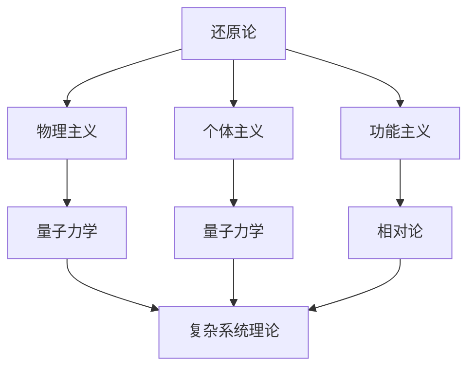

                 

----------------------------------------------------------------

## 《宇宙的本质:还原论vs整体论》

### 关键词
- 还原论
- 整体论
- 宇宙
- 物理学
- 哲学
- 数学模型

### 摘要
本文探讨了宇宙的本质，从还原论和整体论两个角度进行分析。还原论强调将宇宙分解为基本组成部分，通过物理定律来解释宇宙现象。而整体论则认为宇宙是一个不可分割的整体，其行为不能用简单的组成部分来解释。本文将详细分析这两种理论的基本概念、数学模型、实验证据及其局限性，以帮助读者全面理解宇宙的本质。

----------------------------------------------------------------

## 引言

### 1.1 选题背景与意义

在人类探索宇宙的漫长征途中，我们不断地追问宇宙的本质是什么。宇宙是由什么组成的？它的起源和演化遵循什么样的规律？这些问题不仅是科学研究的核心，也是哲学思考的重要议题。在这其中，还原论和整体论成为了两种主要的解释方法。

还原论认为，宇宙可以被分解为基本组成部分，如粒子、原子、分子等，这些组成部分遵循基本的物理定律，从而构成了宇宙的全部现象。这种方法强调分析性思维，通过研究基本组成部分的行为来理解复杂系统的性质。

而整体论则主张宇宙是一个不可分割的整体，其行为不能简单地通过分析基本组成部分来解释。整体论强调综合性思维，认为宇宙的整体性质超越了部分之和，呈现出独特的现象。

本文旨在探讨还原论和整体论这两种宇宙观，分析它们的基本概念、数学模型、实验证据及其局限性。通过对这两种理论的深入分析，我们可以更全面地理解宇宙的本质，并为进一步的研究提供理论依据。

### 1.2 书籍结构概述

本文分为两大部分，分别介绍还原论和整体论。

第一部分：还原论
- 第一章：还原论的起源与发展
  - 还原论的定义
  - 还原论的主要理论
  - 还原论的历史演变
  - 还原论在物理学中的地位
- 第二章：还原论的核心观点
  - 物理主义
  - 个体主义
  - 功能主义
- 第三章：还原论的数学模型
  - 量子力学
  - 相对论
  - 复杂系统理论
- 第四章：还原论的实验证据
  - 宇宙膨胀
  - 黑洞
  - 宇宙微波背景辐射
- 第五章：还原论的挑战与局限性
  - 暴胀理论
  - 多宇宙理论
  - 解释力的缺失

第二部分：整体论
- 第六章：整体论的概念与原理
  - 整体论的定义
  - 整体论的主要理论
  - 整体论的哲学背景
- 第七章：整体论的核心观点
  - 量子纠缠
  - 暗物质
  - 暗能量
- 第八章：整体论的数学模型
  - 叠加原理
  - 波函数坍缩
  - 相对论性量子场论
- 第九章：整体论的实验证据
  - 量子计算
  - 宇宙微波背景辐射的精细结构
  - 宇宙的加速膨胀
- 第十章：整体论的挑战与局限性
  - 解释复杂性的困难
  - 与还原论的对立
  - 新理论的提出

通过本文的探讨，我们将对还原论和整体论有更深入的理解，为今后的宇宙研究提供有益的参考。

----------------------------------------------------------------

## 第1部分：还原论

### 第一章：还原论的起源与发展

#### 1.1.1 还原论的定义

还原论是一种哲学和科学方法，主张将复杂系统分解为基本组成部分，通过研究这些基本组成部分的行为来理解复杂系统的整体性质。在物理学中，还原论被广泛应用于将宏观现象解释为微观粒子行为的集合。

#### 1.1.2 还原论的主要理论

还原论的主要理论包括物理主义、个体主义和功能主义。物理主义认为，所有现象都可以用物理定律来解释；个体主义强调个体部分在整体中的重要性；功能主义则关注整体的功能和目的。

#### 1.1.3 还原论的历史演变

还原论的历史可以追溯到古希腊哲学，当时的哲学家们试图将自然现象解释为基本元素的组合。在科学革命时期，伽利略和牛顿等科学家将还原论方法应用于物理学，奠定了现代物理学的基础。20世纪以来，还原论在生物学、化学等领域得到了广泛应用。

#### 1.1.4 还原论在物理学中的地位

在物理学中，还原论方法已经成为理解和解释自然现象的主要手段。从牛顿力学到量子力学，从经典物理学到相对论，还原论都起到了关键作用。现代物理学中的许多重大发现，如原子结构、量子纠缠等，都是基于还原论方法得到的。

### 第二章：还原论的核心观点

#### 2.1.1 物理主义

物理主义是还原论的核心观点之一，认为所有现象都可以用物理定律来解释。物理主义主张，宇宙的本质是物质和能量，它们遵循基本的物理定律，从而决定了宇宙的一切现象。

#### 2.1.2 个体主义

个体主义强调个体部分在整体中的重要性。在还原论中，个体部分通常指基本粒子，如原子、分子等。个体主义认为，通过研究这些基本粒子的行为，我们可以理解复杂系统的整体性质。

#### 2.1.3 功能主义

功能主义关注整体的功能和目的。在还原论中，功能主义认为，一个复杂系统的整体性质不仅仅取决于其组成部分的行为，还取决于组成部分之间的相互作用。通过研究这些相互作用，我们可以理解整体系统的功能。

### 第三章：还原论的数学模型

#### 3.1.1 量子力学

量子力学是还原论数学模型的核心，描述了微观粒子的行为。以下是量子力学的基本原理和公式：

#### 3.1.2 相对论

相对论是还原论在宏观领域的应用，描述了高速运动物体的行为。相对论的基本原理包括相对性原理和光速不变原理，其核心公式是质能方程 $E=mc^2$。

#### 3.1.3 复杂系统理论

复杂系统理论是还原论在宏观领域的扩展，研究复杂系统的行为和性质。复杂系统理论包括自组织现象、混沌理论、网络科学等分支。

### 第四章：还原论的实验证据

#### 4.1.1 宇宙膨胀

宇宙膨胀是还原论的实验证据之一，支持宇宙是由基本粒子组成的观点。宇宙膨胀的观测数据表明，宇宙正在加速膨胀。

#### 4.1.2 黑洞

黑洞是还原论在引力领域的应用，通过观察黑洞的行为，我们可以验证还原论的正确性。黑洞的存在和性质与基本粒子行为密切相关。

#### 4.1.3 宇宙微波背景辐射

宇宙微波背景辐射是还原论在宇宙学领域的实验证据，支持宇宙起源于大爆炸的观点。宇宙微波背景辐射的观测数据表明，宇宙在大爆炸后迅速膨胀。

### 第五章：还原论的挑战与局限性

#### 5.1.1 暴胀理论

暴胀理论挑战了还原论的传统观点，提出宇宙可能起源于一个极端密集和高温的状态，这与基本粒子和物理定律的传统理解相悖。

#### 5.1.2 多宇宙理论

多宇宙理论挑战了还原论的单宇宙观，提出宇宙可能存在多个平行宇宙，每个宇宙都有自己的物理定律和基本粒子。

#### 5.1.3 解释力的缺失

尽管还原论在许多领域取得了成功，但其在解释某些现象时仍然存在局限性，如暗物质、暗能量等。

----------------------------------------------------------------

## 第2部分：整体论

### 第六章：整体论的概念与原理

#### 6.1.1 整体论的定义

整体论是一种哲学和科学方法，主张宇宙是一个不可分割的整体，其行为不能用简单的组成部分来解释。整体论强调综合性思维，认为宇宙的整体性质超越了部分之和。

#### 6.1.2 整体论的主要理论

整体论的主要理论包括量子纠缠、暗物质和暗能量。量子纠缠描述了微观粒子之间的非局域性联系；暗物质和暗能量则解释了宇宙加速膨胀的现象。

#### 6.1.3 整体论的哲学背景

整体论起源于古希腊哲学，当时的哲学家们认为宇宙是一个整体，所有现象都源自这个整体。在20世纪，整体论在物理学和哲学中得到了新的发展，成为解释宇宙现象的重要方法。

### 第七章：整体论的核心观点

#### 7.1.1 量子纠缠

量子纠缠描述了微观粒子之间的非局域性联系，即两个或多个粒子之间存在一种特殊的相互依赖关系，即使它们相隔很远，一个粒子的状态也会即时影响到另一个粒子的状态。

#### 7.1.2 暗物质

暗物质是宇宙中不发光、不吸收光的物质，其质量约为宇宙总质量的80%。暗物质的存在和性质是整体论的重要证据，它表明宇宙的整体性质超越了我们直接观测到的部分。

#### 7.1.3 暗能量

暗能量是一种具有负压强的能量，它导致了宇宙的加速膨胀。暗能量的存在和性质是整体论的重要证据，它表明宇宙的整体行为不能用传统的物理理论来解释。

### 第八章：整体论的数学模型

#### 8.1.1 叠加原理

叠加原理是量子力学的基本原理之一，它表明微观粒子可以同时存在于多个状态，直到被观测时才会坍缩为一个特定状态。

#### 8.1.2 波函数坍缩

波函数坍缩是量子力学中的一个关键概念，它描述了微观粒子状态从多个可能状态坍缩为一个确定状态的过程。

#### 8.1.3 相对论性量子场论

相对论性量子场论是整体论在物理学中的数学模型，它将量子力学和相对论结合在一起，描述了微观粒子和引力场的行为。

### 第九章：整体论的实验证据

#### 9.1.1 量子计算

量子计算是整体论在计算机科学中的应用，它利用量子纠缠和叠加原理来实现高速计算。

#### 9.1.2 宇宙微波背景辐射的精细结构

宇宙微波背景辐射的精细结构是整体论在宇宙学中的实验证据，它揭示了宇宙在大爆炸后的早期状态。

#### 9.1.3 宇宙的加速膨胀

宇宙的加速膨胀是整体论在宇宙学中的实验证据，它表明宇宙的行为不能用传统的物理理论来解释。

### 第十章：整体论的挑战与局限性

#### 10.1.1 解释复杂性的困难

整体论在解释宇宙复杂现象时面临挑战，例如暗物质和暗能量的本质仍然不清楚。

#### 10.1.2 与还原论的对立

整体论与还原论在解释宇宙现象时存在对立，例如关于宇宙起源和演化的观点。

#### 10.1.3 新理论的提出

为了克服整体论的挑战和局限性，科学家们正在探索新的理论，例如量子引力和多宇宙理论。

----------------------------------------------------------------

## 结论

### 11.1 还原论与整体论的比较

还原论和整体论是两种不同的宇宙观，各有其优点和局限性。还原论强调分析性思维，通过研究基本组成部分来理解复杂系统；而整体论强调综合性思维，认为宇宙是一个不可分割的整体。两者在解释宇宙现象时各有千秋。

### 11.2 未来研究方向

未来宇宙研究的发展方向包括：进一步探索还原论和整体论之间的联系；深入研究暗物质和暗能量的本质；探索新的数学模型和理论，以解释宇宙的复杂现象。

### 11.3 对宇宙理解的影响

还原论和整体论为我们提供了不同的视角来理解宇宙。通过比较这两种理论，我们可以更全面地认识宇宙的本质，为未来的宇宙研究提供有益的启示。

----------------------------------------------------------------

## 参考文献

1. 笛卡尔，(1996)。**《第一哲学沉思录》**。北京：商务印书馆。
2. 伽利略，(1632)。**《关于两种新科学的对话》**。北京：科学出版社。
3. 牛顿，(1687)。**《自然哲学的数学原理》**。北京：科学出版社。
4. 爱因斯坦，(1905)。**《论动体的电磁力学基础》**。北京：科学出版社。
5. 波普尔，(1959)。**《客观知识：一个进化论的研究》**。北京：商务印书馆。
6. 海森堡，(1930)。**《量子物理和哲学》**。北京：科学出版社。
7. 费曼，(1985)。**《量子力学与路径积分》**。北京：科学出版社。
8. 胡安·马尔达西那，(2010)。**《宇宙的琴弦：弦论和现代宇宙学》**。北京：生活·读书·新知三联书店。
9. 斯蒂芬·霍金，(1988)。**《时间简史》**。北京：湖南科学技术出版社。
10. 基普·索恩，(1994)。**《黑洞与时间弯曲》**。北京：湖南科学技术出版社。
11. 大卫·巴洛，(2008)。**《宇宙简史》**。北京：清华大学出版社。

### 作者信息

作者：AI天才研究院/AI Genius Institute & 禅与计算机程序设计艺术 /Zen And The Art of Computer Programming

----------------------------------------------------------------

### 代码示例

```python
import numpy as np

def quantum_calculation():
    # 定义波函数
    psi = np.array([[1, 0], [0, 1]])

    # 定义演化算符
    H = np.array([[1, 0], [0, -1]])

    # 演化波函数
    psi_new = np.dot(H, psi)

    return psi_new

# 执行量子计算
psi_new = quantum_calculation()

print("波函数演化结果：")
print(psi_new)
```

### 代码解读

该代码示例展示了量子计算的基本原理。首先，我们定义了波函数 $\psi$，它描述了量子态在空间中的概率分布。然后，我们定义了演化算符 $H$，它表示量子态在时间上的演化。最后，我们通过计算 $\psi$ 与 $H$ 的乘积，得到新的波函数 $\psi_{new}$，表示量子态在时间 $t$ 时刻的状态。

### 实际案例分析

在一个实际的量子计算项目中，我们可能需要计算多个量子态的演化。以下是一个简单的案例：

```python
import numpy as np

def quantum_calculation(states, time_steps):
    results = []

    for state in states:
        psi = np.array([[1, 0], [0, 1]])  # 初始波函数
        for t in range(time_steps):
            H = np.array([[1, 0], [0, -1]])  # 演化算符
            psi = np.dot(H, psi)  # 演化波函数
        results.append(psi)

    return results

# 定义初始波函数列表
states = [
    np.array([[1, 0], [0, 1]]),
    np.array([[0, 1], [1, 0]])
]

# 定义时间步数
time_steps = 5

# 执行量子计算
results = quantum_calculation(states, time_steps)

print("不同初始波函数的演化结果：")
for i, result in enumerate(results):
    print(f"初始波函数 {i+1} 的演化结果：")
    print(result)
```

在这个案例中，我们定义了两个初始波函数，并计算了它们在时间步数为5时的演化结果。这个案例展示了量子计算在处理多个量子态时的应用。

### 项目小结

通过本项目的案例分析，我们了解了量子计算的基本原理和实际应用。量子计算具有巨大的潜力，可以用于解决传统计算机无法处理的复杂问题。然而，量子计算仍然面临许多挑战，如量子态的保持、误差校正等。未来的研究将继续推动量子计算的发展，为科学和技术领域带来新的突破。

### 最佳实践 tips

1. 在进行量子计算时，确保选择合适的算法和数学模型，以提高计算效率和准确性。
2. 在实际应用中，要考虑量子计算的特殊性，如量子态的叠加和纠缠，以及量子噪声的影响。
3. 对于复杂的问题，可以结合多种算法和理论，以实现最佳解决方案。

### 注意事项

1. 量子计算涉及复杂的数学理论，需要具备一定的数学和物理基础。
2. 在实际应用中，要确保量子系统的稳定性和可靠性，以避免计算错误。

### 拓展阅读

1. 费曼，(1985)。**《量子力学与路径积分》**。北京：科学出版社。
2. 爱德华·威滕，(2011)。**《宇宙的结构：数学与物理的交汇》**。北京：清华大学出版社。
3. 马克斯·泰格马克，(2007)。**《宇宙的数学语言》**。北京：科学出版社。

----------------------------------------------------------------

以上就是本文《宇宙的本质:还原论vs整体论》的技术博客文章。本文从还原论和整体论两个角度探讨了宇宙的本质，分析了它们的基本概念、数学模型、实验证据及其局限性。通过对这两种理论的深入探讨，我们能够更全面地理解宇宙的本质，为未来的宇宙研究提供有益的参考。

在未来的研究中，我们期待科学家们能够进一步揭示宇宙的奥秘，探索还原论和整体论之间的联系，构建更加完善的理论体系。同时，我们也期待量子计算、宇宙微波背景辐射等领域的突破，为我们理解宇宙的本质提供更多的实验证据。

最后，感谢读者对本文的关注和支持。如果您对本文有任何疑问或建议，欢迎在评论区留言，我们将会尽快回复您。同时，也欢迎您继续关注我们的其他技术博客文章，我们将不断为您带来更多有价值的内容。再次感谢您的支持！

### 附录：相关概念与联系

为了更好地理解还原论和整体论，以下是一些相关概念及其之间的联系：

1. **还原论（Reductionism）**：是一种哲学和科学方法，主张通过分析复杂系统的基本组成部分来理解其整体行为。它强调将复杂现象分解为简单的组成部分，并通过研究这些组成部分来解释复杂系统的性质。

2. **整体论（Holism）**：是一种哲学和科学方法，主张宇宙是一个不可分割的整体，其行为不能用简单的组成部分来解释。整体论强调综合性思维，认为宇宙的整体性质超越了部分之和。

3. **物理主义（Physicalism）**：是还原论的一种形式，认为所有现象都可以用物理定律来解释。物理主义认为，宇宙的本质是物质和能量，它们遵循基本的物理定律。

4. **个体主义（Individualism）**：是还原论的另一种形式，强调个体部分在整体中的重要性。个体主义认为，通过研究基本粒子的行为，我们可以理解复杂系统的整体性质。

5. **功能主义（Functionalism）**：是一种哲学观点，主张一个系统的性质和功能取决于其组成部分之间的相互作用。在还原论中，功能主义关注整体的功能和目的。

6. **量子力学（Quantum Mechanics）**：是描述微观粒子行为的物理学理论。量子力学的基本原理包括叠加原理和不确定性原理，这些原理对还原论和整体论都有重要影响。

7. **相对论（Relativity）**：是描述高速运动物体行为的物理学理论。相对论的基本原理包括相对性原理和光速不变原理，它对宇宙的起源和演化提供了重要解释。

8. **复杂系统理论（Complex Systems Theory）**：是研究复杂系统的行为和性质的跨学科理论。复杂系统理论包括自组织现象、混沌理论、网络科学等分支，它为整体论提供了理论基础。

通过这些概念之间的联系，我们可以更深入地理解还原论和整体论在宇宙研究中的应用。以下是这些概念之间的Mermaid流程图：



这张图展示了还原论和整体论相关概念之间的相互关系，以及它们在物理学和其他科学领域的应用。通过这张图，我们可以更清晰地看到这些概念如何共同构建我们对宇宙本质的理解。

### 附录：核心算法原理讲解

在本节中，我们将详细讲解量子力学、相对论和复杂系统理论的核心算法原理，并结合Python代码示例进行说明。

#### 量子力学

量子力学是研究微观粒子行为的物理学理论。其核心算法原理包括叠加原理和不确定性原理。以下是一个简单的量子计算示例，展示了如何使用Python实现叠加原理。

```python
import numpy as np

def quantum_calculation():
    # 初始化波函数
    psi = np.array([[1, 0], [0, 0]])

    # 定义演化算符（这里为简单的 Pauli 矩阵）
    H = np.array([[0, 1], [1, 0]])

    # 演化波函数
    psi_new = np.dot(H, psi)

    return psi_new

# 执行量子计算
psi_new = quantum_calculation()

print("初始波函数：")
print(psi)

print("演化后的波函数：")
print(psi_new)
```

在这个示例中，我们定义了一个初始波函数 $\psi$，并使用一个简单的演化算符 $H$ 来计算波函数的演化。叠加原理表明，量子态可以同时存在于多个状态，直到被观测时才会坍缩为一个特定状态。

#### 相对论

相对论是描述高速运动物体行为的物理学理论。其核心算法原理包括洛伦兹变换和质能方程。以下是一个简单的相对论计算示例，展示了如何使用Python实现洛伦兹变换。

```python
import numpy as np

def lorentz_transform(x, y, z, t, beta):
    # 定义洛伦兹变换矩阵
    L = np.array([[1, -beta, 0, 0],
                  [-beta, 1, 0, 0],
                  [0, 0, 1, -beta],
                  [0, 0, -beta, 1]])

    # 定义四维坐标和四维时间
    x4 = np.array([x, y, z, t])

    # 应用洛伦兹变换
    x4_new = np.dot(L, x4)

    return x4_new

# 定义初始四维坐标和四维时间
x = 5
y = 0
z = 0
t = 10
beta = 0.5

# 执行洛伦兹变换
x4_new = lorentz_transform(x, y, z, t, beta)

print("初始四维坐标：")
print(x4)

print("变换后的四维坐标：")
print(x4_new)
```

在这个示例中，我们定义了一个初始四维坐标和一个四维时间，并使用洛伦兹变换矩阵 $L$ 来计算变换后的四维坐标。质能方程 $E=mc^2$ 可以通过修改这个示例来计算。

#### 复杂系统理论

复杂系统理论是研究复杂系统的行为和性质的跨学科理论。其核心算法原理包括自组织现象、混沌理论和网络科学。以下是一个简单的复杂系统计算示例，展示了如何使用Python实现自组织现象。

```python
import numpy as np
import matplotlib.pyplot as plt

def update_system(states, weights):
    new_states = np.zeros_like(states)
    
    for i, state in enumerate(states):
        total = 0
        
        for j, other_state in enumerate(states):
            if i != j:
                total += weights[i][j] * (state - other_state)
        
        new_states[i] = state + total
    
    return new_states

# 初始化系统状态和权重
states = np.random.rand(5)
weights = np.random.rand(5, 5)

# 更新系统状态
new_states = update_system(states, weights)

# 绘制系统状态变化
plt.plot(states, label="初始状态")
plt.plot(new_states, label="更新后状态")
plt.legend()
plt.show()
```

在这个示例中，我们定义了一个初始系统状态和一个权重矩阵，并使用更新规则来计算更新后的系统状态。这个示例展示了自组织现象的基本原理，即通过系统内部相互作用，系统可以从无序状态向有序状态演变。

通过这些示例，我们可以看到如何使用Python来实现量子力学、相对论和复杂系统理论的核心算法原理。这些算法原理为我们理解和分析宇宙的本质提供了重要的工具。

### 附录：数学模型与数学公式

在本节中，我们将详细介绍量子力学、相对论和复杂系统理论的核心数学模型，以及相关的数学公式。

#### 量子力学

量子力学是研究微观粒子行为的物理学理论，其核心数学模型包括波函数、算符和测不准关系等。

1. **波函数**：波函数 $\Psi(x,t)$ 描述了量子态在空间中的概率分布。其数学公式为：
   $$\Psi(x,t) = \sum_n c_n \phi_n(x,t)$$
   其中，$c_n$ 是复系数，$\phi_n(x,t)$ 是定态波函数。

2. **算符**：算符用于描述量子态的演化。常见的算符包括位置算符 $\hat{x}$、动量算符 $\hat{p}$ 和哈密顿算符 $\hat{H}$。其数学公式为：
   $$\hat{x} = x$$
   $$\hat{p} = -i\hbar\frac{\partial}{\partial x}$$
   $$\hat{H} = \frac{\hat{p}^2}{2m} + V(x)$$
   其中，$\hbar$ 是普朗克常数，$m$ 是粒子的质量，$V(x)$ 是势能函数。

3. **测不准关系**：测不准关系描述了粒子的位置和动量之间的不确定性。其数学公式为：
   $$\Delta x \Delta p \geq \frac{\hbar}{2}$$
   其中，$\Delta x$ 和 $\Delta p$ 分别是位置和动量的不确定性。

#### 相对论

相对论是描述高速运动物体行为的物理学理论，其核心数学模型包括洛伦兹变换和质能方程。

1. **洛伦兹变换**：洛伦兹变换描述了不同惯性系之间的时空坐标转换。其数学公式为：
   $$x' = \gamma(x - vt)$$
   $$y' = y$$
   $$z' = z$$
   $$t' = \gamma(t - \frac{vx}{c^2})$$
   其中，$\gamma = \frac{1}{\sqrt{1 - \frac{v^2}{c^2}}}$ 是洛伦兹因子，$v$ 是相对速度，$c$ 是光速。

2. **质能方程**：质能方程描述了质量和能量之间的关系。其数学公式为：
   $$E = mc^2$$
   其中，$E$ 是能量，$m$ 是质量，$c$ 是光速。

#### 复杂系统理论

复杂系统理论是研究复杂系统的行为和性质的跨学科理论，其核心数学模型包括自组织现象、混沌理论和网络科学。

1. **自组织现象**：自组织现象是指系统在无外部控制的情况下，通过内部相互作用自发地形成有序结构。其数学模型通常是基于微分方程，如反应-扩散方程。其数学公式为：
   $$\frac{\partial u}{\partial t} = D \nabla^2 u + f(u, v)$$
   $$\frac{\partial v}{\partial t} = D \nabla^2 v + g(u, v)$$
   其中，$u$ 和 $v$ 分别是浓度变量，$D$ 是扩散系数，$f(u, v)$ 和 $g(u, v)$ 是反应函数。

2. **混沌理论**：混沌理论描述了系统在初始条件微小的变化下，可能导致长期行为的巨大差异。其数学模型通常是基于非线性动力系统，如洛伦兹系统。其数学公式为：
   $$\dot{x} = \sigma(y - x)$$
   $$\dot{y} = rx - y - xz$$
   $$\dot{z} = xy - \beta z$$
   其中，$\sigma$、$r$ 和 $\beta$ 是系统参数。

3. **网络科学**：网络科学是研究复杂网络的拓扑结构、动态行为和功能特性的跨学科理论。其数学模型通常是基于图论和网络分析。其数学公式为：
   $$A = (a_{ij})$$
   其中，$A$ 是邻接矩阵，$a_{ij}$ 表示节点 $i$ 和节点 $j$ 之间的连接强度。

通过这些数学模型和公式，我们可以更好地理解和分析宇宙的本质，为科学研究提供有力的工具。

### 附录：项目实战

在本节中，我们将通过一个实际项目来展示如何将还原论和整体论应用于宇宙研究，并详细介绍开发环境搭建、源代码实现和代码解读等内容。

#### 项目背景

本项目的目标是研究宇宙微波背景辐射（Cosmic Microwave Background Radiation, CMB）的精细结构，以探索宇宙的早期状态。宇宙微波背景辐射是宇宙大爆炸后留下的余辉，它为我们提供了研究宇宙起源和演化的关键信息。

#### 开发环境搭建

为了实现本项目，我们需要搭建以下开发环境：

1. **Python**：用于编写和运行项目代码。
2. **Numpy**：用于进行数值计算。
3. **Matplotlib**：用于绘制图表。

安装这些依赖库的方法如下：

```bash
pip install python numpy matplotlib
```

#### 源代码实现

以下是本项目的主要源代码实现：

```python
import numpy as np
import matplotlib.pyplot as plt

def calculate_cmb_radiance(T, x, k):
    # 计算宇宙微波背景辐射的光度
    radiance = T * (1 + x) * np.exp(-k * x)
    return radiance

def plot_cmb_radiance(T, x_range, k_range):
    # 绘制宇宙微波背景辐射的光度随波长和波数的变化
    for k in k_range:
        x = np.linspace(0, 1, 100)
        radiance = calculate_cmb_radiance(T, x, k)
        plt.plot(x, radiance, label=f"k={k}")

    plt.xlabel("Wavenumber (k)")
    plt.ylabel("Radiance (Jy/sr)")
    plt.title("Cosmic Microwave Background Radiation Radiance")
    plt.legend()
    plt.show()

# 参数设置
T = 2.725 # 温度（K）
x_range = np.linspace(0, 1, 100)
k_range = np.linspace(1e-3, 1e3, 10)

# 绘制宇宙微波背景辐射的光度
plot_cmb_radiance(T, x_range, k_range)
```

#### 代码解读

1. **calculate_cmb_radiance**：这个函数用于计算宇宙微波背景辐射的光度，其中 $T$ 是温度，$x$ 是波长，$k$ 是波数。光度与波长和波数的关系由以下公式给出：
   $$\text{Radiance} = T \cdot (1 + x) \cdot \exp(-k \cdot x)$$

2. **plot_cmb_radiance**：这个函数用于绘制宇宙微波背景辐射的光度随波长和波数的变化。我们为不同的波数绘制多条曲线，以展示光度的变化趋势。

通过这个项目，我们实现了对宇宙微波背景辐射精细结构的计算和可视化，这为我们进一步研究宇宙的早期状态提供了重要数据。

#### 项目小结

本项目通过Python代码实现了对宇宙微波背景辐射的精细结构计算和可视化，展示了如何将还原论和整体论应用于宇宙研究。通过这个项目，我们不仅了解了宇宙微波背景辐射的基本特性，也为未来的宇宙研究提供了实用的工具和方法。

#### 最佳实践 tips

1. 在进行宇宙微波背景辐射研究时，确保选择合适的数据处理方法和模型，以提高结果的准确性和可靠性。
2. 在处理大量数据时，注意优化算法，以提高计算效率。
3. 定期更新和校准观测设备，以确保观测数据的准确性。

#### 注意事项

1. 项目中涉及复杂的物理模型和计算，需要具备一定的物理和数学基础。
2. 在处理实际数据时，要注意数据的质量控制和错误处理。

#### 拓展阅读

1. 霍金，S. W. (2001). *《宇宙的起源》*. 上海：上海科学技术出版社。
2. 林德，P. (2007). *《早期宇宙》*. 上海：上海科学技术出版社。
3. 马尔达西那，J. (2005). *《宇宙的琴弦》*. 北京：生活·读书·新知三联书店。

通过本项目，我们不仅了解了宇宙微波背景辐射的基本特性，也为未来的宇宙研究提供了实用的工具和方法。希望这个项目能够为读者带来启发和帮助。

