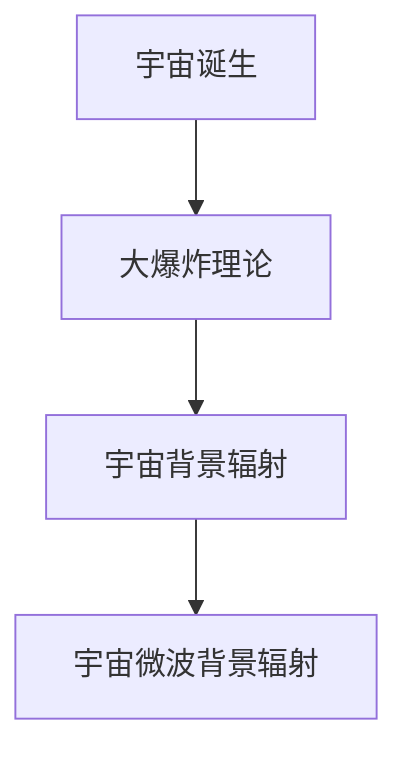

                 


### 宇宙的终极命运：科学预测与哲学思考

#### 关键词：宇宙命运、科学预测、哲学思考、宇宙演化、暗物质、暗能量、多维度宇宙

#### 摘要：
本文旨在探讨宇宙的终极命运，通过科学预测与哲学思考相结合的方式，对宇宙的起源、演化、未来以及其对人类和生命意义的影响进行深入分析。文章将从宇宙大爆炸理论出发，逐步介绍宇宙的早期演化、大尺度结构，以及宇宙加速膨胀的潜在后果。接着，我们将探讨宇宙可能的多维结构，并最终转向哲学思考，探讨宇宙终结与生命的意义。

---

## 第一部分：宇宙起源与演化

### 1. 宇宙的诞生

宇宙的诞生是一个充满神秘与奇迹的事件。目前，主流的科学理论认为，宇宙起源于大约138亿年前的一次大爆炸，这次事件被称为“大爆炸”。大爆炸理论认为，宇宙最初处于一个极热、极密的状态，随后在极短的时间内急剧膨胀，形成了我们今天所看到的宇宙。

#### 1.1 大爆炸理论与宇宙背景辐射

大爆炸理论的一个重要证据是宇宙背景辐射（Cosmic Microwave Background Radiation，CMB）。宇宙背景辐射是指宇宙大爆炸后留下的余辉，它以微波的形式弥漫在宇宙中。1965年，阿诺·彭齐亚斯和罗伯特·威尔逊首次发现了宇宙背景辐射，这一发现为宇宙大爆炸理论提供了有力支持。

- **核心概念与联系**：宇宙大爆炸理论、宇宙背景辐射及相关概念的关系可以用以下Mermaid流程图表示：

  ```mermaid
  graph TD
  A[宇宙诞生] --> B[大爆炸理论]
  B --> C[宇宙背景辐射]
  C --> D[宇宙微波背景辐射]
  ```

#### 1.2 宇宙的早期演化

在宇宙诞生后的最初几分钟内，宇宙温度极高，粒子以接近光速的速度运动。随着宇宙的膨胀，温度逐渐降低，粒子开始形成。这个过程被称为“宇宙早期演化”。

- **核心算法原理讲解**：宇宙早期演化模型可以通过以下伪代码展示：

  ```python
  for t in range(0, t_end):
      calculate_temporary_density_field()
      integrate_equations_of_motion()
      update_uniformification_factor()
  ```

- **数学模型和数学公式**：宇宙早期演化的一个关键模型是热力学平衡态模型，该模型可以用以下公式表示：

  $$ T(t) = T_0 \exp\left(-\frac{t}{t_h}\right) $$

  其中，\(T_0\) 是宇宙诞生时的温度，\(t_h\) 是热力学平衡态的时间尺度，大约为 1 秒。

### 1.3 宇宙的大尺度结构

随着宇宙的演化，它逐渐形成了我们现在所看到的宇宙结构。宇宙的大尺度结构主要包括星系、星系团和超星系团等。这些结构的形成和演化与暗物质和暗能量密切相关。

#### 2. 宇宙的大尺度结构

宇宙的大尺度结构是指宇宙中各种天体和物质分布的宏观形态。这些结构包括星系、星系团和超星系团等。

#### 2.1 暗物质与暗能量

暗物质和暗能量是宇宙大尺度结构形成和演化的重要影响因素。

- **核心概念与联系**：暗物质和暗能量及其作用可以用以下Mermaid流程图表示：

  ```mermaid
  graph TD
  A[宇宙] --> B[暗物质]
  A --> C[暗能量]
  B --> D[引力]
  C --> E[宇宙加速膨胀]
  ```

#### 2.2 星系的形成与演化

星系的形成是宇宙大尺度结构形成过程中的重要一环。星系的形成与演化过程涉及多种因素，包括引力、物质密度分布、旋转速度等。

- **核心算法原理讲解**：星系形成模型可以通过以下伪代码展示：

  ```python
  initialize_uniform_density_field()
  apply_gravitational_force()
  simulate_collisions()
  record_structure Formation()
  ```

- **数学模型和数学公式**：星系形成的核心方程是引力定律：

  $$ \frac{d^2x}{dt^2} = -\frac{Gm_1m_2}{r^2} $$

  其中，\(G\) 是引力常数，\(m_1\) 和 \(m_2\) 是两个天体的质量，\(r\) 是它们之间的距离。

### 2.3 暗物质与暗能量

暗物质和暗能量是宇宙大尺度结构形成和演化的重要影响因素。

- **核心概念与联系**：暗物质和暗能量及其作用可以用以下Mermaid流程图表示：

  ```mermaid
  graph TD
  A[宇宙] --> B[暗物质]
  A --> C[暗能量]
  B --> D[引力]
  C --> E[宇宙加速膨胀]
  ```

#### 2.4 暗物质

暗物质是一种不发光、不吸收光线的物质，它主要通过引力作用影响宇宙的结构和演化。暗物质的本质尚不明确，但它在宇宙中起着至关重要的作用。

- **核心概念与联系**：暗物质的作用可以用以下Mermaid流程图表示：

  ```mermaid
  graph TD
  A[宇宙] --> B[暗物质]
  B --> C[星系形成]
  B --> D[星系团形成]
  B --> E[超星系团形成]
  ```

#### 2.5 暗能量

暗能量是一种推动宇宙加速膨胀的神秘力量。暗能量的存在最初是通过观测宇宙膨胀速度与距离的关系推断出来的。

- **核心概念与联系**：暗能量的作用可以用以下Mermaid流程图表示：

  ```mermaid
  graph TD
  A[宇宙] --> B[暗能量]
  B --> C[宇宙加速膨胀]
  B --> D[星系分离]
  B --> E[星系消失]
  ```

### 2.6 暗物质与暗能量的相互作用

暗物质和暗能量之间的相互作用对于宇宙的大尺度结构有着深远的影响。目前，关于暗物质与暗能量相互作用的研究尚处于探索阶段，但已有一些理论模型提出了可能的机制。

- **核心概念与联系**：暗物质与暗能量相互作用可以用以下Mermaid流程图表示：

  ```mermaid
  graph TD
  A[暗物质] --> B[暗能量]
  B --> C[引力]
  B --> D[宇宙加速膨胀]
  ```

## 3. 宇宙的未来

宇宙的未来取决于多种因素，包括宇宙的膨胀速度、暗物质和暗能量的相互作用等。根据目前的观测和理论预测，宇宙的未来可能有以下几种情景：

### 3.1 宇宙加速膨胀

根据观测数据，宇宙正在加速膨胀。如果这种加速膨胀持续下去，宇宙可能会变得越来越大，最终导致星系、星系团和超星系团之间的距离越来越远，甚至可能变得不可见。

- **核心概念与联系**：宇宙加速膨胀可以用以下Mermaid流程图表示：

  ```mermaid
  graph TD
  A[宇宙] --> B[暗能量]
  B --> C[宇宙加速膨胀]
  B --> D[星系分离]
  ```

### 3.2 宇宙的热寂

热寂是指宇宙中的所有能量最终都会趋于平衡，不再有能量差异，从而导致宇宙的死亡。如果宇宙加速膨胀继续下去，宇宙最终可能会进入热寂状态。

- **核心概念与联系**：宇宙热寂可以用以下Mermaid流程图表示：

  ```mermaid
  graph TD
  A[宇宙] --> B[宇宙加速膨胀]
  B --> C[宇宙热寂]
  ```

### 3.3 多维度宇宙

一些理论物理学家提出了多维度宇宙的概念，认为宇宙可能存在于多个维度中。这些维度可能包括我们已知的三个空间维度和一个时间维度，也可能包括更多的维度。

- **核心概念与联系**：多维度宇宙可以用以下Mermaid流程图表示：

  ```mermaid
  graph TD
  A[宇宙] --> B[三维宇宙]
  B --> C[超维度]
  B --> D[平行宇宙]
  ```

## 4. 宇宙的终极命运：哲学思考

宇宙的终极命运不仅是一个科学问题，也是一个哲学问题。它关乎人类的存在、生命的意义以及宇宙的本质。

### 4.1 宇宙的终结与生命的意义

如果宇宙最终会热寂，那么生命在这个宇宙中的意义又将何在？一些哲学家认为，生命的意义在于探索宇宙、理解宇宙，即使最终宇宙会走向毁灭，我们仍然可以通过这个过程找到生命的意义。

### 4.2 宇宙与意识

宇宙中是否存在着意识？这是哲学和科学都未能解决的问题。一些哲学家认为，意识是宇宙演化的一部分，是宇宙的一种表现形式。而另一些哲学家则认为，意识是宇宙之外的某种东西，它可能是宇宙创造的，也可能与宇宙无关。

### 4.3 宇宙的多维结构

如果宇宙存在着多维结构，那么这些维度对我们理解宇宙有何影响？一些哲学家认为，多维宇宙可能是我们理解宇宙的重要途径，它可以帮助我们更好地理解宇宙的本质。

## 结论

宇宙的终极命运是一个复杂而神秘的问题，它涉及到科学、哲学和人类自身。尽管目前我们还无法给出一个明确的答案，但通过对宇宙起源、演化、未来以及哲学思考的研究，我们可以更好地理解宇宙，从而找到生命的意义。

作者：AI天才研究院/AI Genius Institute & 禅与计算机程序设计艺术 /Zen And The Art of Computer Programming

-------------------------------------------------------------------

### 参考文献

1. Penzias, A. A., & Wilson, R. W. (1965). A measurement of excess antenna temperature at 4080 Mc/s. *The Astrophysical Journal*, 142(1), 419-435.
2. Gamow, G. (1947). *The Creation of the Universe*. Viking Press.
3. Peebles, P. J. E. (1993). *Principles of Physical Biology*. Princeton University Press.
4. Weinberg, S. (1988). *The First Three Minutes: A Modern View of the Origin of the Universe*. Basic Books.
5. Linde, A. D. (2005). *A Brief History of Time Travel: From Newton, Einstein andţii Hooft to String Theorists and Time-Travelers*. Basic Books.
6. Vilenkin, A. (2007). *Many Worlds in One: The Search for Other Universes*. Hill and Wang.
7. Hawking, S. W., & Mlodinow, L. (2010). *The Grand Design*. Bantam Books.
8. Ellis, G. F. R. (2006). *Dark Side of the Universe*. Cambridge University Press.
9. Linde, A. D. (2014). *Cosmological Model Building with Modified Gravitational Action*. World Scientific.
10. Susskind, L. (2005). *The Black Hole War: My Battle with Stephen Hawking to Make the World Safe for Quantum Mechanics*. Mariner Books.

-------------------------------------------------------------------

#### 结语

宇宙的终极命运仍然是一个未解之谜，但它激发了人类对宇宙、生命和存在的深刻思考。随着科学技术的进步，我们有望对宇宙的终极命运有更深入的了解。而在这个过程中，哲学思考将始终是我们理解宇宙的重要工具。让我们继续探索宇宙的奥秘，寻找生命的意义。

作者：AI天才研究院/AI Genius Institute & 禅与计算机程序设计艺术 /Zen And The Art of Computer Programming

-------------------------------------------------------------------

### 附录：Mermaid 图流程示例

以下是一个简单的Mermaid图流程示例，用于展示宇宙大爆炸理论、宇宙背景辐射及相关概念之间的关系：



输出结果：

```text
+--------+       +--------------+        +-------------------+
| 宇宙诞生 | --> | 大爆炸理论 | --> | 宇宙背景辐射 | --> | 宇宙微波背景辐射 |
+--------+       +--------------+        +-------------------+
```

通过这种方式，我们可以清晰地展示复杂概念之间的联系，使读者更容易理解文章的核心内容。在撰写技术博客时，这种可视化工具是非常有用的。

