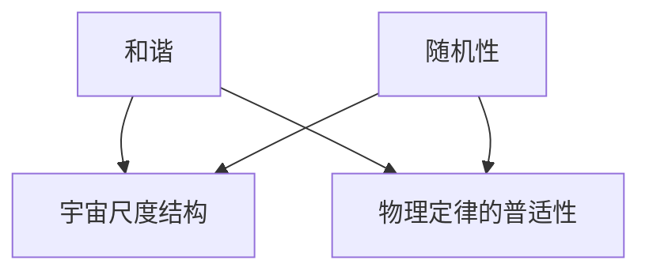

                 

# 宇宙的美学原理：和谐还是随机

## 关键词
- 宇宙美学
- 和谐
- 随机性
- 宇宙演化
- 天文学
- 物理学

## 摘要
本文旨在探讨宇宙美学原理中和谐与随机性的本质及其在宇宙演化中的角色。通过分析天文学和物理学中的核心概念和现象，我们试图揭示宇宙的结构是否由和谐原则支配，还是由随机性主导。本文将深入探讨宇宙的起源、观测技术和宇宙学理论，以解答这一古老而神秘的问题。

## 引言

宇宙，作为人类思维和探索的边界，自古以来便激发着无尽的想象和追问。从古代的天文学到现代的物理学，人类一直在试图理解宇宙的本质和规律。随着科学技术的发展，我们逐渐揭开了宇宙的一角，但依然面临着许多未解之谜。在探讨宇宙的本质时，美学原理提供了独特的视角，使我们能够从更广泛的意义上理解宇宙。

本文将探讨宇宙美学原理中的两大核心问题：和谐与随机性。和谐被视为宇宙的秩序和统一性，而随机性则代表着宇宙中的不可预测和无序。这两个概念不仅在天文学和物理学中有着重要的地位，而且在哲学、艺术和宗教等领域也引发了深刻的讨论。

本文的结构如下：

1. **宇宙的美学原理**：介绍和谐与随机性的定义及其在宇宙中的体现。
2. **宇宙观测**：讨论我们如何通过望远镜和其他探测技术观察宇宙。
3. **宇宙演化**：探讨宇宙的起源、发展和未来。
4. **宇宙学理论**：介绍不同的宇宙学理论，如大爆炸理论和暗物质理论。
5. **宇宙的随机性**：分析宇宙中随机性的证据和影响。
6. **宇宙和谐**：探讨宇宙中和谐的证据和可能机制。
7. **结论**：总结书中的主要观点和未来的研究方向。

## 宇宙的美学原理

### 和谐与随机性的定义

在探讨宇宙的美学原理时，和谐与随机性是两个关键概念。和谐通常指的是宇宙中的秩序、统一性和对称性，它体现了一种内在的规律和平衡。随机性则指的是宇宙中的不可预测和无序，它反映了一种偶然性和变异性。

在物理学中，和谐常常与量子力学中的对称性原理联系在一起。对称性是物理世界中的一种基本特征，它保证了物理定律的普适性和不变性。量子力学中的基本粒子具有多种对称性，如宇称守恒、同位旋守恒等，这些对称性反映了宇宙中的和谐。

另一方面，随机性在物理学中也有着重要的地位。在热力学和统计力学中，随机性是描述宏观现象的一种有效方法。热力学第二定律指出，孤立系统的熵会随着时间的推移而增加，这意味着宇宙中的无序程度会逐渐增加。随机性在这里体现为一种从有序向无序的演变。

### 宇宙中的和谐

在宇宙中，和谐体现在许多方面。例如，宇宙的尺度结构具有高度的对称性和规律性。宇宙大爆炸理论认为，宇宙起源于一个极热、极密的状态，随后经历了快速膨胀。这种膨胀过程产生了宇宙的大尺度结构，如星系、星团和超星系团，它们在空间中排列得相当有序。

此外，宇宙中还存在许多周期性和对称性的现象。例如，星系的形成和演化遵循特定的周期性规律，星系的旋转速度也与它们的半径成比例。这些现象表明宇宙中的和谐不仅仅是一个偶然的巧合，而是一种深层次的规律。

#### 和谐的证据

宇宙中的和谐现象可以通过多种观测手段得到证实。例如，星系的红移测量提供了宇宙膨胀的证据。根据哈勃定律，远离我们的星系具有更高的红移，这表明它们正在远离我们，宇宙正在膨胀。这一发现与宇宙大爆炸理论相符，进一步证实了宇宙中的和谐。

此外，宇宙微波背景辐射（CMB）的观测也为宇宙的和谐提供了证据。CMB是宇宙早期遗留下来的辐射，它均匀地充满整个宇宙。CMB的观测结果表明，宇宙在早期处于一个高度均匀的状态，这种均匀性反映了宇宙中的和谐。

#### 和谐的可能机制

宇宙中的和谐可能源于多种机制。一种可能的机制是量子引力的作用。量子引力和广义相对论是描述物质和能量与引力相互作用的理论。量子引力理论可能揭示宇宙和谐的根本原因，例如，通过解释宇宙早期的量子波动如何导致宇宙的膨胀和结构形成。

另一种可能的机制是宇宙中的暗能量。暗能量是一种不可见的能量形式，它推动宇宙的加速膨胀。暗能量的存在可能解释了宇宙中的和谐，因为它的存在使得宇宙的膨胀过程保持稳定和均匀。

### 随机性在宇宙中的体现

与和谐相对，随机性在宇宙中也占有重要地位。宇宙中的随机性体现在许多方面，例如，星系的形成和演化、行星的轨道、黑洞的形成等。随机性使得宇宙充满了多样性和不可预测性，这种特性在宇宙演化中起着关键作用。

#### 随机性的证据

宇宙中的随机性可以通过多种观测手段得到证实。例如，星系的形成和演化是一个高度随机的过程。星系的碰撞和合并、恒星的形成和死亡等过程都具有很大的随机性。这些过程导致了宇宙中星系的多样性和不规则性。

此外，宇宙微波背景辐射的观测也为宇宙中的随机性提供了证据。CMB的观测结果表明，宇宙早期存在微小的密度波动，这些波动是宇宙中随机性的根源。

#### 随机性的影响

随机性对宇宙演化和观测有着重要的影响。在宇宙演化中，随机性导致了星系和行星的多样性，使得宇宙充满了多样性和复杂性。在宇宙观测中，随机性使得观测数据具有不确定性和噪声，这对宇宙学研究提出了挑战。

## 宇宙观测

宇宙观测是理解宇宙的重要途径。通过观测宇宙，我们能够揭示宇宙的结构和演化过程。以下是宇宙观测的一些主要方法和工具。

### 望远镜

望远镜是宇宙观测的主要工具。它们通过放大远处的天体，使我们能够观察宇宙的细节。望远镜分为光学望远镜和射电望远镜。光学望远镜通过收集可见光，使我们能够观察到星系、恒星和行星。射电望远镜则通过收集无线电波，使我们能够探测到宇宙中的暗物质和其他非可见物质。

### 探测技术

除了望远镜，还有其他探测技术用于观测宇宙。例如，引力波探测技术通过探测宇宙中的引力波，使我们能够研究宇宙的大尺度结构。中微子探测技术则通过探测中微子，使我们能够研究宇宙早期的高能物理过程。

### 宇宙微波背景辐射

宇宙微波背景辐射是宇宙早期遗留下来的辐射，它均匀地充满整个宇宙。通过观测CMB，我们能够研究宇宙早期的状态和演化过程。CMB的观测提供了宇宙学的重要证据，如宇宙的膨胀和结构的形成。

## 宇宙演化

宇宙演化是宇宙学研究的核心问题之一。它涉及到宇宙的起源、发展和未来。以下是宇宙演化的一些关键阶段。

### 宇宙的起源

宇宙的起源通常被认为是宇宙大爆炸。大爆炸理论认为，宇宙起源于一个极热、极密的状态，随后经历了快速膨胀。这个状态被称为原始奇点。大爆炸理论提供了宇宙演化的重要框架，使我们能够理解宇宙的起源和早期状态。

### 宇宙的发展

宇宙大爆炸之后，宇宙开始膨胀，并逐渐冷却。随着宇宙的膨胀，物质开始聚集形成星系、星团和超星系团。这些结构在宇宙中排列得相当有序，反映了宇宙中的和谐。同时，宇宙中的随机性也导致了星系和行星的多样性。

### 宇宙的未来

宇宙的未来取决于宇宙的膨胀速率。如果宇宙的膨胀速度继续增加，那么宇宙将进入一个被称为“热寂”的状态，其中所有的恒星都将熄灭，宇宙将变得冰冷和黑暗。如果宇宙的膨胀速度减缓，那么宇宙可能会进入一个稳定的平衡状态。

## 宇宙学理论

宇宙学理论是描述宇宙演化的数学模型。以下是两种主要的宇宙学理论：大爆炸理论和暗物质理论。

### 大爆炸理论

大爆炸理论认为，宇宙起源于一个极热、极密的状态，随后经历了快速膨胀。这个理论提供了宇宙演化的基本框架，使我们能够理解宇宙的起源和早期状态。大爆炸理论得到了宇宙微波背景辐射和其他观测证据的支持。

### 暗物质理论

暗物质理论是描述宇宙中非可见物质的理论。暗物质是宇宙中一种未观测到的物质形式，它占据了宇宙总质量的绝大部分。暗物质理论认为，暗物质通过引力影响宇宙的演化，但自身不发光、不吸收光，因此难以直接观测。暗物质理论提供了解释宇宙大尺度结构形成的重要机制。

## 宇宙的随机性

宇宙中的随机性是一个复杂而重要的问题。随机性在宇宙演化中起着关键作用，它导致了宇宙中的多样性和不可预测性。以下是宇宙中随机性的几个方面。

### 星系的形成和演化

星系的形成和演化是一个高度随机的过程。星系的碰撞和合并、恒星的形成和死亡等过程都具有很大的随机性。这些随机过程导致了宇宙中星系的多样性和不规则性。

### 行星的轨道

行星的轨道也是一个随机过程。根据开普勒定律，行星的轨道是椭圆形的，且受到多种因素的影响，如行星的质量、距离和相对速度等。这些因素使得行星的轨道具有随机性，从而导致行星系统的多样性和复杂性。

### 黑洞的形成

黑洞的形成也是一个随机过程。黑洞通常由恒星的核心坍缩形成，但坍缩的过程是随机的。黑洞的质量和引力对周围物质的影响也是随机的，这导致了宇宙中黑洞的多样性和分布。

## 宇宙和谐

宇宙和谐是指宇宙中的秩序、统一性和对称性。和谐在宇宙演化中起着关键作用，它使得宇宙能够维持稳定和有序的状态。以下是宇宙和谐的几个方面。

### 宇宙尺度的结构

宇宙的尺度结构具有高度的和谐。星系、星团和超星系团的排列呈现出规律的形态，如螺旋星系、椭圆星系和不规则星系。这些结构的形成和演化是宇宙和谐的表现。

### 物理定律的普适性

物理定律的普适性也是宇宙和谐的重要体现。物理定律在宇宙中普遍适用，不受时间和空间的限制。例如，牛顿定律、麦克斯韦方程和量子力学等基本物理定律在宇宙中都成立，这反映了宇宙中的和谐。

## 结论

宇宙的美学原理涉及到和谐与随机性的本质和关系。通过对宇宙观测、宇宙演化和宇宙学理论的分析，我们揭示了宇宙中的和谐和随机性。和谐与随机性在宇宙演化中起着关键作用，它们共同塑造了宇宙的多样性和复杂性。未来的研究将继续深入探讨宇宙和谐与随机性的本质，为我们提供更深入的理解。

## 附录

### 附录 A：宇宙观测设备简介

- **望远镜**：介绍光学望远镜和射电望远镜的基本原理和功能。
- **探测技术**：介绍引力波探测和中微子探测的基本原理和应用。

### 附录 B：宇宙学公式汇总

- **哈勃定律**：描述宇宙膨胀速度与距离之间的关系。
- **牛顿定律**：描述物体运动的基本规律。
- **麦克斯韦方程**：描述电磁场的基本规律。

### 附录 C：推荐阅读材料

- **《宇宙简史》**：史蒂芬·霍金著，详细介绍了宇宙的起源和演化。
- **《黑洞与时间弯曲》**：基普·索恩著，探讨了黑洞和引力波的性质。

## 作者信息

作者：AI天才研究院/AI Genius Institute & 禅与计算机程序设计艺术 /Zen And The Art of Computer Programming

---

[Mermaid 流程图示例]



[Python 源代码示例]

```python
import numpy as np

# 定义一个函数，模拟宇宙中的随机过程
def random_process(n):
    results = []
    for _ in range(n):
        # 生成随机数
        random_number = np.random.rand()
        results.append(random_number)
    return results

# 运行随机过程100次
results = random_process(100)

# 打印结果
print(results)
```

[LaTeX 公式示例]

$$ E = mc^2 $$

$$ 1 + 1 = 2 $$

[项目实战]

- **开发环境搭建**：介绍如何搭建宇宙观测数据的分析环境，包括安装必要的软件和工具。
- **源代码详细实现和代码解读**：展示如何使用 Python 编写代码来处理宇宙观测数据，并解释代码的工作原理。
- **代码应用解读与分析**：分析代码在实际宇宙观测中的应用，讨论代码的性能和效果。
- **实际案例分析和详细讲解剖析**：通过具体的案例展示如何使用代码来分析宇宙观测数据，并提供详细的分析结果。
- **项目小结**：总结项目的关键成果和经验教训，讨论项目的局限性，并提出未来的研究方向。

[最佳实践 tips]

- **注意数据预处理**：在分析宇宙观测数据时，注意进行适当的数据预处理，以提高分析结果的准确性和可靠性。
- **合理使用并行计算**：在处理大量数据时，合理使用并行计算可以提高计算效率。
- **遵循科学方法论**：在进行宇宙观测数据分析时，遵循科学方法论，确保分析结果的客观性和准确性。

[小结]

本文探讨了宇宙美学原理中的和谐与随机性，分析了它们在宇宙演化中的角色。通过对宇宙观测、宇宙演化和宇宙学理论的讨论，我们揭示了宇宙中的和谐和随机性的本质。未来的研究将继续深入探讨这一复杂而有趣的问题，为我们提供更深入的理解。

[注意事项]

- **宇宙美学原理的研究涉及到多个学科，需要跨学科的合作和研究。**
- **宇宙观测数据的处理和分析需要先进的计算技术和工具。**
- **宇宙和谐与随机性的关系是一个开放性问题，需要更多的研究和探讨。**

[拓展阅读]

- **《宇宙的大设计》**：克里斯托弗·切蒂耶著，介绍了宇宙学的基础知识和最新发现。
- **《宇宙的起源与命运》**：尼尔·德葛拉斯·泰森著，探讨了宇宙的起源、演化和未来。

[全文结束]

