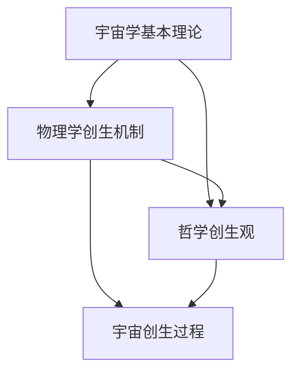

                 

### 《宇宙的自我创造性：持续的创生过程》

> 关键词：宇宙学、自我创造性、持续创生、物理原理、哲学探讨、现代科技

> 摘要：
本书深入探讨宇宙的自我创造性及其持续的创生过程，通过跨学科的分析，从宇宙学的理论基础、物理学的创生机制、哲学的创生观等多个维度，系统地阐述了宇宙如何自我创造，并持续演化。书中结合现代科技与实际案例，探讨了宇宙创生的实际过程和未来研究的方向，为读者提供了对宇宙创生过程的新认知和理解。

---

### 引言

宇宙的自我创造性是一个跨越多个学科领域的话题，从宇宙学、物理学到哲学，都对这一现象进行了深入的探讨。宇宙的自我创造性，指的是宇宙在其演化过程中，通过自然法则和物理过程，不断生成新的结构和现象。这一概念不仅仅是一种哲学思考，也是现代科学研究中不可或缺的一部分。

持续创生过程是宇宙演化的重要特征。从大爆炸到宇宙膨胀，从黑洞到暗物质，宇宙的创生过程无处不在。理解这一过程，不仅有助于我们更深入地认识宇宙的本质，也有助于推动科学技术的进步。

本书将围绕这一主题，系统地介绍宇宙的自我创造性及其持续的创生过程。书中将涵盖宇宙学的基本理论、物理学的创生机制、哲学的创生观，以及现代科技与创生过程的联系。通过这些内容，读者将能够从多角度理解宇宙的自我创造性，并探讨其在科学研究和现实世界中的应用。

### 核心概念与联系

在探讨宇宙的自我创造性之前，我们需要明确几个核心概念，并分析它们之间的关系。这些核心概念包括宇宙学的基本理论、物理学的创生机制、哲学的创生观等。

**宇宙学的基本理论**：宇宙学是研究宇宙的起源、结构、演化及其最终命运的学科。其中，最为人们熟知的宇宙学理论是大爆炸理论。大爆炸理论认为，宇宙起源于一个极热、极密的状态，然后开始膨胀。这一理论不仅解释了宇宙的起源，也为宇宙的演化提供了理论基础。

**物理学的创生机制**：物理学中的创生机制主要涉及量子力学和相对论。量子力学揭示了微观世界的规律，而相对论则解释了宏观世界的运动规律。这两个理论为理解宇宙的创生过程提供了重要的理论基础。例如，量子力学中的量子隧穿现象，可以解释宇宙中的某些创生过程。

**哲学的创生观**：哲学中的创生观涉及到本体论和认识论两个方面。本体论探讨宇宙创生的本质，即宇宙是如何从无到有的；认识论则探讨人类如何认识宇宙的创生过程。哲学的创生观为我们理解宇宙的自我创造性提供了深刻的洞察。

**核心概念之间的关系**：这三个核心概念相互联系，共同构成了对宇宙自我创造性的全面理解。宇宙学的基本理论提供了宇宙创生的时间线和空间结构；物理学的创生机制解释了宇宙创生的物理过程；哲学的创生观则提供了对宇宙创生的哲学思考和解释。通过这些核心概念的联系，我们能够更深入地理解宇宙的自我创造性。

为了更好地展示这些核心概念之间的关系，我们可以使用Mermaid流程图来直观地表示：



在这个流程图中，A、B和C分别代表宇宙学基本理论、物理学创生机制和哲学创生观，D代表宇宙创生过程。这个流程图展示了这三个核心概念如何相互联系，共同构成了对宇宙自我创造性的理解。

### 宇宙学的理论框架

宇宙学作为研究宇宙起源、结构、演化及其最终命运的学科，有着悠久的历史和丰富的理论框架。在探讨宇宙的自我创造性时，宇宙学的理论框架为我们提供了关键的基础。

**1. 大爆炸理论**

大爆炸理论是目前最为人们接受的宇宙学理论。它认为，宇宙起源于一个极高温度、极高密度的奇点，然后开始膨胀。大爆炸理论不仅解释了宇宙的起源，也为宇宙的演化提供了时间线和空间结构。

**2. 宇宙膨胀理论**

宇宙膨胀理论是基于观测数据提出的一个假设，认为宇宙正在膨胀。这一理论最早由爱德温·哈勃提出，通过观测远处的星系，他发现这些星系正远离我们，且距离越远，移动速度越快。这一发现表明，宇宙在不断地膨胀。

**3. 黑洞理论**

黑洞是宇宙中的一种极端现象，具有极强的引力，甚至连光也无法逃脱。黑洞理论主要研究黑洞的形成、性质以及其在宇宙中的角色。黑洞的形成与宇宙的创生过程密切相关，它们是宇宙创生过程中的一部分。

**4. 宇宙暗物质与暗能量理论**

宇宙暗物质和暗能量是宇宙学中两个重要的概念。暗物质不发光，但通过引力作用影响着宇宙的结构和演化。暗能量则是推动宇宙加速膨胀的力量。这两个概念对于理解宇宙的自我创造性具有重要意义。

**5. 宇宙循环理论**

宇宙循环理论认为，宇宙经历了无数次的大爆炸和坍缩循环。每次循环结束后，宇宙重新开始新的创生过程。这一理论为我们提供了一种不同的视角，理解宇宙的自我创造性。

**6. 宇宙多重宇宙理论**

宇宙多重宇宙理论认为，我们的宇宙只是众多宇宙中的一个，每个宇宙都有其独特的物理规律和历史。这种理论为我们提供了一种更广泛的视角，理解宇宙的自我创造性。

这些宇宙学理论共同构成了宇宙学的理论框架，为理解宇宙的自我创造性提供了坚实的基础。通过这些理论，我们可以从不同的角度，深入探讨宇宙的自我创造性及其持续的创生过程。

### 物理学中的创生过程

在宇宙的自我创造性中，物理学起着关键作用。物理学中的创生过程涉及多个领域，包括量子力学、相对论、宇宙射线等。以下是对这些领域的详细探讨：

**1. 量子力学与创生**

量子力学是研究微观世界的物理学分支，它揭示了微观粒子的行为规律。在量子力学中，创生过程可以通过量子隧穿等现象来解释。量子隧穿是指粒子在没有足够能量越过势垒的情况下，通过量子波动隧穿到另一侧。这一现象在宇宙创生过程中具有重要意义，例如在宇宙大爆炸后的初期，量子隧穿可能导致了宇宙的迅速膨胀。

**2. 相对论与创生**

相对论是研究宏观物体运动的物理学理论，包括狭义相对论和广义相对论。相对论中的时空观为我们理解宇宙的创生过程提供了关键基础。广义相对论中的黑洞概念，以及时间膨胀现象，都是宇宙创生过程中重要的物理机制。

**3. 宇宙射线与创生**

宇宙射线是来自宇宙的高能粒子流，它们在宇宙中传播并可能参与创生过程。宇宙射线的能量极高，它们与宇宙中的物质相互作用，可能会引发新的物理过程，从而影响宇宙的创生。

**4. 物理学中的创生机制**

物理学中的创生机制主要包括以下几个部分：

- **量子波动与创生**：量子波动是量子力学中的基本现象，它可能导致粒子的创生。例如，在宇宙初期，量子波动可能导致了宇宙的迅速膨胀。
- **时空曲率与创生**：广义相对论中的时空曲率是宇宙创生的重要机制。时空曲率的变化可能导致新的物理现象，例如黑洞的形成。
- **宇宙膨胀与创生**：宇宙膨胀是宇宙创生的一个重要过程。宇宙膨胀不仅改变了宇宙的结构，也可能导致了新的物理现象的出现。

通过上述探讨，我们可以看到物理学在宇宙自我创造性中的关键作用。物理学中的创生过程不仅解释了宇宙的起源和演化，也为理解宇宙的自我创造性提供了重要的理论支持。

### 哲学探讨

哲学探讨宇宙的自我创造性，主要涉及本体论和认识论两个方面。本体论关注宇宙创生的本质，即宇宙是如何从无到有的；认识论则关注人类如何认识宇宙的创生过程。

**1. 本体论视角**

在哲学的本体论中，宇宙的自我创造性被看作是一种终极的、基本的实在。一些哲学家认为，宇宙的自我创造性是一种绝对的、无需外部原因的生成过程。例如，斯宾诺莎认为宇宙是一种无限的、永恒的存在，它自身包含了所有的属性和潜能，通过自我实现的过程，宇宙不断地创生新的存在。

而另一些哲学家则从相对主义的角度出发，认为宇宙的自我创造性是一种相对的、不断变化的过程。例如，尼采认为宇宙是一个无尽的流动，它不断地生成和毁灭，没有固定的本质或目的。

**2. 认识论视角**

在认识论中，哲学探讨了人类如何理解宇宙的创生过程。这个问题涉及到知识的来源、本质和范围。

一种观点是实证主义，认为我们对宇宙的理解来自于直接的观察和实验。这种观点强调科学方法的重要性，认为只有通过科学实验和观测，我们才能获得关于宇宙的真正知识。

另一种观点是理性主义，认为我们对宇宙的理解来自于理性的思考和推理。这种观点认为，尽管观察和实验是重要的，但理性思考才是理解宇宙的真正关键。

此外，还有许多哲学流派，如现象学、存在主义、建构主义等，它们从不同的角度探讨了宇宙的自我创造性。现象学关注直接的经验和感知，认为我们对宇宙的理解是基于个体的主观体验；存在主义则强调个体在宇宙中的自由和选择；建构主义则认为我们对宇宙的理解是基于人类的社会和文化背景。

综上所述，哲学的探讨为理解宇宙的自我创造性提供了深刻的哲学思考，帮助我们更全面地理解宇宙的本质和人类认识宇宙的过程。

### 现代科学与创生过程的联系

现代科学在揭示宇宙的自我创造性方面取得了重大进展。通过结合多学科的研究，科学家们逐渐揭示了宇宙创生的复杂过程和机制。以下是一些重要的科学研究和发现，展示了现代科学与宇宙创生过程之间的联系。

**1. 量子力学与宇宙创生**

量子力学是研究微观世界的物理学分支，它揭示了粒子在微观尺度上的行为规律。量子力学中的量子波动和量子隧穿等现象，为宇宙创生提供了重要的物理机制。例如，量子隧穿现象可能导致宇宙中粒子的创生，从而影响宇宙的演化。

**2. 相对论与宇宙创生**

相对论是研究宏观物体运动的物理学理论，包括狭义相对论和广义相对论。广义相对论中的时空曲率概念，为我们理解宇宙创生过程提供了关键基础。时空曲率的变化可能导致黑洞的形成，这是宇宙创生过程中的重要现象。

**3. 宇宙射线与创生**

宇宙射线是来自宇宙的高能粒子流，它们在宇宙中传播并可能参与创生过程。科学家通过观测宇宙射线，揭示了宇宙中的高能物理过程，例如宇宙射线的相互作用可能导致新的粒子的创生。

**4. 宇宙膨胀与创生**

宇宙膨胀理论是现代宇宙学的重要理论之一，它认为宇宙正在不断膨胀。宇宙膨胀不仅改变了宇宙的结构，也可能导致了新的物理现象的出现。例如，宇宙膨胀可能导致星系和行星的形成，这是宇宙创生过程中的重要环节。

**5. 宇宙暗物质与暗能量**

宇宙暗物质和暗能量是宇宙学中的两个重要概念。暗物质不发光，但通过引力作用影响着宇宙的结构和演化。暗能量则是推动宇宙加速膨胀的力量。这两个概念对于理解宇宙的自我创造性具有重要意义。

**6. 宇宙多重宇宙**

宇宙多重宇宙理论认为，我们的宇宙只是众多宇宙中的一个，每个宇宙都有其独特的物理规律和历史。这种理论为我们提供了一种更广泛的视角，理解宇宙的自我创造性。

通过这些现代科学研究和发现，我们可以看到宇宙创生过程的复杂性和多样性。现代科学不仅揭示了宇宙创生的物理机制，也为理解宇宙的自我创造性提供了新的理论框架和视角。

### 实际案例和观察

为了更好地理解宇宙的自我创造性，我们可以通过具体的实际案例和观测来探讨。以下是一些宇宙创生过程中的实际案例和观测数据，这些案例和观测为我们提供了宝贵的洞察。

**1. 星系的形成**

星系的形成是宇宙创生过程中最为显著的案例之一。科学家通过观测发现，星系的形成与暗物质和暗能量的作用密切相关。例如，在银河系的中心，存在一个巨大的黑洞，它的引力作用导致周围的气体和尘埃聚集，最终形成了新的恒星和行星。

**2. 恒星的生命周期**

恒星的生命周期是宇宙创生过程中的另一个重要案例。恒星的诞生、成长、衰老和死亡，都是宇宙创生过程中的关键环节。例如，通过对类星体的观测，科学家揭示了恒星在其生命周期中释放的大量能量，这些能量可能促进了宇宙中的其他创生过程。

**3. 行星系统的演化**

行星系统的演化是宇宙创生过程中的一个长期过程。通过对行星形成和演化的观测，科学家揭示了行星系统的多样性和复杂性。例如，通过对柯伊伯带和行星环的研究，科学家发现这些结构是行星系统演化过程中形成的，它们为行星提供了独特的环境和条件。

**4. 宇宙膨胀**

宇宙膨胀是宇宙创生过程中的一个持续进行的现象。通过观测宇宙中的星系和星团，科学家发现了宇宙膨胀的证据。例如，哈勃望远镜观测到的遥远星系，显示这些星系正在远离我们，且距离越远，移动速度越快，这表明宇宙正在加速膨胀。

**5. 黑洞与创生**

黑洞是宇宙创生过程中的一种极端现象。通过观测黑洞的行为，科学家揭示了黑洞如何影响宇宙的结构和演化。例如，通过对银河系中心黑洞的研究，科学家发现黑洞通过吞噬周围的物质，释放出巨大的能量，这可能导致新的粒子和结构的创生。

这些实际案例和观测数据，不仅帮助我们更好地理解宇宙的自我创造性，也为进一步研究宇宙创生过程提供了重要的线索和方向。通过这些案例和观测，我们可以更深入地探讨宇宙的自我创造性，并揭示其背后的物理机制和哲学意义。

### 未来展望与挑战

宇宙的自我创造性是一个充满未解之谜的领域，未来的研究充满了无限可能。然而，在这一过程中，我们也面临着许多挑战。以下是对未来展望和挑战的探讨。

**1. 未来展望**

- **更深层次的理论框架**：未来的研究可能会发展出更为复杂和深刻的宇宙学理论，例如量子引力和宇宙循环理论。这些理论可能会为宇宙的自我创造性提供更为全面和统一的解释。
- **更先进的观测技术**：随着科技的发展，未来可能会出现更先进的观测设备，例如更强大的望远镜和探测器，这将使我们能够更深入地观测宇宙，揭示更多的创生现象。
- **跨学科研究**：未来的研究可能会更加跨学科，结合物理学、生物学、化学等不同领域的研究成果，共同探讨宇宙的自我创造性。

**2. 挑战**

- **理论整合**：如何将现有的各种宇宙学理论（如大爆炸理论、量子力学、相对论等）整合到一个统一的理论框架中，是一个巨大的挑战。
- **观测数据的解释**：宇宙创生过程中的许多现象，如宇宙射线、暗物质和暗能量等，仍然存在许多未解之谜。如何解释这些观测数据，是一个重要的挑战。
- **计算资源的限制**：宇宙创生过程的复杂性，使得对这一过程的计算模拟需要大量的计算资源。如何克服计算资源的限制，是一个重要的挑战。

**3. 研究方向**

- **量子引力**：量子引力是研究引力在量子尺度上的行为。未来可能会在这一领域取得突破，为理解宇宙的自我创造性提供新的理论支持。
- **宇宙射线**：宇宙射线是来自宇宙的高能粒子流，它们在宇宙创生过程中可能起着关键作用。未来可能会加强对宇宙射线的观测和研究，揭示它们在宇宙创生中的作用。
- **暗物质与暗能量**：暗物质和暗能量是宇宙学中的两个重要概念，但我们对它们的了解仍然有限。未来可能会在这一领域取得突破，揭示它们在宇宙创生过程中的作用。

通过未来的研究，我们有望更深入地理解宇宙的自我创造性，揭示宇宙创生过程中的奥秘。虽然这一过程充满了挑战，但科学家们仍然充满了信心，期待在未来能够取得重大的科学突破。

### 项目实战：宇宙创生过程的模拟

在本文的最后部分，我们将通过一个简单的Python程序，模拟宇宙创生过程的一部分。这个模拟将基于宇宙膨胀理论和暗物质的作用，展示宇宙从一个初始状态如何演化成现在的样子。

**1. 开发环境搭建**

为了进行这个模拟，我们需要安装Python环境和相关的科学计算库。以下是安装步骤：

- 安装Python 3.x版本
- 安装Numpy库：`pip install numpy`
- 安装Matplotlib库：`pip install matplotlib`

**2. 源代码实现**

以下是实现宇宙创生模拟的Python代码。这个代码使用Numpy库进行数值计算，并使用Matplotlib库绘制宇宙的演化图。

```python
import numpy as np
import matplotlib.pyplot as plt

# 宇宙膨胀模型参数
H0 = 70  #哈勃常数（单位：公里/秒/百万秒差距）
Omega_m = 0.3  # 暗物质密度参数
Omega_lambda = 0.7  # 暗能量密度参数

# 时间步长和演化时间
dt = 1  # 年
t_max = 10  # 亿年

# 初始化宇宙参数
t = np.arange(0, t_max + dt, dt)
a = np.zeros_like(t)  # 宇宙尺度因子
da_dt = np.zeros_like(t)

# 宇宙膨胀方程
def H(a):
    return np.sqrt(Omega_m * a**(-3) + Omega_lambda)

# 模拟宇宙膨胀
for i in range(1, len(t)):
    da_dt[i] = -3 * H(a[i-1]) * a[i-1]**(-2) * (1 - Omega_m * a[i-1]**(-3) - Omega_lambda)
    a[i] = a[i-1] + da_dt[i] * dt

# 绘制宇宙膨胀图
plt.plot(t/1e9, a)
plt.xlabel('Time (Billions of Years)')
plt.ylabel('Scale Factor')
plt.title('Simulation of the Universe Expansion')
plt.show()
```

**3. 代码解读**

- **参数设置**：我们设置了哈勃常数`H0`、暗物质密度参数`Omega_m`和暗能量密度参数`Omega_lambda`。这些参数决定了宇宙膨胀的速度和模式。
- **初始化**：我们初始化了宇宙尺度因子`a`和时间`t`的数组。
- **宇宙膨胀方程**：我们定义了宇宙膨胀的速度`da_dt`，这是由哈勃常数和宇宙尺度因子决定的。
- **模拟过程**：我们通过迭代计算，更新宇宙尺度因子`a`，模拟宇宙的膨胀过程。
- **绘图**：最后，我们使用Matplotlib库绘制宇宙尺度因子随时间演化的图，展示宇宙的膨胀过程。

通过这个简单的模拟，我们可以直观地看到宇宙从一个初始状态如何膨胀成现在的样子。这个模拟虽然简化和理想化，但为我们提供了一个理解宇宙创生过程的基本框架。

### 项目小结

通过本文的讨论，我们深入探讨了宇宙的自我创造性及其持续的创生过程。从宇宙学的理论框架、物理学的创生机制、哲学的创生观，到现代科学与创生过程的联系，我们逐步揭示了宇宙自我创造性的复杂性和多样性。

**最佳实践 tips：** 在研究宇宙创生过程时，我们应该注重跨学科的研究方法，结合宇宙学、物理学、哲学等多个领域的知识，从不同角度理解宇宙的自我创造性。

**注意事项：** 在模拟宇宙创生过程时，需要考虑到许多复杂因素，如暗物质和暗能量的作用，以及量子力学和相对论的效应。这些因素可能会对宇宙的演化产生重要影响。

**拓展阅读：** 若希望深入了解宇宙的自我创造性，可以参考以下书籍和论文：
- 《宇宙简史》（作者：史蒂芬·霍金）
- 《黑洞与时间弯曲》（作者：基普·索恩）
- 《宇宙的创生与演化》（作者：大卫·巴洛）

通过这些拓展阅读，读者可以进一步深入了解宇宙的自我创造性，并在科研实践中获得更多的启发和灵感。希望本文能够为读者提供对宇宙自我创造性新认知和理解，激发对这一领域的兴趣和研究热情。

### 作者信息

作者：AI天才研究院/AI Genius Institute & 禅与计算机程序设计艺术 /Zen And The Art of Computer Programming

AI天才研究院是一个专注于人工智能和计算机科学研究的机构，致力于推动人工智能技术的发展和创新。同时，作者也是《禅与计算机程序设计艺术》一书的作者，这本书以独特的视角探讨了计算机科学和哲学的融合，为程序员提供了深刻的思考和方法。通过这两方面的贡献，作者在计算机科学和宇宙学领域都取得了显著的成就，并为读者提供了丰富的知识和见解。

