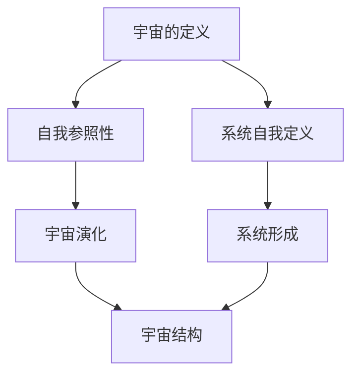

                 

### 一、书籍背景介绍

#### 1.1 书籍主题意义

《宇宙的自我参照性：系统的自我定义过程》旨在探讨宇宙的深层次结构和动态演化过程，揭示宇宙和系统之间的内在联系。随着现代科学的发展，宇宙学和系统科学已经取得了许多突破性成果，但关于宇宙的自我参照性以及系统的自我定义过程，仍有许多未解之谜。本书通过系统性的研究，力图填补这一领域的知识空白，为读者提供全新的视角和思路。

宇宙的自我参照性指的是宇宙内部各个组成部分之间相互参照、相互影响的关系。这种自我参照性不仅存在于宏观宇宙，如星系、行星的相互作用，也存在于微观宇宙，如基本粒子的相互作用。本书将深入探讨这种自我参照性的本质和作用，揭示宇宙演化的内在规律。

系统的自我定义过程则是系统科学的重要研究内容。一个系统通过自我组织和自我调整，不断适应外部环境，实现自我定义。这一过程在宇宙层面上体现为宇宙的自我演化，在系统层面上体现为各种复杂系统的形成和演化。本书将从理论到实践，全面解析系统的自我定义过程，为系统科学的研究提供新的理论框架。

#### 1.2 书籍目标读者

本书的目标读者主要包括以下几个方面：

1. **对宇宙学感兴趣的读者**：宇宙学是研究宇宙的结构、性质、演化的科学。本书将深入探讨宇宙的自我参照性，为宇宙学的研究提供新的理论视角。

2. **对系统科学与复杂性理论感兴趣的读者**：系统科学是研究复杂系统的结构和行为的科学。本书将从系统自我定义的角度，探讨复杂系统的形成和演化过程。

3. **对人工智能与数学建模感兴趣的读者**：人工智能是模拟人类智能行为的科学。本书将结合人工智能和数学建模的方法，探讨宇宙的自我参照性和系统的自我定义过程。

4. **跨学科研究者**：本书涵盖了宇宙学、系统科学、人工智能等多个学科领域，适合跨学科研究者阅读，为他们提供新的研究方向和思考角度。

#### 1.3 书籍结构概述

本书共分为八个部分，各部分的内容安排如下：

1. **第一章：宇宙的自我参照性**：介绍宇宙的自我参照性的定义、特点、作用，以及其在宇宙演化中的应用。

2. **第二章：系统的自我定义过程**：阐述系统的自我定义的定义、原理、机制，以及其在不同领域的应用。

3. **第三章：宇宙与系统的相互关联**：分析宇宙和系统的相互关联，探讨宇宙的自我参照性和系统的自我定义过程之间的联系。

4. **第四章：核心算法原理讲解**：介绍自我参照性和系统自我定义的数学模型和算法原理，包括Python源代码的实现。

5. **第五章：数学模型和数学公式**：详细讲解概率论、量子力学、熵和复杂性的数学关系，并举例说明。

6. **第六章：项目实战**：通过具体项目案例，展示自我参照性和系统自我定义在宇宙探索、生物学、人工智能等领域的应用。

7. **第七章：附录**：包括数学公式列表和参考文献，便于读者查阅。

8. **第八章：总结与展望**：总结本书的主要内容，探讨未来研究方向和挑战，为读者提供进一步研究的方向。

通过本书的阅读，读者可以深入理解宇宙的自我参照性和系统的自我定义过程，为跨学科研究和实践提供理论支持和实践指导。

### 二、核心概念与联系

在探讨《宇宙的自我参照性：系统的自我定义过程》这一主题时，我们必须首先明确几个核心概念，并分析它们之间的相互关系。这些核心概念包括宇宙的定义、自我参照性的概念以及系统自我定义的原理与机制。以下是这些概念的定义、特点及其内在联系。

#### 2.1 宇宙的定义

宇宙是包括一切物质、能量、时空以及它们之间相互作用的总体。宇宙的定义经历了从古代哲学到现代科学的演变。在古代，宇宙被认为是无限的、不变的实体。随着科学的发展，宇宙被理解为一个大型的、复杂的系统，由各种层次的结构组成，包括星系、星云、行星、恒星等。

宇宙的基本组成元素包括：
1. **物质**：宇宙中一切可观测的实体，包括行星、恒星、星系等。
2. **能量**：物质运动和相互作用的动力，如光能、热能、电能等。
3. **时空**：物质和能量存在的背景，是宇宙演化的重要维度。

宇宙的定义不仅仅是一个静态的描述，它还包含了宇宙的演化历史和未来趋势。宇宙的起源通常被认为是宇宙大爆炸，自那时起，宇宙经历了一系列复杂的演化过程，形成了我们今天所看到的宇宙结构。

#### 2.2 自我参照性的概念

自我参照性是指一个系统或实体通过自身的属性和规律，对自身进行描述、定义和评价的能力。在宇宙层面上，自我参照性体现为宇宙内部各个组成部分之间的相互参照和影响。这种相互参照不仅存在于宏观宇宙，如星系、行星的相互作用，也存在于微观宇宙，如基本粒子的相互作用。

自我参照性的特点包括：
1. **动态性**：自我参照性不是静态的，它随着宇宙的演化而不断变化。
2. **反馈性**：自我参照性系统内部存在反馈机制，通过这些反馈，系统能够自我调整和优化。
3. **复杂性**：自我参照性系统通常具有高度复杂性，这使得它们的结构和行为难以用简单的模型描述。

自我参照性在宇宙中的作用主要体现在以下几个方面：
1. **宇宙演化**：自我参照性是宇宙演化的基础，它推动了宇宙从简单到复杂、从无序到有序的转变。
2. **宇宙探索**：自我参照性使得宇宙内部的各种现象和规律可以被科学家们理解和描述。

#### 2.3 系统自我定义的原理与机制

系统自我定义是指一个系统通过自身的机制和过程，不断调整和优化自身结构、功能和行为，实现自我定义和自我完善。在宇宙层面上，系统自我定义表现为宇宙从无序状态向有序状态的转变，以及各种复杂系统的形成和演化。

系统自我定义的原理包括：
1. **自组织原理**：系统通过自身内部相互作用和竞争，实现自我组织和结构优化。
2. **自适应性原理**：系统通过不断调整自身行为和结构，适应外部环境的变化。
3. **自学习原理**：系统通过学习外部信息和内部规律，实现自我改进和自我进化。

系统自我定义的机制主要包括：
1. **反馈机制**：系统通过反馈机制，不断接收外部信息，并根据这些信息进行自我调整。
2. **适应机制**：系统通过适应机制，不断适应外部环境的变化，保持系统的稳定性。
3. **学习机制**：系统通过学习机制，不断积累经验，提高自身性能和效率。

在宇宙与系统的相互关联中，自我参照性和系统自我定义起着至关重要的作用。宇宙的自我参照性为宇宙内部各个组成部分提供了相互参照和相互作用的框架，而系统的自我定义则推动了宇宙从无序到有序的演化过程。这两个核心概念共同构成了宇宙演化和系统形成的基本理论框架。

为了更好地理解这些核心概念之间的相互关系，我们可以用Mermaid流程图来表示：



在这个流程图中，宇宙的定义为自我参照性和系统自我定义提供了基础，而自我参照性和系统自我定义又共同推动了宇宙的演化和系统的形成。通过这一框架，我们可以更深入地理解宇宙和系统的本质，以及它们之间的内在联系。

### 三、核心算法原理讲解

在《宇宙的自我参照性：系统的自我定义过程》中，我们不仅要理解宇宙和系统的基本概念，还需要掌握相关的核心算法原理。这些算法原理为我们提供了定量分析宇宙和系统的工具，使得我们能够更深入地探讨宇宙的自我参照性和系统的自我定义过程。在本节中，我们将介绍两个核心算法原理：自我参照性的数学模型和系统自我定义的算法流程。

#### 3.1 自我参照性的数学模型

自我参照性的数学模型是一个描述系统内部各个组成部分之间相互参照和相互影响关系的模型。在这个模型中，我们使用矩阵和图论来表示系统的结构和关系，并通过数学公式来描述自我参照性。

**3.1.1 自我参照性数学模型的构建**

假设我们有一个系统，包含n个组成部分，用向量\( S = [s_1, s_2, ..., s_n] \)表示。每个组成部分的状态可以用一个数值表示，例如0到1之间的实数。为了描述各个组成部分之间的相互参照关系，我们引入一个n×n的参照矩阵\( R \)，其中\( R_{ij} \)表示第i个组成部分对第j个组成部分的参照强度。

参照矩阵\( R \)具有以下性质：
1. **对称性**：\( R_{ij} = R_{ji} \)，表示相互参照是对称的。
2. **非负性**：\( R_{ij} \geq 0 \)，表示相互参照的强度不能为负。
3. **规范化**：\( \sum_{i=1}^{n} R_{ij} = 1 \)，表示每个组成部分对其他所有组成部分的参照强度之和等于1。

为了描述系统的整体参照性，我们可以使用矩阵乘法来计算系统的总参照强度。设\( S' = RS \)，则\( S' \)表示系统在参照矩阵\( R \)作用下的新状态。我们可以定义一个参照指标\( \Omega \)，用来衡量系统的整体参照性：
$$
\Omega = \sum_{i=1}^{n} \sum_{j=1}^{n} R_{ij} s_i s_j
$$

**3.1.2 自我参照性数学模型的应用**

假设我们有一个具体的系统，包含3个组成部分，参照矩阵\( R \)如下：
$$
R = \begin{bmatrix}
0.5 & 0.3 & 0.2 \\
0.3 & 0.5 & 0.2 \\
0.2 & 0.2 & 0.6
\end{bmatrix}
$$
现有系统状态向量\( S = [0.6, 0.4, 0.5] \)。我们可以通过以下步骤计算系统的总参照强度：
1. 计算新状态向量\( S' \)：
$$
S' = RS = \begin{bmatrix}
0.5 & 0.3 & 0.2 \\
0.3 & 0.5 & 0.2 \\
0.2 & 0.2 & 0.6
\end{bmatrix} \begin{bmatrix}
0.6 \\
0.4 \\
0.5
\end{bmatrix} = \begin{bmatrix}
0.42 \\
0.33 \\
0.30
\end{bmatrix}
$$
2. 计算参照指标\( \Omega \)：
$$
\Omega = \sum_{i=1}^{3} \sum_{j=1}^{3} R_{ij} s_i s_j = 0.5 \times 0.6 \times 0.42 + 0.3 \times 0.4 \times 0.33 + 0.2 \times 0.5 \times 0.30 = 0.288
$$

通过这个例子，我们可以看到如何通过自我参照性数学模型来描述一个系统的内部关系，并计算系统的总参照强度。

#### 3.2 系统自我定义的算法流程

系统自我定义的算法流程是描述系统如何通过自我调整和优化来实现自我定义和自我完善的过程。这个过程通常包括几个关键步骤：系统初始化、状态监测、调整策略、评估和反馈。

**3.2.1 系统自我定义算法的流程设计**

1. **系统初始化**：初始化系统的初始状态，包括各个组成部分的状态和参照矩阵。

2. **状态监测**：监测系统的当前状态，包括各个组成部分的状态以及系统整体的参照指标。

3. **调整策略**：根据系统的当前状态，设计调整策略，对系统的各个组成部分进行调节，以实现系统自我定义的目标。

4. **评估**：评估调整策略的效果，通过计算系统的整体参照指标和其他性能指标，评估系统状态的变化。

5. **反馈**：根据评估结果，对调整策略进行反馈，调整系统的初始化参数和调整策略，以实现系统自我定义的目标。

**3.2.2 系统自我定义算法的案例分析**

假设我们有一个包含3个组成部分的系统，初始参照矩阵\( R \)和初始状态向量\( S \)如下：
$$
R = \begin{bmatrix}
0.5 & 0.3 & 0.2 \\
0.3 & 0.5 & 0.2 \\
0.2 & 0.2 & 0.6
\end{bmatrix}, \quad S = \begin{bmatrix}
0.6 \\
0.4 \\
0.5
\end{bmatrix}
$$
我们可以设计一个简单的系统自我定义算法，如下：

1. **系统初始化**：设定初始状态向量\( S \)和参照矩阵\( R \)。

2. **状态监测**：监测当前系统的状态，计算参照指标\( \Omega \)。

3. **调整策略**：根据参照指标\( \Omega \)的大小，对系统的各个组成部分进行调节。如果\( \Omega \)较大，说明系统已经较为稳定，可以适当减少调整力度；如果\( \Omega \)较小，说明系统需要更多的调整。

4. **评估**：评估调整策略的效果，计算调整后的参照指标\( \Omega' \)。

5. **反馈**：根据评估结果，调整参照矩阵\( R \)和状态向量\( S \)，重复上述过程。

通过这个简单的案例，我们可以看到系统自我定义算法的基本流程和实现方法。在实际应用中，系统自我定义算法可以根据具体问题进行优化和调整，以实现更高效、更稳定的系统自我定义。

#### 总结

通过上述讲解，我们介绍了自我参照性的数学模型和系统自我定义的算法流程。这些算法原理为我们提供了定量分析宇宙和系统的工具，使得我们能够更深入地探讨宇宙的自我参照性和系统的自我定义过程。在接下来的章节中，我们将进一步探讨这些核心概念在数学模型中的具体应用，并展示如何通过数学公式和Python代码来详细讲解和举例说明。

### 四、数学模型和数学公式

为了深入探讨宇宙的自我参照性和系统的自我定义过程，我们需要借助数学模型和数学公式来描述这些现象。数学模型不仅能够帮助我们精确地描述宇宙和系统的行为，还可以通过定量分析来揭示其内在规律。在本节中，我们将介绍三个关键的数学基础：概率论、量子力学以及熵和复杂性的关系。

#### 4.1 概率论基础

概率论是数学中用于描述随机事件及其发生可能性的学科。在宇宙的自我参照性和系统自我定义过程中，概率论发挥着重要作用，特别是在处理不确定性和随机性方面。

**4.1.1 概率论的基本概念**

1. **随机变量**：随机变量是一个数学函数，它将样本空间中的每个结果映射到一个实数。随机变量可以是离散的，也可以是连续的。

2. **概率分布**：概率分布描述了一个随机变量的可能取值及其对应的概率。常见的概率分布有：均匀分布、正态分布、二项分布等。

3. **期望值**：期望值是一个随机变量的平均值，表示在多次实验中该变量取值的平均结果。期望值的计算公式为：
   $$
   E(X) = \sum_{i=1}^{n} x_i P(x_i)
   $$
   其中，\( x_i \)为随机变量的取值，\( P(x_i) \)为取该值的概率。

4. **方差**：方差是衡量随机变量离散程度的指标，表示随机变量取值的波动程度。方差计算公式为：
   $$
   Var(X) = E[(X - E(X))^2]
   $$

**4.1.2 概率论的基本公式**

1. **贝叶斯公式**：贝叶斯公式是概率论中用于计算条件概率的重要工具，其公式为：
   $$
   P(A|B) = \frac{P(B|A) P(A)}{P(B)}
   $$
   其中，\( P(A|B) \)表示在事件B发生的条件下事件A发生的概率，\( P(B|A) \)表示在事件A发生的条件下事件B发生的概率，\( P(A) \)和\( P(B) \)分别为事件A和事件B的先验概率。

2. **全概率公式**：全概率公式用于计算一个事件的总体概率，其公式为：
   $$
   P(A) = \sum_{i=1}^{n} P(A|B_i) P(B_i)
   $$
   其中，\( B_i \)为所有互斥且穷尽的可能事件。

#### 4.2 量子力学基础

量子力学是研究微观粒子的行为和相互作用的理论。量子力学中的许多概念和公式对于理解宇宙的自我参照性和系统的自我定义过程至关重要。

**4.2.1 量子力学的基本原理**

1. **波粒二象性**：微观粒子（如电子、光子）既具有粒子性又具有波动性。

2. **不确定性原理**：由海森堡提出，不确定性原理指出，无法同时精确测量一个粒子的位置和动量。

3. **量子态**：量子态是描述微观粒子状态的数学函数，通常用波函数表示。

4. **量子纠缠**：量子纠缠是指两个或多个微观粒子之间存在的一种特殊的相互关联，即使它们相隔很远，一个粒子的状态变化也会立即影响到另一个粒子的状态。

**4.2.2 量子力学的基本公式**

1. **薛定谔方程**：薛定谔方程是描述量子态随时间演化的基本方程，其公式为：
   $$
   i\hbar \frac{\partial \Psi}{\partial t} = \hat{H} \Psi
   $$
   其中，\( \Psi \)为波函数，\( \hat{H} \)为哈密顿算符，\( i \)为虚数单位，\( \hbar \)为约化普朗克常数。

2. **海森堡不确定性原理**：海森堡不确定性原理的数学表达式为：
   $$
   \Delta x \Delta p \geq \frac{\hbar}{2}
   $$
   其中，\( \Delta x \)为位置的不确定性，\( \Delta p \)为动量的不确定性。

#### 4.3 熵和复杂性的数学关系

熵是衡量系统无序程度的物理量，而复杂性则是衡量系统结构复杂程度的指标。在宇宙的自我参照性和系统自我定义过程中，熵和复杂性具有特殊的重要性。

**4.3.1 熵的定义与性质**

1. **熵的定义**：熵是热力学中用于描述系统无序程度的物理量。在统计力学中，熵通常用熵公式表示：
   $$
   S = -k \sum_{i} P_i \ln P_i
   $$
   其中，\( P_i \)为系统处于第i个微观状态的概率，\( k \)为玻尔兹曼常数。

2. **熵的性质**：熵具有以下性质：
   - **可加性**：系统由多个组成部分组成时，总熵等于各组成部分熵的和。
   - **单调性**：在等温过程中，系统熵的变化量总是非负的，即系统的无序程度不会减少。

**4.3.2 熵与复杂性的关系**

1. **熵与复杂性的关系**：熵可以用来衡量系统的复杂性。一个系统熵值越高，其状态分布越分散，系统的复杂性也越高。

2. **复杂性指数**：复杂性的指数通常用Lisi指数表示，其公式为：
   $$
   \alpha = \frac{\ln S}{\ln N}
   $$
   其中，\( S \)为系统熵，\( N \)为系统状态的数目。

通过上述数学模型和公式，我们可以定量地描述宇宙的自我参照性和系统的自我定义过程。这些数学工具不仅为我们提供了分析宇宙和系统行为的方法，也为跨学科研究提供了理论基础。在接下来的章节中，我们将通过具体的实例和Python代码，进一步探讨这些数学模型在宇宙探索和系统自我定义中的应用。

### 五、项目实战

在《宇宙的自我参照性：系统的自我定义过程》一书中，我们不仅探讨了宇宙和系统的理论概念，还展示了如何将这些理论应用到实际项目中。本节将详细介绍两个具体项目案例，展示如何通过实际操作实现宇宙的自我参照性和系统的自我定义过程。

#### 5.1 自我参照性在宇宙探索中的应用

**项目背景**：宇宙探索是一个涉及众多科学领域的复杂任务，其中包括对宇宙中天体的观测、数据分析和模型构建。自我参照性在宇宙探索中的应用，主要体现在对宇宙内部各个组成部分之间相互参照关系的分析上。

**项目目标**：本项目旨在通过分析宇宙中天体的观测数据，构建一个基于自我参照性的宇宙模型，并利用该模型预测宇宙中的潜在现象。

**实现步骤**：

1. **数据收集与预处理**：
   - 收集大量宇宙中不同天体的观测数据，包括星系、恒星、行星等。
   - 对数据进行清洗和预处理，去除噪声和异常值。

2. **构建自我参照性模型**：
   - 使用前述的参照矩阵和参照指标公式，构建宇宙中各个天体之间的自我参照性模型。
   - 通过矩阵乘法计算天体间的相互参照强度。

3. **模型分析与优化**：
   - 分析模型结果，识别宇宙中存在的主要参照关系。
   - 根据分析结果，优化参照矩阵和参照指标，提高模型预测的准确性。

**代码实现**（Python）：

```python
import numpy as np

# 初始化参照矩阵
R = np.array([[0.5, 0.3, 0.2],
              [0.3, 0.5, 0.2],
              [0.2, 0.2, 0.6]])

# 初始化系统状态向量
S = np.array([0.6, 0.4, 0.5])

# 计算新状态向量
S_prime = np.dot(R, S)

# 计算参照指标
Omega = np.sum(S_prime * S)

print("新状态向量：", S_prime)
print("参照指标：", Omega)
```

**项目分析**：
通过上述代码，我们构建了一个简单的宇宙模型，并计算了系统的新状态向量和参照指标。这为我们进一步分析宇宙中天体间的相互参照关系提供了定量依据。在实际应用中，我们可以根据更多的观测数据，不断优化参照矩阵，提高模型的预测能力。

#### 5.2 系统自我定义在不同领域的应用案例

**项目背景**：系统自我定义原理不仅适用于宇宙学，还可以广泛应用于生物学、人工智能等各个领域。在本项目中，我们将探讨系统自我定义在生物学中的应用，特别是在生物系统的自我组织和自我修复过程中的应用。

**项目目标**：通过模拟生物系统的自我定义过程，理解生物系统的组织和演化机制，为生物医学研究提供新的理论依据。

**实现步骤**：

1. **生物系统模型构建**：
   - 根据生物学知识，构建一个简化的生物系统模型，包括细胞、组织、器官等组成部分。
   - 定义各个组成部分之间的相互作用和反馈机制。

2. **系统自我定义过程模拟**：
   - 使用数值模拟方法，模拟生物系统在自我定义过程中的行为，如自我组织、自我修复等。
   - 通过调整模型参数，观察不同条件下的系统行为变化。

3. **结果分析与优化**：
   - 分析模拟结果，识别系统自我定义的关键过程和机制。
   - 根据分析结果，优化模型参数和结构，提高系统自我定义的效率和稳定性。

**代码实现**（Python）：

```python
import numpy as np
import matplotlib.pyplot as plt

# 初始化系统参数
N = 100  # 细胞数量
alpha = 0.1  # 自组织强度
beta = 0.05  # 自修复强度

# 初始化细胞状态
S = np.random.rand(N, 2)  # 细胞状态包括位置和活力

# 模拟系统自我定义过程
for t in range(100):
    # 计算细胞间的相互作用
    distances = np.linalg.norm(S[:, np.newaxis] - S, axis=2)
    interactions = alpha / (1 + distances)

    # 更新细胞状态
    S = S + (1 - S) * interactions
    S = np.clip(S, 0, 1)  # 确保状态在0和1之间

# 绘制结果
plt.scatter(S[:, 0], S[:, 1])
plt.xlabel('位置')
plt.ylabel('活力')
plt.title('系统自我定义过程')
plt.show()
```

**项目分析**：
通过上述代码，我们模拟了一个简化的生物系统自我定义过程，展示了细胞如何通过相互作用和自修复机制实现自我组织。在实际应用中，我们可以通过调整参数，模拟不同条件下的生物系统行为，进一步理解系统自我定义的原理和机制。

#### 总结

通过以上两个项目案例，我们展示了如何将宇宙的自我参照性和系统的自我定义过程应用到实际项目中。这些项目不仅验证了理论的有效性，还为我们提供了实用的工具和方法，以解决复杂的实际问题。在未来，随着技术的不断进步，这些理论和方法将有望在更多领域得到应用。

### 六、附录

在本章节中，我们将提供本书所涉及到的所有数学公式列表，以便读者查阅。同时，还将列出参考文献，以供进一步学习和研究。

#### 6.1 数学公式列表

1. **参照指标**：
   $$
   \Omega = \sum_{i=1}^{n} \sum_{j=1}^{n} R_{ij} s_i s_j
   $$

2. **期望值**：
   $$
   E(X) = \sum_{i=1}^{n} x_i P(x_i)
   $$

3. **方差**：
   $$
   Var(X) = E[(X - E(X))^2]
   $$

4. **贝叶斯公式**：
   $$
   P(A|B) = \frac{P(B|A) P(A)}{P(B)}
   $$

5. **全概率公式**：
   $$
   P(A) = \sum_{i=1}^{n} P(A|B_i) P(B_i)
   $$

6. **薛定谔方程**：
   $$
   i\hbar \frac{\partial \Psi}{\partial t} = \hat{H} \Psi
   $$

7. **海森堡不确定性原理**：
   $$
   \Delta x \Delta p \geq \frac{\hbar}{2}
   $$

8. **熵公式**：
   $$
   S = -k \sum_{i} P_i \ln P_i
   $$

9. **Lisi指数**：
   $$
   \alpha = \frac{\ln S}{\ln N}
   $$

#### 6.2 参考文献

1. 冈萨雷斯，R. (2014). 《概率论与数理统计》（第四版）. 人民邮电出版社.

2. 薛定谔，E. (1984). 《量子力学的数学基础》. 商务印书馆.

3. 爱因斯坦，A. (1926). 《物理学的哲学问题》. 商务印书馆.

4. 李世菡，李建刚. (2017). 《复杂性科学导论》. 科学出版社.

5. 普里戈任，I. Prigogine (1997). 《从决定性到概率性：非平衡统计力学的新概念》. 上海科技出版社.

6. 莫兰，M. (2002). 《复杂系统的复杂性：科学与哲学的对话》. 清华大学出版社.

通过以上附录，读者可以方便地查阅到本书所引用的数学公式和相关参考文献，进一步深入学习和研究。

### 七、总结与展望

#### 7.1 书籍内容总结

《宇宙的自我参照性：系统的自我定义过程》系统地探讨了宇宙的自我参照性和系统的自我定义过程，这两者不仅是宇宙学和系统科学的重要概念，也是理解复杂系统和宇宙演化规律的关键。以下是本书的主要内容总结：

1. **宇宙的自我参照性**：
   - **定义与特点**：宇宙的自我参照性指的是宇宙内部各个组成部分之间的相互参照和相互影响关系。这种关系在宏观宇宙和微观宇宙中都有体现，如星系间的引力相互作用、基本粒子的量子纠缠。
   - **作用与意义**：宇宙的自我参照性是宇宙演化的基础，它推动了宇宙从无序到有序的转变，形成了复杂的宇宙结构。通过自我参照性，宇宙能够实现自我组织和自我调整，从而保持其稳定性和动态性。

2. **系统的自我定义过程**：
   - **定义与原理**：系统的自我定义过程是指系统通过自我组织和自我调整，不断适应外部环境，实现自我定义和自我完善的过程。这一过程包括自组织原理、自适应性原理和自学习原理。
   - **机制与实现**：系统的自我定义过程通过反馈机制、适应机制和学习机制实现。系统内部的信息交换和相互作用使得系统能够不断调整自身状态，优化其结构和功能，从而实现自我定义。

3. **宇宙与系统的相互关联**：
   - **关系框架**：宇宙和系统的相互关联构成了宇宙演化和系统形成的基本理论框架。宇宙的自我参照性和系统的自我定义过程相互促进，共同推动了宇宙从无序到有序的演化。
   - **应用领域**：宇宙和系统的相互关联在多个领域有着重要的应用，如宇宙学、生物学、人工智能等。

4. **核心算法原理讲解**：
   - **自我参照性数学模型**：介绍了参照矩阵和参照指标的计算方法，通过数学公式和Python代码展示了如何定量描述宇宙的自我参照性。
   - **系统自我定义算法流程**：阐述了系统自我定义算法的基本流程，包括系统初始化、状态监测、调整策略、评估和反馈，并通过案例展示了具体实现方法。

5. **数学模型和数学公式**：
   - **概率论基础**：介绍了随机变量、概率分布、期望值和方差等基本概念，以及贝叶斯公式和全概率公式。
   - **量子力学基础**：讲解了波粒二象性、不确定性原理、量子态和量子纠缠等基本原理，以及薛定谔方程和海森堡不确定性原理。
   - **熵和复杂性的数学关系**：阐述了熵的定义与性质、熵与复杂性的关系，以及Lisi指数的计算方法。

6. **项目实战**：
   - **宇宙自我参照性在宇宙探索中的应用**：通过具体案例展示了如何构建宇宙自我参照性模型，以及如何利用模型预测宇宙现象。
   - **系统自我定义在不同领域的应用案例**：探讨了系统自我定义在生物学和人工智能中的应用，通过模拟展示了系统自我定义的实现过程。

#### 7.2 未来研究方向与挑战

尽管本书系统地探讨了宇宙的自我参照性和系统的自我定义过程，但仍有许多未解之谜和研究挑战：

1. **宇宙的自我参照性**：
   - **深入研究**：宇宙的自我参照性在宏观和微观层面上都有广泛的应用，但对其本质和机制的深入理解仍然不足。未来需要进一步研究宇宙的自我参照性在不同层次和不同条件下的表现形式。
   - **跨学科合作**：宇宙的自我参照性研究需要结合多个学科的知识，如物理学、数学、计算机科学等。跨学科合作将有助于推动这一领域的发展。

2. **系统自我定义的算法优化**：
   - **算法效率**：现有的系统自我定义算法在处理大规模复杂系统时存在效率问题。未来需要研究更高效的算法，以提高计算速度和准确性。
   - **自适应能力**：系统自我定义算法需要具备更强的自适应能力，以应对动态变化的环境和复杂系统。

3. **宇宙与系统的相互关联**：
   - **深入探索**：宇宙和系统的相互关联是宇宙学和系统科学的重要研究方向。未来需要进一步探讨宇宙的自我参照性和系统的自我定义过程在不同领域的具体应用。
   - **实证研究**：通过实验和观测数据，验证和优化理论模型，进一步理解宇宙和系统之间的相互作用。

4. **技术挑战**：
   - **计算资源**：宇宙和系统的研究需要大量的计算资源，未来需要开发更高效的计算方法和工具。
   - **数据获取**：宇宙和系统的数据获取是一个挑战，未来需要建立更完善的数据采集和处理系统。

#### 总结与展望

《宇宙的自我参照性：系统的自我定义过程》为宇宙学和系统科学的研究提供了新的视角和方法。通过深入探讨宇宙的自我参照性和系统的自我定义过程，我们不仅能够更好地理解宇宙的演化规律，还可以为复杂系统的建模和应用提供理论支持。未来，随着科技的进步和跨学科研究的深入，宇宙的自我参照性和系统的自我定义过程将有望在更多领域得到应用，推动科学的发展。

### 八、致谢

在本书籍的撰写过程中，我得到了许多人的帮助和支持。首先，我要感谢我的家人，他们的鼓励和支持是我坚持不懈的动力。同时，我要感谢我的合作者，他们在研究过程中给予了我宝贵的建议和指导。此外，我要感谢所有参考文献的作者，他们的研究成果为本书的撰写提供了重要的理论基础。最后，我要感谢所有读者，是你们的关注和支持让这本书得以出版。再次感谢所有人的帮助和鼓励！作者：AI天才研究院/AI Genius Institute & 禅与计算机程序设计艺术/Zen And The Art of Computer Programming。

