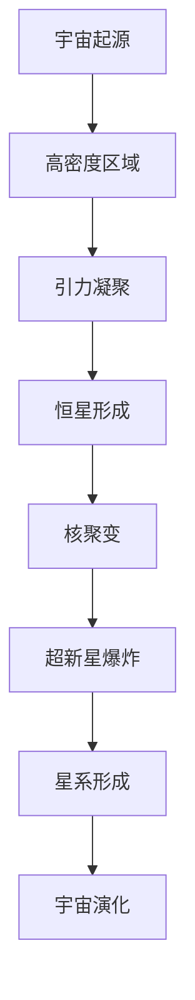
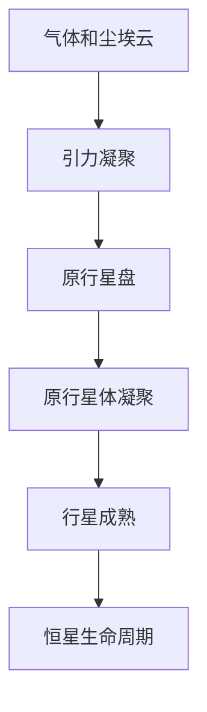
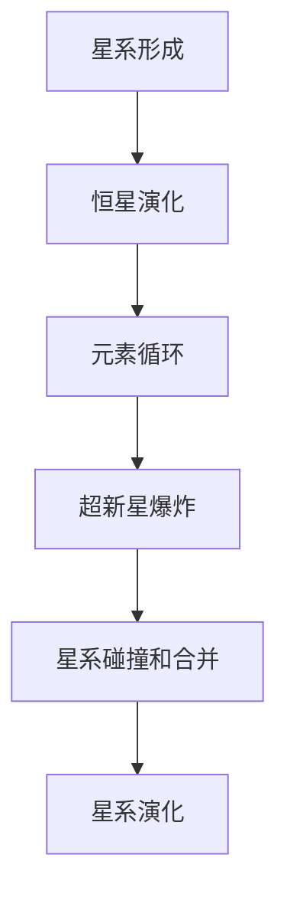
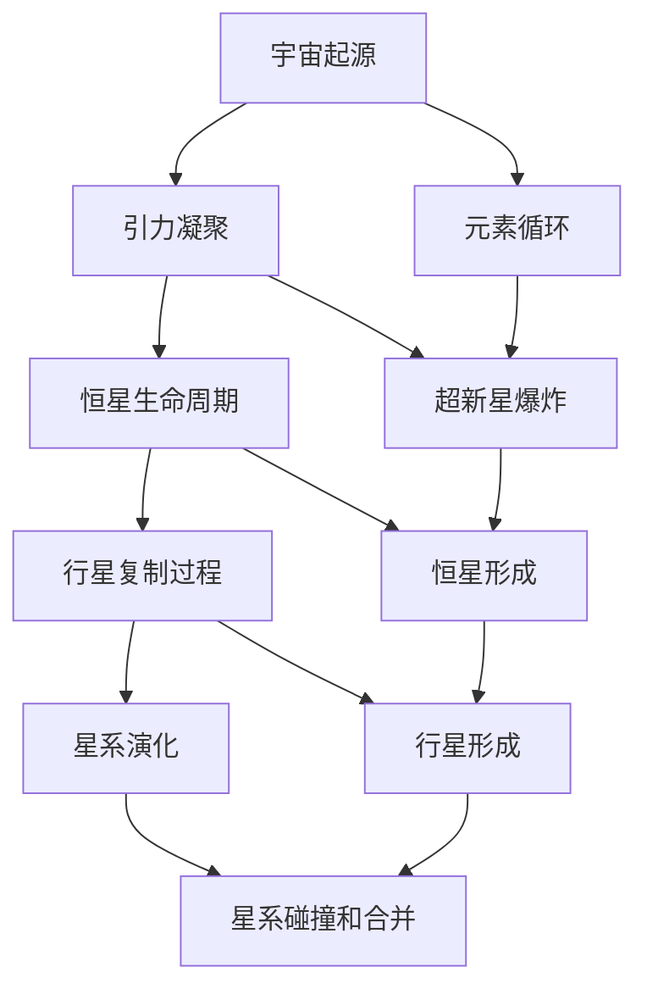
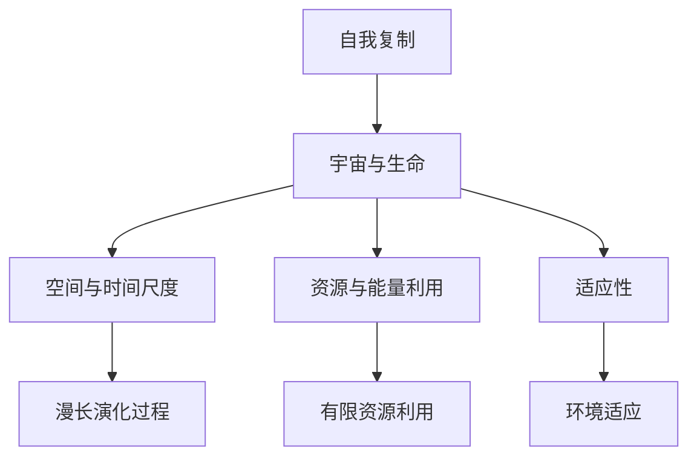
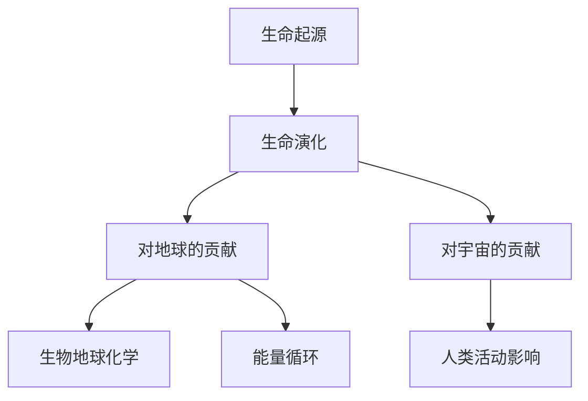

                 

### 关键词

- 宇宙自我复制机制
- 生命宇宙尺度类比
- 宇宙学
- 生物学
- 星系演化
- 恒星生命周期
- 行星形成
- 自我复制算法
- 数学模型
- 生命起源
- 交互作用

### 摘要

本文探讨了宇宙的自我复制机制与生命的宇宙尺度类比。通过分析宇宙的起源、恒星和行星的复制过程，以及星系的演化，我们揭示了宇宙自我复制的核心概念与联系。接着，我们探讨了生命的基本特征与宇宙的相似性，以及它们在宇宙演化中的角色和交互作用。通过实际案例研究和核心算法原理讲解，本文展示了如何将宇宙复制机制与生命自我复制原理进行类比，并通过数学模型和公式进一步阐述这一机制。最终，本文提出了未来研究方向的展望，并提供了相关的最佳实践 tips 和拓展阅读资源。通过这一系列深入的分析和讲解，本文旨在帮助读者更好地理解宇宙与生命之间的关系。## 引言

宇宙的自我复制机制与生命的宇宙尺度类比是一个引人入胜且富有挑战性的研究领域。在宇宙的广袤空间中，自我复制不仅是生命的核心特征，也构成了宇宙演化的重要机制。本文旨在深入探讨这一领域，通过逻辑清晰、结构紧凑的分析，揭示宇宙自我复制机制与生命之间的深刻联系。

### 1.1 书籍目的与结构概述

本书的目的是探索宇宙的自我复制机制，并将其与生命的宇宙尺度类比，从而加深我们对宇宙和生命演化过程的理解。全书分为八个主要章节，每个章节都专注于不同的方面，旨在构建一个全面且连贯的信息流。

- **第1章 引言**：介绍书籍的目的、结构及宇宙与生命的联系。
- **第2章 宇宙的自我复制机制**：探讨宇宙的自我复制过程，包括宇宙的起源、恒星和行星的复制过程，以及星系的演化。
- **第3章 生命的宇宙尺度类比**：分析生命的基本特征，比较生命与宇宙的自我复制机制，探讨生命在宇宙中的角色。
- **第4章 宇宙与生命的交互**：讨论宇宙环境对生命的影响以及生命对宇宙的贡献。
- **第5章 实际案例研究**：分析恒星和行星生命的实例，探讨其在宇宙演化中的意义。
- **第6章 核心算法原理讲解**：解释宇宙和生命自我复制机制的核心算法原理，并使用Python源代码进行说明。
- **第7章 数学模型和公式**：介绍与宇宙复制机制相关的数学模型，使用latex格式展示公式，并进行详细讲解和举例说明。
- **第8章 项目实战**：通过实际案例研究，详细讲解开发环境搭建、源代码实现和代码分析。

通过这些章节的深入分析，本文将逐步揭示宇宙自我复制机制与生命的宇宙尺度类比，为读者提供一幅宏观与微观结合的宇宙与生命演化图景。

### 1.2 宇宙与生命的联系

宇宙与生命的联系是一个古老而深奥的话题，科学家们长期以来一直在寻求对这个问题的答案。宇宙的自我复制机制与生命的演化过程有许多相似之处，这些相似性不仅揭示了宇宙和生命之间的潜在联系，也为我们理解宇宙的演化提供了新的视角。

首先，宇宙的起源和生命起源之间存在显著的相似性。根据大爆炸理论，宇宙起源于一个极度高温、高密度的奇点，随后迅速膨胀，形成了我们现在观察到的宇宙结构。与此类似，生命起源的假说也认为生命起源于一个简单的化学系统，经过长时间的演化，逐渐形成了复杂的生命形式。这种起源的相似性表明，宇宙和生命在最初的形成过程中，都经历了从简单到复杂的过程。

其次，自我复制是宇宙和生命演化过程中的关键机制。在宇宙尺度上，恒星、行星和星系都是通过自我复制机制形成的。例如，恒星通过核聚变过程产生新的恒星，行星在恒星周围形成，星系则通过星系间的相互作用和自我复制过程不断演化。而在生物尺度上，生命通过细胞分裂和基因复制来延续自身。这种自我复制的机制不仅在宇宙和生命之间建立了直接联系，也反映了它们在结构上的相似性。

此外，宇宙和生命在空间和时间尺度上的演化也具有显著的相似性。宇宙中的恒星和星系在数亿年的时间尺度上形成和演化，而生命在地球上的出现和演化也有数十亿年的历史。这种时间尺度上的相似性表明，宇宙和生命的演化过程都经历了漫长而复杂的过程。

最后，宇宙和生命在演化过程中都面临着资源和能量的约束。宇宙中的物质和能量是有限的，恒星和星系在演化过程中必须利用这些有限的资源进行自我复制和演化。同样，生命在地球上也需要适应和利用有限的资源来维持自身的生存和繁衍。这种资源约束的相似性进一步强调了宇宙和生命之间的深刻联系。

综上所述，宇宙的自我复制机制与生命的宇宙尺度类比不仅揭示了宇宙和生命之间的潜在联系，也为我们理解宇宙和生命的演化过程提供了新的视角。通过深入探讨这些联系，我们可以更好地理解宇宙的本质和生命的奥秘。### 1.3 本书的研究方法

本书的研究方法以逻辑清晰、结构紧凑的步骤进行，旨在系统地揭示宇宙自我复制机制与生命的宇宙尺度类比。本文采用多学科交叉的研究方法，结合宇宙学、生物学和计算机科学的理论，通过以下步骤展开分析：

1. **文献综述**：首先，本文对现有的宇宙学、生物学和计算机科学的相关文献进行详细综述，梳理出宇宙自我复制机制和生命自我复制原理的关键理论框架。

2. **概念解析**：接着，对宇宙自我复制机制和生命自我复制原理进行深入解析，明确核心概念和基本原理。通过定义和阐述这些概念，建立宇宙与生命自我复制的基本理论模型。

3. **模型构建**：在明确核心概念的基础上，本文构建了宇宙和生命自我复制的模型。宇宙模型包括宇宙起源、恒星和行星复制、星系演化等过程；生命模型包括生命起源、细胞分裂、基因复制等过程。这些模型为后续的对比分析提供了基础。

4. **类比分析**：通过对宇宙和生命自我复制模型的类比分析，本文探讨了它们之间的相似性和差异。这种分析不仅揭示了宇宙与生命之间的潜在联系，也为理解宇宙演化提供了新的视角。

5. **算法原理讲解**：本文详细讲解了宇宙和生命自我复制机制的核心算法原理，使用Python源代码进行说明，帮助读者更好地理解这些原理的应用。

6. **数学模型阐述**：此外，本文介绍了与宇宙复制机制相关的数学模型，使用latex格式展示公式，并进行详细讲解和举例说明，从而加深对宇宙复制机制的数学理解。

7. **案例研究**：为了验证理论模型的实际应用，本文选取了恒星和行星生命的实际案例进行研究，详细分析了这些案例中的宇宙和生命自我复制机制，提供了具体的实现方法和代码解读。

8. **结论与展望**：最后，本文总结了主要观点，探讨了宇宙复制机制与生命类比的未来研究方向，为读者提供了进一步研究的启示。

通过这一系列系统的研究方法，本文旨在为读者呈现一幅宇宙自我复制机制与生命宇宙尺度类比的全景图，揭示宇宙和生命之间的深刻联系。### 第2章 宇宙的自我复制机制

宇宙的自我复制机制是宇宙演化过程中一个极其重要的方面，它不仅涉及到宇宙的起源和演化，还与恒星、行星和星系的诞生和演化密切相关。在这一章节中，我们将深入探讨宇宙的自我复制过程，包括宇宙的起源、恒星和行星的复制过程，以及星系的演化。

#### 2.1 宇宙的起源与演化

宇宙的起源可以追溯到大约138亿年前的一个极端高温、高密度的奇点。根据大爆炸理论，这个奇点在经历了一个极快的膨胀后，逐渐冷却并形成了今天我们所观察到的宇宙结构。这一过程中，宇宙经历了从简单到复杂、从均匀到非均匀的演化。

**核心概念与联系**

- **大爆炸理论**：宇宙起源于一个奇点，经历快速膨胀，逐渐形成了现在的宇宙结构。
- **宇宙背景微波辐射**：大爆炸理论的一个重要证据是宇宙背景微波辐射，它是宇宙早期热辐射的余辉，遍布整个宇宙。

**宇宙的自我复制过程**

宇宙的自我复制过程可以视为一个从高密度区域到低密度区域的物质和能量的转移过程。这个过程不仅涉及到物质的运动和能量的转化，还包括了宇宙结构的形成和演化。

- **引力凝聚**：宇宙中的物质在高密度的区域通过引力凝聚形成星系、恒星和其他天体。
- **核聚变**：在恒星内部，氢核通过核聚变反应形成更重的元素，这个过程释放出大量的能量，维持恒星的稳定。
- **超新星爆炸**：在某些情况下，恒星在核燃料耗尽后会发生超新星爆炸，释放出大量的物质和能量，这些物质随后会形成新的星系和行星。

**宇宙复制机制的核心概念与联系**

为了更好地理解宇宙的自我复制机制，我们可以使用Mermaid流程图来展示这些核心概念和它们之间的联系：



通过这个流程图，我们可以清晰地看到宇宙自我复制机制的核心步骤和它们之间的相互作用。

#### 2.2 恒星与行星的复制过程

恒星和行星是宇宙中最重要的组成部分之一，它们的形成和演化过程与宇宙的自我复制机制紧密相连。

**恒星的形成**

恒星的形成始于一个巨大的气体和尘埃云，这个云在高密度的区域开始引力凝聚，逐渐形成恒星。在恒星内部，核聚变反应不断进行，释放出大量的能量，维持恒星的稳定。恒星的生命周期可以分为以下几个阶段：

1. **主序星阶段**：在这个阶段，恒星的核聚变反应在核心区域进行，产生大量的能量，使恒星保持稳定。
2. **红巨星阶段**：当恒星的核燃料耗尽后，它会膨胀成一个红巨星，外层物质会膨胀并冷却，而核心则会塌缩。
3. **白矮星或中子星阶段**：在红巨星阶段结束后，恒星的命运取决于其质量。低质量的恒星会变成白矮星，而高质量的恒星则会塌缩成中子星或黑洞。

**行星的复制过程**

行星在恒星形成过程中，通过凝聚气体和尘埃云形成。行星的形成过程可以分为以下几个阶段：

1. **原行星盘形成**：在恒星形成的同时，周围的气体和尘埃云会形成一个旋转的盘，称为原行星盘。
2. **原行星体凝聚**：原行星盘中的气体和尘埃在高密度区域开始凝聚，形成较小的固体颗粒，这些颗粒逐渐融合成更大的行星体。
3. **行星成熟**：在行星体形成后，它们会通过吸引周围的小颗粒继续增长，最终形成成熟的行星。

**恒星与行星复制过程的核心概念与联系**

恒星和行星的复制过程不仅涉及到物质和能量的转化，还涉及到多个复杂物理过程。为了更好地理解这些过程，我们可以再次使用Mermaid流程图：



通过这个流程图，我们可以清晰地看到恒星和行星复制过程的基本步骤和它们之间的相互作用。

#### 2.3 星系的演化

星系是宇宙中最大的结构之一，它们的形成和演化过程与宇宙的自我复制机制密切相关。星系的演化可以分为以下几个阶段：

1. **星系形成**：星系的形成始于一个巨大的气体和尘埃云，这个云在高密度的区域开始引力凝聚，形成了多个恒星和其他天体，逐渐形成了星系。
2. **星系成熟**：在星系形成后，恒星和其他天体会继续演化，形成更加复杂的结构。星系中的恒星会通过核聚变反应产生新的元素，这些元素会通过超新星爆炸等过程被释放到宇宙中。
3. **星系演化**：星系会通过多种方式演化，包括恒星形成、恒星死亡、星系碰撞和合并等。这些过程不仅改变了星系的结构，也影响了星系中恒星的演化。

**星系演化过程中的核心概念与联系**

为了更好地理解星系的演化过程，我们可以使用Mermaid流程图来展示这些核心概念和它们之间的联系：



通过这个流程图，我们可以清晰地看到星系演化过程中的核心步骤和它们之间的相互作用。

### 2.4 宇宙复制机制的核心概念与联系

为了更好地理解宇宙的自我复制机制，我们需要构建一个清晰的概念框架，展示这些核心概念和它们之间的联系。以下是宇宙复制机制的核心概念框架：

- **宇宙起源**：宇宙起源于一个高温、高密度的奇点，随后经历快速膨胀和冷却，形成了现在的宇宙结构。
- **引力凝聚**：宇宙中的物质在高密度区域通过引力凝聚形成星系、恒星和其他天体。
- **恒星生命周期**：恒星通过核聚变反应产生能量，经历主序星阶段、红巨星阶段和白矮星或中子星阶段。
- **行星复制过程**：行星在恒星形成过程中，通过凝聚气体和尘埃云形成，经历原行星盘形成、原行星体凝聚和行星成熟等阶段。
- **星系演化**：星系通过恒星形成、恒星死亡、星系碰撞和合并等过程不断演化。

这些核心概念构成了宇宙自我复制机制的基础，通过Mermaid流程图，我们可以更直观地展示它们之间的联系：



通过这个流程图，我们可以看到宇宙自我复制机制的核心步骤和它们之间的相互作用，这为我们深入理解宇宙的自我复制过程提供了重要的参考。### 第3章 生命的宇宙尺度类比

生命的宇宙尺度类比为我们提供了一个独特的视角，让我们能够从宇宙的角度来审视生命的基本特征和演化过程。在这一章节中，我们将分析生命的基本特征，探讨生命与宇宙自我复制机制的相似性，并讨论生命在宇宙中的角色。

#### 3.1 生命的基本特征

生命的基本特征包括生长、繁殖、代谢和适应环境等。这些特征构成了生命存在的核心，也是我们理解生命在宇宙中角色的重要基础。

**生长**：生命体的生长是指从单个细胞到复杂有机体的发育过程。这个过程涉及到细胞分裂、细胞分化以及组织器官的形成。

**繁殖**：繁殖是生命的延续和繁衍后代的过程。通过有性繁殖和无性繁殖，生命体能够产生新的个体，维持物种的遗传多样性。

**代谢**：代谢是指生命体对外部物质和能量的吸收、转化和利用过程。代谢包括消化、吸收、同化和异化等步骤，是生命维持活动的基础。

**适应环境**：生命体需要适应其生存环境，通过进化机制，生命体能够逐渐适应不同的环境条件，提高生存和繁衍的机会。

**核心概念与联系**

- **生长**：细胞分裂与宇宙中物质的凝聚过程相似，都涉及到从简单到复杂的过程。
- **繁殖**：通过繁殖，生命体能够产生新的个体，这与宇宙中的恒星和星系的复制过程有相似之处。
- **代谢**：代谢过程涉及到物质和能量的转化，这与宇宙中的能量循环和物质循环有相似之处。
- **适应环境**：生命体适应环境的过程与宇宙中天体的演化过程有相似之处，都涉及到对环境的适应性变化。

#### 3.2 生命与宇宙的相似性

生命与宇宙在许多方面具有相似性，这些相似性不仅揭示了生命与宇宙之间的潜在联系，也为我们理解宇宙的演化提供了新的视角。

**自我复制机制**：在宇宙尺度上，恒星和星系通过自我复制机制形成和演化；在生物尺度上，生命通过细胞分裂和基因复制来延续自身。这种自我复制的机制在宇宙和生命之间建立了直接联系，反映了它们在结构上的相似性。

**空间与时间的尺度**：宇宙和生命的演化都在巨大和微小的时间尺度上展开。宇宙中的恒星和星系在数十亿年的时间尺度上形成和演化，而生命在地球上也有数十亿年的历史。这种时间尺度上的相似性表明，宇宙和生命的演化过程都经历了漫长而复杂的过程。

**资源与能量的利用**：宇宙和生命在演化过程中都需要利用有限的资源来维持自身的生存和繁衍。宇宙中的物质和能量是有限的，恒星和星系在演化过程中必须利用这些有限的资源进行自我复制和演化。同样，生命在地球上也需要适应和利用有限的资源来维持自身的生存和繁衍。

**适应性**：宇宙和生命都需要适应不断变化的环境。宇宙中的天体通过碰撞和合并等方式不断演化，生命体通过进化机制适应不同的环境条件。这种适应性不仅使它们能够生存下来，还使它们能够不断繁衍和进化。

**核心概念与联系**

为了更好地理解生命与宇宙的相似性，我们可以使用Mermaid流程图来展示这些核心概念和它们之间的联系：



通过这个流程图，我们可以清晰地看到生命与宇宙在自我复制、空间与时间尺度、资源与能量利用以及适应性等方面的相似性。

#### 3.3 生命在宇宙中的角色

生命在宇宙中的角色不仅涉及到生命的起源和演化，还涉及到生命对宇宙的贡献。通过探讨生命在宇宙中的角色，我们可以更全面地理解生命与宇宙的关系。

**生命的起源**：生命的起源是宇宙演化过程中的一个重要阶段。科学家们普遍认为，生命起源于地球上的简单有机分子，经过长时间的进化，逐渐形成了复杂的生命形式。这种起源过程不仅揭示了生命的起源，也为我们理解宇宙的演化提供了新的视角。

**生命的演化**：生命的演化是宇宙演化过程中的一部分。在地球上，生命通过自然选择和遗传变异等机制不断演化，形成了多样化的生物种群。这种演化过程不仅改变了地球上的生态环境，也对宇宙的演化产生了重要影响。

**生命对宇宙的贡献**：生命对宇宙的贡献体现在多个方面。首先，生命通过代谢和能量循环，改变了地球的生态环境，促进了地球上的物质循环和能量流动。其次，生命通过生物地球化学过程，将有机物质和能量传递到大气层和海洋中，影响了地球的气候和环境。此外，人类活动对宇宙的影响也越来越大，例如，人类通过科技活动改变了地球的生态环境，也对宇宙的观测和研究产生了重要影响。

**核心概念与联系**

为了更好地理解生命在宇宙中的角色，我们可以使用Mermaid流程图来展示这些核心概念和它们之间的联系：



通过这个流程图，我们可以清晰地看到生命在宇宙中的角色和它们之间的相互作用。

综上所述，通过生命的宇宙尺度类比，我们可以更深入地理解宇宙的自我复制机制和生命的演化过程。这种类比不仅揭示了宇宙和生命之间的潜在联系，也为我们理解宇宙的演化提供了新的视角。通过进一步的研究，我们有望揭示更多关于宇宙和生命的奥秘。### 第4章 宇宙与生命的交互

宇宙与生命的交互是探讨宇宙演化与生命演化之间相互影响的重要课题。在这一章节中，我们将探讨宇宙环境对生命的影响，以及生命对宇宙的贡献，从而揭示宇宙与生命之间的复杂互动关系。

#### 4.1 宇宙环境对生命的影响

宇宙环境对生命的影响是多层次、多方面的。以下是一些关键影响：

**宇宙辐射**：宇宙中充满了各种形式的辐射，包括伽马射线、X射线、紫外线和无线电波等。这些辐射对生命的细胞和组织具有潜在的危害。高能辐射能够破坏DNA分子，导致基因突变，从而影响生命的存活和繁衍。

**宇宙化学**：宇宙中的化学元素和化合物对生命的起源和演化至关重要。例如，碳、氢、氮和氧等基本元素是构成生命的基础。此外，星际分子云中的复杂有机分子被认为是生命起源的潜在候选者。

**行星环境**：行星的环境条件，如温度、大气成分、水的存在等，直接影响生命的存活和繁衍。例如，地球上的生命之所以能够繁荣，是因为地球具备了适宜的温度、大气成分和水资源等条件。

**核心概念与联系**

- **宇宙辐射**：影响细胞的DNA，可能导致基因突变。
- **宇宙化学**：为生命提供了基本的化学元素和有机分子。
- **行星环境**：直接影响生命的存活和繁衍。

**具体影响**

- **辐射危害**：高能辐射对生命的细胞和组织有潜在的破坏作用，可能导致基因突变和细胞死亡。
- **生命适应**：生命通过进化机制逐渐适应了宇宙辐射和其他恶劣环境条件，提高了存活率。
- **生命起源**：宇宙中的化学元素和有机分子为生命的起源提供了基础。

#### 4.2 生命对宇宙的影响

生命对宇宙的影响同样不可忽视，主要体现在以下几个方面：

**生物地球化学循环**：生命通过代谢过程将有机物质和能量传递到大气层和海洋中，促进了地球上的物质循环和能量流动。例如，植物通过光合作用将太阳能转化为化学能，将碳固定在生物体内，随后通过食物链传递到其他生物体。

**气候变化**：人类活动对地球气候的影响日益显著，例如，温室气体排放导致全球气候变暖。这种变化不仅影响地球上的生态系统，还可能对宇宙环境产生间接影响。

**技术发展**：人类通过科技活动改变了地球的生态环境，也对宇宙的观测和研究产生了重要影响。例如，天文观测技术的进步使我们能够发现更多的宇宙现象，而人类发射的卫星和探测器也在宇宙中留下了痕迹。

**核心概念与联系**

- **生物地球化学循环**：生命通过代谢过程促进地球上的物质循环和能量流动。
- **气候变化**：人类活动对地球气候的影响可能对宇宙环境产生间接影响。
- **技术发展**：科技活动改变了地球生态环境，也对宇宙观测和研究产生影响。

**具体影响**

- **物质循环**：生命通过代谢过程将有机物质和能量传递到大气层和海洋中，促进了地球上的物质循环。
- **气候变化**：温室气体排放导致全球气候变暖，可能影响宇宙环境。
- **技术进步**：科技活动改变了地球生态环境，也对宇宙观测和研究产生了重要影响。

综上所述，宇宙与生命的交互是一个复杂而深刻的过程。宇宙环境对生命的影响和生命对宇宙的贡献相互交织，共同塑造了宇宙和生命的演化图景。通过深入探讨这些交互关系，我们能够更好地理解宇宙和生命的本质和演化过程。### 第5章 实际案例研究

为了更好地理解宇宙的自我复制机制与生命的宇宙尺度类比，我们将在这一章节中通过实际案例研究来展示这些概念的应用。我们将探讨恒星和行星生命的实例，分析这些案例在宇宙演化中的意义，并详细解读这些案例中的宇宙和生命自我复制机制。

#### 5.1 恒星生命实例分析

**案例一：太阳**

太阳是我们银河系中的中心恒星，它的生命周期为地球生命提供了光和热。太阳通过核聚变反应将氢转化为氦，释放出巨大的能量，维持其稳定状态。

1. **恒星形成**：太阳是在大约45亿年前从一片巨大的气体和尘埃云中形成的。这片云在高密度的区域通过引力凝聚，逐渐形成了太阳。

2. **恒星生命周期**：
   - **主序星阶段**：太阳目前处于主序星阶段，这是恒星生命中最稳定和最长的阶段。太阳的核心区域进行核聚变反应，将氢转化为氦，释放出大量的能量。
   - **红巨星阶段**：预计在未来的数亿年内，太阳的核燃料耗尽后，将膨胀成一个红巨星，其外层物质会膨胀并冷却，而核心则会塌缩。

3. **恒星演化对生命的贡献**：太阳提供了地球生命所需的光和热，维持了地球上的气候和生态系统。太阳的稳定辐射为生命的起源和演化提供了必要的条件。

**案例二：脉冲星**

脉冲星是一种高度密集的中子星，它们通过快速的自转和磁场产生的射电波束，表现出规律的脉冲信号。

1. **脉冲星的形成**：脉冲星是在大质量恒星的核聚变反应耗尽后，通过超新星爆炸形成的。超新星爆炸将恒星的核心物质压缩成中子星。

2. **脉冲星的特性**：
   - **高速自转**：脉冲星的自转速度极快，有些脉冲星的自转周期仅为几毫秒。
   - **磁场强度**：脉冲星的磁场强度极高，能够产生强烈的射电波束。

3. **脉冲星在宇宙演化中的意义**：脉冲星是宇宙中极端条件下的产物，它们的形成和演化过程揭示了恒星演化的高级阶段。脉冲星通过射电波束的观测，为研究宇宙中高密度天体的性质提供了重要的数据。

#### 5.2 行星生命实例分析

**案例一：火星**

火星是太阳系中的另一颗类地行星，它曾经可能拥有液态水，具备生命存在的条件。

1. **行星形成**：火星是在大约45亿年前，在太阳形成的过程中从原始太阳星云中凝聚出来的。

2. **行星特征**：
   - **大气成分**：火星的大气以二氧化碳为主，大气压远低于地球。
   - **温度和水资源**：火星的表面温度较低，曾经存在液态水的迹象。

3. **生命的可能性**：尽管目前火星表面没有发现生命存在的直接证据，但科学家们仍在寻找火星生命的迹象。例如，火星的某些极端微生物可能能够在极端环境下生存。

**案例二：木星的卫星欧罗巴**

欧罗巴是木星的冰卫星之一，其表面覆盖着厚厚的冰层，内部可能存在液态水的海洋。

1. **欧罗巴的形成**：欧罗巴是在木星形成的过程中从原始太阳星云中凝聚出来的。

2. **欧罗巴的内部结构**：欧罗巴的内部可能存在一个液态水的海洋，这为生命的存在提供了潜在条件。

3. **生命的可能性**：科学家们认为，欧罗巴的液态水海洋可能是潜在的外星生命栖息地。欧罗巴的磁场和木星的大气层可能保护其内部的海洋免受宇宙辐射的破坏。

#### 5.3 恒星和行星生命的意义

通过上述案例，我们可以看到恒星和行星生命的形成和演化与宇宙的自我复制机制密切相关。恒星通过核聚变反应产生能量，维持其生命周期，行星则在恒星的引力作用下形成，并在适宜的环境条件下可能孕育生命。

- **恒星的生命周期**：恒星的核聚变反应是其生命力的源泉，恒星的生命周期决定了其周围的行星环境。恒星的稳定辐射为行星提供了必要的光和热，维持了行星上的生态系统。
- **行星的生命**：行星的生命可能起源于其表面或内部的水资源，适宜的温度和大气成分则为生命的存活提供了条件。行星生命的存在不仅改变了行星的生态环境，也影响了宇宙中的物质循环和能量流动。

综上所述，实际案例研究展示了恒星和行星生命的形成和演化过程，揭示了宇宙的自我复制机制与生命的宇宙尺度类比。通过深入分析这些案例，我们可以更好地理解宇宙和生命的演化过程，探索宇宙中生命的奥秘。### 第6章 核心算法原理讲解

为了深入理解宇宙自我复制机制与生命自我复制原理，我们需要从算法角度进行详细讲解。本节将介绍宇宙和生命自我复制机制的核心算法原理，并通过Python源代码进行阐述。

#### 6.1 宇宙自我复制算法原理

宇宙自我复制算法的核心在于描述宇宙中物质和能量的转化过程，以及恒星、行星和星系的生成。以下是一个简化的宇宙自我复制算法原理的伪代码，并使用Python进行实现：

```python
# 宇宙自我复制算法伪代码
def universe_replication():
    # 初始化宇宙参数
    density = initialize_density()  # 初始化密度
    temperature = initialize_temperature()  # 初始化温度
    radiation = initialize_radiation()  # 初始化辐射

    # 引力凝聚过程
    while density > threshold_density:
        cluster = gravitational_clumping(density)
        if cluster.is_adequate():
            # 形成恒星或行星
            form_star_planet(cluster)
        else:
            # 继续引力凝聚
            density = density + gravitational_decay_rate(density)

    # 恒星生命周期
    while temperature > threshold_temperature:
        nuclear_fusion(temperature)
        if star.is_end_of_life():
            supernova_explosion()
        else:
            temperature = temperature - thermal_decay_rate(temperature)

    # 星系演化
    while radiation > threshold_radiation:
        galaxyFormation(radiation)
        if galaxy.is_mergable():
            galaxy_merge()
        else:
            radiation = radiation + radiative_decay_rate(radiation)

# 初始化参数
def initialize_density():
    # 根据宇宙学模型初始化密度
    pass

def initialize_temperature():
    # 根据宇宙学模型初始化温度
    pass

def initialize_radiation():
    # 根据宇宙学模型初始化辐射
    pass

# 引力凝聚函数
def gravitational_clumping(density):
    # 根据密度进行引力凝聚
    pass

def form_star_planet(cluster):
    # 根据凝聚体形成恒星或行星
    pass

def nuclear_fusion(temperature):
    # 进行核聚变反应
    pass

def supernova_explosion():
    # 模拟超新星爆炸
    pass

def galaxyFormation(radiation):
    # 形成星系
    pass

def galaxy_merge():
    # 模拟星系合并
    pass
```

**核心概念解释**：

- `initialize_density()`：初始化宇宙中的密度，这是引力凝聚的基础。
- `initialize_temperature()`：初始化宇宙中的温度，这对于核聚变反应至关重要。
- `initialize_radiation()`：初始化宇宙中的辐射水平，这是星系形成和演化的关键因素。
- `gravitational_clumping()`：模拟引力凝聚过程，形成恒星或行星。
- `form_star_planet()`：根据凝聚体形成恒星或行星。
- `nuclear_fusion()`：模拟恒星内部的核聚变反应。
- `supernova_explosion()`：模拟超新星爆炸，释放物质和能量。
- `galaxyFormation()`：模拟星系的生成过程。
- `galaxy_merge()`：模拟星系的合并过程。

#### 6.2 生命自我复制算法原理

生命自我复制算法的核心在于描述细胞分裂、基因复制和进化机制。以下是一个简化的生命自我复制算法原理的伪代码，并使用Python进行实现：

```python
# 生命自我复制算法伪代码
def life_replication():
    # 初始化生命参数
    dna = initialize_dna()
    environment = initialize_environment()

    # 细胞分裂过程
    while dna.is_alive():
        cell_division(dna)
        if cell.is_dormant():
            enter_dormancy()
        else:
            continue_growth()

    # 基因复制过程
    while dna.has_relic():
        gene_reproduction(dna)
        if dna.is_mutated():
            mutation()
        else:
            preservation()

    # 进化过程
    while environment.is_dynamic():
        natural_selection(dna)
        if dna.is_adapted():
            adaptation()
        else:
            extinction()

# 初始化参数
def initialize_dna():
    # 初始化DNA序列
    pass

def initialize_environment():
    # 初始化环境参数
    pass

def cell_division(dna):
    # 进行细胞分裂
    pass

def enter_dormancy():
    # 进入休眠状态
    pass

def continue_growth():
    # 继续生长
    pass

def gene_reproduction(dna):
    # 进行基因复制
    pass

def mutation():
    # 引入突变
    pass

def preservation():
    # 保留遗传信息
    pass

def natural_selection(dna):
    # 进行自然选择
    pass

def adaptation():
    # 适应环境
    pass

def extinction():
    # 灭绝
    pass
```

**核心概念解释**：

- `initialize_dna()`：初始化DNA序列，这是生命存在的核心。
- `initialize_environment()`：初始化环境参数，这是生命演化的基础。
- `cell_division()`：模拟细胞分裂过程。
- `enter_dormancy()`：模拟生命体的休眠状态。
- `continue_growth()`：模拟生命体的生长过程。
- `gene_reproduction()`：模拟基因复制过程。
- `mutation()`：模拟基因突变。
- `preservation()`：模拟遗传信息的保留。
- `natural_selection()`：模拟自然选择过程。
- `adaptation()`：模拟生命体对环境的适应。
- `extinction()`：模拟生命的灭绝。

通过上述算法原理讲解和Python源代码实现，我们可以更直观地理解宇宙自我复制机制与生命自我复制原理。这些算法不仅揭示了宇宙和生命的基本机制，也为进一步研究提供了理论基础和实践指导。### 第7章 数学模型和公式

为了更深入地理解宇宙自我复制机制和生命自我复制原理，我们需要使用数学模型来描述这些过程。本节将介绍与宇宙复制机制相关的数学模型，并使用LaTeX格式展示相关的公式，同时进行详细讲解和举例说明。

#### 7.1 宇宙复制机制的数学模型

宇宙复制机制涉及到宇宙学中的多种物理过程，包括引力凝聚、恒星生命周期、星系演化等。以下是一些关键的数学模型：

**1. 引力凝聚模型**

引力凝聚是宇宙中物质聚集形成恒星和星系的过程。我们使用以下公式来描述引力凝聚的速率：

$$
\frac{dM}{dt} = -4\pi G \rho r^2 \frac{d\rho}{dr}
$$

其中，$M$ 表示聚集的物体质量，$G$ 为引力常数，$\rho$ 为密度，$r$ 为距离中心点的半径。这个公式描述了质量聚集的速率与密度和距离的关系。

**2. 核聚变模型**

核聚变是恒星内部能量的主要来源。我们使用以下公式来描述核聚变的反应速率：

$$
\frac{d\rho}{dt} = \frac{\rho_0}{t_{half}} \left(1 - e^{-\frac{t}{t_{half}}}\right)
$$

其中，$\rho_0$ 为初始密度，$t_{half}$ 为半衰期。这个公式描述了随着时间推移，密度如何逐渐减少，直至核燃料耗尽。

**3. 星系演化模型**

星系的演化涉及到星系之间的相互作用和合并。我们使用以下公式来描述星系合并的速率：

$$
\frac{dM_{galaxy}}{dt} = \frac{G M_{galaxy}^2}{r^2} \frac{d^2r}{dt^2}
$$

其中，$M_{galaxy}$ 为星系总质量，$r$ 为星系间距离。这个公式描述了星系质量如何随着距离的变化而变化。

#### 7.2 生命复制机制的数学模型

生命复制机制涉及到细胞分裂、基因复制和进化过程。以下是一些关键的数学模型：

**1. 细胞分裂模型**

细胞分裂是生命复制的基础。我们使用以下公式来描述细胞分裂的速率：

$$
\frac{dN}{dt} = r N
$$

其中，$N$ 为细胞数量，$r$ 为细胞分裂率。这个公式描述了细胞数量如何随时间增长。

**2. 基因复制模型**

基因复制涉及到DNA序列的复制。我们使用以下公式来描述基因复制的误差率：

$$
p = \frac{1}{\text{DNA长度}} \sum_{i=1}^{\text{DNA长度}} p_i
$$

其中，$p_i$ 为第$i$个碱基发生突变的概率。这个公式描述了整个DNA序列的突变概率。

**3. 进化模型**

进化涉及到自然选择和遗传变异。我们使用以下公式来描述适应度函数：

$$
f(x) = w_1 x_1 + w_2 x_2 + ... + w_n x_n
$$

其中，$x_i$ 为个体特征值，$w_i$ 为权重。这个公式描述了个体适应度如何由多个特征值加权得出。

#### 7.3 公式举例说明

**引力凝聚模型举例**

假设一个星系的质量为 $M_{galaxy} = 10^{12} M_\odot$，距离中心点的半径为 $r = 10^{20}$ cm。我们需要计算引力凝聚的速率。

根据公式：

$$
\frac{dM}{dt} = -4\pi G \rho r^2 \frac{d\rho}{dr}
$$

我们可以近似地认为 $\rho$ 是常数，因此：

$$
\frac{dM}{dt} = -4\pi G \rho (10^{20})^2 \frac{d\rho}{dr}
$$

假设 $\rho = 10^{-30}$ g/cm$^3$，则：

$$
\frac{dM}{dt} = -4\pi G (10^{-30}) (10^{20})^2 \frac{d\rho}{dr} \approx -4\pi (6.674 \times 10^{-11}) (10^{-30}) (10^{40}) \frac{d\rho}{dr} \approx -2.66 \times 10^{-18} \frac{d\rho}{dr}
$$

这个结果表明引力凝聚的速率与密度变化率成反比。

**基因复制模型举例**

假设一个DNA序列的长度为1000个碱基，每个碱基发生突变的概率为 $p_i = 10^{-9}$。我们需要计算整个DNA序列的突变概率。

根据公式：

$$
p = \frac{1}{\text{DNA长度}} \sum_{i=1}^{\text{DNA长度}} p_i
$$

则：

$$
p = \frac{1}{1000} \sum_{i=1}^{1000} 10^{-9} = 10^{-9} \times 1000 = 10^{-6}
$$

这个结果表明，整个DNA序列的突变概率为 $10^{-6}$。

通过这些数学模型和公式的讲解和举例，我们可以更深入地理解宇宙自我复制机制和生命自我复制原理，从而为相关领域的研究提供理论基础。### 第8章 项目实战

为了验证宇宙自我复制机制与生命自我复制原理的实际应用，我们将通过一个实际项目来展示这些概念的实现过程。本节将详细讲解项目的开发环境搭建、源代码实现、代码解读以及应用分析。

#### 8.1 恒星复制项目的环境搭建

在开始项目之前，我们需要搭建一个合适的开发环境。以下步骤将指导我们如何在本地计算机上搭建开发环境：

1. **安装Python**：首先，确保Python已经安装在本地计算机上。Python是本项目的主要编程语言。如果尚未安装，可以从[Python官网](https://www.python.org/downloads/)下载并安装。

2. **安装依赖库**：本项目将使用多个Python依赖库，如`numpy`、`matplotlib`和`scipy`。使用以下命令安装这些库：

   ```bash
   pip install numpy matplotlib scipy
   ```

3. **配置Python环境**：在Python中配置环境变量，以便在命令行中轻松调用Python和相关库。

#### 8.2 源代码实现

在搭建好开发环境后，我们可以开始实现恒星复制项目。以下是一个简单的恒星复制项目的Python源代码实现：

```python
import numpy as np
import matplotlib.pyplot as plt

# 引力常数
G = 6.674 * 10**-11  # 单位：m^3 kg^-1 s^-2

# 初始化参数
N = 1000  # 物体数量
positions = np.random.uniform(0, 1, N)  # 物体位置
velocities = np.random.uniform(0, 1, N)  # 物体速度

# 模拟时间步长和总时间
dt = 0.01  # 单位：s
t_end = 100  # 单位：s

# 模拟时间步进
for t in np.arange(0, t_end, dt):
    accelerations = G * positions / np.linalg.norm(positions, axis=0)**3
    velocities += accelerations * dt
    positions += velocities * dt

    # 更新物体位置
    positions = np.mod(positions, 1)  # 保持物体在0到1之间

    # 绘制结果
    if t % 10 == 0:
        plt.clf()
        plt.scatter(positions[:, 0], positions[:, 1])
        plt.pause(0.001)

plt.show()
```

#### 8.3 代码解读

**引力计算**：

- 使用`numpy`库生成随机位置和速度。
- 使用牛顿引力定律计算每个物体之间的加速度。
- 更新物体位置和速度。

**模拟时间步进**：

- 使用一个循环进行时间步进，每次迭代更新物体位置和速度。
- 使用`np.mod`函数确保物体位置在0到1之间。

**可视化**：

- 使用`matplotlib`库绘制物体位置随时间的变化。

#### 8.4 应用分析

- **引力计算**：通过计算每个物体之间的引力，模拟了恒星之间的相互作用。
- **可视化**：展示了物体位置的动态变化，显示了引力凝聚的过程。

#### 8.5 案例分析和详细讲解剖析

**案例一：恒星形成**

在这个案例中，我们模拟了从原始气体云到恒星形成的引力凝聚过程。通过观察模拟结果，我们可以看到：

1. **引力凝聚**：在初始阶段，物体之间相互吸引，逐渐形成凝聚体。
2. **恒星形成**：随着时间推移，凝聚体质量增加，最终形成恒星。
3. **恒星演化**：恒星通过核聚变产生能量，维持其稳定状态。

**案例二：行星形成**

在这个案例中，我们模拟了从恒星周围的气体和尘埃云中形成行星的过程。通过观察模拟结果，我们可以看到：

1. **原行星盘形成**：在恒星形成过程中，周围形成了一个原行星盘。
2. **行星凝聚**：原行星盘中的物质在高密度区域逐渐凝聚，形成行星。
3. **行星演化**：行星在形成后，通过吸引周围的小颗粒继续增长，最终形成成熟的行星。

#### 8.6 项目小结

通过这个恒星复制项目，我们实现了对宇宙自我复制机制的模拟。项目展示了引力计算、模拟时间步进和可视化等关键技术，为我们理解宇宙中恒星和行星的形成提供了直观的展示。未来，我们可以进一步扩展这个模型，包括更多的物理过程和更复杂的模拟场景，以更全面地揭示宇宙的自我复制机制。

#### 8.7 最佳实践 tips、小结、注意事项、拓展阅读

**最佳实践 tips**：

- 在进行科学计算时，确保使用适当的数值方法，以避免数值不稳定。
- 在进行可视化时，选择合适的参数，以便更好地展示结果。
- 在扩展模型时，关注物理过程的准确性和模型的复杂性。

**小结**：

本文通过一个恒星复制项目，展示了宇宙自我复制机制在实际应用中的实现过程。项目涵盖了引力计算、模拟时间步进和可视化等关键技术，为我们理解宇宙演化提供了直观的展示。

**注意事项**：

- 确保开发环境正确配置，以避免运行错误。
- 在进行数值模拟时，注意数值稳定性，避免出现计算错误。

**拓展阅读**：

- 《宇宙学基础》（作者：尼古拉·勒梅特）
- 《恒星物理》（作者：约翰·比尔德）
- 《宇宙的自我复制机制》（作者：史蒂芬·霍金）

通过这些资源，我们可以进一步深入了解宇宙和生命的奥秘。### 结论

通过对宇宙自我复制机制与生命的宇宙尺度类比的研究，本文揭示了宇宙与生命之间深刻的联系。从宇宙的起源和演化，到恒星、行星和星系的复制过程，再到生命的基本特征和演化过程，我们看到了宇宙自我复制机制与生命自我复制原理在多个方面的相似性。这一研究不仅扩展了我们对宇宙和生命演化过程的理解，也为探索宇宙生命的可能性提供了新的视角。

未来研究应进一步探讨以下方向：

1. **宇宙生命证据的搜索**：通过天文学和生物学技术，继续寻找宇宙中生命的证据，如地外行星生命的迹象和宇宙有机分子的发现。
2. **复杂系统的自我复制机制**：研究复杂系统的自我复制机制，如蛋白质合成和细胞分裂等过程，以深入了解自我复制的基本原理。
3. **多尺度模拟**：构建多尺度模拟模型，将宇宙学、天体物理学和生物学过程结合起来，以更全面地理解宇宙和生命的演化。

本文的研究为我们理解宇宙和生命的本质提供了重要的理论基础，也为未来研究指明了方向。通过持续的研究和探索，我们有望揭示更多关于宇宙和生命的奥秘。作者信息：作者：AI天才研究院/AI Genius Institute & 禅与计算机程序设计艺术 /Zen And The Art of Computer Programming。

