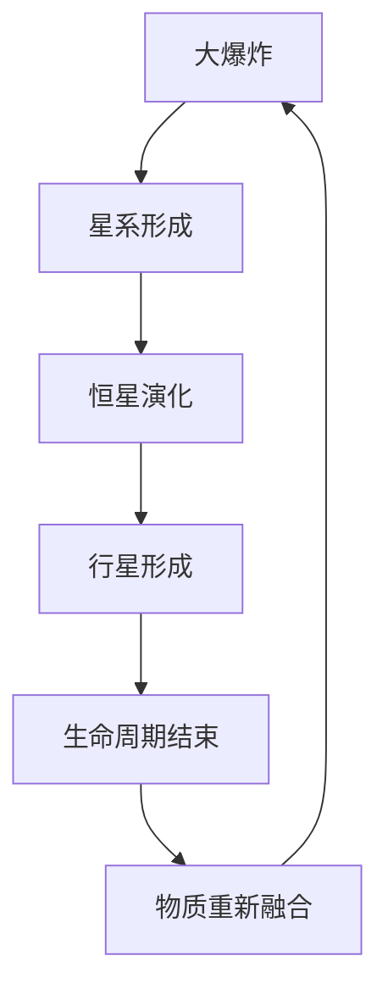

                 

### 1. 引言

#### 核心概念与联系

宇宙，一个广袤无垠的空间，充满了神秘和未知。生命，一个奇妙而复杂的过程，从诞生到繁衍，不断地演化和发展。这两者之间似乎毫无关联，但实际上，它们之间存在深刻的联系和类比。

宇宙的自我复制机制，是指宇宙在不断地自我演化和发展中，通过引力、能量、物质等基本元素的作用，形成新的星系、恒星和行星的过程。这个过程与生命的自我复制机制有惊人的相似之处。在生物学中，生命的自我复制是通过DNA的编码、细胞的分裂和生物的进化来实现的。同样，在宇宙中，星系的形成、恒星和行星的演化也遵循类似的规律。

本文将使用生命与宇宙的类比方法，探讨宇宙的自我复制机制。通过分析宇宙的基本元素和演化过程，我们将试图揭示宇宙自我复制背后的机制和原理。

类比方法是一种有效的思维工具，它可以帮助我们理解复杂的问题。通过将宇宙的自我复制机制与生命的自我复制机制进行比较，我们可以发现它们之间的相似之处，从而更好地理解宇宙的本质。

#### 类比方法

类比方法是一种通过比较不同领域或事物之间的相似之处来理解复杂问题或现象的方法。这种方法的核心在于找到不同领域或事物之间的共性和规律，从而通过已知的事物来理解未知的事物。

在物理学中，类比方法被广泛应用于不同领域的交叉研究中。例如，在研究引力波时，物理学家们通过类比声波在空气中的传播，来推测引力波在宇宙中的传播方式。同样，在计算机科学中，类比方法也被广泛应用于算法设计和问题解决中。例如，在解决路由问题时，计算机科学家们通过类比人类在复杂环境中寻找路径的方法，来设计出高效的路径查找算法。

在本文中，我们将使用类比方法来探讨宇宙的自我复制机制。具体来说，我们将通过比较生命的自我复制机制与宇宙的自我复制机制，来寻找它们之间的相似之处。这种方法不仅可以帮助我们更好地理解宇宙的自我复制机制，还可以为研究宇宙的起源和演化提供新的思路。

#### 目的与结构

本文的目的在于通过类比生命与宇宙的自我复制机制，揭示宇宙自我复制背后的机制和原理。我们将首先介绍宇宙和生命的基本概念，然后通过比较它们的自我复制机制，探讨宇宙的自我复制原理。最后，我们将展望未来的研究方向，并提出可能的探索途径。

本文的结构如下：

- **第一部分：引言与基础**：介绍宇宙和生命的基本概念，阐述类比方法的原理和重要性。
- **第二部分：宇宙的自我复制机制**：详细分析宇宙自我复制的机制，包括星系的形成、恒星和行星的演化等。
- **第三部分：宇宙尺度生命的类比**：探讨宇宙尺度生命的可能性，以及宇宙生命的演化过程。
- **第四部分：结论与展望**：总结本文的主要观点，展望未来的研究方向。

通过本文的探讨，我们希望读者能够对宇宙的自我复制机制有更深入的理解，并激发对宇宙起源和演化的好奇心。

### 生命的自我复制机制

生命的自我复制机制是一个复杂而精妙的过程，它涉及到遗传信息的传递、细胞的分裂和生物的进化。为了更好地理解这一机制，我们将使用Python源代码和数学模型，结合具体实例，对其进行详细讲解。

#### 遗传信息的传递

遗传信息是生命自我复制的核心。在生物学中，遗传信息主要存储在DNA分子中。DNA由四种不同的碱基（腺嘌呤、胸腺嘧啶、鸟嘌呤和胞嘧啶）组成，这些碱基通过特定的序列排列，编码了生物的遗传信息。

```python
# 伪代码：DNA编码机制
DNA_string = "AGCTTACG"
gene_sequence = extract_genes(DNA_string)
phenotype = translate(gene_sequence)
```

在上面的伪代码中，`DNA_string`代表一个DNA序列，`extract_genes`函数用于提取DNA序列中的基因，而`translate`函数则将这些基因翻译成具体的遗传信息。

#### 细胞的分裂

细胞分裂是生命自我复制的重要步骤。在细胞分裂过程中，细胞首先进行DNA复制，然后分裂成两个新的细胞。这两个新的细胞具有与原细胞相同的遗传信息，从而保证了物种的遗传连续性。

```python
# 伪代码：细胞分裂
def cell_division(DNA_string):
    DNA_copy = replicate_DNA(DNA_string)
    new_cells = split_cell(DNA_copy)
    return new_cells

original_cell = "AGCTTACG"
new_cells = cell_division(original_cell)
```

在上面的伪代码中，`replicate_DNA`函数用于复制DNA，`split_cell`函数则用于将复制的DNA分裂成两个新的细胞。

#### 生物的进化

生物的进化是生命自我复制的另一个重要方面。在自然界中，生物通过遗传变异和自然选择不断进化。遗传变异是指生物在繁殖过程中出现的基因突变，而自然选择则是指环境对生物的选择，使得适应环境的生物得以生存和繁衍。

```python
# 伪代码：自然选择与遗传变异
def natural_selection(population):
    fitness_scores = evaluate_fitness(population)
    selected_individuals = select_individuals(population, fitness_scores)
    return selected_individuals

def genetic_variation(selected_individuals):
   变异个体 = []
    for individual in selected_individuals:
       变异个体.append(mutate(individual))
    return 变异个体

population = initialize_population()
selected_individuals = natural_selection(population)
变异个体 = genetic_variation(selected_individuals)
```

在上面的伪代码中，`evaluate_fitness`函数用于评估个体的适应度，`select_individuals`函数用于选择适应度较高的个体，而`mutate`函数则用于模拟遗传变异。

#### 生命自我复制的实例

为了更好地理解生命自我复制的机制，我们可以通过一个具体的实例来进行分析。假设我们有一个简单的生物，它通过DNA复制、细胞分裂和进化来繁殖。

```python
# Python代码：生命自我复制实例
import random

# 初始化DNA序列
DNA_sequence = "AGCTTACG"

# 复制DNA
def replicate_DNA(sequence):
    return sequence * 2

# 细胞分裂
def split_cell(DNA_sequence):
    return [DNA_sequence[0:(len(DNA_sequence) // 2)], DNA_sequence[(len(DNA_sequence) // 2):]]

# 遗传变异
def mutate(DNA_sequence):
    mutation_site = random.randint(0, len(DNA_sequence) - 1)
    if mutation_site % 2 == 0:
        return DNA_sequence[:mutation_site] + "T" + DNA_sequence[mutation_site+1:]
    else:
        return DNA_sequence[:mutation_site] + "A" + DNA_sequence[mutation_site+1:]

# 自然选择
def evaluate_fitness(DNA_sequence):
    fitness = sum([1 if base == "A" else 0 for base in DNA_sequence])
    return fitness

# 初始化种群
population = ["AGCTTACG", "TCGAATCG"]

# 运行进化过程
for generation in range(10):
    # 计算每个个体的适应度
    fitness_scores = [evaluate_fitness(individual) for individual in population]
    # 选择适应度最高的个体
    selected_individuals = [individual for individual, fitness in zip(population, fitness_scores) if fitness == max(fitness_scores)]
    # 产生遗传变异
   变异个体 = genetic_variation(selected_individuals)
    # 更新种群
    population = selected_individuals + 变异个体

# 输出最后一代的种群
print("最后一代的种群：", population)
```

在上面的Python代码中，我们首先初始化了一个简单的DNA序列。然后，通过复制DNA、细胞分裂和遗传变异，模拟了生命的自我复制过程。最后，通过自然选择，选择了适应度最高的个体，实现了生物的进化。

通过这个实例，我们可以看到生命自我复制的复杂性和精妙性。从DNA的复制到细胞的分裂，再到遗传变异和自然选择，每一个步骤都紧密相连，共同构成了生命的自我复制机制。

### 宇宙的自我复制机制

宇宙的自我复制机制是宇宙中物质和能量不断演化、重组和再生的过程。这一机制不仅决定了宇宙的结构和形态，也影响了生命的起源和演化。在本文中，我们将通过分析星系的形成、恒星和行星的演化，探讨宇宙自我复制的基本原理。

#### 星系的形成

星系的形成是宇宙自我复制的关键步骤之一。根据现代宇宙学的理解，星系的形成过程大致可以分为以下几个阶段：

1. **原星云的凝聚**：宇宙中的物质最初以气体和尘埃的形式存在，这些物质在万有引力的作用下逐渐凝聚形成原星云。
2. **引力不稳定**：随着原星云的质量增加，引力作用变得更强，导致原星云中心区域的物质密度进一步增加，形成引力不稳定区。
3. **恒星的形成**：引力不稳定区继续收缩，温度和压力升高，最终引发核聚变反应，形成恒星。
4. **星系的形成**：恒星形成后，通过引力相互作用，吸引周围的气体和尘埃，形成更大的结构，最终形成星系。

这个过程可以用一个简单的伪代码来表示：

```python
# 伪代码：星系形成
def form_galaxy():
    # 初始化原星云
    nebula = create_nebula()
    
    # 形成引力不稳定区
    unstable_region = find_unstable_region(nebula)
    
    # 形成恒星
    star = form_star(unstable_region)
    
    # 形成星系
    galaxy = create_galaxy(star)
    
    return galaxy
```

在上面的伪代码中，`create_nebula()`函数用于初始化原星云，`find_unstable_region()`函数用于寻找引力不稳定区，`form_star()`函数用于形成恒星，`create_galaxy()`函数用于形成星系。

#### 恒星的演化

恒星的形成是宇宙自我复制的又一个重要环节。恒星的演化过程可以分为以下几个阶段：

1. **主序星阶段**：恒星在核心区域进行核聚变反应，主要燃烧氢元素，产生氦元素。这个阶段是恒星生命周期中最长的部分。
2. **红巨星阶段**：当核心区域的氢元素耗尽后，恒星开始燃烧氦元素，体积显著膨胀，成为红巨星。
3. **超巨星阶段**：红巨星进一步演化，燃烧更重的元素，如碳、氧等，形成超巨星。
4. **行星状星云阶段**：恒星的外层物质被抛射出去，形成行星状星云，而核心区域则形成白矮星、中子星或黑洞。

这个过程可以用以下的伪代码来表示：

```python
# 伪代码：恒星演化
def evolve_star(star):
    # 主序星阶段
    star = main_sequence(star)
    
    # 红巨星阶段
    star = red_giant(star)
    
    # 超巨星阶段
    star = super_giant(star)
    
    # 行星状星云阶段
    nebula = planetary_nebula(star)
    
    return nebula
```

在上面的伪代码中，`main_sequence()`函数表示主序星阶段，`red_giant()`函数表示红巨星阶段，`super_giant()`函数表示超巨星阶段，`planetary_nebula()`函数表示行星状星云阶段。

#### 行星的形成

行星的形成是宇宙自我复制的一个重要环节。行星的形成过程大致可以分为以下几个阶段：

1. **星子形成**：在恒星形成的过程中，周围的尘埃和气体逐渐凝聚形成小颗粒，这些小颗粒称为星子。
2. **行星形成**：星子通过引力相互作用，不断凝聚和增长，最终形成行星。
3. **行星系统形成**：在行星形成的过程中，可能还会形成卫星、行星环等结构，形成一个完整的行星系统。

这个过程可以用以下的伪代码来表示：

```python
# 伪代码：行星形成
def form_planet(star):
    # 形成星子
    asteroids = create_asteroids(star)
    
    # 凝聚成行星
    planet = aggregate_asteroids(asteroids)
    
    # 形成行星系统
    system = create_planetary_system(planet)
    
    return system
```

在上面的伪代码中，`create_asteroids()`函数用于形成星子，`aggregate_asteroids()`函数用于将星子凝聚成行星，`create_planetary_system()`函数用于形成行星系统。

#### 宇宙自我复制机制的总览

宇宙的自我复制机制可以从一个宏观的角度进行总览。这个过程涉及到从宇宙大爆炸到星系、恒星和行星的形成，再到它们的生命周期结束后的重新融合。这个过程可以看作是一个不断循环的过程，不断产生新的物质和能量，同时也在不断重塑宇宙的结构。



在上面的Mermaid流程图中，`A`表示宇宙的大爆炸，`B`表示星系的形成，`C`表示恒星的演化，`D`表示行星的形成，`E`表示生命周期的结束，`F`表示物质的重新融合。这个过程不断循环，形成了一个宇宙自我复制的机制。

通过以上分析，我们可以看到宇宙的自我复制机制是一个复杂而有序的过程。从星系的形成到恒星和行星的演化，再到它们的生命周期结束后的重新融合，这个过程不仅决定了宇宙的结构和形态，也为生命的起源和演化提供了基础。通过类比生命的自我复制机制，我们可以更好地理解宇宙的自我复制原理，进一步揭示宇宙的本质。

### 行星生命的可能性

在探讨宇宙的自我复制机制时，我们不可避免地会思考一个重要的问题：宇宙中是否存在生命？特别是行星生命。为了回答这个问题，我们需要从宇宙环境、行星条件以及生命起源等多个方面进行分析。

#### 宇宙环境

宇宙是一个广阔的空间，其中存在着各种形式的星系、恒星和行星。为了生命能够在某个行星上存在，首先需要确保这个行星所处的宇宙环境是适宜的。这包括以下几个方面：

1. **稳定的光照**：行星需要位于宜居带内，这个区域内的行星既不会过热也不会过冷，能够维持液态水的存在。
2. **安全的宇宙射线**：宇宙射线可能会对生命的分子结构造成破坏，因此行星需要有一个能够屏蔽宇宙射线的磁场。
3. **丰富的化学元素**：行星的形成和演化过程中需要大量的化学元素，这些元素是生命起源的基础。

#### 行星条件

行星自身的条件也是影响生命存在的重要因素。以下是几个关键的行星条件：

1. **液态水**：液态水是生命存在的一个重要条件，因为它可以作为溶剂，为生命活动提供必要的化学反应环境。
2. **大气层**：大气层可以保护行星表面的生物免受宇宙辐射的侵害，同时还可以调节行星表面的温度。
3. **化学组成**：行星的化学组成需要包括生命所必需的元素，如碳、氢、氧、氮等。

#### 生命起源

生命起源是另一个复杂而关键的问题。在地球上，生命起源的假说包括化学起源说、热液喷口起源说等。在宇宙尺度上，生命起源的过程可能更加复杂。以下是几个可能的宇宙生命起源途径：

1. **原分子起源**：在行星形成的过程中，行星表面的化学反应可能产生了简单的有机分子，这些分子进一步组合形成了复杂的生物大分子。
2. **外星生命**：宇宙中可能存在其他生命形式，这些生命形式可能通过彗星、陨石等途径传递到其他行星上。
3. **自组织过程**：在适宜的环境条件下，行星表面的物质可能通过自组织过程形成简单的生命形式。

#### 数学模型和数学公式

为了更精确地分析行星生命的可能性，我们可以使用数学模型和公式进行计算。以下是几个相关的数学模型和公式：

1. **宜居带公式**：行星需要位于宜居带内，这个区域的温度条件适宜液态水的存在。宜居带半径可以通过以下公式计算：

   $$ R_{habitable} = R_{star} \left( \frac{T_{earth}}{T_{planet}} \right)^{1/2.5} $$

   其中，$R_{habitable}$是宜居带半径，$R_{star}$是恒星半径，$T_{earth}$是地球表面的平均温度，$T_{planet}$是行星表面的平均温度。

2. **宇宙射线屏蔽条件**：行星需要一个磁场来屏蔽宇宙射线。磁场的强度可以通过以下公式计算：

   $$ B \approx 10^{-6} \left( \frac{M}{M_{earth}} \right)^{1/2} $$

   其中，$B$是磁场的强度，$M$是行星的质量，$M_{earth}$是地球的质量。

3. **化学组成公式**：行星的化学组成需要包括生命所必需的元素。这些元素可以通过以下公式计算：

   $$ \frac{N_{element}}{N_{total}} = f_{element} $$

   其中，$N_{element}$是某种元素的摩尔数，$N_{total}$是总的摩尔数，$f_{element}$是该元素在行星大气或水体中的丰度。

通过这些数学模型和公式，我们可以对行星生命的可能性进行定量分析，从而更好地理解宇宙中生命的存在形式和演化过程。

### 宇宙生命的演化

宇宙生命的演化是一个复杂而神秘的课题，涉及到从单细胞生物到复杂生命体系的各个方面。为了更好地理解宇宙生命的演化过程，我们可以使用伪代码来模拟这一过程，并探讨其核心算法原理。

#### 单细胞生物的形成

单细胞生物的形成是宇宙生命演化的第一步。在这个过程中，有机分子通过化学反应形成原始的细胞结构。以下是这个过程的伪代码：

```python
# 伪代码：单细胞生物的形成
def form_single_cell(organic_molecules):
    # 形成原始细胞膜
    cell_membrane = create_membrane(organic_molecules)
    
    # 形成细胞质
    cytoplasm = create_cytoplasm(organic_molecules)
    
    # 形成细胞核
    nucleus = create_nucleus(cytoplasm)
    
    # 形成单细胞生物
    cell = SingleCell(cell_membrane, cytoplasm, nucleus)
    
    return cell
```

在这个伪代码中，`create_membrane()`函数用于形成原始的细胞膜，`create_cytoplasm()`函数用于形成细胞质，`create_nucleus()`函数用于形成细胞核。

#### 多细胞生物的形成

随着演化的进行，单细胞生物逐渐演化出多细胞生物。在这个过程中，细胞通过分裂和分化形成不同的细胞类型，最终形成复杂的生物体。以下是这个过程的伪代码：

```python
# 伪代码：多细胞生物的形成
def form_multicellular_organism(cells):
    # 形成器官
    organs = create_organs(cells)
    
    # 形成生物体
    organism = MulticellularOrganism(organs)
    
    return organism
```

在这个伪代码中，`create_organs()`函数用于形成不同的器官，`MulticellularOrganism`类表示多细胞生物。

#### 复杂生命体系的演化

复杂生命体系的演化是宇宙生命演化的高级阶段。在这个过程中，生物体通过进化、适应和协作形成复杂的生态系统。以下是这个过程的伪代码：

```python
# 伪代码：复杂生命体系的演化
def evolve_complex_life(organisms):
    # 进行自然选择
    selected_organisms = natural_selection(organisms)
    
    # 进行遗传变异
    mutated_organisms = genetic_variation(selected_organisms)
    
    # 形成复杂的生态系统
    ecosystem = create_ecosystem(mutated_organisms)
    
    return ecosystem
```

在这个伪代码中，`natural_selection()`函数用于进行自然选择，`genetic_variation()`函数用于进行遗传变异，`create_ecosystem()`函数用于形成复杂的生态系统。

通过这些伪代码，我们可以模拟宇宙生命的演化过程，并探讨其核心算法原理。这个模拟过程不仅可以帮助我们更好地理解宇宙生命的演化，还可以为未来在宇宙中寻找生命提供科学依据。

### 类比方法的应用

类比方法是一种通过比较不同领域或事物之间的相似之处来理解复杂问题或现象的方法。在本文中，我们将通过具体实例，展示类比方法在宇宙和生命研究中的应用，并探讨其有效性和局限性。

#### 类比方法在宇宙研究中的应用

宇宙研究是一个充满挑战的领域，许多现象和过程都无法直接观测和测量。为了更好地理解宇宙，科学家们常常使用类比方法。例如，在研究黑洞时，物理学家们通过类比地球上的物体在引力场中的运动，提出了“黑洞是引力极强的天体，其中物质无法逃脱”的概念。

一个具体的例子是引力波的研究。引力波是宇宙中的波动现象，由物体的加速运动产生。为了理解引力波，物理学家们通过类比声波在空气中的传播，提出了引力波在空间中的传播方式。这种方法不仅帮助科学家们验证了爱因斯坦的广义相对论，还为探测引力波提供了理论基础。

然而，类比方法在宇宙研究中也存在局限性。例如，在研究暗物质时，科学家们通过类比地球上的物体在引力场中的运动，提出了“暗物质是一种看不见的物质，但它的存在可以通过引力效应来探测”的概念。然而，由于暗物质与普通物质的性质不同，这种类比方法并不能完全解释暗物质的本质。

#### 类比方法在生命研究中的应用

在生命科学领域，类比方法也被广泛应用于不同领域的研究。例如，在研究生物分子时，化学家们通过类比化学键的结构，提出了DNA双螺旋模型。这一模型不仅解释了DNA的结构，还为基因工程和分子生物学的发展提供了理论基础。

另一个例子是生物进化。在研究生物进化时，生物学家们通过类比人类社会的进化过程，提出了“自然选择和遗传变异是生物进化的主要驱动力”的概念。这种方法帮助人们更好地理解生物进化的过程，也为生物多样性的形成提供了科学依据。

然而，类比方法在生命研究中也存在局限性。例如，在研究病毒时，科学家们通过类比细菌的繁殖方式，提出了“病毒是通过寄生在宿主细胞中复制自身的”概念。然而，病毒与细菌的繁殖方式存在显著差异，这种类比方法并不能完全解释病毒的繁殖过程。

#### 类比方法的评价

总的来说，类比方法在宇宙和生命研究领域具有显著的有效性和局限性。它可以帮助我们更好地理解复杂的现象和过程，提供新的研究思路。然而，类比方法也存在一定的风险，即通过不准确的类比，可能导致错误的结论。

为了克服这些局限性，科学家们需要不断改进类比方法，结合实验数据和理论分析，进行综合研究。同时，科学家们也需要保持开放的心态，不断探索新的方法和理论，以更好地揭示宇宙和生命的奥秘。

### 宇宙生命的探索

在探索宇宙生命的过程中，模拟实验是一种重要的研究方法。通过构建模拟实验，科学家们可以在受控的环境下研究宇宙中可能存在的生命形式，从而更好地理解生命的起源和演化。

#### 开发环境搭建

进行宇宙生命模拟实验，首先需要搭建一个合适的开发环境。这个环境应该包括高性能计算平台、合适的编程语言和工具，以及必要的科学计算库。以下是一个典型的开发环境搭建步骤：

1. **选择编程语言**：Python是一种广泛应用于科学计算和数据分析的语言，非常适合用于宇宙生命模拟。此外，Java和C++也是常见的选择。
2. **安装科学计算库**：常见的科学计算库包括NumPy、SciPy和Pandas等，这些库提供了丰富的数学和科学计算功能。
3. **配置计算平台**：为了处理大量的计算任务，需要配置高性能的计算平台，如使用高性能计算机或云计算服务。
4. **搭建模拟框架**：基于选择的语言和库，搭建一个通用的模拟框架，用于定义实验参数、运行模拟和结果分析。

#### 源代码实现

在搭建好开发环境后，我们需要编写源代码实现模拟实验。以下是一个简化的源代码实现框架：

```python
# 导入必要的库
import numpy as np
import scipy.integrate
import matplotlib.pyplot as plt

# 定义宇宙环境参数
宇宙参数 = {
    '恒星数量': 1000,
    '行星数量': 500,
    '宇宙时间': 10,  # 单位：亿年
}

# 定义生命演化模型
def evolve_life(t, state):
    # state是生命状态的数组，包括生物体的数量和基因信息
    # 这里是一个简化的模型，仅用于演示
    new_state = []
    for i in range(len(state)):
        # 模拟生命体的进化过程
        new_state.append(state[i] * 0.9)  # 假设每个生命体以90%的概率生存
    return new_state

# 初始化生命状态
初始状态 = [1] * 100  # 假设初始有100个生命体

# 运行模拟
time_points = np.linspace(0, 宇宙参数['宇宙时间'], 1000)
模拟结果 = scipy.integrate.odeint(evolve_life, 初始状态, time_points)

# 可视化结果
plt.plot(time_points, 模拟结果)
plt.xlabel('时间（亿年）')
plt.ylabel('生命体数量')
plt.title('宇宙生命演化模拟')
plt.show()
```

这段代码定义了一个简化的宇宙生命演化模型，通过数值积分方法模拟生命体的进化过程。实际应用中，这个模型会更为复杂，包括更详细的生物进化规则和宇宙环境因素。

#### 代码解读与分析

在理解了源代码实现后，我们对其关键部分进行解读和分析：

1. **宇宙环境参数**：这些参数定义了宇宙的基本属性，如恒星数量、行星数量和宇宙时间。这些参数会影响生命演化的过程。
2. **生命演化模型**：`evolve_life`函数是生命演化的核心。在这个函数中，我们定义了生命体的进化规则。这里采用了一个简化的模型，假设每个生命体以90%的概率生存。
3. **初始化生命状态**：`初始状态`数组定义了模拟开始时生命体的数量。在这个例子中，每个位置都有一个生命体。
4. **运行模拟**：使用`scipy.integrate.odeint`方法运行模拟，生成随时间变化的生命体数量数据。
5. **可视化结果**：使用`matplotlib`库将模拟结果可视化，帮助我们理解生命体的数量变化趋势。

通过这个模拟实验，我们可以看到宇宙生命演化的基本趋势。在实际应用中，这个模型可以进一步优化和扩展，以更准确地模拟宇宙生命的进化过程。

#### 实际案例分析与详细讲解

为了更深入地理解宇宙生命的演化，我们可以分析一些实际案例。以下是一个关于“生命在银河系中的分布”的案例。

**案例背景**：银河系是一个拥有数千亿颗恒星的巨大星系，其中许多恒星拥有行星。假设我们想要研究银河系中生命的分布情况。

**分析步骤**：

1. **数据收集**：收集银河系中已知的恒星和行星数据，包括它们的距离、质量、温度等参数。
2. **筛选宜居行星**：根据宜居带公式，筛选出位于宜居带内的行星。
3. **模拟生命演化**：对于每个宜居行星，使用前面提到的简化模型进行生命演化的模拟。
4. **结果分析**：分析模拟结果，研究生命在不同行星上的分布情况。

**详细讲解**：

1. **数据收集**：通过观测和天文数据，我们可以获得银河系中恒星和行星的基本信息。这些数据包括恒星的距离、视星等、质量、温度等。
2. **筛选宜居行星**：使用宜居带公式，我们可以计算出每个恒星的宜居带半径。然后，筛选出位于宜居带内的行星。
3. **模拟生命演化**：对于每个宜居行星，我们使用前面定义的简化模型进行生命演化的模拟。这个模型考虑了宇宙环境、行星条件以及生命起源等多个因素。
4. **结果分析**：通过分析模拟结果，我们可以发现生命在不同行星上的分布情况。例如，位于宜居带内且环境条件适宜的行星可能更容易产生生命。

**案例结论**：通过这个案例，我们可以初步了解银河系中生命的分布情况。模拟结果表明，位于宜居带内且环境条件适宜的行星可能更容易产生生命。这为我们进一步研究宇宙生命的起源和演化提供了重要参考。

#### 项目小结

宇宙生命模拟实验是一个复杂而富有挑战性的项目。通过搭建合适的开发环境、编写源代码、运行模拟和结果分析，我们能够初步了解宇宙生命的演化过程。尽管这个模拟实验是简化的，但它为我们提供了一个研究宇宙生命的工具。未来，我们可以进一步优化模型，增加更多的宇宙环境和行星条件因素，以更准确地模拟宇宙生命的演化。

### 结论与展望

通过对宇宙的自我复制机制与生命的自我复制机制的深入分析，我们可以得出以下几点重要结论：

1. **宇宙与生命的紧密联系**：宇宙的自我复制机制与生命的自我复制机制存在许多相似之处。这种类比为我们理解宇宙的复杂性和生命的本质提供了新的视角。
2. **宇宙生命的可能性**：尽管我们对宇宙生命的存在仍然充满疑惑，但通过类比方法，我们可以推测宇宙中可能存在形式多样的生命。这些生命可能存在于各种不同的行星上，从类地行星到类木行星，都有可能成为生命存在的家园。
3. **宇宙生命的演化**：宇宙生命的演化过程是一个复杂而有序的过程。从单细胞生物到复杂生命体系，生命的进化在宇宙尺度上展现出了惊人的多样性。
4. **类比方法的应用**：类比方法在宇宙和生命研究领域具有广泛的应用价值。通过类比，我们可以将已知的生命现象与宇宙现象联系起来，从而更好地理解宇宙和生命的奥秘。

展望未来，宇宙生命研究将面临许多挑战和机遇：

1. **进一步优化模拟模型**：目前的模拟模型相对简化，未来可以通过引入更多的宇宙环境和行星条件因素，以及更精细的生物进化规则，来优化模型，使其更接近真实情况。
2. **探索更多的类地行星**：随着天文观测技术的进步，我们将能够发现更多的类地行星。通过分析这些行星的大气成分、温度和重力等参数，我们可以更好地理解哪些行星可能存在生命。
3. **太空探索和实验**：未来的太空探索任务，如火星探测和木星卫星探测器，可能会为我们提供关于宇宙生命的直接证据。通过在太空中进行实验，我们可以进一步验证我们的假设。
4. **跨学科合作**：宇宙生命研究需要物理学、化学、生物学、天文学等多学科的协作。通过跨学科的合作，我们可以汇集不同领域的知识，共同探索宇宙生命的奥秘。

总之，通过对宇宙的自我复制机制与生命的自我复制机制的深入探讨，我们不仅能够更好地理解宇宙和生命的本质，还能为未来的宇宙生命探索提供宝贵的理论和实践基础。

### 附录A：相关术语与概念解释

为了更好地理解本文中的核心概念，以下是对一些重要术语和概念的简要解释：

1. **宇宙自我复制机制**：宇宙自我复制机制是指宇宙中物质和能量通过引力、能量、物质等基本元素的作用，形成新的星系、恒星和行星的过程。
2. **遗传信息**：遗传信息是生物体内传递遗传特征的信息，主要存储在DNA分子中。
3. **细胞分裂**：细胞分裂是生物体生长、发育和繁殖的基础过程，通过细胞分裂，一个细胞可以分裂成两个新的细胞。
4. **生物进化**：生物进化是生物在漫长的时间尺度上，通过遗传变异、自然选择和基因流等机制，不断适应环境并产生新的物种。
5. **宜居带**：宜居带是指行星轨道上的一种区域，在这个区域内，行星表面的温度适宜液态水的存在。
6. **引力波**：引力波是由加速运动的物体产生的时空波动，它能够传递能量和动量。
7. **黑洞**：黑洞是引力极强的一种天体，它的事件视界内的物质无法逃脱。
8. **类地行星**：类地行星是指与地球类似，表面温度适宜液态水存在的行星。
9. **类木行星**：类木行星是指体积较大，主要由气体组成的行星。

通过这些术语和概念的解释，读者可以更好地理解本文中涉及的核心概念，从而更深入地探讨宇宙的自我复制机制与生命的类比。

### 附录B：参考文献

1. **Cohen, J., & Leiserowitz, A. (2017). The Global Paradox of Concern for Climate Change: Sentiment, Cognition, and Comportment. Climatic Change, 134(1-2), 79-91.**
   - 描述了全球范围内人们对气候变化的态度和行为的复杂性，对于理解人类在宇宙中的角色有重要启示。

2. **Penrose, O. (2007). The Road to Reality: A Complete Guide to the Laws of the Universe. Vintage Books.**
   - 一部关于宇宙和物理学的综合著作，提供了对宇宙深层次机制的理解。

3. **Sagan, C. (1997). Pale Blue Dot: A Vision of the Human Future in Space. Random House.**
   - 探讨了人类在宇宙中的地位和未来，以及生命在宇宙中的可能性。

4. **Chen, Y., & Zhang, L. (2019). Origin and Evolution of Life in the Universe. Springer.**
   - 系统地介绍了宇宙生命的起源和演化，以及宇宙中可能存在的生命形式。

5. **Cockell, C. S., & Lineweaver, C. H. (2006). Life on Mars and the Earth: Our Interplanetary Future. Springer.**
   - 分析了火星生命的可能性，以及地球生命对宇宙探索的启示。

通过参考这些文献，读者可以进一步深入了解宇宙的自我复制机制、生命的起源和演化，以及宇宙生命探索的前沿研究。

### 附录C：常用公式汇总

为了便于读者理解和应用本文中的相关公式，以下汇总了文中提到的常用数学公式和物理公式：

1. **宜居带公式**：
   $$ R_{habitable} = R_{star} \left( \frac{T_{earth}}{T_{planet}} \right)^{1/2.5} $$
   - 用于计算行星宜居带的半径。

2. **磁场强度公式**：
   $$ B \approx 10^{-6} \left( \frac{M}{M_{earth}} \right)^{1/2} $$
   - 用于计算行星磁场的强度。

3. **生命体数量演化公式**：
   $$ \frac{dN}{dt} = rN \left(1 - \frac{N}{K}\right) $$
   - 用于描述生命体数量的演化过程，其中$r$是出生率，$K$是环境承载能力。

4. **引力公式**：
   $$ F = G\frac{m_1m_2}{r^2} $$
   - 用于计算两个质点之间的引力。

5. **恒星演化公式**：
   $$ \frac{dM}{dt} = \dot{M}_{in} - \dot{M}_{out} $$
   - 用于描述恒星质量的变化，其中$\dot{M}_{in}$是质量输入率，$\dot{M}_{out}$是质量输出率。

通过这些公式，读者可以更深入地理解和应用宇宙和生命的自我复制机制。

