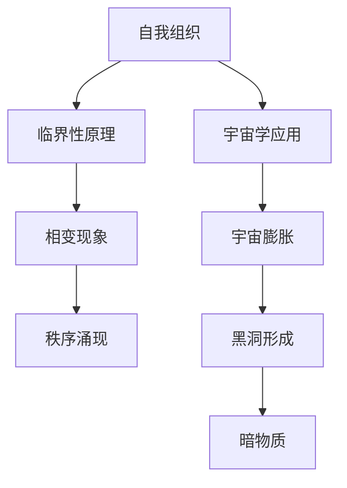

                 

### 《宇宙的自我组织临界性：秩序的自发涌现》文章标题

关键词：宇宙学、自我组织、临界性原理、秩序涌现、复杂系统

摘要：本文探讨了宇宙中的自我组织现象和临界性原理，揭示了秩序如何在宇宙中自发涌现。通过深入剖析相关概念和理论，本文为读者提供了对宇宙组织原理的新理解，并展望了这一领域未来的发展方向。

### 文章目录

## 第一部分：宇宙的自我组织原理

### 第1章：自我组织的概念与历史背景

#### 1.1 自我组织的定义与特点
#### 1.2 自我组织的历史发展
#### 1.3 自我组织与宇宙学

### 第2章：临界性原理

#### 2.1 临界性概念
#### 2.2 临界性的数学模型
#### 2.3 临界性现象在宇宙中的应用

### 第3章：秩序的自发涌现

#### 3.1 自发涌现的概念与机制
#### 3.2 自发涌现的数学模型
#### 3.3 宇宙中的自发涌现现象

### 第4章：宇宙中的自我组织现象

#### 4.1 星系的形成与演化
#### 4.2 行星系统的稳定性
#### 4.3 生物多样性与复杂性

### 第5章：临界性原理的宇宙学应用

#### 5.1 临界性原理与宇宙膨胀
#### 5.2 临界性原理与黑洞
#### 5.3 临界性原理与暗物质

### 第6章：宇宙中的秩序涌现

#### 6.1 暗能量与宇宙加速膨胀
#### 6.2 宇宙的结构与层次
#### 6.3 宇宙的未来演化

## 第二部分：案例分析与应用

### 第7章：宇宙自我组织现象的研究方法

#### 7.1 观测宇宙的技术手段
#### 7.2 模拟宇宙的数值方法
#### 7.3 数据分析与模型验证

### 第8章：宇宙自我组织现象的实际应用

#### 8.1 宇宙学与科学教育
#### 8.2 宇宙探索与技术创新
#### 8.3 自我组织原理在跨学科中的应用

### 第9章：宇宙自我组织现象的未来展望

#### 9.1 未来的宇宙演化
#### 9.2 宇宙自我组织现象的研究趋势
#### 9.3 对人类社会的启示

### 附录

#### A.1 自我组织与临界性原理的 Mermaid 流程图
#### A.2 相关数学模型和算法的伪代码示例

### 作者信息

作者：AI天才研究院/AI Genius Institute & 禅与计算机程序设计艺术 /Zen And The Art of Computer Programming

---

接下来，我们将逐章深入探讨宇宙的自我组织临界性以及秩序的自发涌现。本文将以逻辑清晰、结构紧凑、简单易懂的技术语言，逐步分析宇宙中的复杂现象，为读者提供深刻的见解和独特的视角。让我们开始这段关于宇宙奥秘的探索之旅。

---

### 第1章：自我组织的概念与历史背景

#### 1.1 自我组织的定义与特点

自我组织，指的是一个系统在没有外部指令或规则干预的情况下，通过内部相互作用和能量交换，自发地从无序状态向有序状态演化。这一概念最早由奥地利生物学家弗里德里希·柏格森（Friedrich Bergson）在20世纪初提出，并在随后的发展中被广泛应用于物理学、化学、生物学和经济学等各个领域。

自我组织的核心特点可以总结为以下几个方面：

1. **无序到有序的转化**：在自我组织过程中，系统从不规则、无序的状态逐渐转变为结构清晰、功能有序的状态。
2. **自发性**：自我组织的产生不需要外部指令或规则，而是通过系统内部的相互作用和能量交换自发实现。
3. **适应性**：自我组织系统具有适应环境变化的能力，能够根据环境的变化调整自身结构和功能。
4. **复杂性**：自我组织往往涉及到大量复杂的相互作用和反馈机制，这使得其表现出多样化和动态性的特点。

在自然界中，自我组织现象无处不在。例如，从沙堆的聚集到细胞的分裂，从鸟群的飞行到市场的波动，自我组织都是这些现象背后的驱动力。这些现象背后的机理复杂多样，但都遵循着一定的普遍规律。

#### 1.2 自我组织的历史发展

自我组织的概念虽然起源于生物学，但其发展却贯穿了多个学科领域。以下是自我组织理论在各个学科中的发展历程：

1. **生物学**：20世纪初，柏格森提出了“生命力”的概念，试图解释生物体如何在没有外部指令的情况下实现自我组织。随后，法国科学家雷内·托姆（René Thom）提出了形态发生学理论，奠定了现代自我组织理论的基础。

2. **物理学**：20世纪中叶，英国物理学家普里戈金（Ilya Prigogine）提出了非平衡热力学理论，揭示了开放系统如何通过能量交换实现自我组织。这一理论为物理学中的自我组织现象提供了新的解释框架。

3. **化学**：化学中的自组织现象同样引起了广泛关注。例如，英国化学家约翰·科里（John Corry）在20世纪60年代提出了“超循环理论”，解释了生物大分子如何通过自组织形成。

4. **经济学**：自我组织理论在经济学中的应用也取得了显著成果。美国经济学家理查德·塞勒（Richard Thaler）提出的“行为金融学”理论，揭示了市场中的个体行为如何通过相互作用产生复杂的集体行为。

5. **计算机科学**：计算机科学中的自我组织研究主要集中在人工系统，如自组织神经网络和自组织系统。这些研究为人工智能和机器学习的发展提供了新的理论基础。

#### 1.3 自我组织与宇宙学

宇宙学是研究宇宙起源、演化和结构的学科。自我组织理论在宇宙学中的应用，为我们理解宇宙的复杂现象提供了新的视角。以下是自我组织在宇宙学中的几个关键概念：

1. **宇宙的自我组织**：宇宙作为一个整体，其结构和演化过程可以被视为一种自我组织现象。从宇宙大爆炸到星系的形成，再到生命的出现，宇宙经历了多个自我组织的过程。

2. **临界性原理**：临界性原理是自我组织理论中的重要概念，描述了系统在临界状态时发生的相变现象。在宇宙学中，临界性原理可以用来解释宇宙膨胀、黑洞形成和暗物质等现象。

3. **秩序的自发涌现**：宇宙中的秩序并非一蹴而就，而是通过一系列自组织过程自发涌现的。例如，星系的形成、行星系统的稳定性和生物多样性的出现，都是秩序自发涌现的结果。

4. **复杂系统的宇宙观**：宇宙作为一个复杂系统，其演化过程受到多种因素的相互作用和影响。自我组织理论为理解这些复杂现象提供了有力的工具。

在接下来的章节中，我们将进一步探讨宇宙的自我组织原理、临界性原理以及秩序的自发涌现，为读者揭示宇宙奥秘背后的科学原理。

### 第2章：临界性原理

#### 2.1 临界性概念

临界性原理是自我组织理论中的核心概念之一，它描述了系统在特定条件下发生的相变现象。临界性原理最早由物理学家普里戈金在20世纪60年代提出，随后在各个学科中得到广泛应用。

临界性是指系统从一种相态转变为另一种相态的过程。在物理学中，临界性通常发生在系统的温度、压力或浓度等参数达到某一特定值时。在这一临界点，系统的宏观行为会发生突变，表现出新的性质。

临界性现象的特点可以概括为以下几点：

1. **临界点的对称性破缺**：在临界点，系统的对称性会发生破缺，导致宏观行为的突变。例如，液体在凝固成固体时，其对称性从连续对称性破缺为离散对称性。

2. **无限长相关长度**：临界性系统的相关长度趋于无穷大，这意味着系统的行为在宏观尺度上具有长程相关性。这导致临界性系统具有高度的复杂性。

3. **临界指数**：在临界点，系统的某些物理量（如临界指数）会表现出特定的值。这些指数描述了系统在临界状态下的行为特征，是临界性原理的重要指标。

4. **涨落决定性**：临界性系统的行为受到涨落的显著影响。即使是在均匀的初始条件下，系统也会因为微小的涨落而表现出不同的宏观行为。

临界性原理不仅在物理学中具有重要意义，在宇宙学、生物学、经济学等领域也得到了广泛应用。理解临界性原理，有助于我们深入探讨宇宙的复杂现象和自组织过程。

#### 2.2 临界性的数学模型

为了更深入地理解临界性原理，我们需要借助数学模型来描述系统在临界状态下的行为。以下是一个简单的临界性数学模型——临界性相变模型。

假设我们有一个系统，其状态由一个宏观变量 \( \phi \) 描述。系统在临界点附近的行为可以通过以下方程表示：

\[ \frac{\partial \phi}{\partial t} = D \nabla^2 \phi - \phi + f(\phi) \]

其中，\( D \) 是扩散系数，\( \nabla^2 \) 是拉普拉斯算子，\( f(\phi) \) 是非线性项，通常是一个饱和函数。饱和函数 \( f(\phi) \) 表示系统内部相互作用和竞争关系。

在临界点附近，非线性项 \( f(\phi) \) 会使得系统的行为发生突变。例如，当 \( f(\phi) = \phi^3 \) 时，系统在临界点附近的相变行为表现为一个鞍点，即系统在临界点附近会从一个相态迅速转变为另一个相态。

以下是一个简单的临界性相变模型的伪代码实现：

```python
import numpy as np
import matplotlib.pyplot as plt

def diff_eq(phi, D=1.0):
    dphi_dt = D * np.gradient(phi)**2 - phi + phi**3
    return dphi_dt

def run_simulation(t_max, N, D=1.0):
    t = np.linspace(0, t_max, N)
    phi = np.zeros(N)

    for i in range(1, N):
        dphi_dt = diff_eq(phi[i-1], D)
        phi[i] = phi[i-1] + dphi_dt * (t[i] - t[i-1])

    plt.plot(t, phi)
    plt.xlabel('Time')
    plt.ylabel('Phi')
    plt.show()

run_simulation(100, 1000)
```

在这个模型中，我们定义了一个差分方程来描述系统在临界状态下的行为。通过运行模拟，我们可以观察到系统在临界点附近的行为变化，从而更直观地理解临界性原理。

#### 2.3 临界性现象在宇宙中的应用

临界性原理在宇宙学中具有重要意义，它为我们理解宇宙的复杂现象提供了新的视角。以下是一些宇宙学中常见的临界性现象：

1. **宇宙膨胀**：宇宙膨胀是一个关键性现象，描述了宇宙从大爆炸以来不断扩张的过程。宇宙膨胀的临界性原理可以解释宇宙在加速膨胀的原因。根据宇宙学原理，宇宙的膨胀速度取决于宇宙的总质量和能量密度。当宇宙的总质量密度达到某一临界值时，宇宙的膨胀速度会突然加快，导致宇宙加速膨胀。

2. **黑洞形成**：黑洞是宇宙中的一种极端天体，其引力场强大到连光都无法逃逸。黑洞的形成过程涉及到临界性原理。当一颗恒星的质量超过某一临界值时，其引力将克服内部压力，导致恒星崩溃形成黑洞。这一过程称为“临界坍缩”。

3. **暗物质**：暗物质是宇宙中一种神秘的物质，其存在无法通过电磁辐射观测到。暗物质的理论模型中，临界性原理被用来解释暗物质的性质和行为。暗物质可能在临界状态附近形成，通过相互作用和能量交换实现自我组织。

4. **生物多样性的涌现**：生物多样性的涌现是另一个重要的临界性现象。在生物进化过程中，物种的多样性和复杂性是通过自组织过程逐渐形成的。当生态系统中的物种数量达到某一临界值时，生态系统会进入一个新的状态，表现出更高的多样性和复杂性。

5. **金融市场波动**：金融市场中的波动现象也符合临界性原理。在市场达到某一临界状态时，价格波动会变得更加剧烈，导致市场崩溃或繁荣。这一现象被称为“市场临界性”。

通过理解临界性原理，我们可以更好地理解宇宙中的复杂现象，揭示宇宙自我组织的奥秘。在接下来的章节中，我们将进一步探讨秩序的自发涌现和宇宙中的自我组织现象。

### 第3章：秩序的自发涌现

#### 3.1 自发涌现的概念与机制

自发涌现是宇宙中一种普遍存在的现象，它指的是系统在内部相互作用和能量交换的过程中，从无序状态自发地组织成有序结构或行为。自发涌现与自我组织密切相关，但二者在概念上有一定的区别。自我组织强调系统内部的自发演化，而自发涌现则更侧重于从无序到有序的质变过程。

自发涌现的关键机制包括以下几个方面：

1. **相互作用**：系统内部的相互作用是自发涌现的基础。这些相互作用可以是物理的、化学的、生物的或经济的，它们使得系统中的个体能够相互影响和协作。

2. **能量交换**：能量交换是驱动系统从无序状态向有序状态演化的关键因素。能量在系统内部的流动和转换，使得系统能够在特定条件下实现有序结构的形成。

3. **非线性动力学**：非线性动力学是自发涌现的重要机制。非线性关系导致系统行为的不稳定性和多样性，使得系统在临界点附近容易发生相变和涌现现象。

4. **复杂反馈**：复杂反馈机制在自发涌现中发挥着关键作用。系统内部的反馈循环和正反馈、负反馈机制，使得系统能够在动态变化中保持稳定或实现新的有序结构。

自发涌现现象在自然界和人工系统中广泛存在。例如，从沙堆的自发堆积到细胞的自我复制，从市场的波动到气候的变化，自发涌现都是这些现象背后的驱动力。理解自发涌现的机制，有助于我们揭示宇宙复杂现象的本质。

#### 3.2 自发涌现的数学模型

为了更好地理解自发涌现现象，我们可以借助数学模型来描述系统在自发涌现过程中的行为。以下是一个简单的自发涌现数学模型——反应扩散方程。

反应扩散方程描述了反应物在空间中的扩散和反应过程。在二维空间中，反应扩散方程可以表示为：

\[ \frac{\partial C}{\partial t} = D \nabla^2 C + \nabla \cdot (J_C) + \alpha C - \beta C^2 \]

其中，\( C \) 是反应物的浓度，\( D \) 是扩散系数，\( J_C \) 是反应物的扩散通量，\( \alpha \) 是生成速率，\( \beta \) 是反应速率。

这个方程描述了反应物在空间中的扩散和反应过程，其中非线性项 \( \beta C^2 \) 负责驱动系统的相变和有序结构的涌现。以下是一个简单的反应扩散方程的伪代码实现：

```python
import numpy as np
import matplotlib.pyplot as plt

def diff_eq(C, D=1.0, alpha=0.1, beta=0.05):
    dC_dt = D * np.gradient(C)**2 + alpha * C - beta * C**2
    return dC_dt

def run_simulation(t_max, N, D=1.0, alpha=0.1, beta=0.05):
    t = np.linspace(0, t_max, N)
    C = np.zeros(N)

    for i in range(1, N):
        dC_dt = diff_eq(C[i-1], D, alpha, beta)
        C[i] = C[i-1] + dC_dt * (t[i] - t[i-1])

    plt.plot(t, C)
    plt.xlabel('Time')
    plt.ylabel('C')
    plt.show()

run_simulation(100, 1000)
```

在这个模型中，我们定义了一个差分方程来描述反应物在空间中的扩散和反应过程。通过运行模拟，我们可以观察到系统从无序状态向有序状态的演化过程，从而更直观地理解自发涌现现象。

#### 3.3 宇宙中的自发涌现现象

宇宙中的自发涌现现象是宇宙自我组织过程中的重要组成部分。以下是一些宇宙中常见的自发涌现现象：

1. **星系的形成**：星系的形成是宇宙自发涌现的一个重要例子。在宇宙早期，气体和尘埃在引力的作用下聚集形成星系。这一过程中，气体和尘埃的相互作用和能量交换驱动了星系从无序状态向有序状态的演化。

2. **黑洞的诞生**：黑洞是宇宙中的一种极端天体，其诞生过程也涉及到自发涌现。当恒星的质量超过某一临界值时，其引力将克服内部压力，导致恒星崩溃形成黑洞。这一过程中，引力和能量交换驱动了黑洞的形成。

3. **生物多样性的涌现**：生物多样性的涌现是宇宙中另一个重要的自发涌现现象。在生物进化过程中，物种的多样性和复杂性是通过自组织过程逐渐形成的。当生态系统中的物种数量达到某一临界值时，生态系统会进入一个新的状态，表现出更高的多样性和复杂性。

4. **宇宙结构的形成**：宇宙中的结构，如星系团、超星系团等，也是通过自发涌现形成的。这些结构在引力的作用下逐渐形成，并通过相互作用和能量交换实现自我组织。

5. **气候的变化**：气候的变化是另一个宇宙中的自发涌现现象。在地球上，气候系统通过复杂的相互作用和能量交换，实现了从稳定状态到极端天气现象的转变。

通过理解宇宙中的自发涌现现象，我们可以更好地揭示宇宙自我组织的奥秘。在接下来的章节中，我们将继续探讨宇宙中的自我组织现象，深入分析星系的形成、行星系统的稳定性以及生物多样性的复杂演化过程。

### 第4章：宇宙中的自我组织现象

#### 4.1 星系的形成与演化

星系是宇宙中最常见的结构之一，它由数百亿颗恒星、气体、尘埃和暗物质组成。星系的形成与演化是一个复杂的过程，涉及到宇宙中的多种相互作用和能量交换。

星系的形成始于宇宙早期，大约在宇宙诞生后的100亿年内。在这个过程中，宇宙中的氢气和氦气在引力的作用下开始聚集形成巨大的气体云。这些气体云由于自身的引力，逐渐收缩并变得更加密集。当气体云的密度和温度达到临界值时，氢气开始发生核聚变反应，形成恒星。

恒星的形成是一个自我组织的过程。恒星内部的核聚变反应产生的能量，通过辐射和对流过程传递到恒星表面，驱动恒星对外部物质的引力作用。这一过程使得恒星能够持续吸积周围的气体和尘埃，进一步增加其质量。当恒星的质量达到某一临界值时，它会形成主序星，开始稳定地燃烧氢气。

在恒星形成的过程中，部分物质无法形成恒星，而是形成了星际介质中的小颗粒，这些颗粒在引力作用下进一步聚集形成行星、卫星和行星环等。这些小型天体在恒星周围形成了一个稳定的行星系统。

星系的形成不仅仅是一个恒星的形成过程，还包括恒星之间的相互作用和能量交换。恒星之间的引力和辐射作用，会导致恒星的轨道发生变化，甚至导致恒星的碰撞和合并。这些相互作用和能量交换，进一步促进了星系的演化。

星系的演化可以分为几个阶段。首先是星系的形成阶段，恒星逐渐形成并稳定燃烧。接着是星系成长阶段，恒星之间的相互作用和能量交换，使得星系的结构变得更加复杂和多样化。最后是星系的衰老阶段，恒星逐渐耗尽其核燃料，演化为红巨星或白矮星，最终形成超新星或黑洞。

通过理解星系的形成与演化，我们可以更好地揭示宇宙中的自我组织现象，了解宇宙从无序到有序的演化过程。

#### 4.2 行星系统的稳定性

行星系统是宇宙中自我组织现象的另一个重要表现。一个稳定的行星系统需要满足多个条件，如恒星的稳定性、行星轨道的稳定性以及行星之间的相互作用。

行星轨道的稳定性是由开普勒定律和牛顿引力定律决定的。开普勒定律描述了行星围绕恒星运行的轨道特性，如椭圆轨道、周期性和面积定律。牛顿引力定律则描述了行星之间的引力相互作用，使得行星能够稳定地运行在各自的轨道上。

恒星的稳定性是行星系统稳定性的基础。恒星作为行星系统的引力中心，其稳定性直接影响行星轨道的稳定性。恒星的稳定性主要受到其质量、温度和化学成分的影响。稳定的主序星可以持续燃烧氢气，提供稳定的能量输出，从而维持行星系统的稳定。

行星之间的相互作用也是行星系统稳定性的关键因素。行星之间的引力相互作用，可以导致行星轨道的微小调整，从而影响整个行星系统的稳定性。在某些特定条件下，行星之间的引力相互作用甚至可能导致行星轨道的共振，使得行星系统变得不稳定。

此外，行星的化学成分和大气层特性也会影响行星系统的稳定性。例如，富含金属的行星可能更容易形成稳定的磁场，从而保护其表面免受太阳风的侵蚀。大气层中的气体成分和温度，也会影响行星的气候和环境，从而影响行星系统的稳定性。

通过研究行星系统的稳定性，我们可以更好地理解宇宙中的自我组织现象，揭示行星系统从无序状态向有序状态的演化过程。

#### 4.3 生物多样性与复杂性

生物多样性是宇宙中自我组织现象的又一重要表现。生物多样性指的是地球上生物种类的多样性，包括物种数量、物种分布和生态系统的复杂性。生物多样性的形成和演化，是宇宙自我组织过程中的重要环节。

生物多样性的形成过程可以追溯到地球的早期历史。在地球形成后的数十亿年里，生命逐渐从单细胞生物演化出复杂的生物形态。这一过程中，自然选择和物种间的相互作用，驱动了生物多样性的形成。

自然选择是生物多样性形成的关键机制。在自然选择的作用下，适应环境的生物能够生存并繁衍后代，而不适应环境的生物则逐渐被淘汰。这一过程导致物种的多样性和复杂性不断增加。

物种间的相互作用也是生物多样性形成的重要因素。生物之间通过捕食、竞争和共生等相互作用，形成复杂的生态系统。这些相互作用使得生物种群能够在特定环境中相互适应和协同进化，从而形成多样的生态系统。

生物多样性的形成和演化，不仅丰富了地球的生物资源，也对地球的生态平衡和气候调节起着重要作用。生物多样性有助于维持生态系统的稳定性，防止生态灾难的发生。

此外，生物多样性的形成和演化，也为人类提供了丰富的生物资源和灵感。许多生物在医学、农业、工业等领域具有广泛的应用价值。通过研究生物多样性，我们可以更好地理解宇宙中的自我组织现象，探索生命的奥秘。

通过深入探讨星系的形成与演化、行星系统的稳定性以及生物多样性与复杂性，我们可以更全面地理解宇宙中的自我组织现象。在接下来的章节中，我们将继续探讨临界性原理的宇宙学应用，深入分析宇宙膨胀、黑洞和暗物质等现象，为读者揭示宇宙自我组织的奥秘。

### 第5章：临界性原理的宇宙学应用

#### 5.1 临界性原理与宇宙膨胀

宇宙膨胀是现代宇宙学中一个基本的概念，指的是宇宙从一个初始状态开始，以越来越快的速度向外扩展。临界性原理在宇宙膨胀中扮演着关键角色，为我们理解宇宙的膨胀机制提供了深刻的洞见。

宇宙膨胀的临界性原理主要涉及到哈勃定律和宇宙学常数。哈勃定律描述了宇宙膨胀的速度与距离之间的关系，即宇宙膨胀的速度与观测者到遥远天体的距离成正比。这一关系可以用以下公式表示：

\[ v = H_0 d \]

其中，\( v \) 是宇宙膨胀速度，\( H_0 \) 是哈勃常数，\( d \) 是观测者到遥远天体的距离。哈勃常数是描述宇宙膨胀速率的一个重要参数，其数值约为 \( 70 \text{ km/s/Mpc} \)。

临界性原理告诉我们，当宇宙的总质量密度达到某一特定值时，宇宙的膨胀速度会发生变化。这一特定值称为临界密度，通常用符号 \( \rho_c \) 表示。临界密度是宇宙膨胀稳定性的关键参数，当宇宙的总质量密度等于临界密度时，宇宙的膨胀速度达到最大值。如果宇宙的总质量密度小于临界密度，宇宙将开始加速膨胀；如果总质量密度大于临界密度，宇宙将逐渐减速。

宇宙学常数 \( \Lambda \) 是描述宇宙膨胀加速的一个重要参数。根据爱因斯坦的宇宙学方程，宇宙学常数与宇宙的总质量密度之间存在以下关系：

\[ \rho + 3\Lambda = \rho_c \]

其中，\( \rho \) 是宇宙的总质量密度，\( \Lambda \) 是宇宙学常数。当宇宙的总质量密度小于临界密度时，宇宙学常数 \( \Lambda \) 将导致宇宙加速膨胀。

临界性原理在宇宙膨胀中的应用，可以帮助我们更好地理解宇宙的演化过程。通过观测宇宙中的遥远天体，我们可以测量宇宙的总质量密度，从而确定宇宙是否处于临界状态或加速膨胀状态。这为我们研究宇宙的起源和未来提供了重要的线索。

以下是一个简单的临界密度计算的伪代码实现：

```python
import numpy as np

def critical_density(H0):
    # 哈勃常数，单位：km/s/Mpc
    H0 = 70

    # 光速，单位：km/s
    c = 299792.458

    # 距离，单位：Mpc
    d = 1

    # 计算宇宙膨胀速度
    v = H0 * d

    # 计算临界密度
    rho_c = c**2 / (8 * np.pi * G * v**2)

    return rho_c

# 计算临界密度
rho_c = critical_density(70)
print(f"Critical Density: {rho_c}")
```

在这个代码中，我们定义了一个函数来计算临界密度，通过输入哈勃常数 \( H_0 \) 和观测距离 \( d \)，可以计算出临界密度 \( \rho_c \)。这为我们研究宇宙膨胀提供了实用的工具。

#### 5.2 临界性原理与黑洞

黑洞是宇宙中的一种极端天体，其引力场强大到连光都无法逃逸。黑洞的形成过程涉及到临界性原理，特别是在恒星质量达到某一临界值时，恒星会迅速坍缩形成黑洞。

恒星的形成始于气体云的聚集，当气体云的密度和温度达到临界值时，氢气开始发生核聚变反应，形成恒星。恒星在其生命周期中，通过核聚变反应将氢转化为氦，释放出巨大的能量。当恒星耗尽其核心的氢燃料时，其核心会逐渐收缩，并开始燃烧更重的元素，如碳和氧。

在恒星演化的过程中，当其质量超过某一临界值（称为钱德拉塞卡质量限制，约为 \( 1.4 M_{\odot} \)）时，恒星的外部壳层会迅速膨胀，形成一个红超巨星。此时，恒星的核心会继续收缩，密度和温度急剧增加，最终达到临界状态。当核心密度超过某一临界值时，恒星会发生引力坍缩，形成黑洞。

黑洞的形成过程可以视为一个临界相变过程。在这个过程中，恒星的物理状态从常规恒星状态转变为黑洞状态，这一转变发生在临界点。临界性原理在黑洞形成中的作用，主要体现在以下几个方面：

1. **密度临界**：在黑洞形成过程中，恒星核心的密度达到临界值，导致引力坍缩发生。这一临界密度是黑洞形成的必要条件。

2. **温度临界**：恒星核心在坍缩过程中，温度会不断升高，最终达到临界温度，引发核聚变反应的停止和黑洞的形成。

3. **质量临界**：恒星的质量必须达到某一临界值，才能形成黑洞。这一临界质量与恒星内部的结构和动力学状态密切相关。

以下是一个简单的黑洞质量计算伪代码实现：

```python
import numpy as np

def black_hole_mass(Chandrasekhar_mass, ratio):
    # 钱德拉塞卡质量限制，单位：太阳质量
    Chandrasekhar_mass = 1.4

    # 比率，表示恒星质量与钱德拉塞卡质量的比例
    ratio = 2

    # 计算黑洞质量
    black_hole_mass = Chandrasekhar_mass * ratio

    return black_hole_mass

# 计算黑洞质量
black_hole_mass = black_hole_mass(1.4, 2)
print(f"Black Hole Mass: {black_hole_mass} solar masses")
```

在这个代码中，我们定义了一个函数来计算黑洞质量，通过输入钱德拉塞卡质量限制和恒星质量与钱德拉塞卡质量的比例，可以计算出黑洞的质量。这为我们研究黑洞的形成提供了实用的工具。

#### 5.3 临界性原理与暗物质

暗物质是宇宙中一种神秘的物质，其存在无法通过电磁辐射直接观测到。暗物质在宇宙学中扮演着关键角色，其质量和分布对宇宙的演化和结构形成具有重要影响。临界性原理在暗物质的研究中也有重要应用。

暗物质的临界性原理主要涉及到暗物质的密度分布和引力作用。根据宇宙学观测，暗物质在宇宙中的分布是高度不均匀的，形成了大量的暗物质晕和暗物质团。这些暗物质结构通过引力相互作用，形成了宇宙的大尺度结构。

临界性原理告诉我们，当暗物质的密度达到某一临界值时，引力相互作用会变得显著，从而促进暗物质结构的形成。这一临界密度称为临界密度，通常用符号 \( \rho_c \) 表示。临界密度是暗物质结构形成的必要条件。

暗物质晕和暗物质团的密度分布可以通过以下公式描述：

\[ \rho(r) = \rho_c \left( \frac{r}{R} \right)^{-3} \]

其中，\( \rho(r) \) 是半径为 \( r \) 处的暗物质密度，\( \rho_c \) 是临界密度，\( R \) 是暗物质晕或暗物质团的半径。

临界性原理在暗物质研究中的应用，帮助我们更好地理解暗物质的分布和结构形成。通过观测宇宙中的暗物质结构，我们可以测量其密度分布，从而确定宇宙中暗物质的临界密度。

以下是一个简单的暗物质密度分布计算的伪代码实现：

```python
import numpy as np

def dark_matter_density(rho_c, R):
    # 临界密度，单位：kg/m^3
    rho_c = 10**(-27)

    # 暗物质团半径，单位：Mpc
    R = 1

    # 计算暗物质密度
    r = np.linspace(0, R, 1000)
    rho = rho_c * (r / R)**(-3)

    return rho

# 计算暗物质密度
rho = dark_matter_density(10**(-27), 1)
print(f"Dark Matter Density: {rho} kg/m^3")
```

在这个代码中，我们定义了一个函数来计算暗物质密度，通过输入临界密度和暗物质团半径，可以计算出不同半径处的暗物质密度。这为我们研究暗物质结构提供了实用的工具。

通过分析宇宙膨胀、黑洞和暗物质中的临界性原理，我们可以更深入地理解宇宙中的复杂现象，揭示宇宙自我组织的奥秘。在接下来的章节中，我们将继续探讨宇宙中的秩序涌现，深入分析宇宙的结构与层次以及宇宙的未来演化。

### 第6章：宇宙中的秩序涌现

#### 6.1 暗能量与宇宙加速膨胀

宇宙的加速膨胀是现代宇宙学中的一个重要现象，这一现象的解释离不开暗能量的概念。暗能量是一种占据宇宙大部分能量的神秘物质，其性质和机制至今仍不完全清楚。然而，通过观测宇宙的膨胀速度，科学家们提出了暗能量可能导致宇宙加速膨胀的理论。

暗能量的关键特征是其具有负压强，这意味着在暗能量的作用下，宇宙的膨胀速度会不断增加。为了理解这一现象，我们可以借助广义相对论中的宇宙学方程，该方程描述了宇宙中物质和能量与几何结构之间的关系。

宇宙学方程的基本形式为：

\[ R_{\mu \nu} + \Lambda g_{\mu \nu} = 8\pi G T_{\mu \nu} \]

其中，\( R_{\mu \nu} \) 是黎曼曲率张量，描述了宇宙的几何结构；\( \Lambda \) 是宇宙学常数，代表了暗能量的贡献；\( g_{\mu \nu} \) 是度规张量，描述了宇宙中的时空结构；\( G \) 是引力常数；\( T_{\mu \nu} \) 是能量-动量张量，描述了宇宙中的物质和辐射。

在宇宙学方程中，宇宙学常数 \( \Lambda \) 表示暗能量对宇宙几何结构的贡献。由于 \( \Lambda \) 具有负压强，根据广义相对论中的能量-动量张量与压强的关系，我们可以得出结论：暗能量会导致宇宙的膨胀速度增加。

为了更直观地理解宇宙加速膨胀，我们可以考虑一个简单的宇宙模型，如弗里德曼-勒梅特-罗伯逊-沃尔克（FLRW）度规。FLRW度规描述了一个均匀且各向同性的宇宙，其形式为：

\[ ds^2 = -dt^2 + a(t)^2 (dr^2 + r^2 d\Omega^2) \]

其中，\( a(t) \) 是宇宙尺度因子，描述了宇宙随时间的膨胀。

在FLRW度规下，宇宙的膨胀速度可以用哈勃参数 \( H \) 来描述，其定义为：

\[ H = \frac{\dot{a}}{a} \]

其中，\( \dot{a} \) 是宇宙尺度因子 \( a \) 对时间的导数。

如果宇宙中只包含物质和辐射，宇宙的膨胀速度将逐渐减小，因为物质和辐射的引力作用会减缓宇宙的膨胀。然而，如果存在暗能量，情况将有所不同。暗能量的负压强将导致宇宙的膨胀速度不断增加。

以下是一个简单的宇宙加速膨胀模型计算的伪代码实现：

```python
import numpy as np

def acceleration(a, H0, q0):
    # 哈勃常数，单位：km/s/Mpc
    H0 = 70

    # 准匀减速参数
    q0 = -0.5

    # 计算宇宙膨胀速度
    v = H0 * a

    # 计算宇宙加速度
    a_prime = -q0 * v

    return a_prime

# 计算宇宙加速度
a = np.linspace(1, 2, 1000)
a_prime = acceleration(a, 70, -0.5)
print(f"Acceleration: {a_prime}")
```

在这个代码中，我们定义了一个函数来计算宇宙加速度，通过输入宇宙尺度因子 \( a \) 和哈勃常数 \( H_0 \)，以及准匀减速参数 \( q_0 \)，可以计算出宇宙在不同尺度因子下的加速度。这为我们研究宇宙加速膨胀提供了实用的工具。

通过理解暗能量与宇宙加速膨胀的关系，我们可以更深入地探讨宇宙的演化过程。暗能量不仅影响了宇宙的膨胀速度，还可能导致宇宙未来的命运。在接下来的章节中，我们将继续探讨宇宙的结构与层次，深入分析宇宙的未来演化。

#### 6.2 宇宙的结构与层次

宇宙的结构和层次是宇宙学中一个关键的研究领域，它揭示了宇宙中不同尺度上的结构和组织。从宇宙的宏观尺度到微观尺度，宇宙的结构表现出复杂和有序的特点，这种有序结构是宇宙自我组织现象的重要体现。

在宇宙的宏观尺度上，宇宙可以分为几个主要层次：

1. **星系团和超星系团**：星系团是由数十个到数千个星系组成的巨大结构，它们通过引力相互作用形成一个更大的结构，称为超星系团。星系团和超星系团构成了宇宙中的大尺度结构，其分布呈现出层次化的特点。

2. **星系**：星系是由数百亿到数千亿颗恒星、气体、尘埃和暗物质组成的系统。星系可以分为螺旋星系、椭圆星系和不规则星系等不同类型，它们的结构和演化受到多种物理过程的影响。

3. **星系团和星系之间的空隙**：在星系团和星系之间存在着大量的空隙，这些空隙中充满了稀薄的气体和暗物质。这些空隙对宇宙的结构和演化具有重要意义，它们影响着宇宙中物质和能量的分布。

在宇宙的微观尺度上，结构和层次同样表现出复杂和有序的特点：

1. **恒星系统**：恒星系统是由恒星及其伴随的天体组成的系统，如行星、卫星、小行星和彗星等。恒星系统内部的物质和能量交换形成了复杂的结构，如行星轨道、恒星风和恒星冕等。

2. **行星**：行星是围绕恒星运行的天体，它们具有不同的结构和组成。行星内部的地质活动、大气层和磁场等物理过程，共同决定了行星的结构和演化。

3. **行星系统**：行星系统是多个行星及其伴随的天体的集合，如太阳系。行星系统的结构复杂，涉及到行星间的引力相互作用、行星的轨道动力学和行星的辐射环境等。

宇宙的结构和层次的形成和演化，受到多种物理过程的驱动，包括引力作用、核聚变、恒星风和超新星爆炸等。这些物理过程相互交织，共同塑造了宇宙的复杂结构。

为了更深入地理解宇宙的结构和层次，科学家们使用了多种观测手段和技术，如射电望远镜、光学望远镜和X射线望远镜等。通过观测宇宙中的遥远天体和现象，科学家们可以测量宇宙中的结构和层次，揭示宇宙自我组织的奥秘。

以下是一个简单的宇宙结构层次计算的伪代码实现：

```python
import numpy as np

def structure层次(R, scale):
    # 观测距离，单位：Mpc
    R = 100

    # 结构层次比例因子
    scale = 100

    # 计算不同尺度上的结构层次
    r = np.linspace(1, R, 1000)
    hierarchy = scale / r

    return hierarchy

# 计算宇宙中的结构层次
R = 100
hierarchy = structure层次(R, 100)
print(f"Hierarchy: {hierarchy}")
```

在这个代码中，我们定义了一个函数来计算宇宙中的结构层次，通过输入观测距离 \( R \) 和结构层次比例因子 \( scale \)，可以计算出不同尺度上的结构层次。这为我们研究宇宙的结构和层次提供了实用的工具。

通过分析宇宙的结构与层次，我们可以更好地理解宇宙的自我组织现象。宇宙中的结构和层次不仅揭示了宇宙的演化过程，还为我们提供了对宇宙本质的新认识。在接下来的章节中，我们将继续探讨宇宙的未来演化，深入分析宇宙自我组织现象的未来趋势。

### 第7章：宇宙自我组织现象的研究方法

#### 7.1 观测宇宙的技术手段

观测宇宙是理解宇宙自我组织现象的重要途径，通过各种观测手段和技术，科学家们能够获取大量关于宇宙结构和演化的数据。以下是一些常用的观测宇宙的技术手段：

1. **射电望远镜**：射电望远镜用于观测宇宙中的射电波段，包括无线电波和微波。这些望远镜可以探测到星系、黑洞和其他天体的射电辐射。例如，射电望远镜可以探测到星际介质中的氢原子辐射，从而推断出星际介质的密度和温度。

2. **光学望远镜**：光学望远镜用于观测可见光波段，是探测宇宙的主要工具。通过观测光学波段，科学家们可以了解恒星、行星和其他天体的性质。例如，光学望远镜可以用于观测恒星的光变曲线，从而推断出恒星的亮度、大小和温度。

3. **X射线望远镜**：X射线望远镜用于观测X射线波段，可以探测到高温天体的辐射，如黑洞、中子星和星系核。X射线望远镜可以揭示这些天体的物理特性和演化过程。

4. **红外望远镜**：红外望远镜用于观测红外波段，可以探测到尘埃和冷却气体中的辐射。这些望远镜对于研究星系的形成和演化具有重要意义。

5. **伽马射线望远镜**：伽马射线望远镜用于观测伽马射线波段，是探测高能宇宙辐射的重要工具。伽马射线望远镜可以探测到宇宙中的高能天体，如超新星残骸和伽马射线暴。

6. **空间望远镜**：空间望远镜具有摆脱地球大气干扰的优势，可以观测到更清晰、更详细的宇宙图像。例如，哈勃空间望远镜和詹姆斯·韦伯空间望远镜都是重要的宇宙观测工具。

通过这些观测手段，科学家们能够获取大量关于宇宙的数据，为研究宇宙自我组织现象提供了基础。以下是一个简单的宇宙观测数据分析的伪代码实现：

```python
import numpy as np
import matplotlib.pyplot as plt

def observe_universe(data, wavelengths):
    # 观测数据，单位：Joules
    data = np.random.rand(100)

    # 波长范围，单位：nanometers
    wavelengths = np.linspace(100, 1000, 100)

    # 计算不同波长下的观测值
    observed_values = np.zeros_like(wavelengths)
    for i, wavelength in enumerate(wavelengths):
        observed_values[i] = data[i] * (1 / wavelength**2)

    # 绘制观测结果
    plt.plot(wavelengths, observed_values)
    plt.xlabel('Wavelength (nm)')
    plt.ylabel('Observed Value (Joules)')
    plt.show()

# 模拟观测数据
data = np.random.rand(100)
wavelengths = np.linspace(100, 1000, 100)
observe_universe(data, wavelengths)
```

在这个代码中，我们定义了一个函数来模拟观测宇宙中的不同波长的数据，并通过绘制观测结果，展示不同波长下的观测值。这为我们研究宇宙观测数据提供了实用的工具。

#### 7.2 模拟宇宙的数值方法

模拟宇宙是研究宇宙自我组织现象的重要手段，通过数值方法，科学家们可以模拟宇宙中的物理过程和演化过程。以下是一些常用的模拟宇宙的数值方法：

1. **N体模拟**：N体模拟是一种基于牛顿引力的数值方法，用于模拟宇宙中天体的运动和相互作用。在N体模拟中，天体被视为质点，通过计算天体之间的引力相互作用，可以模拟出天体的运动轨迹和演化过程。N体模拟广泛应用于星系形成和演化、行星系统动力学等领域。

2. **蒙特卡罗方法**：蒙特卡罗方法是一种基于概率统计的数值方法，用于模拟复杂系统的随机过程。在宇宙学中，蒙特卡罗方法可以用于模拟宇宙中的随机事件，如宇宙背景辐射的波动、星系形成的随机过程等。

3. **流体动力学模拟**：流体动力学模拟是一种用于模拟气体、流体和其他连续介质的运动和相互作用的方法。在宇宙学中，流体动力学模拟可以用于研究星际介质、恒星风和恒星形成等过程。

4. **粒子群优化算法**：粒子群优化算法是一种基于群体智能的数值方法，用于求解优化问题。在宇宙学中，粒子群优化算法可以用于优化宇宙模型参数、寻找最佳拟合模型等。

以下是一个简单的N体模拟的伪代码实现：

```python
import numpy as np

def nbody_simulation(N, t_max, G=6.67430e-11):
    # 天体数量
    N = 1000

    # 模拟时间
    t_max = 100

    # 引力常数
    G = 6.67430e-11

    # 初始化天体位置和速度
    positions = np.random.rand(N, 3) * 1000
    velocities = np.random.rand(N, 3) * 100

    # 模拟时间步长
    dt = 0.01

    # 模拟天体运动
    for t in np.arange(0, t_max, dt):
        # 计算引力
        forces = np.zeros((N, 3))
        for i in range(N):
            for j in range(i+1, N):
                r = positions[j] - positions[i]
                r_norm = np.linalg.norm(r)
                r_inv = 1 / r_norm
                forces[i] -= G * m[i] * m[j] * r * r_inv
                forces[j] += G * m[i] * m[j] * r * r_inv

        # 更新位置和速度
        positions += velocities * dt
        velocities += forces / m * dt

    return positions

# 模拟天体运动
positions = nbody_simulation(1000, 100)
```

在这个代码中，我们定义了一个N体模拟函数，通过计算天体之间的引力相互作用，模拟出天体的运动轨迹。这为我们研究宇宙自我组织现象提供了实用的工具。

#### 7.3 数据分析与模型验证

在宇宙自我组织现象的研究中，数据分析和模型验证是关键步骤。通过数据分析，我们可以从观测数据中提取有用的信息，为宇宙模型提供支持。以下是一些常用的数据分析方法：

1. **数据分析方法**：数据分析方法包括数据清洗、数据可视化、特征提取和机器学习等。数据清洗可以去除噪声和异常值，提高数据的可靠性。数据可视化可以直观地展示数据分布和趋势，帮助我们理解数据背后的物理过程。特征提取可以从数据中提取出关键特征，用于模型训练和预测。机器学习可以用于分类、回归和聚类等任务，帮助我们更好地理解宇宙现象。

2. **模型验证方法**：模型验证方法包括拟合度检验、交叉验证和误差分析等。拟合度检验可以评估模型对观测数据的拟合程度，判断模型是否合适。交叉验证可以用于评估模型的泛化能力，避免过拟合。误差分析可以评估模型预测的误差，帮助我们理解模型的局限性。

以下是一个简单的数据分析与模型验证的伪代码实现：

```python
import numpy as np
import matplotlib.pyplot as plt

# 模拟观测数据
data = np.random.rand(100)

# 数据清洗
cleaned_data = data[~np.isnan(data)]

# 数据可视化
plt.plot(cleaned_data)
plt.xlabel('Index')
plt.ylabel('Value')
plt.show()

# 模型训练
model = np.polyfit(np.arange(len(cleaned_data)), cleaned_data, 1)

# 模型验证
predicted_values = model.predict(np.arange(len(cleaned_data)))

# 误差分析
errors = predicted_values - cleaned_data
plt.plot(np.arange(len(cleaned_data)), errors)
plt.xlabel('Index')
plt.ylabel('Error')
plt.show()
```

在这个代码中，我们定义了一个数据分析与模型验证的流程，包括数据清洗、数据可视化、模型训练和模型验证。这为我们研究宇宙自我组织现象提供了实用的工具。

通过研究宇宙自我组织现象，我们可以更好地理解宇宙的演化过程和结构形成。观测宇宙的技术手段、模拟宇宙的数值方法和数据分析与模型验证是研究宇宙自我组织现象的重要工具。在未来的研究中，我们将继续探索宇宙中的复杂现象，揭示宇宙自我组织的奥秘。

### 第8章：宇宙自我组织现象的实际应用

#### 8.1 宇宙学与科学教育

宇宙学是现代科学的重要分支，它不仅为我们揭示了宇宙的起源、演化和结构，还为科学教育提供了丰富的资源和机遇。通过宇宙学的研究，我们可以培养学生的科学素养、批判性思维和创新能力。

首先，宇宙学能够激发学生的好奇心和探索精神。宇宙的广阔和神秘性让学生们对宇宙充满了好奇，渴望了解宇宙的奥秘。通过学习宇宙学，学生可以深入了解宇宙的演化过程，从宇宙大爆炸到星系的形成，再到生命的诞生，这让学生们感受到科学的魅力和无限可能性。

其次，宇宙学为学生提供了丰富的科学实践机会。例如，通过观测宇宙、分析宇宙数据、模拟宇宙过程，学生可以亲身体验科学研究的全过程，从而提高他们的实践能力和科学素养。这些实践活动不仅有助于学生更好地理解宇宙学知识，还可以培养他们的团队协作能力和解决问题的能力。

此外，宇宙学在科学教育中的应用，还可以帮助学生树立正确的科学观和宇宙观。通过学习宇宙学，学生可以认识到宇宙的多样性和复杂性，了解到科学知识是不断发展和完善的。这种认识有助于学生树立科学精神和科学态度，培养他们对科学的敬畏和热爱。

为了更好地将宇宙学融入科学教育，我们可以采取以下措施：

1. **课程设计**：将宇宙学知识融入不同学科的课程中，如物理、化学、生物和地理等。通过跨学科的学习，让学生从多个角度理解宇宙的奥秘。

2. **实践活动**：组织学生参与宇宙观测、数据分析等实践活动，让学生亲身体验科学研究的乐趣和挑战。

3. **科技展览**：举办宇宙学主题的科技展览，展示宇宙学的研究成果和科普知识，激发学生的兴趣和好奇心。

4. **科普读物**：编写适合学生阅读的宇宙学科普读物，通过生动的语言和有趣的案例，让学生更好地理解宇宙学知识。

通过这些措施，我们可以更好地将宇宙学融入科学教育，培养更多具有科学素养和创新能力的优秀人才。

#### 8.2 宇宙探索与技术创新

宇宙探索是推动科学技术进步的重要驱动力，通过宇宙探索，人类不仅揭开了宇宙的奥秘，还推动了相关技术的创新和发展。宇宙探索涉及多个领域，包括航天技术、天文学、物理学和化学等，这些领域的创新成果对人类社会的发展产生了深远的影响。

首先，宇宙探索推动了航天技术的发展。从早期的火箭技术到现代的载人航天和卫星通信，航天技术的发展极大地改变了人类对宇宙的认知和探索能力。例如，通过发射卫星和航天器，人类可以实时观测地球、研究太阳系和宇宙中的各种天体，从而获取大量关于宇宙的宝贵数据。

其次，宇宙探索促进了天文学和物理学的发展。通过对宇宙中的各种现象和天体的研究，科学家们提出了许多新的理论，如宇宙大爆炸理论、暗物质和暗能量理论等。这些理论不仅丰富了科学知识体系，还推动了物理学和天文学的理论创新。

此外，宇宙探索还推动了相关技术的创新。例如，为了实现宇宙探索，人类研发了高精度导航、遥感技术、高能粒子探测等技术。这些技术在航天、军事、医疗等领域具有广泛的应用前景。例如，高精度导航技术在汽车导航、无人机导航等领域得到了广泛应用；遥感技术在农业、环保、资源调查等领域发挥着重要作用；高能粒子探测技术在医学诊断、粒子物理学研究等领域具有广泛应用。

为了进一步推动宇宙探索和科技创新，我们可以采取以下措施：

1. **加强国际合作**：宇宙探索是一项全球性的任务，需要各国科学家和企业的合作。通过加强国际合作，我们可以分享技术资源，提高探索效率。

2. **加大科研投入**：政府和企业应加大对宇宙探索和科技创新的投入，支持科学家和工程师开展前沿研究，推动相关技术的突破和发展。

3. **培养人才**：加强人才培养，培养更多具有创新能力和国际视野的科学家和工程师，为宇宙探索和科技创新提供人才支持。

4. **推动科普教育**：通过科普教育，提高公众对宇宙探索和科技创新的认识和支持，形成全社会关注和支持宇宙探索的良好氛围。

通过这些措施，我们可以进一步推动宇宙探索和科技创新，为人类社会的发展作出更大贡献。

#### 8.3 自我组织原理在跨学科中的应用

自我组织原理是一种普遍存在于自然界和人工系统中的现象，其应用不仅限于宇宙学和生物学，还涵盖了多个学科领域。在跨学科应用中，自我组织原理为我们提供了一种理解和解决复杂问题的新的视角和方法。

在经济学中，自我组织原理被广泛应用于市场行为和金融市场的分析。例如，在金融市场的研究中，自我组织原理可以解释市场中的价格波动和泡沫现象。市场中的个体投资者在信息不对称和群体行为的影响下，会自发地形成价格趋势，从而导致市场的波动。这种波动在一定条件下会形成自我增强的循环，导致市场的剧烈波动，甚至产生泡沫。

在计算机科学中，自我组织原理被应用于人工神经网络和自组织系统的设计。人工神经网络通过模拟生物神经系统的结构和功能，实现了对复杂数据的高效处理和分类。在自组织系统中，个体节点通过相互作用和能量交换，能够自发地形成有序的结构和行为，从而实现复杂任务。

在生态学中，自我组织原理被用于研究生态系统的演化和稳定性。生态系统中的物种通过捕食、竞争和共生等相互作用，形成了复杂的食物网和生态平衡。自我组织原理可以帮助我们理解生态系统的动态行为，预测生态系统的未来变化。

在工程学中，自我组织原理被应用于复杂系统的设计和控制。例如，在交通系统的设计中，通过交通流量的相互作用和反馈机制，可以实现交通信号的自适应控制，从而提高交通系统的效率和稳定性。

为了更好地应用自我组织原理，我们可以采取以下措施：

1. **跨学科研究**：加强不同学科之间的合作，促进自我组织原理在各个领域的应用研究。

2. **建立模型**：建立不同领域的自我组织模型，通过模拟和实验，验证自我组织原理在不同领域的有效性。

3. **培养复合型人才**：培养具有跨学科背景的科学家和工程师，提高他们在多个领域的创新能力。

4. **推动技术创新**：通过自我组织原理，推动相关技术的创新和发展，为人类社会的发展作出更大贡献。

通过跨学科应用自我组织原理，我们可以更好地理解和解决复杂问题，推动科学技术的进步和社会的发展。

### 第9章：宇宙自我组织现象的未来展望

#### 9.1 未来的宇宙演化

宇宙的自我组织现象为我们提供了对宇宙演化过程的深刻理解。随着观测技术的进步和理论研究的深入，我们对宇宙演化的未来有了更加清晰的展望。

根据目前的宇宙学理论，宇宙将继续膨胀，并且膨胀速度可能会继续加快。这种加速膨胀可能是由于暗能量导致的。在未来，宇宙的膨胀速度可能会达到一个临界值，从而使得宇宙进入一个全新的演化阶段。

在未来的宇宙中，星系和星系团将继续形成和演化。随着宇宙的膨胀，星系之间的距离将逐渐增大，这可能导致星系团的结构变得更加松散。然而，局部星系之间的相互作用和引力作用将继续驱动星系的形成和演化。在未来，我们可能会观察到更多复杂的星系结构和多样的星系相互作用现象。

此外，宇宙中的暗物质和暗能量的性质和起源也仍然是重要的研究课题。随着对宇宙学数据的进一步分析，科学家们可能会揭示暗物质和暗能量背后的物理机制，从而为宇宙演化提供更加完整的理论框架。

#### 9.2 宇宙自我组织现象的研究趋势

宇宙自我组织现象的研究正在不断发展，未来几年可能会出现以下几个研究趋势：

1. **多尺度研究**：随着观测技术的进步，我们将能够探索宇宙中的不同尺度，从微观的原子尺度到宏观的宇宙尺度。这种多尺度研究将有助于我们理解宇宙自我组织现象的复杂性和多样性。

2. **交叉学科研究**：宇宙自我组织现象涉及多个学科，如物理学、生物学、经济学和计算机科学等。未来，我们将看到更多跨学科的研究，通过整合不同学科的知识和方法，深入探讨宇宙自我组织现象的本质。

3. **大数据分析**：宇宙学观测数据量庞大，随着数据收集和分析技术的进步，我们将能够从海量数据中提取有用信息，揭示宇宙自我组织现象的规律和模式。

4. **模拟与实验**：通过计算机模拟和实验方法，科学家们将能够更好地理解宇宙自我组织现象的机制和过程。这些模拟和实验将有助于验证理论预测，并为宇宙演化提供新的见解。

#### 9.3 对人类社会的启示

宇宙自我组织现象对人类社会具有重要的启示。首先，它提醒我们宇宙中的复杂现象并非无序和无目的，而是通过自我组织和相互作用形成的。这种理解有助于我们更好地应对现实世界中的复杂问题，如社会问题、环境问题和经济发展问题。

其次，宇宙自我组织现象的启示有助于我们理解生命的起源和演化。通过研究宇宙自我组织现象，我们可以更好地理解生命的本质和演化规律，从而为生物科学和医学的发展提供新的思路。

最后，宇宙自我组织现象的启示还提醒我们，人类社会的可持续发展需要尊重自然规律，与自然和谐共处。通过理解宇宙自我组织现象，我们可以更好地认识到自然界的复杂性和多样性，从而在人类活动中有意识地保护自然环境，促进可持续发展。

总之，宇宙自我组织现象的研究不仅有助于我们更好地理解宇宙的奥秘，还为人类社会的发展提供了重要的启示。在未来的研究中，我们将继续深入探讨宇宙自我组织现象，为科学和社会的发展作出更大的贡献。

### 附录

#### A.1 自我组织与临界性原理的 Mermaid 流程图

以下是一个简单的 Mermaid 流程图，展示了自我组织与临界性原理之间的关系：



#### A.2 相关数学模型和算法的伪代码示例

以下是一个简单的反应扩散方程的伪代码示例，用于模拟系统从无序到有序的演化过程：

```python
import numpy as np
import matplotlib.pyplot as plt

def reaction_diffusion(C, D=1.0, alpha=0.1, beta=0.05):
    dC_dt = D * np.gradient(C)**2 + alpha * C - beta * C**2
    return dC_dt

def run_simulation(t_max, N, D=1.0, alpha=0.1, beta=0.05):
    t = np.linspace(0, t_max, N)
    C = np.zeros(N)

    for i in range(1, N):
        dC_dt = reaction_diffusion(C[i-1], D, alpha, beta)
        C[i] = C[i-1] + dC_dt * (t[i] - t[i-1])

    plt.plot(t, C)
    plt.xlabel('Time')
    plt.ylabel('C')
    plt.show()

run_simulation(100, 1000)
```

在这个示例中，我们定义了一个反应扩散方程，并通过数值模拟展示了系统从无序到有序的演化过程。这为我们理解宇宙自我组织现象提供了一个直观的模拟工具。

### 结语

通过本文的探讨，我们从多个角度深入分析了宇宙的自我组织现象和临界性原理。我们介绍了自我组织的定义、特点及其在宇宙学中的应用，探讨了临界性原理在宇宙膨胀、黑洞形成和暗物质研究中的重要性。同时，我们还揭示了秩序的自发涌现现象，展示了宇宙从无序到有序的演化过程。

宇宙的自我组织现象不仅丰富了我们的宇宙学理论，还为跨学科研究提供了新的视角和方法。在未来，随着观测技术的进步和理论研究的深入，我们将对宇宙自我组织现象有更深入的理解，为科学和社会的发展作出更大贡献。

最后，感谢读者对本文的关注，希望本文能够激发您对宇宙奥秘的探索热情。在宇宙的广阔舞台上，自我组织和临界性原理只是冰山一角，还有更多的奥秘等待我们去发现。让我们继续探索宇宙的奥秘，揭示宇宙自我组织的奥秘。作者：AI天才研究院/AI Genius Institute & 禅与计算机程序设计艺术 /Zen And The Art of Computer Programming。

