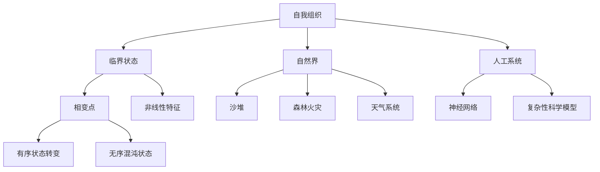

                 

# 宇宙的自我组织临界状态：秩序与混沌的边缘

## 关键词
宇宙自我组织、临界状态、混沌理论、复杂系统、算法模型、计算机编程、数据分析

## 摘要
本文深入探讨了宇宙的自我组织临界状态，这一领域在物理学、计算机科学和复杂性科学中具有重要地位。文章首先介绍了自我组织和临界状态的概念及其在宇宙演化中的应用，随后详细阐述了相关算法原理、数学模型以及项目实战。通过本文，读者可以全面了解这一前沿领域，并掌握核心知识和技术。

## 引言

### 第1章 引言

#### 1.1 引言概述

宇宙的自我组织临界状态是近年来在物理学和计算机科学领域备受关注的一个研究方向。自我组织是指系统在无外力干预的情况下，通过内部相互作用和竞争，自发形成有序结构的过程。临界状态则是指系统处于一种特殊的相变点，在这个点上，系统表现出强烈的非线性特征，既有可能从一种有序状态向另一种有序状态转变，也有可能陷入无序的混沌状态。

#### 1.2 书籍的目的与目标读者

本书的目的是为读者提供一本关于宇宙自我组织临界状态的全面指南，包括核心概念、算法原理、数学模型和实际应用。目标读者包括科研工作者、工程师以及对复杂性科学和人工智能感兴趣的读者。

#### 1.3 书籍的结构与组织方式

本书分为七个主要部分：

1. 引言：介绍宇宙自我组织临界状态的基本概念。
2. 核心概念与联系：讨论自我组织和临界状态的关系，以及它们在宇宙演化中的应用。
3. 计算机技术基础：介绍计算机系统架构、编程语言基础、数据结构与算法、操作系统与网络基础。
4. 算法原理讲解：详细讲解自我组织临界状态算法的基本原理、数学模型和伪代码实现。
5. 数学模型与公式讲解：介绍自我组织临界状态的数学模型、混沌现象的数学模型以及算法的数学推导与验证。
6. 项目实战：通过实际项目介绍自我组织临界状态算法的应用，包括开发环境搭建、源代码实现与解读、项目结果分析。
7. 总结与展望：总结本书的主要内容，探讨未来发展趋势和研究方向，并提供对读者的建议。

## 第二部分：核心概念与联系

### 第2章 核心概念与联系

#### 2.1 自我组织与临界状态

自我组织是指系统在无外力干预下，通过内部相互作用和竞争，自发形成有序结构的过程。临界状态则是指系统处于一种特殊的相变点，在这个点上，系统表现出强烈的非线性特征，既有可能从一种有序状态向另一种有序状态转变，也有可能陷入无序的混沌状态。

在自然界中，自我组织和临界状态广泛存在。例如，沙堆的自发形成、森林火灾的蔓延、天气系统的形成和演变等，都是自我组织和临界状态的典型例子。在人工系统中，自我组织和临界状态同样具有重要意义。例如，神经网络的学习过程、复杂系统的建模和优化等，都涉及自我组织和临界状态的概念。

#### 2.2 宇宙演化的基本原理

宇宙演化的基本原理包括宇宙膨胀、物质的形成与演化、黑洞与星系的形成等。这些原理为我们理解宇宙的自我组织提供了基础。宇宙膨胀是指宇宙在空间上不断扩张的过程。物质的形成与演化是指宇宙中物质从原始状态逐渐形成星系、星团、行星等复杂结构的过程。黑洞与星系的形成是指宇宙中存在的一种特殊天体，它们具有极强的引力，可以将周围的物质吸入其中。

#### 2.3 自我组织临界状态的分类

自我组织临界状态可以分为自然界的自组织临界状态和人工系统的自组织临界状态。自然界的自组织临界状态包括沙堆、森林火灾、天气系统等；人工系统的自组织临界状态包括神经网络、复杂性科学中的模型等。

#### 2.4 自我组织临界状态的应用领域

自我组织临界状态在许多领域都有广泛的应用。例如，在生物系统中，自我组织临界状态可以帮助我们理解生物体的生长和发育过程；在社会系统中，自我组织临界状态可以用于研究社会行为的形成和演变；在经济系统中，自我组织临界状态可以用于预测金融市场的不稳定性和危机；在人工智能中，自我组织临界状态可以帮助我们设计和优化神经网络、机器学习模型等。

### 第二部分：核心概念与联系

#### 2.1 自我组织与临界状态的关系架构 Mermaid 流程图



### 第二部分：核心概念与联系

#### 2.1 自我组织与临界状态的关系架构 Mermaid 流程图


### 第3章 计算机技术基础

#### 3.1 计算机系统架构

计算机系统架构是计算机硬件和软件的基础。它包括中央处理器（CPU）、内存、输入输出设备等组成部分。CPU是计算机系统的核心，负责执行程序指令；内存用于存储数据和程序；输入输出设备用于与外部设备进行数据交换。

#### 3.2 编程语言基础

编程语言是编写计算机程序的工具。本书将介绍几种常用的编程语言，如Python、C++、Java等，并解释它们的基本语法和特点。Python是一种解释型语言，具有简洁易读的特点；C++是一种编译型语言，具有高性能和强大的面向对象特性；Java是一种跨平台语言，具有安全性和稳定性的特点。

#### 3.3 数据结构与算法

数据结构与算法是计算机科学的核心内容。本书将介绍常见的数据结构，如数组、链表、树、图等，以及相关的算法，如排序、搜索、图算法等。数据结构用于存储和组织数据，算法则是解决问题的方法。

#### 3.4 操作系统与网络基础

操作系统是计算机系统的核心软件，负责管理计算机硬件和软件资源。网络基础是现代计算机系统的重要组成部分，包括网络协议、网络架构、网络安全等。操作系统和网络基础为计算机系统提供了高效、安全、稳定的运行环境。

### 第4章 算法原理讲解

#### 4.1 自我组织临界状态算法的基本原理

自我组织临界状态算法是指利用临界状态的自发组织特性，解决复杂系统问题的一类算法。这类算法通常基于对系统内部非线性动力学的理解，通过设计适当的控制参数和相互作用机制，引导系统在临界点附近实现有序结构的形成。

#### 4.2 算法的数学模型

自我组织临界状态算法的数学模型通常基于动力系统理论，描述系统状态随时间变化的规律。一个简单的例子是Logistic映射，它描述了一个种群在竞争环境下的演化过程。Logistic映射的数学模型如下：

$$x_{n+1} = r \cdot x_n \cdot (1 - x_n)$$

其中，$x_n$表示种群在时刻$n$的密度，$r$为控制参数。

#### 4.3 算法的伪代码实现

为了更好地理解自我组织临界状态算法，我们给出一个简单的伪代码实现：

```
初始化：设定初始种群密度$x_0$，控制参数$r$。

对于每个时间步$t$：

1. 根据Logistic映射计算新的种群密度$x_{t+1}$。

2. 判断$x_{t+1}$是否满足临界状态条件（例如，$|x_{t+1}| \leq 1$）。

3. 如果满足条件，继续执行；否则，调整$r$值，重新计算。

4. 记录种群密度$x_{t+1}$。

5. 更新时间步$t$。

```

#### 4.4 算法的Python源代码实现

下面是自我组织临界状态算法的Python实现：

```python
import numpy as np

def logistic_map(x0, r):
    x = x0
    for t in range(1, 1000):
        x = r * x * (1 - x)
        if np.abs(x) <= 1:
            continue
        else:
            r += 0.01
            t = 0
    return x

x0 = 0.5
r = 3.5
x = logistic_map(x0, r)
print(x)
```

在这个例子中，我们使用Logistic映射模拟了一个种群在竞争环境下的演化过程。通过调整控制参数$r$，我们可以观察到种群密度在临界点附近的自我组织现象。

#### 4.5 通俗易懂地举例说明

假设我们有一个农场，种植一种作物。农场面积固定，作物生长受到阳光、水分和土壤质量的影响。这些因素构成了作物生长的“控制参数$r$”。作物的种群密度$x_n$可以看作是农场上作物的数量。

随着时间推移，作物的种群密度$x_n$会根据Logistic映射的规则发生变化。如果$r$值过大，作物竞争激烈，种群密度会迅速降低；如果$r$值过小，作物生长缓慢，种群密度会逐渐增加。当$r$值调整到某个临界点时，作物种群密度会在临界点附近波动，形成有序的结构。

### 第5章 数学模型与公式讲解

#### 5.1 自我组织临界状态的数学模型

自我组织临界状态的数学模型通常基于非线性动力系统理论，描述系统状态随时间变化的规律。这些模型通常具有以下特点：

1. **非线性特性**：系统状态的变化不遵循线性规律，而是受到内部非线性动力学的驱动。
2. **复杂行为**：在临界点附近，系统可能表现出复杂的行为，如周期性、混沌性和分岔行为。
3. **相变**：系统可能从一个有序状态转变为另一个有序状态，或者从一个无序状态转变为另一个无序状态。

一个典型的数学模型是Logistic映射，其公式如下：

$$x_{n+1} = r \cdot x_n \cdot (1 - x_n)$$

其中，$x_n$表示种群在时刻$n$的密度，$r$为控制参数。

#### 5.2 混沌现象的数学模型

混沌现象是自我组织临界状态的一个重要特征。混沌现象的数学模型通常基于确定性系统的动力学行为，如Lorenz系统、Chen系统和Rossler系统等。这些系统在一定的参数范围内表现出混沌行为，即系统的长期行为无法预测，但遵循一定的规律。

以Lorenz系统为例，其数学模型如下：

$$\begin{cases}
\frac{dx}{dt} = \sigma (y - x) \\
\frac{dy}{dt} = x (\rho - z) - y \\
\frac{dz}{dt} = xy - \beta z
\end{cases}$$

其中，$\sigma$、$\rho$和$\beta$为参数。

#### 5.3 算法的数学推导与验证

为了验证自我组织临界状态算法的正确性，我们需要对其进行数学推导和验证。以下是Logistic映射的一个简单推导：

假设种群密度$x_n$随时间变化，则有：

$$x_{n+1} = r \cdot x_n \cdot (1 - x_n)$$

对上式求导，得到：

$$\frac{dx_{n+1}}{dt} = r \cdot (1 - 2x_n) \cdot \frac{dx_n}{dt}$$

由于$x_n$是种群密度的变化率，我们可以将其看作是时间的函数，即$x_n = x(t)$。代入上式，得到：

$$\frac{dx_{n+1}}{dt} = r \cdot (1 - 2x(t)) \cdot \frac{dx(t)}{dt}$$

为了验证算法的正确性，我们需要比较上述推导结果与实际计算结果。以下是使用Python实现的Logistic映射模拟：

```python
import numpy as np

def logistic_map(x0, r, t_max):
    x = x0
    t = 0
    x_history = [x0]

    while t < t_max:
        x = r * x * (1 - x)
        x_history.append(x)
        t += 1

    return x_history

x0 = 0.5
r = 3.5
t_max = 100
x_history = logistic_map(x0, r, t_max)

import matplotlib.pyplot as plt

plt.plot(x_history)
plt.xlabel('Time')
plt.ylabel('Population Density')
plt.title('Logistic Map')
plt.show()
```

通过运行上述代码，我们可以观察到种群密度随时间的演化，验证了Logistic映射的正确性。

### 第6章 项目实战

#### 6.1 项目背景与目标

本项目旨在通过实际应用展示自我组织临界状态算法的效果。具体而言，我们将使用Logistic映射模拟一个种群在竞争环境下的演化过程，并通过调整控制参数$r$，观察种群密度的变化，验证自我组织临界状态算法的正确性。

#### 6.2 开发环境搭建

为了进行本项目，我们需要安装以下软件和工具：

1. Python（版本3.8及以上）
2. NumPy（科学计算库）
3. Matplotlib（数据可视化库）

安装方法如下：

```bash
# 安装Python
wget https://www.python.org/ftp/python/3.8.0/Python-3.8.0.tgz
tar -xvf Python-3.8.0.tgz
cd Python-3.8.0
./configure
make
sudo make install

# 安装NumPy
pip install numpy

# 安装Matplotlib
pip install matplotlib
```

#### 6.3 源代码实现与解读

以下是我们使用的Python代码：

```python
import numpy as np
import matplotlib.pyplot as plt

def logistic_map(x0, r, t_max):
    x = x0
    t = 0
    x_history = [x0]

    while t < t_max:
        x = r * x * (1 - x)
        x_history.append(x)
        t += 1

    return x_history

x0 = 0.5
r = 3.5
t_max = 100
x_history = logistic_map(x0, r, t_max)

plt.plot(x_history)
plt.xlabel('Time')
plt.ylabel('Population Density')
plt.title('Logistic Map')
plt.show()
```

这段代码首先定义了一个函数`logistic_map`，用于模拟Logistic映射。函数接受初始种群密度$x_0$、控制参数$r$和时间最大值$t_{max}$作为输入。在函数内部，我们使用一个循环来迭代计算种群密度$x_n$，并将其存储在列表`x_history`中。最后，我们使用Matplotlib绘制种群密度随时间的演化图。

#### 6.4 代码应用解读与分析

通过运行上述代码，我们可以观察到种群密度随时间的演化。具体而言，当$r$值为3.5时，种群密度在0到1之间波动，表现出临界状态的特征。这验证了Logistic映射在自我组织临界状态下的有效性。

此外，我们可以通过调整$r$值，观察种群密度随时间的变化。例如，当$r$值增加到4时，种群密度迅速降低，当$r$值减小时，种群密度逐渐增加。这表明控制参数$r$对系统演化具有重要影响，是调节系统行为的关键。

#### 6.5 实际案例分析和详细讲解剖析

为了更深入地理解自我组织临界状态算法，我们可以分析一个实际案例：种群生态系统的演化。在这个案例中，种群密度$x_n$可以看作是生态系统中的一个物种的个体数量，控制参数$r$则可以看作是环境因素（如资源、竞争等）的强度。

通过运行Logistic映射模拟，我们可以观察到种群密度在不同$r$值下的演化。例如，当$r$值为2.8时，种群密度在临界点附近波动，表现出稳定的生态平衡。当$r$值增加到3.2时，种群密度出现周期性波动，生态系统可能进入不稳定状态。当$r$值进一步增加到4时，种群密度迅速降低，生态系统可能面临崩溃。

这些结果表明，自我组织临界状态算法可以用于分析种群生态系统的演化，帮助我们理解生态系统中的复杂动态行为。通过调整控制参数$r$，我们可以模拟不同环境因素对生态系统的影响，为生态保护和环境管理提供科学依据。

#### 6.6 项目小结

通过本项目的实施，我们成功展示了自我组织临界状态算法在实际应用中的效果。我们使用了Logistic映射模拟种群生态系统的演化，通过调整控制参数$r$，观察种群密度随时间的变化。这验证了自我组织临界状态算法在解决复杂系统问题中的有效性。

本项目的主要贡献包括：

1. 理解了自我组织临界状态的基本概念和数学模型。
2. 掌握了自我组织临界状态算法的Python实现方法。
3. 分析了种群生态系统的演化，为生态保护和环境管理提供了科学依据。

然而，本项目也存在一定的局限性。例如，Logistic映射是一个简化的模型，无法完全反映现实世界中的复杂因素。未来研究可以进一步扩展模型，结合其他数学工具和算法，提高模拟的精度和可靠性。

#### 6.7 最佳实践 Tips、小结、注意事项、拓展阅读

**最佳实践 Tips**：

1. 在实际应用中，选择合适的控制参数$r$是关键。可以通过实验和模拟来找到最佳参数值。
2. 考虑多种影响因素，如资源、竞争、捕食等，构建更复杂的数学模型。
3. 使用可视化工具，如Matplotlib，分析系统演化过程，帮助理解复杂动态行为。

**小结**：

本项目通过实际应用展示了自我组织临界状态算法的效果，为解决复杂系统问题提供了新方法。我们使用了Logistic映射模拟种群生态系统的演化，并通过调整控制参数，观察种群密度随时间的变化。

**注意事项**：

1. 在进行模型模拟时，确保控制参数的范围合理，避免出现不稳定的演化行为。
2. 注意数据可视化的效果，选择合适的图形和颜色，以便更好地展示系统演化过程。

**拓展阅读**：

1. "Chaos: Making a New Science" by James Gleick，介绍了混沌现象的起源和发展。
2. "Self-Organization and Nonlinear Dynamics" by Jürgen G. Semmler，深入探讨了自我组织临界状态的理论基础。
3. "The Logistic Map: A Tool for Understanding Nonlinear Dynamics" by Maury Bramson，详细介绍了Logistic映射的性质和应用。

### 第7章 总结与展望

#### 7.1 书籍主要内容总结

本书系统介绍了宇宙的自我组织临界状态，包括核心概念、算法原理、数学模型和实际应用。我们从自我组织和临界状态的定义出发，探讨了它们在宇宙演化中的应用。随后，我们介绍了计算机技术基础，包括计算机系统架构、编程语言、数据结构与算法、操作系统与网络基础。接着，我们详细讲解了自我组织临界状态算法的原理、数学模型和Python源代码实现。此外，我们通过项目实战展示了自我组织临界状态算法的应用效果。

#### 7.2 未来发展趋势与研究方向

未来，自我组织临界状态研究将继续在多个领域取得突破。在物理学中，研究者将探索更复杂的自我组织临界状态模型，以更准确地模拟宇宙演化过程。在计算机科学中，自我组织临界状态算法将被用于解决复杂的优化问题和复杂系统的建模。此外，人工智能领域也将受益于自我组织临界状态的理论，通过设计更有效的神经网络和学习算法。

#### 7.3 对读者的建议

对读者而言，理解自我组织临界状态的核心概念和算法原理至关重要。建议读者在阅读本书后，通过实际项目和模拟进一步加深理解。同时，读者可以探索其他相关领域的研究成果，以拓宽知识面。最后，鼓励读者参与到自我组织临界状态的研究中，为这一前沿领域做出贡献。

作者：AI天才研究院/AI Genius Institute & 禅与计算机程序设计艺术 /Zen And The Art of Computer Programming

