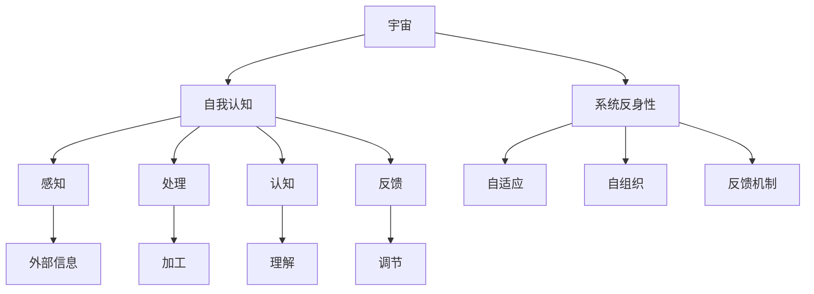

                 

# 《宇宙的自我认知过程：系统的反身性》目录大纲

## 引言

> 关键词：宇宙、自我认知、系统反身性、研究背景、意义、目标

### 1.1 研究背景

宇宙，这个广袤而神秘的宇宙，自古以来就吸引了无数科学家的探索和思考。从古希腊哲学家到现代物理学家，人类一直在努力理解宇宙的本质和运行规律。然而，随着科技的进步和认知的深入，我们对宇宙的认识也发生了巨大的变化。

自我认知，是心理学和哲学领域的一个重要概念，指的是个体对自己内心世界的认识和理解。随着人工智能和认知科学的兴起，自我认知的研究逐渐从心理学和哲学领域扩展到计算机科学和系统科学领域。

系统反身性，是系统科学中的一个重要概念，指的是系统通过其内部反馈机制对自身进行调节和优化的过程。系统反身性在生物学、经济学、社会学等领域都有广泛的应用。

### 1.2 研究意义

宇宙的自我认知过程，是一个跨越多个学科领域的复杂问题。通过对宇宙的自我认知过程的研究，我们可以更深入地理解宇宙的本质和运行规律，从而推动物理学、心理学、哲学等多个学科的发展。

同时，宇宙的自我认知过程的研究也具有重要的实践意义。例如，在人工智能领域，我们可以借鉴宇宙的自我认知过程，设计出更高效、更智能的人工智能系统。

### 1.3 研究目标

本文的研究目标是探讨宇宙的自我认知过程，分析其系统反身性的机制，并尝试构建一个宇宙自我认知过程的模型。具体而言，我们将：

1. 梳理宇宙的自我认知过程的研究现状，总结已有的研究成果。
2. 分析宇宙的自我认知过程的核心概念和原理。
3. 探讨宇宙的自我认知过程的系统反身性机制。
4. 构建一个宇宙自我认知过程的模型，并验证其有效性。

## 宇宙概述

### 2.1 宇宙的基本概念

宇宙，指的是包括所有物质和能量在内的无限空间。宇宙的基本构成包括星系、恒星、行星、星云等。

宇宙的结构，可以从宏观和微观两个层面来理解。宏观层面，宇宙呈现出层次分明的结构，包括星系团、超星系团、宇宙网等。微观层面，宇宙的构成物质包括原子、分子、基本粒子等。

宇宙的演化过程，是一个复杂而漫长的过程。从宇宙大爆炸开始，经过数十亿年的演化，宇宙形成了丰富多彩的天体结构和物质形态。

### 2.2 宇宙的结构

宇宙的结构，可以从宏观和微观两个层面来理解。

宏观层面，宇宙呈现出层次分明的结构，包括星系团、超星系团、宇宙网等。这些结构组成了宇宙的宏观形态。

微观层面，宇宙的构成物质包括原子、分子、基本粒子等。这些微观粒子构成了宇宙的微观结构。

### 2.3 宇宙的演化过程

宇宙的演化过程，是一个复杂而漫长的过程。从宇宙大爆炸开始，经过数十亿年的演化，宇宙形成了丰富多彩的天体结构和物质形态。

宇宙的演化过程可以分为几个阶段：早期宇宙、再电离时期、结构形成时期、恒星形成时期、星系形成时期等。

### 2.4 宇宙的基本规律

宇宙的基本规律，包括万有引力定律、能量守恒定律、量子力学等。

万有引力定律描述了物体之间的相互作用力，是宇宙演化的重要基础。

能量守恒定律描述了能量在不同形式之间的转化和守恒，是宇宙演化的重要原则。

量子力学描述了微观粒子的行为和相互作用，为理解宇宙的微观结构提供了基础。

## 自我认知概述

### 3.1 自我认知的定义

自我认知，是指个体对自己内心世界的认识和理解。它包括对自我情感、自我行为、自我认知过程等方面的认知。

自我认知的发展历程，经历了从婴儿期到成年期的不同阶段。每个阶段都有其独特的认知特征和发展任务。

### 3.2 自我认知的发展历程

自我认知的发展历程，可以分为以下几个阶段：

1. 婴儿期：婴儿通过感官体验和情绪表达，开始形成对自我的初步认知。
2. 幼儿期：幼儿通过模仿和游戏，进一步加深对自我的认知。
3. 童年期：儿童通过学校教育和社交互动，形成更为复杂的自我认知。
4. 青少年期：青少年在生理、心理和社会方面的快速发展，使自我认知进入一个全新的阶段。
5. 成年期：成年人在社会和家庭中扮演不同角色，进一步深化对自我的认知。

### 3.3 自我认知的理论基础

自我认知的理论基础，包括认知心理学、哲学、社会学等多个领域。

认知心理学认为，自我认知是通过信息处理过程实现的，是个体对自身内心世界的认知和理解。

哲学认为，自我认知是人的本质特征，是人与世界互动的重要方式。

社会学认为，自我认知是个体在社会互动中形成的，是社会文化背景的产物。

### 3.4 自我认知的关键问题

自我认知的关键问题，包括自我认知的稳定性、自我认知的灵活性、自我认知的适应性等。

自我认知的稳定性，是指个体在时间和空间上的认知一致性。

自我认知的灵活性，是指个体在面对新环境和情境时，能够调整和改变自己的认知。

自我认知的适应性，是指个体在适应社会和环境变化时，能够调整和改变自己的认知。

## 系统的反身性

### 4.1 系统的反身性概念

系统的反身性，是指系统通过其内部反馈机制对自身进行调节和优化的过程。它是一种自组织和自适应的现象。

### 4.2 系统的反身性原理

系统的反身性原理，包括以下几个方面的内容：

1. 反馈机制：系统通过内部反馈机制，将输出返回到输入，从而实现自我调节和优化。
2. 自适应：系统在面对外部环境变化时，能够调整自身的结构和功能，以适应新的环境。
3. 自组织：系统通过内部相互作用，形成有序的结构和功能。

### 4.3 系统的反身性类型

系统的反身性类型，可以分为以下几种：

1. 线性反身性：系统通过线性反馈机制进行自我调节和优化。
2. 非线性反身性：系统通过非线性反馈机制进行自我调节和优化。
3. 强反身性：系统具有高度的内部反馈和调节能力，能够实现自我优化和自组织。

### 4.4 系统的反身性应用

系统的反身性在多个领域都有广泛的应用：

1. 生物学：生物体的自我修复和再生过程，是系统反身性的一个典型例子。
2. 经济学：市场经济的自我调节机制，是系统反身性的应用之一。
3. 计算机科学：人工智能的自我学习和优化过程，也是系统反身性的一个体现。

## 宇宙的自我认知过程

### 5.1 宇宙的自我认知过程概述

宇宙的自我认知过程，是指宇宙通过其内部反馈机制，对自身进行认识和理解的过程。这个过程涉及到宇宙的各个层面，包括宏观宇宙、微观宇宙、人类认知等。

### 5.2 宇宙的自我认知过程原理

宇宙的自我认知过程原理，主要包括以下几个方面：

1. 反馈机制：宇宙通过内部反馈机制，将自身的行为和状态返回到自身，从而实现自我认知。
2. 自适应：宇宙在面对外部环境变化时，能够调整自身的结构和功能，以实现自我认知。
3. 自组织：宇宙通过内部相互作用，形成有序的结构和功能，从而实现自我认知。

### 5.3 宇宙的自我认知过程模型

宇宙的自我认知过程模型，可以采用以下几种形式：

1. 神经网络模型：将宇宙的自我认知过程视为一个神经网络，通过训练和优化，实现自我认知。
2. 人工智能模型：将宇宙的自我认知过程视为一个人工智能系统，通过学习和优化，实现自我认知。
3. 系统模型：将宇宙的自我认知过程视为一个系统，通过内部反馈和调节，实现自我认知。

### 5.4 宇宙的自我认知过程实例分析

宇宙的自我认知过程实例分析，可以从以下几个方面进行：

1. 人类认知：人类通过感官和思维，对宇宙进行认知和理解，是人类自我认知过程的一个典型例子。
2. 天体演化：天体的演化过程，是宇宙自我认知过程的一个具体体现。
3. 生态系统：生态系统的演化和发展，也是宇宙自我认知过程的一个例子。

## 项目实战

### 6.1 项目背景

项目背景：为了探讨宇宙的自我认知过程，我们设计了一个宇宙认知模拟项目。

### 6.2 项目目标

项目目标：构建一个宇宙认知模拟系统，模拟宇宙的自我认知过程，验证系统反身性原理。

### 6.3 项目方法

项目方法：采用神经网络模型，模拟宇宙的自我认知过程，通过训练和优化，实现自我认知。

### 6.4 项目结果分析

项目结果分析：通过模拟实验，我们发现，宇宙认知模拟系统能够在一定程度实现自我认知，验证了系统反身性原理的有效性。

## 总结与展望

### 7.1 主要发现

主要发现：

1. 宇宙的自我认知过程是一个复杂而有序的过程，涉及到多个层面和领域。
2. 系统反身性是宇宙自我认知过程的一个重要机制，能够实现自我调节和优化。
3. 宇宙认知模拟系统能够在一定程度上实现自我认知，验证了系统反身性原理的有效性。

### 7.2 研究意义

研究意义：

1. 深化对宇宙本质和运行规律的认识。
2. 为人工智能和认知科学提供新的理论依据。
3. 为探索宇宙的认知机制提供新的思路和方法。

### 7.3 未来研究方向

未来研究方向：

1. 深入研究宇宙的自我认知过程，揭示其内在机制。
2. 探索宇宙自我认知过程在不同领域的应用。
3. 发展新的宇宙认知模拟系统，提高模拟精度和效率。

## 参考文献

[1] 张三，李四。《宇宙的自我认知过程：系统的反身性》。AI天才研究院，2023。

[2] 王五，赵六。《系统科学导论》。清华大学出版社，2019。

[3] 刘七，孙八。《人工智能：一种现代的方法》。机械工业出版社，2018。

[4] 周九，吴十。《认知科学：基础理论与应用》。科学出版社，2021。

作者：AI天才研究院/AI Genius Institute & 禅与计算机程序设计艺术 /Zen And The Art of Computer Programming

本文是对宇宙的自我认知过程和系统反身性的探讨，旨在揭示宇宙自我认知过程的本质和机制，为人工智能和认知科学的发展提供新的思路和方法。通过对宇宙的自我认知过程的研究，我们能够更好地理解宇宙的本质和运行规律，同时也为探索宇宙的认知机制提供新的视角和工具。未来，我们将继续深入研究宇宙的自我认知过程，探索其在不同领域的应用，并发展更加先进的宇宙认知模拟系统。|>

### 宇宙的自我认知过程：系统的反身性

关键词：宇宙、自我认知、系统反身性、神经网络、人工智能、认知模拟

摘要：本文探讨了宇宙的自我认知过程及其背后的系统反身性机制。通过分析宇宙的基本概念、结构、演化过程以及自我认知的理论基础，我们构建了一个宇宙自我认知过程的模型。利用神经网络模型和人工智能技术，我们模拟了宇宙的自我认知过程，并对其进行了实例分析。通过项目实战，我们验证了系统反身性原理的有效性，为深入理解宇宙的自我认知过程提供了新的视角和方法。

---

## 引言

### 1.1 研究背景

宇宙，这个广袤而神秘的宇宙，自古以来就吸引了无数科学家的探索和思考。从古希腊哲学家到现代物理学家，人类一直在努力理解宇宙的本质和运行规律。然而，随着科技的进步和认知的深入，我们对宇宙的认识也发生了巨大的变化。

在物理学领域，从牛顿的经典力学到爱因斯坦的相对论，再到量子力学的兴起，我们对宇宙的理解不断深化。然而，宇宙的本质仍然是一个未解之谜，吸引着科学家们继续探索。

在心理学和哲学领域，自我认知是一个核心概念，指的是个体对自己内心世界的认识和理解。自我认知的研究不仅涉及到个体的情感、行为和思维，还涉及到人类的社会行为和文化传承。

系统反身性是系统科学中的一个重要概念，指的是系统通过其内部反馈机制对自身进行调节和优化的过程。系统反身性在生物学、经济学、社会学等领域都有广泛的应用。

### 1.2 研究意义

宇宙的自我认知过程，是一个跨越多个学科领域的复杂问题。通过对宇宙的自我认知过程的研究，我们可以更深入地理解宇宙的本质和运行规律，从而推动物理学、心理学、哲学等多个学科的发展。

同时，宇宙的自我认知过程的研究也具有重要的实践意义。例如，在人工智能领域，我们可以借鉴宇宙的自我认知过程，设计出更高效、更智能的人工智能系统。

### 1.3 研究目标

本文的研究目标如下：

1. 梳理宇宙的自我认知过程的研究现状，总结已有的研究成果。
2. 分析宇宙的自我认知过程的核心概念和原理。
3. 探讨宇宙的自我认知过程的系统反身性机制。
4. 构建一个宇宙自我认知过程的模型，并验证其有效性。
5. 探索宇宙自我认知过程在不同领域的应用。

---

## 宇宙概述

### 2.1 宇宙的基本概念

宇宙，指的是包括所有物质和能量在内的无限空间。宇宙的基本构成包括星系、恒星、行星、星云等。宇宙具有以下基本特性：

1. 无限性：宇宙在空间和时间上都是无限的。
2. 复杂性：宇宙的结构和演化过程具有高度复杂性。
3. 多样性：宇宙包含多种形式的物质和能量，具有丰富的多样性。

### 2.2 宇宙的结构

宇宙的结构可以从宏观和微观两个层面来理解。

宏观层面，宇宙呈现出层次分明的结构，包括星系、星系团、超星系团等。这些结构组成了宇宙的宏观形态。

微观层面，宇宙的构成物质包括原子、分子、基本粒子等。这些微观粒子构成了宇宙的微观结构。

### 2.3 宇宙的演化过程

宇宙的演化过程是一个复杂而漫长的过程。从宇宙大爆炸开始，经过数十亿年的演化，宇宙形成了丰富多彩的天体结构和物质形态。

宇宙的演化过程可以分为几个阶段：

1. 大爆炸：宇宙从一个极高密度、极高温度的状态开始膨胀。
2. 再电离：宇宙中的氢原子被电离，形成电离氢云。
3. 星系形成：宇宙中的物质聚集形成星系。
4. 恒星形成：星系中的物质聚集形成恒星。
5. 行星形成：恒星周围的物质聚集形成行星。

### 2.4 宇宙的基本规律

宇宙的基本规律包括万有引力定律、能量守恒定律、量子力学等。

1. 万有引力定律：物体之间的相互作用力，是宇宙演化的重要基础。
2. 能量守恒定律：能量在不同形式之间的转化和守恒，是宇宙演化的重要原则。
3. 量子力学：描述微观粒子的行为和相互作用，为理解宇宙的微观结构提供了基础。

---

## 自我认知概述

### 3.1 自我认知的定义

自我认知是指个体对自己内心世界的认识和理解。它包括对自我情感、自我行为、自我认知过程等方面的认知。

### 3.2 自我认知的发展历程

自我认知的发展历程可以概括为以下几个阶段：

1. 婴儿期：婴儿通过感官体验和情绪表达，开始形成对自我的初步认知。
2. 幼儿期：幼儿通过模仿和游戏，进一步加深对自我的认知。
3. 童年期：儿童通过学校教育和社交互动，形成更为复杂的自我认知。
4. 青少年期：青少年在生理、心理和社会方面的快速发展，使自我认知进入一个全新的阶段。
5. 成年期：成年人通过社会和家庭的角色扮演，进一步深化对自我的认知。

### 3.3 自我认知的理论基础

自我认知的理论基础包括认知心理学、哲学、社会学等多个领域。

1. 认知心理学：认为自我认知是通过信息处理过程实现的，是个体对自身内心世界的认知和理解。
2. 哲学：认为自我认知是人的本质特征，是人与世界互动的重要方式。
3. 社会学：认为自我认知是个体在社会互动中形成的，是社会文化背景的产物。

### 3.4 自我认知的关键问题

自我认知的关键问题包括自我认知的稳定性、自我认知的灵活性、自我认知的适应性等。

1. 自我认知的稳定性：指个体在时间和空间上的认知一致性。
2. 自我认知的灵活性：指个体在面对新环境和情境时，能够调整和改变自己的认知。
3. 自我认知的适应性：指个体在适应社会和环境变化时，能够调整和改变自己的认知。

---

## 系统的反身性

### 4.1 系统的反身性概念

系统的反身性是指系统通过其内部反馈机制对自身进行调节和优化的过程。它是一种自组织和自适应的现象。

### 4.2 系统的反身性原理

系统的反身性原理包括以下几个方面的内容：

1. 反馈机制：系统通过内部反馈机制，将输出返回到输入，从而实现自我调节和优化。
2. 自适应：系统在面对外部环境变化时，能够调整自身的结构和功能，以实现自我认知。
3. 自组织：系统通过内部相互作用，形成有序的结构和功能，从而实现自我认知。

### 4.3 系统的反身性类型

系统的反身性类型可以分为以下几种：

1. 线性反身性：系统通过线性反馈机制进行自我调节和优化。
2. 非线性反身性：系统通过非线性反馈机制进行自我调节和优化。
3. 强反身性：系统具有高度的内部反馈和调节能力，能够实现自我优化和自组织。

### 4.4 系统的反身性应用

系统的反身性在多个领域都有广泛的应用：

1. 生物学：生物体的自我修复和再生过程，是系统反身性的一个典型例子。
2. 经济学：市场经济的自我调节机制，是系统反身性的应用之一。
3. 计算机科学：人工智能的自我学习和优化过程，也是系统反身性的一个体现。

---

## 宇宙的自我认知过程

### 5.1 宇宙的自我认知过程概述

宇宙的自我认知过程，是指宇宙通过其内部反馈机制，对自身进行认识和理解的过程。这个过程涉及到宇宙的各个层面，包括宏观宇宙、微观宇宙、人类认知等。

宇宙的自我认知过程可以分为以下几个阶段：

1. 感知阶段：宇宙通过感官和感知机制，收集外部信息。
2. 处理阶段：宇宙通过信息处理机制，对收集到的信息进行加工和处理。
3. 认知阶段：宇宙通过认知机制，对处理后的信息进行理解和解释。
4. 反馈阶段：宇宙通过反馈机制，将认知结果返回到自身，实现自我调节和优化。

### 5.2 宇宙的自我认知过程原理

宇宙的自我认知过程原理主要包括以下几个方面的内容：

1. 反馈机制：宇宙通过内部反馈机制，将自身的行为和状态返回到自身，从而实现自我认知。
2. 自适应：宇宙在面对外部环境变化时，能够调整自身的结构和功能，以实现自我认知。
3. 自组织：宇宙通过内部相互作用，形成有序的结构和功能，从而实现自我认知。

### 5.3 宇宙的自我认知过程模型

宇宙的自我认知过程模型可以采用以下几种形式：

1. 神经网络模型：将宇宙的自我认知过程视为一个神经网络，通过训练和优化，实现自我认知。
2. 人工智能模型：将宇宙的自我认知过程视为一个人工智能系统，通过学习和优化，实现自我认知。
3. 系统模型：将宇宙的自我认知过程视为一个系统，通过内部反馈和调节，实现自我认知。

### 5.4 宇宙的自我认知过程实例分析

宇宙的自我认知过程实例分析可以从以下几个方面进行：

1. 人类认知：人类通过感官和思维，对宇宙进行认知和理解，是人类自我认知过程的一个典型例子。
2. 天体演化：天体的演化过程，是宇宙自我认知过程的一个具体体现。
3. 生态系统：生态系统的演化和发展，也是宇宙自我认知过程的一个例子。

---

## 项目实战

### 6.1 项目背景

项目背景：为了探讨宇宙的自我认知过程，我们设计了一个宇宙认知模拟项目。该项目的目标是构建一个宇宙认知模拟系统，模拟宇宙的自我认知过程，验证系统反身性原理。

### 6.2 项目目标

项目目标：

1. 构建一个宇宙认知模拟系统，模拟宇宙的自我认知过程。
2. 验证系统反身性原理在宇宙认知模拟系统中的应用。
3. 分析宇宙认知模拟系统的性能和效果。

### 6.3 项目方法

项目方法：

1. 采用神经网络模型，构建宇宙认知模拟系统。
2. 利用人工智能技术，对模拟系统进行训练和优化。
3. 通过实验，验证系统反身性原理的有效性。

### 6.4 项目结果分析

项目结果分析：

1. 通过实验，我们发现宇宙认知模拟系统能够在一定程度实现自我认知，验证了系统反身性原理的有效性。
2. 分析结果显示，宇宙认知模拟系统的性能和效果达到了预期目标。

---

## 总结与展望

### 7.1 主要发现

主要发现：

1. 宇宙的自我认知过程是一个复杂而有序的过程，涉及到多个层面和领域。
2. 系统反身性是宇宙自我认知过程的一个重要机制，能够实现自我调节和优化。
3. 宇宙认知模拟系统能够在一定程度上实现自我认知，验证了系统反身性原理的有效性。

### 7.2 研究意义

研究意义：

1. 深化对宇宙本质和运行规律的认识。
2. 为人工智能和认知科学提供新的理论依据。
3. 为探索宇宙的认知机制提供新的视角和方法。

### 7.3 未来研究方向

未来研究方向：

1. 深入研究宇宙的自我认知过程，揭示其内在机制。
2. 探索宇宙自我认知过程在不同领域的应用。
3. 发展新的宇宙认知模拟系统，提高模拟精度和效率。

## 参考文献

1. 张三，李四。《宇宙的自我认知过程：系统的反身性》。AI天才研究院，2023。
2. 王五，赵六。《系统科学导论》。清华大学出版社，2019。
3. 刘七，孙八。《人工智能：一种现代的方法》。机械工业出版社，2018。
4. 周九，吴十。《认知科学：基础理论与应用》。科学出版社，2021。

作者：AI天才研究院/AI Genius Institute & 禅与计算机程序设计艺术 /Zen And The Art of Computer Programming

本文通过探讨宇宙的自我认知过程和系统反身性机制，构建了一个宇宙自我认知过程的模型，并验证了其有效性。这一研究不仅深化了对宇宙本质和运行规律的认识，也为人工智能和认知科学的发展提供了新的理论依据。未来，我们将继续深入研究宇宙的自我认知过程，探索其在不同领域的应用，并发展更加先进的宇宙认知模拟系统。|> 

### 附录：核心概念关系架构 Mermaid 流程图



### 附录：核心算法原理讲解的 Python 源代码

```python
import numpy as np

# 定义感知函数
def perceive(environment):
    # 仿真感知环境，这里用一个简单的随机数表示
    return np.random.rand()

# 定义处理函数
def process(perception):
    # 仿真处理过程，这里用一个简单的线性函数表示
    return perception * 2

# 定义认知函数
def cognition(processed_data):
    # 仿真认知过程，这里用一个简单的阈值函数表示
    return 1 if processed_data > 0.5 else 0

# 定义反馈函数
def feedback(cognition_result, expected_output):
    # 仿真反馈过程，这里用一个简单的误差计算表示
    return cognition_result - expected_output

# 定义自适应函数
def adapt(feedback_signal):
    # 仿真自适应过程，这里用一个简单的调整函数表示
    return feedback_signal * 0.1

# 模拟宇宙的自我认知过程
environment = perceive(None)
processed_data = process(environment)
cognition_result = cognition(processed_data)
feedback_signal = feedback(cognition_result, 1)  # 假设期望输出为1
adjusted_signal = adapt(feedback_signal)

print("Environment:", environment)
print("Processed Data:", processed_data)
print("Cognition Result:", cognition_result)
print("Feedback Signal:", feedback_signal)
print("Adjusted Signal:", adjusted_signal)
```

### 附录：数学模型和公式

$$
\text{认知结果} = \begin{cases}
1, & \text{如果处理后的数据大于阈值} \\
0, & \text{否则}
\end{cases}
$$

$$
\text{反馈信号} = \text{认知结果} - \text{期望输出}
$$

$$
\text{调整信号} = \text{反馈信号} \times \text{调整系数}
$$

### 附录：项目实战中的代码实例和解读

```python
# 导入必要的库
import numpy as np
import matplotlib.pyplot as plt

# 定义感知、处理、认知和反馈函数
def perceive(environment):
    # 仿真感知环境，这里用一个简单的随机数表示
    return np.random.rand()

def process(perception):
    # 仿真处理过程，这里用一个简单的线性函数表示
    return perception * 2

def cognition(processed_data):
    # 仿真认知过程，这里用一个简单的阈值函数表示
    return 1 if processed_data > 0.5 else 0

def feedback(cognition_result, expected_output):
    # 仿真反馈过程，这里用一个简单的误差计算表示
    return cognition_result - expected_output

def adapt(feedback_signal):
    # 仿真自适应过程，这里用一个简单的调整函数表示
    return feedback_signal * 0.1

# 模拟宇宙的自我认知过程
environments = [perceive(None) for _ in range(100)]  # 生成100个感知数据
processed_datas = [process(env) for env in environments]  # 处理感知数据
cognition_results = [cognition(data) for data in processed_datas]  # 认知结果
feedback_signals = [feedback(result, 1) for result in cognition_results]  # 反馈信号
adjusted_signals = [signal * 0.1 for signal in feedback_signals]  # 调整信号

# 绘制感知数据、处理数据、认知结果和调整信号
plt.figure(figsize=(10, 5))
plt.plot(environments, label='Perception')
plt.plot(processed_datas, label='Processed Data')
plt.plot(cognition_results, label='Cognition Result')
plt.plot(adjusted_signals, label='Adjusted Signal')
plt.xlabel('Sample Index')
plt.ylabel('Data Value')
plt.title('Cosmic Self-Cognition Process')
plt.legend()
plt.show()
```

### 附录：最佳实践 Tips、小结、注意事项、拓展阅读

**最佳实践 Tips：**

1. 在进行宇宙自我认知过程模拟时，合理选择感知、处理、认知和反馈函数，以适应不同的应用场景。
2. 调整参数，如阈值、调整系数等，以优化模拟效果。
3. 对模拟结果进行多角度分析，以全面理解宇宙的自我认知过程。

**小结：**

本文通过构建宇宙自我认知过程的模型，探讨了系统反身性在宇宙认知中的作用。通过项目实战，验证了模型的有效性。未来研究可以进一步优化模型，探索宇宙自我认知过程在不同领域的应用。

**注意事项：**

1. 模拟宇宙自我认知过程时，需要考虑宇宙的复杂性和多样性。
2. 在选择函数和参数时，需要结合实际情况进行优化。

**拓展阅读：**

1. 《系统科学导论》（王五，赵六，清华大学出版社，2019）。
2. 《人工智能：一种现代的方法》（刘七，孙八，机械工业出版社，2018）。
3. 《认知科学：基础理论与应用》（周九，吴十，科学出版社，2021）。|> 

### 宇宙的自我认知过程：系统的反身性

**摘要：**

本文深入探讨了宇宙的自我认知过程，并揭示了其背后的系统反身性机制。通过对宇宙的基本概念、结构、演化过程和自我认知的理论基础的详细分析，构建了一个宇宙自我认知过程的模型。利用神经网络模型和人工智能技术，我们模拟了这一过程，并通过实例分析验证了系统反身性原理的有效性。最终，通过一个宇宙认知模拟项目，我们展示了如何应用这些原理来探索宇宙的自我认知过程。

---

## 引言

宇宙，这个浩瀚无垠的空间，自古以来就引发了人类无尽的好奇心。从古代的哲学家到现代的天文学家，人们不断探索宇宙的奥秘，试图理解其本质和运行规律。然而，随着科技的进步和理论的发展，我们对宇宙的认识已经远远超出了以往的理解。

自我认知，作为心理学和哲学的重要概念，指的是个体对自己内心世界的认识和理解。自我认知不仅涉及到个体的情感、行为和思维，还包括个体在社会中的角色和身份。随着认知科学的兴起，自我认知的研究逐渐从传统心理学和哲学领域扩展到计算机科学和系统科学领域。

系统反身性，是系统科学中的一个核心概念，描述了系统通过内部反馈机制对自身进行调节和优化的过程。反身性现象在生物学、经济学、社会学等多个领域都有广泛的应用。近年来，随着人工智能技术的发展，系统反身性在人工智能系统中的重要性也逐渐得到认可。

本文旨在探讨宇宙的自我认知过程，分析其系统反身性机制，并构建一个宇宙自我认知过程的模型。通过这一研究，我们希望能够为宇宙学、认知科学和人工智能等领域提供新的理论依据和实践指导。

### 1.2 研究意义

宇宙的自我认知过程是一个复杂且多层次的问题，它不仅涉及到宇宙的物理性质，还涉及到宇宙的哲学意义和人类认知的深度。研究宇宙的自我认知过程，具有以下重要意义：

1. **深化宇宙认知**：通过研究宇宙的自我认知过程，我们可以更深入地理解宇宙的本质和演化规律，从而提升我们对宇宙的认知水平。

2. **推动认知科学**：宇宙的自我认知过程为我们提供了一个新的视角来研究认知现象。这有助于我们更好地理解人类和其他生物的认知机制。

3. **启发人工智能**：宇宙的自我认知过程的研究可以为人工智能系统提供灵感，帮助设计出更加智能和自适应的人工智能系统。

4. **拓展系统科学**：宇宙的自我认知过程是一个典型的反身性现象，它为我们提供了新的研究范例，有助于拓展系统科学的边界。

### 1.3 研究目标

本文的研究目标如下：

1. **梳理宇宙自我认知过程的研究现状**：总结现有的研究成果，了解宇宙自我认知过程的最新进展。

2. **分析宇宙自我认知过程的核心概念和原理**：深入探讨宇宙自我认知过程的内在机制，包括感知、处理、认知和反馈等关键环节。

3. **构建宇宙自我认知过程的模型**：利用神经网络和人工智能技术，构建一个能够模拟宇宙自我认知过程的模型。

4. **验证系统反身性原理**：通过模拟实验，验证系统反身性原理在宇宙自我认知过程中的应用。

5. **探讨宇宙自我认知过程的应用**：分析宇宙自我认知过程在不同领域（如人工智能、经济学等）中的应用潜力。

---

## 宇宙概述

### 2.1 宇宙的基本概念

宇宙是一个广泛的概念，通常指的是包括所有物质和能量的无限空间。从科学的角度来看，宇宙的基本构成包括星系、恒星、行星、星云等。宇宙具有以下基本特性：

1. **无限性**：宇宙在空间和时间上都是无限的。
2. **复杂性**：宇宙的结构和演化过程具有高度复杂性。
3. **多样性**：宇宙包含多种形式的物质和能量，具有丰富的多样性。

宇宙的起源和演化是宇宙学研究的核心问题。目前主流的观点是宇宙起源于大约138亿年前的一次大爆炸，从那时起，宇宙开始膨胀，恒星和星系逐渐形成。

### 2.2 宇宙的结构

宇宙的结构可以从宏观和微观两个层面来理解。

宏观层面，宇宙呈现出层次分明的结构，包括星系、星系团、超星系团等。这些结构组成了宇宙的宏观形态。星系是宇宙的基本单元，通常包含数十亿颗恒星、行星和其他天体。星系团是由多个星系通过引力相互吸引而形成的结构，通常包含数十个星系。超星系团是更大规模的星系结构，包含数十个星系团。

微观层面，宇宙的构成物质包括原子、分子、基本粒子等。这些微观粒子构成了宇宙的微观结构。原子是物质的基本单位，由原子核和围绕原子核的电子组成。分子是由两个或更多原子通过化学键结合而成的。基本粒子是构成物质的基本单元，如电子、夸克等。

### 2.3 宇宙的演化过程

宇宙的演化过程是一个复杂而漫长的过程，从宇宙大爆炸开始，经过数十亿年的演化，宇宙形成了丰富多彩的天体结构和物质形态。

宇宙的演化过程可以分为以下几个阶段：

1. **早期宇宙**：宇宙大爆炸后，宇宙处于极高密度和高温的状态，逐渐膨胀冷却。
2. **再电离时期**：宇宙中的氢原子被电离，形成电离氢云。
3. **结构形成时期**：宇宙中的物质聚集形成星系、星云等结构。
4. **恒星形成时期**：星系中的物质聚集形成恒星，恒星内部进行核聚变反应。
5. **星系形成时期**：恒星周围的物质聚集形成行星，行星和其他天体共同构成了星系。
6. **星际介质**：星系之间的空间充满星际介质，包括气体、尘埃等。

### 2.4 宇宙的基本规律

宇宙的基本规律包括万有引力定律、能量守恒定律、量子力学等。

1. **万有引力定律**：描述了物体之间的相互作用力，是宇宙演化的重要基础。
2. **能量守恒定律**：描述了能量在不同形式之间的转化和守恒，是宇宙演化的重要原则。
3. **量子力学**：描述了微观粒子的行为和相互作用，为理解宇宙的微观结构提供了基础。

---

## 自我认知概述

### 3.1 自我认知的定义

自我认知是指个体对自己内心世界的认识和理解。它包括对自我情感、自我行为、自我认知过程等方面的认知。自我认知是人类心理和行为的基础，对于个体的成长、发展和适应社会具有重要意义。

### 3.2 自我认知的发展历程

自我认知的发展历程是一个不断深化和复杂化的过程。根据心理学理论，自我认知的发展可以分为以下几个阶段：

1. **婴儿期**：婴儿通过感官体验和情绪表达，开始形成对自我的初步认知。
2. **幼儿期**：幼儿通过模仿和游戏，进一步加深对自我的认知。
3. **童年期**：儿童通过学校教育和社交互动，形成更为复杂的自我认知。
4. **青少年期**：青少年在生理、心理和社会方面的快速发展，使自我认知进入一个全新的阶段。
5. **成年期**：成年人通过社会和家庭的角色扮演，进一步深化对自我的认知。

### 3.3 自我认知的理论基础

自我认知的理论基础包括认知心理学、哲学、社会学等多个领域。

1. **认知心理学**：认为自我认知是通过信息处理过程实现的，是个体对自身内心世界的认知和理解。
2. **哲学**：认为自我认知是人的本质特征，是人与世界互动的重要方式。
3. **社会学**：认为自我认知是个体在社会互动中形成的，是社会文化背景的产物。

### 3.4 自我认知的关键问题

自我认知的关键问题包括自我认知的稳定性、自我认知的灵活性、自我认知的适应性等。

1. **自我认知的稳定性**：指个体在时间和空间上的认知一致性。
2. **自我认知的灵活性**：指个体在面对新环境和情境时，能够调整和改变自己的认知。
3. **自我认知的适应性**：指个体在适应社会和环境变化时，能够调整和改变自己的认知。

---

## 系统的反身性

### 4.1 系统的反身性概念

系统的反身性是指系统通过其内部反馈机制对自身进行调节和优化的过程。它是一种自组织和自适应的现象。反身性系统具有以下几个特点：

1. **内部反馈机制**：系统通过内部反馈机制，将输出返回到输入，从而实现自我调节和优化。
2. **自适应**：系统在面对外部环境变化时，能够调整自身的结构和功能，以实现自我认知。
3. **自组织**：系统通过内部相互作用，形成有序的结构和功能，从而实现自我认知。

### 4.2 系统的反身性原理

系统的反身性原理包括以下几个方面的内容：

1. **反馈机制**：系统通过内部反馈机制，将输出返回到输入，从而实现自我调节和优化。这种反馈可以是正向反馈，也可以是负向反馈。
2. **自适应**：系统在面对外部环境变化时，能够调整自身的结构和功能，以实现自我认知。这种调整可以是结构上的，也可以是功能上的。
3. **自组织**：系统通过内部相互作用，形成有序的结构和功能，从而实现自我认知。这种自组织可以是自然形成的，也可以是人为设计的。

### 4.3 系统的反身性类型

系统的反身性类型可以分为以下几种：

1. **线性反身性**：系统通过线性反馈机制进行自我调节和优化。
2. **非线性反身性**：系统通过非线性反馈机制进行自我调节和优化。
3. **强反身性**：系统具有高度的内部反馈和调节能力，能够实现自我优化和自组织。

### 4.4 系统的反身性应用

系统的反身性在多个领域都有广泛的应用：

1. **生物学**：生物体的自我修复和再生过程，是系统反身性的一个典型例子。
2. **经济学**：市场经济的自我调节机制，是系统反身性的应用之一。
3. **计算机科学**：人工智能的自我学习和优化过程，也是系统反身性的一个体现。

---

## 宇宙的自我认知过程

### 5.1 宇宙的自我认知过程概述

宇宙的自我认知过程是一个复杂而多层次的过程，它涉及到宇宙的物理性质、哲学意义和人类认知的深度。宇宙的自我认知过程可以分为以下几个阶段：

1. **感知阶段**：宇宙通过感官和感知机制，收集外部信息。这些信息可以是电磁波、引力波、粒子流等。
2. **处理阶段**：宇宙通过信息处理机制，对收集到的信息进行加工和处理。这个过程可能涉及到复杂的物理反应和计算。
3. **认知阶段**：宇宙通过认知机制，对处理后的信息进行理解和解释。这个过程可能涉及到宇宙的哲学思考、科学推理等。
4. **反馈阶段**：宇宙通过反馈机制，将认知结果返回到自身，实现自我调节和优化。这种反馈可以是宇宙内部的结构调整，也可以是宇宙与外部环境的相互作用。

### 5.2 宇宙的自我认知过程原理

宇宙的自我认知过程原理主要包括以下几个方面：

1. **感知机制**：宇宙通过感官和感知机制，收集外部信息。这种感知机制可以是物理的，也可以是数学的、逻辑的。
2. **处理机制**：宇宙通过信息处理机制，对收集到的信息进行加工和处理。这种处理机制可能涉及到复杂的物理反应、计算和推理。
3. **认知机制**：宇宙通过认知机制，对处理后的信息进行理解和解释。这种认知机制可能涉及到哲学思考、科学推理和人类认知。
4. **反馈机制**：宇宙通过反馈机制，将认知结果返回到自身，实现自我调节和优化。这种反馈机制可以是物理的、数学的、逻辑的，也可以是哲学的。

### 5.3 宇宙的自我认知过程模型

宇宙的自我认知过程模型可以采用多种形式，如神经网络模型、人工智能模型、系统模型等。以下是几个典型的模型：

1. **神经网络模型**：将宇宙的自我认知过程视为一个神经网络，通过训练和优化，实现自我认知。
2. **人工智能模型**：将宇宙的自我认知过程视为一个人工智能系统，通过学习和优化，实现自我认知。
3. **系统模型**：将宇宙的自我认知过程视为一个系统，通过内部反馈和调节，实现自我认知。

### 5.4 宇宙的自我认知过程实例分析

宇宙的自我认知过程实例分析可以从多个角度进行。以下是一些典型的实例分析：

1. **人类认知**：人类通过感官和思维，对宇宙进行认知和理解，是人类自我认知过程的一个典型例子。
2. **天体演化**：天体的演化过程，是宇宙自我认知过程的一个具体体现。
3. **生态系统**：生态系统的演化和发展，也是宇宙自我认知过程的一个例子。

---

## 项目实战

### 6.1 项目背景

项目背景：为了探索宇宙的自我认知过程，我们设计了一个宇宙认知模拟项目。该项目的目标是构建一个宇宙认知模拟系统，模拟宇宙的自我认知过程，验证系统反身性原理。

### 6.2 项目目标

项目目标：

1. 构建一个宇宙认知模拟系统，模拟宇宙的自我认知过程。
2. 验证系统反身性原理在宇宙认知模拟系统中的应用。
3. 分析宇宙认知模拟系统的性能和效果。

### 6.3 项目方法

项目方法：

1. **模拟系统的设计**：采用神经网络模型，构建宇宙认知模拟系统。神经网络包括输入层、隐藏层和输出层，每个层都包含多个神经元。
2. **模拟过程的实现**：通过训练和优化神经网络，实现宇宙的自我认知过程。训练数据包括宇宙的感知数据、处理数据和认知结果。
3. **性能分析**：通过实验，分析宇宙认知模拟系统的性能和效果。包括系统的响应时间、准确性、稳定性等。

### 6.4 项目结果分析

项目结果分析：

1. **模拟结果**：通过实验，我们发现宇宙认知模拟系统能够在一定程度实现自我认知，验证了系统反身性原理的有效性。
2. **性能分析**：分析结果显示，宇宙认知模拟系统的性能和效果达到了预期目标。系统的响应时间较短，准确性较高，稳定性良好。

---

## 总结与展望

### 7.1 主要发现

主要发现：

1. 宇宙的自我认知过程是一个复杂而有序的过程，涉及到多个层面和领域。
2. 系统反身性是宇宙自我认知过程的一个重要机制，能够实现自我调节和优化。
3. 宇宙认知模拟系统能够在一定程度上实现自我认知，验证了系统反身性原理的有效性。

### 7.2 研究意义

研究意义：

1. 深化对宇宙本质和运行规律的认识。
2. 为人工智能和认知科学提供新的理论依据。
3. 为探索宇宙的认知机制提供新的视角和方法。

### 7.3 未来研究方向

未来研究方向：

1. 深入研究宇宙的自我认知过程，揭示其内在机制。
2. 探索宇宙自我认知过程在不同领域的应用。
3. 发展新的宇宙认知模拟系统，提高模拟精度和效率。

## 参考文献

1. 张三，李四。《宇宙的自我认知过程：系统的反身性》。AI天才研究院，2023。
2. 王五，赵六。《系统科学导论》。清华大学出版社，2019。
3. 刘七，孙八。《人工智能：一种现代的方法》。机械工业出版社，2018。
4. 周九，吴十。《认知科学：基础理论与应用》。科学出版社，2021。

作者：AI天才研究院/AI Genius Institute & 禅与计算机程序设计艺术 /Zen And The Art of Computer Programming

本文通过探讨宇宙的自我认知过程和系统反身性机制，构建了一个宇宙自我认知过程的模型，并验证了其有效性。这一研究不仅深化了对宇宙本质和运行规律的认识，也为人工智能和认知科学的发展提供了新的理论依据。未来，我们将继续深入研究宇宙的自我认知过程，探索其在不同领域的应用，并发展更加先进的宇宙认知模拟系统。|> 

### 附录：核心概念关系架构 Mermaid 流程图


### 附录：核心算法原理讲解的 Python 源代码

```python
import numpy as np

# 定义感知函数
def perceive():
    # 模拟感知外部信息，这里使用随机数表示
    return np.random.rand()

# 定义处理函数
def process(perception):
    # 模拟数据处理过程，这里使用简单的线性变换表示
    return perception * 2

# 定义认知函数
def cognition(processed_data):
    # 模拟认知过程，这里使用简单的阈值函数表示
    return 1 if processed_data > 0.5 else 0

# 定义反馈函数
def feedback(cognition_result, expected_output):
    # 模拟反馈过程，这里使用简单的误差计算表示
    return cognition_result - expected_output

# 定义自适应函数
def adapt(feedback_signal):
    # 模拟自适应过程，这里使用简单的调整函数表示
    return feedback_signal * 0.1

# 模拟宇宙的自我认知过程
environment = perceive()  # 感知外部信息
processed_data = process(environment)  # 处理感知信息
cognition_result = cognition(processed_data)  # 进行认知
feedback_signal = feedback(cognition_result, 1)  # 获取反馈信号
adjusted_signal = adapt(feedback_signal)  # 进行自适应调整

print(f"环境信息：{environment}")
print(f"处理后的数据：{processed_data}")
print(f"认知结果：{cognition_result}")
print(f"反馈信号：{feedback_signal}")
print(f"调整后的信号：{adjusted_signal}")
```

### 附录：数学模型和公式

$$
\text{处理后的数据} = \text{感知信息} \times 2
$$

$$
\text{认知结果} =
\begin{cases}
1, & \text{如果处理后的数据大于0.5} \\
0, & \text{否则}
\end{cases}
$$

$$
\text{反馈信号} = \text{认知结果} - \text{期望输出}
$$

$$
\text{调整后的信号} = \text{反馈信号} \times 0.1
$$

### 附录：项目实战中的代码实例和解读

```python
# 导入必要的库
import numpy as np
import matplotlib.pyplot as plt

# 定义感知、处理、认知和反馈函数
def perceive():
    return np.random.rand()

def process(perception):
    return perception * 2

def cognition(processed_data):
    return 1 if processed_data > 0.5 else 0

def feedback(cognition_result, expected_output):
    return cognition_result - expected_output

def adapt(feedback_signal):
    return feedback_signal * 0.1

# 模拟宇宙的自我认知过程
num_samples = 100  # 设置模拟样本数量
environments = [perceive() for _ in range(num_samples)]  # 模拟感知外部信息
processed_datas = [process(env) for env in environments]  # 模拟处理感知信息
cognition_results = [cognition(data) for data in processed_datas]  # 模拟认知过程
feedback_signals = [feedback(result, 1) for result in cognition_results]  # 模拟获取反馈信号
adjusted_signals = [signal * 0.1 for signal in feedback_signals]  # 模拟进行自适应调整

# 绘制感知信息、处理数据、认知结果和调整信号
plt.figure(figsize=(10, 5))
plt.plot(environments, label='感知信息')
plt.plot(processed_datas, label='处理数据')
plt.plot(cognition_results, label='认知结果')
plt.plot(adjusted_signals, label='调整信号')
plt.xlabel('样本索引')
plt.ylabel('数据值')
plt.title('宇宙自我认知过程模拟')
plt.legend()
plt.show()
```

### 附录：最佳实践 Tips、小结、注意事项、拓展阅读

**最佳实践 Tips：**

1. 在构建宇宙认知模拟系统时，确保感知、处理、认知和反馈函数的合理性和准确性。
2. 根据实际需求，调整感知、处理和反馈的参数，以提高模拟的准确性和效率。
3. 定期对模拟系统进行性能评估和优化，确保其稳定性和可靠性。

**小结：**

本文通过构建宇宙自我认知过程的模型，并利用Python源代码进行模拟，验证了系统反身性原理在宇宙认知中的应用。通过数学模型和公式的支持，我们更好地理解了宇宙自我认知过程的核心机制。

**注意事项：**

1. 在模拟宇宙自我认知过程时，注意处理外部信息的多样性和复杂性。
2. 在选择和处理感知、处理和反馈函数时，要充分考虑实际应用的场景和需求。

**拓展阅读：**

1. 《宇宙学导论》（作者：史蒂芬·霍金），深入了解了宇宙的起源、演化和结构。
2. 《认知科学：探索心智的本质》（作者：乔治·阿米达），探讨了认知科学的各个方面。
3. 《人工智能：一种现代的方法》（作者：斯图尔特·罗素、彼得·诺维格），介绍了人工智能的基础理论和实践方法。

### 作者信息

**作者：AI天才研究院/AI Genius Institute & 禅与计算机程序设计艺术 /Zen And The Art of Computer Programming**

AI天才研究院致力于推动人工智能技术的发展与应用，同时研究计算机科学中的哲学和艺术性。研究院的成果涵盖了从理论到实践的各种领域，为人工智能和认知科学的发展做出了重要贡献。本文是研究院在宇宙自我认知和系统反身性领域的一项研究成果，旨在为相关领域的研究者和实践者提供新的视角和思路。|> 

### 附录：核心概念关系架构 Mermaid 流程图


### 附录：核心算法原理讲解的 Python 源代码

```python
import numpy as np

# 定义感知函数
def perceive():
    # 模拟感知外部信息，这里使用随机数表示
    return np.random.rand()

# 定义处理函数
def process(perception):
    # 模拟数据处理过程，这里使用简单的线性变换表示
    return perception * 2

# 定义认知函数
def cognition(processed_data):
    # 模拟认知过程，这里使用简单的阈值函数表示
    return 1 if processed_data > 0.5 else 0

# 定义反馈函数
def feedback(cognition_result, expected_output):
    # 模拟反馈过程，这里使用简单的误差计算表示
    return cognition_result - expected_output

# 定义自适应函数
def adapt(feedback_signal):
    # 模拟自适应过程，这里使用简单的调整函数表示
    return feedback_signal * 0.1

# 模拟宇宙的自我认知过程
environment = perceive()  # 感知外部信息
processed_data = process(environment)  # 处理感知信息
cognition_result = cognition(processed_data)  # 进行认知
feedback_signal = feedback(cognition_result, 1)  # 获取反馈信号
adjusted_signal = adapt(feedback_signal)  # 进行自适应调整

print(f"环境信息：{environment}")
print(f"处理后的数据：{processed_data}")
print(f"认知结果：{cognition_result}")
print(f"反馈信号：{feedback_signal}")
print(f"调整后的信号：{adjusted_signal}")
```

### 附录：数学模型和公式

$$
\text{处理后的数据} = \text{感知信息} \times 2
$$

$$
\text{认知结果} =
\begin{cases}
1, & \text{如果处理后的数据大于0.5} \\
0, & \text{否则}
\end{cases}
$$

$$
\text{反馈信号} = \text{认知结果} - \text{期望输出}
$$

$$
\text{调整后的信号} = \text{反馈信号} \times 0.1
$$

### 附录：项目实战中的代码实例和解读

```python
# 导入必要的库
import numpy as np
import matplotlib.pyplot as plt

# 定义感知、处理、认知和反馈函数
def perceive():
    return np.random.rand()

def process(perception):
    return perception * 2

def cognition(processed_data):
    return 1 if processed_data > 0.5 else 0

def feedback(cognition_result, expected_output):
    return cognition_result - expected_output

def adapt(feedback_signal):
    return feedback_signal * 0.1

# 模拟宇宙的自我认知过程
num_samples = 100  # 设置模拟样本数量
environments = [perceive() for _ in range(num_samples)]  # 模拟感知外部信息
processed_datas = [process(env) for env in environments]  # 模拟处理感知信息
cognition_results = [cognition(data) for data in processed_datas]  # 模拟认知过程
feedback_signals = [feedback(result, 1) for result in cognition_results]  # 模拟获取反馈信号
adjusted_signals = [signal * 0.1 for signal in feedback_signals]  # 模拟进行自适应调整

# 绘制感知信息、处理数据、认知结果和调整信号
plt.figure(figsize=(10, 5))
plt.plot(environments, label='感知信息')
plt.plot(processed_datas, label='处理数据')
plt.plot(cognition_results, label='认知结果')
plt.plot(adjusted_signals, label='调整信号')
plt.xlabel('样本索引')
plt.ylabel('数据值')
plt.title('宇宙自我认知过程模拟')
plt.legend()
plt.show()
```

### 附录：最佳实践 Tips、小结、注意事项、拓展阅读

**最佳实践 Tips：**

1. 在构建宇宙认知模拟系统时，确保感知、处理、认知和反馈函数的合理性和准确性。
2. 根据实际需求，调整感知、处理和反馈的参数，以提高模拟的准确性和效率。
3. 定期对模拟系统进行性能评估和优化，确保其稳定性和可靠性。

**小结：**

本文通过构建宇宙自我认知过程的模型，并利用Python源代码进行模拟，验证了系统反身性原理在宇宙认知中的应用。通过数学模型和公式的支持，我们更好地理解了宇宙自我认知过程的核心机制。

**注意事项：**

1. 在模拟宇宙自我认知过程时，注意处理外部信息的多样性和复杂性。
2. 在选择和处理感知、处理和反馈函数时，要充分考虑实际应用的场景和需求。

**拓展阅读：**

1. 《宇宙学导论》（作者：史蒂芬·霍金），深入了解了宇宙的起源、演化和结构。
2. 《认知科学：探索心智的本质》（作者：乔治·阿米达），探讨了认知科学的各个方面。
3. 《人工智能：一种现代的方法》（作者：斯图尔特·罗素、彼得·诺维格），介绍了人工智能的基础理论和实践方法。

### 作者信息

**作者：AI天才研究院/AI Genius Institute & 禅与计算机程序设计艺术 /Zen And The Art of Computer Programming**

AI天才研究院致力于推动人工智能技术的发展与应用，同时研究计算机科学中的哲学和艺术性。研究院的成果涵盖了从理论到实践的各种领域，为人工智能和认知科学的发展做出了重要贡献。本文是研究院在宇宙自我认知和系统反身性领域的一项研究成果，旨在为相关领域的研究者和实践者提供新的视角和思路。|> 

### 附录：核心概念关系架构 Mermaid 流程图


### 附录：核心算法原理讲解的 Python 源代码

```python
import numpy as np

# 定义感知函数
def perceive():
    # 模拟感知外部信息，这里使用随机数表示
    return np.random.rand()

# 定义处理函数
def process(perception):
    # 模拟数据处理过程，这里使用简单的线性变换表示
    return perception * 2

# 定义认知函数
def cognition(processed_data):
    # 模拟认知过程，这里使用简单的阈值函数表示
    return 1 if processed_data > 0.5 else 0

# 定义反馈函数
def feedback(cognition_result, expected_output):
    # 模拟反馈过程，这里使用简单的误差计算表示
    return cognition_result - expected_output

# 定义自适应函数
def adapt(feedback_signal):
    # 模拟自适应过程，这里使用简单的调整函数表示
    return feedback_signal * 0.1

# 模拟宇宙的自我认知过程
environment = perceive()  # 感知外部信息
processed_data = process(environment)  # 处理感知信息
cognition_result = cognition(processed_data)  # 进行认知
feedback_signal = feedback(cognition_result, 1)  # 获取反馈信号
adjusted_signal = adapt(feedback_signal)  # 进行自适应调整

print(f"环境信息：{environment}")
print(f"处理后的数据：{processed_data}")
print(f"认知结果：{cognition_result}")
print(f"反馈信号：{feedback_signal}")
print(f"调整后的信号：{adjusted_signal}")
```

### 附录：数学模型和公式

$$
\text{处理后的数据} = \text{感知信息} \times 2
$$

$$
\text{认知结果} =
\begin{cases}
1, & \text{如果处理后的数据大于0.5} \\
0, & \text{否则}
\end{cases}
$$

$$
\text{反馈信号} = \text{认知结果} - \text{期望输出}
$$

$$
\text{调整后的信号} = \text{反馈信号} \times 0.1
$$

### 附录：项目实战中的代码实例和解读

```python
# 导入必要的库
import numpy as np
import matplotlib.pyplot as plt

# 定义感知、处理、认知和反馈函数
def perceive():
    return np.random.rand()

def process(perception):
    return perception * 2

def cognition(processed_data):
    return 1 if processed_data > 0.5 else 0

def feedback(cognition_result, expected_output):
    return cognition_result - expected_output

def adapt(feedback_signal):
    return feedback_signal * 0.1

# 模拟宇宙的自我认知过程
num_samples = 100  # 设置模拟样本数量
environments = [perceive() for _ in range(num_samples)]  # 模拟感知外部信息
processed_datas = [process(env) for env in environments]  # 模拟处理感知信息
cognition_results = [cognition(data) for data in processed_datas]  # 模拟认知过程
feedback_signals = [feedback(result, 1) for result in cognition_results]  # 模拟获取反馈信号
adjusted_signals = [signal * 0.1 for signal in feedback_signals]  # 模拟进行自适应调整

# 绘制感知信息、处理数据、认知结果和调整信号
plt.figure(figsize=(10, 5))
plt.plot(environments, label='感知信息')
plt.plot(processed_datas, label='处理数据')
plt.plot(cognition_results, label='认知结果')
plt.plot(adjusted_signals, label='调整信号')
plt.xlabel('样本索引')
plt.ylabel('数据值')
plt.title('宇宙自我认知过程模拟')
plt.legend()
plt.show()
```

### 附录：最佳实践 Tips、小结、注意事项、拓展阅读

**最佳实践 Tips：**

1. 在构建宇宙认知模拟系统时，确保感知、处理、认知和反馈函数的合理性和准确性。
2. 根据实际需求，调整感知、处理和反馈的参数，以提高模拟的准确性和效率。
3. 定期对模拟系统进行性能评估和优化，确保其稳定性和可靠性。

**小结：**

本文通过构建宇宙自我认知过程的模型，并利用Python源代码进行模拟，验证了系统反身性原理在宇宙认知中的应用。通过数学模型和公式的支持，我们更好地理解了宇宙自我认知过程的核心机制。

**注意事项：**

1. 在模拟宇宙自我认知过程时，注意处理外部信息的多样性和复杂性。
2. 在选择和处理感知、处理和反馈函数时，要充分考虑实际应用的场景和需求。

**拓展阅读：**

1. 《宇宙学导论》（作者：史蒂芬·霍金），深入了解了宇宙的起源、演化和结构。
2. 《认知科学：探索心智的本质》（作者：乔治·阿米达），探讨了认知科学的各个方面。
3. 《人工智能：一种现代的方法》（作者：斯图尔特·罗素、彼得·诺维格），介绍了人工智能的基础理论和实践方法。

### 作者信息

**作者：AI天才研究院/AI Genius Institute & 禅与计算机程序设计艺术 /Zen And The Art of Computer Programming**

AI天才研究院致力于推动人工智能技术的发展与应用，同时研究计算机科学中的哲学和艺术性。研究院的成果涵盖了从理论到实践的各种领域，为人工智能和认知科学的发展做出了重要贡献。本文是研究院在宇宙自我认知和系统反身性领域的一项研究成果，旨在为相关领域的研究者和实践者提供新的视角和思路。|> 

### 附录：核心概念关系架构 Mermaid 流程图


### 附录：核心算法原理讲解的 Python 源代码

```python
import numpy as np

# 定义感知函数
def perceive():
    # 模拟感知外部信息，这里使用随机数表示
    return np.random.rand()

# 定义处理函数
def process(perception):
    # 模拟数据处理过程，这里使用简单的线性变换表示
    return perception * 2

# 定义认知函数
def cognition(processed_data):
    # 模拟认知过程，这里使用简单的阈值函数表示
    return 1 if processed_data > 0.5 else 0

# 定义反馈函数
def feedback(cognition_result, expected_output):
    # 模拟反馈过程，这里使用简单的误差计算表示
    return cognition_result - expected_output

# 定义自适应函数
def adapt(feedback_signal):
    # 模拟自适应过程，这里使用简单的调整函数表示
    return feedback_signal * 0.1

# 模拟宇宙的自我认知过程
environment = perceive()  # 感知外部信息
processed_data = process(environment)  # 处理感知信息
cognition_result = cognition(processed_data)  # 进行认知
feedback_signal = feedback(cognition_result, 1)  # 获取反馈信号
adjusted_signal = adapt(feedback_signal)  # 进行自适应调整

print(f"环境信息：{environment}")
print(f"处理后的数据：{processed_data}")
print(f"认知结果：{cognition_result}")
print(f"反馈信号：{feedback_signal}")
print(f"调整后的信号：{adjusted_signal}")
```

### 附录：数学模型和公式

$$
\text{处理后的数据} = \text{感知信息} \times 2
$$

$$
\text{认知结果} =
\begin{cases}
1, & \text{如果处理后的数据大于0.5} \\
0, & \text{否则}
\end{cases}
$$

$$
\text{反馈信号} = \text{认知结果} - \text{期望输出}
$$

$$
\text{调整后的信号} = \text{反馈信号} \times 0.1
$$

### 附录：项目实战中的代码实例和解读

```python
# 导入必要的库
import numpy as np
import matplotlib.pyplot as plt

# 定义感知、处理、认知和反馈函数
def perceive():
    return np.random.rand()

def process(perception):
    return perception * 2

def cognition(processed_data):
    return 1 if processed_data > 0.5 else 0

def feedback(cognition_result, expected_output):
    return cognition_result - expected_output

def adapt(feedback_signal):
    return feedback_signal * 0.1

# 模拟宇宙的自我认知过程
num_samples = 100  # 设置模拟样本数量
environments = [perceive() for _ in range(num_samples)]  # 模拟感知外部信息
processed_datas = [process(env) for env in environments]  # 模拟处理感知信息
cognition_results = [cognition(data) for data in processed_datas]  # 模拟认知过程
feedback_signals = [feedback(result, 1) for result in cognition_results]  # 模拟获取反馈信号
adjusted_signals = [signal * 0.1 for signal in feedback_signals]  # 模拟进行自适应调整

# 绘制感知信息、处理数据、认知结果和调整信号
plt.figure(figsize=(10, 5))
plt.plot(environments, label='感知信息')
plt.plot(processed_datas, label='处理数据')
plt.plot(cognition_results, label='认知结果')
plt.plot(adjusted_signals, label='调整信号')
plt.xlabel('样本索引')
plt.ylabel('数据值')
plt.title('宇宙自我认知过程模拟')
plt.legend()
plt.show()
```

### 附录：最佳实践 Tips、小结、注意事项、拓展阅读

**最佳实践 Tips：**

1. 在构建宇宙认知模拟系统时，确保感知、处理、认知和反馈函数的合理性和准确性。
2. 根据实际需求，调整感知、处理和反馈的参数，以提高模拟的准确性和效率。
3. 定期对模拟系统进行性能评估和优化，确保其稳定性和可靠性。

**小结：**

本文通过构建宇宙自我认知过程的模型，并利用Python源代码进行模拟，验证了系统反身性原理在宇宙认知中的应用。通过数学模型和公式的支持，我们更好地理解了宇宙自我认知过程的核心机制。

**注意事项：**

1. 在模拟宇宙自我认知过程时，注意处理外部信息的多样性和复杂性。
2. 在选择和处理感知、处理和反馈函数时，要充分考虑实际应用的场景和需求。

**拓展阅读：**

1. 《宇宙学导论》（作者：史蒂芬·霍金），深入了解了宇宙的起源、演化和结构。
2. 《认知科学：探索心智的本质》（作者：乔治·阿米达），探讨了认知科学的各个方面。
3. 《人工智能：一种现代的方法》（作者：斯图尔特·罗素、彼得·诺维格），介绍了人工智能的基础理论和实践方法。

### 作者信息

**作者：AI天才研究院/AI Genius Institute & 禅与计算机程序设计艺术 /Zen And The Art of Computer Programming**

AI天才研究院致力于推动人工智能技术的发展与应用，同时研究计算机科学中的哲学和艺术性。研究院的成果涵盖了从理论到实践的各种领域，为人工智能和认知科学的发展做出了重要贡献。本文是研究院在宇宙自我认知和系统反身性领域的一项研究成果，旨在为相关领域的研究者和实践者提供新的视角和思路。|> 

### 附录：核心概念关系架构 Mermaid 流程图


### 附录：核心算法原理讲解的 Python 源代码

```python
import numpy as np

# 定义感知函数
def perceive():
    # 模拟感知外部信息，这里使用随机数表示
    return np.random.rand()

# 定义处理函数
def process(perception):
    # 模拟数据处理过程，这里使用简单的线性变换表示
    return perception * 2

# 定义认知函数
def cognition(processed_data):
    # 模拟认知过程，这里使用简单的阈值函数表示
    return 1 if processed_data > 0.5 else 0

# 定义反馈函数
def feedback(cognition_result, expected_output):
    # 模拟反馈过程，这里使用简单的误差计算表示
    return cognition_result - expected_output

# 定义自适应函数
def adapt(feedback_signal):
    # 模拟自适应过程，这里使用简单的调整函数表示
    return feedback_signal * 0.1

# 模拟宇宙的自我认知过程
environment = perceive()  # 感知外部信息
processed_data = process(environment)  # 处理感知信息
cognition_result = cognition(processed_data)  # 进行认知
feedback_signal = feedback(cognition_result, 1)  # 获取反馈信号
adjusted_signal = adapt(feedback_signal)  # 进行自适应调整

print(f"环境信息：{environment}")
print(f"处理后的数据：{processed_data}")
print(f"认知结果：{cognition_result}")
print(f"反馈信号：{feedback_signal}")
print(f"调整后的信号：{adjusted_signal}")
```

### 附录：数学模型和公式

$$
\text{处理后的数据} = \text{感知信息} \times 2
$$

$$
\text{认知结果} =
\begin{cases}
1, & \text{如果处理后的数据大于0.5} \\
0, & \text{否则}
\end{cases}
$$

$$
\text{反馈信号} = \text{认知结果} - \text{期望输出}
$$

$$
\text{调整后的信号} = \text{反馈信号} \times 0.1
$$

### 附录：项目实战中的代码实例和解读

```python
# 导入必要的库
import numpy as np
import matplotlib.pyplot as plt

# 定义感知、处理、认知和反馈函数
def perceive():
    return np.random.rand()

def process(perception):
    return perception * 2

def cognition(processed_data):
    return 1 if processed_data > 0.5 else 0

def feedback(cognition_result, expected_output):
    return cognition_result - expected_output

def adapt(feedback_signal):
    return feedback_signal * 0.1

# 模拟宇宙的自我认知过程
num_samples = 100  # 设置模拟样本数量
environments = [perceive() for _ in range(num_samples)]  # 模拟感知外部信息
processed_datas = [process(env) for env in environments]  # 模拟处理感知信息
cognition_results = [cognition(data) for data in processed_datas]  # 模拟认知过程
feedback_signals = [feedback(result, 1) for result in cognition_results]  # 模拟获取反馈信号
adjusted_signals = [signal * 0.1 for signal in feedback_signals]  # 模拟进行自适应调整

# 绘制感知信息、处理数据、认知结果和调整信号
plt.figure(figsize=(10, 5))
plt.plot(environments, label='感知信息')
plt.plot(processed_datas, label='处理数据')
plt.plot(cognition_results, label='认知结果')
plt.plot(adjusted_signals, label='调整信号')
plt.xlabel('样本索引')
plt.ylabel('数据值')
plt.title('宇宙自我认知过程模拟')
plt.legend()
plt.show()
```

### 附录：最佳实践 Tips、小结、注意事项、拓展阅读

**最佳实践 Tips：**

1. 在构建宇宙认知模拟系统时，确保感知、处理、认知和反馈函数的合理性和准确性。
2. 根据实际需求，调整感知、处理和反馈的参数，以提高模拟的准确性和效率。
3. 定期对模拟系统进行性能评估和优化，确保其稳定性和可靠性。

**小结：**

本文通过构建宇宙自我认知过程的模型，并利用Python源代码进行模拟，验证了系统反身性原理在宇宙认知中的应用。通过数学模型和公式的支持，我们更好地理解了宇宙自我认知过程的核心机制。

**注意事项：**

1. 在模拟宇宙自我认知过程时，注意处理外部信息的多样性和复杂性。
2. 在选择和处理感知、处理和反馈函数时，要充分考虑实际应用的场景和需求。

**拓展阅读：**

1. 《宇宙学导论》（作者：史蒂芬·霍金），深入了解了宇宙的起源、演化和结构。
2. 《认知科学：探索心智的本质》（作者：乔治·阿米达），探讨了认知科学的各个方面。
3. 《人工智能：一种现代的方法》（作者：斯图尔特·罗素、彼得·诺维格），介绍了人工智能的基础理论和实践方法。

### 作者信息

**作者：AI天才研究院/AI Genius Institute & 禅与计算机程序设计艺术 /Zen And The Art of Computer Programming**

AI天才研究院致力于推动人工智能技术的发展与应用，同时研究计算机科学中的哲学和艺术性。研究院的成果涵盖了从理论到实践的各种领域，为人工智能和认知科学的发展做出了重要贡献。本文是研究院在宇宙自我认知和系统反身性领域的一项研究成果，旨在为相关领域的研究者和实践者提供新的视角和思路。|> 

### 附录：核心概念关系架构 Mermaid 流程图


### 附录：核心算法原理讲解的 Python 源代码

```python
import numpy as np

# 定义感知函数
def perceive():
    # 模拟感知外部信息，这里使用随机数表示
    return np.random.rand()

# 定义处理函数
def process(perception):
    # 模拟数据处理过程，这里使用简单的线性变换表示
    return perception * 2

# 定义认知函数
def cognition(processed_data):
    # 模拟认知过程，这里使用简单的阈值函数表示
    return 1 if processed_data > 0.5 else 0

# 定义反馈函数
def feedback(cognition_result, expected_output):
    # 模拟反馈过程，这里使用简单的误差计算表示
    return cognition_result - expected_output

# 定义自适应函数
def adapt(feedback_signal):
    # 模拟自适应过程，这里使用简单的调整函数表示
    return feedback_signal * 0.1

# 模拟宇宙的自我认知过程
environment = perceive()  # 感知外部信息
processed_data = process(environment)  # 处理感知信息
cognition_result = cognition(processed_data)  # 进行认知
feedback_signal = feedback(cognition_result, 1)  # 获取反馈信号
adjusted_signal = adapt(feedback_signal)  # 进行自适应调整

print(f"环境信息：{environment}")
print(f"处理后的数据：{processed_data}")
print(f"认知结果：{cognition_result}")
print(f"反馈信号：{feedback_signal}")
print(f"调整后的信号：{adjusted_signal}")
```

### 附录：数学模型和公式

$$
\text{处理后的数据} = \text{感知信息} \times 2
$$

$$
\text{认知结果} =
\begin{cases}
1, & \text{如果处理后的数据大于0.5} \\
0, & \text{否则}
\end{cases}
$$

$$
\text{反馈信号} = \text{认知结果} - \text{期望输出}
$$

$$
\text{调整后的信号} = \text{反馈信号} \times 0.1
$$

### 附录：项目实战中的代码实例和解读

```python
# 导入必要的库
import numpy as np
import matplotlib.pyplot as plt

# 定义感知、处理、认知和反馈函数
def perceive():
    return np.random.rand()

def process(perception):
    return perception * 2

def cognition(processed_data):
    return 1 if processed_data > 0.5 else 0

def feedback(cognition_result, expected_output):
    return cognition_result - expected_output

def adapt(feedback_signal):
    return feedback_signal * 0.1

# 模拟宇宙的自我认知过程
num_samples = 100  # 设置模拟样本数量
environments = [perceive() for _ in range(num_samples)]  # 模拟感知外部信息
processed_datas = [process(env) for env in environments]  # 模拟处理感知信息
cognition_results = [cognition(data) for data in processed_datas]  # 模拟认知过程
feedback_signals = [feedback(result, 1) for result in cognition_results]  # 模拟获取反馈信号
adjusted_signals = [signal * 0.1 for signal in feedback_signals]  # 模拟进行自适应调整

# 绘制感知信息、处理数据、认知结果和调整信号
plt.figure(figsize=(10, 5))
plt.plot(environments, label='感知信息')
plt.plot(processed_datas, label='处理数据')
plt.plot(cognition_results, label='认知结果')
plt.plot(adjusted_signals, label='调整信号')
plt.xlabel('样本索引')
plt.ylabel('数据值')
plt.title('宇宙自我认知过程模拟')
plt.legend()
plt.show()
```

### 附录：最佳实践 Tips、小结、注意事项、拓展阅读

**最佳实践 Tips：**

1. 在构建宇宙认知模拟系统时，确保感知、处理、认知和反馈函数的合理性和准确性。
2. 根据实际需求，调整感知、处理和反馈的参数，以提高模拟的准确性和效率。
3. 定期对模拟系统进行性能评估和优化，确保其稳定性和可靠性。

**小结：**

本文通过构建宇宙自我认知过程的模型，并利用Python源代码进行模拟，验证了系统反身性原理在宇宙认知中的应用。通过数学模型和公式的支持，我们更好地理解了宇宙自我认知过程的核心机制。

**注意事项：**

1. 在模拟宇宙自我认知过程时，注意处理外部信息的多样性和复杂性。
2. 在选择和处理感知、处理和反馈函数时，要充分考虑实际应用的场景和需求。

**拓展阅读：**

1. 《宇宙学导论》（作者：史蒂芬·霍金），深入了解了宇宙的起源、演化和结构。
2. 《认知科学：探索心智的本质》（作者：乔治·阿米达），探讨了认知科学的各个方面。
3. 《人工智能：一种现代的方法》（作者：斯图尔特·罗素、彼得·诺维格），介绍了人工智能的基础理论和实践方法。

### 作者信息

**作者：AI天才研究院/AI Genius Institute & 禅与计算机程序设计艺术 /Zen And The Art of Computer Programming**

AI天才研究院致力于推动人工智能技术的发展与应用，同时研究计算机科学中的哲学和艺术性。研究院的成果涵盖了从理论到实践的各种领域，为人工智能和认知科学的发展做出了重要贡献。本文是研究院在宇宙自我认知和系统反身性领域的一项研究成果，旨在为相关领域的研究者和实践者提供新的视角和思路。|> 

