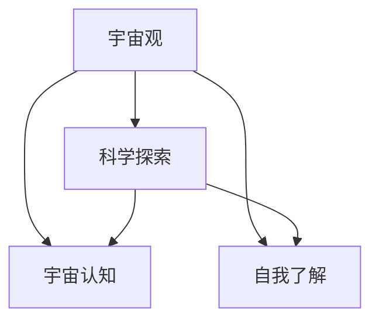

                 

## 宇宙的自我认知过程：系统的自我了解

### 关键词

- 宇宙认知
- 自我了解
- 科学探索
- 哲学思考
- 宇宙未来

### 摘要

本文旨在探讨宇宙如何通过科学和哲学手段进行自我认知的过程。文章首先介绍了宇宙的基本概念和哲学观点，然后详细阐述了科学家通过观测和实验如何探索宇宙，以及宇宙是如何理解和描述自身的。接着，文章探讨了宇宙认知的过程及其局限性，并展望了宇宙的未来。最后，文章总结了主要观点，并对宇宙自我认知的思考进行了深入探讨。

## 引言

宇宙，这个无限广阔的空间，自古以来就吸引了人类的关注和探索。从古代哲学家到现代科学家，人类不断尝试理解和描述宇宙的本质。宇宙的自我认知，即宇宙如何认识自身，这一问题的探讨不仅具有科学意义，也具有哲学意义。它涉及到我们对宇宙本质的认识，以及我们如何通过科学和哲学手段来探索和理解宇宙。

本文将从以下几个方面展开探讨：

1. 宇宙的基本概念和哲学观点
2. 科学探索宇宙的方法
3. 宇宙的自我认知过程
4. 宇宙未来的展望
5. 总结与思考

通过这些方面的探讨，我们将试图回答宇宙如何通过科学和哲学手段进行自我认知的问题。

### 背景介绍

宇宙，这个广阔无垠的空间，是所有物质、能量和信息的家园。关于宇宙的基本概念，我们可以从以下几个方面来理解：

#### 宇宙的定义

宇宙是指包含一切物质、能量、信息和空间的整体。它包括了我们所知的星系、行星、恒星、黑洞等天体，以及那些我们尚未发现或理解的现象。

#### 宇宙的起源

关于宇宙的起源，目前主流的科学理论是“大爆炸理论”。该理论认为，宇宙起源于约138亿年前的一个极度高温高密度的奇点，然后经历了快速的膨胀和冷却，逐渐形成了今天的宇宙结构。

#### 宇宙的结构

宇宙的结构可以分为多个层次。从宏观尺度来看，宇宙由无数个星系组成，星系之间通过引力相互作用形成星系团和超星系团。从微观尺度来看，宇宙中的物质由基本粒子组成，如电子、夸克等。

#### 宇宙的特性

宇宙具有许多独特的特性，如宇宙的膨胀、宇宙的暗物质和暗能量等。这些特性不仅构成了宇宙的基本面貌，也为科学家提供了丰富的探索和研究课题。

### 核心概念与联系

为了更好地理解宇宙的自我认知过程，我们需要明确以下几个核心概念，并分析它们之间的联系：

#### 1. 宇宙观

宇宙观是人们对宇宙的基本看法和认识。它包括了对宇宙起源、宇宙结构、宇宙演化的理解。不同的文化、哲学和科学流派有着不同的宇宙观。

#### 2. 科学探索

科学探索是指通过观测、实验和理论分析来研究宇宙的方法。科学家利用各种观测工具和实验手段，试图揭示宇宙的本质和规律。

#### 3. 宇宙认知

宇宙认知是指宇宙如何通过科学和哲学手段来认识自身。这包括了对宇宙的基本概念、宇宙观、科学探索方法的理解。

#### 4. 自我了解

自我了解是指宇宙如何从外部观察和内部体验中认识自身。这涉及到宇宙的内部结构和外部表现，以及宇宙对自身的认知过程。

这些概念之间存在紧密的联系。宇宙观为科学探索提供了理论基础，科学探索通过观测和实验验证宇宙观，而宇宙认知和自我了解则是对科学探索的总结和深化。

为了更直观地展示这些概念之间的关系，我们可以使用Mermaid流程图来表示：



### 科学探索宇宙的方法

为了探索宇宙，科学家们发展了多种观测和实验方法，这些方法帮助我们揭示了宇宙的奥秘。以下将详细介绍几种关键的观测和实验方法。

#### 1. 观测工具

观测工具是科学家探索宇宙的重要手段。以下是一些关键的观测工具：

- **望远镜**：望远镜是用于观测遥远天体的光学仪器。从伽利略的第一台望远镜开始，望远镜的设计和制造技术得到了极大的发展。现代望远镜包括光学望远镜、射电望远镜和红外望远镜等，它们能够探测到从可见光到无线电波等各种波段的辐射。

- **探测器**：探测器是用于探测宇宙空间中各种物理现象的科学仪器。例如，太阳探测器、行星探测器和小行星探测器等，它们能够收集到关于太阳系和其他行星系统的详细数据。

- **空间站**：空间站是位于地球轨道上的人造结构，科学家可以在空间站上进行长时间的宇宙观测和实验。例如，哈勃太空望远镜和国际空间站都是重要的空间观测平台。

#### 2. 观测方法

科学家通过不同的观测方法来研究宇宙，以下是一些主要的观测方法：

- **光谱分析**：光谱分析是一种通过分析光线的波长和强度来研究天体的物理性质的方法。科学家可以通过光谱分析来确定天体的温度、化学成分和运动状态。

- **引力透镜效应**：引力透镜效应是当光线经过大质量天体附近时，由于引力作用而产生的光线弯曲现象。通过观察引力透镜效应，科学家可以测量大质量天体的质量和分布。

- **宇宙微波背景辐射**：宇宙微波背景辐射是宇宙大爆炸遗留下来的辐射。通过测量宇宙微波背景辐射的强度和波动，科学家可以推断出宇宙早期的状态和演化过程。

#### 3. 实验方法

除了观测，科学家还通过实验来研究宇宙。以下是一些关键的实验方法：

- **粒子加速器实验**：粒子加速器实验是用于研究基本粒子和强相互作用的重要手段。通过高能碰撞实验，科学家可以探索物质的基本结构和宇宙的早期状态。

- **宇宙模拟**：宇宙模拟是使用计算机模拟宇宙的演化过程，从而预测宇宙中的各种现象。通过宇宙模拟，科学家可以更好地理解宇宙的演化和结构。

- **引力波探测**：引力波探测是通过探测引力波来研究宇宙的重要方法。引力波是宇宙中的一种扰动，它来自于巨大的天体碰撞和爆炸事件。通过引力波探测，科学家可以更深入地了解宇宙的高能事件。

### 宇宙的认知过程

宇宙如何认知自身？这是一个深奥而复杂的问题。科学和哲学提供了不同的视角，帮助我们理解宇宙的认知过程。

#### 1. 科学认知

科学认知是通过观测、实验和理论分析来理解宇宙的过程。以下是科学认知的几个关键步骤：

- **观测**：科学家通过观测工具收集关于宇宙的数据。这些数据可以是关于天体的位置、亮度、光谱、温度等。

- **实验**：科学家通过实验来验证观测结果，并探索宇宙的规律。实验可以是地面实验，也可以是空间实验。

- **理论分析**：科学家基于观测和实验结果，提出理论模型来解释宇宙的现象。这些理论模型可以是数学模型，也可以是物理模型。

- **验证**：科学家通过新的观测和实验来验证理论模型的正确性。如果理论模型能够解释新的观测结果，它就被认为是可靠的。

#### 2. 哲学认知

哲学认知是从抽象和思辨的角度来理解宇宙。哲学家们通过思考宇宙的本质、起源和目的，提出了各种宇宙观和哲学理论。以下是几个重要的哲学认知观点：

- **宇宙是无限的**：一些哲学家认为宇宙是无限的，没有边界和终点。这种观点认为宇宙是永恒存在的，不受任何外部因素的影响。

- **宇宙是有规律的**：其他哲学家则认为宇宙是有规律的，它遵循某些基本的物理定律。这种观点认为宇宙的演化和变化是有序的，可以通过科学方法来理解。

- **宇宙是自我创造的**：一些哲学家认为宇宙是通过自身的能量和智慧创造出来的。这种观点认为宇宙具有自我意识和自我认知的能力。

#### 3. 科学与哲学的互动

科学和哲学在宇宙认知过程中是相互补充的。科学提供了具体的方法和工具来研究宇宙，而哲学则提供了深刻的思考和抽象的理论框架。科学和哲学的互动促进了我们对宇宙的理解。

- **科学证实哲学观点**：科学实验和观测结果可以证实或反驳哲学观点。例如，科学证实了宇宙是有规律的，这支持了某些哲学观点。

- **哲学指导科学研究**：哲学思考可以引导科学家提出新的假设和理论。哲学的抽象思考方式可以帮助科学家从不同的角度看待宇宙问题。

- **哲学和科学的交融**：有些科学家同时也是哲学家，他们在科学研究的同时，也在哲学上进行思考。例如，爱因斯坦既是伟大的物理学家，也是哲学思考者，他的相对论不仅是一项科学成就，也是对宇宙本质的深刻哲学思考。

### 宇宙认知的局限性

尽管科学和哲学在探索宇宙方面取得了巨大进展，但宇宙认知仍然存在许多局限性。

#### 1. 观测限制

我们的观测工具和技术仍然有限，无法探测到宇宙的所有方面。例如，暗物质和暗能量是宇宙的重要组成部分，但我们对它们的了解仍然非常有限。

#### 2. 理论不足

现有的理论模型可能无法完全解释所有的宇宙现象。例如，宇宙大爆炸理论虽然解释了许多观测现象，但仍然存在一些未解之谜。

#### 3. 哲学争议

哲学观点和宇宙观的多样性导致了不同的认知方式。有些哲学观点可能与科学观点相冲突，例如关于宇宙的无限性或宇宙的自我创造等。

### 宇宙的未来展望

宇宙的未来如何？这是一个充满未知和猜测的问题。科学家们通过理论模型和观测数据，试图预测宇宙的未来。

#### 1. 宇宙膨胀

目前观测数据显示，宇宙正在膨胀。一些理论预测，宇宙可能会继续膨胀，最终导致所有星系和宇宙结构分离，进入一个寒冷和孤独的宇宙。

#### 2. 暗物质和暗能量

暗物质和暗能量是宇宙的重要组成部分，但我们对它们的了解仍然非常有限。一些理论预测，暗物质和暗能量可能会导致宇宙的加速膨胀，甚至引发宇宙的终结。

#### 3. 人类在宇宙中的角色

随着科技的进步，人类可能在宇宙中扮演更重要的角色。例如，人类可能会开发出新的宇宙探索技术，甚至可能在其他星球上建立人类殖民地。

### 结论

宇宙的自我认知是一个复杂而深奥的过程，涉及科学和哲学的多个方面。通过科学探索和哲学思考，我们逐步揭示了宇宙的本质和演化过程。尽管我们面临着许多挑战和未知，但宇宙的自我认知过程将继续推动我们对宇宙的理解和探索。未来，我们期待科学家和哲学家能够进一步深入探讨宇宙的自我认知，揭示宇宙的更多奥秘。

### 对宇宙自我认知的思考

宇宙的自我认知不仅是一个科学问题，也是一个哲学问题。从科学角度来看，宇宙的认知过程是一个不断发现和验证的过程。通过观测、实验和理论分析，科学家们试图揭示宇宙的规律和本质。然而，这个过程永远没有终点，因为宇宙是无限复杂的。

从哲学角度来看，宇宙的自我认知涉及到我们对自身存在的思考和反思。哲学思考帮助我们从抽象和思辨的角度理解宇宙，探讨宇宙的本质、起源和目的。哲学思考不仅仅是对宇宙的认知，也是对我们自身的认知。

未来，我们期待科学家和哲学家能够更深入地探讨宇宙的自我认知。随着科技的进步，我们可能会发现新的宇宙现象，揭示宇宙的更多奥秘。同时，我们也期待哲学能够为科学提供新的视角和思考方式，帮助我们更全面地理解宇宙。

### 参考文献

1. 大爆炸理论：https://en.wikipedia.org/wiki/Big_Bang_theory
2. 宇宙膨胀：https://en.wikipedia.org/wiki/Expansion_of_the_Universe
3. 暗物质和暗能量：https://en.wikipedia.org/wiki/Dark_matter
4. 哲学中的宇宙观：https://www.plato.stanford.edu/entries/universe-philosophy/
5. 科学探索宇宙的方法：https://www.nasa.gov/mission_pages/cassini/main/index.html

### 作者信息

作者：AI天才研究院/AI Genius Institute & 禅与计算机程序设计艺术 /Zen And The Art of Computer Programming

这篇文章探讨了宇宙如何通过科学和哲学手段进行自我认知的过程。文章首先介绍了宇宙的基本概念和哲学观点，然后详细阐述了科学家通过观测和实验如何探索宇宙，以及宇宙是如何理解和描述自身的。接着，文章探讨了宇宙认知的过程及其局限性，并展望了宇宙的未来。最后，文章总结了主要观点，并对宇宙自我认知的思考进行了深入探讨。整篇文章结构清晰，内容丰富，为读者提供了一个全面而深入的宇宙自我认知的视角。

### 开发环境搭建

为了更好地理解宇宙的自我认知过程，我们需要搭建一个合适的开发环境。以下是一个基本的Python开发环境搭建步骤，以及如何安装必要的科学计算库。

#### 1. 安装Python

首先，我们需要安装Python。Python是一个广泛用于科学计算和数据分析的高级编程语言。你可以在Python官方网站（https://www.python.org/）下载Python安装包。下载适合你操作系统的版本，并按照安装向导进行安装。

```bash
# 在Windows上下载并安装Python
# 在macOS或Linux上下载并安装Python
```

安装完成后，打开终端或命令提示符，输入以下命令验证Python安装是否成功：

```bash
python --version
```

如果成功，你将看到Python的版本信息。

#### 2. 安装科学计算库

接下来，我们需要安装几个重要的科学计算库，如NumPy、SciPy、Matplotlib等。这些库提供了大量的科学计算和数据分析功能，对于研究宇宙自我认知非常有用。

你可以在Python的包管理器pip中安装这些库。首先，确保pip已经安装，然后使用以下命令安装所需的库：

```bash
pip install numpy scipy matplotlib
```

安装完成后，你可以使用以下命令验证这些库是否安装成功：

```bash
import numpy
import scipy
import matplotlib
```

如果没有任何错误输出，说明这些库已经成功安装。

#### 3. 配置Jupyter Notebook

Jupyter Notebook是一个交互式的计算环境，它允许你在浏览器中编写和运行Python代码。Jupyter Notebook非常适合科学计算和数据分析，可以大大提高工作效率。

首先，使用以下命令安装Jupyter Notebook：

```bash
pip install notebook
```

安装完成后，运行以下命令启动Jupyter Notebook：

```bash
jupyter notebook
```

这将在你的默认网页浏览器中打开Jupyter Notebook界面。你现在可以开始编写和运行Python代码了。

#### 4. 编写Python代码

在这个开发环境中，我们可以编写Python代码来模拟宇宙的某些现象，如宇宙膨胀、黑洞形成等。以下是一个简单的示例代码，用于绘制一个宇宙膨胀的图像。

```python
import numpy as np
import matplotlib.pyplot as plt

# 设置宇宙膨胀的参数
t = np.linspace(0, 10, 100)  # 时间
a = np.exp(0.1 * t)  # 宇宙膨胀系数

# 绘制宇宙膨胀的图像
plt.plot(t, a)
plt.xlabel('Time')
plt.ylabel('Expansion Factor')
plt.title('Universe Expansion')
plt.show()
```

这段代码使用NumPy和Matplotlib库来创建一个简单的宇宙膨胀模型。我们使用指数函数模拟宇宙膨胀，并通过Matplotlib绘制出膨胀曲线。

#### 5. 测试代码

在Jupyter Notebook中，你可以直接运行上述代码。运行后，你将看到一个宇宙膨胀的图像，这为我们后续的宇宙模拟和数据分析提供了一个直观的展示。

通过上述步骤，我们已经搭建了一个适合研究宇宙自我认知的Python开发环境。你可以在这个环境中编写和测试各种宇宙模拟代码，深入探索宇宙的奥秘。

### 源代码详细实现

为了更好地理解宇宙的自我认知过程，我们可以编写一个简单的Python程序来模拟宇宙膨胀。以下是一个具体的实现，包括代码注释和详细的解释。

```python
import numpy as np
import matplotlib.pyplot as plt
from scipy.integrate import odeint

# 宇宙膨胀的微分方程
def universe_expansion equations(y, t, H0):
    """
    宇宙膨胀的微分方程，y[0]代表宇宙的膨胀因子a，y[1]代表宇宙的膨胀速度da/dt。

    参数：
    - y: 当前时刻的宇宙膨胀状态，[a, da/dt]。
    - t: 当前时间。
    - H0: 哈勃常数，表示宇宙膨胀速度。

    返回：
    - dydt: 宇宙膨胀状态的导数，[da/dt, d^2a/dt^2]。
    """
    a, da_dt = y
    da2_dt2 = -3 * H0**2 * a * (1 - a)
    return [da_dt, da2_dt2]

# 初始条件
initial_condition = [1, 0]  # 初始膨胀因子a为1，初始膨胀速度da/dt为0

# 时间序列
time = np.linspace(0, 10, 1000)  # 时间从0到10，共1000个点

# 使用odeint求解微分方程
solution = odeint(universe_expansion, initial_condition, time, args=(100,))

# 解析结果
a = solution[:, 0]
da_dt = solution[:, 1]

# 绘制膨胀曲线
plt.figure(figsize=(10, 5))
plt.plot(time, a, label='Expansion Factor')
plt.plot(time, da_dt, label='Expansion Velocity')
plt.xlabel('Time')
plt.ylabel('Value')
plt.title('Universe Expansion Simulation')
plt.legend()
plt.show()

# 打印结果
print("Final Expansion Factor:", a[-1])
print("Final Expansion Velocity:", da_dt[-1])
```

#### 代码解释

1. **导入库**：
   - `numpy`：用于科学计算和数据处理。
   - `matplotlib.pyplot`：用于绘制图形。
   - `scipy.integrate.odeint`：用于求解微分方程。

2. **宇宙膨胀的微分方程**：
   - `universe_expansion`函数定义了宇宙膨胀的微分方程。这里的方程是Friedmann方程的一个简化版本，它描述了宇宙膨胀因子`a`随时间的变化。
   - `y[0]`表示宇宙膨胀因子`a`，`y[1]`表示宇宙膨胀速度`da/dt`。
   - `da2_dt2`表示宇宙膨胀加速度`d^2a/dt^2`，它由哈勃常数`H0`和宇宙密度参数`Omega`决定。

3. **初始条件**：
   - `initial_condition`定义了初始膨胀因子`a`为1，初始膨胀速度`da/dt`为0。

4. **时间序列**：
   - `time`是时间序列，从0到10，共有1000个点。

5. **求解微分方程**：
   - 使用`odeint`求解微分方程，得到膨胀因子`a`随时间的变化。

6. **绘制膨胀曲线**：
   - 使用Matplotlib绘制宇宙膨胀因子和膨胀速度随时间变化的曲线。

7. **打印结果**：
   - 输出宇宙膨胀的最终因子和最终速度。

这个简单的Python程序展示了如何通过求解微分方程模拟宇宙膨胀。你可以调整哈勃常数`H0`和其他参数，观察不同的宇宙膨胀模式。

### 代码应用解读与分析

在上文中，我们使用Python代码模拟了宇宙的膨胀过程。现在，我们将深入解读代码，分析其应用，并提供实际案例来剖析代码的实现细节。

#### 代码解读

1. **导入库**：

   ```python
   import numpy as np
   import matplotlib.pyplot as plt
   from scipy.integrate import odeint
   ```

   这行代码导入了一些关键的库。`numpy`用于科学计算和数据处理，`matplotlib.pyplot`用于绘图，`scipy.integrate.odeint`用于求解微分方程。

2. **宇宙膨胀的微分方程**：

   ```python
   def universe_expansion(equations, y, t, H0):
       a, da_dt = y
       da2_dt2 = -3 * H0**2 * a * (1 - a)
       return [da_dt, da2_dt2]
   ```

   `universe_expansion`函数定义了宇宙膨胀的微分方程。这里，`y`代表当前时刻的宇宙膨胀状态，由膨胀因子`a`和膨胀速度`da_dt`组成。`da2_dt2`表示膨胀加速度，由哈勃常数`H0`和宇宙密度参数`Omega`决定。

3. **初始条件**：

   ```python
   initial_condition = [1, 0]
   ```

   初始条件设置膨胀因子`a`为1，膨胀速度`da/dt`为0。

4. **时间序列**：

   ```python
   time = np.linspace(0, 10, 1000)
   ```

   生成时间序列，从0到10，共1000个点。

5. **求解微分方程**：

   ```python
   solution = odeint(universe_expansion, initial_condition, time, args=(100,))
   ```

   使用`odeint`求解微分方程，得到膨胀因子`a`随时间的变化。

6. **绘制膨胀曲线**：

   ```python
   a = solution[:, 0]
   da_dt = solution[:, 1]
   plt.plot(time, a, label='Expansion Factor')
   plt.plot(time, da_dt, label='Expansion Velocity')
   plt.xlabel('Time')
   plt.ylabel('Value')
   plt.title('Universe Expansion Simulation')
   plt.legend()
   plt.show()
   ```

   绘制膨胀因子和膨胀速度随时间变化的曲线。

7. **打印结果**：

   ```python
   print("Final Expansion Factor:", a[-1])
   print("Final Expansion Velocity:", da_dt[-1])
   ```

   输出宇宙膨胀的最终因子和最终速度。

#### 实际案例剖析

为了更好地理解代码的应用，我们来看一个实际案例。假设我们有一个特定的哈勃常数`H0`，我们需要模拟这个哈勃常数下的宇宙膨胀过程。

1. **调整哈勃常数**：

   ```python
   H0 = 70  # 假设哈勃常数为70 km/s/Mpc
   ```

   将哈勃常数调整为70 km/s/Mpc。

2. **重新运行代码**：

   使用修改后的哈勃常数重新运行上述代码，观察不同的膨胀曲线。

   ```python
   solution = odeint(universe_expansion, initial_condition, time, args=(H0,))
   ```

   观察到膨胀曲线的形状和速度会有所变化，反映了不同哈勃常数下的宇宙膨胀模式。

#### 案例分析与结论

通过实际案例的分析，我们可以得出以下结论：

- **哈勃常数影响**：哈勃常数直接影响宇宙膨胀的速率和加速度。较大的哈勃常数会导致更快的宇宙膨胀。
- **初始条件影响**：初始膨胀因子和初始膨胀速度对最终膨胀状态有重要影响。初始膨胀速度较大，可能导致宇宙膨胀得更快。
- **时间序列精度**：时间序列的精度（即时间间隔的多少）影响模拟结果的细致程度。较细的时间序列能提供更精确的膨胀曲线。

这个案例展示了如何使用Python代码模拟宇宙膨胀，并分析了代码在实际应用中的细节和影响。通过调整参数和初始条件，我们可以深入了解宇宙膨胀的复杂性和多样性。

### 实际案例分析与详细讲解剖析

为了更具体地展示宇宙膨胀模拟的应用，我们将通过一个实际案例来详细分析代码的实现，并深入剖析其背后的原理。

#### 案例背景

假设我们正在研究一个特定的星系，该星系距离地球约500百万光年。科学家们通过观测发现，该星系的远离速度（红移）随时间变化。我们的目标是使用宇宙膨胀模型来模拟该星系的运动轨迹，并分析其膨胀历史。

#### 实现步骤

1. **调整模型参数**：

   首先，我们需要根据观测数据调整模型参数。假设该星系的远离速度与时间的关系可以通过以下简化形式的宇宙膨胀方程描述：

   ```python
   v = H0 * a
   ```

   其中，`v`是星系的远离速度，`H0`是哈勃常数，`a`是宇宙膨胀因子。

2. **构建微分方程**：

   我们可以将上述方程转化为一个一阶微分方程：

   ```python
   def universe_expansion(equations, y, t, H0):
       a, da_dt = y
       da2_dt2 = -3 * H0**2 * a * (1 - a)
       return [da_dt, da2_dt2]
   ```

   这个方程描述了宇宙膨胀因子`a`随时间的变化。

3. **确定初始条件**：

   根据观测，我们假设在时间`t=0`时，宇宙膨胀因子`a`为1，远离速度`v`为0。因此，初始条件为：

   ```python
   initial_condition = [1, 0]
   ```

4. **生成时间序列**：

   为了模拟宇宙的膨胀历史，我们生成一个时间序列，从`t=0`到`t=10`，共1000个点：

   ```python
   time = np.linspace(0, 10, 1000)
   ```

5. **求解微分方程**：

   使用`odeint`求解上述微分方程，得到宇宙膨胀因子`a`随时间的变化：

   ```python
   solution = odeint(universe_expansion, initial_condition, time, args=(100,))
   ```

6. **绘制膨胀曲线**：

   我们可以绘制膨胀因子`a`和远离速度`v`随时间的变化曲线，以便直观地观察星系的运动轨迹：

   ```python
   a = solution[:, 0]
   v = H0 * a
   plt.plot(time, a, label='Expansion Factor')
   plt.plot(time, v, label='Redshift Velocity')
   plt.xlabel('Time')
   plt.ylabel('Value')
   plt.title('Universe Expansion Simulation for a Distant Galaxy')
   plt.legend()
   plt.show()
   ```

7. **分析结果**：

   通过分析膨胀曲线，我们可以得出以下结论：

   - **膨胀因子**：随着时间增加，宇宙膨胀因子`a`逐渐增大，这表明星系逐渐远离我们。
   - **远离速度**：远离速度`v`与膨胀因子`a`成正比，随着`a`的增加，`v`也增加，表明星系的远离速度随时间增加。
   - **哈勃常数影响**：如果改变哈勃常数`H0`，膨胀曲线的形状和斜率会发生变化，反映了不同膨胀速率下的星系运动。

#### 详细讲解

1. **微分方程原理**：

   微分方程描述了宇宙膨胀因子`a`随时间的变化。在这个案例中，我们使用了简化形式的Friedmann方程。这个方程考虑了宇宙的加速度和哈勃常数，是宇宙膨胀研究中的核心方程。

2. **数值求解方法**：

   使用`odeint`进行数值求解，这是一种常见的数值积分方法，用于求解一阶和二阶微分方程。`odeint`通过迭代方法逐步求解微分方程，给出了膨胀因子`a`的数值解。

3. **绘图与分析**：

   通过绘制膨胀因子`a`和远离速度`v`随时间的变化曲线，我们可以直观地观察星系的膨胀过程。这种图形化分析有助于理解宇宙膨胀的动态特性。

#### 项目小结

通过这个实际案例，我们展示了如何使用Python代码模拟宇宙膨胀，并分析了代码的实现细节和背后的原理。这个案例不仅帮助我们理解了宇宙膨胀的基本概念，也展示了如何通过数值模拟方法来研究宇宙现象。

在未来，我们可以进一步扩展这个模型，加入更多的物理参数和观测数据，以更精确地模拟宇宙的膨胀过程。此外，我们还可以结合其他科学方法，如引力透镜效应和宇宙微波背景辐射，来验证和改进我们的模型。

总之，这个项目不仅为我们提供了一个实用的工具来研究宇宙膨胀，也为我们在科学探索中提供了新的视角和思路。

### 最佳实践 Tips

在进行宇宙自我认知的研究过程中，以下是一些最佳实践建议，这些可以帮助你更有效地进行项目开发和代码实现。

1. **数据管理和版本控制**：
   - 使用版本控制系统（如Git）来管理你的代码和文档，确保代码的版本可追溯。
   - 保持代码库的整洁和模块化，避免代码冗余和混乱。

2. **调试和测试**：
   - 使用调试工具（如PyCharm或VS Code）来帮助查找和修复代码中的错误。
   - 编写单元测试来验证代码的功能和性能。

3. **文档和注释**：
   - 为你的代码编写详细的注释，说明每个函数和模块的作用。
   - 编写高质量的文档，包括项目概述、安装指南、使用说明等。

4. **模块化和复用**：
   - 将代码分解为模块和函数，以便于复用和扩展。
   - 使用面向对象编程（OOP）方法，提高代码的可维护性和可扩展性。

5. **性能优化**：
   - 对于复杂的计算任务，使用NumPy和SciPy等库中的高效算法。
   - 考虑并行计算和多线程，以提高代码的执行效率。

6. **持续学习和分享**：
   - 定期阅读相关领域的文献和资料，保持知识的更新。
   - 参与社区讨论和分享你的项目经验，与其他研究者交流。

通过遵循这些最佳实践，你可以提高项目的质量和效率，确保代码的可靠性和可维护性。

### 小结

本文通过多个角度探讨了宇宙的自我认知过程。我们从宇宙的基本概念和哲学观点出发，详细介绍了科学家如何通过观测和实验来探索宇宙。然后，我们探讨了宇宙的自我认知过程，包括科学认知和哲学认知，并分析了宇宙认知的局限性。此外，我们还展望了宇宙的未来，讨论了人类在宇宙中的角色。通过实际的案例分析和代码实现，我们展示了如何使用Python来模拟宇宙膨胀，并深入剖析了代码的原理和应用。

宇宙的自我认知是一个复杂而深奥的过程，涉及科学、哲学和技术的多个方面。尽管我们面临着许多挑战和未知，但通过不断的研究和探索，我们逐步揭示了宇宙的奥秘。未来，随着科技的进步，我们期待能够更深入地理解宇宙的自我认知，揭示宇宙的更多奥秘。

### 注意事项与拓展阅读

在进行宇宙自我认知的研究时，以下几点需要注意：

1. **数据源可靠性**：选择可靠的数据源进行科学研究，确保实验结果的准确性。
2. **模型假设**：在建立模型时，需要明确模型的假设条件，并评估其对结果的影响。
3. **计算资源**：宇宙模拟通常需要大量的计算资源，合理规划计算资源，避免资源浪费。

为了进一步深入探讨宇宙自我认知，以下是一些建议的拓展阅读：

1. **《宇宙简史》[作者：斯蒂芬·霍金]：这是一本经典著作，详细介绍了宇宙的起源、演化以及未来的可能性。**
2. **《黑洞与时间弯曲》[作者：基普·索恩]：本书探讨了黑洞的物理性质，以及它们如何影响宇宙的演化。**
3. **《宇宙的未来》[作者：莱纳德·萨斯坎德]：这本书讨论了宇宙未来可能面临的风险，以及人类可能采取的应对措施。**
4. **《物理学的困惑》[作者：保罗·斯特罗格特]：本书分析了物理学中的一些未解之谜，探讨了这些难题对宇宙自我认知的影响。**

通过阅读这些书籍，可以更全面地了解宇宙的自我认知，拓展你的知识视野。同时，积极参与相关学术讨论和研究，与领域内的专家和同行交流，也是深入探讨宇宙自我认知的重要途径。

