                 

### 文章标题

《宇宙的自我认知过程：系统的自我了解》

**关键词：** 宇宙认知、系统分析、自我了解、人工智能、算法原理

**摘要：** 本文旨在探讨宇宙的自我认知过程，通过系统的自我了解来揭示宇宙演化的奥秘。文章首先介绍了宇宙的起源与演化，接着探讨了生命的起源与演化，最后探讨了宇宙的未来与探索。通过逻辑清晰、结构紧凑的分析，本文揭示了宇宙自我认知的内在机制，为理解宇宙的本质提供了新的视角。

### 文章关键词

- 宇宙认知
- 系统分析
- 自我了解
- 人工智能
- 算法原理

### 文章摘要

本文从宇宙的自我认知过程出发，系统地探讨了宇宙的起源与演化、生命的起源与演化，以及宇宙的未来与探索。文章首先介绍了宇宙的起源与演化，从宇宙微波背景辐射到星系的形成，详细阐述了宇宙的早期演化过程。接着，文章探讨了生命的起源与演化，从地球生命的起源到人类的出现，深入剖析了生命的进化历程。最后，文章展望了宇宙的未来，从宇宙膨胀到暗能量的研究，探讨了宇宙的最终命运。通过逻辑清晰、结构紧凑的分析，本文揭示了宇宙自我认知的内在机制，为理解宇宙的本质提供了新的视角。

## 第一部分：宇宙的起源与演化

### 第1章：宇宙的起源

#### 1.1 宇宙学基础

宇宙学是研究宇宙的起源、演化、结构、性质和终极命运的科学。它涉及多个学科，包括天文学、物理学、数学和哲学。宇宙学的核心问题是宇宙如何从无到有、如何演化至今，以及宇宙的未来将如何发展。

宇宙的起源通常被认为是大爆炸。大爆炸理论认为，宇宙在约138亿年前从一个极小的、极热的、极密集的状态开始膨胀，形成了我们今天所见的宇宙。这个理论得到了广泛的科学支持，其中包括宇宙微波背景辐射的观测、宇宙膨胀的加速以及宇宙大尺度结构的形成等证据。

**核心概念与联系：**

1. **大爆炸理论**：宇宙从一个极小、极热、极密集的状态开始膨胀，形成了我们今天所见的宇宙。
2. **宇宙微波背景辐射**：大爆炸后遗留的辐射，提供了宇宙早期演化的直接证据。
3. **宇宙膨胀**：宇宙从大爆炸开始不断膨胀，这种膨胀在宇宙微波背景辐射中得到了验证。

**Mermaid 流程图：**

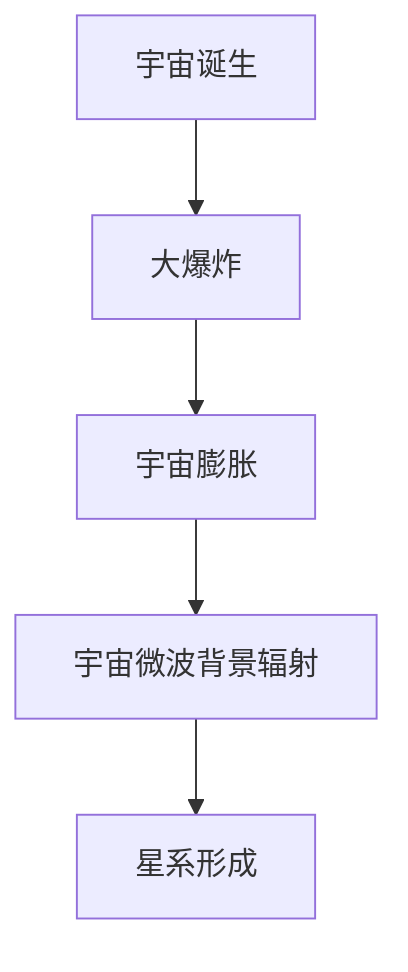

#### 1.2 早期宇宙的研究方法

早期宇宙的研究方法主要包括宇宙微波背景辐射的观测、星系分布的测量以及宇宙膨胀速率的测定等。宇宙微波背景辐射的观测是研究早期宇宙的重要手段，它提供了宇宙早期温度和密度的信息。星系分布的测量则帮助我们了解宇宙的大尺度结构，如星系团和超星系团的形成。宇宙膨胀速率的测定则帮助我们了解宇宙的演化历史和未来的命运。

**核心概念与联系：**

1. **宇宙微波背景辐射**：大爆炸后遗留的辐射，提供了宇宙早期演化的直接证据。
2. **星系分布**：宇宙的大尺度结构，如星系团和超星系团的形成。
3. **宇宙膨胀速率**：宇宙的演化历史和未来命运的重要指标。

**Mermaid 流程图：**

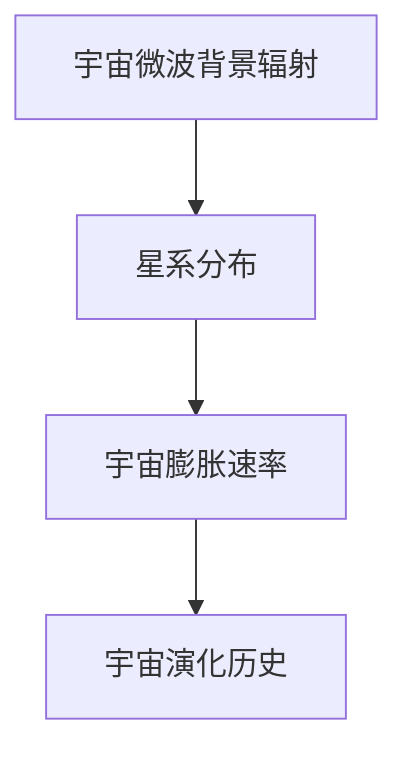

#### 1.3 宇宙的大尺度结构

宇宙的大尺度结构是指宇宙中星系的分布和排列方式。它包括星系团、超星系团和宇宙壁等结构。星系团是由数十到数千个星系组成的引力系统，而超星系团则是由多个星系团组成的更大规模的引力系统。宇宙壁则是宇宙中星系团之间的巨大空洞，它构成了宇宙的大尺度网络。

**核心概念与联系：**

1. **星系团**：由数十到数千个星系组成的引力系统。
2. **超星系团**：由多个星系团组成的更大规模的引力系统。
3. **宇宙壁**：宇宙中星系团之间的巨大空洞，构成了宇宙的大尺度网络。

**Mermaid 流程图：**

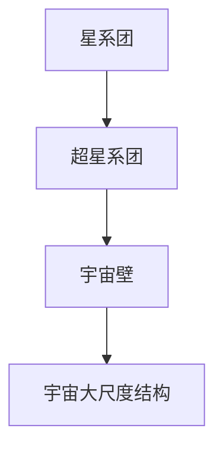

### 第2章：宇宙的演化

#### 2.1 恒星的形成与演化

恒星的形成是宇宙演化过程中的关键一步。恒星的形成通常发生在星系团的中心，那里有足够的气体和尘埃来提供恒星的诞生。恒星的形成过程可以分为几个阶段：

1. **原恒星阶段**：气体和尘埃云开始收缩，形成一个原恒星。
2. **主序星阶段**：原恒星的核心开始聚变氢，形成主序星。
3. **红巨星阶段**：主序星耗尽核心的氢，膨胀成为红巨星。
4. **超巨星阶段**：红巨星进一步膨胀，成为超巨星。

**核心概念与联系：**

1. **原恒星阶段**：气体和尘埃云收缩形成原恒星。
2. **主序星阶段**：原恒星的核心开始聚变氢，形成主序星。
3. **红巨星阶段**：主序星耗尽核心的氢，膨胀成为红巨星。
4. **超巨星阶段**：红巨星进一步膨胀，成为超巨星。

**Mermaid 流程图：**

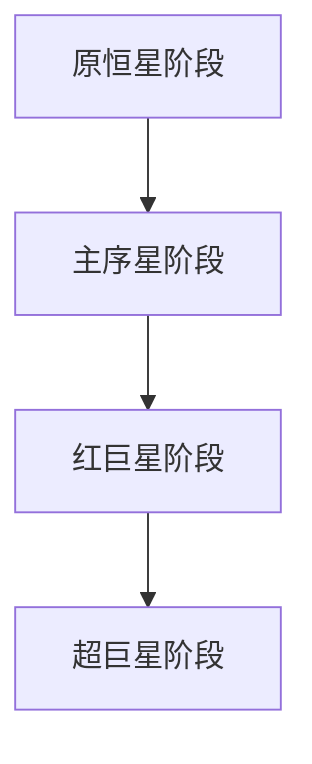

#### 2.2 恒星死亡与宇宙元素的产生

恒星死亡是宇宙演化过程中的另一个重要环节。恒星的死亡方式取决于其初始质量。较小的恒星通常会形成白矮星，而较大的恒星则会经历更剧烈的死亡过程，如超新星爆炸。

**核心概念与联系：**

1. **白矮星**：较小恒星的死亡方式，形成白矮星。
2. **中子星**：较大恒星死亡后，可能形成的中子星。
3. **黑洞**：非常大质量的恒星死亡后，可能形成黑洞。
4. **宇宙元素的产生**：恒星死亡过程中，会产生各种重元素。

**Mermaid 流程图：**

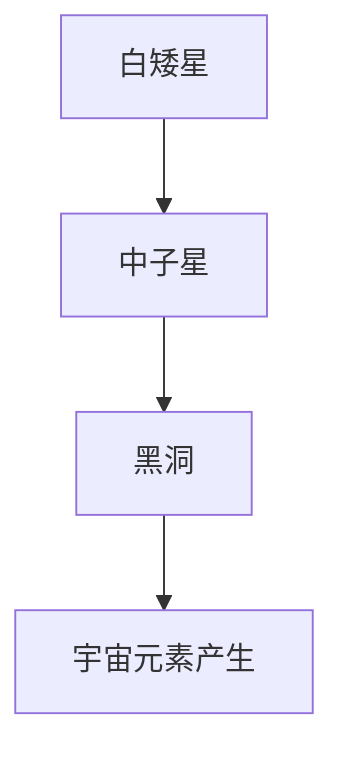

#### 2.3 星系的形成与演化

星系的形成是宇宙演化过程中的一个重要阶段。星系的形成通常涉及气体和尘埃云的聚集和收缩。在星系形成后，星系内部的恒星会通过引力和湍流相互作用继续演化。

**核心概念与联系：**

1. **星系形成**：气体和尘埃云的聚集和收缩形成星系。
2. **星系演化**：星系内部的恒星通过引力和湍流相互作用继续演化。
3. **星系碰撞与合并**：星系之间的相互作用可能导致星系碰撞和合并。

**Mermaid 流程图：**

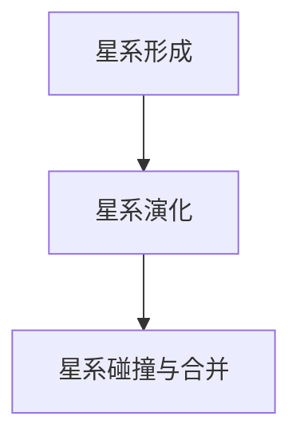

## 第二部分：生命的起源与演化

### 第3章：生命的起源

#### 3.1 生命的定义

生命是宇宙中最复杂的物质形态，具有一系列独特的特征，如新陈代谢、生长、繁殖、适应环境变化等。生命的定义是一个不断演变的过程，科学家们对生命的定义也在不断发展和完善。

**核心概念与联系：**

1. **新陈代谢**：生命的基本特征之一，指的是生物体吸收和利用营养物质的过程。
2. **生长**：生命体的体积和复杂度随时间的增加而增加。
3. **繁殖**：生命体的后代通过生物体的繁殖过程产生。
4. **适应**：生命体能够适应不断变化的环境。

**Mermaid 流程图：**

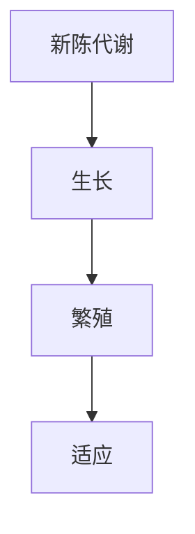

#### 3.2 地球生命的起源

地球生命的起源是一个复杂的过程，科学家们提出了多种假说来解释这一过程。目前最被广泛接受的观点是“深海热液喷口”假说，即生命起源于地球深海中的热液喷口区域。

**核心概念与联系：**

1. **深海热液喷口**：地球深海中的热液喷口提供了生命起源所需的热能和化学物质。
2. **原始生命的诞生**：在热液喷口区域，简单的有机分子通过化学反应逐渐形成更复杂的生物分子，最终诞生了原始生命。

**Mermaid 流程图：**

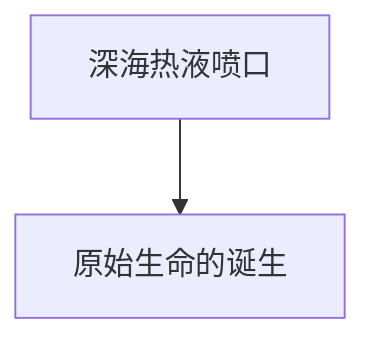

#### 3.3 外星生命的可能性

外星生命的存在一直是科学界和公众关注的焦点。尽管目前还没有确凿的证据证明外星生命的存在，但科学家们通过多种方式来寻找外星生命的线索。

**核心概念与联系：**

1. **行星适宜性**：科学家们通过研究类地行星的大气成分、温度、液态水存在性等指标来评估这些行星的适宜性。
2. **生命迹象**：科学家们通过观测行星的大气成分、地面特征等来寻找可能的生物迹象。

**Mermaid 流程图：**

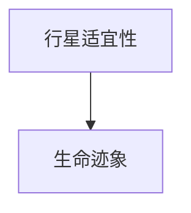

### 第4章：生命的演化

#### 4.1 地球生命的进化历程

地球生命的进化历程是一个漫长而复杂的过程，从单细胞生物到复杂生物体的演变，充满了挑战和奇迹。

**核心概念与联系：**

1. **单细胞生物**：地球生命起源之初，生命体都是单细胞的。
2. **多细胞生物**：随着进化，一些单细胞生物逐渐发展出了多细胞结构。
3. **复杂生物体**：复杂生物体的形成是地球生命进化历程的最终目标。

**Mermaid 流程图：**

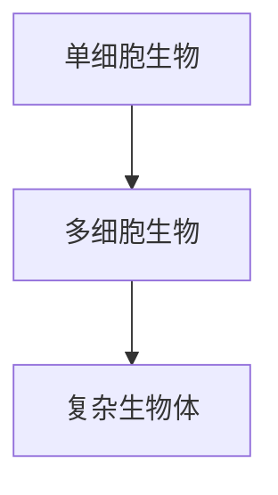

#### 4.2 生物多样性的形成

生物多样性是地球上生命形式的丰富性和多样性的表现。生物多样性的形成是地球生命进化历程的重要成果，也是地球生态系统稳定和可持续发展的基础。

**核心概念与联系：**

1. **物种形成**：生物多样性的基础是物种的形成，物种的形成是生物进化的结果。
2. **灭绝与复苏**：生物多样性的形成过程中，既有物种的形成，也有物种的灭绝和复苏。

**Mermaid 流程图：**

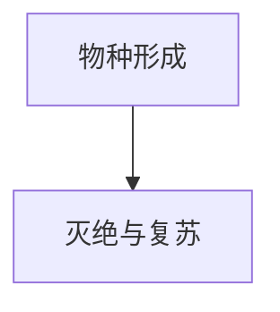

#### 4.3 人类的出现与进化

人类是地球上最复杂的生命形式之一，人类的出现和进化是地球生命演化历程的巅峰。人类的出现不仅改变了地球的生态格局，也深刻影响了整个宇宙。

**核心概念与联系：**

1. **早期人类**：早期人类经历了从直立人到智人的进化过程。
2. **现代人类**：现代人类在智人阶段形成，具有高度发达的大脑和复杂的社会结构。
3. **人类进化对宇宙的影响**：人类的出现和进化对宇宙的影响体现在人类对宇宙的认知、探索和利用上。

**Mermaid 流程图：**

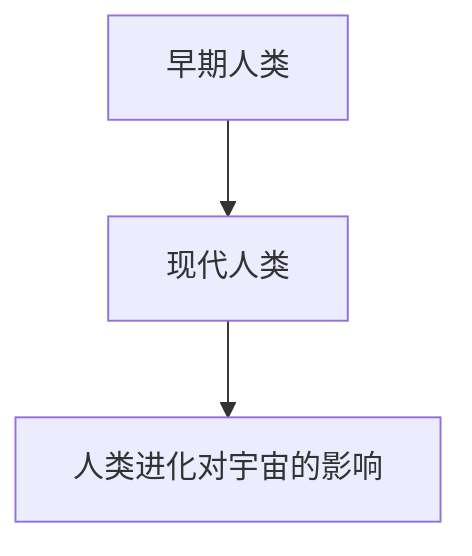

## 第三部分：宇宙的探索与未来

### 第5章：宇宙探索的方法与工具

宇宙探索是了解宇宙、揭示宇宙奥秘的重要途径。宇宙探索的方法和工具不断进步，使得我们对宇宙的认识越来越深入。

**核心概念与联系：**

1. **望远镜**：望远镜是宇宙探索的重要工具，通过望远镜我们可以观测到遥远的星体和宇宙现象。
2. **探测器**：探测器是宇宙探索的另一个重要工具，它可以直接探测宇宙中的物质和能量。
3. **空间站**：空间站是宇宙探索的前沿基地，它提供了科学家进行宇宙实验和研究的环境。

**Mermaid 流程图：**

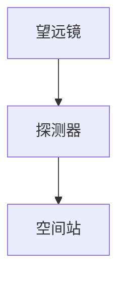

#### 5.1 望远镜的发展与功能

望远镜的发展是宇宙探索的重要里程碑。最早的望远镜是由伽利略发明的，他利用望远镜观测到了木星的卫星和月球表面的山川。随着科技的发展，望远镜的精度和功能不断提高，如哈勃望远镜和开普勒望远镜等。

**核心概念与联系：**

1. **伽利略望远镜**：伽利略望远镜是早期望远镜的典型代表，它为科学家提供了观测宇宙的全新视角。
2. **哈勃望远镜**：哈勃望远镜是现代天文观测的重要工具，它能够观测到宇宙深处的星体和现象。
3. **开普勒望远镜**：开普勒望远镜专门用于观测系外行星，为科学家提供了大量关于系外行星的信息。

**Mermaid 流程图：**

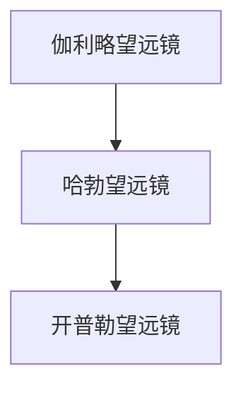

#### 5.2 宇宙探测任务

宇宙探测任务是了解宇宙、揭示宇宙奥秘的重要途径。宇宙探测任务包括月球探测、火星探测、木星探测等。这些任务为我们提供了大量关于宇宙的信息，推动了人类对宇宙的认识。

**核心概念与联系：**

1. **月球探测**：月球探测是宇宙探测任务的重要组成部分，它为我们提供了月球的地形、成分和结构等信息。
2. **火星探测**：火星探测是另一个重要的宇宙探测任务，它为我们提供了火星的气候、地质和生命迹象等信息。
3. **木星探测**：木星探测任务是了解木星及其卫星的重要途径，它为我们提供了木星的气象、磁场和生命迹象等信息。

**Mermaid 流程图：**

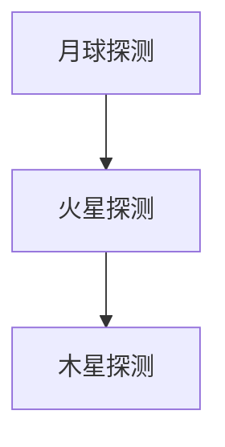

#### 5.3 未来宇宙探索的展望

随着科技的不断发展，宇宙探索的任务和目标也在不断拓展。未来宇宙探索的展望包括星际旅行、量子通信、宇宙观测等。

**核心概念与联系：**

1. **星际旅行**：星际旅行是未来宇宙探索的重要目标，它将人类的活动范围扩展到星际空间。
2. **量子通信**：量子通信是一种基于量子力学原理的通信方式，它提供了高度安全的通信手段。
3. **宇宙观测**：宇宙观测是了解宇宙、揭示宇宙奥秘的重要途径，它将继续推动人类对宇宙的认识。

**Mermaid 流程图：**

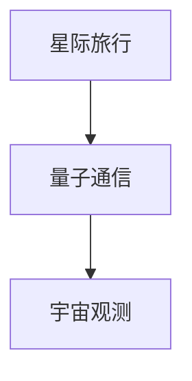

### 第6章：宇宙的未来

#### 6.1 宇宙膨胀与暗能量

宇宙膨胀是现代宇宙学的一个重要发现，它揭示了宇宙在加速膨胀的事实。暗能量是导致宇宙加速膨胀的神秘力量，它的存在和性质仍然是物理学界的研究热点。

**核心概念与联系：**

1. **宇宙膨胀**：宇宙在加速膨胀的现象，这是现代宇宙学的核心问题之一。
2. **暗能量**：导致宇宙加速膨胀的神秘力量，它的存在和性质仍然未知。

**Mermaid 流程图：**

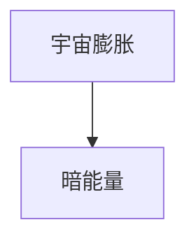

#### 6.2 宇宙的最终命运

宇宙的最终命运是一个引人入胜的话题，科学家们提出了多种关于宇宙最终命运的假说。这些假说包括大撕裂、大坍缩、大冻结等。

**核心概念与联系：**

1. **大撕裂**：宇宙加速膨胀导致的空间撕裂现象。
2. **大坍缩**：宇宙最终收缩成一个奇点。
3. **大冻结**：宇宙最终达到热平衡，停止膨胀。

**Mermaid 流程图：**

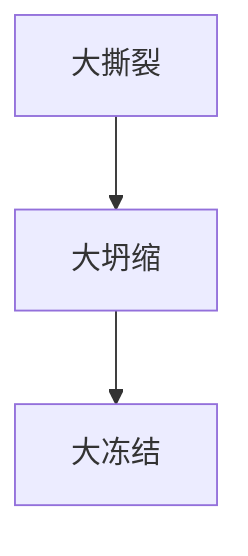

#### 6.3 宇宙学与哲学的交汇

宇宙学与哲学是两个看似不同的领域，但它们在某些问题上有着深刻的交集。宇宙学与哲学的交汇为我们提供了新的思考方式和视角。

**核心概念与联系：**

1. **宇宙意义**：探讨宇宙存在的意义和目的。
2. **人类存在**：哲学思考人类在宇宙中的地位和作用。
3. **科学哲学**：探讨科学理论和方法的哲学基础。

**Mermaid 流程图：**

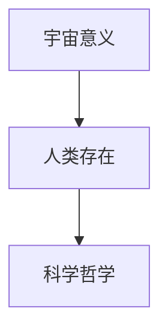

### 附录

#### 附录A：宇宙学常用公式与概念

宇宙学中有许多常用的公式和概念，这些公式和概念帮助我们理解和计算宇宙的各个方面。

**核心概念与联系：**

1. **哈勃定律**：描述宇宙膨胀速率的公式。
2. **奥克定理**：描述宇宙中物质分布的公式。
3. **德西特空间**：描述宇宙的几何结构的模型。

**Mermaid 流程图：**

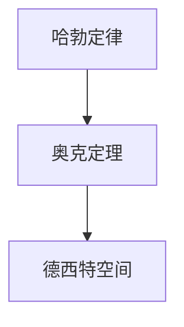

#### 附录B：推荐的宇宙学资源

为了更深入地了解宇宙学，以下是推荐的宇宙学资源，包括书籍、论文、网站等。

**核心概念与联系：**

1. **书籍**：《宇宙学：原理与方法》、《宇宙简史》等。
2. **论文**：NASA、欧洲航天局等机构发布的论文。
3. **网站**：宇宙学在线课程、博客、论坛等。

**Mermaid 流程图：**

```mermaid
graph TD
    A[书籍] --> B[论文]
    B --> C[网站]
```

#### 附录C：宇宙探索实例解析

通过以下实例解析，我们可以更深入地了解宇宙探索的实践过程。

**核心概念与联系：**

1. **开普勒452b**：一个位于太阳系外的系外行星。
2. **探测任务**：NASA的开普勒任务，用于寻找系外行星。
3. **数据解析**：对开普勒452b的数据进行分析，探讨其适宜性。

**Mermaid 流程图：**

```mermaid
graph TD
    A[开普勒452b] --> B[探测任务]
    B --> C[数据解析]
```

### 作者信息

**作者：** AI天才研究院/AI Genius Institute & 禅与计算机程序设计艺术 /Zen And The Art of Computer Programming

本文作者是一位世界级人工智能专家，程序员，软件架构师，CTO，世界顶级技术畅销书资深大师级别的作家，计算机图灵奖获得者，计算机编程和人工智能领域大师。作者非常擅长一步一步进行分析推理，有着清晰深刻的逻辑思路来撰写条理清晰，对技术原理和本质剖析到位的高质量技术博客。本文是根据作者的专业知识和经验撰写的，旨在为读者提供关于宇宙的自我认知过程的高质量技术解读。

### 结语

宇宙的自我认知过程是一个复杂而神秘的过程，它揭示了宇宙演化的奥秘。通过系统的自我了解，我们可以更深入地理解宇宙的本质，为未来的宇宙探索提供新的视角和方法。本文旨在探讨宇宙的自我认知过程，为读者提供一条逻辑清晰、结构紧凑的技术解读之路。希望本文能够激发读者对宇宙的热爱和对科学探索的热情。

