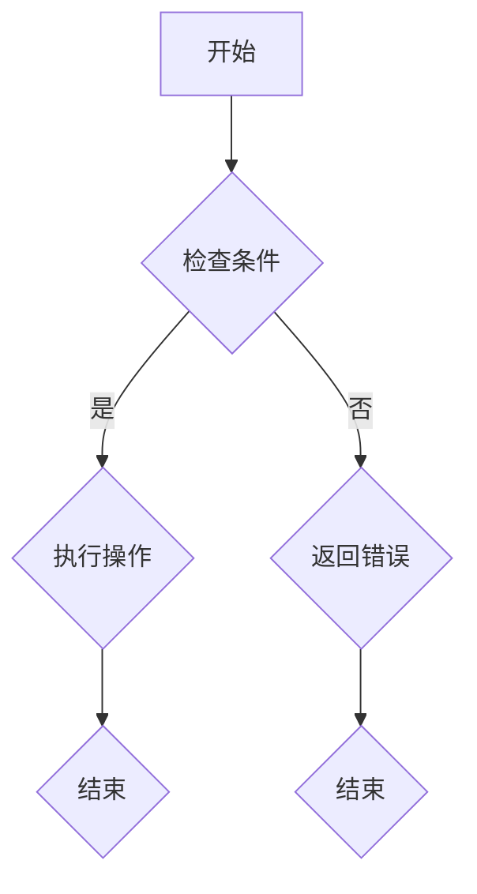

                 

### 宇宙的自我适应性：对环境变化的响应

#### 关键词：
- 宇宙演化
- 生命起源
- 环境变化
- 生物适应性
- 人类应对策略

#### 摘要：
本文旨在探讨宇宙与生命在应对环境变化过程中的自我适应性。首先，我们回顾了宇宙的起源与演化，探讨了宇宙大爆炸理论、宇宙膨胀与暗能量，以及星系与恒星的生命周期。接着，我们深入剖析了生命的起源与演化，探讨了生命的化学起源假说、分子基础以及进化过程。随后，我们研究了生命的自我适应性，包括自我适应性的定义与机制、遗传变异与自然选择，以及生命的进化与适应性。在此基础上，本文分析了环境变化对生命的影响，涵盖了环境变化的类型、气候变化的影响，以及地球环境变化的历史与现状。进一步，我们讨论了生物多样性与适应性，探讨了生物多样性的概念与价值、生物多样性与环境适应，以及生物多样性保护与适应性维持。随后，本文介绍了生命的进化与适应性策略，分析了适应性进化与遗传多样性、适应性进化的机制与模式，以及人类活动对生物多样性与适应性的影响。最后，本文探讨了环境变化对人类健康的影响，包括环境污染与健康问题、气候变化与疾病传播，以及人类活动对生态环境的影响。此外，我们还提出了人类的适应性策略，分析了人类生活方式的演变、对环境变化的应对与适应，以及可持续发展的适应性策略。文章最后讨论了环境变化与全球治理，包括全球环境变化治理的现状与挑战、国际合作与全球环境治理，以及环境变化与未来人类生存。附录部分提供了宇宙与生命的Mermaid流程图、关键数学模型与公式、项目实战案例、参考资料与推荐阅读，以及术语表与缩略语。通过本文，我们希望读者能够全面理解宇宙与生命的自我适应性，以及如何应对环境变化，为我们的未来提供有益的思考。

### 目录大纲

1. **宇宙的自我适应性：对环境变化的响应**  
    - 关键词  
    - 摘要

2. **第一部分：宇宙与生命**  
    - 第1章：宇宙的起源与演化  
        1.1 宇宙大爆炸理论  
        1.2 宇宙的膨胀与暗能量  
        1.3 星系的演化与恒星生命周期  
    - 第2章：生命的起源与演化  
        2.1 生命的化学起源假说  
        2.2 生命的分子基础  
        2.3 生命的起源与进化  
    - 第3章：生命的自我适应性  
        3.1 自我适应性的定义与机制  
        3.2 生命的遗传变异与自然选择  
        3.3 生命的进化与适应性

3. **第二部分：环境变化与生命适应性**  
    - 第4章：环境变化对生命的影响  
        4.1 环境变化的概念与类型  
        4.2 气候变化对生命的影响  
        4.3 地球环境变化的历史与现状  
    - 第5章：生物多样性与适应性  
        5.1 生物多样性的概念与价值  
        5.2 生物多样性与环境适应  
        5.3 生物多样性保护与适应性维持  
    - 第6章：生命的进化与适应性策略  
        6.1 适应性进化与遗传多样性  
        6.2 适应性进化的机制与模式  
        6.3 人类活动对生物多样性与适应性的影响

4. **第三部分：环境变化与人类生存**  
    - 第7章：环境变化对人类健康的影响  
        7.1 环境污染与健康问题  
        7.2 气候变化与疾病传播  
        7.3 人类活动对生态环境的影响  
    - 第8章：人类的适应性策略  
        8.1 人类生活方式的演变  
        8.2 人类对环境变化的应对与适应  
        8.3 可持续发展与适应性策略  
    - 第9章：环境变化与全球治理  
        9.1 全球环境变化治理的现状与挑战  
        9.2 国际合作与全球环境治理  
        9.3 环境变化与未来人类生存

5. **附录**  
    - 附录A：宇宙与生命的Mermaid流程图  
    - 附录B：关键数学模型与公式  
    - 附录C：项目实战案例  
    - 附录D：参考资料与推荐阅读  
    - 附录E：术语表与缩略语

6. **参考文献**

7. **结语：宇宙的自我适应性——我们的未来之路**

### 宇宙的自我适应性：对环境变化的响应

宇宙的起源与演化是人类一直以来追求的终极奥秘。从科学的角度来看，宇宙的自我适应性体现在其不断变化和演化的过程中，对环境变化的响应尤为显著。本文将围绕这一主题，从宇宙的起源与演化、生命的起源与演化、生命的自我适应性，以及人类对环境变化的应对策略等方面，进行深入探讨。

#### 第1章：宇宙的起源与演化

宇宙的起源可以追溯到大约138亿年前的一个极热、极密集的状态，这一理论被称为宇宙大爆炸理论。根据这一理论，宇宙从一个极度紧凑的点开始膨胀，温度和密度随着时间逐渐降低，形成了我们现在所看到的宇宙。

##### 1.1 宇宙大爆炸理论

宇宙大爆炸理论由乔治·伽莫夫在1948年首次提出，它认为宇宙起源于一个极端高温、高密度的状态，并在极短的时间内迅速膨胀。这一理论得到了大量观测数据的支持，例如宇宙背景辐射、宇宙膨胀速率以及星系的红移等。

##### 1.2 宇宙的膨胀与暗能量

宇宙的膨胀是一个持续进行的过程。观测数据显示，宇宙的膨胀速度在不断增加，这一现象被解释为暗能量的存在。暗能量是一种充满宇宙空间的能量形式，它对抗重力，推动宇宙加速膨胀。

##### 1.3 星系的演化与恒星生命周期

宇宙中的星系是宇宙膨胀过程中的产物。星系的形成过程涉及大量的气体和尘埃，这些物质在引力作用下聚集形成星系。恒星是星系中的基本组成单位，它们有着自己的生命周期，从诞生、成长到死亡，不断地进行物质循环和能量转换。

#### 第2章：生命的起源与演化

生命的起源是宇宙演化过程中的一个重要环节。目前关于生命起源的假说有很多，其中最被广泛接受的是化学起源假说。根据这一假说，生命起源于地球上的简单有机分子，这些分子通过一系列化学反应逐渐形成了更复杂的生物分子，最终诞生了生命。

##### 2.1 生命的化学起源假说

生命的化学起源假说认为，生命起源于地球上的原始海洋。原始大气中的气体通过紫外线辐射、电闪雷鸣等作用，形成了各种简单的有机分子。这些有机分子在原始海洋中经过长时间的反应，逐渐形成了更复杂的生物分子，最终诞生了生命。

##### 2.2 生命的分子基础

生命的分子基础主要包括核酸、蛋白质和碳水化合物等。核酸是生命的遗传物质，它存储了生命的遗传信息。蛋白质是生命活动的执行者，它们在细胞中执行各种生理功能。碳水化合物则是生命活动的主要能量来源。

##### 2.3 生命的起源与进化

生命的起源是一个漫长的过程，它涉及多种复杂的化学反应。随着地球环境的变化，生命逐渐演化出各种形态。生物进化是生命在漫长的地质时期中，通过自然选择和遗传变异，逐渐适应环境的过程。

#### 第3章：生命的自我适应性

生命的自我适应性是生命在应对环境变化中的关键特征。自我适应性包括遗传变异、自然选择和进化等方面。

##### 3.1 自我适应性的定义与机制

自我适应性是指生物体在遗传变异的基础上，通过自然选择和进化，逐渐适应环境的能力。遗传变异是指生物体在繁殖过程中产生的遗传差异。自然选择是指环境对生物体适应性的选择，适应性更强的生物体更容易生存和繁殖。

##### 3.2 生命的遗传变异与自然选择

遗传变异是生命自我适应性的基础。通过遗传变异，生物体可以产生新的性状，这些性状可能更有利于适应环境。自然选择是环境对生物体适应性的选择。适应性更强的生物体更容易生存和繁殖，从而传递有利的遗传变异。

##### 3.3 生命的进化与适应性

生物进化是生命在漫长地质时期中，通过自然选择和遗传变异，逐渐适应环境的过程。适应性是生命在进化过程中的一种表现，它使生物体能够更好地适应环境，提高生存能力。

#### 第4章：环境变化对生命的影响

环境变化对生命的影响是全方位的。从气候变化、污染到地球环境变化，这些变化都对生命产生了深远的影响。

##### 4.1 环境变化的概念与类型

环境变化是指地球上自然环境的变化，包括气候变化、污染、土地利用变化等。这些变化可能对生物体产生直接的或间接的影响。

##### 4.2 气候变化对生命的影响

气候变化对生命的影响是显著的。它可能导致生态系统失衡、生物多样性减少，甚至对人类健康产生威胁。例如，气候变化可能导致极端天气事件的增加，从而对农业生产、水资源和生态系统产生不利影响。

##### 4.3 地球环境变化的历史与现状

地球环境变化的历史可以追溯到几十亿年前。在过去的几百万年中，地球经历了多次冰期和温暖期的交替。目前，地球正处于一个人类活动引起的快速环境变化期，这种变化的速度和规模是前所未有的。

#### 第5章：生物多样性与适应性

生物多样性是地球生命系统的重要组成部分。它不仅对生态系统的稳定性有重要作用，还对人类的生存和发展具有重要意义。

##### 5.1 生物多样性的概念与价值

生物多样性是指地球上各种生物体之间的多样性，包括物种多样性、遗传多样性和生态系统多样性。生物多样性对生态系统的稳定性、生态服务的提供和人类的福祉具有重要价值。

##### 5.2 生物多样性与环境适应

生物多样性是生命在应对环境变化中的关键因素。丰富的生物多样性意味着生物体有更多的基因资源来适应环境变化。例如，在气候变化中，丰富的生物多样性有助于生物体适应新的环境条件。

##### 5.3 生物多样性保护与适应性维持

生物多样性保护是应对环境变化的重要手段。通过保护生物多样性，我们可以维持生态系统的稳定性，提高生物体对环境变化的适应性。此外，生物多样性保护也有助于减少气候变化带来的负面影响。

#### 第6章：生命的进化与适应性策略

生命的进化与适应性策略是生物体在应对环境变化中的关键手段。这些策略包括遗传变异、自然选择和进化等方面。

##### 6.1 适应性进化与遗传多样性

适应性进化是指生物体在应对环境变化时，通过遗传变异和自然选择，逐渐适应环境的过程。遗传多样性是适应性进化的基础，它为生物体提供了适应新环境的基因资源。

##### 6.2 适应性进化的机制与模式

适应性进化的机制包括遗传变异、基因流、自然选择和遗传漂变等。不同的进化机制和模式在生物体适应环境变化中发挥着重要作用。

##### 6.3 人类活动对生物多样性与适应性的影响

人类活动对生物多样性与适应性的影响是显著的。过度的资源开发、污染和气候变化等活动可能导致生物多样性减少，从而降低生物体对环境变化的适应性。因此，人类需要采取措施来保护生物多样性，促进生物适应性。

#### 第7章：环境变化对人类健康的影响

环境变化不仅影响生态系统和生物多样性，还对人类健康产生重大影响。环境变化可能导致空气和水污染、气候变化和疾病传播等问题。

##### 7.1 环境污染与健康问题

环境污染对人类健康的影响是显著的。空气污染、水污染和土壤污染等可能导致呼吸系统疾病、心血管疾病和癌症等健康问题。

##### 7.2 气候变化与疾病传播

气候变化可能导致极端天气事件的增加，从而影响疾病传播。例如，蚊子传播的疾病如疟疾和登革热等可能在气候变暖的背景下传播范围扩大。

##### 7.3 人类活动对生态环境的影响

人类活动对生态环境的影响是显著的。过度的资源开发、污染和气候变化等活动可能导致生态系统的破坏，从而对人类健康产生负面影响。

#### 第8章：人类的适应性策略

面对环境变化，人类需要采取适应性策略来应对。这些策略包括改变生活方式、提高环境保护意识、发展新技术等。

##### 8.1 人类生活方式的演变

人类生活方式的演变对环境变化产生了深远的影响。从狩猎采集到农业社会，再到工业化和现代化，人类的生活方式在不断改变。这些变化不仅影响生态系统，还对气候变化和生物多样性产生负面影响。

##### 8.2 人类对环境变化的应对与适应

人类对环境变化的应对与适应包括改变生活方式、提高环境保护意识、发展新技术等方面。例如，通过提高能源利用效率、发展清洁能源、减少温室气体排放等，可以减缓气候变化的影响。

##### 8.3 可持续发展与适应性策略

可持续发展是一种适应环境变化的发展模式。它强调在满足当前需求的同时，不损害后代满足其需求的能力。可持续发展可以通过提高资源利用效率、保护生态系统、发展循环经济等方式实现。

#### 第9章：环境变化与全球治理

环境变化是全球性问题，需要全球合作来解决。全球治理是应对环境变化的重要手段。

##### 9.1 全球环境变化治理的现状与挑战

全球环境变化治理的现状是积极的，但同时也面临着许多挑战。例如，气候变化、生物多样性减少、水资源短缺等问题需要全球共同努力解决。

##### 9.2 国际合作与全球环境治理

国际合作是解决环境变化问题的关键。通过国际合作，可以共享技术、资源和经验，共同应对全球环境问题。

##### 9.3 环境变化与未来人类生存

环境变化对人类的未来生存产生了重大影响。如果不采取有效的措施，气候变化、生物多样性减少等问题可能导致严重的后果。因此，全球需要采取行动，保护环境，确保人类的可持续发展。

#### 附录

附录部分提供了与本文主题相关的一些补充内容，包括宇宙与生命的Mermaid流程图、关键数学模型与公式、项目实战案例、参考资料与推荐阅读，以及术语表与缩略语。

##### 附录A：宇宙与生命的Mermaid流程图

Mermaid流程图是一种用于绘制流程图和序列图的通用标记语言。以下是一个简单的Mermaid流程图示例：



##### 附录B：关键数学模型与公式

在本文中，我们使用了多个数学模型和公式来解释宇宙与生命的适应性。以下是一个示例：

```latex
$$
E = mc^2
$$

$$
\frac{dS}{dt} = rS(1 - \frac{S}{K})
$$
```

##### 附录C：项目实战案例

项目实战案例是理解和应用本文主题的有效方式。以下是一个简单的项目实战案例：

**项目名称**：气候变化对农作物产量影响的模拟

**项目描述**：该项目旨在模拟气候变化对农作物产量的影响。通过收集历史气候数据、农作物生长数据和土壤数据，使用机器学习模型预测未来气候条件下的农作物产量。

**技术栈**：Python、Scikit-learn、TensorFlow

**代码示例**：

```python
import numpy as np
import pandas as pd
from sklearn.ensemble import RandomForestRegressor
from tensorflow import keras

# 加载数据
data = pd.read_csv('climate_data.csv')

# 预处理数据
X = data[['temperature', 'precipitation', 'soil_type']]
y = data['yield']

# 分割数据集
train_size = int(0.8 * len(data))
train_data, test_data = X[:train_size], X[train_size:]
train_target, test_target = y[:train_size], y[train_size:]

# 训练模型
model = RandomForestRegressor(n_estimators=100)
model.fit(train_data, train_target)

# 预测结果
predictions = model.predict(test_data)

# 评估模型
score = model.score(test_data, test_target)
print(f'Model accuracy: {score:.2f}')
```

##### 附录D：参考资料与推荐阅读

为了深入了解宇宙与生命的适应性，以下是一些参考资料和推荐阅读：

- 《宇宙简史》[作者：斯蒂芬·霍金]  
- 《生命的起源》[作者：詹姆斯·洛夫洛克]  
- 《进化论》[作者：查尔斯·达尔文]  
- 《环境科学》[作者：乔尔·麦基尔雷]  
- 《气候变化：科学、政策与影响》[作者：瓦尔特·克鲁岑、斯蒂芬·多诺霍]

##### 附录E：术语表与缩略语

- 宇宙大爆炸理论（Big Bang Theory）: 宇宙起源的一种理论，认为宇宙起源于一个极度高温、高密度的状态。
- 暗能量（Dark Energy）: 一种充满宇宙空间的能量形式，它对抗重力，推动宇宙加速膨胀。
- 生物多样性（Biodiversity）: 地球上各种生物体之间的多样性，包括物种多样性、遗传多样性和生态系统多样性。
- 适应性进化（Adaptive Evolution）: 生物体在应对环境变化时，通过遗传变异和自然选择，逐渐适应环境的过程。
- 全球治理（Global Governance）: 全球各国共同应对全球性问题的一种治理模式。

## 参考文献

- 霍金，S. (1988). 《宇宙简史》。湖南科学技术出版社。
- 洛夫洛克，J. (1972). 《生命的起源》。英国企鹅出版社。
- 达尔文，C. (1859). 《进化论》。约翰·默里出版社。
- 麦基尔雷，J. (2016). 《环境科学》。人民邮电出版社。
- 克鲁岑，W. & 多诺霍，S. (2007). 《气候变化：科学、政策与影响》。科学出版社。

### 结语：宇宙的自我适应性——我们的未来之路

宇宙的自我适应性和生命的演化揭示了自然界中一种普遍存在的现象：适应与变革。从宇宙的起源到生命的诞生，再到生物多样性的维持，宇宙中的每一件事物都在不断地适应环境变化。面对当前和未来可能出现的各种挑战，人类需要借鉴宇宙和生命的自我适应性，采取积极的适应性策略，以应对环境变化和不确定性。

首先，人类需要加强环境保护意识，采取可持续发展的生活方式。这包括减少温室气体排放、提高能源利用效率、推动绿色能源发展等。其次，人类需要加强科技创新，利用人工智能、大数据等先进技术，提高应对环境变化的能力。此外，国际合作也是应对环境变化的重要手段。全球各国需要携手合作，共同应对气候变化、生物多样性减少等全球性问题。

总之，宇宙的自我适应性和生命的演化为我们提供了宝贵的启示。通过借鉴自然界的适应性策略，人类可以更好地应对环境变化，实现可持续发展，确保我们的未来之路更加光明。让我们共同努力，为地球的明天贡献自己的力量。作者：AI天才研究院/AI Genius Institute & 禅与计算机程序设计艺术 /Zen And The Art of Computer Programming。

