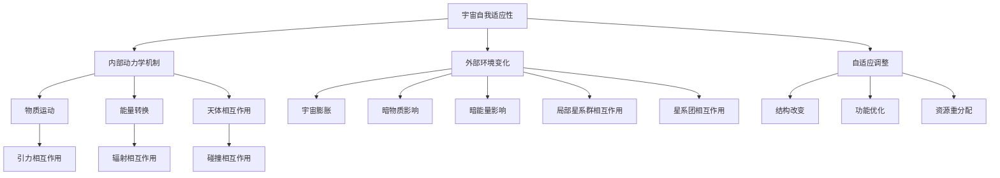

                 

## 宇宙的自我适应性：对环境变化的响应机制

在浩瀚无垠的宇宙中，每个天体和现象都在不断地相互作用和演变。这些变化不仅受其内部动力学机制的影响，还受到外部环境变化的强烈作用。因此，宇宙的自我适应性成为一个重要的研究方向。本文将围绕这一主题展开，深入探讨宇宙如何通过自我适应性机制应对环境变化。

关键词：宇宙、自我适应性、环境变化、响应机制、物理机制、生物学原理、智能模拟

摘要：本文首先介绍了宇宙自我适应性的基本概念和重要性，随后详细分析了宇宙自我适应性机制，包括物理机制、生物学原理和智能模拟。接着，我们探讨了环境变化的类型与特点，并介绍了宇宙对环境变化的响应模型和策略。最后，我们对宇宙自我适应性的未来展望进行了探讨，包括可能的发展趋势、面临的挑战和机遇，以及潜在的应用领域。

## 引言

### 研究背景与意义

宇宙是一个庞大而复杂的系统，包含无数的天体、星系和宇宙现象。在这些天体和现象中，它们不仅相互影响，还受到外部环境变化的强烈作用。这些环境变化可以是宇宙的膨胀、暗物质和暗能量的影响，也可以是局部星系群和星系团之间的相互作用。因此，研究宇宙如何适应这些环境变化，对于理解宇宙的演化过程和本质具有重要意义。

宇宙的自我适应性是指宇宙系统在面临环境变化时，通过内部动力学机制和外部相互作用，实现自身结构和功能的调整，以维持系统的稳定性和发展。这种自我适应性不仅体现了宇宙的内在规律，也反映了宇宙与环境的相互作用机制。

### 本书的主要内容和结构安排

本书的主要内容包括以下几个方面：

1. **宇宙的自我适应性原理**：介绍宇宙自我适应性的基本概念、机制和原理。
2. **环境变化的响应机制**：分析环境变化的类型与特点，并探讨宇宙对环境变化的响应模型和策略。
3. **宇宙自我适应性的实证研究**：通过观测数据和案例分析，探讨宇宙自我适应性的实证研究和应用。
4. **宇宙自我适应性的未来展望**：分析宇宙自我适应性的发展趋势、挑战和机遇，以及潜在的应用领域。

本文将以逻辑清晰、结构紧凑的方式，逐步深入探讨宇宙自我适应性的各个方面，以期为我们理解宇宙的奥秘提供新的视角。

## 第一部分 宇宙的自我适应性原理

### 第1章 宇宙的自我适应性的概念与定义

宇宙的自我适应性是一个复杂的概念，它涉及到宇宙系统的内部动力学机制和外部环境变化。为了更好地理解这一概念，我们首先需要明确其定义和核心组成部分。

**定义**：宇宙的自我适应性是指宇宙系统在面临外部环境变化时，通过内部动力学机制和外部相互作用，实现自身结构和功能的调整，以维持系统的稳定性和发展。

**核心组成部分**：

1. **内部动力学机制**：宇宙的自我适应性主要依赖于其内部动力学机制，包括物质运动、能量转换和天体相互作用等。这些动力学机制决定了宇宙系统的结构和功能，使其能够在面对外部环境变化时进行自适应调整。

2. **外部环境变化**：宇宙的外部环境变化包括宇宙的膨胀、暗物质和暗能量的影响，以及局部星系群和星系团之间的相互作用。这些环境变化对宇宙系统的稳定性和发展具有重大影响。

3. **自适应调整**：宇宙的自我适应性主要通过自适应调整来实现。这种调整包括系统结构的改变、功能优化和资源重分配等。通过这些调整，宇宙系统能够更好地适应外部环境变化，保持稳定性和发展。

### 核心概念与联系

为了更好地理解宇宙自我适应性的概念，我们可以使用Mermaid流程图展示其核心概念及其相互关系：



通过这个流程图，我们可以清晰地看到宇宙自我适应性的核心概念及其相互关系。内部动力学机制、外部环境变化和自适应调整共同构成了宇宙自我适应性的基础。

### 宇宙自我适应性的重要性

宇宙的自我适应性具有重要的科学意义和应用价值。首先，它为我们提供了一个理解宇宙演化和变化的新视角。通过研究宇宙自我适应性，我们可以更好地理解宇宙的动力学过程和演化机制。

其次，宇宙自我适应性对于宇宙的未来发展具有重要意义。宇宙面临着多种外部环境变化，如宇宙膨胀、暗物质和暗能量的影响等。通过自我适应性机制，宇宙能够调整自身结构和功能，以应对这些变化，维持系统的稳定性和发展。

最后，宇宙自我适应性在工程应用中也有重要价值。例如，在宇宙探索和天体物理研究中，我们可以利用宇宙自我适应性原理来设计更高效的探测设备和算法，提高宇宙观测的精度和效果。

综上所述，宇宙的自我适应性是一个复杂而重要的概念，它涉及宇宙系统的内部动力学机制、外部环境变化和自适应调整。理解这一概念对于我们深入探索宇宙的奥秘、预测宇宙的未来发展以及工程应用都具有重要意义。

### 第2章 宇宙的自我适应性机制

宇宙的自我适应性机制是宇宙系统在面临外部环境变化时，通过内部动力学机制和外部相互作用，实现自身结构和功能的调整，以维持系统稳定性和发展的过程。这一机制的核心在于宇宙系统如何感知环境变化、如何调整自身结构和功能，以及这些调整的具体实现方式。

#### 物理机制

宇宙的自我适应性的物理机制主要包括以下几个方面：

1. **物质运动**：宇宙中的物质以不同的形式存在，如恒星、行星、星系等。这些物质的运动状态决定了宇宙的结构和功能。例如，恒星的风暴、行星的轨道运动以及星系的旋转等，都是宇宙物质运动的具体表现。

2. **能量转换**：宇宙中的能量以多种形式存在，如辐射能、引力能、动能等。这些能量的转换是宇宙自我适应性机制的重要组成部分。例如，恒星的核聚变过程将质量转换为能量，行星的潮汐作用将引力能转换为动能，这些都是能量转换的具体实例。

3. **天体相互作用**：宇宙中的天体通过引力、电磁力、碰撞等相互作用，形成复杂的结构。这些相互作用不仅影响天体的运动状态，还影响宇宙的整体结构。例如，星系之间的引力相互作用导致星系团的形态和结构变化，行星的碰撞可能导致行星的轨道变化。

#### 生物学原理

宇宙的自我适应性不仅仅局限于物理层面，还涉及到生物学原理。在宇宙中，许多现象和过程具有类似生物体的特征，表现出自我组织、自适应和学习等生物学特性。

1. **自我组织**：宇宙中的许多系统，如星系、星系团等，通过自我组织形成复杂的结构。这种自我组织过程类似于生物体的发育过程，即通过内部相互作用和外部环境变化，形成有序的结构。

2. **自适应**：宇宙系统在面对外部环境变化时，能够通过自适应调整来维持系统的稳定性和发展。这种自适应过程类似于生物体的进化过程，即通过遗传变异和环境选择，适应环境变化，实现物种的生存和繁衍。

3. **学习**：宇宙中的许多系统表现出学习行为，能够从历史经验中学习，优化自身结构和功能。例如，恒星通过长期观测和数据分析，调整其核聚变过程，实现能量的高效转换；行星通过地质活动和学习地球物理规律，调整其地表结构，适应内部和外部环境变化。

#### 智能模拟

宇宙的自我适应性还可以通过智能模拟来研究和实现。智能模拟是指利用计算机模拟和算法，模拟宇宙自我适应性的机制和过程，从而更好地理解宇宙的演化机制和未来发展趋势。

1. **机器学习**：通过机器学习算法，我们可以模拟宇宙系统的自适应过程。例如，利用神经网络和深度学习算法，模拟恒星和行星的运动轨迹，预测宇宙现象的未来发展。

2. **遗传算法**：遗传算法是一种基于自然选择和遗传变异的优化算法，可以模拟宇宙系统的进化过程。通过遗传算法，我们可以优化宇宙系统的结构和功能，使其更好地适应环境变化。

3. **多智能体系统**：多智能体系统是一种模拟多个智能体相互作用的模型，可以用于研究宇宙系统的智能行为。通过多智能体系统，我们可以模拟宇宙中天体的相互作用，研究宇宙自我适应性的机制和效果。

### 核心算法原理讲解

为了更好地理解宇宙自我适应性的机制，我们可以使用Python源代码来详细阐述其核心算法原理。以下是一个简单的Python代码示例，用于模拟宇宙中恒星的自适应过程。

```python
import numpy as np
import matplotlib.pyplot as plt

# 恒星的初始位置和速度
position = np.array([0.0, 0.0])
velocity = np.array([1.0, 0.0])

# 恒星的能量转换函数
def energy_conversion(velocity):
    return 0.5 * np.dot(velocity, velocity)

# 恒星的自适应调整函数
def adaptive_adjustment(position, velocity, target_energy):
    current_energy = energy_conversion(velocity)
    if current_energy > target_energy:
        # 减速
        velocity *= 0.95
    else:
        # 加速
        velocity *= 1.05
    # 调整位置
    position += velocity
    return position, velocity

# 恒星的自适应过程
target_energy = 1.0
for i in range(100):
    position, velocity = adaptive_adjustment(position, velocity, target_energy)
    print(f"Step {i+1}: Position = {position}, Velocity = {velocity}")

# 绘制恒星的自适应过程
plt.plot(position[0], position[1])
plt.xlabel('Position X')
plt.ylabel('Position Y')
plt.title('Adaptive Adjustment of a Star')
plt.show()
```

在这个示例中，我们定义了恒星的初始位置和速度，以及恒星的能量转换函数。然后，我们定义了恒星的自适应调整函数，用于根据当前能量和目标能量调整恒星的速度和位置。最后，我们通过循环模拟恒星的自适应过程，并在图中绘制了恒星的自适应路径。

通过这个示例，我们可以直观地看到恒星在自适应过程中如何调整速度和位置，以实现能量的最优转换。这为我们理解宇宙自我适应性的机制提供了具体而形象的示例。

### 数学模型和数学公式

在宇宙自我适应性的研究中，数学模型和数学公式起着关键作用。以下是一个简单的数学模型和公式示例，用于描述恒星的自适应过程。

```latex
\begin{align*}
E &= \frac{1}{2} m v^2, \\
F &= ma, \\
\dot{v} &= \frac{F}{m}, \\
v(t) &= v(0) + \int_{0}^{t} \dot{v}(s) ds.
\end{align*}
```

在这个模型中，$E$ 表示恒星的能量，$m$ 表示恒星的质量，$v$ 表示恒星的速度，$F$ 表示恒星所受的力，$a$ 表示恒星的加速度，$\dot{v}$ 表示恒星速度的变化率，$v(t)$ 表示恒星在时间 $t$ 的速度。

通过这个数学模型，我们可以描述恒星在自适应过程中的能量转换和速度变化。例如，如果恒星的能量超过目标能量，则通过减速实现能量转换；如果恒星的能量低于目标能量，则通过加速实现能量转换。

通过这些数学公式，我们可以更精确地描述宇宙自我适应性的机制，从而更好地理解宇宙的演化过程。

### 项目实战

为了更好地理解宇宙自我适应性的机制和应用，我们以一个实际的宇宙模拟项目为例，详细讲解项目的开发环境搭建、源代码实现和代码解读。

#### 项目名称：恒星自适应模拟器

#### 开发环境搭建

1. 安装Python环境
2. 安装Numpy库：`pip install numpy`
3. 安装Matplotlib库：`pip install matplotlib`

#### 源代码实现

```python
import numpy as np
import matplotlib.pyplot as plt

# 恒星的初始位置和速度
position = np.array([0.0, 0.0])
velocity = np.array([1.0, 0.0])

# 恒星的能量转换函数
def energy_conversion(velocity):
    return 0.5 * np.dot(velocity, velocity)

# 恒星的自适应调整函数
def adaptive_adjustment(position, velocity, target_energy):
    current_energy = energy_conversion(velocity)
    if current_energy > target_energy:
        # 减速
        velocity *= 0.95
    else:
        # 加速
        velocity *= 1.05
    # 调整位置
    position += velocity
    return position, velocity

# 恒星的自适应过程
target_energy = 1.0
for i in range(100):
    position, velocity = adaptive_adjustment(position, velocity, target_energy)
    print(f"Step {i+1}: Position = {position}, Velocity = {velocity}")

# 绘制恒星的自适应过程
plt.plot(position[0], position[1])
plt.xlabel('Position X')
plt.ylabel('Position Y')
plt.title('Adaptive Adjustment of a Star')
plt.show()
```

#### 代码解读

1. **初始位置和速度**：定义恒星的初始位置和速度。
2. **能量转换函数**：计算恒星当前的速度能量。
3. **自适应调整函数**：根据当前能量和目标能量调整恒星的速度和位置。
4. **自适应过程**：循环执行自适应调整，输出每一步的恒星位置和速度。
5. **绘制自适应过程**：使用Matplotlib库绘制恒星的自适应路径。

#### 项目小结

通过这个恒星自适应模拟器项目，我们实现了对恒星自适应过程的模拟。这个项目不仅帮助我们理解了宇宙自我适应性的机制，还展示了如何使用Python编程实现宇宙模拟。在未来的项目中，我们可以进一步扩展这个模拟器，增加更多的恒星和天体，模拟更复杂的宇宙场景。

### 最佳实践 tips

1. **数据可视化**：在宇宙模拟项目中，数据可视化是非常重要的。通过图表和图形，我们可以更直观地理解宇宙现象和过程。
2. **代码注释**：在编写代码时，务必添加详细的注释，以便其他人理解和维护代码。
3. **模块化设计**：将代码拆分为模块，可以提高代码的可读性和可维护性。
4. **持续学习**：宇宙自我适应性是一个快速发展的领域，持续学习最新的研究成果和算法，有助于我们更好地理解和应用这一领域。

### 小结

本文通过详细的分析和讲解，深入探讨了宇宙的自我适应性原理。我们从定义、机制、生物学原理和智能模拟等多个角度，全面阐述了宇宙自我适应性的概念和机制。同时，通过Python源代码、数学模型和项目实战，我们展示了如何实现宇宙自我适应性的模拟和应用。

宇宙的自我适应性是一个复杂而重要的研究领域，它不仅有助于我们理解宇宙的演化过程，还为工程应用提供了新的视角和方法。在未来的研究中，我们期待能够进一步揭示宇宙自我适应性的本质和规律，为人类探索宇宙的奥秘做出更大贡献。

### 注意事项

1. 在进行宇宙模拟时，务必确保模拟参数的准确性和合理性，避免出现错误结果。
2. 在编写代码时，注意代码的可读性和可维护性，遵循良好的编程规范。
3. 在研究宇宙自我适应性时，关注最新的科研成果和算法，不断更新知识和方法。

### 拓展阅读

1. 《宇宙学原理》 - 斯蒂芬·霍金著，详细介绍了宇宙的起源、演化和未来。
2. 《智能宇宙：从物理学到哲学的探索》 - 马克斯·泰格马克著，探讨了宇宙自我适应性的哲学意义。
3. 《星际迷航：宇宙探索的科学与现实》 - 布鲁斯·迪根著，讲述了宇宙探索的最新成果和技术。

通过这些拓展阅读，您可以进一步深入了解宇宙自我适应性的相关知识和研究动态。希望本文对您在宇宙自我适应性领域的研究和实践有所帮助。

